# Capítulo 05 — Enriquecendo aplicações com Pipes e Diretivas

> **Tema central:** usar diretivas para alterar estrutura, comportamento e aparência de elementos HTML, e usar pipes para transformar dados exibidos no template.

## 1. Objetivos do capítulo

Ao final deste capítulo, você deve compreender:

- o que são diretivas no Angular;
- a diferença entre componentes, diretivas estruturais e diretivas de atributo;
- como usar `*ngIf`, `*ngFor` e `ngSwitch`;
- como transformar dados no template com pipes;
- como criar pipes customizados;
- como criar diretivas customizadas;
- como trabalhar com pipes e diretivas standalone.

> **Nota de atualização:** o capítulo usa a sintaxe clássica `*ngIf`, `*ngFor` e `*ngSwitch`. Em versões modernas do Angular, especialmente a partir do Angular 17, existe a nova sintaxe de control flow com `@if`, `@for` e `@switch`. No Angular 20, as diretivas clássicas começaram a ser descontinuadas em favor da nova sintaxe. Mesmo assim, entender `ng-template`, `TemplateRef`, `ViewContainerRef`, pipes e diretivas continua sendo essencial para compreender o funcionamento interno do Angular.

---

## 2. Visão geral

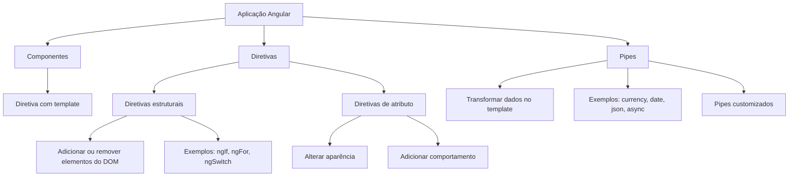

---

## 3. Diretivas no Angular

Diretivas são atributos aplicados a elementos HTML ou componentes Angular para estender comportamento, alterar aparência ou modificar a estrutura renderizada.

O Angular trabalha com três categorias principais:

| Tipo | Descrição | Exemplo |
|---|---|---|
| **Componente** | Diretiva com template associado | `app-product-detail` |
| **Diretiva estrutural** | Adiciona ou remove elementos da árvore DOM | `*ngIf`, `*ngFor` |
| **Diretiva de atributo** | Altera aparência ou comportamento de um elemento existente | `appNumeric`, `appCopyright` |

As diretivas internas mais usadas pertencem ao `CommonModule`. Em aplicações baseadas em módulos, esse módulo precisa estar importado para que diretivas como `ngIf` e `ngFor` funcionem.

---

## 4. Diretivas estruturais

Diretivas estruturais modificam a estrutura do DOM. Elas podem criar, remover ou alternar blocos inteiros de HTML.

### 4.1 `*ngIf`

A diretiva `*ngIf` adiciona ou remove um elemento do DOM conforme uma expressão booleana.

```html
<div *ngIf="product">
  <h2>Product Details</h2>
  <h3>{{ product.name }}</h3>
  <button (click)="buy()">Buy Now</button>
</div>
```

Se `product` possuir valor, o bloco aparece. Se `product` for `undefined`, `null` ou falso, o bloco é removido do DOM.

### 4.2 `*ngIf` versus `[hidden]`

```html
<div [hidden]="!product">
  <h2>Product Details</h2>
</div>
```

A propriedade `[hidden]` apenas esconde o elemento visualmente. O elemento continua existindo no DOM.

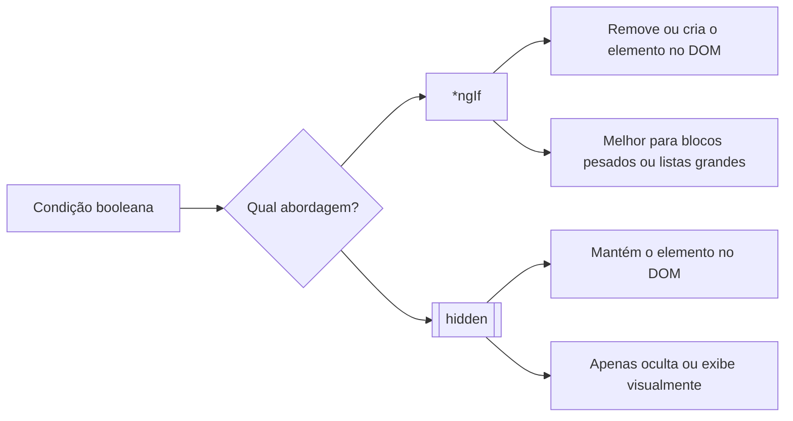

**Regra prática:**

- use `*ngIf` quando o bloco for pesado, tiver lógica complexa ou muitos filhos;
- use `[hidden]` quando o elemento deve continuar existindo e apenas alternar visibilidade.

---

## 5. `ng-template` e `else`

O asterisco em `*ngIf` é uma forma abreviada. Internamente, o Angular trabalha com `ng-template`.

Exemplo com `else`:

```html
<app-product-detail
  *ngIf="selectedProduct; else noProduct"
  [product]="selectedProduct"
  (bought)="onBuy()">
</app-product-detail>

<ng-template #noProduct>
  <p>No product selected!</p>
</ng-template>
```

O `#noProduct` é uma variável de referência de template. Quando `selectedProduct` não existe, o Angular renderiza o conteúdo do `ng-template`.

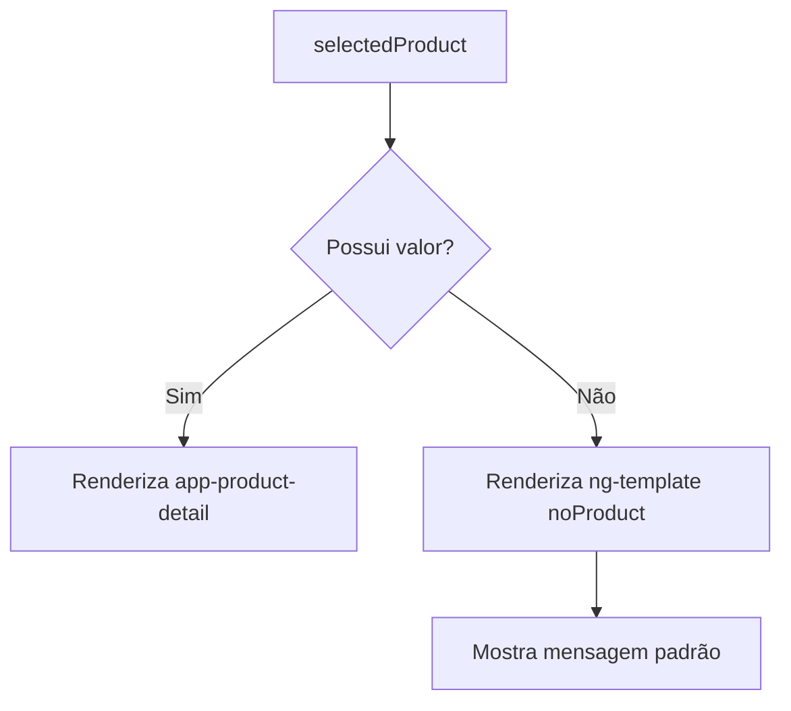

---

## 6. `*ngFor`

A diretiva `*ngFor` percorre uma coleção e renderiza um template para cada item.

```ts
products = ['Webcam', 'Microphone', 'Wireless keyboard'];
```

```html
<ul>
  <li *ngFor="let product of products" (click)="selectedProduct = product">
    {{ product }}
  </li>
</ul>
```

A variável `product` é uma variável local do template criada para cada item da coleção.

### 6.1 Variáveis locais do `ngFor`

O `ngFor` permite acessar metadados da iteração:

| Propriedade | Descrição |
|---|---|
| `index` | índice atual, começando em zero |
| `first` | indica se é o primeiro item |
| `last` | indica se é o último item |
| `even` | indica se o índice é par |
| `odd` | indica se o índice é ímpar |

Exemplo:

```html
<ul>
  <li *ngFor="let product of products; let i = index">
    {{ i + 1 }}. {{ product }}
  </li>
</ul>
```

### 6.2 Otimização com `trackBy`

Quando listas mudam, o Angular precisa sincronizar os elementos do DOM com os dados. Para listas grandes, isso pode gerar custo de performance.

Com `trackBy`, o Angular identifica cada item por uma chave estável.

```html
<ul>
  <li *ngFor="let product of products; trackBy: trackByProducts">
    {{ product }}
  </li>
</ul>
```

```ts
trackByProducts(index: number, name: string): string {
  return name;
}
```

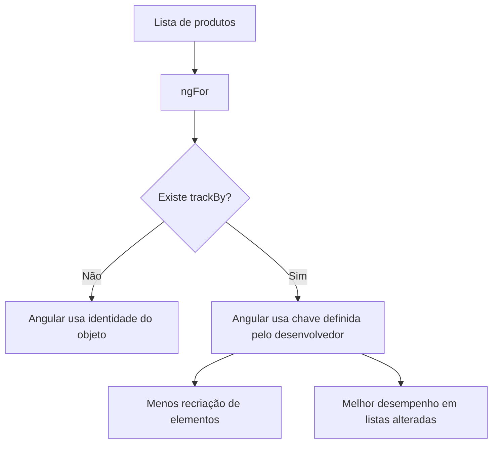

---

## 7. `ngSwitch`

O `ngSwitch` alterna templates conforme o valor de uma expressão.

Ele é composto por:

| Diretiva | Função |
|---|---|
| `[ngSwitch]` | define a expressão avaliada |
| `*ngSwitchCase` | renderiza quando o valor corresponde ao caso |
| `*ngSwitchDefault` | renderiza quando nenhum caso corresponde |

```html
<div [ngSwitch]="product.name">
  <p *ngSwitchCase="'Webcam'">
    Product is used for video
  </p>

  <p *ngSwitchCase="'Microphone'">
    Product is used for audio
  </p>

  <p *ngSwitchDefault>
    Product is for general use
  </p>
</div>
```

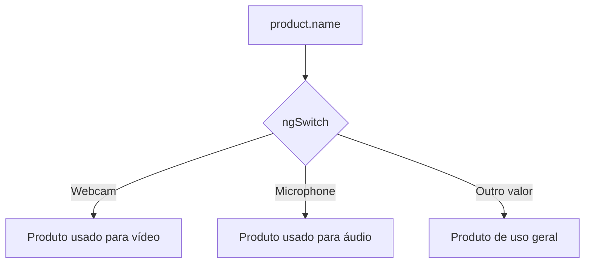

---

## 8. Atualização: nova sintaxe de control flow

A sintaxe clássica do capítulo continua importante para entender diretivas estruturais, mas projetos Angular modernos tendem a usar a nova sintaxe.

### 8.1 `@if`

```html
@if (selectedProduct) {
  <app-product-detail [product]="selectedProduct" />
} @else {
  <p>No product selected!</p>
}
```

### 8.2 `@for`

```html
<ul>
  @for (product of products; track product.name) {
    <li (click)="selectedProduct = product">
      {{ product.name }}
    </li>
  } @empty {
    <li>No products available</li>
  }
</ul>
```

### 8.3 `@switch`

```html
@switch (product.name) {
  @case ('Webcam') {
    <p>Product is used for video</p>
  }
  @case ('Microphone') {
    <p>Product is used for audio</p>
  }
  @default {
    <p>Product is for general use</p>
  }
}
```

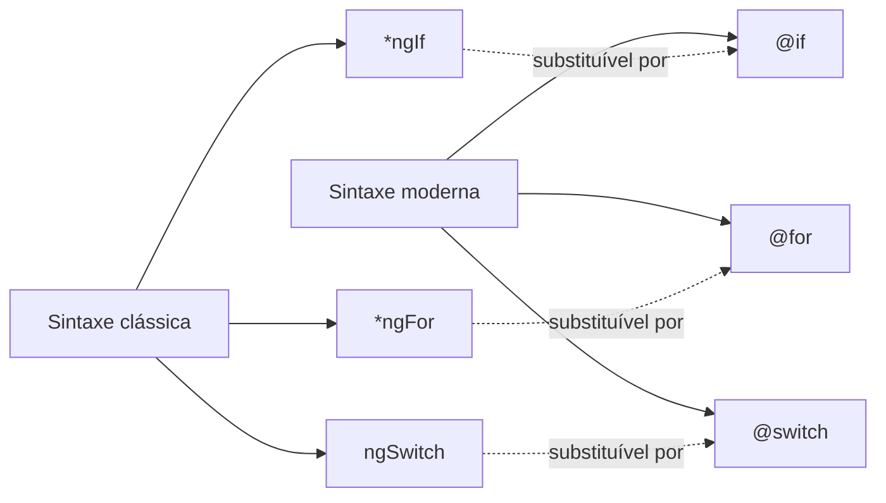

---

## 9. Pipes

Pipes transformam valores diretamente no template. Eles recebem um valor de entrada, aplicam uma transformação e retornam uma saída formatada.

Sintaxe geral:

```html
{{ expression | pipeName }}
```

Com parâmetro:

```html
{{ product.price | currency:'EUR' }}
```

Com encadeamento:

```html
{{ product.name | uppercase | slice:0:5 }}
```

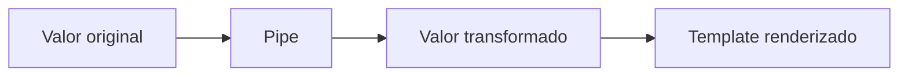

---

## 10. Pipes internos do Angular

### 10.1 `uppercase` e `lowercase`

```html
{{ product.name | uppercase }}
{{ product.name | lowercase }}
```

Transformam strings para maiúsculas ou minúsculas.

### 10.2 `percent`

```html
<p>{{ 0.1234 | percent }}</p>
```

Resultado aproximado:

```text
12%
```

### 10.3 `currency`

```html
<span>{{ product.price | currency:'EUR' }}</span>
```

Formata valores numéricos como moeda.

### 10.4 `slice`

```html
<ul>
  <li *ngFor="let product of products | slice:1:3">
    {{ product.name }}
  </li>
</ul>
```

Retorna um subconjunto de uma coleção ou string. O índice final não é incluído.

> O `slice` trabalha de forma imutável: o resultado é uma cópia dos dados originais.

### 10.5 `date`

```ts
today = new Date();
```

```html
<p>{{ today | date }}</p>
<p>{{ today | date:'fullDate' }}</p>
```

Formata datas conforme configurações locais e parâmetros de formato.

### 10.6 `json`

```html
<p>{{ product | json }}</p>
```

Útil para depuração. Sem esse pipe, interpolar um objeto geralmente exibe `[object Object]`.

### 10.7 `async`

Usado para valores assíncronos, como `Observable` ou `Promise`. Ele ajuda o template a refletir o valor mais recente sem exigir inscrição manual no componente.

### 10.8 `keyvalue`

Transforma um objeto em uma lista de pares chave-valor.

```ts
products = {
  'Webcam': 100,
  'Microphone': 200,
  'Wireless keyboard': 85
};
```

```html
<ul>
  <li *ngFor="let product of products | keyvalue">
    {{ product.key }}
  </li>
</ul>
```

---

## 11. Refatorando produtos para interface

O capítulo transforma a lista de strings em uma lista de objetos tipados.

```bash
ng generate interface product
```

```ts
export interface Product {
  name: string;
  price: number;
}
```

No componente de lista:

```ts
selectedProduct: Product | undefined;

products: Product[] = [
  { name: 'Webcam', price: 100 },
  { name: 'Microphone', price: 200 },
  { name: 'Wireless keyboard', price: 85 }
];
```

No template:

```html
<li *ngFor="let product of products" (click)="selectedProduct = product">
  {{ product.name }}
</li>
```

E no componente de detalhe:

```ts
@Input() product: Product | undefined;
```

```html
<div *ngIf="product">
  <h2>Product Details</h2>
  <h3>{{ product.name }}</h3>
  <span>{{ product.price | currency:'EUR' }}</span>
</div>
```

---

## 12. Pipes customizados

Quando os pipes internos não resolvem uma transformação específica, criamos um pipe customizado.

Exemplo do capítulo: ordenar produtos por nome.

```bash
ng generate pipe sort
```

Em uma aplicação baseada em módulos, o pipe é registrado no array `declarations` do módulo correspondente.

```ts
@NgModule({
  declarations: [
    ProductListComponent,
    ProductDetailComponent,
    SortPipe
  ],
  imports: [CommonModule],
  exports: [ProductListComponent]
})
export class ProductsModule {}
```

Estrutura básica:

```ts
import { Pipe, PipeTransform } from '@angular/core';

@Pipe({
  name: 'sort'
})
export class SortPipe implements PipeTransform {
  transform(value: unknown, ...args: unknown[]): unknown {
    return null;
  }
}
```

Versão tipada para produtos:

```ts
import { Pipe, PipeTransform } from '@angular/core';
import { Product } from './product';

@Pipe({
  name: 'sort'
})
export class SortPipe implements PipeTransform {
  transform(value: Product[]): Product[] {
    if (value) {
      return value.sort((a: Product, b: Product) => {
        if (a.name < b.name) {
          return -1;
        } else if (b.name < a.name) {
          return 1;
        }

        return 0;
      });
    }

    return [];
  }
}
```

Uso:

```html
<ul>
  <li *ngFor="let product of products | sort" (click)="selectedProduct = product">
    {{ product.name }}
  </li>
</ul>
```

Com `index`:

```html
<li *ngFor="let product of products | sort; let i = index">
  {{ i + 1 }}. {{ product.name }}
</li>
```

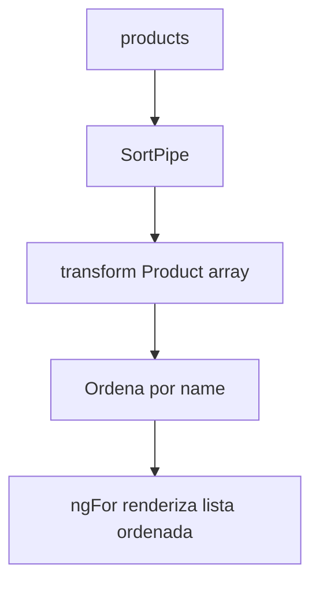

> Atenção: o exemplo usa `sort`, que altera o array original. Em projetos reais, prefira copiar antes de ordenar para evitar efeitos colaterais:

```ts
return [...value].sort((a, b) => a.name.localeCompare(b.name));
```

---

## 13. Change detection com pipes

Pipes podem ser:

| Tipo | Comportamento |
|---|---|
| **Pure pipe** | Executa quando a referência de entrada muda |
| **Impure pipe** | Executa a cada ciclo de change detection |

Por padrão, pipes são puros.

```ts
@Pipe({
  name: 'sort',
  pure: false
})
```

Um pipe puro não percebe mutações internas como `array.push(...)`, porque a referência do array continua a mesma.

Melhor abordagem:

```ts
this.products = [
  ...this.products,
  { name: 'Headphones', price: 55 }
];
```

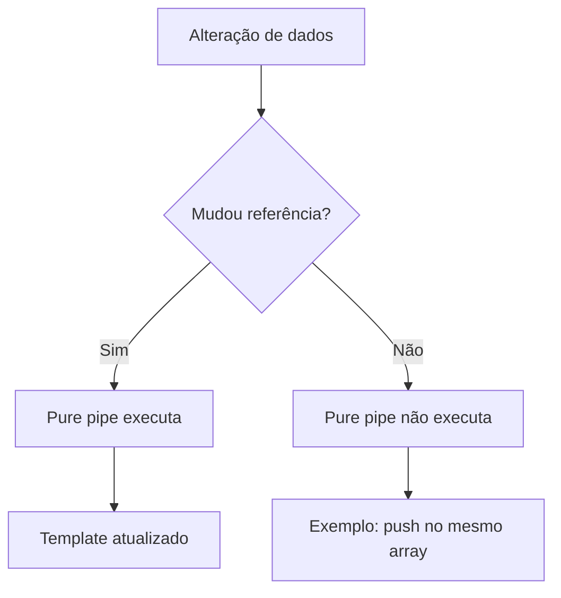

**Recomendação:** evite pipes impuros para tarefas caras. Prefira imutabilidade, cache ou transformação prévia no componente/serviço.

---

## 14. Pipes standalone

Pipes standalone não precisam ser declarados em um `NgModule`.

```bash
ng generate pipe filter --standalone
```

```ts
import { Pipe, PipeTransform } from '@angular/core';

@Pipe({
  name: 'filter',
  standalone: true
})
export class FilterPipe implements PipeTransform {
  transform(value: unknown, ...args: unknown[]): unknown {
    return null;
  }
}
```

Em um módulo, um pipe standalone deve ser colocado em `imports`, não em `declarations`.

```ts
@NgModule({
  declarations: [AppComponent],
  imports: [
    BrowserModule,
    FilterPipe
  ],
  providers: [],
  bootstrap: [AppComponent]
})
export class AppModule {}
```

---

## 15. Diretivas customizadas

Diretivas customizadas permitem encapsular comportamento reutilizável sem necessariamente criar um componente completo.

Regra prática:

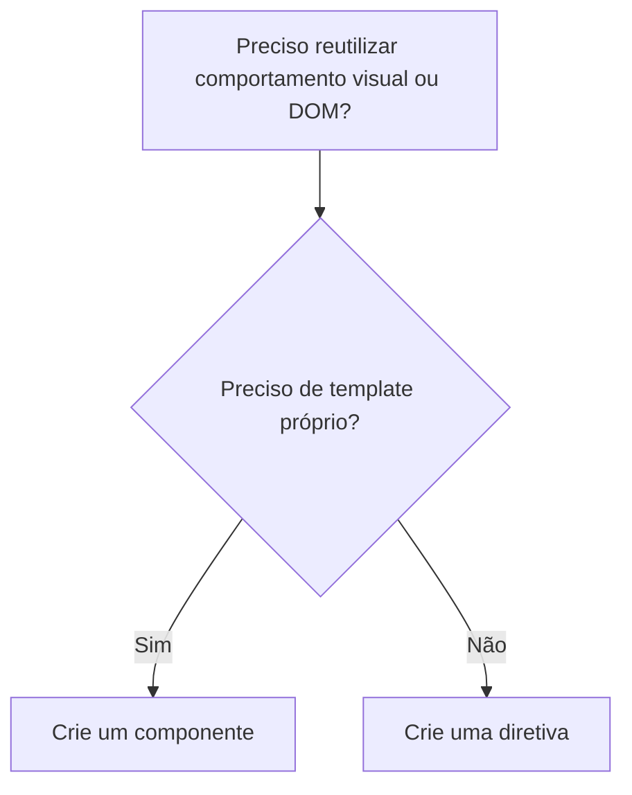

---

## 16. Diretiva de atributo: copyright dinâmico

```bash
ng generate directive copyright
```

Estrutura básica:

```ts
import { Directive } from '@angular/core';

@Directive({
  selector: '[appCopyright]'
})
export class CopyrightDirective {
  constructor() {}
}
```

Uso:

```html
<p appCopyright></p>
```

Com manipulação do elemento:

```ts
import { Directive, ElementRef } from '@angular/core';

@Directive({
  selector: '[appCopyright]'
})
export class CopyrightDirective {
  constructor(el: ElementRef) {
    const currentYear = new Date().getFullYear();
    const targetEl: HTMLElement = el.nativeElement;

    targetEl.classList.add('copyright');
    targetEl.textContent = `Copyright © ${currentYear} All Rights Reserved.`;
  }
}
```

CSS:

```css
.copyright {
  background-color: lightgray;
  padding: 1px;
  font-family: Verdana, Geneva, Tahoma, sans-serif;
}
```

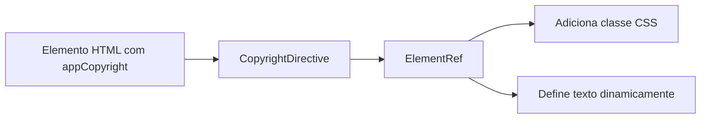

> `ElementRef` dá acesso direto ao elemento nativo. Use com cuidado, principalmente em cenários de SSR, segurança e portabilidade. Sempre que possível, prefira APIs mais declarativas do Angular.

---

## 17. `@HostBinding` e `@HostListener`

O Angular fornece dois decoradores importantes para diretivas:

| Decorador | Função |
|---|---|
| `@HostBinding` | Vincula uma propriedade da diretiva a uma propriedade do elemento host |
| `@HostListener` | Escuta eventos disparados pelo elemento host |

Exemplo do capítulo: diretiva que aceita apenas números.

```bash
ng generate directive numeric
```

```ts
import { Directive, HostBinding, HostListener } from '@angular/core';

@Directive({
  selector: '[appNumeric]'
})
export class NumericDirective {
  @HostBinding('class') currentClass = '';

  @HostListener('keypress', ['$event'])
  onKeyPress(event: KeyboardEvent) {
    const charCode = event.key.charCodeAt(0);

    if (charCode > 31 && (charCode < 48 || charCode > 57)) {
      this.currentClass = 'invalid';
      event.preventDefault();
    } else {
      this.currentClass = 'valid';
    }
  }
}
```

CSS:

```css
.valid {
  border-bottom: solid green;
}

.invalid {
  border-bottom: solid red;
}
```

Uso:

```html
<input appNumeric />
```

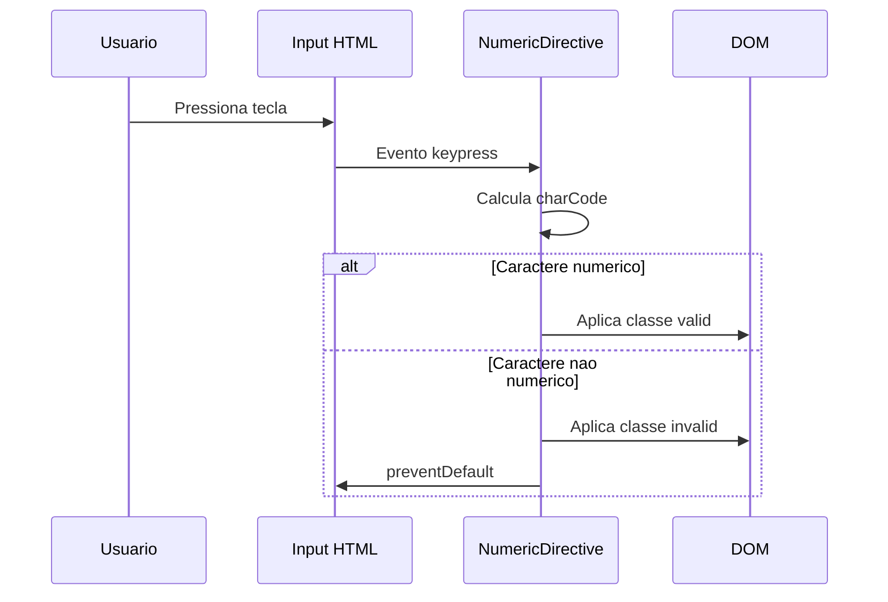

---

## 18. Criação dinâmica de componentes

O Angular normalmente carrega componentes pelo seletor usado no HTML. Mas também é possível criar componentes em tempo de execução.

Cenário do capítulo: criar dinamicamente um `ProductDetailComponent` em uma seção de ofertas.

```bash
ng generate directive productHost
```

Template hospedeiro:

```html
<h3>Offers</h3>
<ng-template appProductHost></ng-template>
```

Diretiva:

```ts
import { Directive, OnInit, ViewContainerRef } from '@angular/core';
import { ProductDetailComponent } from './product-detail/product-detail.component';

@Directive({
  selector: '[appProductHost]'
})
export class ProductHostDirective implements OnInit {
  constructor(private vc: ViewContainerRef) {}

  ngOnInit(): void {
    const productRef = this.vc.createComponent(ProductDetailComponent);

    productRef.setInput('product', {
      name: 'Optical mouse',
      price: 130
    });
  }
}
```

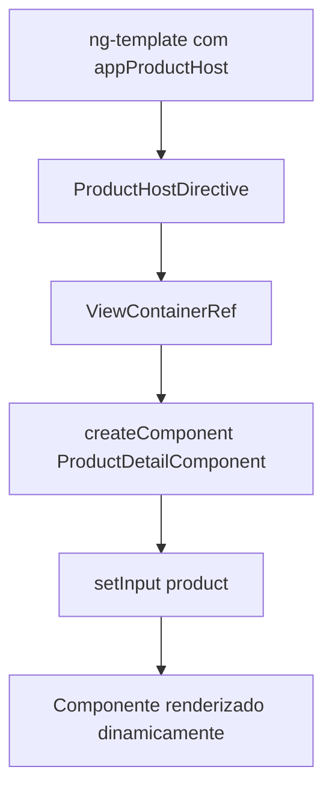

Esse recurso é útil quando:

- o componente não deve ser carregado antecipadamente;
- a posição exata do componente só é conhecida em runtime;
- uma aplicação precisa montar telas ou blocos dinamicamente.

---

## 19. Diretiva estrutural customizada: permissão por papel

Diretivas estruturais customizadas usam `TemplateRef` e `ViewContainerRef` para criar ou remover views.

```bash
ng generate directive permission
```

Imports principais:

```ts
import {
  Directive,
  Input,
  TemplateRef,
  ViewContainerRef,
  OnInit
} from '@angular/core';
```

Uso pretendido:

```html
<div *appPermission="['admin', 'agent']">
  Conteúdo permitido
</div>
```

Implementação:

```ts
@Directive({
  selector: '[appPermission]'
})
export class PermissionDirective implements OnInit {
  @Input() appPermission: string[] = [];

  private currentRole = 'agent';

  constructor(
    private tmplRef: TemplateRef<any>,
    private vc: ViewContainerRef
  ) {}

  ngOnInit(): void {
    if (this.appPermission.indexOf(this.currentRole) === -1) {
      this.vc.clear();
    } else {
      this.vc.createEmbeddedView(this.tmplRef);
    }
  }
}
```

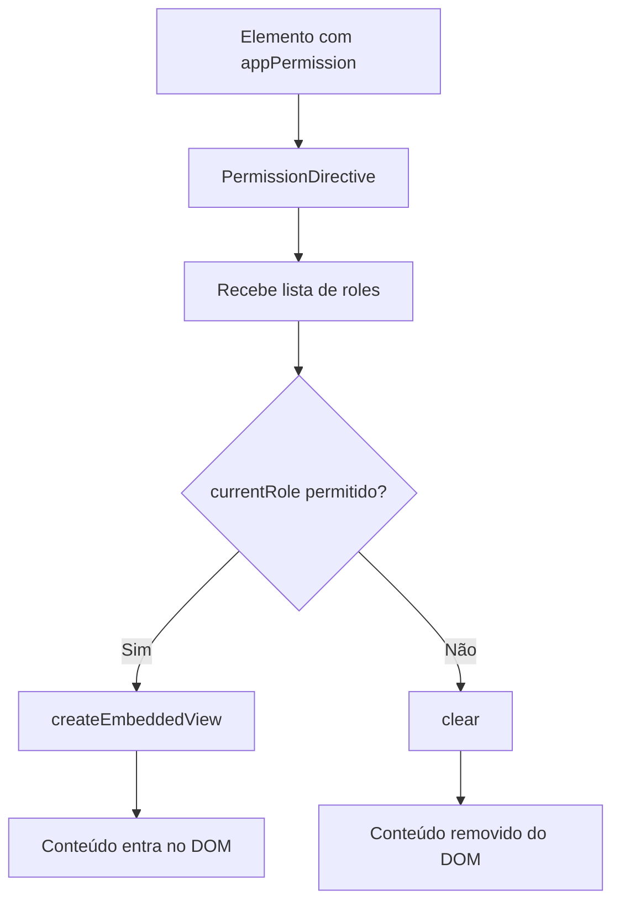

Em uma aplicação real, o papel do usuário não ficaria fixo na diretiva. Ele viria de um serviço de autenticação/autorização, local storage ou API backend.

---

## 20. Diretivas standalone

Assim como pipes, diretivas também podem ser standalone.

```bash
ng generate directive autofocus --standalone
```

```ts
import { Directive } from '@angular/core';

@Directive({
  selector: '[appAutofocus]',
  standalone: true
})
export class AutofocusDirective {
  constructor() {}
}
```

Em módulo, uma diretiva standalone deve ser importada, não declarada:

```ts
@NgModule({
  declarations: [AppComponent],
  imports: [
    BrowserModule,
    AutofocusDirective
  ],
  providers: [],
  bootstrap: [AppComponent]
})
export class AppModule {}
```

---

## 21. Comparativo final

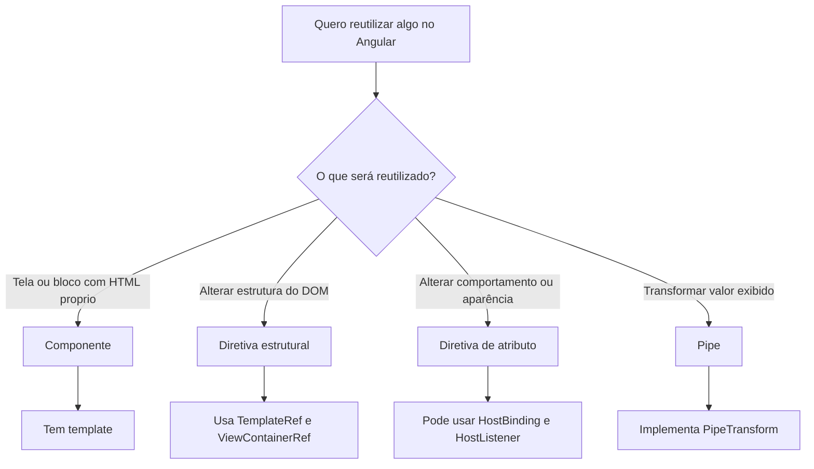

| Necessidade | Recurso indicado |
|---|---|
| Mostrar ou ocultar bloco | `*ngIf` ou `@if` |
| Renderizar lista | `*ngFor` ou `@for` |
| Alternar conteúdo por caso | `ngSwitch` ou `@switch` |
| Formatador simples de valor | Pipe interno |
| Transformação de valor reutilizável | Pipe customizado |
| Validar entrada de um campo | Diretiva de atributo |
| Controlar acesso a um bloco | Diretiva estrutural |
| Criar componente em runtime | `ViewContainerRef.createComponent` |

---

## 22. Pontos de atenção para projetos reais

1. **Evite manipulação direta excessiva do DOM.** Use `ElementRef` com cuidado.
2. **Prefira pipes puros.** Pipes impuros podem prejudicar performance.
3. **Evite mutar arrays usados por pipes puros.** Prefira criar nova referência com spread.
4. **Use `trackBy` em listas grandes.** Em sintaxe moderna, use `track` no `@for`.
5. **Não declare pipes/diretivas standalone em `declarations`.** Eles devem entrar em `imports`.
6. **Para autorização real, use serviços.** A diretiva de permissão do capítulo é didática.
7. **Use a nova sintaxe de control flow em projetos modernos.** Mantenha a sintaxe clássica como conhecimento importante para manutenção de projetos existentes.

---

## 23. Resumo

Este capítulo aprofunda dois recursos fundamentais do Angular:

- **Diretivas**, que modificam estrutura, comportamento e aparência dos elementos;
- **Pipes**, que transformam dados exibidos no template.

A ideia principal é separar responsabilidades:

- componente controla estado e template;
- diretiva encapsula comportamento reutilizável no DOM;
- pipe encapsula transformação de valor;
- serviços, vistos no próximo capítulo, assumem tarefas mais complexas e compartilhadas.

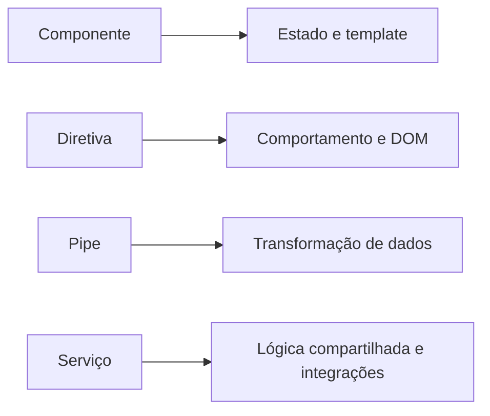

