# Capítulo 06 — Gerenciando tarefas complexas com Services

Fonte base: capítulo enviado sobre **Managing Complex Tasks with Services**. 

## 1. Ideia central do capítulo

À medida que a aplicação Angular cresce, colocar toda a lógica dentro dos componentes torna o sistema difícil de manter. O componente deve cuidar principalmente da **apresentação**. A lógica de negócio, busca de dados, cache, regras e integrações devem ser movidas para **services**.

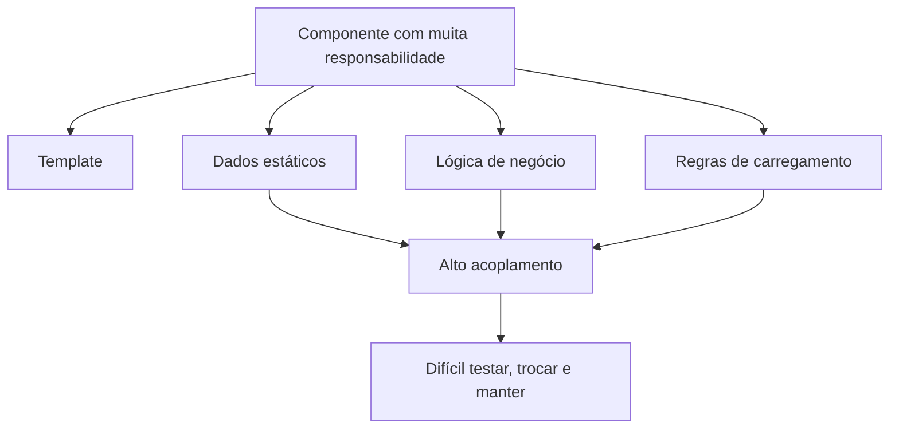

O capítulo usa uma lista de produtos como exemplo. Inicialmente, os produtos ficam dentro do componente. Depois, essa responsabilidade é movida para um serviço chamado `ProductsService`.

---

## 2. Dependency Injection no Angular

**Dependency Injection**, ou **DI**, é o mecanismo usado pelo Angular para entregar dependências prontas para uma classe usar.

Em vez de o componente criar manualmente um serviço com `new`, ele apenas declara que precisa daquele serviço. O Angular localiza o provider adequado, cria ou reutiliza uma instância e injeta essa dependência.

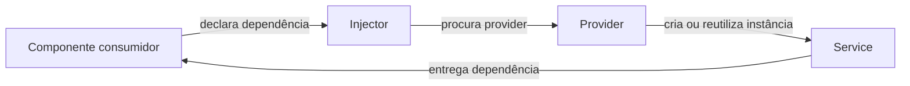

Exemplo ruim, porque acopla o componente à criação do serviço:

```ts
constructor() {
  this.productService = new ProductsService();
}
```

Exemplo correto com injeção por construtor:

```ts
constructor(private productService: ProductsService) {}
```

Assim, o componente não sabe como o serviço é criado. Ele apenas usa a dependência recebida.

---

## 3. Criando o primeiro service

Com Angular CLI:

```bash
ng generate service products
```

Um service Angular é uma classe TypeScript marcada com `@Injectable`.

```ts
import { Injectable } from '@angular/core';
import { Product } from './product';

@Injectable({
  providedIn: 'root'
})
export class ProductsService {
  getProducts(): Product[] {
    return [
      { name: 'Webcam', price: 100 },
      { name: 'Microphone', price: 200 },
      { name: 'Wireless keyboard', price: 85 }
    ];
  }
}
```

O ponto importante é este:

```ts
providedIn: 'root'
```

Isso registra o serviço no **root injector**, tornando-o disponível para toda a aplicação.

No Angular atual, `@Injectable({ providedIn: 'root' })` continua sendo a forma recomendada para a maioria dos serviços, pois cria uma instância singleton, disponibiliza o serviço globalmente e permite tree shaking quando o serviço não é usado. ([Angular][1])

---

## 4. Usando o service no componente

O componente deixa de armazenar a regra de criação dos produtos e apenas consome o service.

```ts
import { Component, OnInit } from '@angular/core';
import { Product } from '../product';
import { ProductsService } from '../products.service';

@Component({
  selector: 'app-product-list',
  templateUrl: './product-list.component.html',
  styleUrls: ['./product-list.component.css']
})
export class ProductListComponent implements OnInit {
  products: Product[] = [];

  constructor(private productService: ProductsService) {}

  ngOnInit(): void {
    this.products = this.productService.getProducts();
  }
}
```

Resultado arquitetural:

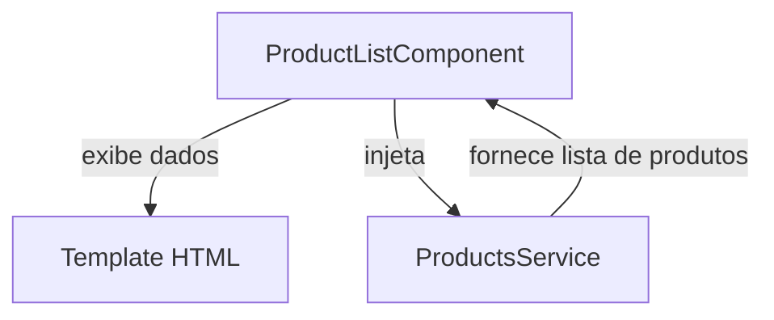

O ganho principal é a separação de responsabilidades:

| Elemento               | Responsabilidade                                |
| ---------------------- | ----------------------------------------------- |
| `ProductListComponent` | Controlar a apresentação da lista               |
| `ProductsService`      | Fornecer dados e regras relacionadas a produtos |
| Template HTML          | Renderizar visualmente os dados                 |

---

## 5. Providers e root injector

Um **provider** é uma receita que ensina o Angular a criar uma dependência.

Quando usamos:

```ts
@Injectable({
  providedIn: 'root'
})
```

estamos dizendo que o serviço será registrado no **root injector**.

Isso significa que, por padrão, haverá uma instância compartilhada em toda a aplicação.

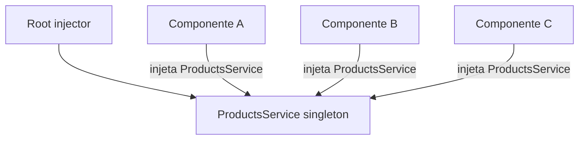

Esse comportamento é útil para serviços globais, como:

| Tipo de serviço                 | Exemplo              |
| ------------------------------- | -------------------- |
| Serviço de autenticação         | `AuthService`        |
| Serviço de usuário logado       | `UserSessionService` |
| Serviço HTTP de domínio         | `ProductsService`    |
| Serviço de configuração         | `AppConfigService`   |
| Serviço de estado compartilhado | `CartService`        |

---

## 6. Árvore de injetores do Angular

O Angular possui uma hierarquia de injetores. Quando um componente pede uma dependência, o Angular começa procurando próximo ao componente e sobe na árvore até encontrar um provider.

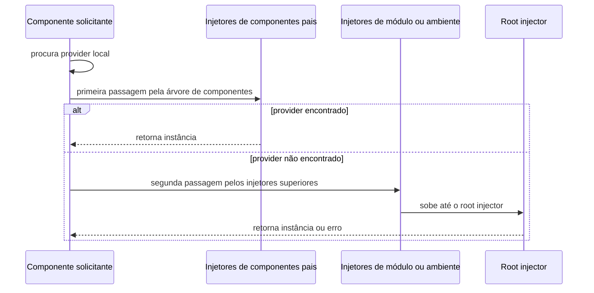

No Angular atual, a documentação descreve duas hierarquias principais: `EnvironmentInjector`, configurado por `@Injectable()` ou `ApplicationConfig.providers`, e `ElementInjector`, criado implicitamente para elementos do DOM e configurado via `providers` em componentes ou diretivas. ([Angular][2])

---

## 7. Compartilhando dependências por componentes

Além do root injector, um service também pode ser registrado diretamente em um componente:

```ts
@Component({
  selector: 'app-product-list',
  templateUrl: './product-list.component.html',
  styleUrls: ['./product-list.component.css'],
  providers: [ProductsService]
})
export class ProductListComponent {}
```

Nesse caso, `ProductsService` fica disponível para o próprio `ProductListComponent` e para os componentes filhos.

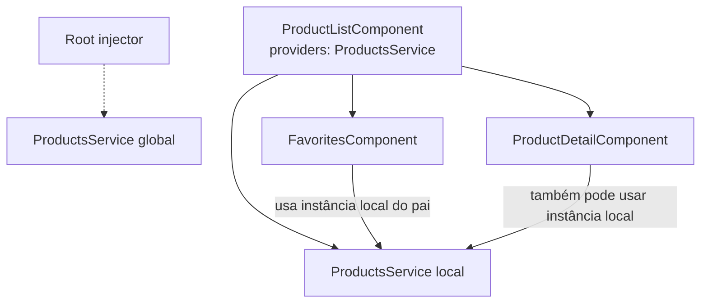

Esse é o ponto central: um provider no componente cria um **escopo local** para aquela parte da árvore de componentes.

---

## 8. Root injector versus component injector

| Onde o service é registrado   |                    Quantidade de instâncias | Escopo                 |
| ----------------------------- | ------------------------------------------: | ---------------------- |
| `providedIn: 'root'`          |                     Uma instância singleton | Aplicação inteira      |
| `providers` no componente     |   Uma instância por instância do componente | Componente e filhos    |
| `viewProviders` no componente | Uma instância limitada à view do componente | View e filhos internos |

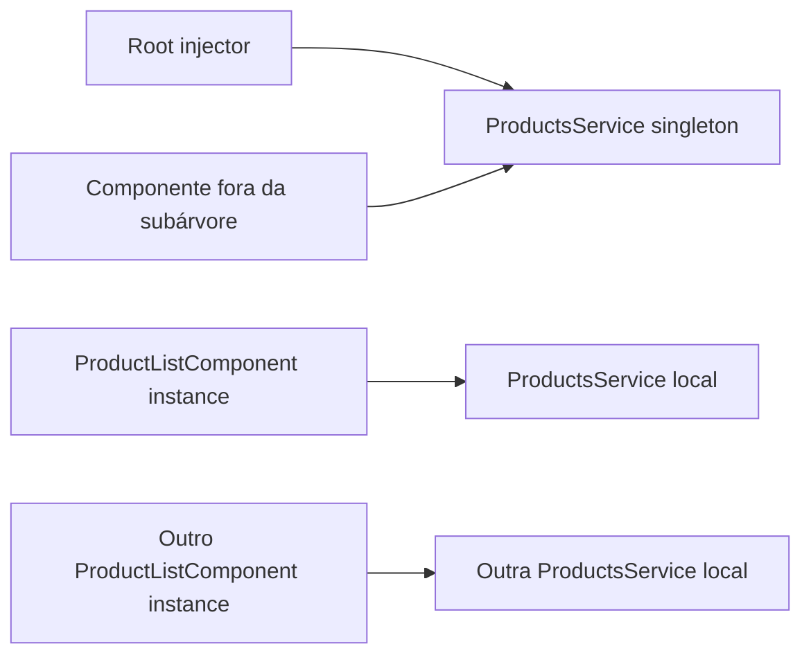

Use `providedIn: 'root'` quando o serviço deve ser compartilhado pela aplicação. Use `providers` no componente quando cada instância do componente precisa de seu próprio serviço isolado.

---

## 9. Sandboxing com múltiplas instâncias

O capítulo mostra um cenário com `ProductViewComponent` e `ProductViewService`.

A ideia é que cada item da lista tenha seu próprio service local.

```ts
@Component({
  selector: 'app-product-view',
  templateUrl: './product-view.component.html',
  styleUrls: ['./product-view.component.css'],
  providers: [ProductViewService]
})
export class ProductViewComponent implements OnInit {
  @Input() id = -1;
  name = '';

  constructor(private productViewService: ProductViewService) {}

  ngOnInit(): void {
    const product = this.productViewService.getProduct(this.id);

    if (product) {
      this.name = product.name;
    }
  }
}
```

Representação:

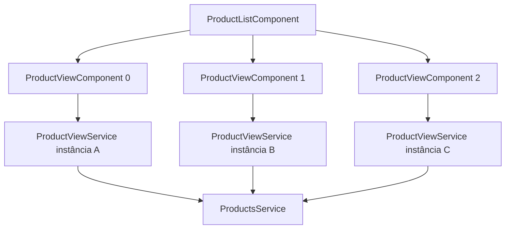

Esse padrão é útil quando cada componente precisa manter um estado local independente.

Exemplo de regra interna do service:

```ts
@Injectable()
export class ProductViewService {
  private product: Product | undefined;

  constructor(private productService: ProductsService) {}

  getProduct(id: number): Product | undefined {
    const products = this.productService.getProducts();

    if (!this.product) {
      this.product = products[id];
    }

    return this.product;
  }
}
```

Se `ProductViewService` fosse registrado no componente pai, todos os filhos compartilhariam a mesma instância. Como o service guarda estado em `this.product`, o mesmo produto poderia ser repetido em vários itens.

---

## 10. Restringindo DI com `viewProviders`

A propriedade `providers` permite que filhos acessem o service. Já `viewProviders` restringe o provider à view do componente.

```ts
@Component({
  selector: 'app-product-list',
  templateUrl: './product-list.component.html',
  styleUrls: ['./product-list.component.css'],
  viewProviders: [ProductsService]
})
export class ProductListComponent {}
```

Diferença prática:

| Propriedade          | Quem acessa                                   |
| -------------------- | --------------------------------------------- |
| `providers`          | O componente e seus filhos na árvore          |
| `viewProviders`      | A view do componente e filhos declarados nela |
| `providedIn: 'root'` | Qualquer parte da aplicação                   |

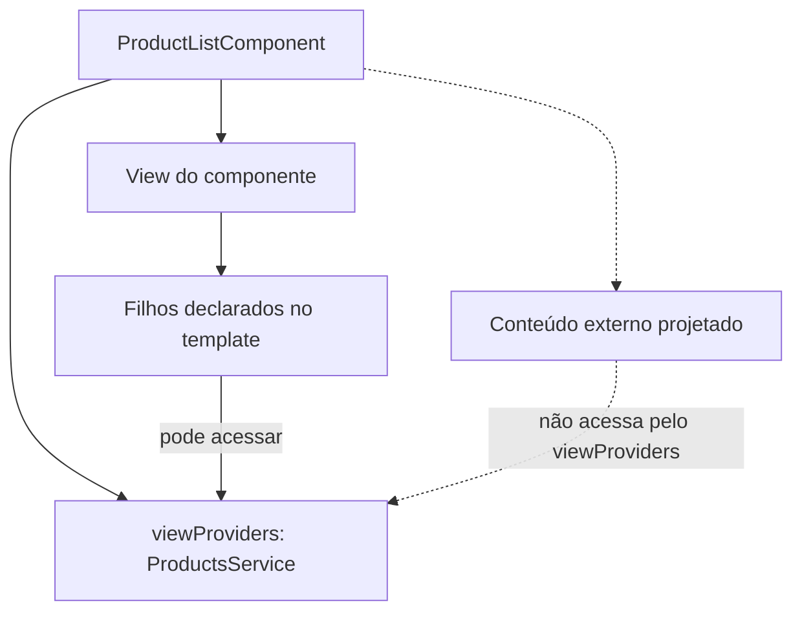

---

## 11. Restringindo a busca por providers

Angular permite controlar até onde o injector deve procurar uma dependência.

| Decorator     | Comportamento                               |
| ------------- | ------------------------------------------- |
| `@Host()`     | Limita a busca ao host                      |
| `@Optional()` | Não lança erro se a dependência não existir |
| `@Self()`     | Procura apenas no injector local            |
| `@SkipSelf()` | Ignora o injector local e procura acima     |

Exemplo com `@Host()`:

```ts
constructor(@Host() private productService: ProductsService) {}
```

Exemplo com `@Host()` e `@Optional()`:

```ts
constructor(
  @Host() @Optional() private productService: ProductsService | null
) {}
```

Atenção: se usar `@Optional()`, trate o caso `null`.

```ts
ngOnInit(): void {
  if (!this.productService) {
    this.products = [];
    return;
  }

  this.products = this.productService.getProducts();
}
```

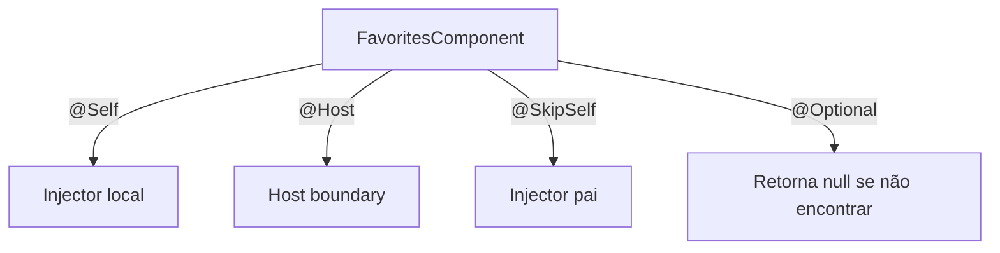

---

## 12. Sobrescrevendo providers

A forma curta:

```ts
providers: [ProductsService]
```

é equivalente a:

```ts
providers: [
  { provide: ProductsService, useClass: ProductsService }
]
```

Aqui aparecem dois conceitos importantes:

| Propriedade | Função                               |
| ----------- | ------------------------------------ |
| `provide`   | Token usado para pedir a dependência |
| `useClass`  | Classe concreta que será entregue    |

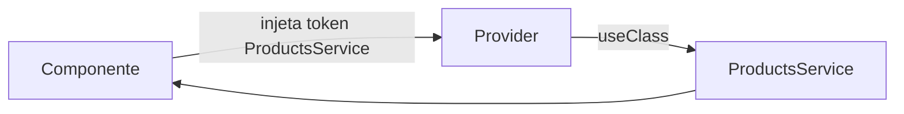

---

## 13. Substituindo a implementação com `useClass`

Podemos criar um service especializado:

```ts
@Injectable({
  providedIn: 'root'
})
export class FavoritesService extends ProductsService {
  override getProducts(): Product[] {
    return super.getProducts().slice(1, 3);
  }
}
```

E fazer o componente continuar pedindo `ProductsService`, mas receber `FavoritesService`:

```ts
@Component({
  selector: 'app-favorites',
  templateUrl: './favorites.component.html',
  styleUrls: ['./favorites.component.css'],
  providers: [
    { provide: ProductsService, useClass: FavoritesService }
  ]
})
export class FavoritesComponent implements OnInit {
  products: Product[] = [];

  constructor(private productService: ProductsService) {}

  ngOnInit(): void {
    this.products = this.productService.getProducts();
  }
}
```

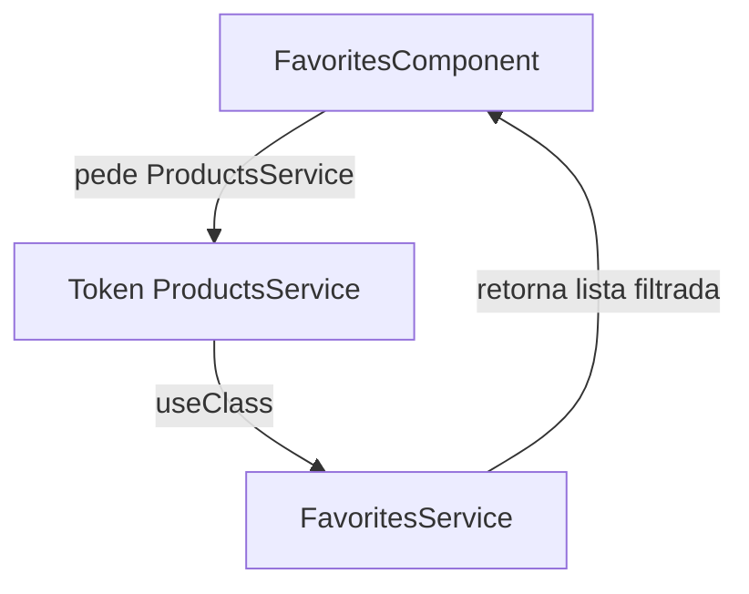

O componente não muda sua lógica. Apenas o provider muda.

---

## 14. Criando providers condicionais com `useFactory`

Também podemos usar uma factory function para decidir qual instância entregar.

```ts
export function favoritesFactory(isFavorite: boolean) {
  return () => {
    if (isFavorite) {
      return new FavoritesService();
    }

    return new ProductsService();
  };
}
```

Uso no provider:

```ts
providers: [
  {
    provide: ProductsService,
    useFactory: favoritesFactory(true)
  }
]
```

Se a factory precisar de dependências, usamos `deps`:

```ts
providers: [
  {
    provide: ProductsService,
    useFactory: favoritesFactory(true),
    deps: [ProductViewService]
  }
]
```

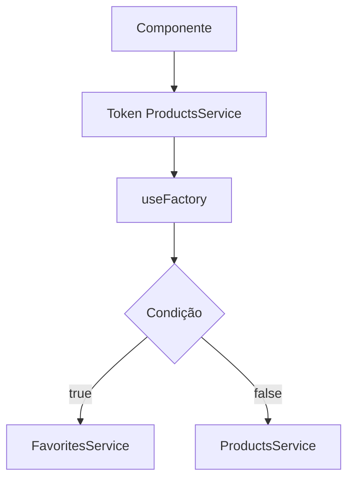

---

## 15. Transformando objetos em dependências com `useValue`

Nem toda dependência precisa ser uma classe. Podemos injetar objetos, strings, números ou configurações.

Exemplo de configuração:

```ts
export interface AppConfig {
  title: string;
  version: number;
}

export const appSettings: AppConfig = {
  title: 'My application',
  version: 1.0
};
```

Como interfaces TypeScript não existem em runtime, não podemos usá-las diretamente como token de DI. Para isso, usamos `InjectionToken`.

```ts
import { InjectionToken } from '@angular/core';

export const APP_CONFIG = new InjectionToken<AppConfig>('app.config');
```

Provider:

```ts
providers: [
  { provide: APP_CONFIG, useValue: appSettings }
]
```

Injeção:

```ts
constructor(@Inject(APP_CONFIG) config: AppConfig) {}
```

A documentação atual do Angular recomenda `InjectionToken` quando o tipo injetado não possui representação em runtime, como interfaces, arrays, callable types ou tipos parametrizados. ([Angular][3])

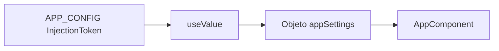

---

## 16. Atualização para Angular moderno

O conteúdo do capítulo continua válido, mas em projetos Angular modernos também é comum ver a função `inject()`:

```ts
import { Component, inject } from '@angular/core';

@Component({
  selector: 'app-product-list',
  templateUrl: './product-list.component.html'
})
export class ProductListComponent {
  private productService = inject(ProductsService);

  products = this.productService.getProducts();
}
```

A documentação atual mostra `inject()` como uma forma comum de consumir services registrados com `providedIn: 'root'`, além da injeção tradicional por construtor. ([Angular][1])

Em aplicações standalone, providers globais também podem aparecer em `ApplicationConfig.providers`:

```ts
export const appConfig: ApplicationConfig = {
  providers: [
    // providers globais da aplicação
  ]
};
```

O Angular atual também permite providers em rotas, limitando dependências a uma seção específica da aplicação. ([Angular][4])

---

## 17. Mapa mental do capítulo

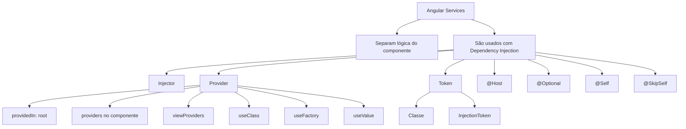

---

## 18. Regras práticas

| Situação                                         | Solução recomendada                    |
| ------------------------------------------------ | -------------------------------------- |
| Serviço usado pela aplicação inteira             | `@Injectable({ providedIn: 'root' })`  |
| Serviço precisa de estado isolado por componente | `providers` no componente              |
| Serviço deve ser limitado à view do componente   | `viewProviders`                        |
| Quero trocar a implementação de um serviço       | `useClass`                             |
| Quero escolher dinamicamente a implementação     | `useFactory`                           |
| Quero injetar objeto de configuração             | `InjectionToken` + `useValue`          |
| Dependência pode não existir                     | `@Optional()` com tratamento de `null` |
| Quero impedir busca em níveis superiores         | `@Self()` ou `@Host()`                 |

---

## 19. Erros comuns

1. Criar service com `new` dentro do componente.
2. Esquecer `providedIn: 'root'` ou `providers`, causando erro de provider não encontrado.
3. Registrar service no componente sem perceber que isso cria uma nova instância por componente.
4. Usar `@Optional()` e depois acessar o service sem verificar se ele é `null`.
5. Colocar estado em service singleton sem avaliar se esse estado deveria ser global.
6. Usar o índice do `ngFor` depois de aplicar pipe de ordenação, podendo gerar inconsistência entre índice e item exibido.

---

## 20. Resumo final

O capítulo ensina que services são fundamentais para manter uma aplicação Angular organizada. Componentes devem focar em apresentação. Services devem concentrar lógica de negócio, acesso a dados, cache e regras reutilizáveis.

A DI do Angular permite que dependências sejam declaradas, localizadas e entregues automaticamente. O root injector cria serviços globais singleton, enquanto providers em componentes permitem criar escopos locais e múltiplas instâncias.

O capítulo também apresenta recursos mais avançados: `viewProviders`, `@Host`, `@Optional`, `@Self`, `@SkipSelf`, `useClass`, `useFactory`, `useValue` e `InjectionToken`.

Em termos arquiteturais, este capítulo reforça o princípio de **Separation of Concerns**: cada parte da aplicação deve ter uma responsabilidade clara.

[1]: https://angular.dev/guide/di/creating-and-using-services?utm_source=chatgpt.com "Creating and using services"
[2]: https://angular.dev/guide/di/hierarchical-dependency-injection?utm_source=chatgpt.com "Hierarchical injectors"
[3]: https://angular.dev/api/core/InjectionToken?utm_source=chatgpt.com "InjectionToken"
[4]: https://angular.dev/guide/routing/define-routes?utm_source=chatgpt.com "Define routes"
