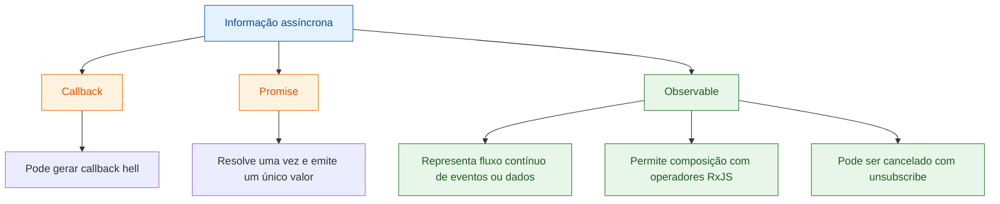
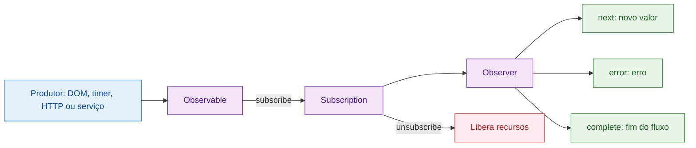
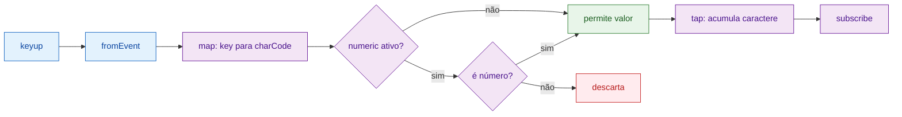
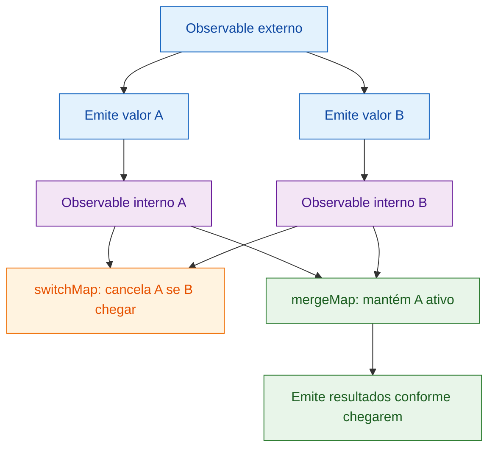
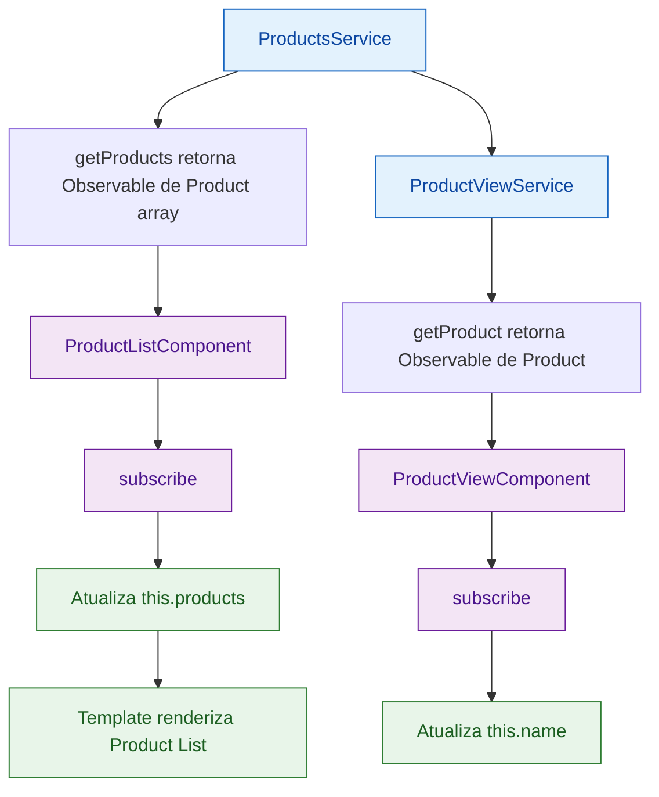
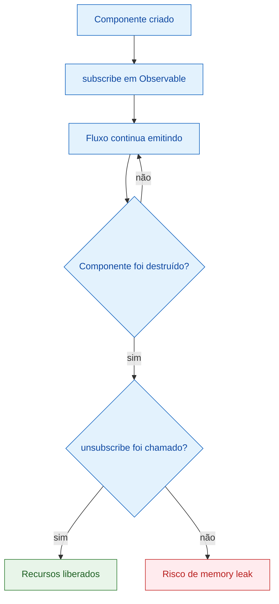
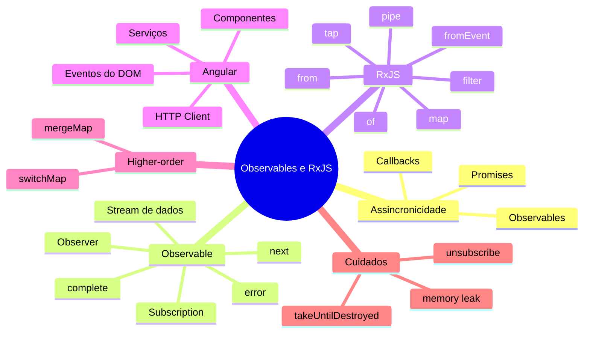

# Capítulo 07 — Programação Reativa com Observables e RxJS

Baseado no material enviado em **Capítulo 07 — Being Reactive Using Observables and RxJS**. 

## 1. Objetivo do capítulo

Este capítulo apresenta como o Angular lida com **informações assíncronas** usando **Observables** e a biblioteca **RxJS**.

A ideia central é sair de abordagens mais limitadas, como **callbacks** e **Promises**, e avançar para um modelo reativo baseado em **fluxos de dados**, onde eventos, respostas HTTP, timers e interações do usuário podem ser tratados como sequências observáveis.



---

## 2. Estratégias para lidar com informação assíncrona

Aplicações modernas precisam consumir APIs, ler arquivos, esperar eventos do usuário, autenticar usuários, buscar dados remotos e reagir a atrasos de rede.

No Angular, isso aparece com frequência em:

* chamadas HTTP;
* eventos do DOM;
* timers;
* formulários;
* roteamento;
* comunicação entre componentes;
* serviços assíncronos.

O capítulo começa mostrando três abordagens:

| Estratégia | Característica principal                              | Limitação                                       |
| ---------- | ----------------------------------------------------- | ----------------------------------------------- |
| Callback   | Uma função é chamada após uma operação assíncrona     | Pode gerar código aninhado e difícil de manter  |
| Promise    | Representa uma operação futura que resolve ou rejeita | Executa uma vez e não é naturalmente cancelável |
| Observable | Representa um fluxo de valores ao longo do tempo      | Exige inscrição e gerenciamento da assinatura   |

---

## 3. De callbacks para Promises

Um **callback** é uma função passada como parâmetro para ser executada depois que outra operação terminar.

Exemplo didático:

```ts
private setTitle = () => {
  this.title = 'Learning Angular';
};

private changeTitle(callback: Function) {
  setTimeout(() => {
    callback();
  }, 2000);
}

constructor() {
  this.changeTitle(this.setTitle);
}
```

O problema começa quando uma operação depende da anterior:

```ts
getRootFolder(folder => {
  getAssetsFolder(folder, assets => {
    getPhotos(assets, photos => {});
  });
});
```

Esse encadeamento leva ao chamado **callback hell**, dificultando leitura, manutenção e tratamento de erros.

---

## 4. Promises

Uma **Promise** representa uma operação assíncrona que pode ser resolvida ou rejeitada.

```ts
private onComplete() {
  return new Promise<void>(resolve => {
    setTimeout(() => {
      resolve();
    }, 2000);
  });
}

constructor() {
  this.onComplete().then(this.setTitle);
}
```

Com Promises, o código fica mais legível:

```ts
getRootFolder()
  .then(getAssetsFolder)
  .then(getPhotos);
```

Mas o capítulo destaca limitações importantes:

* Promises não são facilmente canceláveis;
* são executadas imediatamente;
* resolvem apenas uma vez;
* retornam um único valor;
* não modelam bem fluxos contínuos de eventos.

Essas limitações abrem espaço para os **Observables**.

---

## 5. Observables em poucas palavras

Um **Observable** representa uma fonte de dados que pode emitir valores ao longo do tempo.

Ele trabalha com o padrão **Observer**, no qual um consumidor se inscreve para receber notificações.



Exemplo básico com `Observable`:

```ts
import { Observable } from 'rxjs';

title$ = new Observable(observer => {
  setInterval(() => {
    observer.next();
  }, 2000);
});

constructor() {
  this.title$.subscribe(this.setTitle);
}
```

Convenção importante: é comum nomear variáveis que armazenam Observables com o sufixo `$`.

Exemplo:

```ts
title$: Observable<string>;
products$: Observable<Product[]>;
selectedProduct$: Observable<Product>;
```

Isso não é obrigatório, mas melhora a leitura do código.

---

## 6. Programação reativa no Angular

Programação reativa significa tratar eventos e dados como **fluxos observáveis**.

No capítulo, isso é demonstrado com um exemplo de teclado: cada tecla pressionada pelo usuário gera um evento `keyup`, e esses eventos formam uma sequência contínua.

```mermaid
flowchart LR
    A["Usuário pressiona uma tecla"] --> B["Evento keyup"]
    B --> C["fromEvent"]
    C --> D["Observable de KeyboardEvent"]
    D --> E["Operadores RxJS"]
    E --> F["subscribe"]
    F --> G["Atualiza a propriedade keys"]
    G --> H["Template exibe o resultado"]

    classDef input fill:#e3f2fd,stroke:#1565c0,color:#0d47a1;
    classDef rx fill:#f3e5f5,stroke:#6a1b9a,color:#4a148c;
    classDef view fill:#e8f5e9,stroke:#2e7d32,color:#1b5e20;

    class A,B input;
    class C,D,E,F rx;
    class G,H view;
```



Exemplo simplificado:

```html
<input type="text" #keyContainer>
You pressed: {{ keys }}
```

```ts
import { Component, ElementRef, OnInit, ViewChild } from '@angular/core';
import { fromEvent } from 'rxjs';

export class KeyLoggerComponent implements OnInit {
  @ViewChild('keyContainer', { static: true })
  input: ElementRef | undefined;

  keys = '';

  ngOnInit(): void {
    const logger$ = fromEvent<KeyboardEvent>(
      this.input?.nativeElement,
      'keyup'
    );

    logger$.subscribe(event => {
      this.keys += event.key;
    });
  }
}
```

O ponto principal: o evento do teclado deixa de ser tratado como uma ação isolada e passa a ser tratado como um **fluxo de eventos**.

---

## 7. A biblioteca RxJS

O Angular usa RxJS como biblioteca principal para lidar com Observables.

Com RxJS, é possível criar Observables a partir de várias fontes:

* eventos de interação;
* Promises;
* callbacks;
* arrays;
* valores estáticos;
* eventos assíncronos.

Exemplos de criação:

```ts
import { of } from 'rxjs';

const values$ = of(1, 2, 3);

values$.subscribe(value => console.log(value));
```

```ts
import { from } from 'rxjs';

const values$ = from([1, 2, 3]);

values$.subscribe(value => console.log(value));
```

Também é possível converter uma Promise em Observable:

```ts
const complete$ = from(this.onComplete());

complete$.subscribe(this.setTitle);
```

A documentação oficial do RxJS define o Observable como a conexão entre um produtor e um consumidor por meio de uma ação de inscrição, e a chamada `subscribe` retorna uma `Subscription`. ([RxJS][1])

---

## 8. Transformando Observables com operadores

O poder do RxJS aparece principalmente nos **operadores**.

Operadores permitem transformar, filtrar, combinar e reagir aos valores emitidos por um Observable.

No capítulo, aparecem operadores como:

| Operador | Função                                                 |
| -------- | ------------------------------------------------------ |
| `pipe`   | Encadeia operadores                                    |
| `tap`    | Executa efeito colateral sem alterar o valor           |
| `map`    | Transforma o valor emitido                             |
| `filter` | Permite ou bloqueia valores de acordo com uma condição |

Exemplo do capítulo, filtrando apenas teclas numéricas:

```ts
import { filter, fromEvent, map, tap } from 'rxjs';

ngOnInit(): void {
  const logger$ = fromEvent<KeyboardEvent>(
    this.input?.nativeElement,
    'keyup'
  );

  logger$.pipe(
    map(event => event.key.charCodeAt(0)),
    filter(code => {
      if (this.numeric) {
        return code > 31 && (code < 48 || code > 57) === false;
      }

      return true;
    }),
    tap(digit => {
      this.keys += String.fromCharCode(digit);
    })
  ).subscribe();
}
```

Fluxo visual:



---

## 9. Higher-order Observables

Um **higher-order Observable** é um Observable que emite outros Observables.

Em outras palavras:

```ts
Observable<Observable<T>>
```

Isso aparece quando uma emissão assíncrona precisa iniciar outra operação assíncrona.

O capítulo usa o exemplo de serviços de produtos. Primeiro, o serviço deixa de retornar arrays diretamente e passa a retornar Observables.

```ts
import { Injectable } from '@angular/core';
import { Observable, of } from 'rxjs';
import { Product } from './product';

@Injectable()
export class ProductsService {
  private products = [
    { name: 'Webcam', price: 100 },
    { name: 'Microphone', price: 200 },
    { name: 'Wireless keyboard', price: 85 }
  ];

  getProducts(): Observable<Product[]> {
    return of(this.products);
  }
}
```

Depois, outro serviço busca um produto específico a partir da lista:

```ts
import { Injectable } from '@angular/core';
import { Observable, of, mergeMap } from 'rxjs';
import { ProductsService } from './products.service';
import { Product } from './product';

@Injectable()
export class ProductViewService {
  private product: Product | undefined;

  constructor(private productsService: ProductsService) {}

  getProduct(id: number): Observable<Product> {
    return this.productsService.getProducts().pipe(
      mergeMap(products => {
        if (!this.product) {
          this.product = products[id];
        }

        return of(this.product);
      })
    );
  }
}
```

O capítulo menciona dois operadores importantes para esse tipo de cenário:

| Operador    | Comportamento                                                         |
| ----------- | --------------------------------------------------------------------- |
| `switchMap` | Cancela o Observable interno anterior quando chega uma nova emissão   |
| `mergeMap`  | Mantém os Observables internos ativos e emite conforme eles respondem |



A documentação oficial do RxJS descreve `mergeMap` como um operador que se inscreve em cada Observable interno conforme ele chega, enquanto `switchMap` troca para o Observable interno mais recente. ([RxJS][2])

---

## 10. Inscrevendo-se em Observables

Para que um Observable comece a emitir valores para um consumidor, é necessário fazer uma inscrição com `subscribe`.

No exemplo dos produtos:

```ts
private getProducts() {
  this.productsService.getProducts().subscribe(products => {
    this.products = products;
  });
}

ngOnInit(): void {
  this.getProducts();
}
```

No componente de visualização:

```ts
private getProduct() {
  this.productViewService.getProduct(this.id).subscribe(product => {
    if (product) {
      this.name = product.name;
    }
  });
}

ngOnInit(): void {
  this.getProduct();
}
```

Fluxo geral:



---

## 11. Cancelando inscrições: unsubscribe

O capítulo encerra alertando que uma assinatura ativa continua ouvindo alterações enquanto não for encerrada.

Isso pode causar **memory leak** quando o componente é destruído, mas a assinatura continua ativa em segundo plano.



Forma clássica:

```ts
import { Subscription } from 'rxjs';

export class KeyLoggerComponent implements OnInit, OnDestroy {
  private subscription?: Subscription;

  ngOnInit(): void {
    this.subscription = fromEvent<KeyboardEvent>(
      this.input?.nativeElement,
      'keyup'
    ).subscribe(event => {
      this.keys += event.key;
    });
  }

  ngOnDestroy(): void {
    this.subscription?.unsubscribe();
  }
}
```

### Atualização importante para Angular moderno

Em Angular atual, uma alternativa recomendada é usar `takeUntilDestroyed`, do pacote `@angular/core/rxjs-interop`, que completa o Observable automaticamente quando o contexto, como componente ou diretiva, é destruído. A documentação oficial indica que esse operador é estável desde a versão 19. ([Angular][3])

```ts
import { Component, ElementRef, ViewChild } from '@angular/core';
import { takeUntilDestroyed } from '@angular/core/rxjs-interop';
import { fromEvent } from 'rxjs';

export class KeyLoggerComponent {
  @ViewChild('keyContainer', { static: true })
  input!: ElementRef<HTMLInputElement>;

  keys = '';

  ngAfterViewInit(): void {
    fromEvent<KeyboardEvent>(this.input.nativeElement, 'keyup')
      .pipe(takeUntilDestroyed())
      .subscribe(event => {
        this.keys += event.key;
      });
  }
}
```

Outra opção moderna é converter Observables para Signals com `toSignal`. A documentação oficial do Angular informa que `toSignal` cria uma assinatura imediatamente e remove essa assinatura automaticamente quando o componente ou serviço é destruído. ([Angular][4])

---

## 12. Resumo final



### Pontos principais

* Callback resolve problemas simples, mas pode gerar código aninhado.
* Promise melhora a leitura, mas resolve apenas uma vez.
* Observable representa fluxos contínuos de dados e eventos.
* RxJS fornece operadores para transformar, filtrar e combinar fluxos.
* `subscribe` inicia o consumo do Observable.
* Toda assinatura longa precisa ser encerrada.
* Em Angular moderno, `takeUntilDestroyed` e `toSignal` reduzem o risco de memory leaks.

[1]: https://rxjs.dev/guide/glossary-and-semantics?utm_source=chatgpt.com "RxJS: Glossary And Semantics"
[2]: https://rxjs.dev/guide/higher-order-observables?utm_source=chatgpt.com "Higher-order Observables"
[3]: https://angular.dev/api/core/rxjs-interop/takeUntilDestroyed?utm_source=chatgpt.com "takeUntilDestroyed"
[4]: https://angular.dev/ecosystem/rxjs-interop?utm_source=chatgpt.com "RxJS interop with Angular signals"
