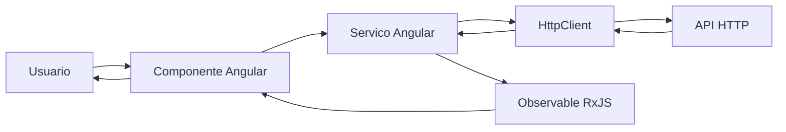
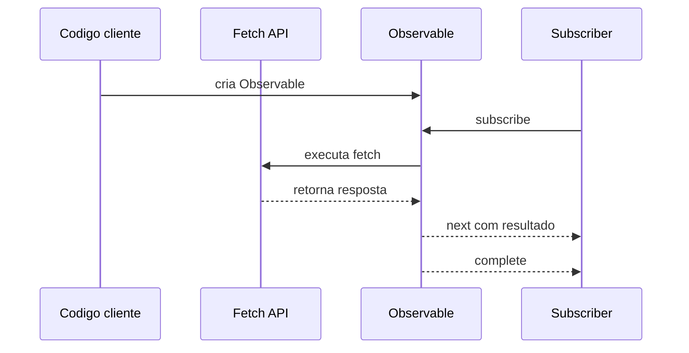
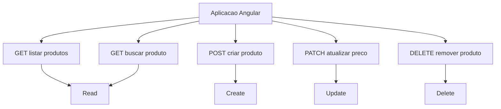
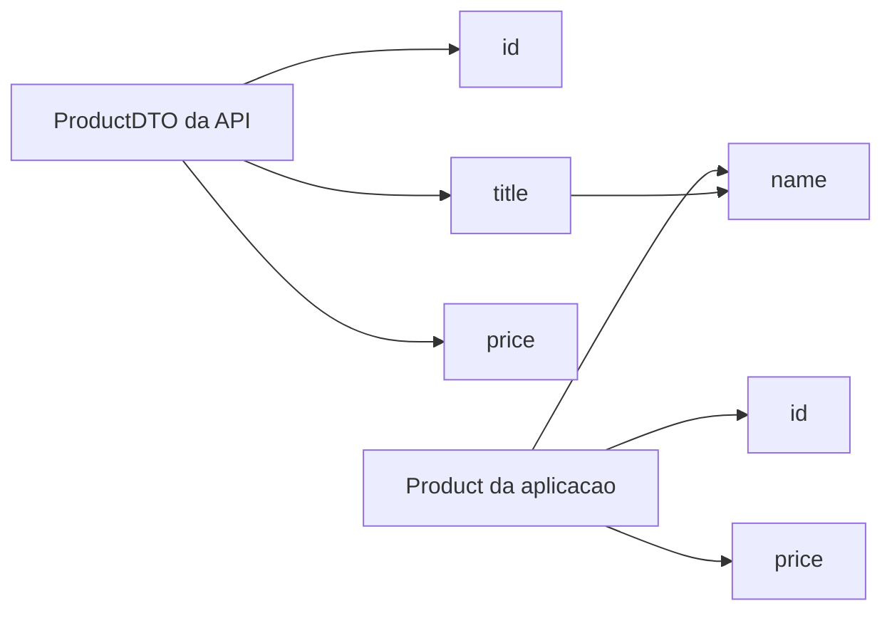
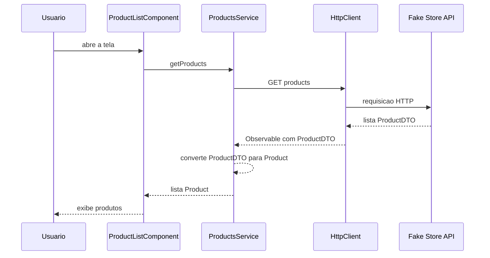
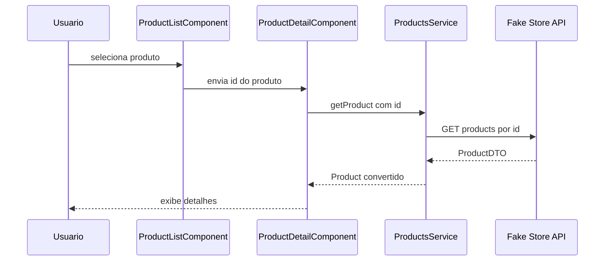
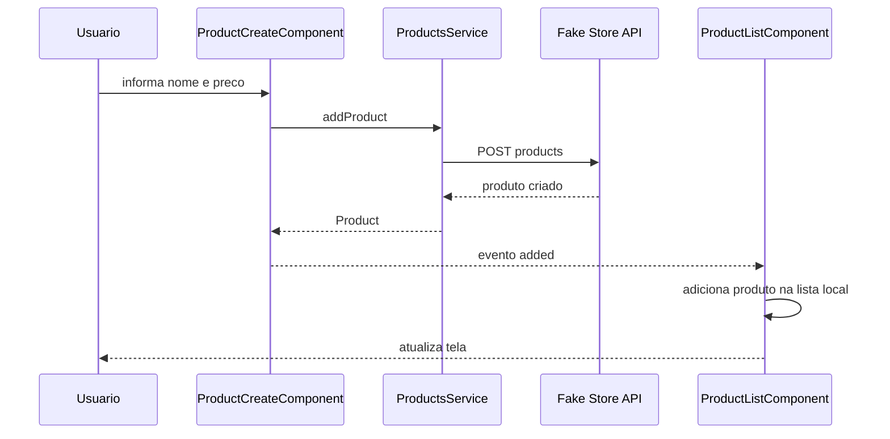
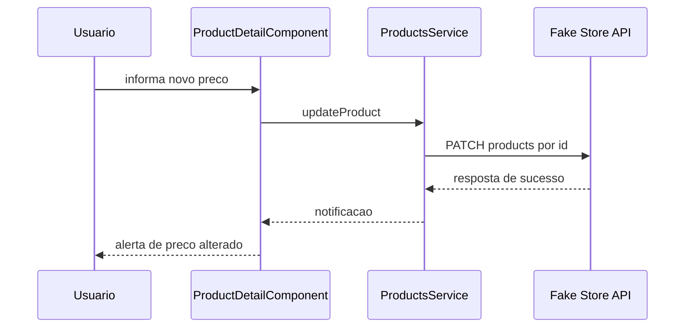
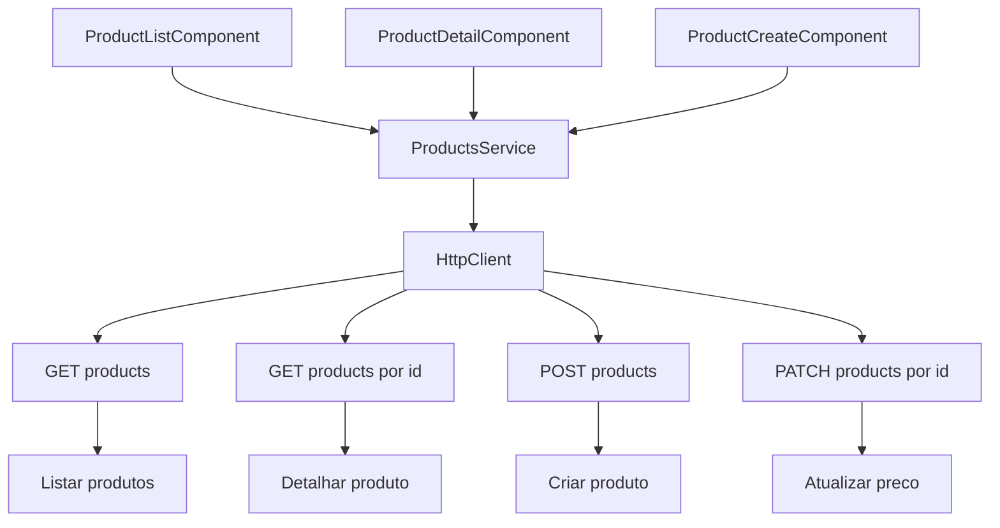
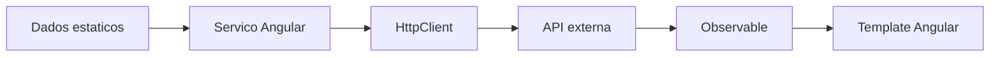

# Capítulo 08 — Comunicando com Serviços de Dados via HTTP

Documentação baseada no PDF enviado do **Capítulo 08 — Communicating with Data Services over HTTP**. 
O arquivo recebido possui 20 páginas e termina durante a seção **Updating product price**; por isso, a documentação abaixo cobre fielmente o conteúdo disponível no PDF.

---

## 1. Objetivo do capítulo

O capítulo apresenta como uma aplicação Angular se comunica com serviços remotos usando **HTTP**. O foco é transformar uma aplicação que inicialmente trabalha com dados estáticos em uma aplicação que consome dados de uma API.

O cenário usado é uma aplicação de produtos que acessa a **Fake Store API** para:

* listar produtos;
* buscar detalhes de um produto;
* adicionar um novo produto;
* alterar o preço de um produto.

---

## 2. Visão geral da comunicação HTTP no Angular

Em aplicações reais, principalmente corporativas, é comum que o frontend Angular precise se comunicar com APIs externas ou serviços backend.

O fluxo geral é:



O Angular encapsula a comunicação HTTP por meio do serviço **HttpClient**, que retorna **Observables**. Isso facilita a composição, transformação e reação aos dados usando RxJS.

---

## 3. Do fetch API para Observable

O capítulo começa comparando a API nativa `fetch` com o modelo reativo usado no Angular.

Com `fetch`, o código trabalha com **Promise**:

```ts
fetch(url)
  .then(response => {
    return response.ok ? response.text() : '';
  })
  .then(result => {
    if (result) {
      console.log(result);
    } else {
      console.error('An error has occured');
    }
  });
```

O capítulo mostra que é possível encapsular esse comportamento em um `Observable`:

```ts
const request$ = new Observable(observer => {
  fetch(url)
    .then(response => {
      return response.ok ? response.text() : '';
    })
    .then(result => {
      if (result) {
        observer.next(result);
        observer.complete();
      } else {
        observer.error('An error has occured');
      }
    });
});
```

A ideia principal é que o `Observable` permite representar a resposta HTTP como um fluxo de dados. Quando a resposta chega, o valor é emitido com `next`. Em caso de erro, o fluxo emite `error`. Ao finalizar, chama `complete`.



---

## 4. Introdução ao Angular HttpClient

O capítulo usa o módulo `HttpClientModule`, importado a partir de `@angular/common/http`, para disponibilizar o serviço `HttpClient` na aplicação.

Exemplo baseado no capítulo:

```ts
import { NgModule } from '@angular/core';
import { BrowserModule } from '@angular/platform-browser';
import { HttpClientModule } from '@angular/common/http';

import { AppComponent } from './app.component';

@NgModule({
  declarations: [
    AppComponent
  ],
  imports: [
    BrowserModule,
    HttpClientModule
  ],
  providers: [],
  bootstrap: [AppComponent]
})
export class AppModule { }
```

### Nota de atualização para Angular atual

O livro usa `HttpClientModule`, mas a documentação atual do Angular recomenda configurar o `HttpClient` com `provideHttpClient()`, especialmente em aplicações modernas com configuração baseada em providers. A própria documentação oficial marca `HttpClientModule` como deprecated e recomenda `provideHttpClient(withInterceptorsFromDi())` em seu lugar. ([Angular][1])

Exemplo moderno:

```ts
import { ApplicationConfig } from '@angular/core';
import { provideHttpClient } from '@angular/common/http';

export const appConfig: ApplicationConfig = {
  providers: [
    provideHttpClient()
  ]
};
```

---

## 5. Principais métodos HTTP usados no capítulo

O `HttpClient` fornece métodos para as operações mais comuns de uma aplicação CRUD.

| Método HTTP | Uso no capítulo             | Finalidade                        |
| ----------- | --------------------------- | --------------------------------- |
| `GET`       | `getProducts`, `getProduct` | Buscar dados                      |
| `POST`      | `addProduct`                | Criar novo produto                |
| `PATCH`     | `updateProduct`             | Atualizar parcialmente um produto |
| `DELETE`    | citado conceitualmente      | Remover dados                     |



---

## 6. Backend usado no capítulo: Fake Store API

O capítulo usa a **Fake Store API** como backend de apoio. Ela permite simular uma aplicação real de e-commerce, oferecendo endpoints como:

* `products`;
* `cart`;
* `users`;
* `login`.

O capítulo informa que serão usados principalmente os endpoints de **products** e **login**, embora no trecho recebido o foco esteja nos produtos.

Importante: operações de modificação, como criar ou atualizar produtos, retornam uma resposta simulada, mas não persistem os dados de fato no banco da Fake Store API.

---

## 7. Listando produtos via HTTP

Inicialmente, a aplicação exibe produtos estáticos. Depois, o serviço passa a buscar os produtos diretamente da API.

### Interface local da aplicação

```ts
export interface Product {
  id: number;
  name: string;
  price: number;
}
```

### Interface de transporte da API

O capítulo cria uma interface separada para representar o formato retornado pelo backend:

```ts
interface ProductDTO {
  id: number;
  title: string;
  price: number;
}
```

Essa separação é importante porque o modelo da API usa `title`, enquanto a aplicação usa `name`.



---

## 8. ProductsService

O serviço `ProductsService` passa a ser responsável por acessar a API.

```ts
import { Injectable } from '@angular/core';
import { map, Observable } from 'rxjs';
import { HttpClient } from '@angular/common/http';

import { Product } from './product';

interface ProductDTO {
  id: number;
  title: string;
  price: number;
}

@Injectable({
  providedIn: 'root'
})
export class ProductsService {
  private productsUrl = 'https://fakestoreapi.com/products';

  constructor(private http: HttpClient) { }

  private convertToProduct(product: ProductDTO): Product {
    return {
      id: product.id,
      name: product.title,
      price: product.price
    };
  }

  getProducts(): Observable<Product[]> {
    return this.http.get<ProductDTO[]>(this.productsUrl).pipe(
      map(products => products.map(product => {
        return this.convertToProduct(product);
      }))
    );
  }

  getProduct(id: number): Observable<Product> {
    return this.http.get<ProductDTO>(`${this.productsUrl}/${id}`).pipe(
      map(product => this.convertToProduct(product))
    );
  }

  addProduct(name: string, price: number): Observable<Product> {
    return this.http.post<ProductDTO>(this.productsUrl, {
      title: name,
      price: price
    }).pipe(
      map(product => this.convertToProduct(product))
    );
  }

  updateProduct(id: number, price: number): Observable<void> {
    return this.http.patch<void>(`${this.productsUrl}/${id}`, {
      price: price
    });
  }
}
```

---

## 9. Fluxo de listagem de produtos

Quando o componente de lista é carregado, ele chama o serviço, que usa o `HttpClient` para buscar os produtos na API.



---

## 10. Buscando detalhes de um produto

O capítulo altera o comportamento anterior. Antes, o componente de detalhes recebia o produto inteiro via input. Depois, ele passa a receber apenas o `id` e busca os detalhes diretamente na API.

### ProductDetailComponent

```ts
import { Component, Input } from '@angular/core';
import { Observable } from 'rxjs';

import { Product } from './product';
import { ProductsService } from './products.service';

export class ProductDetailComponent {
  @Input() id = -1;

  product$: Observable<Product> | undefined;

  constructor(private productService: ProductsService) { }

  ngOnChanges(): void {
    this.product$ = this.productService.getProduct(this.id);
  }

  changePrice(product: Product, price: number): void {
    this.productService.updateProduct(product.id, price).subscribe(() => {
      alert(`The price of ${product.name} was changed`);
    });
  }

  buy(): void {
    // comportamento existente no capítulo
  }
}
```

### Template com async pipe

```html
<div *ngIf="product$ | async as product">
  <h2>Product Details</h2>
  <h3>{{ product.name }}</h3>
  <span>{{ product.price | currency:'EUR' }}</span>

  <p>
    <input placeholder="New price" #price>
    <button (click)="changePrice(product, price.valueAsNumber)">
      Change
    </button>
  </p>

  <p>
    <button (click)="buy()">Buy Now</button>
  </p>
</div>
```

O `async` pipe faz a inscrição no `Observable` automaticamente e também cuida do cancelamento da inscrição quando o componente é destruído.

---

## 11. Fluxo de detalhes do produto



---

## 12. Adicionando novos produtos

Para adicionar produtos, o capítulo cria um novo componente:

```bash
ng generate component product-create
```

Esse componente recebe nome e preço do produto e emite o produto criado para o componente pai.

### ProductCreateComponent

```ts
import { Component, EventEmitter, Output } from '@angular/core';

import { Product } from '../product';
import { ProductsService } from '../products.service';

export class ProductCreateComponent {
  @Output() added = new EventEmitter<Product>();

  constructor(private productsService: ProductsService) { }

  createProduct(name: string, price: number): void {
    this.productsService.addProduct(name, price).subscribe(product => {
      this.added.emit(product);
    });
  }
}
```

### Template

```html
<div>
  <label for="name">Name</label>
  <input id="name" #name>
</div>

<div>
  <label for="price">Price</label>
  <input id="price" #price>
</div>

<div>
  <button (click)="createProduct(name.value, price.valueAsNumber)">
    Create
  </button>
</div>
```

O capítulo usa `valueAsNumber` porque o valor do input normalmente chega como `string`.

---

## 13. Integração do componente de criação com a lista

No componente de lista, o novo produto é adicionado ao array local:

```ts
onAdd(product: Product): void {
  this.products.push(product);
}
```

No template:

```html
<app-product-create (added)="onAdd($event)"></app-product-create>
```

Fluxo:



---

## 14. Atualizando o preço de um produto

O capítulo usa `PATCH` para alterar apenas o preço do produto.

```ts
updateProduct(id: number, price: number): Observable<void> {
  return this.http.patch<void>(`${this.productsUrl}/${id}`, {
    price: price
  });
}
```

A escolha por `PATCH` é adequada porque o objetivo é atualizar somente parte do recurso, e não substituir o produto inteiro.



---

## 15. Diferença entre PUT e PATCH

| Método  | Uso adequado                    |
| ------- | ------------------------------- |
| `PUT`   | Substituir um recurso inteiro   |
| `PATCH` | Alterar parcialmente um recurso |

No exemplo do capítulo, como apenas o preço é alterado, `PATCH` é mais apropriado.

---

## 16. Estrutura final da comunicação



---

## 17. Boas práticas destacadas

* Concentrar chamadas HTTP em serviços Angular.
* Não deixar componentes acessando diretamente a API.
* Usar interfaces diferentes para o modelo da API e o modelo interno da aplicação.
* Usar `map` do RxJS para transformar DTOs em objetos de domínio da aplicação.
* Usar `async` pipe para consumir Observables no template.
* Usar `subscribe` em operações de escrita, como `POST` e `PATCH`.
* Preferir `PATCH` quando a atualização for parcial.
* Lembrar que a Fake Store API simula alterações, mas não persiste dados reais.

---

## 18. Resumo didático

O capítulo mostra a evolução natural de uma aplicação Angular:



A principal mensagem é que o Angular não trata HTTP apenas como chamadas isoladas. Ele integra a comunicação com APIs ao modelo reativo da aplicação por meio de **Observable**, **RxJS**, **HttpClient** e **async pipe**.

Esse padrão deixa a aplicação mais organizada, testável e preparada para cenários reais de integração com backend.

[1]: https://angular.dev/guide/http/setup?utm_source=chatgpt.com "Setting up HttpClient"
