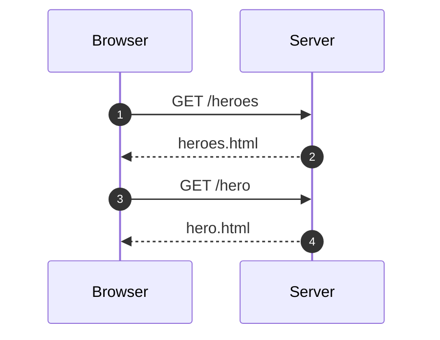
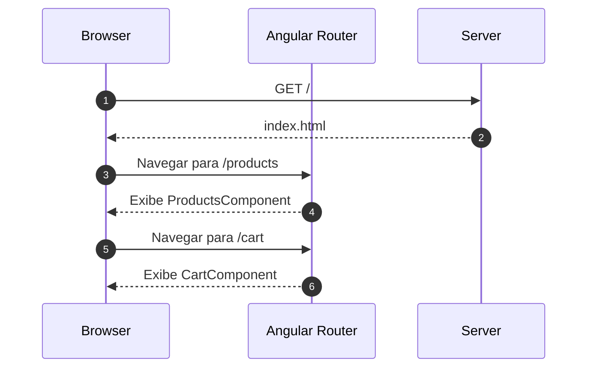
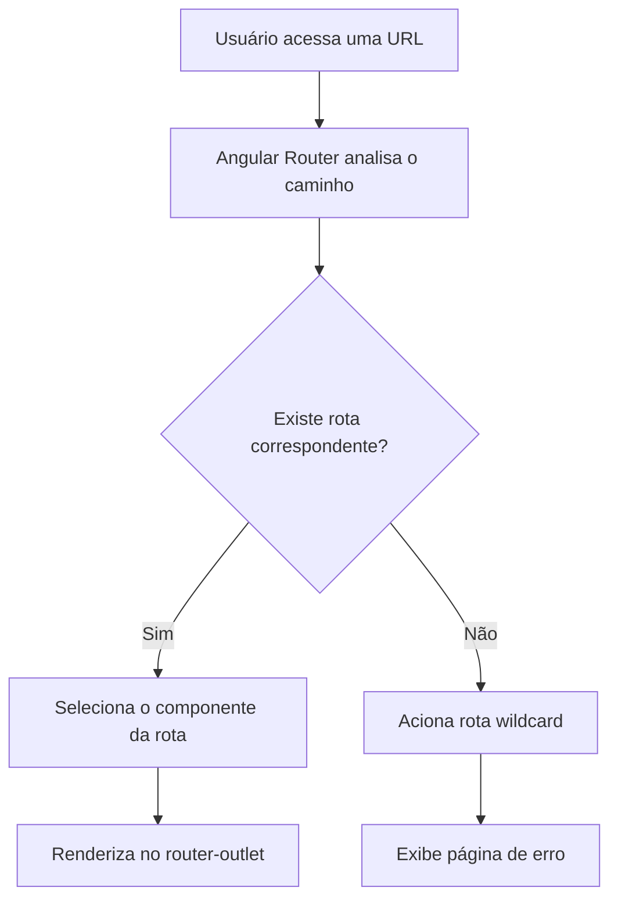
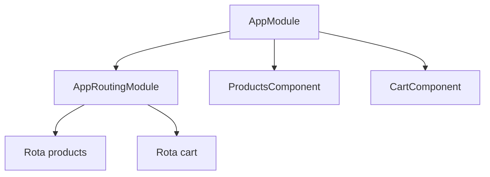
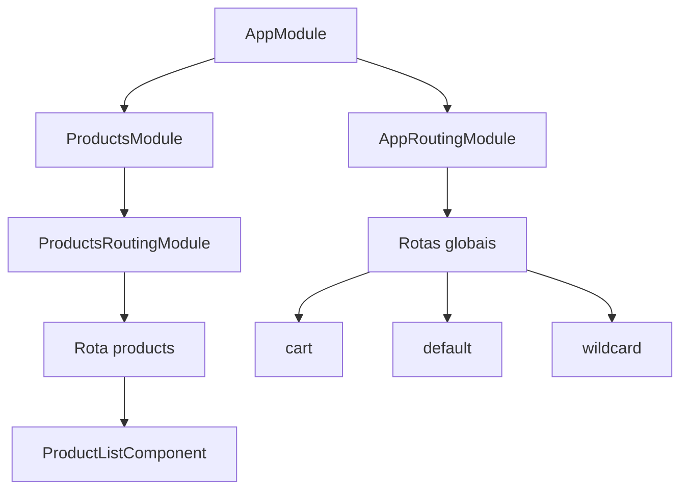
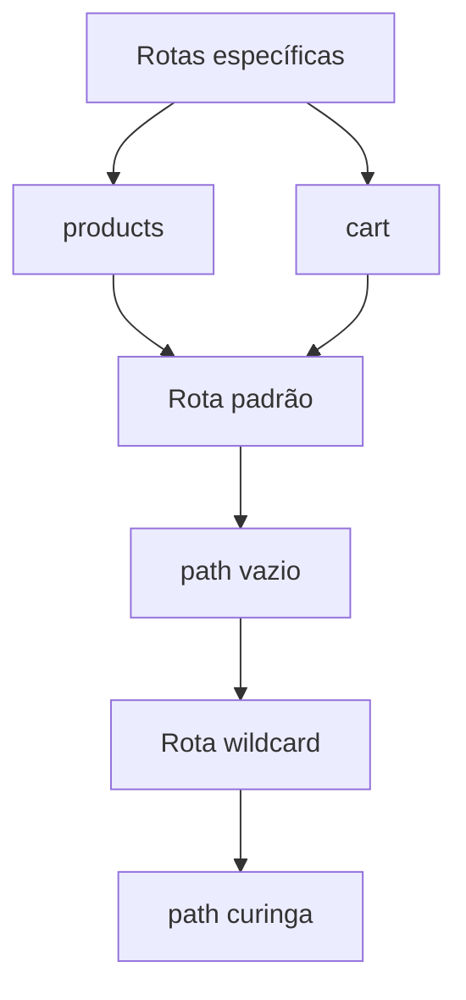
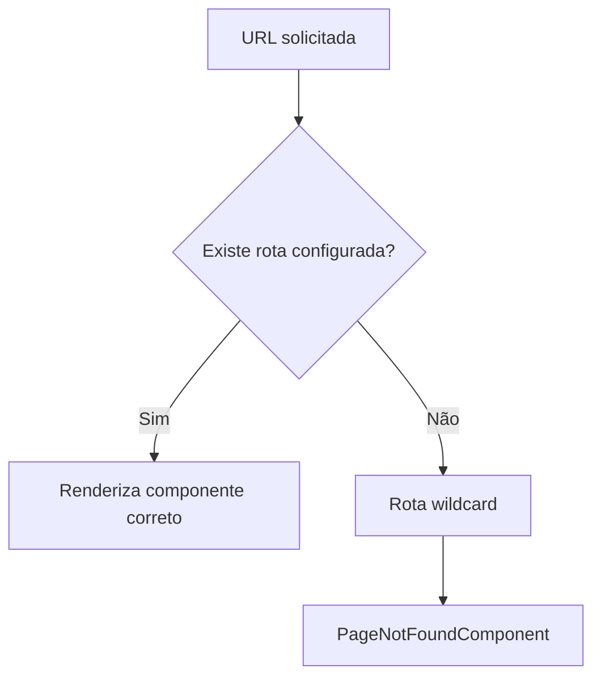
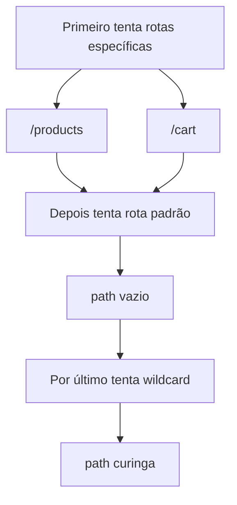
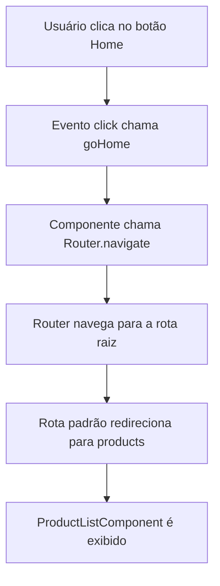

# Capítulo 09 — Navegação pela aplicação com Routing

Baseado no PDF enviado do capítulo 09, que aborda o uso do **Angular Router** para transformar uma aplicação com componentes espalhados em uma aplicação navegável por URLs, rotas e links internos. 

> Observação: o PDF enviado possui 20 páginas e termina no início da seção sobre estilização de links ativos com `routerLinkActive`. Portanto, documentei integralmente o conteúdo disponível até esse ponto.

---

## 1. Ideia central do capítulo

Até aqui, a aplicação Angular já havia sido organizada em componentes, serviços e módulos. O problema tratado neste capítulo é outro: **como navegar entre telas sem recarregar a página inteira**.

Em aplicações web tradicionais, cada mudança de página gera uma nova requisição ao servidor. Em aplicações Angular, que seguem o modelo de **Single-Page Application**, a página principal é carregada uma vez e as próximas navegações são tratadas no lado do cliente pelo **Angular Router**.



No modelo SPA, o servidor entrega o HTML principal uma vez. Depois disso, o Router interpreta a URL e decide qual componente Angular deve aparecer na tela.



---

## 2. Conceitos principais

| Conceito                  | Função                                                      |
| ------------------------- | ----------------------------------------------------------- |
| `base href`               | Define o caminho base da aplicação no arquivo `index.html`. |
| `RouterModule`            | Módulo do Angular responsável pelas rotas.                  |
| `Routes`                  | Array com a configuração das rotas da aplicação.            |
| `RouterModule.forRoot()`  | Registra as rotas principais da aplicação.                  |
| `RouterModule.forChild()` | Registra rotas de módulos de funcionalidade.                |
| `routerLink`              | Diretiva usada para criar links internos de navegação.      |
| `router-outlet`           | Local onde o componente da rota ativa será renderizado.     |
| Rota wildcard             | Rota curinga usada para tratar caminhos inexistentes.       |
| Rota padrão               | Rota usada quando a aplicação abre no caminho vazio.        |
| `Router.navigate()`       | Navegação imperativa feita via código TypeScript.           |

---

## 3. Base path da aplicação

O Angular usa a tag `base` no `index.html` para saber a partir de qual caminho deve resolver recursos e rotas.

```html
<base href="/">
```

Quando a aplicação está publicada na raiz do domínio, o valor normalmente é `/`.

Se a aplicação estiver dentro de uma subpasta, por exemplo `/admin/`, o valor precisaria refletir isso:

```html
<base href="/admin/">
```

Esse ponto é importante porque o Angular Router usa o recurso de **HTML5 pushState**, permitindo alterar a URL sem forçar um reload completo da página.

---

## 4. Configuração inicial do Router

O capítulo usa a abordagem clássica baseada em **NgModule**, com `AppRoutingModule`.

Exemplo básico:

```ts
import { NgModule } from '@angular/core';
import { RouterModule, Routes } from '@angular/router';

import { ProductsComponent } from './products/products.component';
import { CartComponent } from './cart/cart.component';

const routes: Routes = [
  { path: 'products', component: ProductsComponent },
  { path: 'cart', component: CartComponent }
];

@NgModule({
  imports: [RouterModule.forRoot(routes)],
  exports: [RouterModule]
})
export class AppRoutingModule {}
```

A regra importante do capítulo é:

> Em `path`, não se usa barra inicial.
> Use `products`, não `/products`.

---

## 5. Renderização com `router-outlet`

O `router-outlet` funciona como uma área reservada no template. O componente correspondente à rota ativa será carregado ali.

```html
<header></header>

<router-outlet></router-outlet>

<footer></footer>
```

Fluxo conceitual:



---

## 6. Navegação declarativa com `routerLink`

A navegação entre rotas pode ser feita no HTML usando `routerLink`.

```html
<a routerLink="/products">Products</a>
<a routerLink="/cart">Cart</a>

<router-outlet></router-outlet>
```

Aqui há uma diferença importante:

| Local                     | Exemplo                  |
| ------------------------- | ------------------------ |
| Configuração da rota      | `path: 'products'`       |
| Link absoluto no template | `routerLink="/products"` |

Ou seja: na configuração da rota, não se usa `/`; no `routerLink`, é comum usar `/` quando se deseja navegar a partir da raiz da aplicação.

---

## 7. Criando aplicação com suporte a rotas

O capítulo mostra o uso do Angular CLI para criar uma aplicação já com roteamento:

```bash
ng new my-app --routing --style=css
```

Esse comando gera um módulo de rotas separado, normalmente chamado:

```text
app-routing.module.ts
```

Esse arquivo ajuda a separar a configuração de rotas do módulo principal da aplicação.

Vantagens dessa separação:

| Vantagem             | Explicação                                                    |
| -------------------- | ------------------------------------------------------------- |
| Organização          | As rotas ficam em um arquivo dedicado.                        |
| Manutenção           | Alterar navegação não exige mexer diretamente no `AppModule`. |
| Testabilidade        | O módulo principal fica menos acoplado ao roteamento.         |
| Clareza arquitetural | Fica evidente que a aplicação possui navegação interna.       |

---

## 8. Organização com módulos de funcionalidade

O capítulo evolui a aplicação movendo as rotas de produtos para um módulo específico.

A ideia é sair de um cenário assim:



Para um cenário mais modular:



Essa organização melhora a escalabilidade porque cada área funcional da aplicação pode ter seu próprio módulo e seu próprio arquivo de rotas.

---

## 9. `forRoot()` versus `forChild()`

No módulo principal da aplicação, usa-se:

```ts
RouterModule.forRoot(routes)
```

Nos módulos de funcionalidade, usa-se:

```ts
RouterModule.forChild(routes)
```

A diferença é arquitetural: `forRoot()` registra o serviço principal do Router e deve ser usado uma vez na aplicação; `forChild()` adiciona rotas de módulos filhos sem criar uma nova instância do serviço de roteamento. Essa distinção continua presente na documentação oficial do Angular. ([Angular][1])

Exemplo de módulo de rotas de produtos:

```ts
import { NgModule } from '@angular/core';
import { RouterModule, Routes } from '@angular/router';

import { ProductListComponent } from './product-list/product-list.component';

const routes: Routes = [
  { path: 'products', component: ProductListComponent }
];

@NgModule({
  imports: [RouterModule.forChild(routes)],
  exports: [RouterModule]
})
export class ProductsRoutingModule {}
```

---

## 10. Ordem de importação dos módulos

O capítulo destaca que a ordem das rotas importa.

O Router trabalha com estratégia de **primeira correspondência encontrada**. Por isso, rotas mais específicas devem vir antes das mais genéricas.



Regra prática:

1. Primeiro: rotas específicas, como `products` e `cart`.
2. Depois: rota padrão, como `path: ''`.
3. Por último: rota wildcard, como `path: '**'`.

---

## 11. Tratando rotas desconhecidas

Quando o usuário acessa uma URL que não existe, a aplicação deve exibir uma página amigável de erro.

Exemplo:

```bash
ng generate component page-not-found
```

Configuração da rota:

```ts
const routes: Routes = [
  { path: 'cart', component: CartComponent },
  { path: '**', component: PageNotFoundComponent }
];
```

A rota wildcard usa `**`.

Ela deve ficar no final da lista, porque captura qualquer rota que não tenha sido encontrada antes.



---

## 12. Definindo uma rota padrão

Quando o usuário abre a aplicação no caminho vazio, por exemplo `/`, o capítulo redireciona para `/products`.

```ts
const routes: Routes = [
  { path: 'products', component: ProductListComponent },
  { path: '', redirectTo: '/products', pathMatch: 'full' }
];
```

O `pathMatch: 'full'` indica que o redirecionamento só deve acontecer quando o caminho completo for vazio.

Sem isso, a rota vazia poderia ser interpretada como prefixo de outras rotas, causando comportamento incorreto.

Fluxo de resolução mostrado no capítulo:



---

## 13. Navegação imperativa com `Router.navigate()`

Além do `routerLink`, também é possível navegar via TypeScript.

Esse estilo é útil quando a navegação depende de uma ação de código, como clique em botão, validação ou fluxo condicional.

Exemplo no componente `PageNotFoundComponent`:

```ts
import { Router } from '@angular/router';

constructor(private router: Router) {}

goHome(): void {
  this.router.navigate(['/']);
}
```

Template:

```html
<h3>Oops!</h3>
<p>The requested page was not found</p>

<button type="button" (click)="goHome()">Home</button>
```

Fluxo:



---

## 14. Quando usar `routerLink` e quando usar `navigate()`

| Situação                            | Melhor opção         |
| ----------------------------------- | -------------------- |
| Link comum em menu ou navegação     | `routerLink`         |
| Botão com lógica antes da navegação | `Router.navigate()`  |
| Navegação após salvar formulário    | `Router.navigate()`  |
| Navegação simples entre páginas     | `routerLink`         |
| Link acessível e semântico          | `a` com `routerLink` |

O capítulo reforça que, quando o elemento é um link de navegação, o ideal é usar uma âncora `a` com `routerLink`, porque isso preserva melhor o comportamento natural do HTML.

---

## 15. Atualização para Angular moderno

O conteúdo do capítulo usa o modelo com `NgModule`, `AppRoutingModule`, `RouterModule.forRoot()` e `RouterModule.forChild()`. Esse modelo ainda existe na API oficial do Angular. ([Angular][1])

Em aplicações Angular mais recentes com arquitetura **standalone**, é comum configurar rotas em `app.routes.ts` e registrá-las com `provideRouter(routes)` no bootstrap da aplicação. A própria documentação atual do Angular apresenta esse padrão como fluxo comum para aplicações modernas. ([Angular][2])

Exemplo moderno equivalente:

```ts
import { Routes } from '@angular/router';

import { ProductListComponent } from './products/product-list/product-list.component';
import { CartComponent } from './cart/cart.component';

export const routes: Routes = [
  { path: 'products', component: ProductListComponent },
  { path: 'cart', component: CartComponent },
  { path: '', redirectTo: '/products', pathMatch: 'full' },
  { path: '**', loadComponent: () =>
      import('./page-not-found/page-not-found.component')
        .then(m => m.PageNotFoundComponent)
  }
];
```

Registro com `provideRouter`:

```ts
import { ApplicationConfig } from '@angular/core';
import { provideRouter } from '@angular/router';

import { routes } from './app.routes';

export const appConfig: ApplicationConfig = {
  providers: [
    provideRouter(routes)
  ]
};
```

---

## 16. Resumo final

Neste capítulo, o Angular Router é apresentado como a peça responsável por transformar a aplicação em uma SPA navegável. O usuário troca de tela pela URL, mas a página não é recarregada por completo.

Os pontos mais importantes são:

* `RouterModule.forRoot()` configura as rotas principais.
* `RouterModule.forChild()` configura rotas de módulos de funcionalidade.
* `router-outlet` define onde o componente da rota será exibido.
* `routerLink` cria navegação declarativa no HTML.
* `Router.navigate()` permite navegação imperativa pelo TypeScript.
* Rotas específicas devem vir antes de rotas genéricas.
* A rota wildcard `**` deve ficar por último.
* A rota padrão `''` normalmente usa `redirectTo` com `pathMatch: 'full'`.
* Em Angular moderno, `provideRouter(routes)` é o padrão comum para aplicações standalone.

[1]: https://angular.dev/api/router/RouterModule?utm_source=chatgpt.com "RouterModule"
[2]: https://v18.angular.dev/guide/routing/common-router-tasks/?utm_source=chatgpt.com "Common routing tasks"
