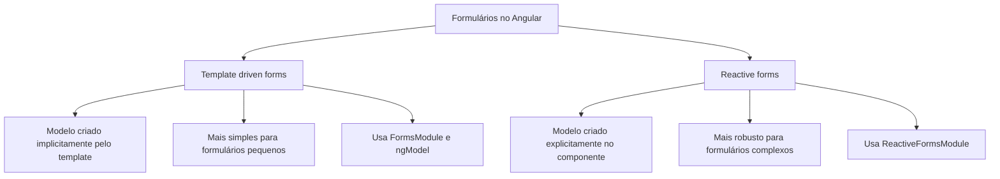
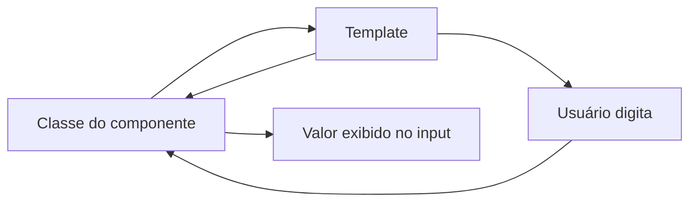
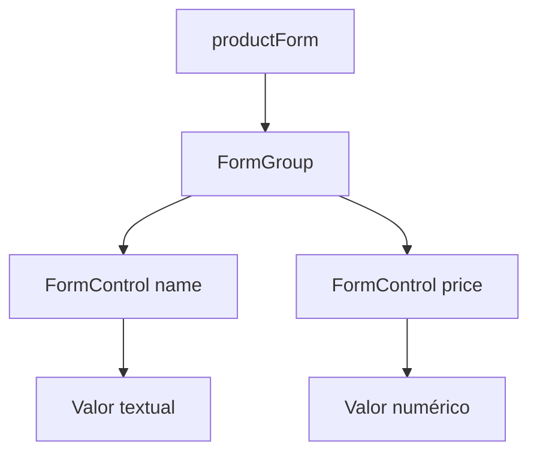
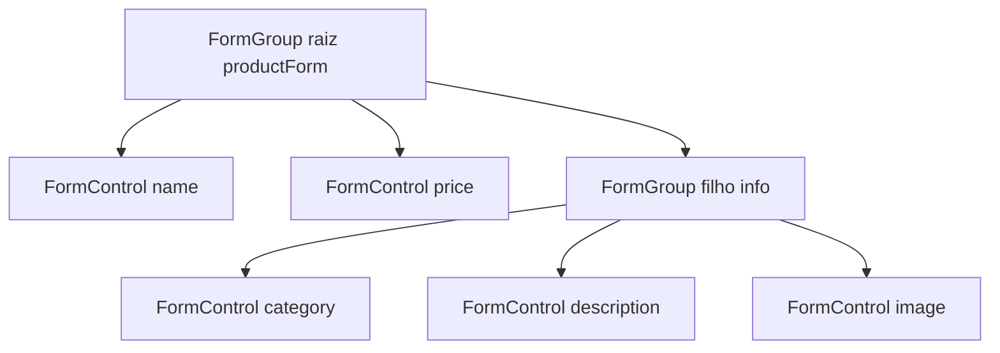
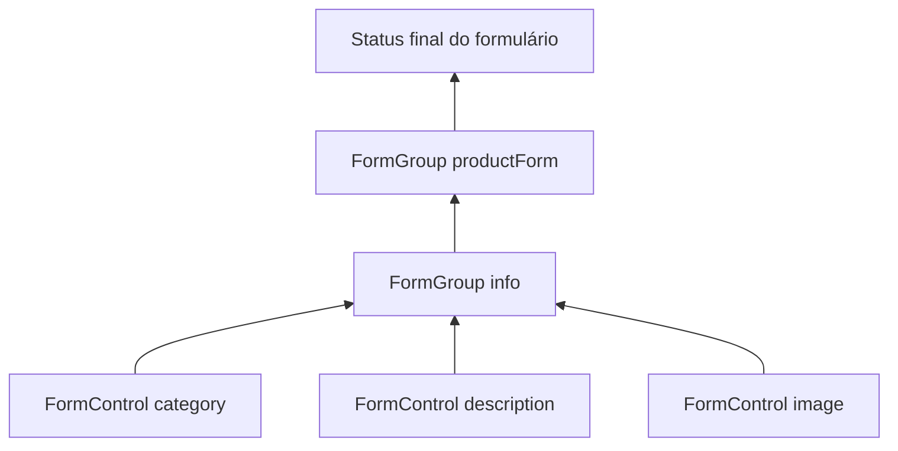
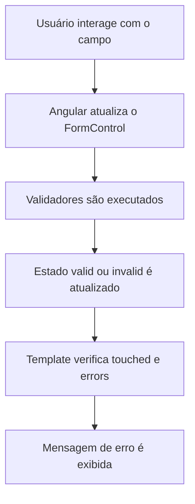
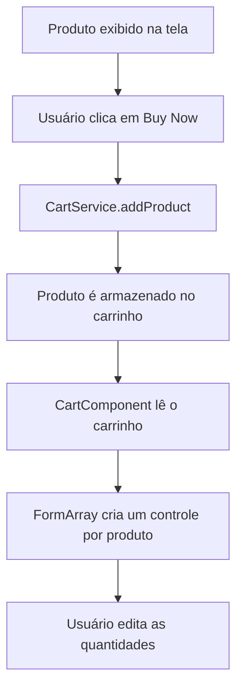
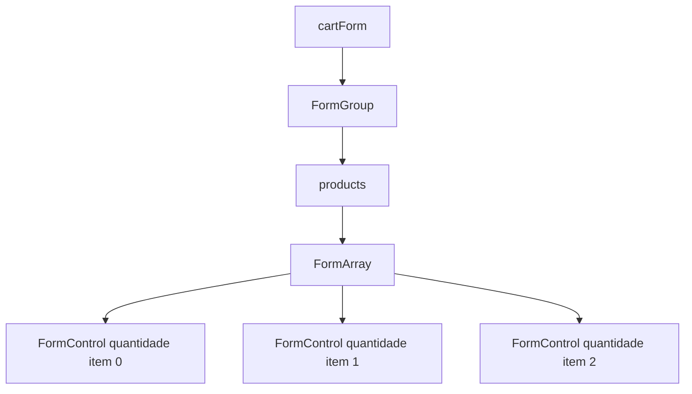
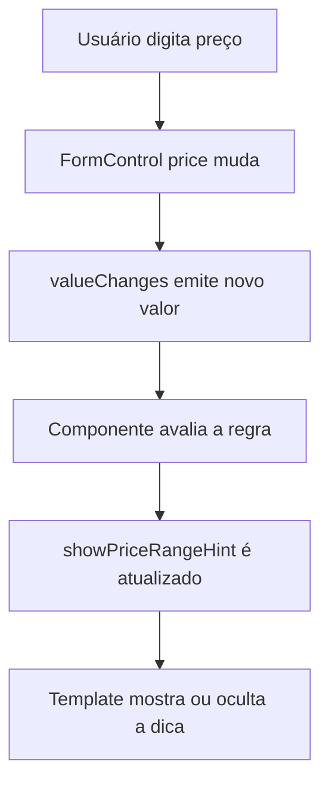
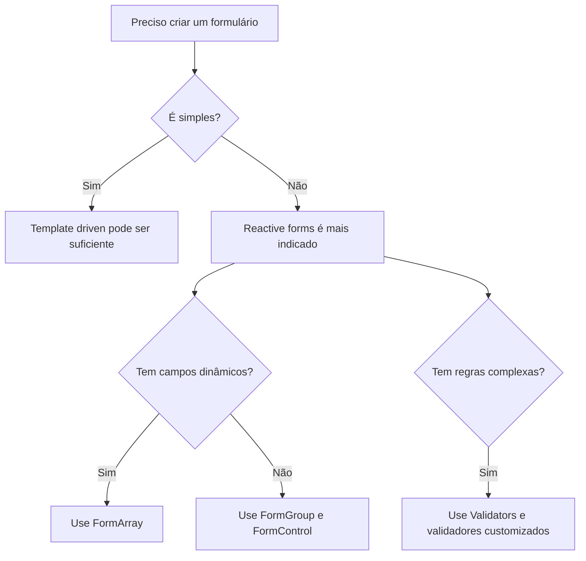

# Capítulo 10 — Coletando dados do usuário com formulários

Documentação baseada no Capítulo 10 enviado, **Collecting User Data with Forms**. 
Atualização relevante: a documentação atual do Angular continua apresentando **template-driven forms** e **reactive forms** como abordagens principais para formulários; também há **Signal Forms**, mas ainda como API experimental. ([Angular][1])

---

## 1. Visão geral

Formulários são usados em aplicações web para coletar dados do usuário, como:

* login;
* cadastro;
* alteração de perfil;
* busca;
* compra de produtos;
* preenchimento de dados sensíveis.

No Angular, os formulários permitem:

* criar diferentes tipos de campos de entrada;
* configurar validações;
* exibir mensagens de erro;
* controlar estados como válido, inválido, tocado e modificado;
* reagir a mudanças nos valores dos campos;
* enviar os dados para uma API ou armazená-los localmente.

O Angular oferece duas abordagens principais:



---

## 2. Template-driven forms

A abordagem **template-driven** concentra boa parte da configuração no HTML. É simples para formulários pequenos, mas tende a escalar pior em formulários grandes ou com validações complexas.

Para habilitar essa abordagem, importa-se o `FormsModule`:

```ts
import { FormsModule } from '@angular/forms';
```

E adiciona-se ao módulo:

```ts
@NgModule({
  imports: [
    CommonModule,
    ProductsRoutingModule,
    FormsModule
  ]
})
export class ProductsModule {}
```

### Two-way binding com `ngModel`

O capítulo usa o exemplo de alteração de preço de um produto:

```html
<input
  placeholder="New price"
  name="price"
  [(ngModel)]="product.price"
/>
```

A sintaxe `[(ngModel)]` é conhecida como **banana in a box**. Ela combina:

```html
[property binding]
```

com:

```html
(event binding)
```

Ou seja, o valor do componente atualiza o campo, e o campo também atualiza o valor do componente.



### Importante sobre `name`

Quando usamos `ngModel` dentro de um formulário, o campo precisa ter o atributo `name`:

```html
<input
  placeholder="New price"
  name="price"
  [(ngModel)]="price"
/>
```

Esse nome permite que o Angular registre o campo internamente como um controle do formulário.

---

## 3. Envio do formulário com `ngSubmit`

Em vez de capturar o clique do botão diretamente, o capítulo mostra uma abordagem mais correta: envolver os campos em um elemento `form` e usar o evento `ngSubmit`.

```html
<form (ngSubmit)="changePrice(product, price)">
  <input
    placeholder="New price"
    name="price"
    [(ngModel)]="price"
  />

  <button type="submit">Change</button>
</form>
```

O botão usa:

```html
<button type="submit">Change</button>
```

Isso permite que o formulário seja enviado tanto ao clicar no botão quanto ao pressionar **Enter** dentro do campo.

---

## 4. Problema de alterar o modelo diretamente

O capítulo destaca um problema importante: se o campo estiver ligado diretamente a `product.price`, o preço do produto muda enquanto o usuário digita.

Isso pode ser ruim, porque o valor exibido na tela é alterado antes de o usuário confirmar a mudança.

A solução apresentada é usar uma propriedade intermediária:

```ts
price: number | undefined;
```

E no template:

```html
<form (ngSubmit)="changePrice(product, price)">
  <input
    placeholder="New price"
    name="price"
    [(ngModel)]="price"
  />

  <button type="submit">Change</button>
</form>
```

Assim, o valor real do produto só muda quando o formulário for enviado.

---

## 5. Reactive forms

A abordagem **reactive forms** cria o modelo do formulário diretamente no TypeScript. Ela é mais explícita, testável e adequada para formulários maiores.

A documentação atual do Angular também descreve reactive forms como mais escaláveis, com acesso direto à API de formulários, fluxo síncrono e melhor suporte a testes. ([Angular][1])

Principais classes usadas:

| Classe            | Função                                                         |
| ----------------- | -------------------------------------------------------------- |
| `FormControl`     | Representa um campo individual, como um `input`.               |
| `FormGroup`       | Agrupa vários controles. Normalmente representa um formulário. |
| `FormArray`       | Representa uma lista dinâmica de controles ou grupos.          |
| `AbstractControl` | Classe base de `FormControl`, `FormGroup` e `FormArray`.       |

O `FormControl` rastreia valor e estado de validação de um campo; `FormGroup` agrupa controles conhecidos; `FormArray` rastreia uma coleção dinâmica de controles, grupos ou arrays. ([Angular][2])

---

## 6. Habilitando reactive forms

Para usar reactive forms, importa-se:

```ts
import { ReactiveFormsModule } from '@angular/forms';
```

E adiciona-se ao módulo:

```ts
@NgModule({
  imports: [
    CommonModule,
    ProductsRoutingModule,
    ReactiveFormsModule
  ]
})
export class ProductsModule {}
```

Em projetos Angular modernos com componentes standalone, o `ReactiveFormsModule` também pode ser importado diretamente no componente. ([Angular][3])

---

## 7. Criando um formulário reativo

Exemplo do capítulo para criação de produto:

```ts
import { FormControl, FormGroup } from '@angular/forms';

productForm = new FormGroup({
  name: new FormControl('', {
    nonNullable: true
  }),
  price: new FormControl<number | undefined>(undefined, {
    nonNullable: true
  })
});
```

Aqui temos:



No HTML, o formulário é conectado usando `formGroup`:

```html
<form [formGroup]="productForm">
  <div>
    <label for="name">Name</label>
    <input id="name" formControlName="name" />
  </div>

  <div>
    <label for="price">Price</label>
    <input id="price" formControlName="price" />
  </div>

  <div>
    <button type="button">Create</button>
  </div>
</form>
```

A diretiva `formControlName` liga o campo HTML ao controle correspondente dentro do `FormGroup`.

---

## 8. Acessando os controles com getters

Para evitar acessar os controles diretamente no template ou no método de criação, o capítulo cria getters:

```ts
get name() {
  return this.productForm.controls.name;
}

get price() {
  return this.productForm.controls.price;
}
```

Assim, o método de criação pode usar:

```ts
createProduct() {
  this.productService
    .addProduct(this.name.value, Number(this.price.value))
    .subscribe(product => {
      this.productForm.reset();
      this.added.emit(product);
    });
}
```

E o envio do formulário fica assim:

```html
<form [formGroup]="productForm" (ngSubmit)="createProduct()">
  <div>
    <label for="name">Name</label>
    <input id="name" formControlName="name" />
  </div>

  <div>
    <label for="price">Price</label>
    <input id="price" formControlName="price" />
  </div>

  <div>
    <button type="submit">Create</button>
  </div>
</form>
```

---

## 9. Estados automáticos dos controles

O Angular adiciona classes CSS automaticamente aos campos do formulário:

| Classe         | Significado                                |
| -------------- | ------------------------------------------ |
| `ng-untouched` | O usuário ainda não interagiu com o campo. |
| `ng-touched`   | O usuário já interagiu com o campo.        |
| `ng-dirty`     | O valor do campo foi alterado.             |
| `ng-pristine`  | O valor ainda não foi alterado.            |
| `ng-valid`     | O valor do campo é válido.                 |
| `ng-invalid`   | O valor do campo é inválido.               |

Essas classes permitem criar feedback visual:

```css
input.ng-touched {
  border: 3px solid lightblue;
}

input.ng-dirty.ng-valid {
  border: 2px solid green;
}

input.ng-dirty.ng-invalid {
  border: 2px solid red;
}
```

---

## 10. Validação com `required`

O capítulo mostra inicialmente o uso do atributo HTML `required`:

```html
<input id="name" formControlName="name" required />
<input id="price" formControlName="price" required />
```

Com isso, o Angular consegue marcar os controles como válidos ou inválidos.

Entretanto, em reactive forms, a fonte principal da validação deve ficar no modelo do formulário, ou seja, no TypeScript.

---

## 11. Hierarquia de formulários aninhados

Para formulários maiores, podemos ter um `FormGroup` dentro de outro `FormGroup`.

Exemplo:

```ts
productForm = new FormGroup({
  name: new FormControl('', {
    nonNullable: true
  }),
  price: new FormControl<number | undefined>(undefined, {
    nonNullable: true
  }),
  info: new FormGroup({
    category: new FormControl(''),
    description: new FormControl(''),
    image: new FormControl('')
  })
});
```

Representação:



No HTML, usa-se `formGroupName`:

```html
<form formGroupName="info">
  <h2>Product information</h2>

  <div>
    <label for="category">Category</label>
    <input id="category" formControlName="category" />
  </div>

  <div>
    <label for="descr">Description</label>
    <input id="descr" formControlName="description" />
  </div>

  <div>
    <label for="photo">Photo URL</label>
    <input id="photo" formControlName="image" />
  </div>
</form>
```

O estado do grupo filho afeta o grupo pai. Se um controle interno estiver inválido, o `FormGroup` filho fica inválido e o `FormGroup` pai também.



---

## 12. Criando formulários com `FormBuilder`

O `FormBuilder` reduz a verbosidade ao criar formulários reativos.

Importação:

```ts
import { FormBuilder, FormControl, FormGroup } from '@angular/forms';
```

Injeção no construtor:

```ts
constructor(
  private productService: ProductsService,
  private builder: FormBuilder
) {}
```

Tipo do formulário:

```ts
productForm: FormGroup<{
  name: FormControl<string>;
  price: FormControl<number | undefined>;
}> | undefined;
```

Criação com `buildForm`:

```ts
private buildForm() {
  this.productForm = this.builder.nonNullable.group({
    name: this.builder.nonNullable.control(''),
    price: this.builder.nonNullable.control<number | undefined>(undefined)
  });
}
```

O uso de `nonNullable` indica que os controles não devem aceitar `null`.

---

## 13. Validação em reactive forms

Com reactive forms, validadores são configurados no TypeScript:

```ts
import { FormControl, FormGroup, Validators } from '@angular/forms';
```

Exemplo:

```ts
productForm = new FormGroup({
  name: new FormControl('', {
    nonNullable: true,
    validators: Validators.required
  }),
  price: new FormControl<number | undefined>(undefined, {
    nonNullable: true,
    validators: Validators.required
  })
});
```

Também é possível combinar validadores:

```ts
price: new FormControl<number | undefined>(undefined, {
  nonNullable: true,
  validators: [Validators.required, Validators.min(1)]
})
```

O botão pode ser desabilitado enquanto o formulário estiver inválido:

```html
<button type="submit" [disabled]="!productForm.valid">
  Create
</button>
```

---

## 14. Mensagens de erro específicas

Podemos exibir mensagens com base no estado do controle:

```html
<div>
  <label for="name">Name</label>
  <input id="name" formControlName="name" required />

  <span *ngIf="name.touched && name.invalid">
    The name is not valid
  </span>
</div>
```

Para o campo de preço:

```html
<div>
  <label for="price">Price</label>
  <input id="price" formControlName="price" required />

  <span *ngIf="price.touched && price.hasError('required')">
    The price is required
  </span>

  <span *ngIf="price.touched && price.hasError('min')">
    The price should be greater than 1
  </span>
</div>
```

Fluxo da validação:



---

## 15. Validador customizado

Quando os validadores prontos não cobrem a regra de negócio, criamos um validador customizado.

Exemplo do capítulo: validar se o preço está entre `1` e `10000`.

```ts
import {
  AbstractControl,
  ValidationErrors,
  ValidatorFn
} from '@angular/forms';

export function priceRangeValidator(): ValidatorFn {
  return (
    control: AbstractControl<number>
  ): ValidationErrors | null => {
    const inRange = control.value > 1 && control.value < 10000;

    return inRange ? null : { outOfRange: true };
  };
}
```

Aplicando no formulário:

```ts
price: new FormControl<number | undefined>(undefined, {
  nonNullable: true,
  validators: [
    Validators.required,
    priceRangeValidator()
  ]
})
```

Mensagem no HTML:

```html
<span *ngIf="price.touched && price.hasError('outOfRange')">
  The price is out of range
</span>
```

---

## 16. FormArray e formulários dinâmicos

O `FormArray` é usado quando a quantidade de controles não é fixa.

No capítulo, ele aparece no carrinho de compras. Cada produto adicionado ao carrinho recebe um campo para informar a quantidade.



Serviço do carrinho:

```ts
import { Product } from '../products/product';

export class CartService {
  cart: Product[] = [];

  constructor() {}

  addProduct(product: Product) {
    this.cart.push(product);
  }
}
```

No componente de detalhes:

```ts
constructor(
  private productService: ProductsService,
  public authService: AuthService,
  private route: ActivatedRoute,
  private cartService: CartService
) {}
```

Método de compra:

```ts
buy(product: Product) {
  this.cartService.addProduct(product);
}
```

Botão:

```html
<button
  *ngIf="authService.isLoggedIn"
  (click)="buy(product)">
  Buy Now
</button>
```

No componente do carrinho:

```ts
import { FormArray, FormControl, FormGroup } from '@angular/forms';
import { Product } from '../products/product';
import { CartService } from './cart.service';

cartForm = new FormGroup({
  products: new FormArray<FormControl<number>>([])
});

cart: Product[] = [];
```

No `ngOnInit`:

```ts
ngOnInit(): void {
  this.cart = this.cartService.cart;

  this.cart.forEach(() => {
    this.cartForm.controls.products.push(
      new FormControl(1, {
        nonNullable: true
      })
    );
  });
}
```

Template:

```html
<h2>My Cart</h2>

<div [formGroup]="cartForm">
  <div
    formArrayName="products"
    *ngFor="
      let product of cartForm.controls.products.controls;
      let i = index
    ">
    <label>{{ cart[i].name }}</label>
    <input type="number" [formControlName]="i" />
  </div>
</div>
```

Representação da estrutura:



---

## 17. Manipulando dados do formulário

O `FormGroup` permite alterar valores programaticamente com dois métodos principais:

| Método       | Uso                                                                |
| ------------ | ------------------------------------------------------------------ |
| `setValue`   | Substitui os valores de todos os controles. Exige todas as chaves. |
| `patchValue` | Atualiza apenas alguns controles. Aceita atualização parcial.      |

Exemplo com `setValue`:

```ts
this.productForm.setValue({
  name: 'New product',
  price: 150
});
```

Se algum campo do formulário for omitido, o Angular lançará erro.

Exemplo com `patchValue`:

```ts
this.productForm.patchValue({
  price: 150
});
```

Nesse caso, apenas o preço é atualizado.

---

## 18. Reagindo a mudanças com `valueChanges`

Reactive forms permitem observar mudanças nos campos usando observables.

Cada `FormControl` possui:

| Propriedade     | Função                              |
| --------------- | ----------------------------------- |
| `valueChanges`  | Emite eventos quando o valor muda.  |
| `statusChanges` | Emite eventos quando o status muda. |

O capítulo usa `valueChanges` para exibir uma dica sobre a faixa válida de preço:

```ts
showPriceRangeHint = false;
```

```ts
ngOnInit(): void {
  this.price.valueChanges.subscribe(price => {
    if (price) {
      this.showPriceRangeHint = price > 1 && price < 10000;
    }
  });
}
```

Template:

```html
<span *ngIf="showPriceRangeHint">
  Price should be between 1 and 10000
</span>
```

Fluxo:



Ponto de atenção: `valueChanges` e `statusChanges` são observables. Em componentes com ciclo de vida longo ou múltiplas inscrições, é importante cancelar inscrições quando o componente for destruído.

---

## 19. Template-driven vs Reactive forms

Comparação prática:

| Critério                     | Template-driven              | Reactive forms                 |
| ---------------------------- | ---------------------------- | ------------------------------ |
| Onde o formulário é modelado | Principalmente no HTML       | Principalmente no TypeScript   |
| Complexidade inicial         | Menor                        | Maior                          |
| Escalabilidade               | Menor                        | Maior                          |
| Testabilidade                | Mais difícil                 | Mais fácil                     |
| Validação                    | Mais declarativa no template | Mais explícita no código       |
| Formulários dinâmicos        | Mais limitado                | Melhor com `FormArray`         |
| Melhor uso                   | Formulários simples          | Formulários médios e complexos |



---

## 20. Boas práticas extraídas do capítulo

1. Use `ngSubmit` em vez de depender apenas do clique do botão.
2. Em reactive forms, mantenha a validação no TypeScript.
3. Use `FormGroup` para representar o formulário.
4. Use `FormControl` para representar campos individuais.
5. Use `FormArray` quando a quantidade de campos for dinâmica.
6. Use getters para melhorar a legibilidade do código.
7. Exiba mensagens de erro somente depois de interação do usuário, como `touched` ou `dirty`.
8. Desabilite o botão de envio enquanto o formulário estiver inválido.
9. Use validadores customizados para regras de negócio.
10. Cancele inscrições em observables quando necessário.

---

## 21. Resumo final

O capítulo apresenta formulários em Angular como um recurso essencial para coleta de dados do usuário. Primeiro, mostra formulários HTML simples e depois introduz as duas abordagens do Angular: **template-driven forms** e **reactive forms**.

A abordagem template-driven é útil para formulários pequenos, usando `FormsModule` e `ngModel`. Já a abordagem reativa, foco principal do capítulo, usa `ReactiveFormsModule`, `FormGroup`, `FormControl`, `FormArray`, validadores e observables para criar formulários mais robustos, previsíveis e escaláveis.

O ponto central é que reactive forms permitem tratar o formulário como um modelo explícito no TypeScript, facilitando validação, testes, alteração dinâmica de campos e reação a mudanças de estado.

[1]: https://angular.dev/guide/forms?utm_source=chatgpt.com "Forms • Overview"
[2]: https://angular.dev/api/forms/FormControl?utm_source=chatgpt.com "FormControl"
[3]: https://angular.dev/guide/forms/dynamic-forms?utm_source=chatgpt.com "Building dynamic forms"
