# Capítulo 11 — Introdução ao Angular Material

Documentação em português baseada no PDF enviado, páginas 1 a 20, com atualização pontual para o cenário atual do Angular/Angular Material. O capítulo original trabalha com Angular Material 15 e Angular 15, usando `NgModule` e arquivos como `app.module.ts`. 

> Atualização: a documentação atual do Angular está em versão 21 na página oficial, enquanto o Angular Material continua sendo a biblioteca oficial de componentes Material Design para aplicações Angular. ([Angular][1])
> O comando de instalação continua conceitualmente o mesmo: `ng add @angular/material`. ([Angular Material][2])

---

## 1. Objetivo do capítulo

O capítulo apresenta o Angular Material como uma biblioteca de componentes visuais pronta para acelerar a criação de interfaces Angular com aparência consistente, responsiva e baseada no Material Design.

Os principais temas são:

1. Entender o que é Material Design.
2. Instalar Angular Material no projeto.
3. Adicionar botões, campos, autocomplete, select, checkbox e datepicker.
4. Usar temas, paletas e estilos prontos.
5. Criar uma barra de navegação com `MatToolbar`.

---

## 2. Visão geral

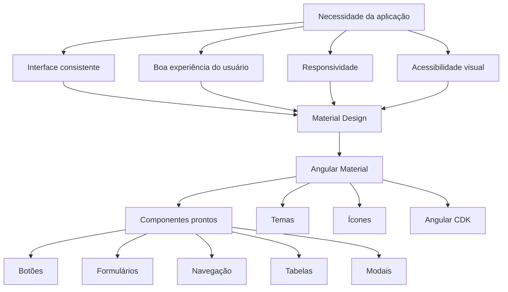

---

## 3. Material Design

Material Design é uma linguagem visual criada pelo Google. A ideia central é criar interfaces que pareçam previsíveis, organizadas e naturais para o usuário.

O capítulo destaca três princípios importantes:

| Princípio                  | Ideia principal                                                                   |
| -------------------------- | --------------------------------------------------------------------------------- |
| Material como metáfora     | A interface se inspira em objetos físicos, como papel, camadas e superfícies.     |
| Visual claro e intencional | Tipografia, grades, cores e espaços ajudam a guiar o usuário.                     |
| Movimento com significado  | Animações devem indicar mudança de estado, foco ou transição, não apenas decorar. |

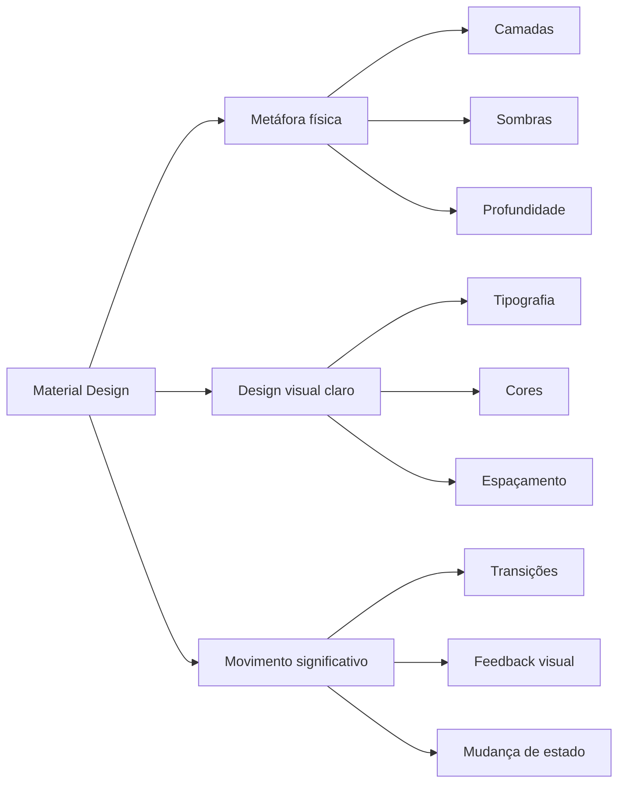

---

## 4. Angular Material

Angular Material é a implementação dos componentes Material Design para Angular.

Segundo o capítulo, a biblioteca é organizada principalmente em:

| Parte      | Função                                                                                               |
| ---------- | ---------------------------------------------------------------------------------------------------- |
| Components | Componentes de interface: botões, inputs, tabelas, menus, modais etc.                                |
| Themes     | Temas prontos e sistema de customização visual.                                                      |
| Icons      | Conjunto de ícones baseados no Material Icons.                                                       |
| CDK        | Base técnica usada por vários componentes, como overlays, acessibilidade e comportamento estrutural. |

---

## 5. Instalação

No projeto Angular, o capítulo usa:

```bash
ng add @angular/material
```

Durante a instalação, o Angular CLI pergunta:

1. Qual tema pré-configurado será usado.
2. Se os estilos globais de tipografia serão aplicados.
3. Se as animações do Angular serão habilitadas.

Fluxo:

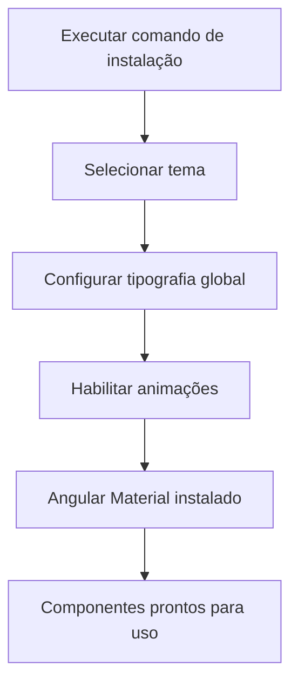

Temas pré-configurados citados no capítulo:

| Tema              | Observação                            |
| ----------------- | ------------------------------------- |
| Indigo/Pink       | Tema padrão sugerido.                 |
| Deep Purple/Amber | Alternativa com roxo e âmbar.         |
| Pink/Blue-Grey    | Alternativa com rosa e cinza azulado. |
| Purple/Green      | Alternativa com roxo e verde.         |

---

## 6. Como adicionar um componente Material

O padrão apresentado no capítulo é:

1. Importar o módulo do componente.
2. Registrar o módulo no array `imports`.
3. Usar a diretiva ou componente no HTML.

Exemplo com botão:

```ts
import { MatButtonModule } from '@angular/material/button';

@NgModule({
  imports: [
    MatButtonModule
  ]
})
export class AppModule {}
```

Template:

```html
<button mat-button>
  I am an Angular Material button
</button>
```

Fluxo conceitual:

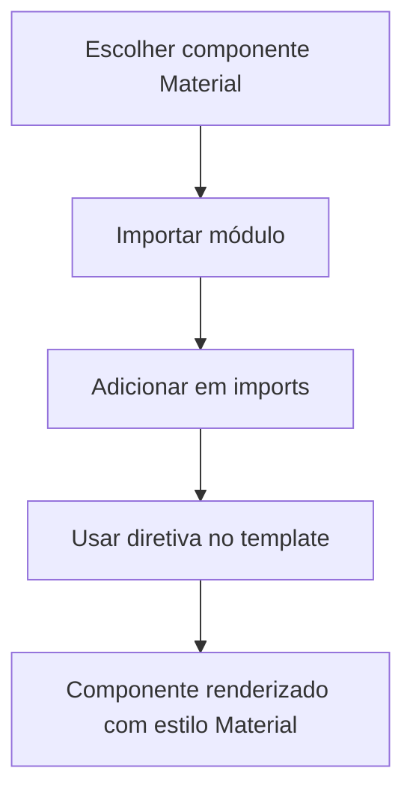

---

## 7. Temas e paletas

Angular Material trabalha com paletas de cores. O capítulo apresenta três paletas principais:

| Paleta    | Uso comum                          |
| --------- | ---------------------------------- |
| `primary` | Ação principal da aplicação.       |
| `accent`  | Destaques secundários.             |
| `warn`    | Alertas, erros ou ações perigosas. |

Exemplo:

```html
<button mat-button color="primary">
  Primary button
</button>
```

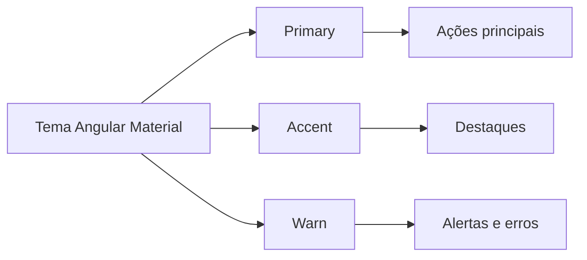

---

## 8. Categorias de componentes

O capítulo organiza os componentes em grandes categorias:

| Categoria            | Exemplos                                                   |
| -------------------- | ---------------------------------------------------------- |
| Buttons              | Botões comuns, elevados, ícones, FAB e toggles.            |
| Form controls        | Input, select, checkbox, radio button, datepicker, slider. |
| Navigation           | Menu, sidenav e toolbar.                                   |
| Layout               | Lista, card e organização visual.                          |
| Popups / modals      | Dialogs, overlays e janelas de interação.                  |
| Tables               | Tabelas com paginação, ordenação e filtros.                |
| Integration controls | Controles integrados a serviços externos.                  |

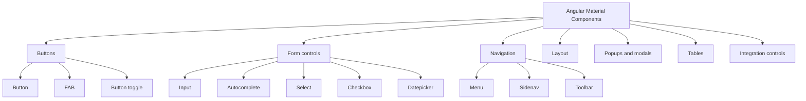

---

## 9. Botões

O capítulo mostra vários tipos de botões:

| Tipo                 | Descrição                                             |
| -------------------- | ----------------------------------------------------- |
| `mat-raised-button`  | Botão elevado, com sombra.                            |
| `mat-flat-button`    | Botão preenchido, sem sombra.                         |
| `mat-stroked-button` | Botão com borda.                                      |
| `mat-icon-button`    | Botão apenas com ícone.                               |
| `mat-fab`            | Floating Action Button, geralmente circular.          |
| `mat-mini-fab`       | Versão menor do FAB.                                  |
| `mat-button-toggle`  | Botão de seleção ligado/desligado ou grupo de opções. |

Exemplo:

```html
<button mat-raised-button>Raised button</button>

<button mat-flat-button>Flat button</button>

<button mat-stroked-button>Stroked button</button>

<button mat-icon-button>
  <mat-icon>favorite</mat-icon>
</button>

<button mat-fab>
  <mat-icon>delete</mat-icon>
</button>

<mat-button-toggle-group>
  <mat-button-toggle value="left">
    <mat-icon>format_align_left</mat-icon>
  </mat-button-toggle>

  <mat-button-toggle value="center">
    <mat-icon>format_align_center</mat-icon>
  </mat-button-toggle>

  <mat-button-toggle value="right">
    <mat-icon>format_align_right</mat-icon>
  </mat-button-toggle>
</mat-button-toggle-group>
```

Módulos envolvidos:

```ts
import { MatButtonModule } from '@angular/material/button';
import { MatIconModule } from '@angular/material/icon';
import { MatButtonToggleModule } from '@angular/material/button-toggle';
```

---

## 10. Controles de formulário

O capítulo usa os controles de formulário para melhorar a tela de criação de produtos.

### 10.1 Input com `mat-form-field`

Módulos:

```ts
import { MatFormFieldModule } from '@angular/material/form-field';
import { MatInputModule } from '@angular/material/input';
```

Template:

```html
<mat-form-field>
  <input
    matInput
    formControlName="name"
    placeholder="Name"
    required
  />

  <mat-error>
    The name is not valid
  </mat-error>
</mat-form-field>

<mat-form-field>
  <input
    matInput
    formControlName="price"
    placeholder="Price"
    required
  />

  <mat-error>
    The price is required
  </mat-error>

  <mat-hint>
    Price should be between 1 and 10000
  </mat-hint>
</mat-form-field>

<button
  mat-raised-button
  color="primary"
  type="submit"
  [disabled]="productForm.valid">
  Create
</button>
```

> Observação técnica: no Angular real, normalmente o botão deveria ser desabilitado quando o formulário **não** estiver válido:
>
> ```html
> [disabled]="productForm.invalid"
> ```

---

## 11. Autocomplete

O autocomplete ajuda o usuário a escolher valores sugeridos enquanto digita. No exemplo do capítulo, ele é usado para sugerir nomes de produtos já existentes.

Módulo:

```ts
import { MatAutocompleteModule } from '@angular/material/autocomplete';
```

Fluxo:

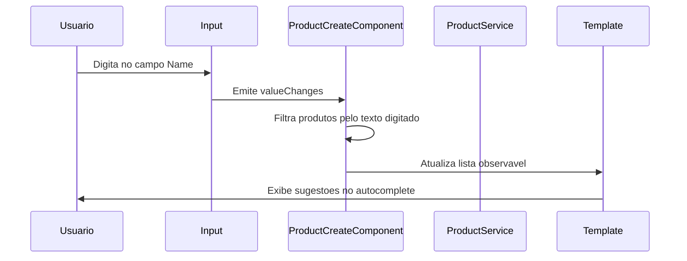

Código TypeScript simplificado:

```ts
import { map, Observable, startWith } from 'rxjs';

products: Product[] = [];
products$: Observable<Product[]> | undefined;

ngOnInit(): void {
  this.productService.getProducts().subscribe(products => {
    this.products = products;
  });

  this.products$ = this.name.valueChanges.pipe(
    startWith(''),
    map(name =>
      this.products.filter(product =>
        product.name.startsWith(name)
      )
    )
  );
}
```

Template:

```html
<mat-form-field>
  <input
    matInput
    formControlName="name"
    placeholder="Name"
    [matAutocomplete]="productsAuto"
  />

  <mat-autocomplete #productsAuto="matAutocomplete">
    <mat-option
      *ngFor="let product of products$ | async"
      [value]="product.name">
      {{ product.name }}
    </mat-option>
  </mat-autocomplete>
</mat-form-field>
```

---

## 12. Select com múltipla seleção

O `mat-select` funciona de forma parecida com o `select` nativo do HTML, mas com estilo e comportamento Material.

Módulo:

```ts
import { MatSelectModule } from '@angular/material/select';
```

No componente:

```ts
categories = ['Hardware', 'Computers', 'Clothing', 'Software'];
```

Template:

```html
<mat-form-field>
  <mat-label>Categories</mat-label>

  <mat-select multiple>
    <mat-option
      *ngFor="let category of categories"
      [value]="category">
      {{ category }}
    </mat-option>
  </mat-select>
</mat-form-field>
```

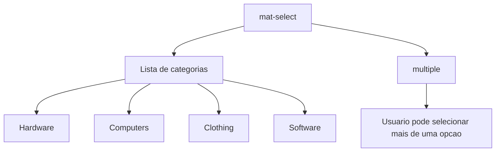

---

## 13. Checkbox

O checkbox representa um valor booleano ou, em alguns casos, um estado indeterminado.

Módulo:

```ts
import { MatCheckboxModule } from '@angular/material/checkbox';
```

Template:

```html
<mat-checkbox
  color="primary"
  [checked]="isChecked">
  Check me
</mat-checkbox>
```

Estados possíveis:

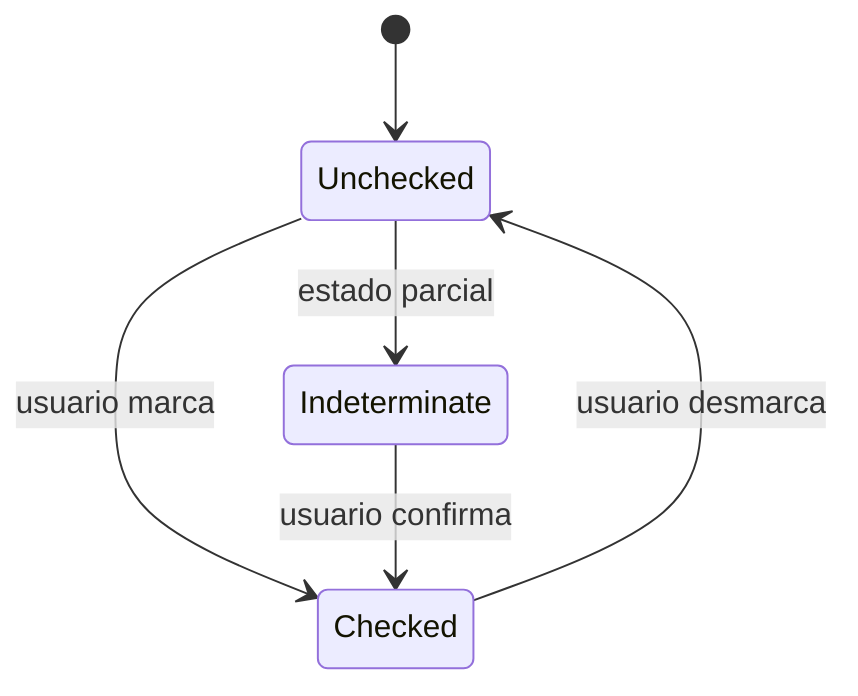

---

## 14. Date picker

O datepicker permite selecionar datas usando um calendário visual.

Módulos:

```ts
import { MatDatepickerModule } from '@angular/material/datepicker';
import { MatNativeDateModule } from '@angular/material/core';
```

Template:

```html
<mat-form-field>
  <input
    matInput
    type="text"
    placeholder="Production date"
    [matDatepicker]="picker"
  />

  <mat-datepicker-toggle
    matSuffix
    [for]="picker">
  </mat-datepicker-toggle>

  <mat-datepicker #picker></mat-datepicker>
</mat-form-field>
```

Fluxo:

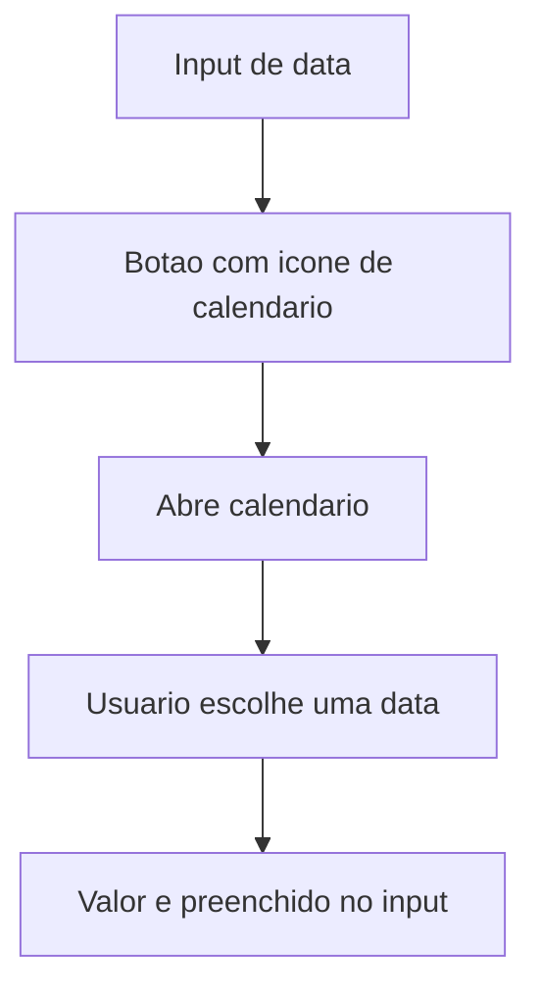

---

## 15. Navegação com Toolbar

O capítulo encerra criando uma barra superior com `MatToolbar`.

Módulo:

```ts
import { MatToolbarModule } from '@angular/material/toolbar';
```

Template principal:

```html
<mat-toolbar color="primary">
  <span>My e-shop</span>

  <span class="spacer"></span>

  <a mat-flat-button color="primary" routerLink="/products">
    Products
  </a>

  <a mat-flat-button color="primary" routerLink="/cart">
    Cart
  </a>

  <a mat-flat-button color="primary" routerLink="/about">
    About Us
  </a>

  <app-auth></app-auth>
</mat-toolbar>

<router-outlet></router-outlet>
```

CSS:

```css
.spacer {
  flex: 1 auto;
}
```

Estrutura visual:

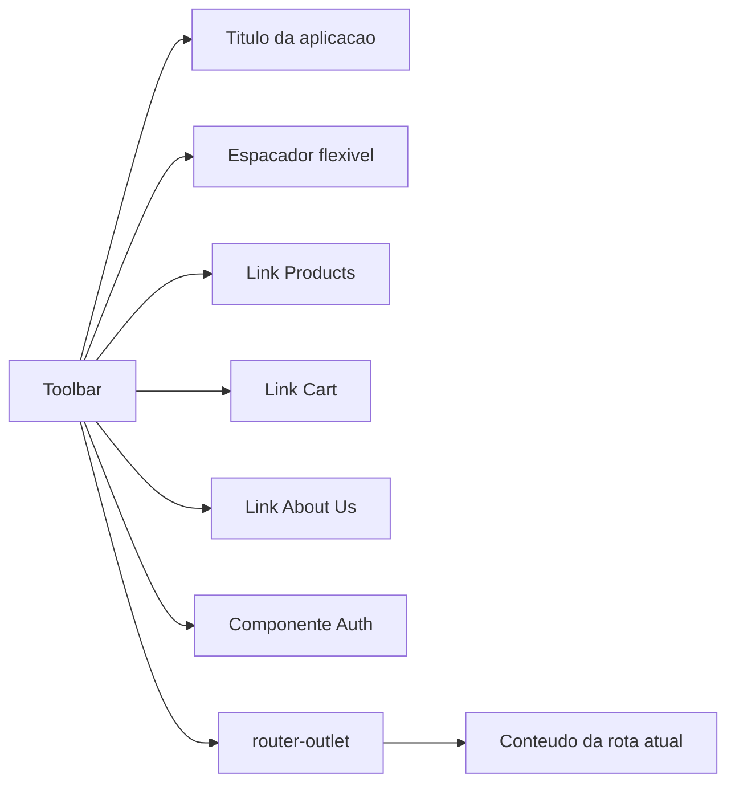

---

## 16. Resumo prático dos módulos usados

| Recurso             | Módulo                  |
| ------------------- | ----------------------- |
| Botões              | `MatButtonModule`       |
| Ícones              | `MatIconModule`         |
| Button toggle       | `MatButtonToggleModule` |
| Form field          | `MatFormFieldModule`    |
| Input               | `MatInputModule`        |
| Autocomplete        | `MatAutocompleteModule` |
| Select              | `MatSelectModule`       |
| Checkbox            | `MatCheckboxModule`     |
| Date picker         | `MatDatepickerModule`   |
| Date adapter nativo | `MatNativeDateModule`   |
| Toolbar             | `MatToolbarModule`      |

---

## 17. Ponto de atenção para Angular moderno

O capítulo usa `NgModule`, o que está correto para Angular 15 e para muitos projetos existentes. Em projetos Angular mais novos, também é comum usar componentes standalone.

Exemplo moderno equivalente:

```ts
@Component({
  selector: 'app-example',
  standalone: true,
  imports: [
    MatButtonModule,
    MatFormFieldModule,
    MatInputModule
  ],
  templateUrl: './example.component.html'
})
export class ExampleComponent {}
```

A ideia permanece a mesma:

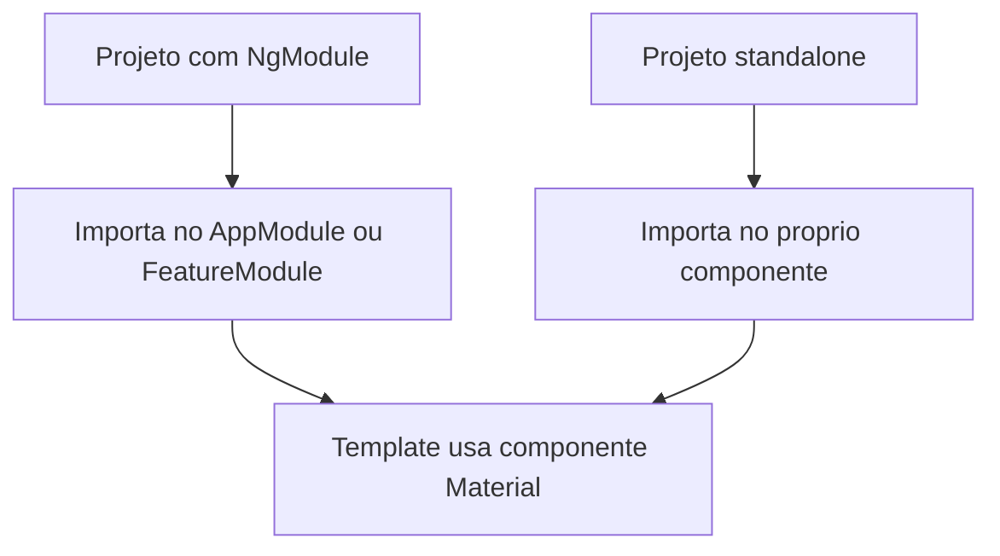

---

## 18. Conclusão

O capítulo mostra que Angular Material reduz o esforço de criação de interfaces ao fornecer componentes prontos, consistentes e integrados ao Angular. A principal habilidade prática é entender o ciclo:

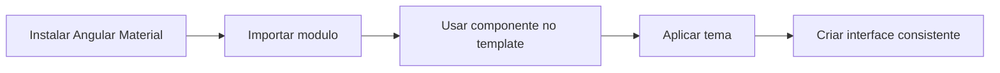

Para o projeto do livro, o caminho é baseado em `NgModule`. Para projetos atuais, vale manter o mesmo raciocínio, mas considerar o uso de standalone components quando a arquitetura do projeto permitir.

[1]: https://angular.dev/ "Home • Angular"
[2]: https://v12.material.angular.io/docs-content/guides/getting-started?utm_source=chatgpt.com "Getting Started with Angular Material"
