# Capítulo 12 — Testes unitários em uma aplicação Angular

Fonte principal: material enviado do **Capítulo 12 — “Unit Test an Angular Application”**. 
Observação de atualização: o capítulo trabalha com **Jasmine + Karma**, que era o fluxo padrão do Angular CLI. Nas versões atuais do Angular, novos projetos usam **Vitest + jsdom** por padrão, mas **Karma + Jasmine continuam suportados** e podem ser usados com `--test-runner=karma`. ([Angular][1])

---

## 1. Objetivo do capítulo

O capítulo apresenta como testar uma aplicação Angular por meio de **testes unitários**. A ideia central é validar pequenas partes da aplicação de forma isolada, garantindo que componentes, dependências e interações básicas funcionem conforme o esperado.

Os principais pontos abordados no trecho enviado são:

* por que escrever testes;
* anatomia de um teste unitário;
* Jasmine, Karma e utilitários de teste do Angular;
* testes de componentes;
* uso de `TestBed`;
* uso de `ComponentFixture`;
* testes com dependências usando **stub** e **spy**;
* testes assíncronos com `waitForAsync` e `fakeAsync`;
* testes com `@Input` e `@Output`.

---

## 2. Por que precisamos de testes?

Testes unitários ajudam a manter a qualidade da aplicação conforme o código cresce. Em aplicações Angular corporativas, isso é importante porque alterações pequenas podem quebrar comportamentos já existentes.

O capítulo destaca três benefícios principais:

1. **Testes ajudam a validar requisitos**
   Ao escrever testes, o desenvolvedor precisa entender o comportamento esperado da funcionalidade.

2. **Testes facilitam refatorações**
   Quando há testes cobrindo o comportamento, é mais seguro alterar a estrutura interna do código.

3. **Testes documentam o código**
   Um bom teste mostra como determinada funcionalidade deve se comportar.

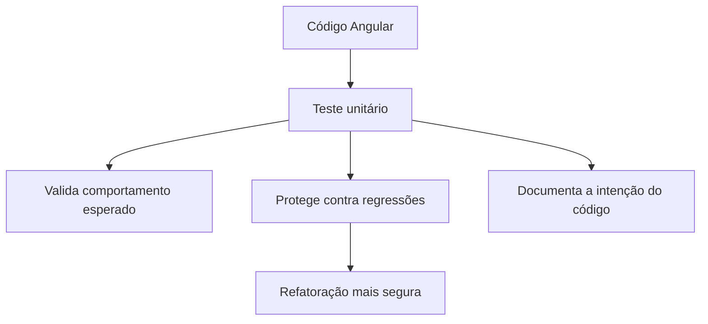

---

## 3. Anatomia de um teste unitário

Um teste unitário normalmente é organizado em **suítes** e **especificações**.

| Elemento   | Função                                                    |
| ---------- | --------------------------------------------------------- |
| `describe` | Agrupa testes relacionados                                |
| `it`       | Define um caso de teste específico                        |
| `expect`   | Define a expectativa do teste                             |
| matcher    | Verifica o resultado, como `toBe`, `toEqual`, `toContain` |

Exemplo conceitual:

```ts
describe('Calculator', () => {
  it('should add two numbers', () => {
    expect(1 + 1).toBe(2);
  });
});
```

Fluxo lógico:

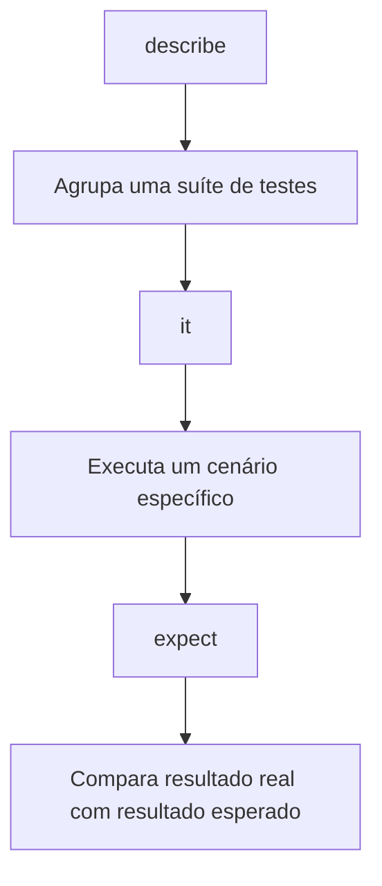

---

## 4. Setup e teardown

O capítulo apresenta duas funções importantes:

| Função       | Quando executa       | Uso                       |
| ------------ | -------------------- | ------------------------- |
| `beforeEach` | Antes de cada teste  | Preparar estado inicial   |
| `afterEach`  | Depois de cada teste | Limpar estado ou recursos |

Exemplo:

```ts
describe('Calculator', () => {
  let total = 0;

  beforeEach(() => total = 1);

  it('should add two numbers', () => {
    total = total + 1;
    expect(total).toBe(2);
  });

  it('should subtract two numbers', () => {
    total = total - 1;
    expect(total).toBe(0);
  });

  afterEach(() => total = 0);
});
```

A ideia é evitar que um teste dependa do estado deixado por outro.

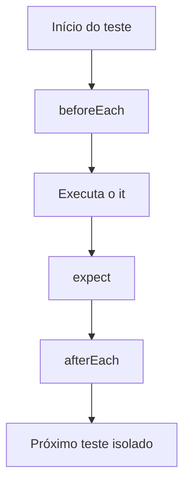

---

## 5. Ferramentas de teste no Angular

No contexto do capítulo, o Angular CLI configura testes usando:

| Ferramenta                | Papel                                                           |
| ------------------------- | --------------------------------------------------------------- |
| Jasmine                   | Framework de testes                                             |
| Karma                     | Executor de testes no navegador                                 |
| Angular Testing Utilities | Utilitários como `TestBed`, `ComponentFixture` e `DebugElement` |

Atualização: a documentação atual do Angular informa que novos projetos usam **Vitest** por padrão, enquanto Karma permanece suportado. O comando `ng test` continua sendo o comando principal para executar testes. ([Angular][1])

---

## 6. Testando componentes

Um componente Angular possui duas partes principais:

* classe TypeScript;
* template HTML.

Por isso, testar apenas a classe pode não ser suficiente. É comum testar também se o template renderiza corretamente. A própria documentação atual do Angular reforça que um componente é a combinação da classe com o template e que testes de componente podem verificar sua interação com o DOM. ([Angular][2])

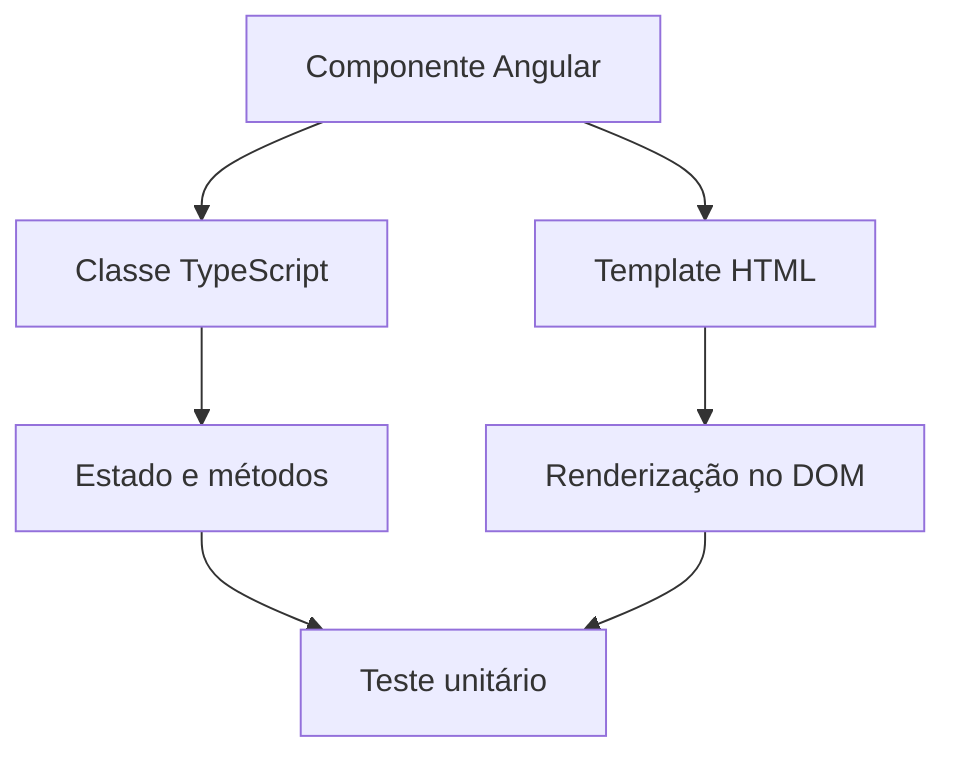

---

## 7. TestBed

O `TestBed` cria um módulo de teste semelhante a um módulo Angular real.

Exemplo baseado no capítulo:

```ts
beforeEach(async () => {
  await TestBed.configureTestingModule({
    declarations: [
      AppComponent
    ],
  }).compileComponents();
});
```

O papel do `TestBed` é preparar o ambiente necessário para testar artefatos Angular.

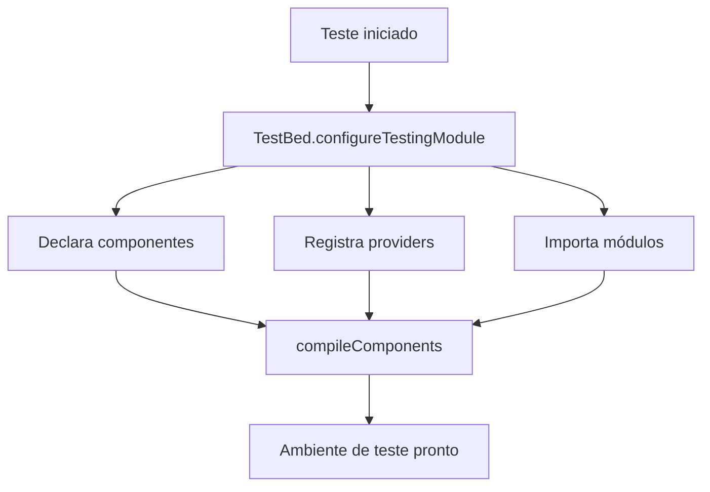

---

## 8. ComponentFixture

O `ComponentFixture` é um wrapper ao redor da instância do componente.

Ele permite acessar:

| Recurso             | Uso                                                           |
| ------------------- | ------------------------------------------------------------- |
| `componentInstance` | A instância da classe do componente                           |
| `nativeElement`     | O elemento HTML renderizado                                   |
| `detectChanges`     | Executa o ciclo de detecção de mudanças                       |
| `debugElement`      | Abstração do elemento para testes independentes de plataforma |

Exemplo:

```ts
it('should create the app', () => {
  const fixture = TestBed.createComponent(AppComponent);
  const app = fixture.componentInstance;

  expect(app).toBeTruthy();
});
```

---

## 9. Testando propriedades do componente

O capítulo mostra um teste simples para validar uma propriedade pública do componente.

```ts
it('should have as title my-app', () => {
  const fixture = TestBed.createComponent(AppComponent);
  const app = fixture.componentInstance;

  expect(app.title).toEqual('my-app');
});
```

Esse tipo de teste verifica apenas a classe TypeScript.

---

## 10. Testando renderização no template

Para verificar se o template foi atualizado corretamente, é necessário chamar `detectChanges`.

```ts
it('should render title', () => {
  const fixture = TestBed.createComponent(AppComponent);

  fixture.detectChanges();

  const compiled = fixture.nativeElement as HTMLElement;

  expect(
    compiled.querySelector('.content span')?.textContent
  ).toContain('my-app app is running!');
});
```

Fluxo:

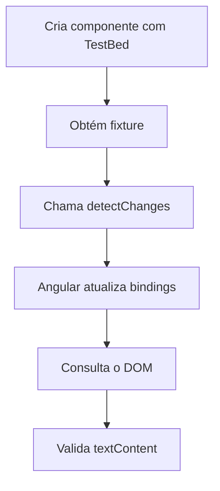

---

## 11. Executando os testes

No capítulo, os testes são executados com:

```bash
ng test
```

No fluxo tradicional com Karma, o navegador é aberto e os testes são executados automaticamente. O capítulo também menciona que o Karma roda em **watch mode**, ou seja, ele observa alterações nos arquivos e executa novamente os testes.

Para execução sem modo contínuo:

```bash
ng test --no-watch
```

---

## 12. Testando componentes com dependências

Componentes reais geralmente dependem de serviços. O capítulo apresenta duas estratégias principais para lidar com dependências em testes:

| Estratégia | Ideia                                                                 |
| ---------- | --------------------------------------------------------------------- |
| Stub       | Substituir a dependência real por uma falsa                           |
| Spy        | Usar a dependência real ou falsa, mas monitorando chamadas de métodos |

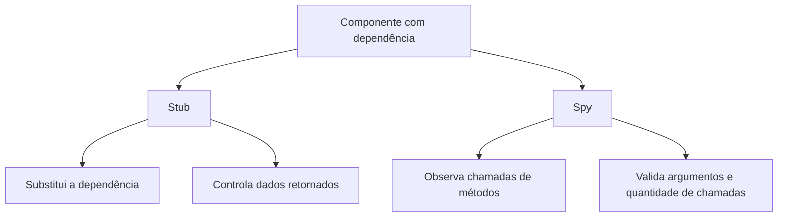

---

## 13. Stub de dependência

Um **stub** substitui uma dependência real por uma implementação controlada no teste.

Exemplo conceitual:

```ts
const serviceStub: Partial<StubService> = {
  name: 'Boothstomper'
};
```

Depois, o serviço falso é registrado no `TestBed`:

```ts
await TestBed.configureTestingModule({
  declarations: [StubComponent],
  providers: [
    { provide: StubService, useValue: serviceStub }
  ]
});
```

Isso permite testar o componente sem depender do serviço real.

---

## 14. Inject no teste

O capítulo usa `TestBed.inject` para obter a instância injetada no ambiente de teste.

```ts
service = TestBed.inject(StubService);
```

Atenção importante destacada pelo capítulo: o teste deve injetar o **tipo real do serviço**, não o objeto stub diretamente. O Angular usa o token da dependência para resolver o provider.

---

## 15. Override de provider no componente

Nem sempre o provider está no módulo. Às vezes, ele está no próprio componente. Nesse caso, apenas registrar o stub no `TestBed` pode não ser suficiente.

O capítulo apresenta o uso de `overrideComponent`:

```ts
await TestBed.configureTestingModule({
  declarations: [StubComponent]
})
.overrideComponent(StubComponent, {
  set: {
    providers: [
      { provide: StubService, useValue: serviceStub }
    ]
  }
});
```

Fluxo:

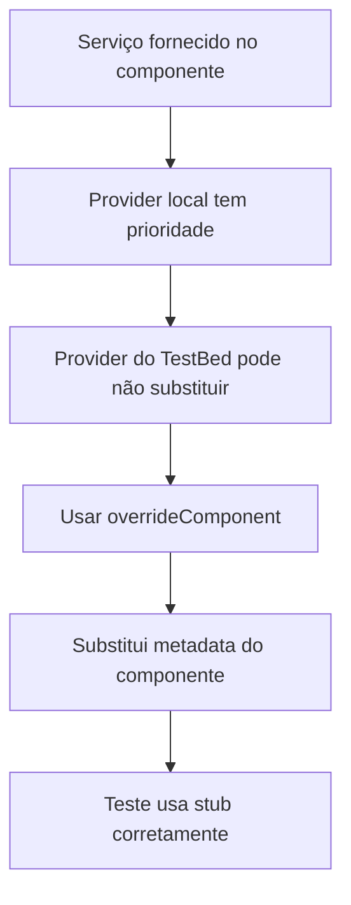

---

## 16. Spy em métodos de dependência

Um **spy** permite observar se um método foi chamado, com quais argumentos e quantas vezes.

Exemplo com o serviço `Title`:

```ts
it('should set the title', () => {
  const title = TestBed.inject(Title);
  const spy = spyOn(title, 'setTitle');

  fixture.detectChanges();

  expect(spy).toHaveBeenCalledWith('My Angular app');
});
```

Esse teste não precisa validar o efeito final no navegador. Ele valida que o componente tentou chamar corretamente o serviço.

---

## 17. Spy object

O capítulo também mostra o uso de `jasmine.createSpyObj`.

```ts
let titleSpy: jasmine.SpyObj<Title>;

beforeEach(() => {
  titleSpy = jasmine.createSpyObj('Title', ['getTitle', 'setTitle']);

  titleSpy.getTitle.and.returnValue('My title');

  TestBed.configureTestingModule({
    declarations: [SpyComponent],
    providers: [
      { provide: Title, useValue: titleSpy }
    ]
  });
});
```

Esse padrão é útil quando queremos criar uma dependência totalmente falsa, mas com métodos monitoráveis.

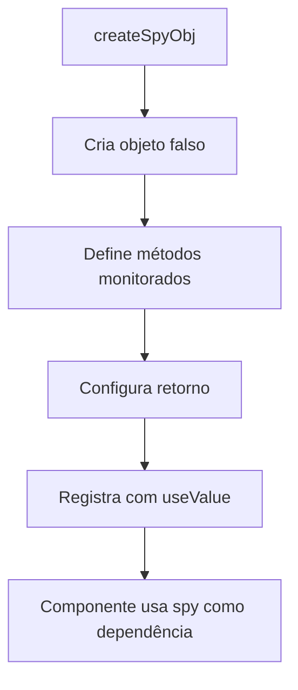

---

## 18. Testes assíncronos

O capítulo apresenta dois caminhos para testar código assíncrono:

| Função         | Característica                                      |
| -------------- | --------------------------------------------------- |
| `waitForAsync` | Espera Promises e tarefas assíncronas estabilizarem |
| `fakeAsync`    | Simula passagem de tempo com `tick`                 |

Exemplo com `waitForAsync`:

```ts
it('should get data with waitForAsync', waitForAsync(async () => {
  fixture.detectChanges();

  await fixture.whenStable();

  fixture.detectChanges();

  const heroDisplay: HTMLElement[] =
    fixture.nativeElement.querySelectorAll('p');

  expect(heroDisplay.length).toBe(5);
}));
```

Exemplo com `fakeAsync`:

```ts
it('should get data with fakeAsync', fakeAsync(() => {
  fixture.detectChanges();

  tick(500);

  fixture.detectChanges();

  const heroDisplay: HTMLElement[] =
    fixture.nativeElement.querySelectorAll('p');

  expect(heroDisplay.length).toBe(5);
}));
```

Fluxo comparativo:

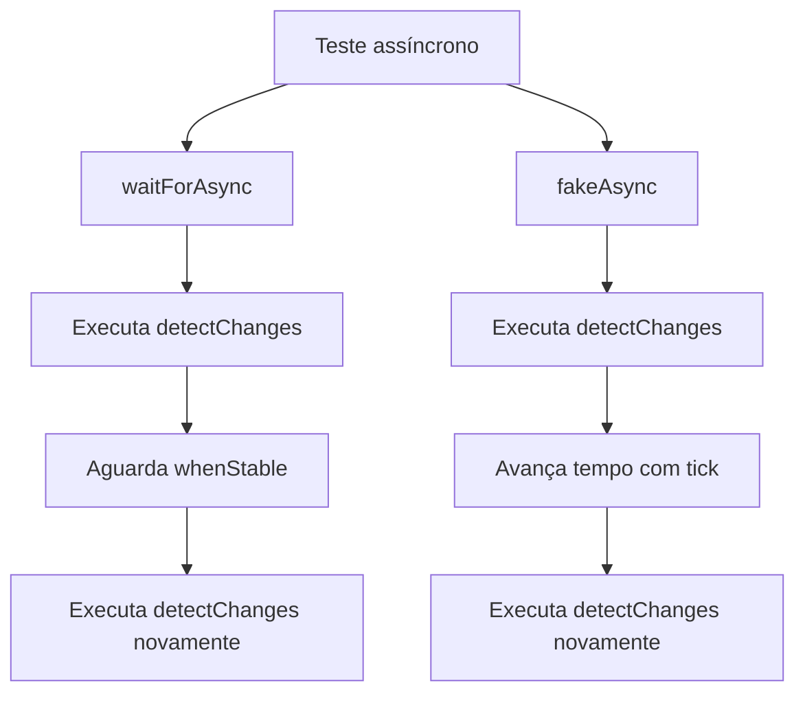

---

## 19. Testes com Input e Output

O capítulo mostra que um componente também deve ser testado em relação à sua API pública:

| Decorator | Função                              |
| --------- | ----------------------------------- |
| `@Input`  | Recebe dados do componente pai      |
| `@Output` | Emite eventos para o componente pai |

Componente testado:

```ts
@Component({
  selector: 'app-binding',
  template: `
    <p>{{ title }}</p>
    <button (click)="liked.emit()">Like</button>
  `
})
export class BindingComponent {
  @Input() title = '';
  @Output() liked = new EventEmitter();
}
```

Componente host de teste:

```ts
@Component({
  template: `
    <app-binding
      [title]="testTitle"
      (liked)="isFavorite = true">
    </app-binding>
  `
})
export class TestHostComponent {
  testTitle = 'My title';
  isFavorite = false;
}
```

Teste do `@Input`:

```ts
it('should display the title', () => {
  const titleDisplay: HTMLElement =
    fixture.nativeElement.querySelector('p');

  expect(titleDisplay.textContent).toEqual(component.testTitle);
});
```

Teste do `@Output`:

```ts
it('should emit the liked event', () => {
  const button: HTMLElement =
    fixture.nativeElement.querySelector('button');

  button.click();

  expect(component.isFavorite).toBeTrue();
});
```

Fluxo:

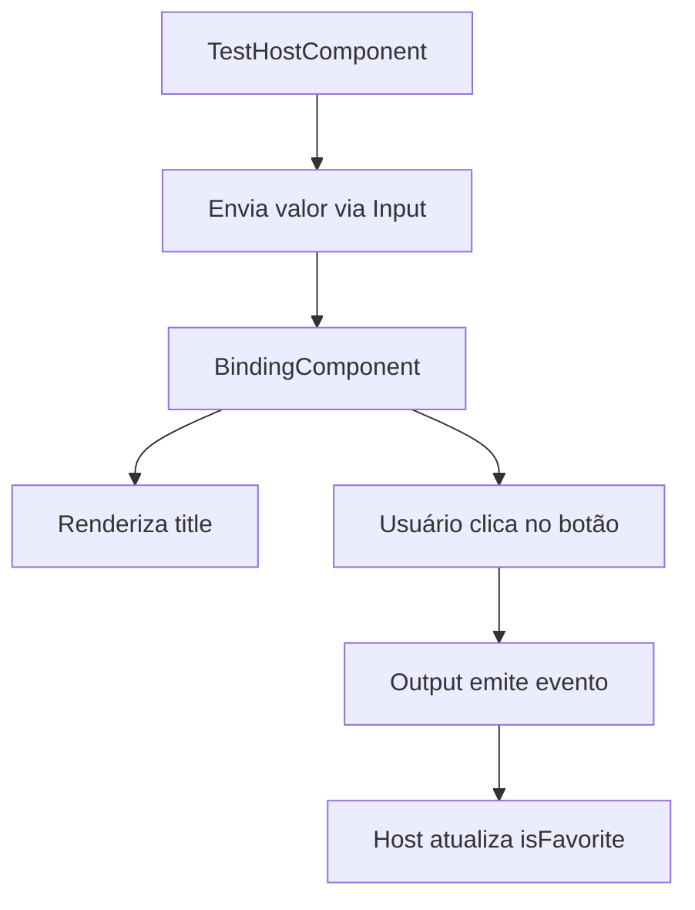

---

## 20. Boas práticas destacadas

* Teste comportamento, não detalhes internos desnecessários.
* Use `beforeEach` para manter isolamento entre testes.
* Chame `fixture.detectChanges()` quando precisar atualizar bindings.
* Use stub quando quiser substituir uma dependência complexa.
* Use spy quando quiser verificar se métodos foram chamados.
* Para componentes com `@Input` e `@Output`, prefira testar usando um componente host.
* Em código assíncrono, escolha entre `waitForAsync` e `fakeAsync` conforme o tipo de controle necessário.

---

## 21. Resumo final

O capítulo mostra que testes unitários em Angular dependem de três ideias principais:

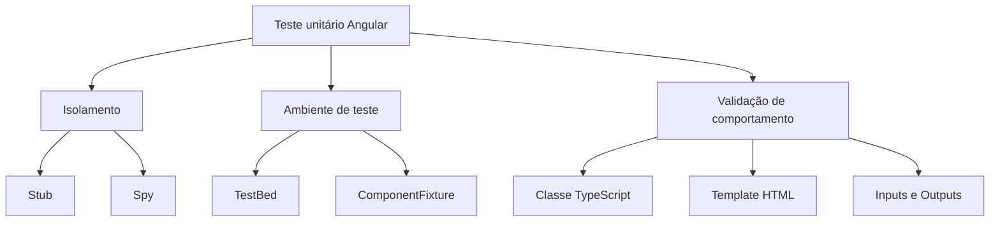

Em termos práticos, o desenvolvedor Angular precisa dominar:

* `describe`;
* `it`;
* `expect`;
* `beforeEach`;
* `TestBed`;
* `ComponentFixture`;
* `fixture.detectChanges`;
* `TestBed.inject`;
* `spyOn`;
* `jasmine.createSpyObj`;
* `waitForAsync`;
* `fakeAsync`;
* `tick`.

Esse conjunto permite testar desde componentes simples até cenários com dependências, renderização no DOM e comportamento assíncrono.

[1]: https://angular.dev/guide/testing?utm_source=chatgpt.com "Testing • Overview"
[2]: https://angular.dev/guide/testing/components-basics?utm_source=chatgpt.com "Basics of testing components"
