# Capítulo 13 — Levando uma aplicação Angular para produção

Fonte base: **Capítulo 13.pdf**, páginas 1 a 13. 
Atualização importante: a documentação atual do Angular confirma que o comando `ng build` compila o TypeScript para JavaScript e pode otimizar, empacotar e minificar a saída; por padrão, o build usa a configuração `production`. ([Angular][1])

---

## 1. Objetivo do capítulo

O capítulo mostra a etapa final para tornar uma aplicação Angular disponível para usuários reais: **gerar o build de produção, otimizar o bundle e publicar os arquivos em um servidor ou provedor de hospedagem**.

Em uma visão simples:

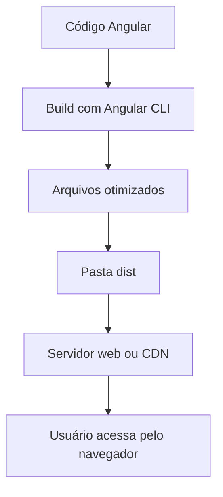

---

## 2. Build de uma aplicação Angular

Para gerar o build da aplicação, o capítulo apresenta o comando:

```bash
ng build
```

Esse comando executa o processo de compilação da aplicação Angular, coletando arquivos como:

* TypeScript;
* HTML;
* CSS;
* assets configurados no projeto.

O resultado é colocado em uma pasta de saída, normalmente dentro de `dist/`.

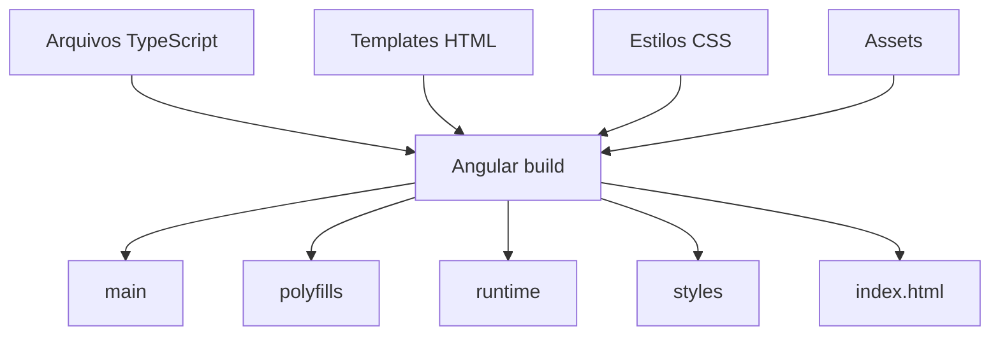

### Principais arquivos gerados

| Arquivo                | Função                                      |
| ---------------------- | ------------------------------------------- |
| `main`                 | Código principal da aplicação               |
| `polyfills`            | Compatibilidade com navegadores             |
| `runtime`              | Código necessário para carregar a aplicação |
| `styles`               | Estilos globais                             |
| `index.html`           | Página principal da aplicação               |
| `3rdpartylicenses.txt` | Licenças de bibliotecas usadas              |

---

## 3. Build de produção versus build de desenvolvimento

O capítulo diferencia dois modos principais:

```bash
ng build
```

e:

```bash
ng build --configuration=development
```

A ideia central é:

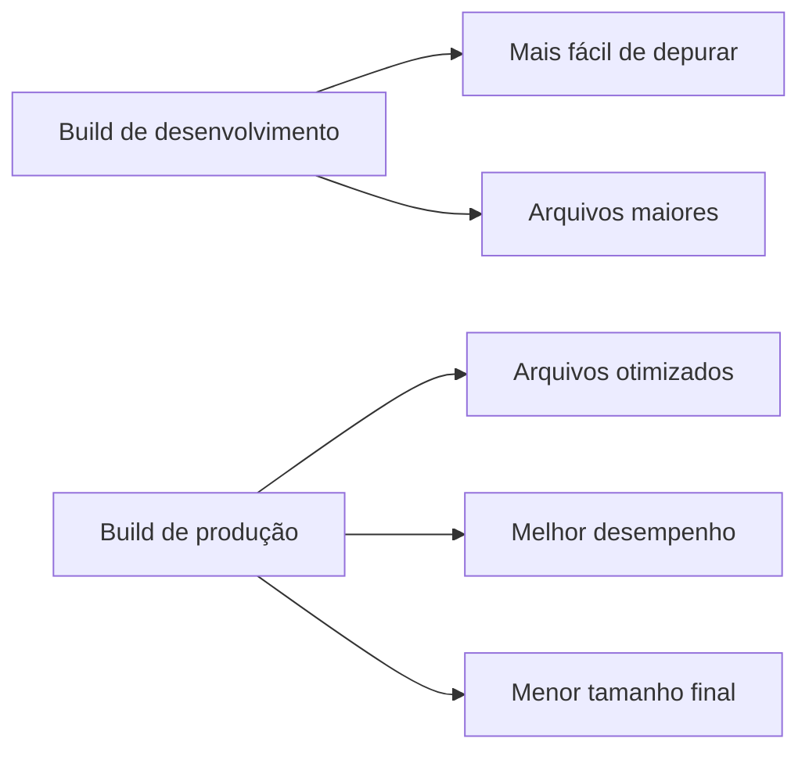

No Angular atual, a configuração `production` aplica otimizações como empacotamento, minificação, remoção de comentários e eliminação de código morto. ([Angular][2])

---

## 4. Configurações para diferentes ambientes

O capítulo mostra que aplicações reais normalmente possuem ambientes diferentes, por exemplo:

* desenvolvimento;
* homologação;
* produção.

Cada ambiente pode usar valores diferentes, como:

* URL da API;
* flags de configuração;
* parâmetros de autenticação;
* chaves públicas;
* endpoints externos.

Exemplo de arquivo de ambiente:

```ts
export const environment = {
  apiUrl: 'https://my-default-url'
};
```

Uso dentro de um componente:

```ts
import { environment } from './environments/environment';

export class AppComponent {
  title = 'my-app';
  apiUrl = environment.apiUrl;
}
```

Fluxo conceitual:

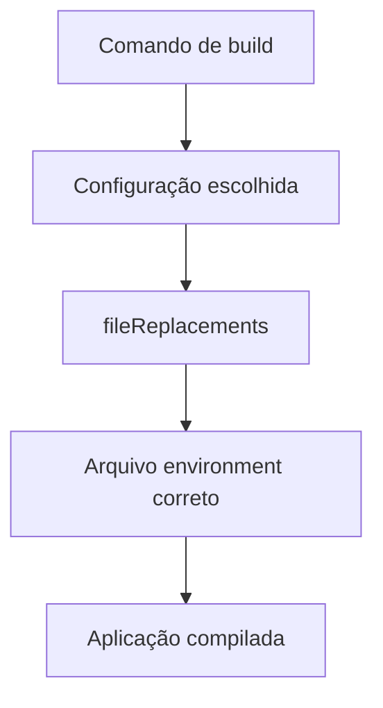

Exemplo para ambiente de homologação:

```json
"staging": {
  "fileReplacements": [
    {
      "replace": "src/environments/environment.ts",
      "with": "src/environments/environment.staging.ts"
    }
  ]
}
```

Build usando essa configuração:

```bash
ng build --configuration=staging
```

---

## 5. Bibliotecas globais e objeto `window`

Nem toda biblioteca JavaScript é importada diretamente como módulo. Algumas precisam ser carregadas globalmente, ficando disponíveis no objeto `window`.

O capítulo cita exemplos como:

* Bootstrap;
* Font Awesome;
* jQuery.

Esses arquivos podem ser declarados no `angular.json` em propriedades como:

```json
"assets": [
  "src/favicon.ico",
  "src/assets"
],
"styles": [
  "src/styles.css"
],
"scripts": []
```

Representação:

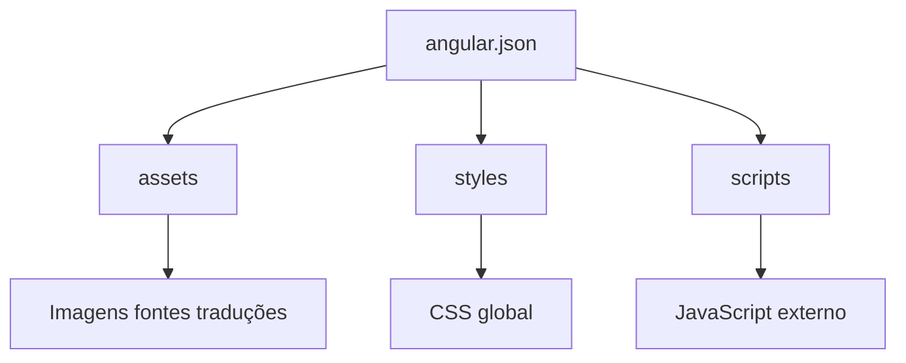

---

## 6. Limitando o tamanho do bundle

À medida que a aplicação cresce, o bundle final também pode crescer. Isso prejudica:

* tempo de carregamento;
* experiência do usuário;
* consumo de rede;
* desempenho em dispositivos mais simples.

O Angular permite definir **budgets**, que são limites de tamanho para partes da aplicação.

Exemplo:

```json
"budgets": [
  {
    "type": "initial",
    "maximumWarning": "500kb",
    "maximumError": "1mb"
  },
  {
    "type": "anyComponentStyle",
    "maximumWarning": "2kb",
    "maximumError": "4kb"
  }
]
```

Interpretação:

| Budget              | Significado                                         |
| ------------------- | --------------------------------------------------- |
| `initial`           | Controla o tamanho inicial carregado pela aplicação |
| `maximumWarning`    | Exibe alerta quando o limite é atingido             |
| `maximumError`      | Gera erro quando o limite é excedido                |
| `anyComponentStyle` | Controla o tamanho dos estilos de componentes       |

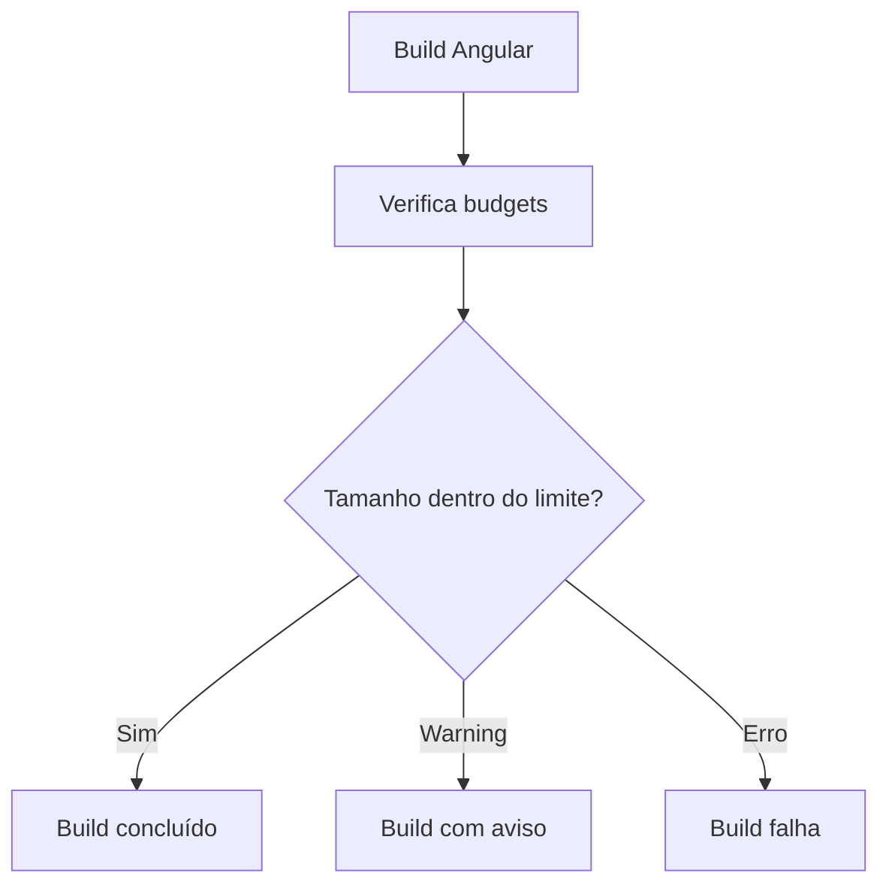

---

## 7. Otimizando o bundle da aplicação

O capítulo lista várias técnicas aplicadas pelo Angular CLI durante o build.

| Técnica           | Explicação                                              |
| ----------------- | ------------------------------------------------------- |
| Minificação       | Remove espaços, comentários e reduz o código            |
| Uglification      | Renomeia propriedades e métodos para dificultar leitura |
| Bundling          | Junta arquivos em bundles                               |
| Tree shaking      | Remove código não utilizado                             |
| Font optimization | Otimiza carregamento de fontes externas                 |
| Build cache       | Reaproveita resultados de builds anteriores             |

Fluxo geral:

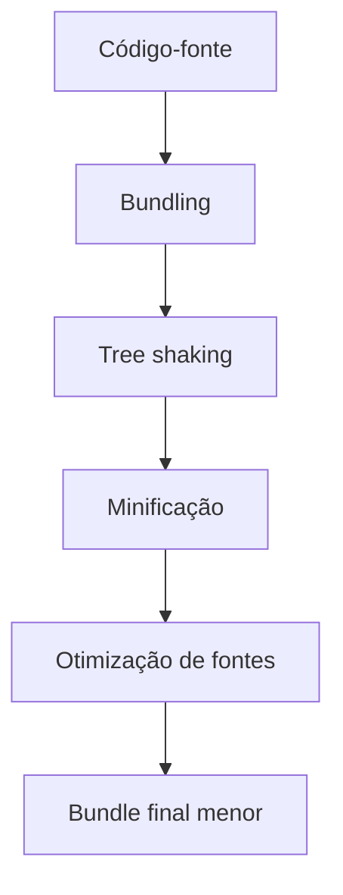

---

## 8. Lazy loading para reduzir o bundle inicial

O capítulo reforça uma prática importante: nem todos os módulos precisam ser carregados logo no início.

Com **lazy loading**, módulos são carregados apenas quando o usuário acessa determinada rota.

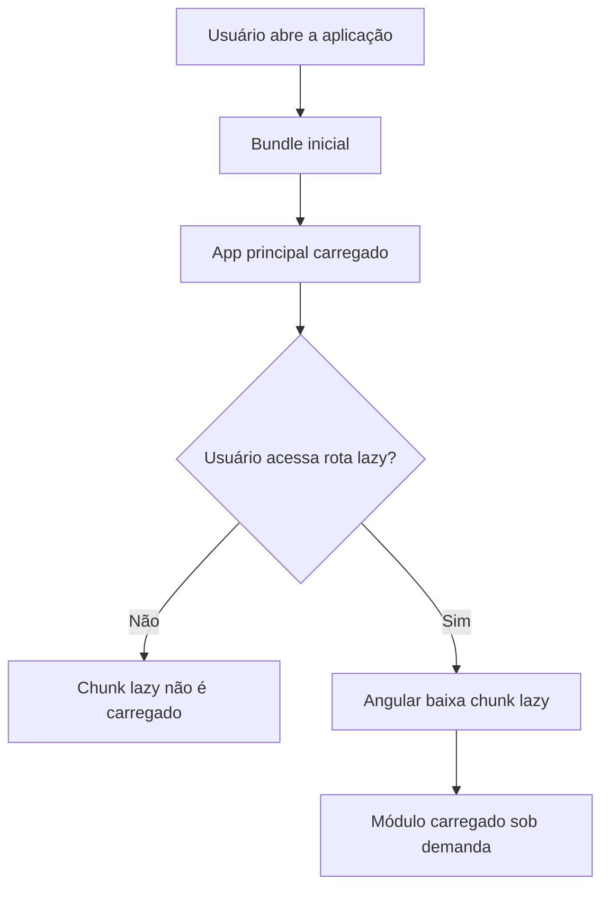

Exemplo conceitual:

```ts
{
  path: 'about',
  loadChildren: () =>
    import('./about/about.module').then(m => m.AboutModule)
}
```

Benefício principal:

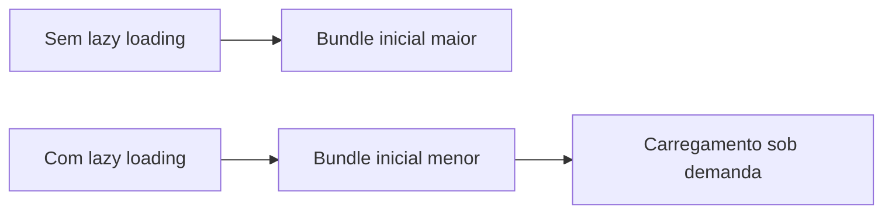

---

## 9. Analisando o bundle com source-map-explorer

Quando o bundle continua grande, o capítulo apresenta o uso do `source-map-explorer`.

Instalação:

```bash
npm install source-map-explorer --save-dev
```

Build com source maps:

```bash
ng build --source-map
```

Análise do bundle:

```bash
node_modules/.bin/source-map-explorer dist/my-app/main.*.js
```

O objetivo é descobrir visualmente quais bibliotecas ou partes da aplicação ocupam mais espaço.

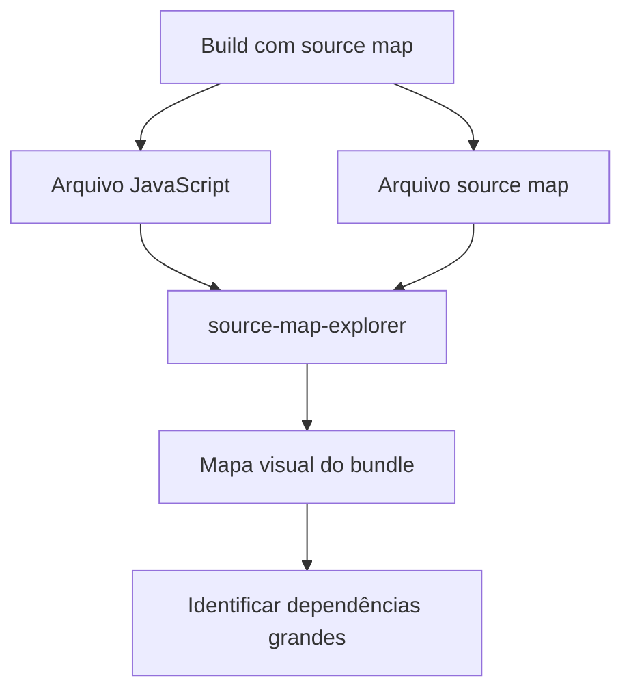

Possíveis descobertas:

* biblioteca incluída mais de uma vez;
* biblioteca grande que não pode passar por tree shaking;
* dependência usada apenas em uma parte pequena da aplicação;
* módulo que deveria ser lazy-loaded.

---

## 10. Deploy de uma aplicação Angular

Depois do build, o deploy pode ser feito copiando os arquivos de saída para um servidor web ou CDN. A documentação atual do Angular também descreve esse caminho manual: criar um build de produção e copiar o diretório de saída para um servidor ou CDN. ([Angular][3])

Fluxo:

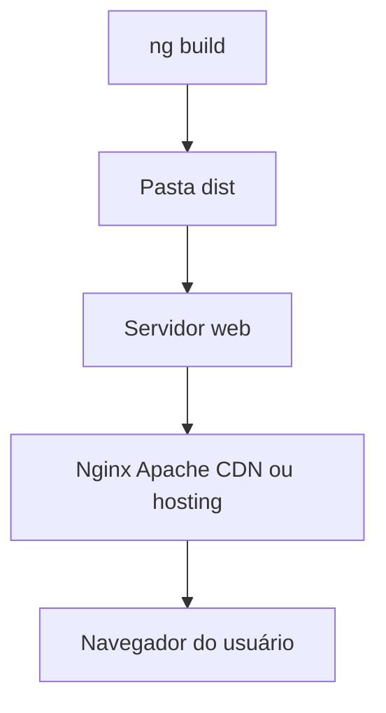

Se a aplicação for publicada em uma subpasta, é necessário ajustar o `base href`.

Exemplo:

```bash
ng build --base-href=/mypath/
```

Ou no `angular.json`:

```json
"baseHref": "/mypath/"
```

Representação:

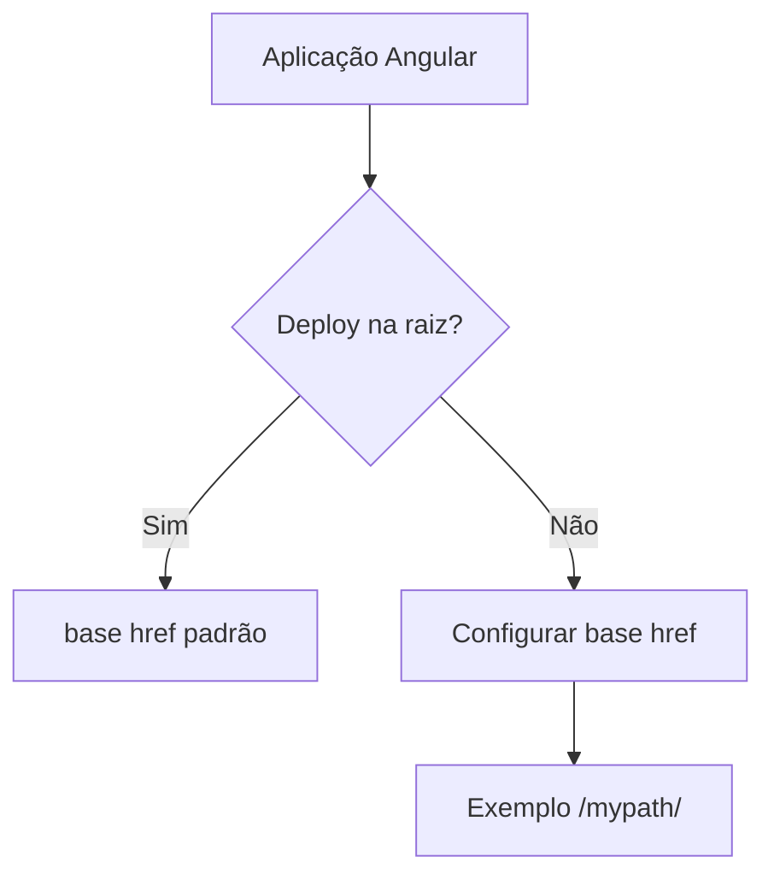

---

## 11. Provedores citados para publicação

O capítulo cita opções de hospedagem que podem ser usadas com aplicações Angular:

| Provedor     | Uso típico                               |
| ------------ | ---------------------------------------- |
| Firebase     | Hosting para aplicações web              |
| Vercel       | Deploy simples de front-end              |
| Netlify      | Deploy de sites estáticos                |
| GitHub Pages | Hospedagem de páginas estáticas          |
| npm          | Publicação de pacotes                    |
| Amazon S3    | Hospedagem estática e integração com AWS |

---

## 12. Visão geral do processo completo

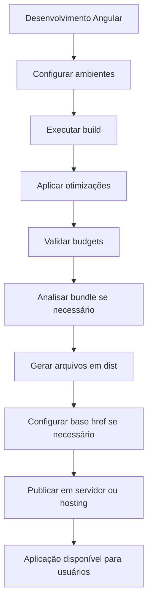

---

## 13. Boas práticas consolidadas

1. Use `ng build` para gerar o build de produção.
2. Separe configurações por ambiente.
3. Use `fileReplacements` para trocar arquivos de configuração.
4. Controle o tamanho do bundle com `budgets`.
5. Use lazy loading para módulos que não precisam carregar no início.
6. Analise bundles grandes com `source-map-explorer`.
7. Configure corretamente o `baseHref` ao publicar em subpastas.
8. Gere source maps para análise, mas evite expô-los desnecessariamente em produção.
9. Publique os arquivos finais em servidor web, CDN ou provedor de hosting.
10. Monitore continuamente o tamanho do bundle conforme a aplicação evolui.

---

## 14. Resumo final

O Capítulo 13 fecha o ciclo principal de desenvolvimento Angular mostrando como transformar o código da aplicação em uma versão pronta para produção.

A ideia principal é:

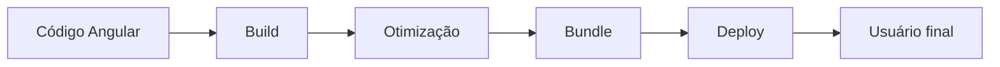

Em termos práticos, levar uma aplicação Angular para produção envolve três preocupações principais:

| Preocupação | Pergunta central                                                |
| ----------- | --------------------------------------------------------------- |
| Build       | Como transformar o código em arquivos executáveis no navegador? |
| Otimização  | Como reduzir tamanho e melhorar desempenho?                     |
| Deploy      | Como disponibilizar a aplicação para os usuários?               |

Esse capítulo prepara a aplicação para o mundo real: menor, mais rápida, configurada para o ambiente correto e pronta para ser publicada.

[1]: https://angular.dev/tools/cli/build?utm_source=chatgpt.com "Building Angular apps"
[2]: https://angular.dev/reference/configs/workspace-config?utm_source=chatgpt.com "Angular workspace configuration"
[3]: https://angular.dev/tools/cli/deployment?utm_source=chatgpt.com "Deployment"
