# Capítulo 14 — Tratamento de Erros e Depuração de Aplicações Angular

Fonte principal: **Capítulo 14 — Handling Errors and Application Debugging**, com foco em tratamento de erros HTTP, erros do framework Angular e técnicas de depuração com Console, DevTools do navegador e Angular DevTools. 

## 1. Ideia central do capítulo

Erros fazem parte do ciclo de vida de uma aplicação web. Eles podem ocorrer durante o desenvolvimento, em tempo de execução, em chamadas HTTP, em regras de negócio, em templates Angular ou no próprio fluxo de detecção de mudanças.

O capítulo organiza o tema em três blocos principais:

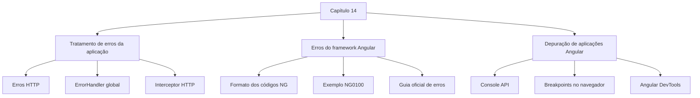

---

# 2. Tratamento de erros da aplicação

Os erros mais comuns em uma aplicação Angular surgem da interação com uma API HTTP. Exemplos típicos:

* credenciais incorretas no login;
* envio de dados em formato inválido;
* erro de rede;
* erro interno no servidor;
* token expirado ou inválido.

O capítulo apresenta três formas de tratar erros HTTP:

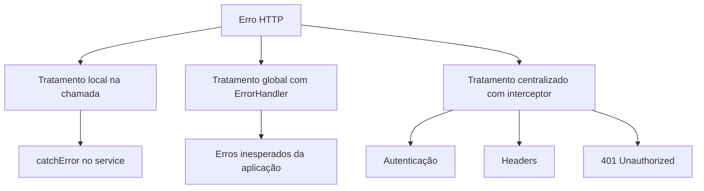

A documentação atual do Angular reforça uma ideia importante: erros esperados devem ser tratados no ponto em que acontecem, porque ali existe contexto para decidir como recuperar o fluxo ou exibir uma mensagem adequada ao usuário. O `ErrorHandler` deve ser usado principalmente para erros inesperados ou potencialmente fatais, geralmente enviados para logs, analytics ou ferramentas de monitoramento. ([Angular][1])

---

# 3. Capturando erros em requisições HTTP

O capítulo mostra o uso do operador `catchError` do RxJS para capturar falhas em uma chamada HTTP.

Exemplo didático:

```ts
getProducts(): Observable<Product[]> {
  return this.http.get<Product[]>(this.productsUrl).pipe(
    map(products => {
      return products.map(product => this.convertToProduct(product));
    }),
    catchError((error: HttpErrorResponse) => {
      console.error(error);
      return throwError(() => error);
    })
  );
}
```

Fluxo visual:

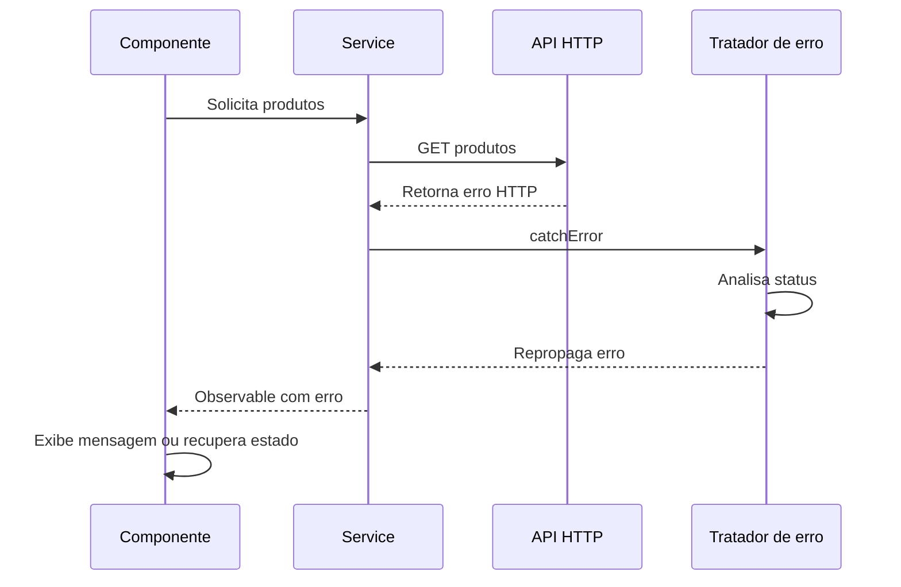

Uma versão mais organizada separa a lógica de erro em um método `handleError`:

```ts
private handleError(error: HttpErrorResponse) {
  switch (error.status) {
    case 0:
      console.error('Client error:', error.error);
      break;

    case HttpStatusCode.InternalServerError:
      console.error('Server error:', error.error);
      break;

    case HttpStatusCode.BadRequest:
      console.error('Request error:', error.error);
      break;

    default:
      console.error('Unknown error:', error.error);
  }

  return throwError(() => error);
}
```

Depois, o método é usado na chamada HTTP:

```ts
getProducts(): Observable<Product[]> {
  return this.http.get<Product[]>(this.productsUrl).pipe(
    map(products => {
      return products.map(product => this.convertToProduct(product));
    }),
    catchError(this.handleError)
  );
}
```

Também é possível combinar `retry` com `catchError`:

```ts
getProducts(): Observable<Product[]> {
  return this.http.get<Product[]>(this.productsUrl).pipe(
    map(products => {
      return products.map(product => this.convertToProduct(product));
    }),
    retry(2),
    catchError(this.handleError)
  );
}
```

Nesse caso, o Angular tenta executar a requisição novamente antes de entregar o erro ao tratador.

---

# 4. Criando um tratador global de erros

O Angular fornece a classe `ErrorHandler` para tratamento global de exceções. A implementação padrão imprime mensagens no console, mas é possível criar uma implementação própria. ([Angular][2])

O capítulo cria uma classe `AppErrorHandler`:

```ts
import { ErrorHandler, Injectable } from '@angular/core';
import { HttpErrorResponse, HttpStatusCode } from '@angular/common/http';

@Injectable()
export class AppErrorHandler implements ErrorHandler {

  handleError(error: any): void {
    const err = error.rejection || error;

    if (err instanceof HttpErrorResponse) {
      switch (err.status) {
        case 0:
          console.error('Client error:', err.error);
          break;

        case HttpStatusCode.InternalServerError:
          console.error('Server error:', err.error);
          break;

        case HttpStatusCode.BadRequest:
          console.error('Request error:', err.error);
          break;

        default:
          console.error('Unknown error:', err.error);
      }
    } else {
      console.error('Application error:', err);
    }
  }
}
```

Fluxo do `ErrorHandler`:

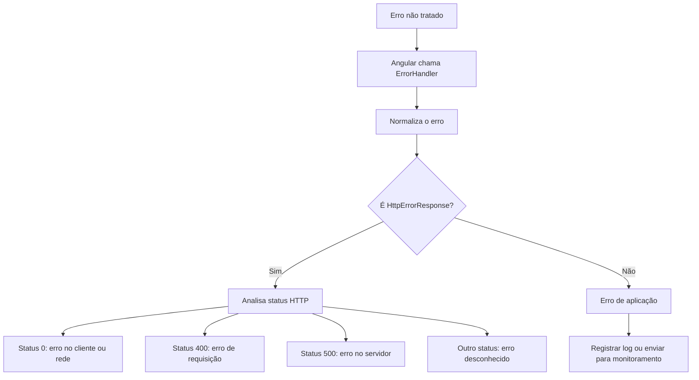

No padrão com `AppModule`, o registro fica em `providers`:

```ts
import { NgModule, ErrorHandler } from '@angular/core';
import { AppErrorHandler } from './app-error-handler';

@NgModule({
  providers: [
    {
      provide: ErrorHandler,
      useClass: AppErrorHandler
    }
  ]
})
export class AppModule {}
```

Em projetos Angular modernos com `bootstrapApplication`, o registro pode ficar no `ApplicationConfig`. A documentação atual indica esse padrão para fornecer um `ErrorHandler` customizado em aplicações standalone. ([Angular][1])

```ts
import { ApplicationConfig, ErrorHandler } from '@angular/core';
import { AppErrorHandler } from './app-error-handler';

export const appConfig: ApplicationConfig = {
  providers: [
    {
      provide: ErrorHandler,
      useClass: AppErrorHandler
    }
  ]
};
```

---

# 5. Tratando erro 401 Unauthorized

O erro `401 Unauthorized` ocorre quando o usuário não está autorizado a acessar um recurso. No capítulo, esse caso é tratado dentro de um interceptor HTTP, especialmente porque interceptors são adequados para autenticação, headers, logging e tratamento transversal de requisições.

Fluxo do interceptor:

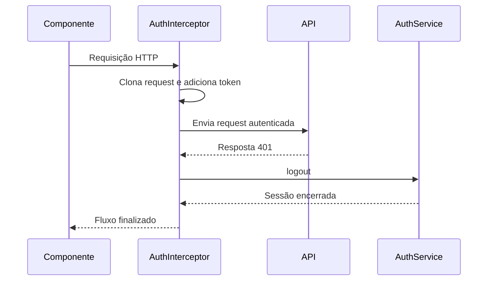

Exemplo baseado no capítulo:

```ts
export class AuthInterceptor implements HttpInterceptor {

  constructor(private authService: AuthService) {}

  intercept(
    request: HttpRequest<unknown>,
    next: HttpHandler
  ): Observable<HttpEvent<unknown>> {

    const authReq = request.clone({
      setHeaders: {
        Authorization: 'myAuthToken'
      }
    });

    return next.handle(authReq).pipe(
      catchError((error: HttpErrorResponse) => {
        if (error.status === HttpStatusCode.Unauthorized) {
          this.authService.logout();
          return EMPTY;
        }

        return throwError(() => error);
      })
    );
  }
}
```

Nota de atualização: a documentação atual do Angular recomenda interceptors funcionais para novos projetos, embora interceptors baseados em DI ainda existam. Interceptors são middleware do `HttpClient` e podem ser usados para autenticação, retry, cache, logging, spinner de carregamento e outros comportamentos transversais. ([Angular][3])

Exemplo moderno com interceptor funcional:

```ts
import { inject } from '@angular/core';
import {
  HttpErrorResponse,
  HttpHandlerFn,
  HttpRequest,
  HttpStatusCode
} from '@angular/common/http';
import { catchError, EMPTY, throwError } from 'rxjs';
import { AuthService } from './auth.service';

export function authInterceptor(
  request: HttpRequest<unknown>,
  next: HttpHandlerFn
) {
  const authService = inject(AuthService);

  const authReq = request.clone({
    setHeaders: {
      Authorization: 'myAuthToken'
    }
  });

  return next(authReq).pipe(
    catchError((error: HttpErrorResponse) => {
      if (error.status === HttpStatusCode.Unauthorized) {
        authService.logout();
        return EMPTY;
      }

      return throwError(() => error);
    })
  );
}
```

Registro em aplicação standalone:

```ts
import { provideHttpClient, withInterceptors } from '@angular/common/http';

export const appConfig = {
  providers: [
    provideHttpClient(
      withInterceptors([authInterceptor])
    )
  ]
};
```

---

# 6. Entendendo erros do framework Angular

O capítulo explica que erros do Angular geralmente aparecem no console com um formato padronizado:

```text
NGWXYZ: [Error message]. <Link>
```

Representação visual:

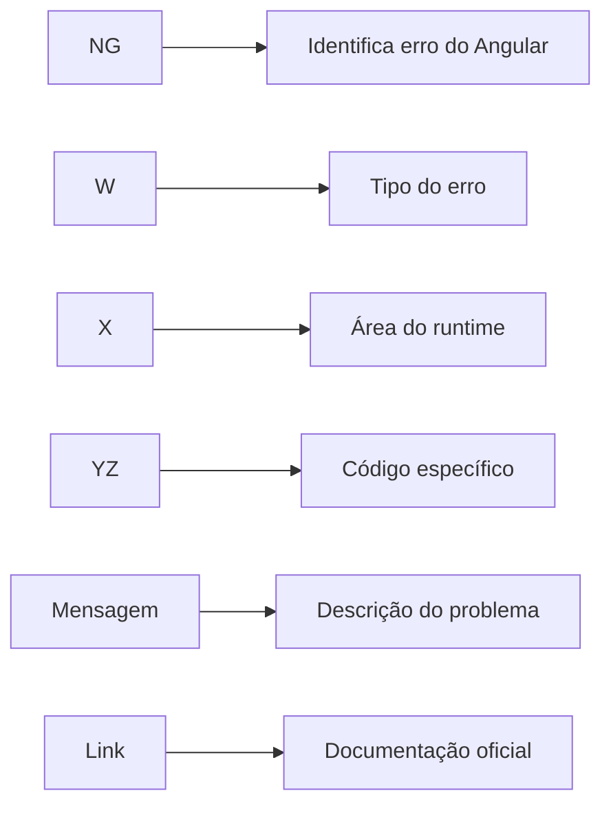

Interpretação:

| Parte    | Significado                                                                |
| -------- | -------------------------------------------------------------------------- |
| `NG`     | Indica que é um erro do Angular                                            |
| `W`      | Tipo do erro                                                               |
| `X`      | Área do runtime, como change detection, injeção de dependência ou template |
| `YZ`     | Código específico do erro                                                  |
| Mensagem | Explicação textual do erro                                                 |
| Link     | Página oficial com detalhes e correção                                     |

---

# 7. Exemplo: NG0100 — ExpressionChangedAfterItHasBeenCheckedError

O capítulo usa o erro `ExpressionChangedAfterItHasBeenCheckedError` como exemplo.

Cenário:

```ts
export class AppComponent implements AfterViewInit {
  title = 'my-app';

  ngAfterViewInit(): void {
    this.title = 'Learning Angular';
  }
}
```

Template:

```html
<h1>{{ title }}</h1>
```

O problema acontece porque o valor de `title` é alterado depois que o Angular já verificou a expressão no ciclo de change detection.

Fluxo do erro:

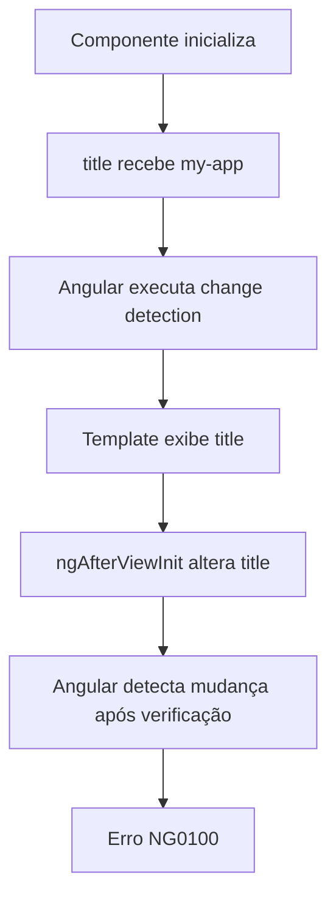

A documentação oficial explica que o Angular lança `ExpressionChangedAfterItHasBeenCheckedError` em modo de desenvolvimento quando uma expressão muda depois que a detecção de mudanças foi concluída. Esse erro ajuda a evitar inconsistência visual, comportamento instável ou loops de atualização. ([Angular][4])

Correções comuns:

```ts
export class AppComponent implements OnInit {
  title = 'my-app';

  ngOnInit(): void {
    this.title = 'Learning Angular';
  }
}
```

Ou seja: mover a alteração para um momento adequado do ciclo de vida do componente.

---

# 8. Depurando aplicações Angular

O capítulo apresenta três abordagens principais de depuração.

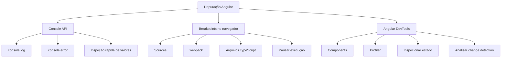

## 8.1 Console API

A `Console API` é útil para inspeções rápidas:

```ts
console.log(product);
console.error(error);
console.table(products);
```

Mas o capítulo alerta que essa abordagem é limitada. O ideal é não deixar muitos `console.log` espalhados no código de produção.

---

## 8.2 Breakpoints no navegador

O capítulo mostra o uso do Chrome DevTools:

1. iniciar a aplicação com `ng serve`;
2. abrir `http://localhost:4200`;
3. abrir as ferramentas do navegador com `F12`;
4. acessar a aba `Sources`;
5. localizar os arquivos TypeScript da aplicação;
6. clicar na linha desejada para adicionar um breakpoint;
7. recarregar a aplicação;
8. inspecionar variáveis, chamadas e estado do componente.

Fluxo:

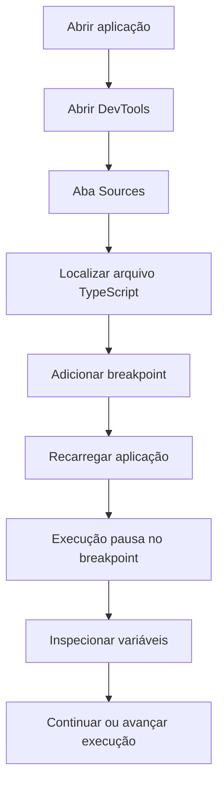

---

# 9. Angular DevTools

O Angular DevTools é uma extensão de navegador mantida pelo time Angular. O capítulo mostra duas áreas principais:

| Aba          | Finalidade                                                   |
| ------------ | ------------------------------------------------------------ |
| `Components` | Visualizar a árvore de componentes, propriedades e diretivas |
| `Profiler`   | Medir ciclos de change detection e desempenho                |

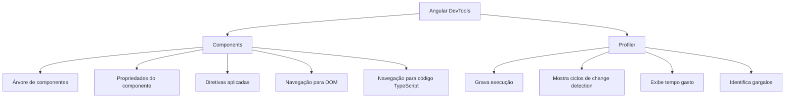

O capítulo mostra que a aba `Components` permite selecionar um componente, visualizar suas propriedades e até alterar valores para observar o efeito na tela.

Exemplo conceitual:

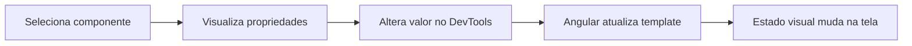

A aba `Profiler` registra ciclos de change detection. Cada barra representa um ciclo, e sua altura indica o tempo gasto. Ao selecionar uma barra, é possível ver componentes e diretivas envolvidos naquele ciclo.

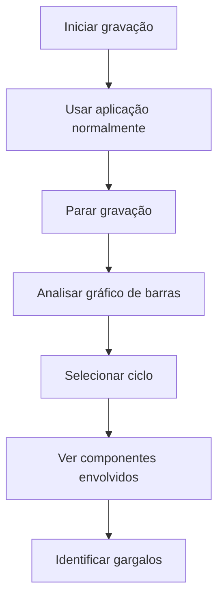

---

# 10. Boas práticas consolidadas

| Situação                               | Melhor abordagem                                    |
| -------------------------------------- | --------------------------------------------------- |
| Erro esperado de uma chamada HTTP      | Tratar com `catchError` no service ou no componente |
| Erro de autenticação                   | Tratar em interceptor                               |
| Erro 401                               | Fazer logout, limpar sessão ou redirecionar         |
| Erro inesperado global                 | Usar `ErrorHandler`                                 |
| Erro de template ou lifecycle          | Ler código `NG`, stack trace e documentação         |
| Investigação rápida                    | Usar `console`                                      |
| Investigação precisa                   | Usar breakpoints                                    |
| Problema de change detection ou estado | Usar Angular DevTools                               |
| Problema de performance                | Usar Profiler do Angular DevTools                   |

---

# 11. Resumo final

O Capítulo 14 ensina que tratar erros em Angular não é apenas capturar exceções. É necessário escolher o ponto correto de tratamento.

Erros HTTP esperados devem ser tratados perto da origem, com `catchError`, porque ali existe contexto de negócio. Erros transversais, como autenticação, combinam melhor com interceptors. Erros inesperados devem ser encaminhados para um `ErrorHandler` global, geralmente associado a logs e monitoramento.

Na parte de depuração, o capítulo evolui do uso simples do `console`, passa por breakpoints no navegador e chega ao Angular DevTools, que permite inspecionar componentes, propriedades, DOM, código TypeScript e ciclos de change detection.

O ponto principal é: **uma aplicação Angular robusta precisa ter estratégia clara de tratamento de erros e ferramentas adequadas de depuração durante o desenvolvimento.**

[1]: https://angular.dev/best-practices/error-handling "Unhandled errors in Angular • Angular"
[2]: https://angular.dev/api/core/ErrorHandler?utm_source=chatgpt.com "ErrorHandler"
[3]: https://angular.dev/guide/http/interceptors "Intercepting requests and responses • Angular"
[4]: https://angular.dev/errors/NG0100 "NG0100: Expression Changed After Checked • Angular"
