# Capítulo 03 — Ferramentas CASE para Gerenciamento de Projeto de Desenvolvimento de Software

## 1. Objetivos do capítulo

Ao final deste capítulo, espera-se que o estudante seja capaz de:

* Identificar diferentes tipos de ferramentas CASE existentes no mercado.
* Entender o conceito de gerenciamento de projetos de desenvolvimento de software.
* Aplicar ferramentas específicas ao gerenciamento de projetos de software.
* Compreender o funcionamento de ferramentas como:

  * GitHub;
  * GitHub Desktop;
  * Microsoft Visual Studio Team System / Azure DevOps;
  * Redmine / EasyRedmine.

---

## 2. Conceito de gerenciamento de projetos de software

A gestão de projetos de software envolve práticas, métodos e ferramentas que ajudam a organizar e controlar o desenvolvimento de sistemas.

Ela apoia principalmente:

* Organização das tarefas;
* Definição da sequência de execução;
* Identificação de dependências entre atividades;
* Alocação de recursos;
* Controle de tempo;
* Rastreamento da execução;
* Garantia de que o projeto siga o plano definido.

Em projetos de software, o gerenciamento é especialmente importante porque o desenvolvimento normalmente envolve equipes, mudanças de requisitos, prazos, custos e necessidade de qualidade.

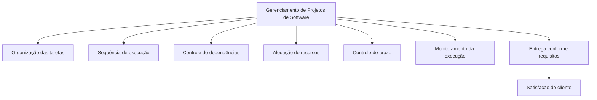

---

## 3. Pilares da gestão de projetos de software

Segundo o material, a gestão de projetos de software se apoia em três pilares principais:

1. Ter foco nos requisitos e na satisfação do cliente.
2. Fazer com que a equipe trabalhe de forma produtiva e colaborativa.
3. Administrar recursos de tempo, humanos e financeiros.

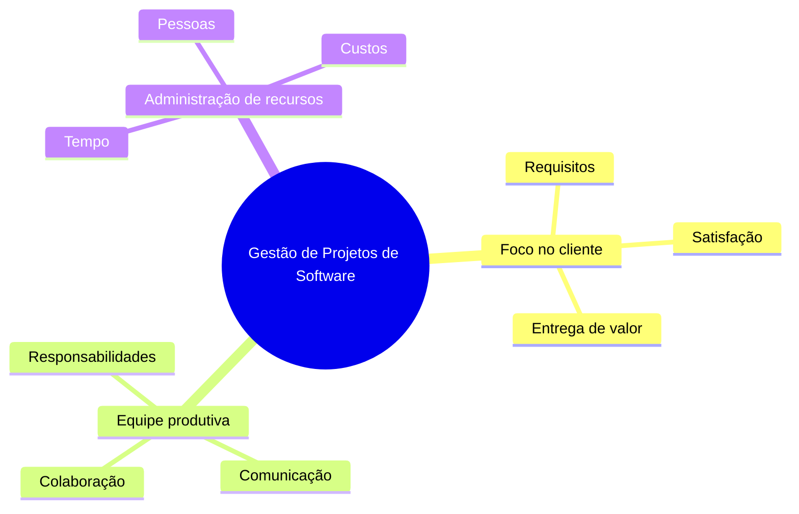

---

## 4. Restrições comuns em projetos de software

O processo de desenvolvimento de software está sujeito a restrições de:

* Qualidade;
* Tempo;
* Orçamento.

Além disso, o desenvolvimento de software é dinâmico e sujeito a mudanças. Por isso, uma boa prática é adotar um processo organizado, com arquitetura adequada e ferramentas que permitam controlar alterações, tarefas e entregas.

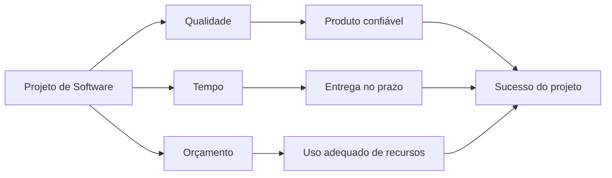

---

## 5. Ferramentas CASE

Ferramentas CASE são recursos utilizados para auxiliar profissionais de Tecnologia da Informação na administração, implementação, controle e acompanhamento de projetos de software.

Elas podem apoiar atividades como:

* Gerenciamento de projetos;
* Controle de versões;
* Controle de funcionalidades;
* Administração de testes;
* Monitoramento de tarefas;
* Comunicação entre membros da equipe;
* Garantia de qualidade durante o processo.

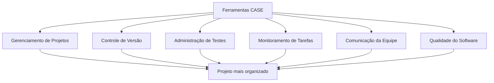

---

# 6. GitHub

## 6.1 Conceito

O GitHub é uma plataforma de hospedagem de código-fonte com controle de versão baseado no Git.

Ele permite que projetos sejam armazenados em repositórios, mantendo o histórico completo das alterações realizadas nos arquivos.

O GitHub é amplamente utilizado em projetos de programação porque permite:

* Armazenar código-fonte;
* Controlar versões;
* Registrar histórico de alterações;
* Trabalhar de forma colaborativa;
* Compartilhar projetos;
* Facilitar contribuições de outros usuários;
* Organizar a evolução do software.

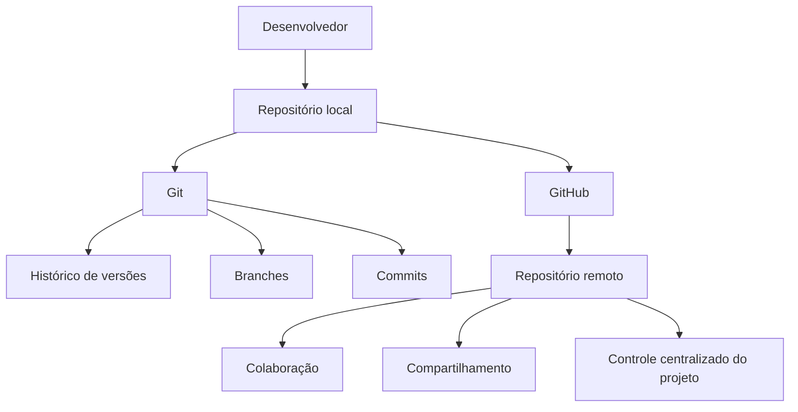

---

## 6.2 Repositório local e remoto

No fluxo com GitHub, o desenvolvedor pode trabalhar localmente em sua máquina e depois enviar as alterações para o repositório remoto.

Esse processo favorece o trabalho distribuído, pois os membros da equipe não precisam estar fisicamente no mesmo local.

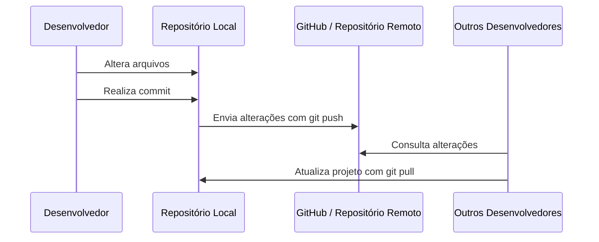

---

## 6.3 Principais comandos Git apresentados no capítulo

| Comando                                | Finalidade                                                              |
| -------------------------------------- | ----------------------------------------------------------------------- |
| `git branch nome_branch`               | Cria uma nova branch.                                                   |
| `git merge nome_branch`                | Reagrupa ou integra uma branch ao fluxo principal.                      |
| `git pull`                             | Atualiza a aplicação local com alterações vindas do repositório remoto. |
| `git push`                             | Envia versões atualizadas para o servidor web/remoto.                   |
| `git clone local_origem local_destino` | Cria uma cópia local de um repositório.                                 |

---

## 6.4 Fluxo básico de versionamento com GitHub

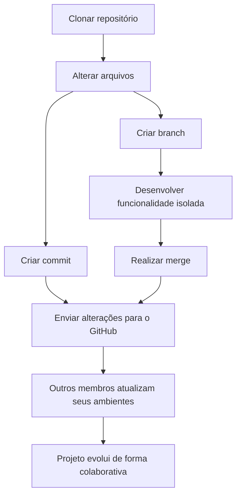

---

## 6.5 GitHub Desktop

O GitHub Desktop é uma ferramenta visual que facilita o uso do Git e do GitHub.

Ele permite:

* Visualizar repositórios locais;
* Identificar arquivos modificados;
* Ver o histórico de alterações;
* Clonar repositórios do GitHub;
* Enviar alterações para o repositório remoto;
* Sincronizar o projeto local com o servidor.

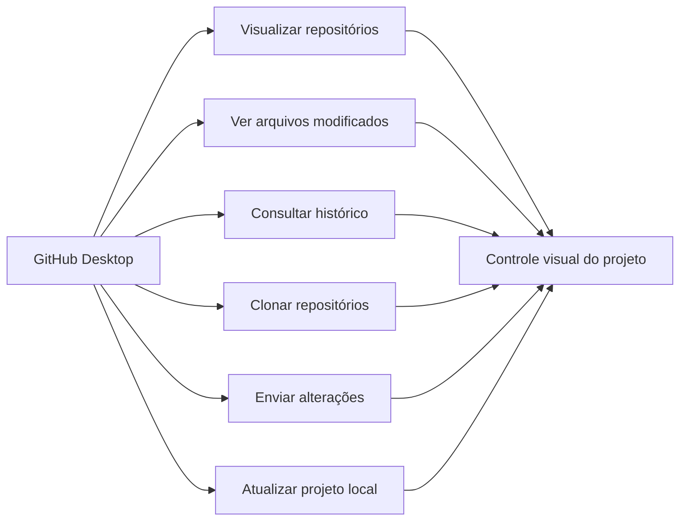

---

# 7. Microsoft Visual Studio Team System / Azure DevOps

## 7.1 Conceito

O material apresenta o Visual Studio Team System, também associado ao Azure DevOps, como uma ferramenta CASE robusta para gerenciamento do ciclo de vida de aplicações e projetos de software.

Ela permite administrar várias etapas do desenvolvimento, como:

* Controle de versão;
* Gerenciamento de requisitos;
* Relatórios;
* Testes;
* Tarefas;
* Pipelines;
* Estruturas de dados;
* Integração com ambientes de desenvolvimento.

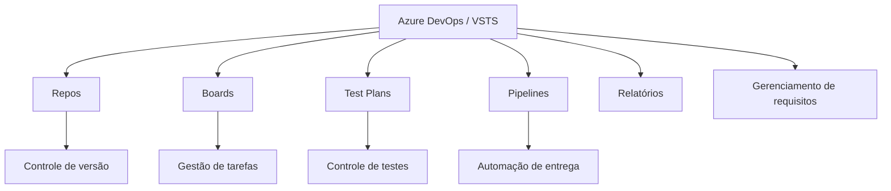

---

## 7.2 DevOps

DevOps é apresentado como um conjunto de práticas que combina desenvolvimento de software com operações de tecnologia da informação.

O objetivo é melhorar a construção, automação, monitoramento e entrega do software.

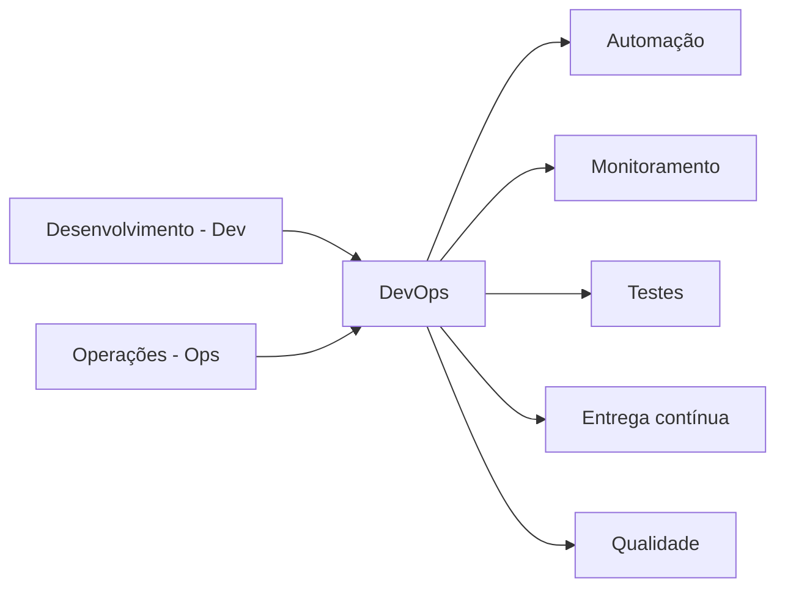

---

## 7.3 Azure Boards

O Azure Boards é usado para gerenciar tarefas, requisitos, histórias de usuário, bugs e atividades do projeto.

Ele oferece suporte a métodos como Scrum e Kanban.

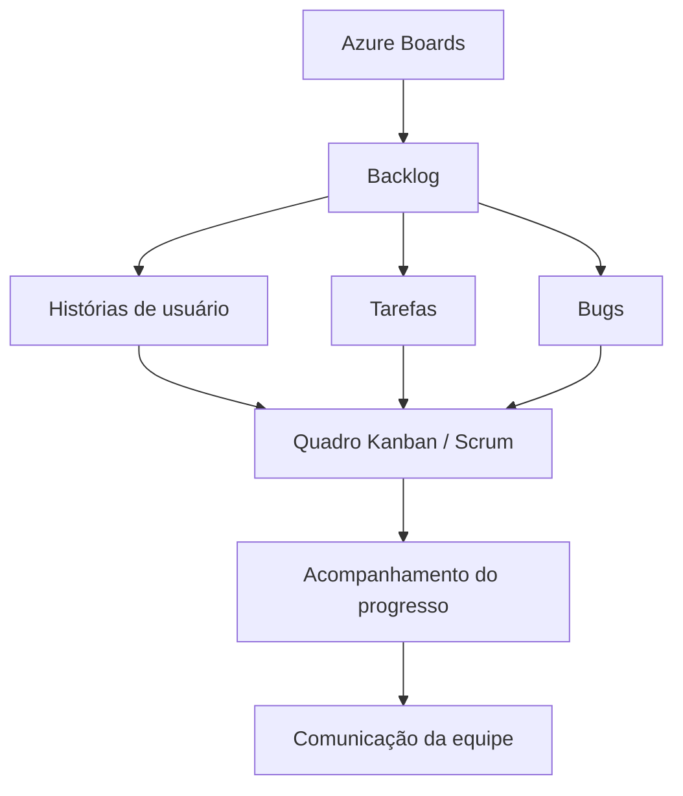

---

## 7.4 Azure Repos

O Azure Repos oferece controle de versão para projetos de software.

Ele permite:

* Registrar alterações no código-fonte;
* Manter histórico;
* Gerar relatórios de alterações;
* Recuperar versões anteriores;
* Trabalhar de forma colaborativa.

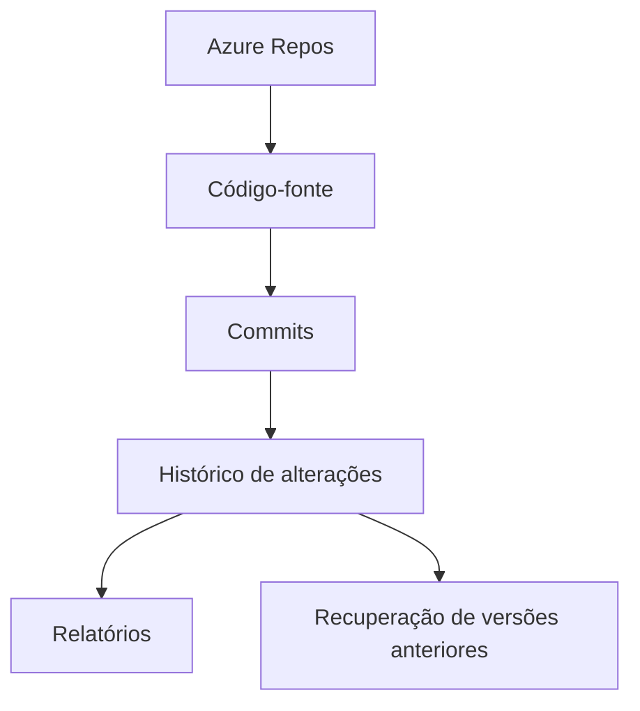

---

## 7.5 Azure Test Plans

O Azure Test Plans é apresentado como um conjunto de componentes para realização e controle de testes.

Ele permite executar testes em ambiente próprio, registrar resultados e gerar relatórios para apoiar a qualidade do software.

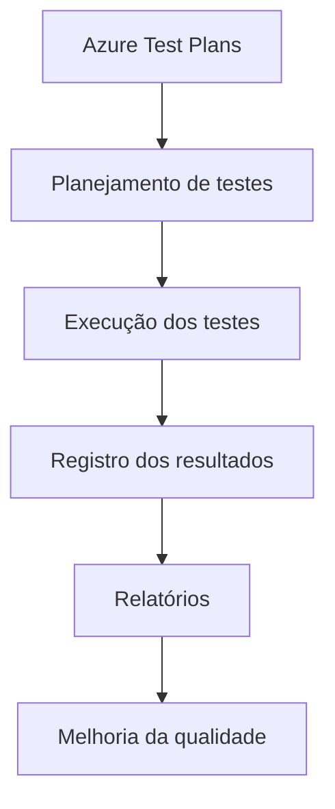

---

## 7.6 Azure Pipelines

O Azure Pipelines permite automatizar o processo de construção, teste e entrega de software.

O material relaciona essa estrutura aos conceitos de integração contínua e entrega contínua.

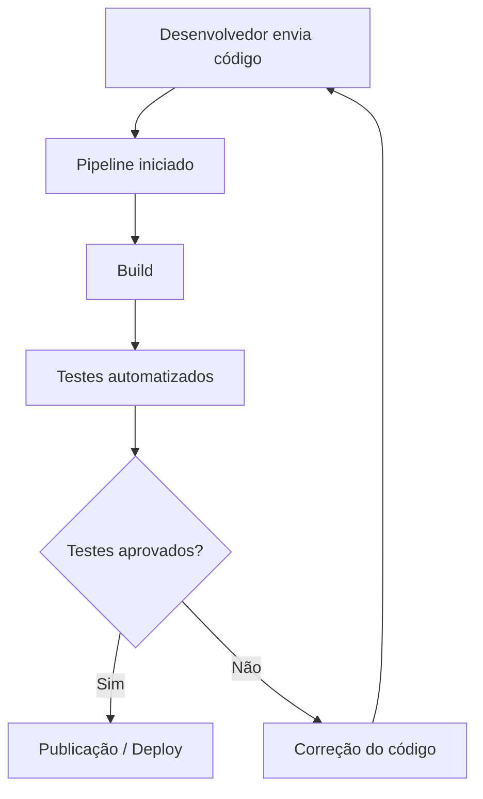

---

## 7.7 Pipeline de dados

O capítulo também apresenta o conceito de pipeline de dados como um fluxo em que dados são coletados, processados, preparados e analisados.

As etapas citadas são:

1. Data engineering;
2. Data preparation;
3. Analytics.

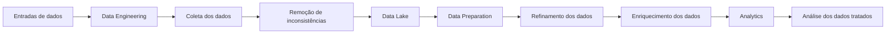

---

# 8. Redmine / EasyRedmine

## 8.1 Conceito

O Redmine, apresentado no material também por meio do EasyRedmine, é uma ferramenta CASE voltada ao gerenciamento de projetos e serviços.

Ele auxilia no acompanhamento de atividades, correção de bugs, cronogramas, tarefas e múltiplos projetos.

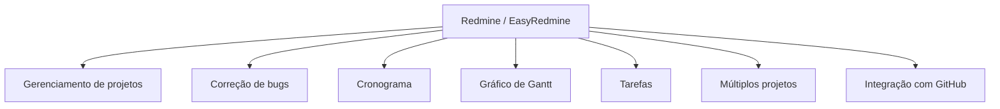

---

## 8.2 Características técnicas

O material informa que o Redmine é desenvolvido com Ruby on Rails.

Essa estrutura facilita a criação de aplicações web orientadas a banco de dados e permite integração com outras ferramentas, como o GitHub.

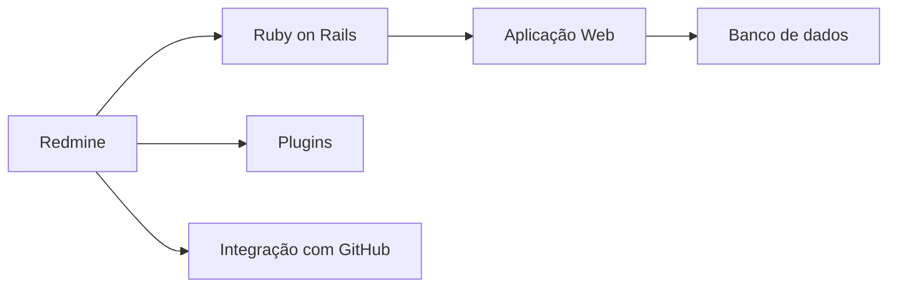

---

## 8.3 Gestão de tarefas no Redmine

O Redmine permite visualizar dados importantes sobre cada tarefa do projeto, como:

* Responsáveis;
* Progresso de execução;
* Tempo gasto;
* Tempo faturável;
* Status;
* Estrutura customizada.

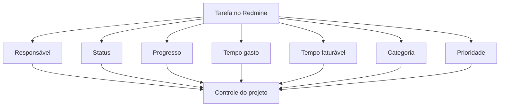

---

## 8.4 Cronograma e calendário

O Redmine também permite organizar o cronograma do projeto, definindo:

* Datas de início;
* Datas de fim;
* Classificação de tarefas;
* Horários de execução;
* Lembretes;
* Visualização em calendário.

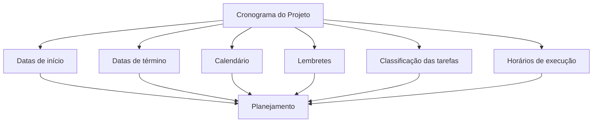

---

# 9. Comparativo entre as ferramentas

| Ferramenta            | Foco principal                                      | Recursos destacados no capítulo                                 |
| --------------------- | --------------------------------------------------- | --------------------------------------------------------------- |
| GitHub                | Hospedagem de código e controle de versão           | Repositórios, branches, commits, clone, pull, push, colaboração |
| GitHub Desktop        | Interface visual para GitHub/Git                    | Visualização de alterações, histórico, clone, sincronização     |
| Azure DevOps / VSTS   | Gerenciamento completo do ciclo de vida do software | Boards, Repos, Test Plans, Pipelines, relatórios, requisitos    |
| Redmine / EasyRedmine | Gerenciamento de projetos e tarefas                 | Cronograma, Gantt, tarefas, bugs, plugins, múltiplos projetos   |

---

# 10. Visão integrada das ferramentas no processo de desenvolvimento

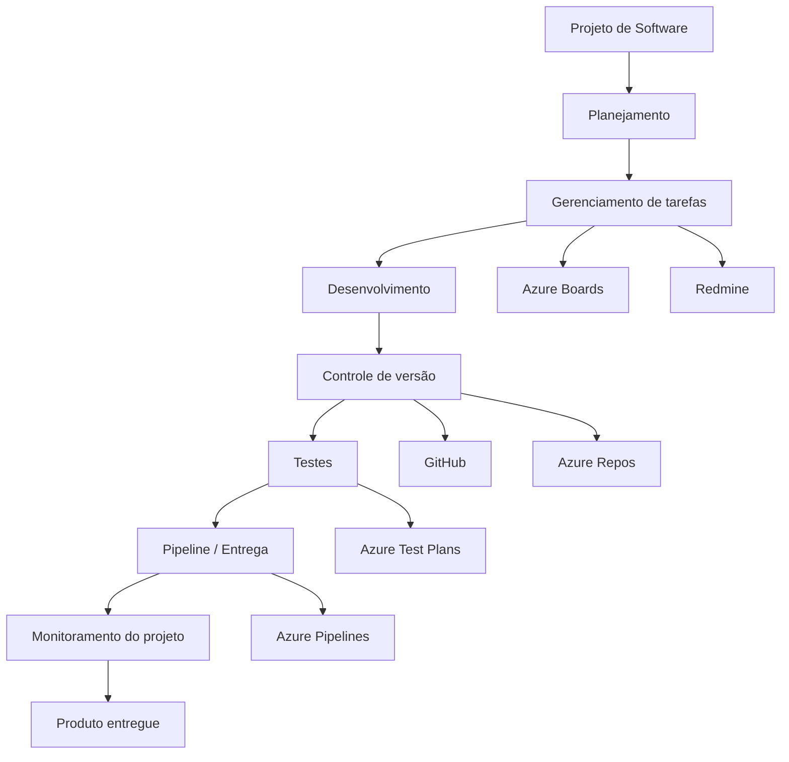

---

# 11. Síntese do capítulo

O desenvolvimento de software deve ser tratado como um projeto, pois envolve várias atividades, pessoas, recursos, prazos e requisitos.

As ferramentas CASE ajudam a controlar esse processo, oferecendo suporte ao planejamento, versionamento, acompanhamento de tarefas, comunicação, testes e entrega.

Neste capítulo, foram apresentadas ferramentas importantes para esse cenário:

* GitHub, para hospedagem de código e controle de versão;
* GitHub Desktop, para facilitar visualmente o uso do GitHub;
* Azure DevOps / VSTS, para gerenciamento completo do ciclo de vida do software;
* Redmine / EasyRedmine, para gerenciamento de projetos, tarefas, cronogramas e bugs.

Essas ferramentas contribuem para que o projeto seja conduzido com mais organização, colaboração e controle, aumentando a chance de entrega dentro dos requisitos, prazos e objetivos definidos.
