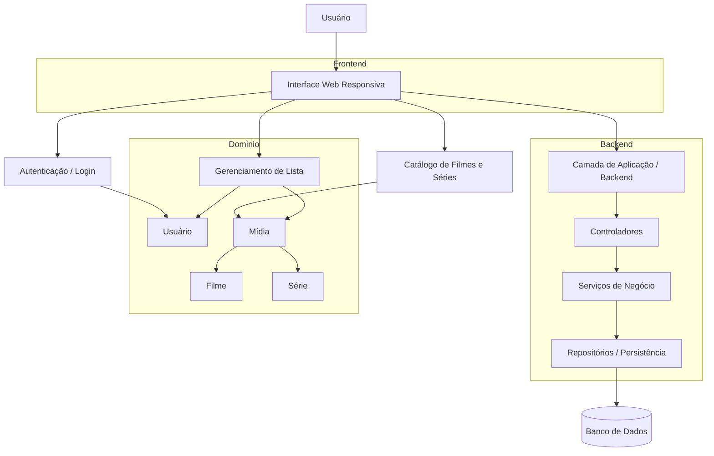
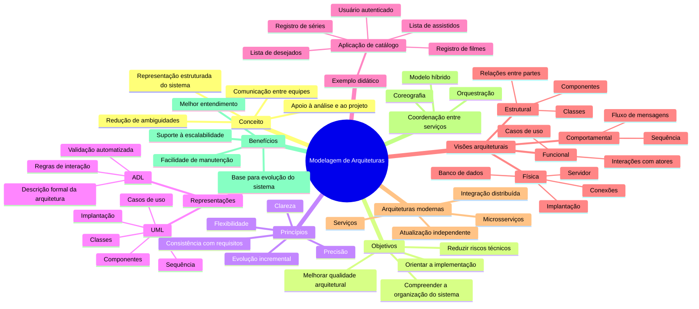

# Modelagem de Arquiteturas de Software

A modelagem de arquiteturas de software tem como objetivo representar, de forma estruturada e compreensível, a organização e o funcionamento de um sistema antes de sua implementação. Esse processo permite transformar requisitos e ideias abstratas em representações visuais e conceituais que auxiliam desenvolvedores, analistas e stakeholders a compreender como o sistema será estruturado e como seus componentes irão interagir. :contentReference[oaicite:0]{index=0}

O processo de modelagem inicia-se a partir das etapas de análise e projeto de software. Durante a análise são identificados os requisitos e as necessidades do sistema, enquanto na fase de projeto essas informações são refinadas e transformadas em representações arquiteturais mais detalhadas. O objetivo é reduzir ambiguidades e garantir que a arquitetura resultante esteja alinhada com os requisitos do sistema.

Uma arquitetura de software raramente pode ser representada por um único diagrama. Diferentes aspectos do sistema precisam ser analisados sob perspectivas distintas. Por esse motivo, diversos tipos de representações são utilizados, cada um abordando um conjunto específico de características da aplicação. Entre esses aspectos estão a estrutura do sistema, as interações entre componentes, o comportamento das funcionalidades e a forma como o sistema será implantado no ambiente de execução.

Antes da criação dos diagramas, é necessário estabelecer princípios que orientem a modelagem. A arquitetura deve ser compreensível, flexível e evolutiva. Isso significa que os modelos devem facilitar a comunicação entre as equipes e permitir que mudanças sejam realizadas ao longo do desenvolvimento sem comprometer a consistência do sistema. Além disso, a modelagem deve contribuir para a redução de riscos técnicos, ajudando a identificar possíveis problemas de design ainda nas fases iniciais do projeto.

Outro princípio importante é o desenvolvimento incremental da arquitetura. Em vez de tentar definir toda a estrutura do sistema de uma única vez, a arquitetura evolui gradualmente à medida que novos requisitos são compreendidos. Esse processo permite que erros ou inconsistências sejam identificados mais cedo, tornando o desenvolvimento mais eficiente.

## Linguagens e Representações Arquiteturais

Para representar arquiteturas de software, são utilizadas linguagens e notações específicas. Uma das mais conhecidas é a UML, que fornece um conjunto de diagramas capazes de representar diferentes perspectivas de um sistema. Outra abordagem utilizada é o modelo de visão arquitetural, que organiza a arquitetura em diferentes visões complementares, permitindo analisar o sistema sob múltiplos pontos de vista.

A modelagem também pode utilizar linguagens específicas de descrição de arquitetura, conhecidas como **ADL (Architecture Description Language)**. Essas linguagens permitem descrever formalmente componentes, conectores e regras de interação, além de possibilitar análises automatizadas e validação de propriedades arquiteturais. Em alguns casos, podem ser integradas a ferramentas que realizam engenharia reversa ou geração automática de código.

## Exemplo Didático de Aplicação

Como exemplo didático, pode-se imaginar o desenvolvimento de uma aplicação de **catálogo de filmes e séries**. O sistema permite que um usuário registre conteúdos que já assistiu ou pretende assistir. Esse registro fica associado a uma conta de usuário autenticada. O sistema possibilita criar listas pessoais, visualizar conteúdos registrados e administrar essas informações.

Nesse contexto, os diagramas de casos de uso são utilizados para representar as interações entre usuários e o sistema. Eles mostram quais funcionalidades estão disponíveis e quais atores podem executá-las. Esse tipo de diagrama não detalha a implementação técnica, mas ajuda a compreender o comportamento esperado do sistema e as funcionalidades disponíveis.

## Estrutura do Sistema

A partir da definição das funcionalidades, pode-se construir o **diagrama de classes**, que representa a estrutura do sistema em termos de objetos, atributos e relacionamentos. Classes como usuário, lista e mídia podem ser identificadas nesse cenário. Cada classe possui responsabilidades específicas e mantém relações estruturais com outras classes, como associações ou composições.

Para compreender o comportamento do sistema durante a execução das funcionalidades, são utilizados **diagramas de sequência**. Esses diagramas demonstram a troca de mensagens entre objetos ao longo do tempo. Assim, é possível visualizar como uma ação iniciada pelo usuário percorre diferentes componentes do sistema até produzir um resultado.

## Componentização e Arquitetura

Outra forma de representação importante é o **diagrama de componentes**, que mostra como o sistema está organizado em módulos maiores. Nesse nível, a arquitetura pode evidenciar separações entre camadas ou serviços, como:

- Interfaces de usuário  
- Controladores  
- Serviços de negócio  
- Componentes de acesso a dados  

Em arquiteturas modernas, essas divisões podem evoluir para modelos baseados em **serviços ou microsserviços**. Nesse tipo de abordagem, funcionalidades do sistema são separadas em unidades menores e independentes, cada uma responsável por um conjunto específico de responsabilidades.

Essa organização facilita a evolução do sistema, pois permite que componentes sejam atualizados ou substituídos sem afetar toda a aplicação.

## Integração entre Serviços

Para garantir a integração entre esses serviços, são utilizadas estratégias de coordenação entre componentes distribuídos.

Em alguns casos, existe um mecanismo central que coordena as interações entre serviços. Em outros, os próprios serviços se comunicam diretamente entre si, formando uma arquitetura mais descentralizada.

Essas estratégias são importantes para garantir:

- Escalabilidade do sistema  
- Independência entre serviços  
- Facilidade de manutenção  

## Implantação da Arquitetura

A modelagem da arquitetura também considera o ambiente em que o sistema será executado. O **diagrama de implantação** representa os elementos físicos da infraestrutura, como servidores, aplicações e bancos de dados, além das conexões entre esses elementos.

Essa representação ajuda a compreender como os componentes lógicos do sistema serão distribuídos no ambiente tecnológico.

Mesmo quando uma notação formal como a UML é utilizada, outras representações podem complementar a modelagem arquitetural. Diagramas de fluxo ou modelos de processos de negócio podem ajudar a explicar regras operacionais ou fluxos organizacionais que não são facilmente representados em diagramas estruturais.

## Conclusão

A modelagem de arquiteturas de software é um processo fundamental para transformar requisitos em estruturas compreensíveis e implementáveis. Por meio de diferentes representações, a arquitetura permite visualizar o sistema sob múltiplas perspectivas, facilitando a comunicação entre as equipes, reduzindo riscos de desenvolvimento e garantindo que o software seja construído de maneira consistente e evolutiva.


## Diagrama Mermaid da arquitetura do exemplo



## Mapa mental em Mermaid



## Versão textual do mapa mental

```markdown
# Mapa Mental — Modelagem de Arquiteturas

## Conceito
- Representação estruturada do sistema
- Apoio à análise e ao projeto
- Redução de ambiguidades
- Comunicação entre equipes

## Objetivos
- Compreender a organização do sistema
- Orientar a implementação
- Reduzir riscos técnicos
- Melhorar a qualidade arquitetural

## Princípios
- Clareza
- Precisão
- Flexibilidade
- Evolução incremental
- Consistência com requisitos

## Representações
### UML
- Casos de uso
- Classes
- Sequência
- Componentes
- Implantação

### ADL
- Descrição formal da arquitetura
- Regras de interação
- Validação automatizada

## Exemplo didático
### Aplicação de catálogo
- Usuário autenticado
- Registro de filmes
- Registro de séries
- Lista de assistidos
- Lista de desejados

## Visões arquiteturais
### Funcional
- Casos de uso
- Interações com atores

### Estrutural
- Classes
- Componentes
- Relações entre partes

### Comportamental
- Sequência
- Fluxo de mensagens

### Física
- Implantação
- Servidor
- Banco de dados
- Conexões

## Arquiteturas modernas
- Serviços
- Microsserviços
- Integração distribuída
- Atualização independente

## Coordenação entre serviços
- Orquestração
- Coreografia
- Modelo híbrido

## Benefícios
- Melhor entendimento
- Facilidade de manutenção
- Suporte à escalabilidade
- Base para evolução do sistema
```

