# Capítulo 01 — Ferramentas para o Desenvolvimento de Softwares

Baseado no capítulo enviado: **“Ferramentas para o desenvolvimento de softwares”**. 

> **Nota de fidelidade:** mantive as ferramentas, classificações e exemplos conforme o material. Como nomes, licenças e versões de teste podem mudar com o tempo, esses dados devem ser validados nos sites oficiais antes de uso em um projeto real.

---

## 1. Objetivos do capítulo

Ao final deste capítulo, o leitor deve ser capaz de:

* Identificar diferentes tipos de ferramentas usadas no desenvolvimento de sistemas.
* Entender o conceito de levantamento de requisitos e sua relação com ferramentas específicas.
* Reconhecer ferramentas para prototipação de interfaces com o usuário.
* Compreender a necessidade de ferramentas específicas para modelagem e gerenciamento de banco de dados.
* Relacionar ferramentas CASE com as etapas do ciclo de desenvolvimento de software.

---

## 2. Ideia central

Um software é um conjunto de funcionalidades implementadas por meio de linguagens de programação, com estrutura lógica organizada para resolver problemas do mundo real.

Com o aumento da complexidade dos sistemas, tornou-se necessário utilizar ferramentas que auxiliem o profissional de TI em diferentes fases do desenvolvimento. Essas ferramentas são conhecidas como **CASE**, sigla de **Computer-Aided Software Engineering**, ou **Engenharia de Software Auxiliada por Computador**.

As ferramentas CASE ajudam a:

* Organizar o processo de desenvolvimento.
* Reduzir esforço manual.
* Aumentar produtividade.
* Melhorar a qualidade da documentação.
* Apoiar modelagem, implementação, testes, banco de dados e manutenção.
* Facilitar a reutilização de componentes.

---

## 3. Ferramentas CASE

As ferramentas CASE podem ser classificadas em três grupos principais:

| Tipo                          | Finalidade                                                                                                    |
| ----------------------------- | ------------------------------------------------------------------------------------------------------------- |
| **Upper CASE**                | Apoiam as fases iniciais do desenvolvimento, como concepção, levantamento de requisitos, análise e modelagem. |
| **Lower CASE**                | Apoiam as fases de implementação, edição de código, compilação e testes.                                      |
| **Integrated CASE ou I-CASE** | Integram funcionalidades de Upper CASE e Lower CASE em uma mesma solução.                                     |

### Diagrama — Classificação das ferramentas CASE

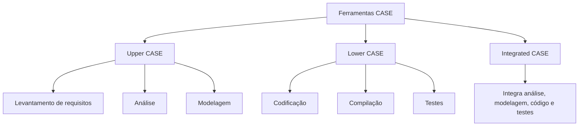

---

## 4. Design mode e runtime mode

O capítulo diferencia dois ambientes importantes no desenvolvimento de software:

| Conceito         | Explicação                                                                                                                         |
| ---------------- | ---------------------------------------------------------------------------------------------------------------------------------- |
| **Design mode**  | Ambiente de desenvolvimento. É onde o desenvolvedor trabalha no código-fonte, modelagem, estruturação e configuração da aplicação. |
| **Runtime mode** | Ambiente de execução. É onde o usuário final utiliza a aplicação já inicializada, sem manipular diretamente o código-fonte.        |

### Diagrama — Do desenvolvimento à execução

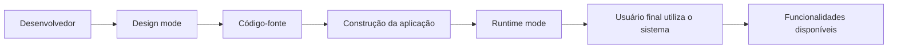

---

## 5. Arquitetura de um sistema de software

Segundo o capítulo, uma aplicação de software envolve diversos componentes, como:

* Usuário final.
* Dispositivos de acesso.
* Aplicação.
* Desenvolvedor ou programador.
* SGBD.
* DBA.
* Servidor de banco de dados.

### Diagrama — Componentes da arquitetura de um sistema de software

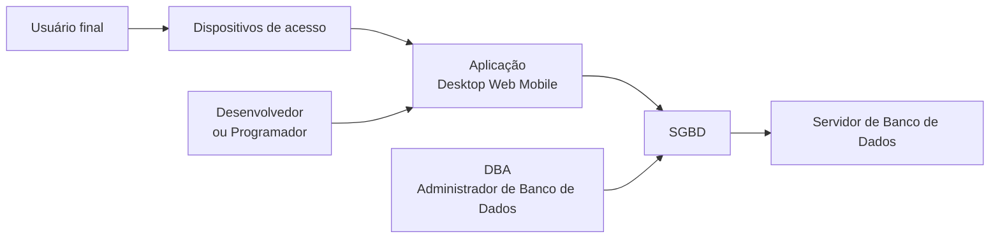

### Interpretação do diagrama

O usuário final acessa o sistema por meio de dispositivos físicos, como computador, notebook, celular ou tablet. A aplicação processa as funcionalidades e, quando necessário, interage com o SGBD para consultar ou persistir dados no servidor de banco de dados.

O desenvolvedor atua na construção e manutenção da aplicação. Já o DBA é responsável pela administração, organização, segurança e estruturação dos dados.

---

## 6. Tipos de aplicação

O capítulo apresenta três ambientes comuns para aplicações:

| Tipo de aplicação | Característica                                                         | Exemplos de linguagens citadas              |
| ----------------- | ---------------------------------------------------------------------- | ------------------------------------------- |
| **Web**           | Acessada por navegador.                                                | JavaScript, PHP, ASP, Java, Python, Ruby    |
| **Desktop**       | Instalada fisicamente no equipamento do usuário.                       | Java, C#, C++, Python, Delphi, Visual Basic |
| **Mobile**        | Instalada em dispositivos móveis, geralmente por lojas de aplicativos. | Java, C#, Swift, Python                     |

### Diagrama — Ambientes de aplicação

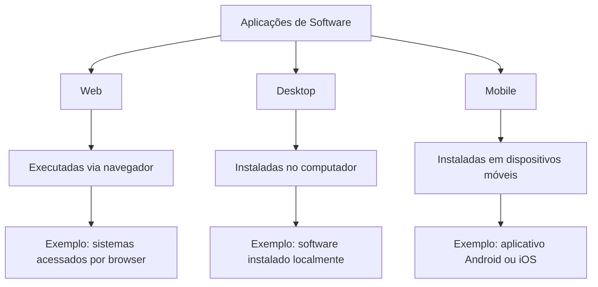

---

## 7. Ciclo de desenvolvimento de software

O capítulo apresenta o ciclo de desenvolvimento como um conjunto de etapas interligadas. O resultado de uma etapa influencia diretamente as etapas seguintes.

### Etapas principais

1. Levantamento e análise de requisitos.
2. Modelagem.
3. Implementação.
4. Testes.
5. Implantação.
6. Manutenção.

### Diagrama — Ciclo de desenvolvimento de software

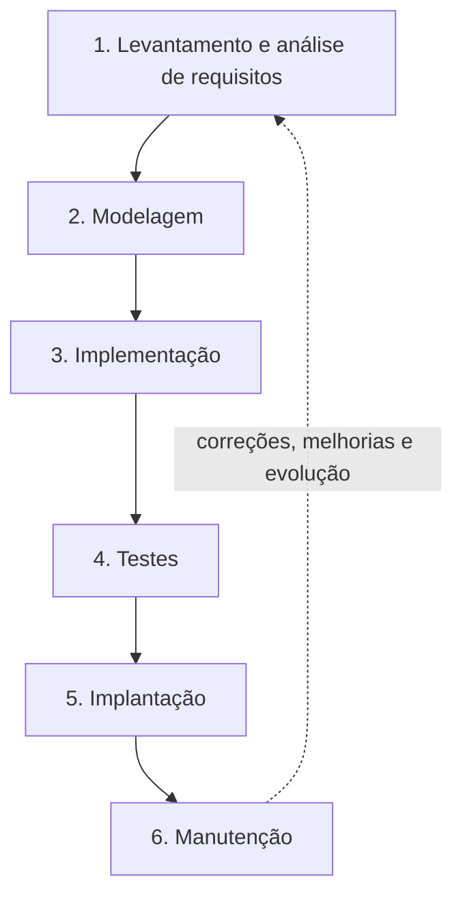

### Ponto importante

O capítulo destaca que um erro em uma etapa pode gerar consequências nas próximas. Por isso, embora o ciclo pareça sequencial, ele pode exigir retornos para ajustes, correções e refinamentos.

---

## 8. Levantamento de requisitos

O levantamento e análise de requisitos é apresentado como uma das etapas mais importantes do processo de desenvolvimento.

Um **requisito** representa uma especificação do que o sistema precisa fazer ou atender. Ele deve ser escrito de forma clara para evitar interpretações ambíguas.

### Tipos de requisitos

| Tipo                        | Explicação                                                                              | Exemplo                                          |
| --------------------------- | --------------------------------------------------------------------------------------- | ------------------------------------------------ |
| **Requisito funcional**     | Define uma função que o sistema deve executar.                                          | Gerar um relatório em PDF.                       |
| **Requisito não funcional** | Define características de qualidade, infraestrutura, segurança, desempenho ou ambiente. | O sistema deve ter controle de acesso por senha. |

### Diagrama — Requisitos e qualidade do software

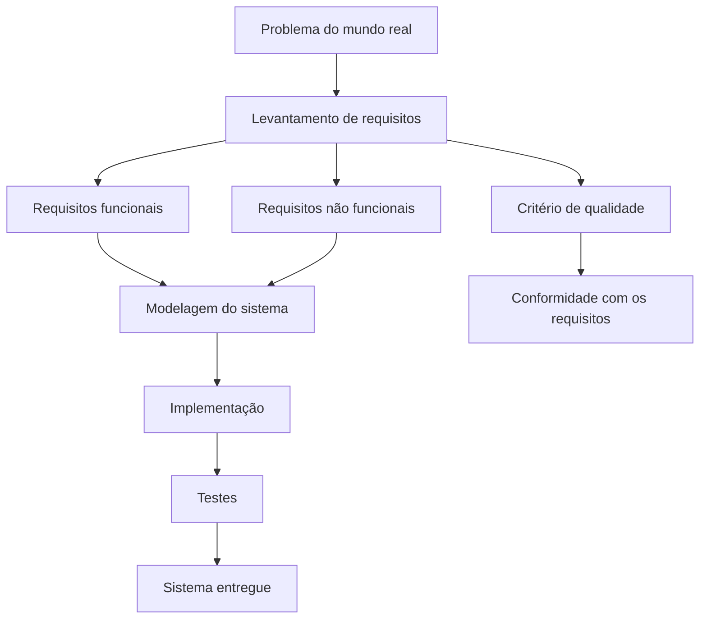

---

## 9. Ferramentas ALM para requisitos

O capítulo relaciona ferramentas de requisitos com o conceito de **ALM — Application Lifecycle Management**, isto é, o gerenciamento do ciclo de vida da aplicação.

| Ferramenta                          | Licença      | Plataforma      | Versão de testes |
| ----------------------------------- | ------------ | --------------- | ---------------- |
| Utdalls RE-Tools                    | Opensource   | Multiplataforma | Não              |
| Atlassian Jira                      | Proprietária | Multiplataforma | Sim              |
| Visure Requirements Management Tool | Proprietária | Windows         | Sim              |

### Diagrama — Ferramentas ALM no ciclo de vida

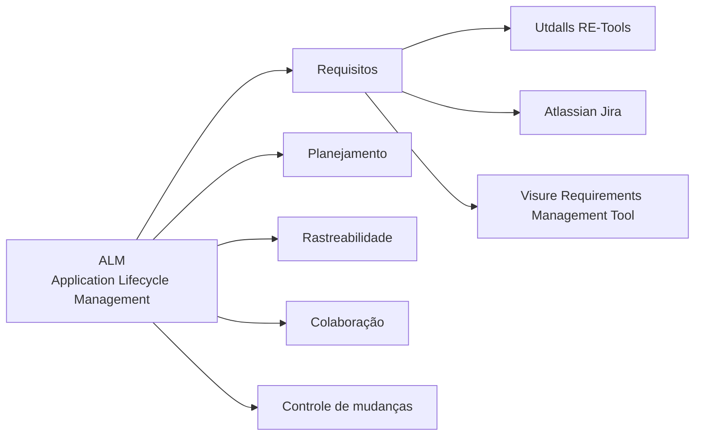

---

## 10. Interfaces com o usuário final

A modelagem de interface com o usuário é tratada como parte da **prototipagem UX**.

O protótipo permite simular a aparência e o funcionamento do sistema antes da implementação final. Ele também ajuda clientes e desenvolvedores a validarem se a interface atende aos requisitos.

O capítulo cita o termo **wireframe**, que representa uma estrutura visual da interface.

| Ferramenta | Licença      | Plataforma     | Versão de testes       |
| ---------- | ------------ | -------------- | ---------------------- |
| Axure RP   | Proprietária | Windows, MacOS | Sim, trial por 30 dias |
| Sketch     | Proprietária | MacOS          | Sim, trial por 30 dias |

### Diagrama — Prototipagem UX

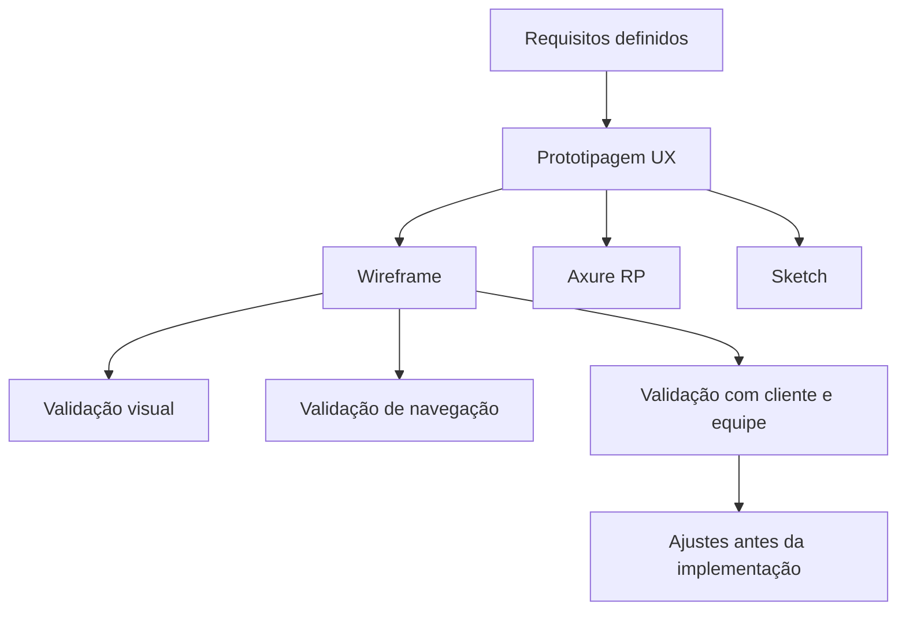

---

## 11. Banco de dados

O capítulo destaca que a modelagem de banco de dados é uma das atividades fundamentais no desenvolvimento de sistemas.

O banco de dados armazena informações que serão manipuladas pela aplicação. Por isso, sua estrutura precisa ser planejada, principalmente em sistemas que usam bancos relacionais.

Ferramentas citadas:

| Ferramenta | Licença      | Plataforma      | Versão de testes       |
| ---------- | ------------ | --------------- | ---------------------- |
| DB Main    | Proprietária | Windows, MacOS  | Freeware               |
| DB Design  | Opensource   | Multiplataforma | Não                    |
| ERwin      | Proprietária | Windows         | Sim, trial por 30 dias |

### Diagrama — Relação entre aplicação, SGBD e banco de dados

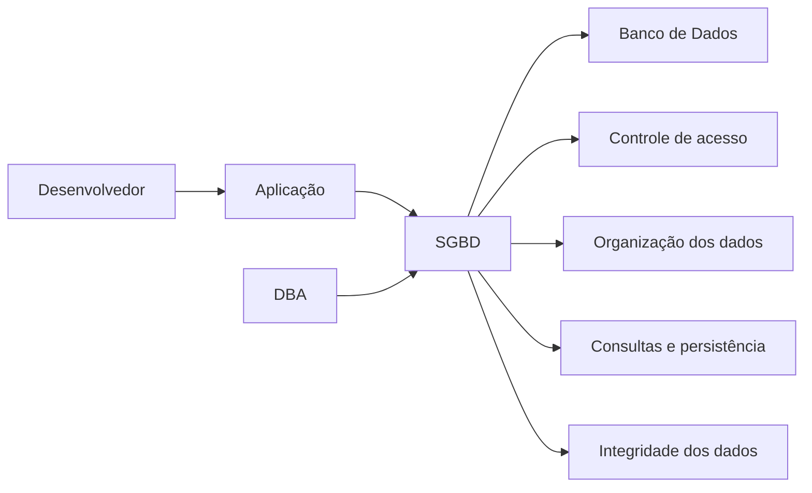

---

## 12. Programação orientada a objetos

A programação orientada a objetos, ou **POO**, é apresentada como uma forma robusta e eficiente de escrever código-fonte.

Ela se baseia em:

| Conceito   | Explicação                                              |
| ---------- | ------------------------------------------------------- |
| **Classe** | Estrutura que define características e comportamentos.  |
| **Objeto** | Instância criada a partir de uma classe.                |
| **Método** | Ação interna executada por um objeto.                   |
| **Evento** | Ação externa que pode acionar comportamento no sistema. |

Linguagens citadas no capítulo que utilizam POO:

* Java.
* C#.
* PHP.
* C++.

### Diagrama — Relação entre classe, objeto e métodos

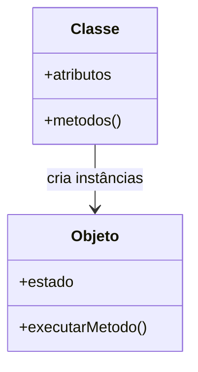

---

## 13. Ferramentas para modelagem orientada a objetos

O capítulo apresenta ferramentas com suporte à UML, usada para representar sistemas orientados a objetos por meio de diagramas.

| Ferramenta      | Licença      | Plataforma                     | Versão de testes             |
| --------------- | ------------ | ------------------------------ | ---------------------------- |
| Visual Paradigm | Proprietária | Multiplataforma                | Não. Possui versão community |
| LucidChart      | Proprietária | Browsers compatíveis com HTML5 | Não                          |
| Poseidon        | Opensource   | Multiplataforma                | Não                          |

### Diagrama — UML apoiando a modelagem orientada a objetos

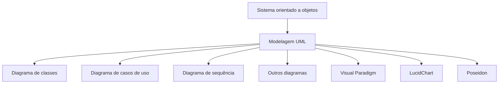

---

## 14. Mapa geral do capítulo

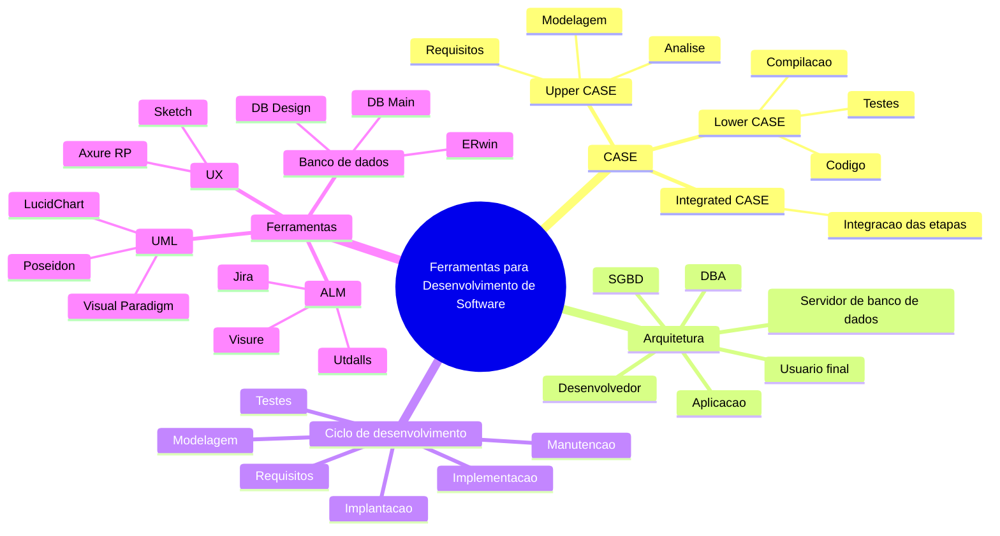

---

## 15. Síntese para revisão

O capítulo apresenta as ferramentas de apoio ao desenvolvimento de software, destacando que a complexidade dos sistemas modernos exige apoio em várias etapas do ciclo de vida.

As ferramentas CASE auxiliam desde o levantamento de requisitos até a modelagem, implementação, testes, banco de dados e manutenção. O capítulo também mostra que o desenvolvimento de software envolve diferentes profissionais, como desenvolvedores e DBAs, além de componentes técnicos como aplicação, SGBD e servidor de banco de dados.

A ideia principal é que ferramentas adequadas ajudam a organizar o processo, melhorar a qualidade, reduzir falhas e aumentar a produtividade no desenvolvimento de sistemas.

---

## 16. Perguntas de fixação

1. O que significa CASE?
2. Qual a diferença entre Upper CASE e Lower CASE?
3. Por que o levantamento de requisitos é uma etapa crítica?
4. Qual a diferença entre requisito funcional e requisito não funcional?
5. Para que serve uma ferramenta ALM?
6. O que é um wireframe?
7. Qual a função de um SGBD em uma aplicação?
8. Qual o papel do DBA em um sistema de software?
9. Por que a UML é importante na modelagem orientada a objetos?
10. Como ferramentas CASE podem melhorar a qualidade de um projeto?

---

## 17. Resumo final em uma frase

Ferramentas de desenvolvimento de software apoiam o profissional de TI em diferentes fases do ciclo de vida do sistema, desde os requisitos e a modelagem até a implementação, banco de dados, testes, implantação e manutenção.
