# Capítulo 02 — Ferramentas para Modelagem de Sistema de Software

> Documento de estudo em português, organizado para consulta no GitHub.
>
> Base do capítulo: material “Ferramentas para modelagem de Sistema de Software”, páginas 22 a 39 da apostila enviada.

---

## 1. Objetivos do capítulo

Ao final deste capítulo, o estudante deve ser capaz de:

- identificar diferentes tipos de ferramentas utilizadas para modelagem de software;
- compreender o conceito de modelagem de software e sua aplicação por meio de ferramentas específicas;
- entender a importância da modelagem antes da implementação;
- reconhecer o funcionamento básico de ferramentas CASE e IDEs com suporte à modelagem, como Astah, Microsoft Visio, NetBeans e Eclipse.

---

## 2. Visão geral

O desenvolvimento de um sistema de software passa por várias etapas. O capítulo apresenta uma sequência composta por:

1. levantamento e análise de requisitos;
2. modelagem;
3. implementação;
4. testes;
5. implantação;
6. manutenção.

A etapa de **modelagem** costuma ser negligenciada por exigir tempo, abstração e domínio conceitual. Porém, ela é fundamental para reduzir ambiguidades, antecipar erros, padronizar a comunicação entre profissionais e orientar a implementação do sistema.

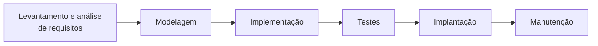

A ideia central é simples: **quanto melhor o modelo, menor a chance de o sistema ser implementado com falhas de entendimento**.

---

## 3. Processo de modelagem

Modelar software significa estruturar uma representação abstrata do sistema. Essa representação não mostra apenas código, mas também:

- contexto externo;
- interação entre partes do sistema;
- comportamento esperado;
- organização interna de dados e componentes.

A modelagem permite que analistas, desenvolvedores, arquitetos, usuários e demais interessados compartilhem uma visão comum do sistema antes que a implementação seja iniciada.

---

## 4. Perspectivas para criação de modelos de software

O capítulo apresenta quatro perspectivas principais de modelagem:

| Perspectiva | Foco | Pergunta que ajuda a entender |
|---|---|---|
| Externa | Contexto e ambiente de implantação | Onde o sistema será usado e com quais agentes externos interage? |
| Integração | Comunicação entre componentes do sistema e ambiente | Quais partes conversam entre si? |
| Comportamental | Comportamento dinâmico e reação a eventos | Como o sistema se comporta quando algo acontece? |
| Estrutural | Organização dos dados e componentes | Como os elementos internos são organizados? |

### Mermaid equivalente — Perspectivas de modelagem

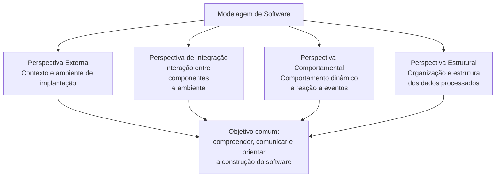

---

## 5. UML — Unified Modeling Language

A **UML**, ou **Linguagem de Modelagem Unificada**, é uma linguagem visual padronizada para representar sistemas de software.

Ela é importante porque oferece uma notação comum para representar:

- estrutura do sistema;
- comportamento do sistema;
- interação entre objetos, usuários e componentes;
- organização de classes, pacotes e implantação;
- fluxo de ações e mensagens.

A UML ajuda a reduzir a distância entre análise, projeto e implementação. Em vez de cada equipe criar sua própria forma de desenho, utiliza-se uma notação padronizada e reconhecida internacionalmente.

> Nota de atualização: o capítulo menciona UML 2.5. Atualmente, a especificação formal publicada pela OMG é a UML 2.5.1.

---

## 6. Classificação dos diagramas UML

O capítulo divide os diagramas UML em três categorias:

1. **Diagramas estruturais**;
2. **Diagramas comportamentais**;
3. **Diagramas de interação**.

### 6.1 Diagramas estruturais

Representam a estrutura estática do sistema.

Exemplos:

- diagrama de classes;
- diagrama de objetos;
- diagrama de componentes;
- diagrama de pacotes;
- diagrama de instalação ou implantação;
- diagrama de perfil;
- diagrama de estrutura composta.

### 6.2 Diagramas comportamentais

Representam o comportamento do sistema.

Exemplos:

- diagrama de casos de uso;
- diagrama de atividades;
- diagrama de máquina de estados.

### 6.3 Diagramas de interação

Representam interações entre objetos, componentes ou partes do sistema ao longo do tempo.

Exemplos:

- diagrama de sequência;
- diagrama de comunicação;
- diagrama de interação;
- diagrama de colaboração;
- diagrama de tempo.

### Mermaid equivalente — Classificação dos diagramas UML

```mermaid
flowchart TB
    UML["Diagramas UML"]

    UML --> EST["Diagramas Estruturais"]
    UML --> COM["Diagramas Comportamentais"]
    UML --> INT["Diagramas de Interação"]

    EST --> DC["Diagrama de Classes"]
    EST --> DO["Diagrama de Objetos"]
    EST --> DCOMP["Diagrama de Componentes"]
    EST --> DP["Diagrama de Pacotes"]
    EST --> DI["Diagrama de Instalação<br/>ou Implantação"]
    EST --> DPER["Diagrama de Perfil"]
    EST --> DEC["Diagrama de Estrutura Composta"]

    COM --> DUC["Diagrama de Casos de Uso"]
    COM --> DA["Diagrama de Atividades"]
    COM --> DME["Diagrama de Máquina de Estados"]

    INT --> DS["Diagrama de Sequência"]
    INT --> DCOMU["Diagrama de Comunicação"]
    INT --> DINTER["Diagrama de Interação"]
    INT --> DCOL["Diagrama de Colaboração"]
    INT --> DT["Diagrama de Tempo"]
```

---

## 7. Diagrama de classes

O **diagrama de classes** é um dos diagramas mais importantes da UML. Ele representa a estrutura do sistema a partir de classes, atributos, métodos e relacionamentos.

Uma classe geralmente contém:

- **nome da classe**;
- **atributos**, que representam dados ou propriedades;
- **métodos**, que representam comportamentos ou operações.

Exemplo conceitual:

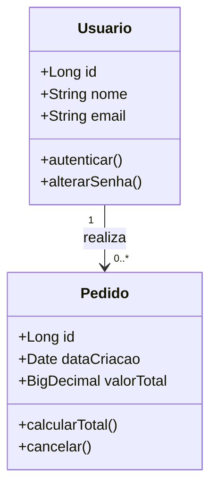

---

## 8. Conceitos importantes no diagrama de classes

O capítulo destaca alguns relacionamentos fundamentais:

| Conceito | Significado |
|---|---|
| Herança | Uma classe filha herda características de uma classe ancestral. |
| Associação | Uma classe se relaciona com outra. |
| Agregação | Um todo é formado por partes, mas as partes podem existir independentemente. |
| Composição | Um todo é formado por partes dependentes; se o todo deixa de existir, as partes também deixam. |
| Multiplicidade | Indica a quantidade de objetos envolvidos em uma relação. |

### 8.1 Herança

A herança permite representar especialização. Uma classe mais específica reutiliza características de uma classe mais geral.

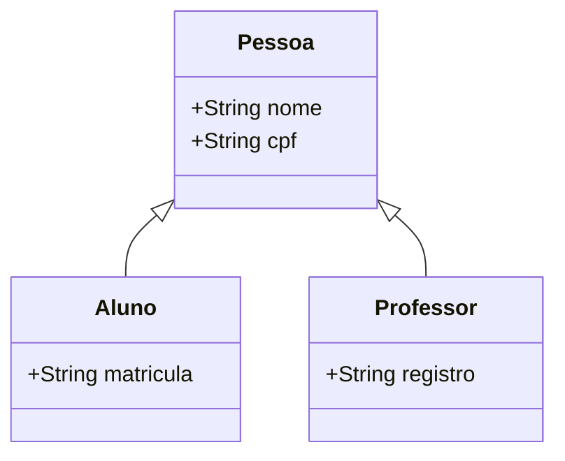

### 8.2 Associação e multiplicidade

A associação mostra que duas classes possuem algum vínculo. A multiplicidade indica quantas instâncias participam da relação.

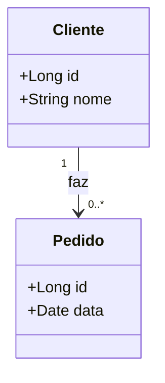

Interpretação:

- um cliente pode fazer zero ou muitos pedidos;
- cada pedido pertence a um cliente.

### 8.3 Agregação

Na agregação, as partes podem existir mesmo sem o todo.

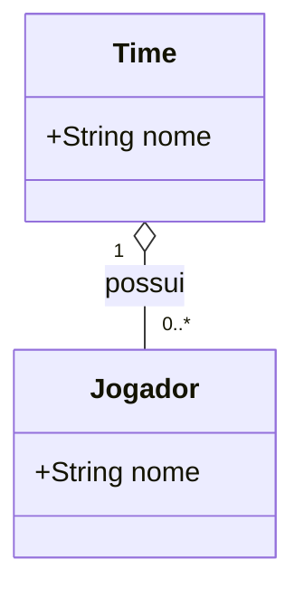

Interpretação:

- um time possui jogadores;
- se o time deixar de existir, o jogador ainda pode existir em outro contexto.

### 8.4 Composição

Na composição, a parte depende fortemente do todo.

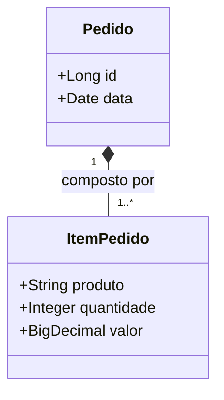

Interpretação:

- um pedido é composto por itens;
- um item de pedido não faz sentido isoladamente fora do pedido ao qual pertence.

### Mermaid equivalente — Conceitos do diagrama de classes

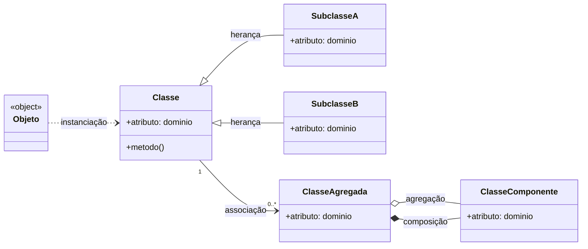

> Observação: em um modelo real, não se usa agregação e composição simultaneamente para o mesmo par de classes. O diagrama acima é apenas didático para demonstrar as notações.

---

## 9. Diagrama de casos de uso

O **diagrama de casos de uso** representa o sistema do ponto de vista do usuário.

Ele mostra:

- quem interage com o sistema;
- quais funcionalidades são oferecidas;
- quais ações pertencem a cada ator;
- relações como herança, inclusão e extensão.

Os principais elementos são:

| Elemento | Descrição |
|---|---|
| Ator | Pessoa, sistema externo ou equipamento que interage com o sistema. |
| Caso de uso | Funcionalidade ou serviço oferecido pelo sistema. |
| Associação | Ligação entre ator e caso de uso. |
| Include | Um caso de uso sempre executa outro caso de uso. |
| Extend | Um caso de uso pode complementar outro em uma situação específica. |
| Herança | Um ator ou caso de uso herda comportamento de outro. |

### Mermaid equivalente — Herança em casos de uso

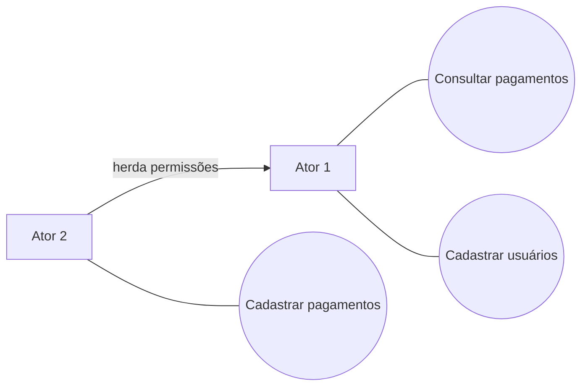

Interpretação do exemplo:

- o **Ator 1** pode consultar pagamentos e cadastrar usuários;
- o **Ator 2** pode cadastrar pagamentos;
- o **Ator 2** herda as ações do **Ator 1**, podendo também realizar as funcionalidades associadas a ele.

### Mermaid equivalente — Include e Extend

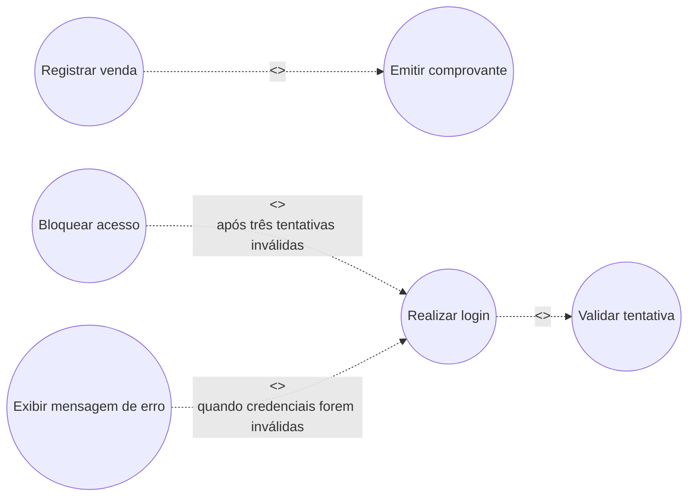

Interpretação:

- `include` representa uma ação obrigatória e sempre executada;
- `extend` representa uma ação opcional ou condicional, executada apenas em determinado cenário.

---

## 10. Diagrama de sequência

O **diagrama de sequência** representa o comportamento dinâmico do sistema ao longo do tempo.

Ele mostra:

- objetos ou atores envolvidos;
- mensagens trocadas entre eles;
- ordem temporal das ações;
- chamadas e retornos;
- colaboração entre componentes.

O capítulo destaca que o diagrama de sequência depende diretamente dos casos de uso e das classes já identificadas. Portanto, ele não deve ser criado isoladamente: é necessário saber quais atores, objetos e funcionalidades participam do cenário.

### Exemplo didático — Login de usuário

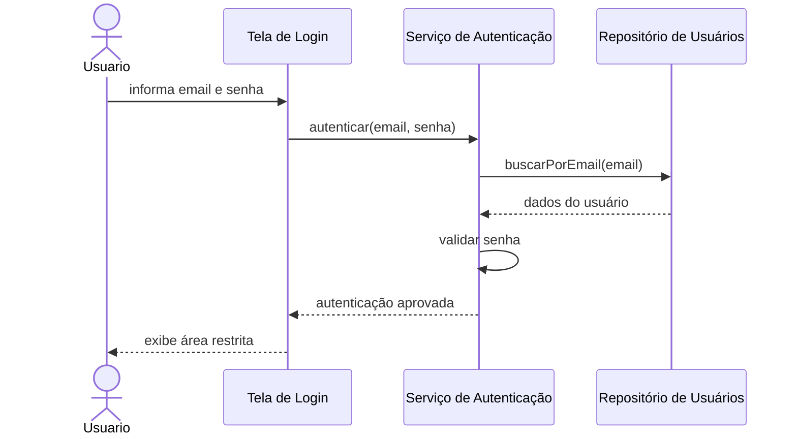

### Exemplo com retorno de erro

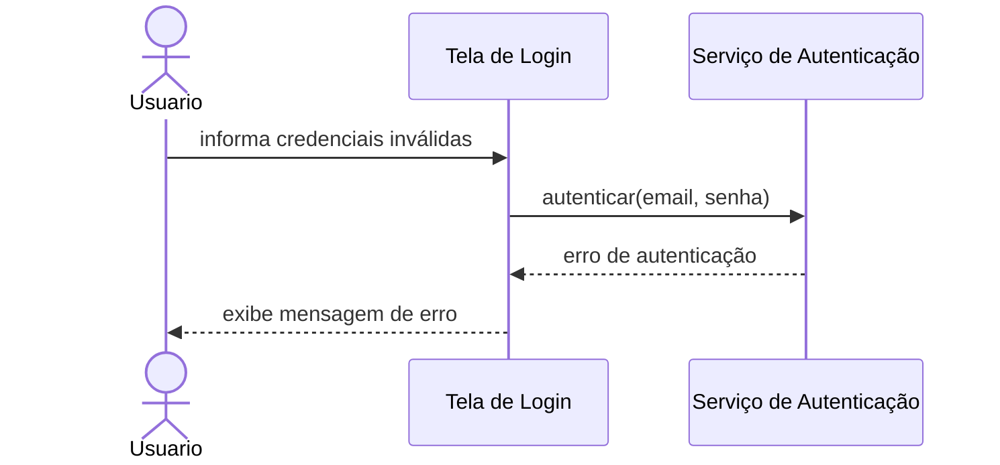

---

## 11. Ferramentas CASE e ferramentas de modelagem

Ferramentas CASE apoiam atividades de engenharia de software, incluindo análise, modelagem, documentação, geração de código e integração com ambientes de desenvolvimento.

O capítulo apresenta quatro ferramentas:

1. Astah;
2. Microsoft Visio;
3. NetBeans;
4. Eclipse.

---

## 12. Astah

O **Astah** é apresentado como uma ferramenta CASE voltada à modelagem de sistemas de software, com suporte à criação de diagramas UML.

Pontos destacados pelo capítulo:

- anteriormente era chamado de JUDE;
- o nome estava relacionado a “Java and UML Developers Environment”;
- possui integração com Java;
- permite criar diagramas UML;
- foi apresentado como uma ferramenta com versão completa paga e versão gratuita/community.

> Nota de atualização: a edição **Astah Community** foi oficialmente descontinuada em 2018 e não está mais disponível para download. Atualmente, o Astah oferece produtos comerciais, versões de avaliação e opções específicas como licença estudantil.

### Quando faz sentido usar

- Para criar diagramas UML com foco acadêmico ou profissional;
- Para modelar classes, casos de uso, sequência e outros diagramas;
- Para equipes que desejam uma ferramenta dedicada à modelagem.

---

## 13. Microsoft Visio

O **Microsoft Visio** é uma ferramenta de diagramação para Windows, utilizada para criar diferentes tipos de diagramas, como:

- fluxogramas;
- organogramas;
- diagramas UML;
- modelagem de dados;
- layouts de rede;
- plantas baixas;
- mapas e cartazes.

Pontos destacados pelo capítulo:

- possui interface semelhante ao Microsoft Office;
- oferece templates e modelos prontos;
- facilita a criação de diagramas visuais;
- possui licença paga.

> Nota de atualização: atualmente, o Visio também possui recursos no contexto do Microsoft 365 e versões/plano para uso web e desktop, dependendo da licença contratada.

### Quando faz sentido usar

- Para diagramas corporativos e documentação visual;
- Para fluxogramas de processos;
- Para diagramas rápidos, com boa apresentação visual;
- Para organizações que já utilizam o ecossistema Microsoft.

---

## 14. NetBeans

O **NetBeans** é apresentado como uma IDE open source e multiplataforma, usada para desenvolvimento em várias linguagens.

O capítulo cita suporte a linguagens como:

- Java;
- JavaScript;
- HTML;
- PHP;
- C/C++;
- Groovy;
- Ruby.

Também destaca que o NetBeans permite criar e manipular diagramas UML por meio de plugins ou recursos específicos.

> Nota de atualização: o NetBeans atualmente é mantido como **Apache NetBeans**, sob a Apache Software Foundation.

### Quando faz sentido usar

- Para desenvolvimento Java;
- Para projetos web;
- Para ensino de programação;
- Para desenvolvimento multiplataforma;
- Para quem busca uma IDE gratuita e extensível.

---

## 15. Eclipse

O **Eclipse** é apresentado como uma IDE open source, multiplataforma e extensível por plugins.

Pontos destacados pelo capítulo:

- permite desenvolvimento em diferentes linguagens;
- possui suporte a modelagem UML por meio de plugins;
- trabalha com múltiplas janelas e alta customização;
- permite produtividade no desenvolvimento com recursos visuais e integração com código.

### Quando faz sentido usar

- Para desenvolvimento Java corporativo;
- Para projetos que dependem de plugins específicos;
- Para equipes que precisam customizar a IDE;
- Para ambientes acadêmicos e profissionais que buscam ferramenta gratuita e extensível.

---

## 16. Comparativo didático das ferramentas

| Ferramenta | Tipo | Principal uso | Pontos fortes | Atenção |
|---|---|---|---|---|
| Astah | CASE/modelagem | UML e modelagem de software | Foco em modelagem | Community Edition foi descontinuada |
| Microsoft Visio | Diagramação | Diagramas gerais e UML | Visual profissional, templates, integração Microsoft | Licença paga |
| NetBeans | IDE | Desenvolvimento e modelagem via recursos/plugins | Open source, multiplataforma, forte em Java | UML pode depender de plugins |
| Eclipse | IDE | Desenvolvimento extensível e modelagem via plugins | Ecossistema robusto, plugins, Java corporativo | Configuração pode ser mais complexa |

---

## 17. Mapa mental do capítulo

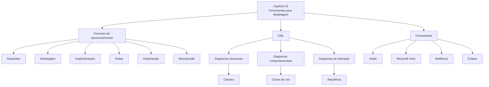

---

## 18. Pontos-chave para revisão

- Modelagem é uma etapa essencial do processo de desenvolvimento de software.
- A UML fornece uma linguagem visual padronizada para representar sistemas.
- Diagramas estruturais mostram a estrutura estática do sistema.
- Diagramas comportamentais mostram funcionalidades e comportamentos.
- Diagramas de interação mostram comunicação entre objetos ou componentes.
- Diagrama de classes representa classes, atributos, métodos e relacionamentos.
- Diagrama de casos de uso mostra o sistema sob a perspectiva do usuário.
- Diagrama de sequência mostra a ordem temporal das mensagens.
- Ferramentas CASE e IDEs ajudam a criar, manter e documentar modelos.
- Ferramentas de modelagem não substituem o entendimento do problema; elas apenas apoiam a representação do sistema.

---

## 19. Perguntas para fixação

1. Por que a etapa de modelagem costuma ser negligenciada em projetos de software?
2. Qual é a principal vantagem de usar UML em vez de diagramas informais?
3. Qual é a diferença entre diagrama estrutural e diagrama comportamental?
4. Em um diagrama de classes, qual é a diferença entre associação, agregação e composição?
5. O que representa a multiplicidade em um relacionamento entre classes?
6. Qual é a finalidade de um diagrama de casos de uso?
7. Qual é a diferença entre `include` e `extend` em casos de uso?
8. Por que o diagrama de sequência depende dos casos de uso e das classes?
9. Em que situação o Microsoft Visio pode ser mais adequado do que uma IDE?
10. Em que situação uma ferramenta como Eclipse ou NetBeans pode ser mais adequada do que uma ferramenta apenas de diagramação?

---

## 20. Glossário rápido

| Termo | Definição |
|---|---|
| UML | Linguagem de Modelagem Unificada usada para representar sistemas por meio de diagramas. |
| CASE | Ferramenta de apoio à engenharia de software. |
| IDE | Ambiente integrado de desenvolvimento. |
| Classe | Estrutura que representa um conceito do sistema, com atributos e métodos. |
| Atributo | Dado ou propriedade de uma classe. |
| Método | Comportamento ou operação de uma classe. |
| Herança | Relação em que uma classe especializada herda características de uma classe geral. |
| Associação | Relação entre classes. |
| Agregação | Relação todo-parte fraca. |
| Composição | Relação todo-parte forte. |
| Multiplicidade | Quantidade de instâncias envolvidas em uma associação. |
| Ator | Usuário, sistema externo ou equipamento que interage com o sistema. |
| Caso de uso | Funcionalidade oferecida pelo sistema. |
| Diagrama de sequência | Diagrama que mostra mensagens entre participantes ao longo do tempo. |

---

## 21. Síntese final

Este capítulo reforça que a modelagem é um instrumento de comunicação e planejamento. Antes de escrever código, a equipe precisa entender o problema, estruturar os elementos do sistema e visualizar como eles se relacionam.

A UML fornece uma linguagem padronizada para essa representação, enquanto ferramentas como Astah, Visio, NetBeans e Eclipse apoiam a criação, documentação e manutenção dos modelos. Na prática, a escolha da ferramenta depende do objetivo: modelagem dedicada, documentação visual, desenvolvimento integrado ou extensibilidade por plugins.
