# Capítulo 04 — Ferramentas para Automação de Testes de Software

> **Tema central:** compreender como o ciclo final de desenvolvimento de software se relaciona com testes, liberação de versões e uso de ferramentas CASE para automação de testes.

---

## 1. Objetivos do capítulo

Ao final deste capítulo, o estudante deve ser capaz de:

- identificar diferentes tipos de ferramentas usadas para modelagem e automação de testes de software;
- compreender o papel das ferramentas CASE no gerenciamento de projetos de desenvolvimento;
- entender a estrutura do ciclo de liberação de um sistema;
- conhecer o funcionamento geral de ferramentas como **Selenium IDE**, **Apache JMeter**, **Appium**, **Cucumber** e **Robotium**.

---

## 2. Visão geral do capítulo

O capítulo apresenta a automação de testes como parte essencial do processo de desenvolvimento de software. Depois que uma funcionalidade é implementada, ela precisa ser verificada para garantir que atende aos requisitos definidos e que não introduz defeitos no sistema.

A automação de testes ajuda a:

- repetir cenários de teste com menor esforço manual;
- reduzir erros humanos na execução de testes repetitivos;
- apoiar testes de regressão;
- acelerar ciclos de validação;
- fornecer evidências mais consistentes sobre qualidade, desempenho e comportamento funcional.

---

## 3. Ciclo de liberação e automação de testes

O capítulo explica que testar um software significa investigar seus componentes e funcionalidades para verificar sua qualidade em relação ao contexto em que será utilizado.

A etapa final do desenvolvimento pode ser resumida em três grandes momentos:

1. **Implementação**
2. **Testes**
3. **Entrega final**

### Diagrama Mermaid — Representação das etapas finais do ciclo de desenvolvimento

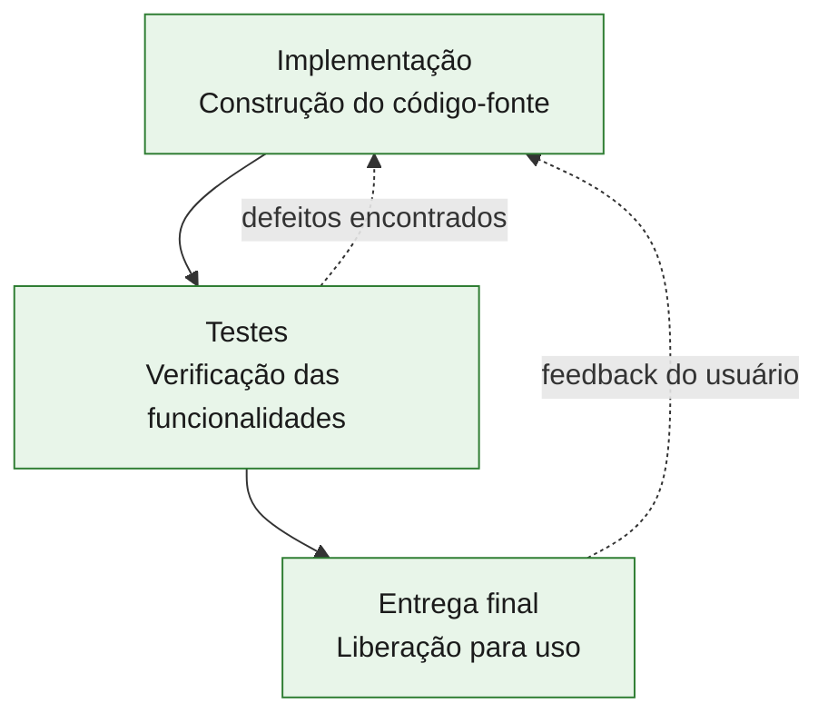

### Interpretação

A implementação representa a construção do sistema por meio de uma ou mais linguagens de programação. Durante e após essa construção, os testes verificam se as rotinas funcionam corretamente. Depois de testado e validado, o software é liberado para implantação no ambiente do usuário.

---

## 4. Testes no processo de desenvolvimento

Durante a realização dos testes, as tarefas são voltadas ao cumprimento dos requisitos e das funcionalidades esperadas do sistema.

O capítulo destaca que, ao final dos testes, o sistema pode ser liberado para instalação. Essa liberação recebe o nome de **release**, isto é, o lançamento de uma nova versão oficial do software.

### Diagrama Mermaid — Fluxo simplificado de release

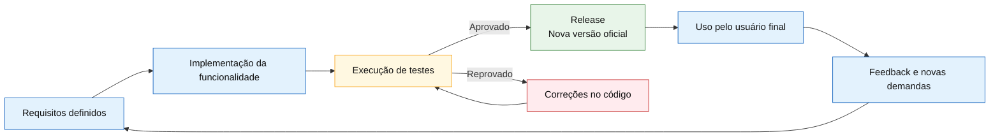

---

## 5. Controle de versionamento

O capítulo também menciona o **controle de versionamento** como um processo essencial para gerenciar ações corretivas e evolutivas em um sistema.

As ações sobre o software podem ser classificadas em duas categorias principais:

| Categoria | Descrição |
|---|---|
| **Corretiva** | Corrige defeitos, falhas ou comportamentos inadequados. |
| **Agregação de novos recursos** | Adiciona novas funcionalidades ou amplia capacidades existentes. |

### Diagrama Mermaid — Relação entre versionamento, manutenção e release

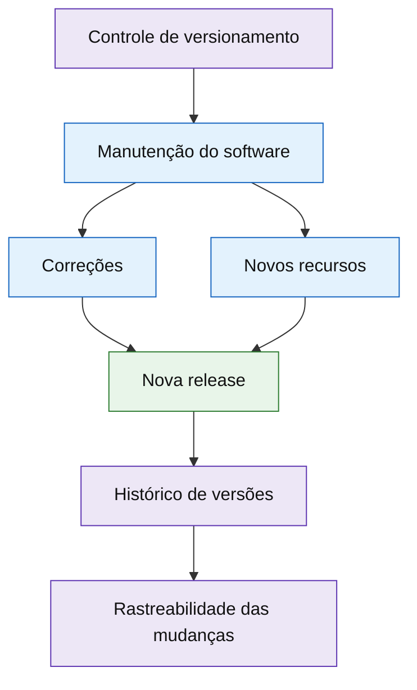

---

## 6. Tipos de teste citados no capítulo

O material apresenta diferentes classificações de teste dentro do processo de desenvolvimento.

### 6.1 Teste alfa

O teste alfa é executado no ambiente de desenvolvimento. Nele, os desenvolvedores verificam o código-fonte, os componentes do front-end, o back-end, a conectividade com outros sistemas e o banco de dados.

### 6.2 Teste beta

O teste beta é realizado por um grupo específico de usuários. O objetivo é observar o software sob a perspectiva do usuário final e verificar se as funcionalidades atendem aos requisitos esperados.

### 6.3 Teste funcional

O teste funcional verifica as ações executadas pelo sistema para identificar comportamentos inesperados em relação às funcionalidades definidas no início do desenvolvimento.

### 6.4 Teste gama

O teste gama representa uma verificação em ambiente completo de desenvolvimento, com o software em estado mais próximo da entrega. O usuário final realiza testes e fornece feedback ao fabricante ou equipe responsável.

### Diagrama Mermaid — Classificação didática dos testes

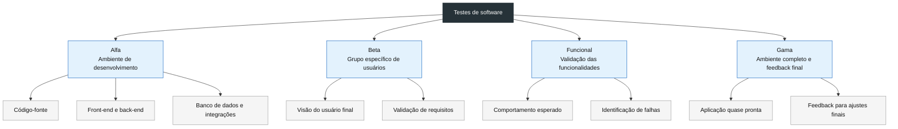

---

# 7. Ferramentas CASE para automação de testes

O capítulo apresenta cinco ferramentas principais:

- **Selenium**
- **Apache JMeter**
- **Appium**
- **Cucumber**
- **Robotium**

Essas ferramentas apoiam diferentes necessidades de teste, como automação de interface web, testes de carga, testes mobile, BDD e automação de aplicações Android.

### Diagrama Mermaid — Visão geral das ferramentas

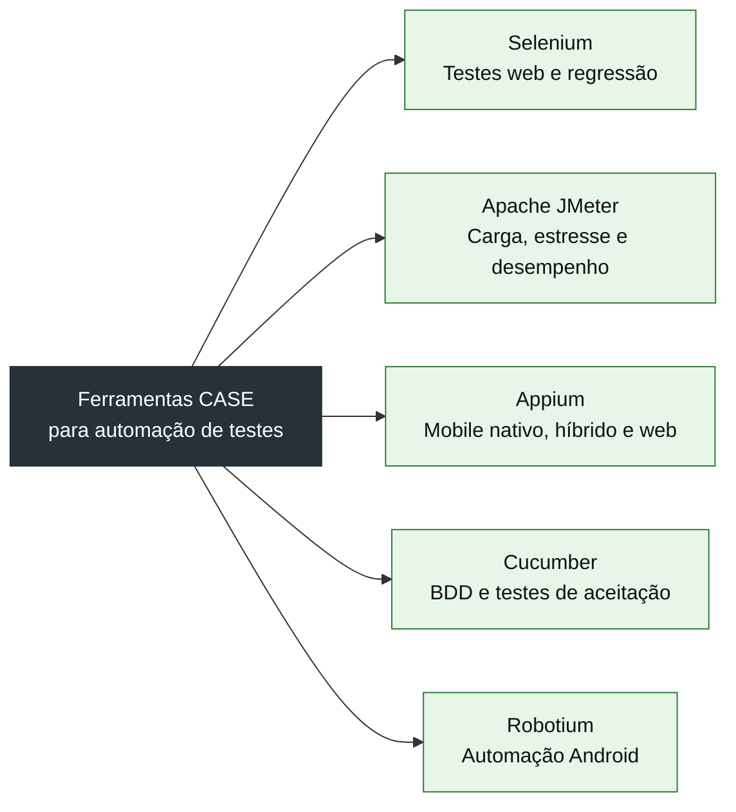

---

## 8. Selenium

O **Selenium** é apresentado como uma ferramenta CASE que oferece um ambiente integrado para criação de scripts de testes automatizados. Ele permite gravar, editar e depurar testes para aplicações web.

O material destaca que o Selenium pode ser usado para:

- gravar ações do usuário;
- reproduzir cenários de teste;
- facilitar testes de regressão;
- repetir o mesmo teste em novas versões do sistema;
- apoiar automação em navegadores.

A apostila apresenta três versões ou componentes:

| Componente | Papel principal |
|---|---|
| **Selenium WebDriver** | Criação de suítes de testes para automação de regressão em navegadores. |
| **Selenium IDE** | Criação e reprodução de scripts, útil para testes exploratórios e testes básicos. |
| **Selenium Grid** | Distribuição e execução de testes em várias máquinas, navegadores e ambientes. |

### Atualização técnica

Atualmente, o Selenium é descrito oficialmente como um projeto voltado à automação de navegadores, principalmente para testes de aplicações web. O WebDriver conduz o navegador de forma nativa e é uma recomendação W3C. O Selenium Grid permite executar scripts WebDriver em máquinas remotas e em paralelo.

### Diagrama Mermaid — Arquitetura conceitual do Selenium

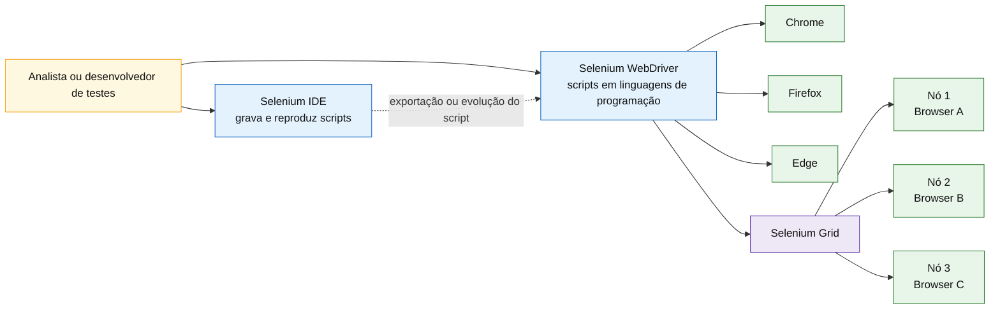

### Exemplo didático de uso

Um time possui uma tela de login e precisa garantir que ela continue funcionando após cada nova alteração no sistema. Com Selenium, é possível automatizar o cenário:

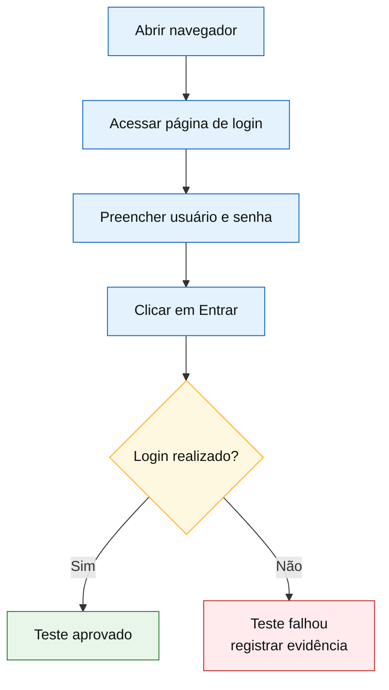

---

## 9. Apache JMeter

O **Apache JMeter** é apresentado como uma ferramenta CASE para realizar testes de carga e estresse em recursos estáticos ou dinâmicos de um sistema.

Segundo o capítulo, o JMeter:

- foi desenvolvido pela Apache;
- é mantido em Java;
- permite testar aplicações web;
- também pode testar bancos de dados via JDBC, objetos Java, mensageria JMS e serviços LDAP;
- fornece recursos para medir desempenho;
- permite configurar requisições, resultados, variáveis, scripts e quantidade de execuções;
- pode usar grupos de threads para simular múltiplos usuários ou execuções paralelas.

### Atualização técnica

A documentação oficial do Apache JMeter o descreve como uma aplicação Java open source, criada para testes de carga de comportamento funcional e medição de desempenho.

### Diagrama Mermaid — Estrutura de um plano de teste no JMeter

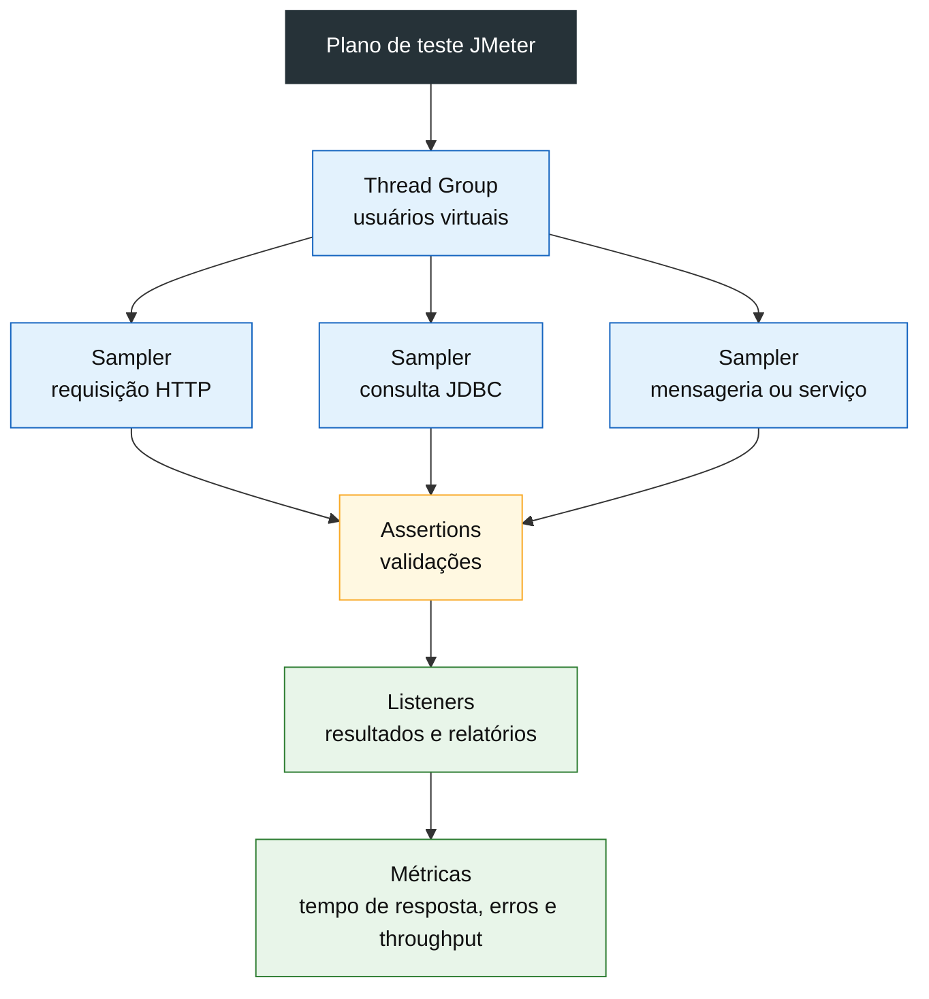

### Diagrama Mermaid — Teste de carga com usuários virtuais

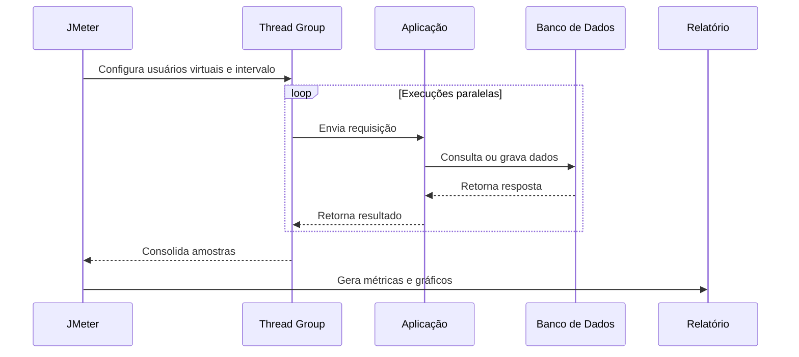

### Exemplo didático de uso

Imagine um sistema de matrícula em que muitos alunos acessam o portal ao mesmo tempo. Com JMeter, é possível simular centenas ou milhares de acessos para avaliar:

- tempo médio de resposta;
- número de erros;
- capacidade do servidor;
- comportamento sob estresse;
- gargalos de banco de dados ou aplicação.

---

## 10. Appium

O **Appium** é apresentado como uma ferramenta CASE open source usada para executar scripts de automação e testar aplicativos nativos, aplicações web em dispositivos móveis e aplicações híbridas para Android e iOS.

O capítulo destaca que o Appium:

- utiliza drivers de conectividade em ambiente web;
- permite testar diferentes sistemas operacionais usando a mesma API;
- possui interface simples por linha de comando;
- pode executar planos de teste localmente ou remotamente;
- permite compartilhar resultados entre máquinas.

O material também lista princípios importantes da automação mobile:

1. não deve ser necessário recompilar ou modificar o aplicativo para automatizá-lo;
2. o testador não deve ficar preso a uma linguagem ou framework específico;
3. uma estrutura de automação mobile não deve reinventar a roda quando APIs existentes podem ser integradas;
4. a estrutura de automação deve ser de código aberto.

### Atualização técnica

A documentação atual do Appium o apresenta como um projeto e ecossistema open source para automação de interface de usuário em diferentes plataformas. O repositório oficial descreve o Appium como um framework de automação multiplataforma baseado no protocolo W3C WebDriver.

### Diagrama Mermaid — Arquitetura conceitual do Appium

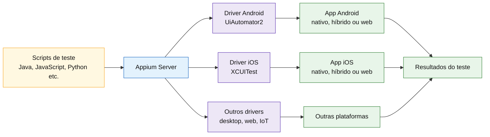

### Diagrama Mermaid — Execução de teste mobile

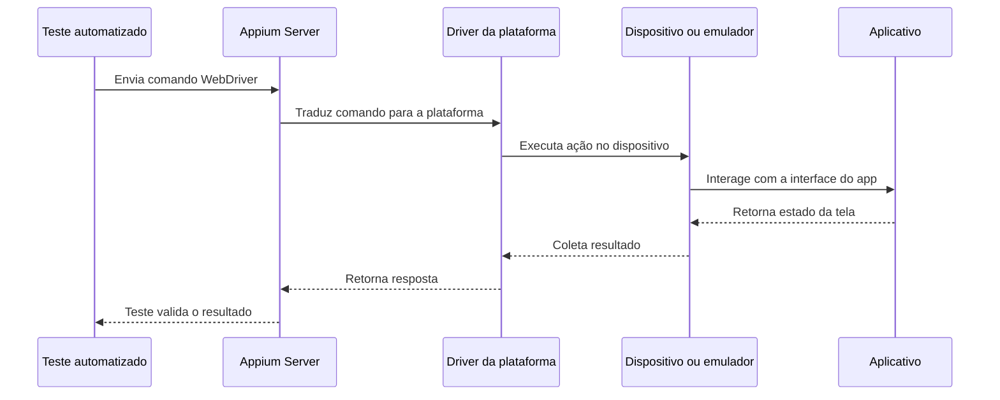

---

## 11. Cucumber

O **Cucumber** é apresentado como uma ferramenta CASE criada para apoiar o desenvolvimento de testes de aceitação automatizados usando o conceito de **BDD**.

BDD significa **Behavior Driven Development**, ou **Desenvolvimento Guiado por Comportamento**. A ideia é aproximar desenvolvedores, equipe de qualidade, áreas de negócio e pessoas não técnicas por meio de cenários escritos em linguagem simples.

O capítulo explica que o Cucumber foi originalmente desenvolvido em Ruby e depois traduzido para outras estruturas, como Java.

### Processo descrito no capítulo

O Cucumber apoia o seguinte fluxo:

1. descrever o comportamento do software em texto simples;
2. escrever ou carregar o código a ser testado;
3. executar os passos e visualizar resultados ou falhas;
4. reescrever o código para os passos avançarem;
5. refatorar, se necessário, o código ou o comportamento descrito.

### Atualização técnica

A documentação atual do Cucumber explica que o Gherkin fornece regras gramaticais para transformar texto simples em especificações executáveis. Essas especificações podem servir como documentação do comportamento real do sistema e como base para testes automatizados.

### Exemplo de cenário BDD

```gherkin
Funcionalidade: Login do usuário

  Cenário: Login com credenciais válidas
    Dado que o usuário está na página de login
    Quando informa usuário e senha válidos
    Então o sistema deve permitir o acesso
```

### Diagrama Mermaid — Fluxo BDD com Cucumber

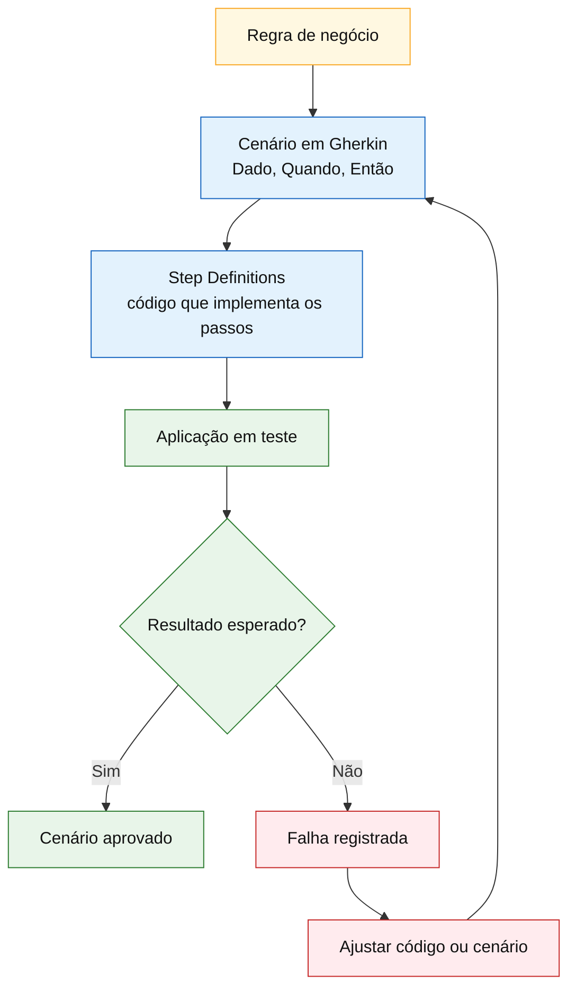

### Diagrama Mermaid — Papel do Cucumber como ponte entre áreas

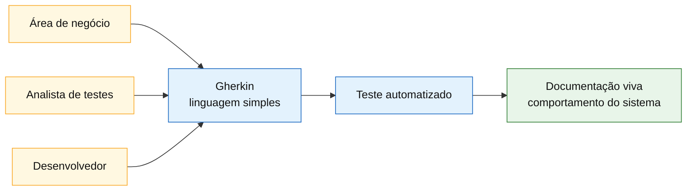

---

## 12. Robotium

O **Robotium** é apresentado como uma ferramenta CASE open source usada para criar estruturas de teste e escrever casos de teste automatizados para aplicações Android.

O capítulo destaca que o Robotium:

- permite criar cenários de teste funcional, de sistema e de aceitação;
- é voltado para aplicações Android;
- tem foco em testes no nível do usuário e da interface;
- usa Java;
- executa os testes em dispositivo como uma aplicação separada;
- simula interações do usuário com a interface da aplicação.

### Vantagens citadas no capítulo

| Vantagem | Explicação |
|---|---|
| Testes nativos e híbridos Android | Permite testar aplicações Android em diferentes cenários. |
| Menor exigência de conhecimento profundo sobre estabilidade | Facilita a escrita dos testes para determinados contextos. |
| Resultados compactos | As saídas podem ser mais objetivas e gerenciáveis. |
| Execução rápida | Favorece ciclos de validação mais curtos. |
| Paralelismo | Pode apoiar execução em arquitetura paralela. |
| Integração | Pode se integrar com banco de dados e aplicações web. |

### Desvantagens citadas no capítulo

| Desvantagem | Explicação |
|---|---|
| Dificuldade com componentes web | Pode ter limitações em interações com componentes web. |
| Limitações com componentes visuais externos | Pode não interagir com elementos como barra de notificações e widgets externos. |

### Atualização técnica

O Robotium continua documentado como um framework de automação de testes Android com suporte a aplicações nativas e híbridas. Na prática atual, porém, ele aparece mais como uma solução legada ou específica, enquanto o ecossistema Android moderno dá grande ênfase a testes instrumentados, testes de UI e práticas integradas ao Android Studio e às ferramentas oficiais da plataforma.

### Diagrama Mermaid — Execução conceitual com Robotium

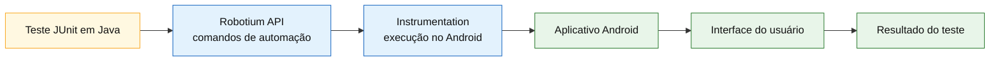

### Diagrama Mermaid — Teste de interface gráfica com Robotium

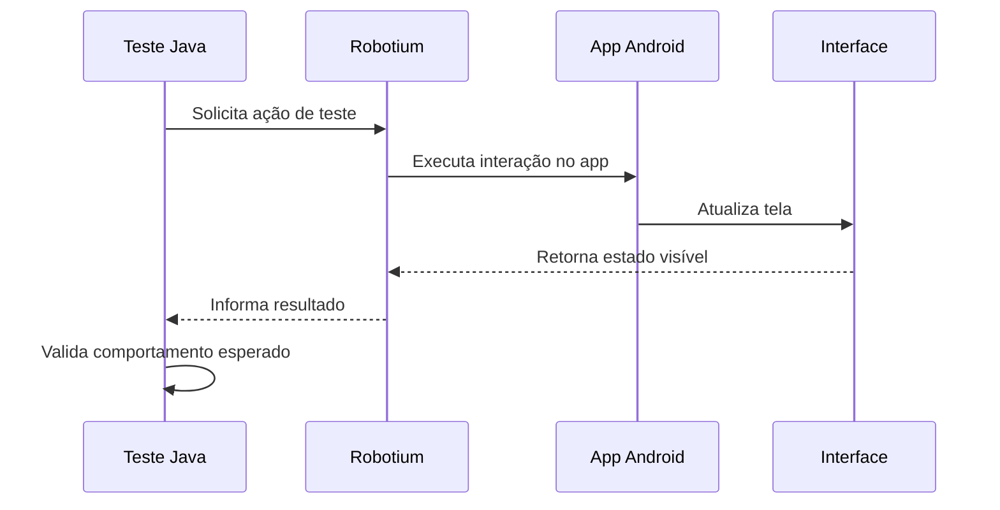

---

# 13. Comparação entre as ferramentas

| Ferramenta | Foco principal | Ambiente típico | Tipo de teste mais associado |
|---|---|---|---|
| **Selenium** | Automação de navegador | Web | Funcional, regressão, aceitação |
| **Apache JMeter** | Carga, estresse e desempenho | Web, serviços, banco, mensageria | Performance |
| **Appium** | Automação mobile multiplataforma | Android, iOS e outros drivers | Funcional, regressão, aceitação mobile |
| **Cucumber** | BDD e especificação executável | Multiplataforma | Aceitação, comportamento |
| **Robotium** | Automação Android | Android | Funcional, sistema e aceitação |

### Diagrama Mermaid — Quando usar cada ferramenta

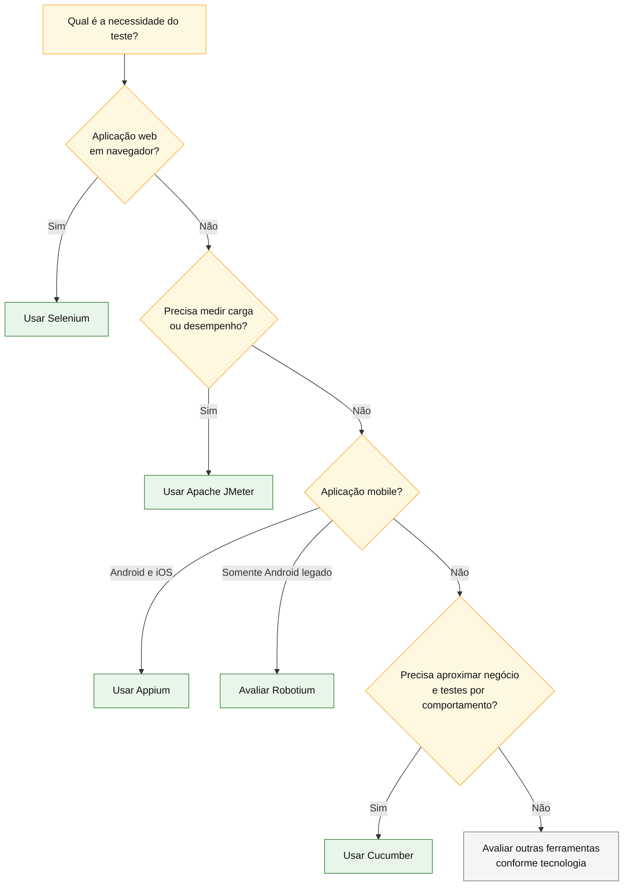

---

# 14. Relação com engenharia de software

O capítulo reforça uma ideia central da engenharia de software: testar não é uma atividade isolada no fim do projeto. Testes devem acompanhar o desenvolvimento e apoiar a qualidade do produto.

A automação de testes se conecta com vários temas importantes:

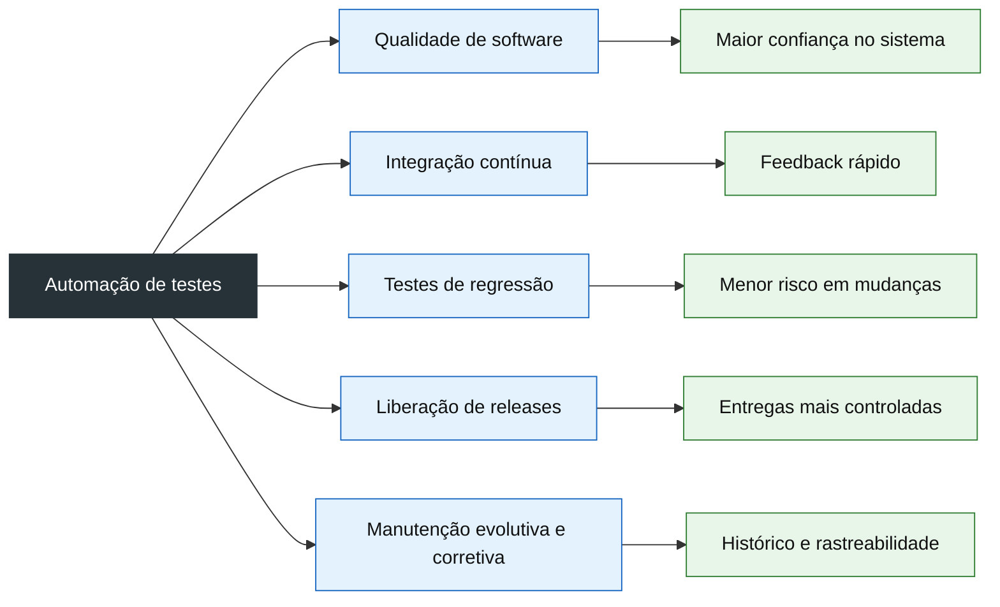

---

# 15. Boas práticas extraídas do capítulo

Com base no conteúdo, algumas boas práticas podem ser consolidadas:

1. **Automatizar testes repetitivos**
   - Especialmente testes de regressão, pois precisam ser executados várias vezes ao longo da evolução do sistema.

2. **Separar objetivos de teste**
   - Teste funcional, carga, aceitação e mobile têm finalidades diferentes e podem exigir ferramentas diferentes.

3. **Usar testes como apoio à release**
   - Uma release deve ser liberada com evidências mínimas de validação.

4. **Manter rastreabilidade**
   - Mudanças corretivas e evolutivas devem estar associadas a versões e histórico de alterações.

5. **Aproximar negócio e tecnologia**
   - Ferramentas como Cucumber ajudam a transformar regras de negócio em especificações executáveis.

6. **Escolher ferramenta conforme o contexto**
   - Selenium não substitui JMeter; JMeter não substitui Cucumber; Appium não substitui Robotium em todos os contextos legados. Cada ferramenta tem um foco.

---

# 16. Mapa mental do capítulo

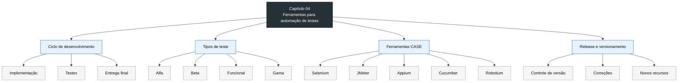

---

# 17. Síntese final

O Capítulo 04 apresenta a automação de testes como uma prática essencial no ciclo final de desenvolvimento de software. Após a implementação, os testes verificam a aderência do sistema aos requisitos e reduzem o risco de defeitos antes da entrega final.

As ferramentas CASE estudadas possuem papéis complementares:

- **Selenium** automatiza testes web em navegadores;
- **JMeter** mede carga, estresse e desempenho;
- **Appium** automatiza testes mobile em diferentes plataformas;
- **Cucumber** aproxima regras de negócio e testes por meio de BDD;
- **Robotium** automatiza testes em aplicações Android, especialmente em contextos mais específicos ou legados.

A principal mensagem do capítulo é que a qualidade do software depende de processos repetíveis, verificáveis e bem organizados. A automação de testes reduz esforço manual, melhora a confiabilidade das entregas e contribui para ciclos de release mais seguros.

---

# 18. Perguntas de revisão

1. Qual é a diferença entre implementação, testes e entrega final?
2. O que é uma release?
3. Por que o controle de versionamento é importante no processo de manutenção?
4. Qual é a diferença entre teste alfa e teste beta?
5. Em que cenário o Selenium é mais indicado?
6. Por que o JMeter é adequado para testes de carga?
7. Qual é o papel do Appium na automação mobile?
8. Como o Cucumber ajuda a aproximar equipe técnica e área de negócio?
9. Para que tipo de aplicação o Robotium foi projetado?
10. Por que testes automatizados ajudam em ciclos de regressão?

---

# 19. Referências complementares

- Apostila do Capítulo 04 — Ferramentas para automação de testes de software.
- Documentação oficial do Selenium.
- Documentação oficial do Apache JMeter.
- Documentação oficial do Appium.
- Documentação oficial do Cucumber/Gherkin.
- Documentação do projeto Robotium.
- Documentação oficial de testes Android.
