# Gerenciamento Ágil dos Sistemas — Temas 01 a 04

Documentação de estudo baseada no material da disciplina **Gerenciamento Ágil dos Sistemas (WBA0450_v1.0)**, estruturada para consulta no GitHub.

## Visão integrada

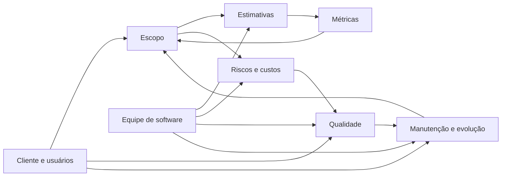

---

# Tema 01 — Controlando o escopo: métricas e estimativas

## 1. Objetivos

- Administrar o escopo de um sistema em contexto ágil.
- Compreender a relação entre **escopo, métricas e estimativas**.
- Entender o papel das histórias de usuário no planejamento, construção e validação.
- Estimar tamanho relativo por Story Points.
- Utilizar métricas como velocidade, burndown, lead time e throughput.
- Compreender por que histórias grandes devem ser divididas, em vez de simplesmente aumentar a iteração.

## 2. Ideia central

O material apresenta o gerenciamento ágil como um processo no qual o escopo é detalhado progressivamente, o mais próximo possível da implementação. Isso permite responder às mudanças de negócio sem perder o controle do que pode ser entregue.

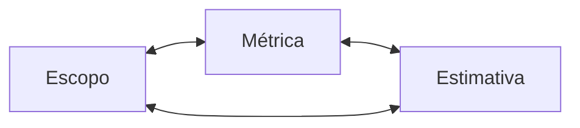

Escopo, métrica e estimativa são interdependentes: a equipe estima o tamanho do trabalho, mede sua capacidade real e usa essas informações para controlar o escopo das próximas entregas.

## 3. Valores ágeis que sustentam o controle do escopo

| Valor priorizado | Em relação a |
|---|---|
| Indivíduos e interações | processos e ferramentas |
| Software funcionando | documentação abrangente |
| Colaboração com o cliente | negociação de contratos |
| Resposta a mudanças | seguir um plano |

O material não propõe abandonar processos, documentação ou planejamento. A ideia é priorizar o que mais contribui para entregar valor e responder ao usuário.

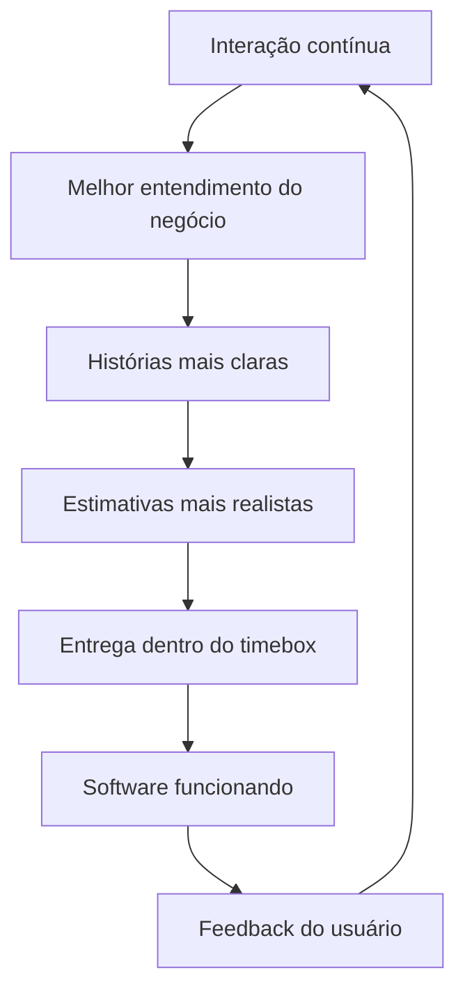

## 4. Escopo e timebox

O **timebox** é um intervalo de duração fixa. As atividades precisam ser ajustadas para caber nesse limite.

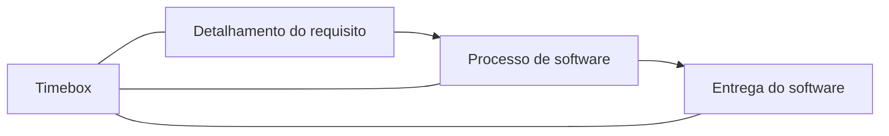

O timebox ajuda a equipe a conhecer sua capacidade real. Por isso, quando uma história é grande demais, a solução não é simplesmente ampliar a iteração.

## 5. História de usuário

A história de usuário representa uma necessidade funcional do ponto de vista de quem utiliza o sistema.

| Fase | Papel da história de usuário |
|---|---|
| Planejamento | valor, prioridade, critério de aceitação e tamanho |
| Construção e design | base para implementação e refatoração |
| Testes | referência para validação do comportamento esperado |

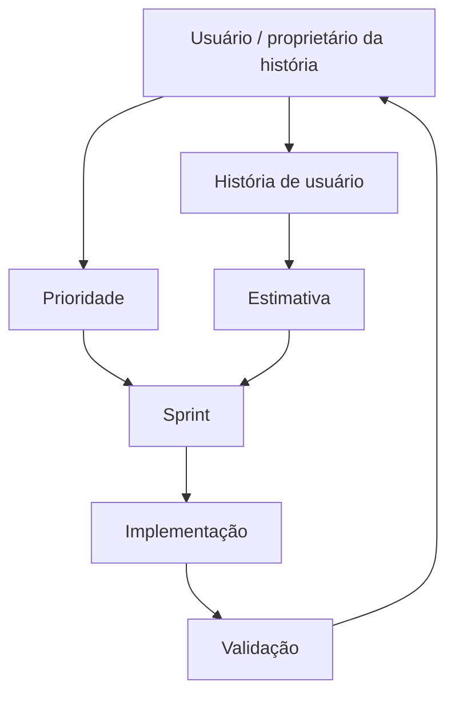

## 6. Backlog e planejamento

O Product Backlog contém os itens a serem desenvolvidos. A equipe seleciona itens conforme prioridade e capacidade.

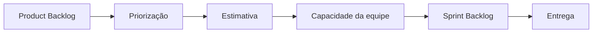

## 7. Estimativas

### 7.1 Alto nível

No início do projeto, quando há muita incerteza, o material utiliza tamanhos relativos como:

`PP — P — M — G — GG`

### 7.2 Story Points

Story Point representa **tamanho relativo**, considerando complexidade, volume de trabalho e incerteza. Não representa diretamente horas ou dias.

Sequência de referência apresentada no material:

`0,5 — 1 — 2 — 3 — 5 — 8 — 13 — 21 — 34`

### 7.3 Planning Poker / Wideband Delphi

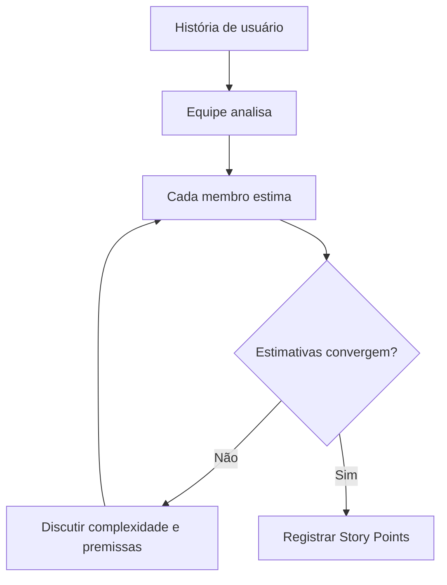

O processo força o entendimento compartilhado. O valor não está apenas no número final, mas também na discussão das diferenças de percepção.

## 8. Divisão de histórias grandes

Quando uma história não cabe em uma iteração, deve ser dividida em histórias menores, com participação do usuário/proprietário da história.

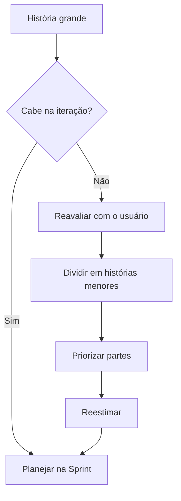

Não é recomendado resolver o problema sacrificando testes, refatoração ou qualidade, nem supondo que adicionar pessoas aumentará a produtividade de forma imediata.

## 9. Métricas

### Velocidade

Representa a capacidade histórica de entrega da equipe em uma iteração.

`Velocidade = Story Points concluídos na Sprint`

Deve apoiar previsão e aprendizado da própria equipe, não competição entre equipes.

### Burndown

Acompanha quanto trabalho ainda resta ao longo da iteração.

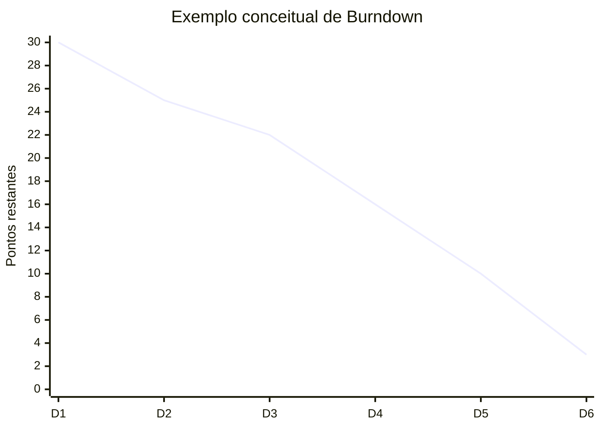

### Lead Time e WIP

Lead Time mede o tempo entre a entrada de uma demanda e sua conclusão. WIP representa o trabalho em andamento.


### Throughput

Representa a quantidade de demandas concluídas por período.

`Throughput = demandas concluídas / período`

## 10. Comunicação, inspeção e adaptação

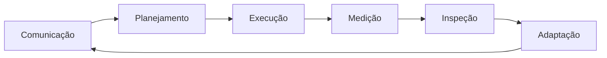

O material associa reunião diária, revisão e retrospectiva à identificação de impedimentos e à melhoria do produto e do processo.

> O podcast da disciplina apresenta tempos específicos para eventos Scrum com base na referência usada no material, ligada ao Scrum Guide de 2017. Esses tempos devem ser lidos como parte do conteúdo da disciplina.

## 11. Resumo para revisão

| Conceito | Essência |
|---|---|
| Escopo ágil | detalhamento progressivo |
| Timebox | intervalo de duração fixa |
| História de usuário | necessidade que orienta planejamento, construção e teste |
| Story Point | tamanho relativo, não horas |
| Velocidade | capacidade histórica de entrega |
| Burndown | trabalho restante |
| Lead Time | tempo da entrada à conclusão |
| WIP | trabalho em andamento |
| Throughput | demandas concluídas por período |
| História grande | dividir, priorizar e reestimar |

**Síntese:** escopo, estimativa e métrica formam um ciclo de controle para entregar valor com previsibilidade.

---

# Tema 02 — Gestão de riscos e de custos com COCOMO II

## 1. Objetivos

- Identificar e classificar riscos em projetos de software.
- Relacionar probabilidade, impacto e resposta.
- Compreender o gerenciamento de riscos em métodos ágeis.
- Conhecer os principais submodelos do COCOMO II.
- Reconhecer fatores que influenciam o custo.
- Entender por que aumento de equipe não reduz prazo de maneira linear.

## 2. Risco em projetos de software

Risco é um evento incerto capaz de afetar cronograma, custo, qualidade ou escopo.

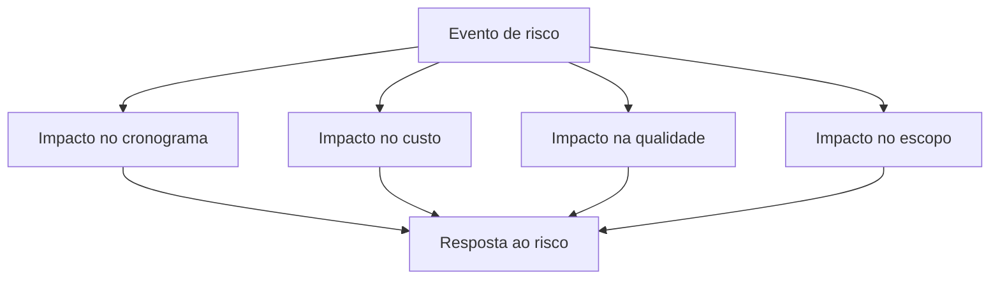

A gestão deve atuar sobre as causas, e não apenas sobre as consequências.

## 3. Fontes de mudança e risco

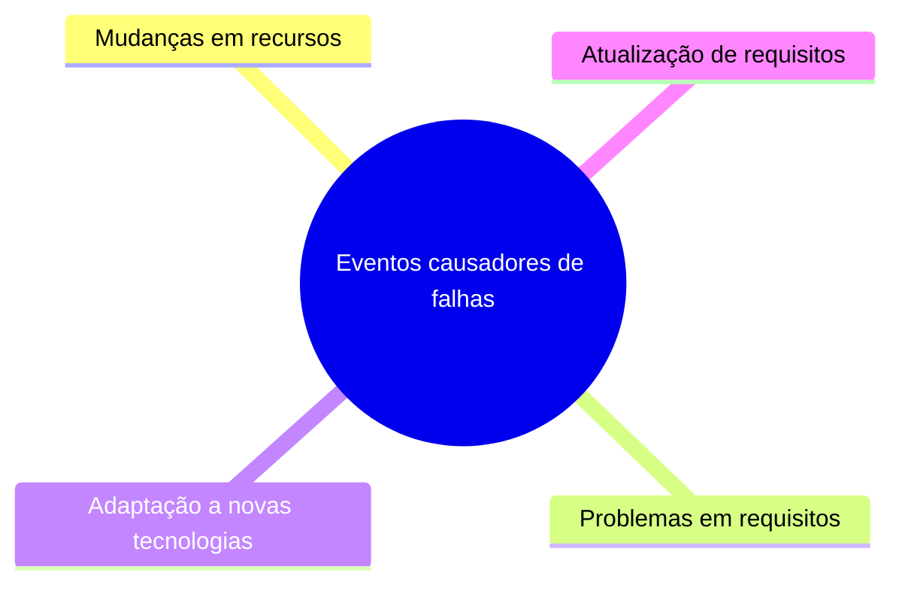

Exemplos: histórias ambíguas, alteração de regras de negócio, mudança de pessoas, hardware ou software e adoção de nova tecnologia.

## 4. Classificação de riscos

| Categoria | Exemplos |
|---|---|
| Projeto | cronograma, orçamento, equipe, recursos, cliente, requisitos |
| Técnico | design, implementação, integração, tecnologia, obsolescência |
| Negócio | estratégia, mercado, prioridade, apoio organizacional |

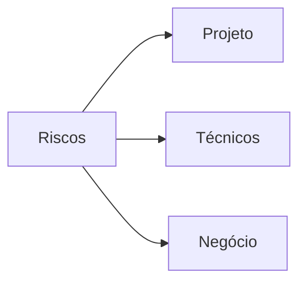

## 5. Probabilidade e impacto

`Exposição ao risco = Probabilidade × Impacto`

| Probabilidade \ Impacto | Baixo | Médio | Alto |
|---|---:|---:|---:|
| Baixa | observar | observar | planejar |
| Média | observar | mitigar | prioridade alta |
| Alta | mitigar | prioridade alta | prioridade crítica |

## 6. Processo de gerenciamento de riscos

O podcast apresenta cinco etapas:

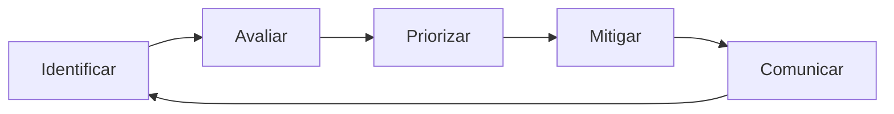

## 7. Atitude em relação ao risco

| Conceito | Significado |
|---|---|
| Apetite ao risco | incerteza que se está disposto a assumir |
| Tolerância ao risco | grau de exposição suportável |
| Limite de risco | fronteira entre aceitável e não aceitável |

## 8. Risk-Based Spike

Spike é um experimento de curta duração para reduzir incerteza por pesquisa, protótipo ou prova de conceito.

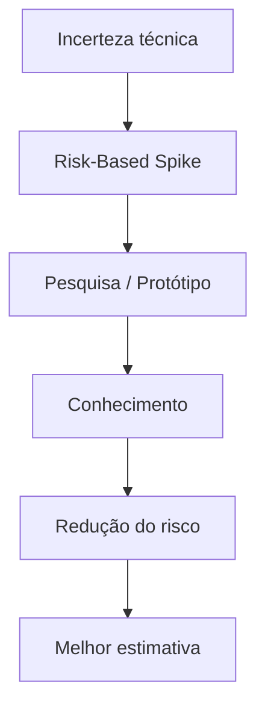

## 9. RMMM e ficha de risco

RMMM significa **Risk Mitigation, Monitoring and Management**.

Uma ficha pode registrar identificador, probabilidade, impacto, descrição, causas, mitigação, monitoramento, contingência, estado atual e responsável.

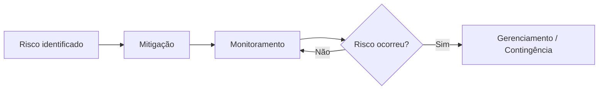

## 10. Custos de software

O custo não se limita ao salário da equipe. O material inclui instalações, recrutamento, suporte, redes, infraestrutura e benefícios.

## 11. COCOMO II

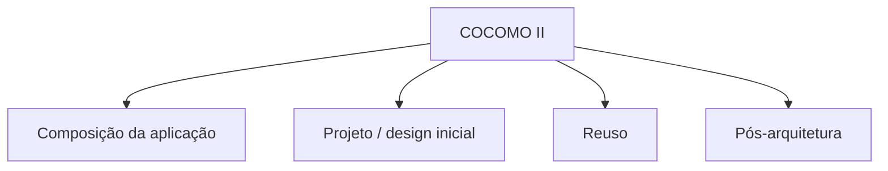

### 11.1 Composição da aplicação

`PM = (NAP × (1 - %reuso/100)) / PROD`

- PM: esforço em pessoa-mês.
- NAP: pontos de aplicação.
- %reuso: percentual reaproveitado.
- PROD: produtividade.

### 11.2 Projeto inicial

`PM = A × Tamanho^B × M`

O material usa **A = 2,94** como referência e relaciona B a fatores como precedência, flexibilidade, resolução de riscos, coesão da equipe e maturidade do processo.

Multiplicadores citados: PERS, PREX, RCPX, RUSE, PDIF, SCED e FSIL.

### 11.3 Reuso

Reuso de caixa-preta tende a exigir menos esforço de adaptação. Reuso de caixa-branca exige compreensão e modificação do código.

`ESLOC = ASLOC × (1 - AT/100) × AAM`

### 11.4 Pós-arquitetura

Utiliza informações mais detalhadas sobre tamanho, reuso, mudanças de requisitos, fatores de escala e direcionadores de custo.

Entre os principais drivers citados:

| Atributo | Significado |
|---|---|
| RELY | confiabilidade requerida |
| CPLX | complexidade |
| STOR | armazenamento |
| TOOL | ferramentas |
| SCED | cronograma |

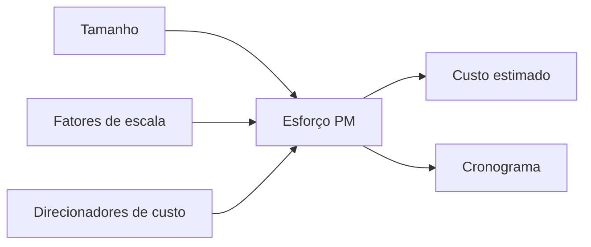

## 12. Equipe e prazo

Aumentar pessoas não reduz o prazo na mesma proporção, porque surgem custos de comunicação, integração, aprendizagem e coordenação.

## 13. Ágil e custo das mudanças

O material defende que, quando aplicado adequadamente, o ágil pode achatar a curva de custo das mudanças ao longo do ciclo de vida, graças a incrementos menores, testes contínuos, comunicação e refatoração.

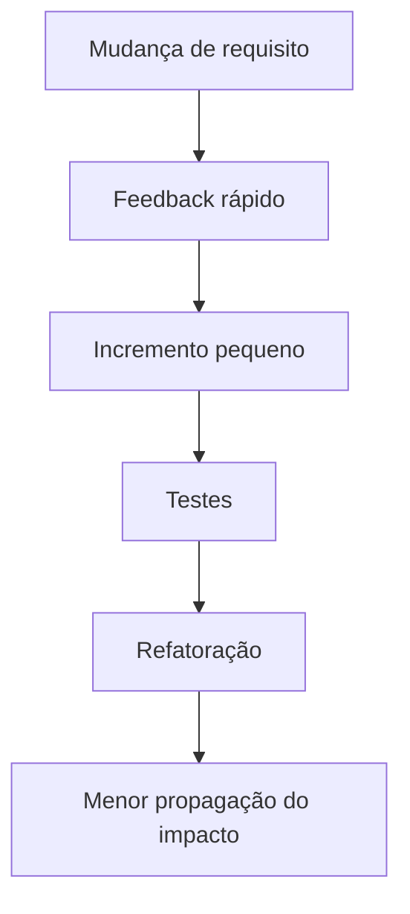

## 14. PMBOK e métodos ágeis

Em projetos grandes ou contratuais, o material admite a necessidade de mecanismos de planejamento, monitoramento, documentação e gestão formal de riscos.

```mermaid
flowchart LR
    I[Iniciação] --> P[Planejamento]
    P --> E[Execução]
    E --> M[Monitoramento e Controle]
    M --> C[Encerramento]
```

## 15. Resumo para revisão

| Conceito | Essência |
|---|---|
| Risco | evento incerto com impacto potencial |
| Exposição | probabilidade × impacto |
| RMMM | mitigação, monitoramento e gerenciamento |
| Spike | experimento para reduzir incerteza |
| COCOMO II | estimativa de esforço/custo |
| Composição da aplicação | pontos de aplicação e produtividade |
| Projeto inicial | tamanho, escala e multiplicadores |
| Reuso | esforço de adaptação |
| Pós-arquitetura | refinamento com mais informações |
| Mais pessoas | não significam prazo proporcionalmente menor |

**Síntese:** risco altera esforço; esforço altera custo; decisões de escopo e arquitetura influenciam ambos.

---

# Tema 03 — Gestão da qualidade

## 1. Objetivos

- Compreender a gestão da qualidade em software.
- Identificar fatores que sustentam a melhoria de processo.
- Conhecer SPI, IDEAL e CMMI no contexto do material.
- Reconhecer riscos de implantação de programas de qualidade.
- Compreender os fatores de qualidade de McCall.
- Relacionar garantia, controle, métricas e melhoria contínua.

## 2. Qualidade como parte do processo

Qualidade acompanha negócio, requisitos, histórias, construção, testes, entrega e manutenção.

```mermaid
flowchart TD
    Q[Gestão da Qualidade]
    Q --> P[Pessoas]
    Q --> M[Procedimentos e métodos]
    Q --> F[Ferramentas e equipamentos]
```

## 3. Qualidade e engenharia de software

```mermaid
flowchart BT
    Q[Foco na qualidade]
    P[Processo]
    M[Métodos]
    F[Ferramentas]
    Q --> P
    P --> M
    M --> F
```

## 4. SPI — Software Process Improvement

O material usa o seguinte ciclo:

```mermaid
flowchart LR
    A[Reconheça] --> B[Qualifique]
    B --> C[Escolha o modelo]
    C --> D[Instancie o modelo]
    D --> E[Mensure]
    E --> A
```

### Reconheça

Entender o processo atual: comunicação, requisitos, escopo, estimativas, cronograma, riscos, mudanças, garantia e revisões.

### Qualifique

Capacitar pessoas em engenharia de software, ferramentas, comunicação e qualidade.

### Escolha o modelo

Definir atividades, artefatos, verificações e abordagem de melhoria.

### Instancie o modelo

Implantar gradualmente, permitindo adaptação cultural e tecnológica.

### Mensure

Medir adoção, efeitos no software, benefícios de processo e evolução da cultura.

## 5. IDEAL

```mermaid
flowchart LR
    I[Iniciar] --> D[Diagnosticar]
    D --> E[Estabelecer]
    E --> A[Agir]
    A --> L[Aprender]
    L --> I
```

## 6. Riscos de implantação do SPI

O material cita falta de apoio gerencial, resistência cultural, estratégia mal planejada, formalismo excessivo, treinamento insuficiente, instabilidade organizacional e pouca experiência com qualidade.

```mermaid
flowchart TD
    A[Implantação de SPI] --> B{Há apoio e preparo?}
    B -- Não --> C[Resistência e formalismo]
    C --> D[Alto risco de fracasso]
    B -- Sim --> E[Implantação gradual]
    E --> F[Medição e feedback]
    F --> G[Melhoria contínua]
```

## 7. CMMI no material

A leitura digital descreve níveis de capacidade:

| Nível | Interpretação |
|---|---|
| Incompleto | não atinge todas as metas |
| Executado | realiza tarefas e produz artefatos |
| Controlado | opera sob políticas, acompanhamento e controle |
| Definido | usa processo padronizado e adaptado |
| Controlado quantitativamente | utiliza medição e objetivos quantitativos |

Os slides também usam uma visão evolutiva simplificada:

```mermaid
flowchart BT
    A[Gerenciamento básico de projeto] --> B[Definição e padronização de processo]
    B --> C[Gerenciamento quantitativo]
    C --> D[Melhoria e inovação organizacional]
```

## 8. Fatores de qualidade de McCall

```mermaid
flowchart TD
    Q[Qualidade do software]
    Q --> R[Revisão]
    Q --> T[Transição]
    Q --> O[Operação]
    R --> R1[Manutenibilidade]
    R --> R2[Flexibilidade]
    R --> R3[Testabilidade]
    T --> T1[Portabilidade]
    T --> T2[Reusabilidade]
    T --> T3[Interoperabilidade]
    O --> O1[Usabilidade]
    O --> O2[Correção]
    O --> O3[Eficiência]
    O --> O4[Confiabilidade]
    O --> O5[Integridade]
```

### Revisão

- Manutenibilidade.
- Flexibilidade.
- Testabilidade.

### Transição

- Portabilidade.
- Reusabilidade.
- Interoperabilidade.

### Operação

- Usabilidade.
- Correção.
- Eficiência.
- Confiabilidade.
- Integridade.

## 9. Exemplos do podcast

| Situação | Atributo afetado |
|---|---|
| sistemas integrados trocam informações incorretamente | interoperabilidade |
| alta carga torna resposta muito lenta | confiabilidade / recuperação |
| campo de data acusa erro precocemente | usabilidade |
| sistema não valida sequência operacional | eficiência |
| ajuste em um módulo quebra outro | manutenibilidade |
| interface quebra em outro dispositivo | portabilidade |

## 10. Garantia e controle da qualidade

```mermaid
flowchart LR
    A[Definir critérios de qualidade] --> B[Garantia da Qualidade]
    B --> C[Desenvolver]
    C --> D[Verificar / Testar]
    D --> E[Controle da Qualidade]
    E --> F[Registrar desvios]
    F --> G[Corrigir / melhorar]
    G --> A
```

Garantia atua preventivamente; controle verifica o produto e registra desvios.

## 11. Métricas de qualidade

Podem acompanhar função, dados, comportamento, defeitos, desempenho, confiabilidade, usabilidade e esforço de manutenção. Uma métrica só agrega valor quando apoia decisão e melhoria.

## 12. Equilíbrio entre escopo, recursos, tempo e qualidade

```mermaid
flowchart TD
    E[Escopo] --> Q[Qualidade]
    R[Recursos] --> Q
    T[Tempo] --> Q
```

Cumprir prazo sacrificando testes ou engenharia pode comprometer a qualidade do produto e do processo.

## 13. Resumo para revisão

| Conceito | Essência |
|---|---|
| Qualidade | preocupação transversal ao ciclo |
| SPI | melhoria sistemática do processo |
| IDEAL | iniciar, diagnosticar, estabelecer, agir e aprender |
| CMMI | referência de capacidade/maturidade |
| Revisão | manutenibilidade, flexibilidade, testabilidade |
| Transição | portabilidade, reusabilidade, interoperabilidade |
| Operação | usabilidade, correção, eficiência, confiabilidade, integridade |
| Garantia | prevenção |
| Controle | verificação e tratamento de desvios |
| Métricas | apoio à decisão e melhoria |

**Síntese:** qualidade não é uma fase; é uma disciplina de gestão aplicada continuamente ao produto, processo e pessoas.

---

# Tema 04 — Administração da manutenção do software

## 1. Objetivos

- Compreender a manutenção como parte do ciclo de vida do software.
- Diferenciar manutenção corretiva, preventiva, adaptativa e perfectiva.
- Relacionar manutenção com qualidade e manutenibilidade.
- Compreender o papel da refatoração.
- Entender o gerenciamento de configuração de software.
- Reconhecer os papéis de gestor, engenheiro, gerente de configuração e cliente.
- Diferenciar erro, defeito e falha.

## 2. Manutenção como evolução

Software precisa evoluir para permanecer útil.

```mermaid
flowchart LR
    A[Concepção] --> B[Desenvolvimento]
    B --> C[Implantação]
    C --> D[Operação]
    D --> E[Manutenção e evolução]
    E --> D
    E --> F[Desativação / substituição]
```

## 3. Qualidade na manutenção

### Funcional

- corretude;
- consistência;
- confiabilidade;
- usabilidade.

### Não funcional

- desempenho;
- manutenibilidade;
- segurança.

```mermaid
flowchart TD
    Q[Qualidade na manutenção]
    Q --> F[Funcional]
    Q --> N[Não funcional]
    F --> C[Corretude]
    F --> CO[Consistência]
    F --> CF[Confiabilidade]
    F --> U[Usabilidade]
    N --> D[Desempenho]
    N --> M[Manutenibilidade]
    N --> S[Segurança]
```

## 4. Corretude, consistência, confiabilidade e usabilidade

- **Corretude:** após a mudança, o sistema continua atendendo aos requisitos.
- **Consistência:** componentes e implementação permanecem coerentes entre si e com os requisitos.
- **Confiabilidade:** resultados permanecem previsíveis ao longo do tempo.
- **Usabilidade:** a mudança não deteriora a facilidade de uso.

Testes automatizados e de regressão são importantes para preservar esses fatores.

## 5. Desempenho e segurança

Desempenho pode ser afetado por aplicação, banco, infraestrutura, integrações e configuração. Indicadores ajudam a decidir por otimização ou redesign.

Segurança exige manutenção contínua para acompanhar novas ameaças, tecnologias e necessidades de controle de acesso e integridade.

## 6. Manutenibilidade e refatoração

Manutenibilidade é a facilidade de analisar, modificar e testar.

```mermaid
flowchart LR
    A[Analisar] --> B[Modificar]
    B --> C[Testar]
    C --> D[Entregar]
```

Refatoração é apresentada como prática preventiva para reduzir complexidade e eliminar problemas estruturais, como métodos duplicados e condicionais extensas.

## 7. Tipos de manutenção

```mermaid
flowchart TD
    M[Manutenção]
    M --> C[Correção]
    M --> E[Evolução]
    C --> CC[Corretiva]
    C --> CP[Preventiva]
    E --> EA[Adaptativa]
    E --> EP[Perfectiva]
```

### Corretiva

Ocorre depois de uma falha já percebida. É reativa.

### Preventiva

Busca impedir falhas futuras. É proativa.

### Adaptativa

Ajusta o sistema a um novo ambiente, como servidor ou sistema operacional.

### Perfectiva

Melhora funcionalidade, usabilidade, desempenho ou manutenibilidade.

## 8. Indicadores de esforço de manutenção

Os slides apresentam um exemplo de distribuição:

- correção: 24%;
- adaptação: 19%;
- melhoria: 57%.

```mermaid
pie showData
    title Exemplo do material — esforço de manutenção
    "Correção" : 24
    "Adaptação" : 19
    "Melhoria" : 57
```

O objetivo é medir tendências para melhorar priorização e alocação de recursos.

## 9. SCM — Software Configuration Management

SCM controla os itens de configuração do software — SCI.

```mermaid
flowchart TD
    R[Repositório SCM]
    A[Área de trabalho A]
    B[Área de trabalho B]
    R -->|check-out| A
    R -->|check-out| B
    A -->|check-in| R
    B -->|check-in| R
    R --> M[Merge / nova versão]
```

## 10. Papéis no processo de manutenção

### Gestor

Acompanha progresso, coordena problemas, apoia integração, comunicação e recursos e audita o processo.

### Gerente de configuração

Garante políticas e procedimentos, controla autorizações, movimentações e rastreabilidade.

### Engenheiro de software

Produz artefatos consistentes, executa mudanças, realiza check-in e resolve conflitos de integração.

### Cliente

Participa da definição, priorização e validação.

```mermaid
flowchart TD
    V[Versão de software]
    G[Gestor] --> V
    E[Engenheiro de software] --> V
    C[Gerente de configuração] --> V
    U[Cliente] --> V
```

## 11. Check-out, check-in e merge

```mermaid
sequenceDiagram
    participant DevA as Desenvolvedor A
    participant Repo as Repositório SCM
    participant DevB as Desenvolvedor B
    DevA->>Repo: Check-out
    DevB->>Repo: Check-out
    DevA->>DevA: Alteração local
    DevB->>DevB: Alteração local
    DevA->>Repo: Check-in
    DevB->>Repo: Check-in
    Repo->>Repo: Detectar conflito / merge
    Repo-->>DevA: Nova versão integrada
    Repo-->>DevB: Nova versão integrada
```

## 12. Build diário e integração

```mermaid
flowchart LR
    D1[Alterações do dia] --> B1[Build diário]
    B1 --> T[Testes de integração]
    T --> R[Correções]
    R --> B2[Novo build]
    B2 --> V[Versão de entrega]
```

Builds frequentes reduzem acúmulo de conflitos e ajudam a manter uma versão estável.

## 13. Compreensão do programa antes da mudança

```mermaid
flowchart TD
    A[Entender solicitação] --> B{É a mesma equipe?}
    B -- Sim --> D[Atualizar documentação]
    B -- Não --> C[Reconhecer software atual]
    C --> D
    D --> E[Analisar impacto]
    E --> F[Implementar manutenção]
    F --> G[Testar e validar]
```

Quando outra equipe realiza a manutenção, o esforço de compreensão aumenta.

## 14. Erro, defeito e falha

```mermaid
flowchart LR
    E[Erro humano] --> D[Defeito no software]
    D --> F[Falha percebida em execução]
```

- **Erro:** ação humana incorreta.
- **Defeito:** problema incorporado ao software.
- **Falha:** comportamento incorreto observado em execução.

Regra de memorização: **erro cria o defeito; o defeito pode provocar a falha.**

## 15. Fluxo prático de manutenção

```mermaid
flowchart TD
    A[Solicitação] --> B[Classificar]
    B --> C[Analisar impacto]
    C --> D[Priorizar]
    D --> E[Planejar]
    E --> F[Modificar]
    F --> G[Testar]
    G --> H[Integrar]
    H --> I[Versionar]
    I --> J[Validar com cliente]
    J --> K[Monitorar]
```

## 16. Resumo para revisão

| Conceito | Essência |
|---|---|
| Manutenção | evolução do software em operação |
| Corretiva | corrige falha existente |
| Preventiva | reduz risco de falha futura |
| Adaptativa | adapta a novo ambiente |
| Perfectiva | melhora funcionalidade, desempenho ou manutenibilidade |
| Manutenibilidade | facilidade de analisar, modificar e testar |
| Refatoração | melhora estrutura sem alterar comportamento externo |
| SCM | controle de configuração e versões |
| SCI | item de configuração de software |
| Check-out | obtém item para trabalho |
| Check-in | devolve alteração ao repositório |
| Merge | combina alterações |
| Build diário | integração frequente |
| Erro | ação humana incorreta |
| Defeito | problema incorporado ao software |
| Falha | comportamento incorreto em execução |

**Síntese:** manutenção não é apenas correção de bugs; inclui adaptação, melhoria, prevenção, controle de configuração e preservação da qualidade durante a vida útil do software.

---

# Referências principais do material-base

- HISATOMI, Marco Ikuro. *Gerenciamento Ágil dos Sistemas*. 2020.
- PRESSMAN, Roger S. *Engenharia de Software: uma abordagem profissional*. 2016.
- SOMMERVILLE, Ian. *Engenharia de Software*. 2018.
- MASSARI, Vitor L. *Gestão Ágil de Produtos com Agile Think Business Framework*. 2018.
- CMMI Product Team. *CMMI for Development*. 2010.
- SEI. *The IDEAL Model*.
- ABNT. *ISO 31000 — Gestão de riscos — Diretrizes*. 2018.
- ISO/IEC 14764. *Software Engineering — Software Life Cycle Processes — Maintenance*. 2006.
- ISO/IEC 25000. *Systems and software Quality Requirements and Evaluation — SQuaRE*. 2014.
- TAENTZER, G. et al. *Managed Software Evolution*. 2019.
