# Tema 01 - Qualidade de Software: fundamentos e conformidade de requisitos

> Disciplina: **Qualidade de Software com Clean Code e Técnicas de Usabilidade**  
> Objetivo deste documento: consolidar o conteúdo do Tema 01 em formato de consulta para GitHub, com explicações didáticas, modelos de documentação e diagramas Mermaid equivalentes às figuras principais do material.

---

## 1. Objetivos do tema

Ao final deste tema, você deve ser capaz de:

- Explicar o que é qualidade de software e por que ela depende de escopo, tempo e custos.
- Diferenciar **erro**, **defeito** e **falha**.
- Reconhecer padrões e modelos relacionados à qualidade de software, como ISO, CMMI e MPS.BR.
- Diferenciar **requisitos funcionais** de **requisitos não funcionais**.
- Aplicar técnicas básicas de levantamento e documentação de requisitos.
- Relacionar requisitos bem definidos com **Clean Code**, **usabilidade**, testes e manutenção.

---

## 2. Visão geral do Tema 01

A qualidade de software não se resume a “o sistema funcionar”. Um software de qualidade precisa atender às necessidades do usuário, ser confiável, manutenível, eficiente, usável e compatível com as restrições do projeto.

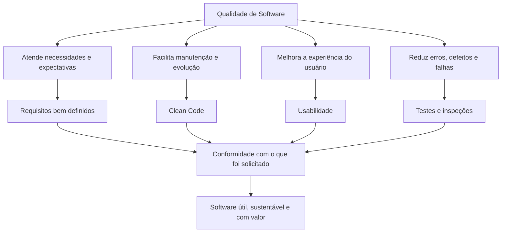

---

## 3. Conceito de qualidade de software

Qualidade é um conceito parcialmente subjetivo: um produto pode ser considerado excelente por um usuário e inadequado por outro. Em software, essa subjetividade aparece quando um sistema é tecnicamente robusto, mas não resolve bem a necessidade real do usuário, ou quando possui muitas funcionalidades, mas se torna caro, difícil de usar ou difícil de manter.

No contexto de software, qualidade pode ser entendida como a capacidade de entregar um produto que:

- resolve o problema proposto;
- atende aos requisitos levantados;
- respeita prazo e orçamento;
- apresenta baixo índice de erros;
- é fácil de usar;
- é fácil de manter;
- gera valor para cliente, usuário e empresa desenvolvedora.

### 3.1 Aspectos principais da qualidade

| Aspecto | Significado prático |
|---|---|
| Funcionalidade | O sistema faz o que deve fazer. |
| Usabilidade | O usuário consegue usar o sistema com facilidade. |
| Eficiência | O sistema responde em tempo adequado e usa bem os recursos. |
| Manutenibilidade | O sistema pode ser corrigido e evoluído com menor esforço. |
| Portabilidade | O sistema consegue operar em diferentes ambientes quando necessário. |
| Confiabilidade | O sistema executa suas funções com estabilidade e previsibilidade. |
| Segurança | O sistema protege dados, acessos e operações críticas. |

---

## 4. Restrição tripla: escopo, tempo e custos

O material apresenta a qualidade relacionada ao equilíbrio entre três restrições: **escopo**, **tempo** e **custos**. A qualidade é comprometida quando uma dessas dimensões muda sem replanejamento das demais.

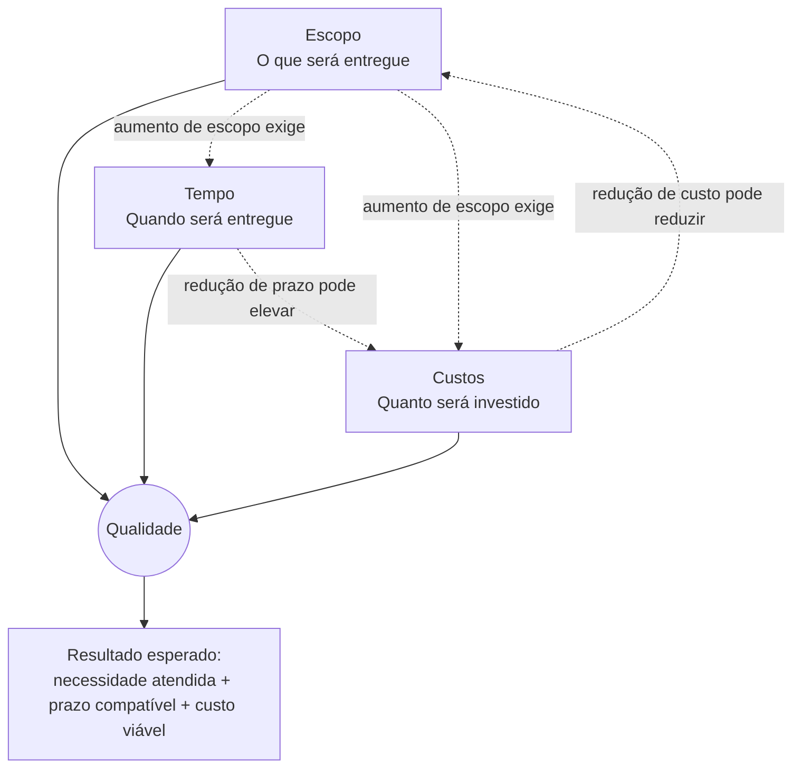

### Interpretação

Se o cliente aumenta o escopo, a equipe precisa reavaliar prazo e custo. Se o prazo é reduzido, normalmente há impacto em custo, equipe, risco ou escopo. Se o custo precisa cair, o escopo ou a estratégia de entrega provavelmente precisam ser revistos.

---

## 5. Crise do software

A chamada **Crise do Software** está relacionada ao crescimento da complexidade dos sistemas e à dificuldade de construí-los, implantá-los e mantê-los com qualidade. Os problemas clássicos citados no material incluem:

- sistemas sem planejamento adequado;
- cronogramas e orçamentos extrapolados;
- documentação insuficiente;
- baixa testabilidade;
- manutenção difícil;
- falhas com impacto financeiro ou até risco à vida humana.

Esse cenário reforça a importância da Engenharia de Software, que busca aplicar métodos, processos, padrões e técnicas para construir software com qualidade desde a concepção até a operação.

### 5.1 Problemas recorrentes no desenvolvimento de software

Diagrama Mermaid equivalente ao gráfico de problemas apresentado no material:

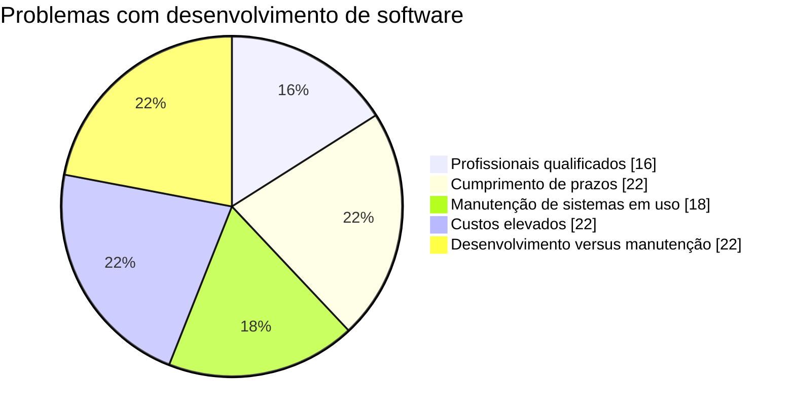

---

## 6. Erro, defeito e falha

Um ponto essencial do Tema 01 é diferenciar **erro**, **defeito** e **falha**.

| Conceito | Definição didática | Exemplo |
|---|---|---|
| Erro | Ação humana incorreta que pode gerar um problema. | Analista interpreta mal uma regra; programador trata uma data de forma incorreta. |
| Defeito | Imperfeição no artefato produzido, como código, documentação, modelo ou teste. | Validação ausente, regra implementada de forma errada, documentação desatualizada. |
| Falha | Comportamento incorreto percebido durante a execução do sistema. | Sistema trava, retorna saldo incorreto ou permite operação inválida. |

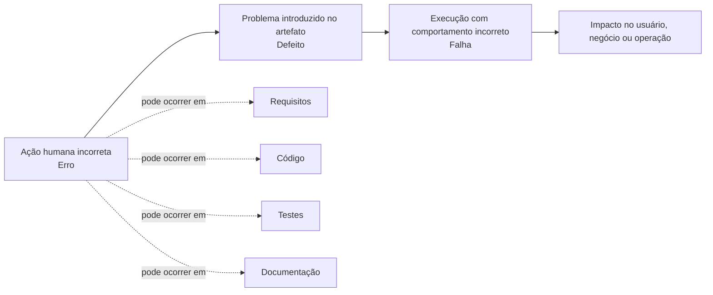

### Exemplo prático

Imagine que o requisito de saque em caixa eletrônico diz: “o usuário não pode sacar valor maior que o saldo disponível”.

1. **Erro:** o analista esquece de registrar essa regra no requisito.
2. **Defeito:** o desenvolvedor implementa o saque sem validar saldo.
3. **Falha:** em execução, o usuário consegue sacar valor maior que o saldo.

---

## 7. Padrões de qualidade de software

O material destaca que normas e modelos ajudam a padronizar processos, critérios, avaliações e práticas de qualidade. Eles não substituem o entendimento do negócio, mas fornecem referência para desenvolvimento, avaliação e melhoria contínua.

### 7.1 Exemplos de normas e modelos citados

| Norma/modelo | Finalidade principal |
|---|---|
| ISO 12207 | Processo de ciclo de vida de software. |
| ISO/IEC 12119 | Requisitos de qualidade e testes para pacotes de software. |
| ISO/IEC 14598 | Avaliação de qualidade de produto de software. |
| ISO/IEC 9126 | Modelo de qualidade de software. |
| ISO/IEC 25000 | Evolução de modelos de qualidade de produto de software. |
| ISO/IEC 9241 | Ergonomia e usabilidade. |
| ISO/IEC 20926 | Medição de software por pontos de função. |
| ISO 9001 | Sistema de gestão da qualidade. |
| CMMI | Modelo de maturidade para melhoria de processos. |
| MPS.BR | Modelo brasileiro de melhoria de processo de software e serviços. |

### 7.2 Visão Mermaid dos padrões

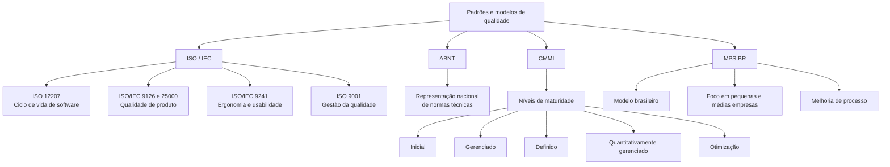

### 7.3 Níveis de maturidade MPS.BR

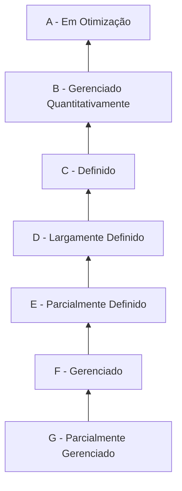

---

## 8. Requisitos de software

Requisitos descrevem as propriedades, funcionalidades, restrições e qualidades que o sistema deve apresentar quando estiver pronto. Eles expressam necessidades dos usuários, objetivos de negócio e limitações que devem orientar o desenvolvimento.

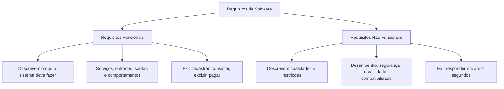

---

## 9. Requisitos funcionais

Requisitos funcionais descrevem as **funcionalidades** que o sistema deve disponibilizar. Eles respondem à pergunta:

> O que o sistema deve fazer?

Exemplos:

- RF001: o sistema deve permitir cadastro de clientes.
- RF002: o sistema deve permitir consulta de saldo.
- RF003: o sistema deve permitir emissão de extrato.
- RF004: o sistema deve permitir exclusão de cliente, desde que não existam pendências.
- RF005: o sistema deve permitir pagamento por cartão de débito e crédito.

### Boas práticas para escrever RF

- Usar linguagem clara e objetiva.
- Evitar detalhes técnicos desnecessários.
- Indicar ator, ação e objetivo.
- Definir entrada, saída e restrições relevantes.
- Criar critérios de aceitação testáveis.
- Evitar ambiguidades como “rápido”, “fácil”, “adequado”, sem métrica.

---

## 10. Requisitos não funcionais

Requisitos não funcionais descrevem **qualidades**, **restrições** e **condições de operação** do sistema. Eles respondem à pergunta:

> Como o sistema deve se comportar ou sob quais condições deve operar?

Exemplos:

- RNF001: o tempo de resposta das consultas não deve ultrapassar 2 segundos em 95% das requisições.
- RNF002: o sistema deve ser compatível com Chrome, Edge e Firefox nas versões suportadas pela organização.
- RNF003: as senhas devem ser armazenadas com algoritmo de hash seguro.
- RNF004: o sistema deve registrar logs de auditoria para operações financeiras.
- RNF005: o sistema deve estar disponível 99,5% do tempo durante o horário comercial.

### Categorias comuns de RNF

| Categoria | Exemplo de métrica |
|---|---|
| Desempenho | Tempo de resposta, transações por segundo, tempo de atualização de tela. |
| Tamanho | Kbytes, Mbytes, Gbytes, limite de armazenamento. |
| Facilidade de uso | Tempo de treinamento, número de telas de ajuda, taxa de conclusão de tarefa. |
| Confiabilidade | Tempo médio para falhar, probabilidade de indisponibilidade, taxa de falhas. |
| Interface | Navegadores, dispositivos, padrões visuais, acessibilidade. |
| Hardware/software | Sistemas operacionais, banco de dados, infraestrutura mínima. |
| Aspectos legais | Leis, decretos, normas e políticas aplicáveis. |
| Segurança | Criptografia, autenticação, autorização, certificação digital, auditoria. |

---

## 11. Requisitos, Clean Code e usabilidade

Requisitos bem definidos reduzem ambiguidades. Clean Code ajuda a implementar esses requisitos de forma clara e sustentável. Usabilidade garante que o sistema, além de funcionar, seja compreensível e eficiente para o usuário.

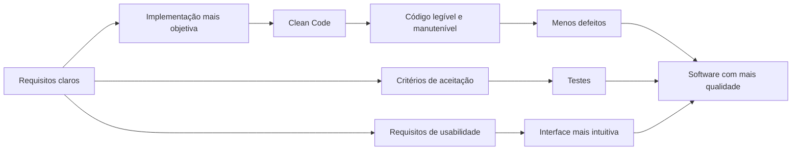

---

## 12. Documentação de requisitos

Não existe um modelo único e obrigatório para documentar requisitos. O importante é que o documento seja claro, rastreável, útil para comunicação com stakeholders e suficiente para orientar implementação e testes.

### 12.1 Estrutura recomendada para um documento SRS

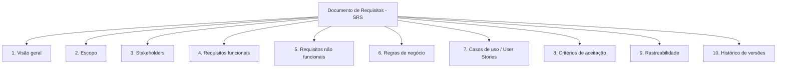

### 12.2 Modelo de histórico do documento

| Versão | Data | Autor | Descrição da alteração |
|---|---:|---|---|
| 1.0 | AAAA-MM-DD | Nome do responsável | Criação inicial do documento. |
| 1.1 | AAAA-MM-DD | Nome do responsável | Ajustes após validação com stakeholders. |

### 12.3 Modelo para requisito funcional

| Campo | Descrição |
|---|---|
| Código | RF001, RF002, RF003... |
| Nome | Nome curto e objetivo do requisito. |
| Descrição | O que o sistema deve fazer. |
| Ator principal | Quem inicia ou utiliza a funcionalidade. |
| Entradas | Dados necessários para executar a funcionalidade. |
| Saídas | Resultado esperado da funcionalidade. |
| Regras de negócio | Condições específicas aplicáveis. |
| Prioridade | Essencial, importante ou desejável. |
| Critérios de aceitação | Condições verificáveis para considerar o requisito atendido. |
| Dependências | Outros requisitos, serviços ou regras relacionados. |
| Status | Proposto, aprovado, implementado, testado, alterado. |

### 12.4 Modelo para requisito não funcional

| Campo | Descrição |
|---|---|
| Código | RNF001, RNF002, RNF003... |
| Categoria | Desempenho, segurança, usabilidade, disponibilidade etc. |
| Descrição | Qualidade, restrição ou condição esperada. |
| Métrica | Forma objetiva de medir o requisito. |
| Critério de aceitação | Resultado mínimo esperado. |
| Prioridade | Essencial, importante ou desejável. |
| Evidência de teste | Como comprovar que foi atendido. |
| Status | Proposto, aprovado, implementado, testado, alterado. |

---

## 13. Formatos comuns de documentação

| Formato | Quando usar | Vantagem |
|---|---|---|
| SRS - Software Requirements Specification | Projetos formais ou com maior necessidade de rastreabilidade. | Documento completo e detalhado. |
| Casos de uso | Quando é importante representar interações entre atores e sistema. | Facilita entendimento dos cenários. |
| User Stories | Ambientes ágeis, Scrum, XP ou desenvolvimento incremental. | Linguagem simples e centrada no usuário. |
| Protótipos | Quando a interface ou fluxo ainda precisa ser validado. | Reduz ambiguidades de usabilidade. |
| Matriz de rastreabilidade | Quando é necessário ligar requisitos a código, testes e entregas. | Ajuda a controlar conformidade. |

### 13.1 User Story: padrão recomendado

```text
Como [tipo de usuário],
quero [funcionalidade ou ação],
para [benefício ou objetivo de negócio].
```

Exemplo:

```text
Como cliente de um caixa eletrônico,
quero consultar meu saldo,
para saber se tenho valor disponível antes de realizar um saque.
```

### 13.2 Critérios de aceitação

```text
Dado que o cliente está autenticado,
quando selecionar a opção Consultar Saldo,
então o sistema deve exibir o saldo disponível da conta selecionada.
```

---

## 14. Técnicas de levantamento de requisitos

O levantamento de requisitos deve combinar técnicas de acordo com o contexto do projeto, disponibilidade dos stakeholders, maturidade do problema e nível de conhecimento prévio da organização.

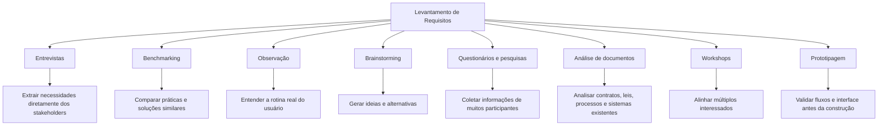

### 14.1 Comparativo das técnicas

| Técnica | Melhor uso | Cuidado necessário |
|---|---|---|
| Entrevista | Início do projeto, entendimento de dores e objetivos. | Evitar perguntas vagas e registrar decisões. |
| Benchmarking | Comparar soluções, práticas e concorrentes. | Não copiar sem adaptar ao contexto. |
| Observação | Entender rotina real e exceções do processo. | Observar sem interferir indevidamente. |
| Brainstorming | Explorar ideias e alternativas. | Separar geração de ideias da priorização. |
| Questionários | Coletar dados de grupos maiores ou distantes. | Perguntas precisam ser claras e objetivas. |
| Análise documental | Projetos com normas, contratos, leis ou sistemas legados. | Validar se documentos estão atualizados. |
| Prototipagem | Validar interface, fluxo e usabilidade. | Não confundir protótipo com sistema final. |
| Workshop | Alinhar áreas diferentes e resolver conflitos. | Precisa de facilitação e pauta objetiva. |

---

## 15. Fluxo recomendado de requisitos até testes

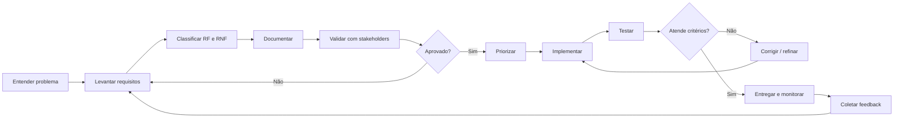

---

## 16. Diagrama de caso de uso - exemplo do material

O material utiliza exemplos de casos de uso para demonstrar como requisitos funcionais podem ser representados. Abaixo está uma versão Mermaid para o cenário de caixa eletrônico com cliente realizando consulta de saldo, solicitação de extrato e saque.

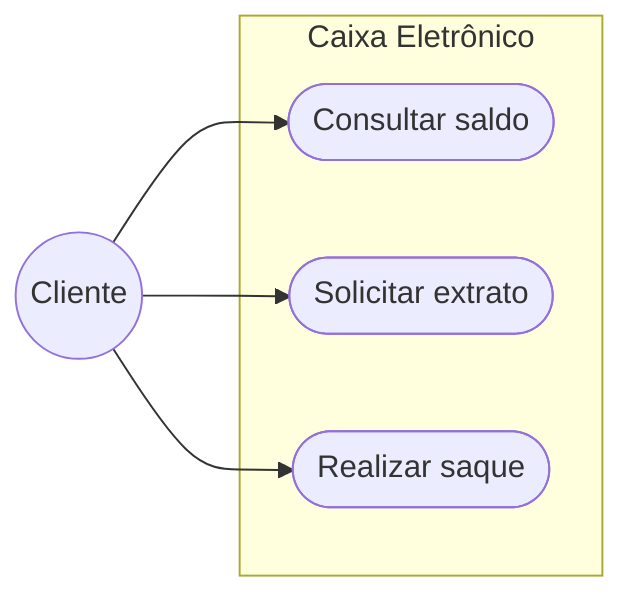

---

## 17. Exemplo prático: documentação de requisitos para caixa eletrônico

### 17.1 Contexto

Sistema de caixa eletrônico que permite ao cliente consultar saldo, solicitar extrato e realizar saque em dinheiro.

### 17.2 Requisitos funcionais

| Código | Nome | Descrição | Critério de aceitação |
|---|---|---|---|
| RF001 | Autenticar cliente | O sistema deve autenticar o cliente por cartão e senha antes de permitir operações. | Dado cartão e senha válidos, o sistema deve liberar o menu principal. |
| RF002 | Consultar saldo | O sistema deve permitir que o cliente consulte o saldo da conta selecionada. | Dado cliente autenticado, ao selecionar Consultar Saldo, o sistema exibe o saldo disponível. |
| RF003 | Solicitar extrato | O sistema deve permitir que o cliente solicite extrato com últimas movimentações. | Dado cliente autenticado, ao selecionar Extrato, o sistema exibe ou imprime as movimentações. |
| RF004 | Realizar saque | O sistema deve permitir saque quando houver saldo e cédulas disponíveis. | Dado valor válido e saldo suficiente, o sistema libera o dinheiro e registra a transação. |
| RF005 | Encerrar sessão | O sistema deve permitir encerramento seguro da sessão. | Ao finalizar operação, o sistema encerra a sessão e retorna ao estado inicial. |

### 17.3 Requisitos não funcionais

| Código | Categoria | Descrição | Métrica / critério de aceitação |
|---|---|---|---|
| RNF001 | Desempenho | Consultas de saldo e extrato devem responder rapidamente. | 95% das consultas devem responder em até 2 segundos. |
| RNF002 | Segurança | A senha não deve ser exibida em texto claro. | O campo de senha deve mascarar a entrada e não registrar senha em log. |
| RNF003 | Segurança | O sistema deve bloquear tentativas inválidas sucessivas. | Após 3 tentativas inválidas, bloquear operação conforme política do banco. |
| RNF004 | Confiabilidade | Transações financeiras devem ser registradas com integridade. | Toda transação deve gerar registro de auditoria com data, hora e identificador. |
| RNF005 | Usabilidade | O menu deve ser simples e compreensível. | Usuário deve conseguir localizar as 3 operações principais no menu inicial. |
| RNF006 | Disponibilidade | O sistema deve operar durante o horário definido pelo banco. | Disponibilidade mínima definida em SLA operacional. |

### 17.4 Rastreabilidade mínima

| Requisito | Caso de uso | Teste relacionado |
|---|---|---|
| RF001 | Autenticar cliente | CT001 - Login com credenciais válidas; CT002 - senha inválida. |
| RF002 | Consultar saldo | CT003 - Consulta de saldo com conta ativa. |
| RF003 | Solicitar extrato | CT004 - Emissão de extrato com movimentações. |
| RF004 | Realizar saque | CT005 - Saque com saldo suficiente; CT006 - saque sem saldo. |
| RNF001 | Operações principais | CT007 - Teste de tempo de resposta. |
| RNF002/RNF003 | Autenticação | CT008 - Segurança de senha e bloqueio. |

---

## 18. Checklist de qualidade para requisitos

Use este checklist antes de considerar um requisito pronto para implementação.

| Pergunta | Sim/Não |
|---|---|
| O requisito está escrito em linguagem clara? |  |
| O requisito possui código único? |  |
| A descrição evita ambiguidade? |  |
| O requisito possui prioridade? |  |
| O requisito possui critério de aceitação? |  |
| O requisito é testável? |  |
| O requisito foi validado com stakeholders? |  |
| O requisito possui dependências registradas? |  |
| O requisito está classificado corretamente como RF ou RNF? |  |
| Existe rastreabilidade entre requisito, implementação e teste? |  |

---

## 19. Aplicação prática no desenvolvimento

Para garantir conformidade com requisitos e qualidade, a equipe deve adotar um processo mínimo:

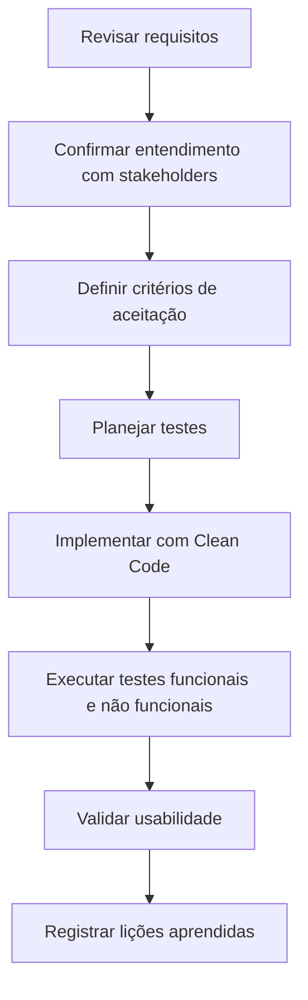

### Ações recomendadas para um MVP com falhas

Caso um MVP apresente funcionalidades incompletas, baixa performance e problemas de usabilidade, as ações recomendadas são:

1. Revisar a documentação de requisitos.
2. Revalidar prioridades com stakeholders.
3. Separar problemas em RF, RNF, defeitos e melhorias de usabilidade.
4. Definir critérios de aceitação objetivos.
5. Refatorar trechos críticos com Clean Code.
6. Criar testes para funcionalidades principais.
7. Medir desempenho com métricas claras.
8. Aplicar testes de usabilidade e coletar feedback.
9. Planejar nova entrega com escopo controlado.
10. Registrar lições aprendidas para próximos ciclos.

---

## 20. Resumo para prova

- Qualidade de software envolve atender necessidades explícitas e implícitas dentro de escopo, tempo e custo compatíveis.
- A Crise do Software demonstrou a necessidade de processos, padrões, documentação e Engenharia de Software.
- Erro é ação humana incorreta; defeito é imperfeição no artefato; falha é comportamento incorreto em execução.
- Requisitos funcionais descrevem o que o sistema deve fazer.
- Requisitos não funcionais descrevem restrições e atributos de qualidade.
- Requisitos bem documentados servem como base para desenvolvimento, testes, usabilidade e manutenção.
- Clean Code contribui para código mais legível, sustentável e aderente aos requisitos.
- Usabilidade deve ser considerada desde os requisitos, não apenas no final do projeto.
- Técnicas de levantamento devem ser combinadas conforme o contexto: entrevista, observação, brainstorming, questionários, análise documental, benchmarking, prototipagem e workshops.

---

## 21. Questões de fixação

### Questão 1

Qual alternativa melhor representa um requisito funcional?

A. O sistema deve responder em até 2 segundos.  
B. O sistema deve criptografar dados sensíveis.  
C. O sistema deve permitir cadastro de clientes.  
D. O sistema deve estar disponível 99,5% do tempo.

**Resposta:** C.

### Questão 2

Qual alternativa melhor representa um requisito não funcional?

A. O sistema deve permitir exclusão de clientes.  
B. O sistema deve permitir consulta de saldo.  
C. O sistema deve emitir relatório mensal.  
D. O sistema deve ser compatível com Chrome, Edge e Firefox.

**Resposta:** D.

### Questão 3

A sequência mais adequada entre erro, defeito e falha é:

A. Falha gera defeito, que gera erro.  
B. Erro humano pode introduzir defeito, que pode causar falha em execução.  
C. Defeito é sempre externo ao sistema.  
D. Falha é sempre causada por hardware.

**Resposta:** B.

### Questão 4

Por que a documentação de requisitos contribui para a qualidade?

A. Porque substitui todos os testes.  
B. Porque elimina a necessidade de comunicação com stakeholders.  
C. Porque registra de forma clara o que deve ser construído e testado.  
D. Porque impede mudanças no projeto.

**Resposta:** C.

---

## 22. Padrão sugerido para repositório GitHub

Estrutura recomendada:

```text
docs/
  qualidade-clean-code-usabilidade/
    tema-01-qualidade-software-requisitos.md
    tema-02-clean-code.md
    tema-03-usabilidade-ux.md
    tema-04-integracao-clean-code-usabilidade.md
```

Convenções sugeridas:

- Usar `RF001`, `RF002`, `RNF001`, `RNF002`.
- Manter diagramas em Mermaid dentro do próprio Markdown.
- Sempre incluir critérios de aceitação.
- Sempre separar requisito, regra de negócio e solução técnica.
- Evitar requisitos vagos sem métrica.
- Relacionar cada requisito a pelo menos um teste.

---

## 23. Referências do material-base

- LAMOUNIER, Stella Marys Dornelas. **Qualidade de software com Clean Code e técnicas de usabilidade**. Platos Soluções Educacionais, 2021.
- Material da disciplina: **Leitura Digital - Tema 01**.
- Material da disciplina: **Aprendizagem em Foco - Tema 01**.
- Material da disciplina: **Slides - Tema 01**.
- Material da disciplina: **Podcast - Tema 01**.
- Material da disciplina: **Desafio Profissional e Proposta de Resolução**.
