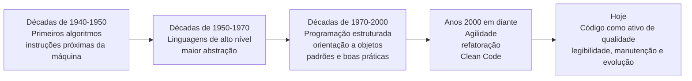
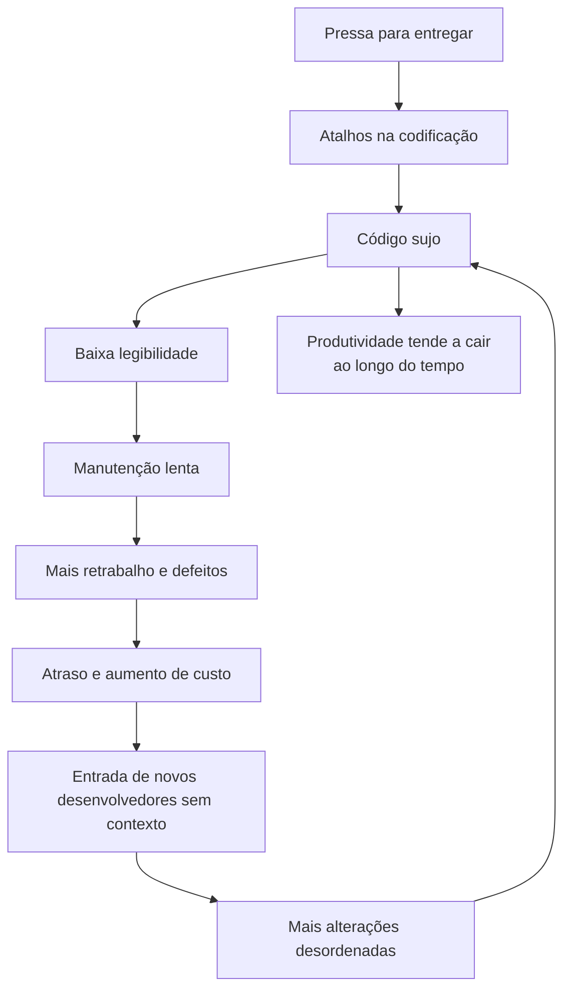
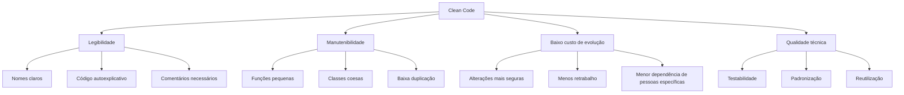
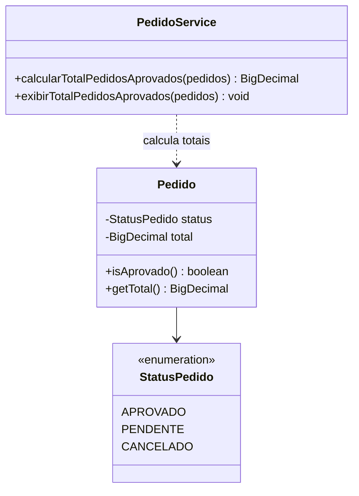
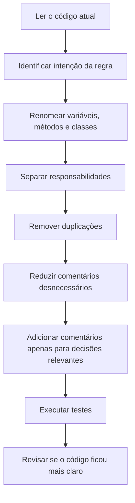

# Tema 02 — Clean Code: a filosofia do “código limpo”

> Disciplina: **Qualidade de software com Clean Code e técnicas de usabilidade**
> Foco deste tema: evolução do código-fonte, custo do código sujo, filosofia Clean Code e boas práticas de escrita para nomes, classes, funções, variáveis, métodos e comentários.

---

## 1. Objetivos de aprendizagem

Ao final deste tema, você deve ser capaz de:

* compreender a evolução histórica da programação e das linguagens;
* explicar por que o código-fonte continua sendo parte central da qualidade de software;
* diferenciar código que “funciona” de código limpo, legível e sustentável;
* aplicar boas práticas de Clean Code em nomes, classes, funções, variáveis, métodos e comentários;
* identificar sinais de código sujo e propor refatorações simples.

O material-base apresenta o Tema 02 como **Clean Code: a filosofia do “código limpo”**, com objetivos voltados à evolução do código, aplicação de boas práticas e criação de códigos reutilizáveis e de maior qualidade. 

---

## 2. Ideia central do tema

Clean Code não deve ser entendido apenas como “código bonito” ou “código formatado”. A ideia principal é produzir código que seja **simples de ler, simples de entender, simples de modificar e seguro para evoluir**.

Um código ruim pode funcionar, mas tende a gerar custo futuro: manutenção difícil, maior chance de defeitos, retrabalho, atraso e dependência excessiva de quem escreveu originalmente. O podcast do tema reforça essa ideia ao destacar que código sujo pode funcionar, mas se torna perigoso e caro para quem precisará alterá-lo no futuro. 

---

## 3. Evolução da programação e surgimento das boas práticas

O material mostra que, com a evolução das linguagens de programação, saímos de instruções muito próximas da máquina para linguagens de alto nível, mais próximas da linguagem humana. Essa evolução aumentou a capacidade de abstração, mas também exigiu padrões melhores de escrita, organização e manutenção do código. 

### Diagrama Mermaid — evolução das práticas de programação



---

## 4. Por que o código sujo custa caro?

O material destaca que, quanto mais alterações um código recebe sem organização, mais confuso e caótico ele se torna. A consequência direta é a queda de produtividade: a equipe passa mais tempo tentando entender o código do que entregando valor. 

Um erro comum das organizações é tentar compensar baixa produtividade adicionando mais pessoas ao projeto. Porém, novos desenvolvedores precisam entender regras, rotinas, classes e histórico do sistema. Se o código já está desorganizado, a entrada de mais pessoas pode aumentar ainda mais o caos. Essa relação também aparece no podcast, que associa código desordenado a atraso, aumento de custo e perda de produtividade. 

### Diagrama Mermaid — ciclo do código sujo



---

## 5. O que caracteriza um código limpo?

O material apresenta diferentes visões de código limpo. Em comum, todas apontam para código **claro, direto, eficiente, testável, com bons nomes, poucas dependências e fácil manutenção**. Também é reforçado que não basta o código funcionar; ele precisa ser compreensível e sustentável ao longo do tempo. 

### Código sujo x Código limpo

| Aspecto      | Código sujo                            | Código limpo                                      |
| ------------ | -------------------------------------- | ------------------------------------------------- |
| Legibilidade | Difícil de entender                    | Fácil de ler                                      |
| Nomes        | Abreviados, vagos ou genéricos         | Descritivos e significativos                      |
| Funções      | Grandes e com várias responsabilidades | Pequenas e com uma responsabilidade clara         |
| Comentários  | Tentam explicar código confuso         | Explicam decisões, regras ou exceções necessárias |
| Manutenção   | Arriscada e lenta                      | Mais segura e previsível                          |
| Evolução     | Aumenta o caos                         | Facilita refatoração e extensão                   |

---

## 6. Boas práticas essenciais de Clean Code

### 6.1 Nomes devem revelar intenção

Um bom nome deve explicar **o que é**, **para que serve** e **qual seu papel no código**. O material alerta que nomes vagos como `m`, `a`, `calcular` ou `dadosE` dificultam a manutenção, enquanto nomes como `tempoDecorridoEmMeses` e `obterDadosClientePorCPF` tornam o código mais compreensível. 

#### Exemplo ruim

```java
int a = 4;
int t = 12;

void calc() {
    // ...
}
```

#### Exemplo melhor

```java
int maxRepeticoes = 4;
int tempoDecorridoEmMeses = 12;

void calcularTaxaJurosMensal() {
    // ...
}
```

Os slides também reforçam essa regra ao apresentar `int a = 4` como exemplo ruim e `int maxRepeticoes = 4` como exemplo bom, além de destacar a necessidade de consistência nos nomes usados ao longo do código. 

---

### 6.2 Classes devem representar entidades ou conceitos

Classes devem ser nomeadas preferencialmente com **substantivos**, pois representam entidades, conceitos ou abstrações do domínio.

#### Evite

```java
class DadosAluno {
    // ...
}
```

#### Prefira

```java
class Aluno {
    // ...
}
```

O nome `Aluno` representa melhor o conceito do domínio. Ele pode conter dados e comportamentos relacionados ao aluno, enquanto `DadosAluno` sugere apenas armazenamento de informações.

---

### 6.3 Funções e métodos devem indicar ação

Funções e métodos devem usar verbos ou expressões verbais, porque executam comportamentos.

#### Evite

```java
void calculo() {
    // ...
}

void processandoDados() {
    // ...
}
```

#### Prefira

```java
void calcularTaxaJurosMensal() {
    // ...
}

void processarDadosClientes() {
    // ...
}
```

Os slides do Tema 02 reforçam essa regra ao diferenciar nomes genéricos de nomes específicos para funções e métodos, como `void calculo()` versus `void calcularTaxaJurosMensal()`. 

---

### 6.4 Funções devem fazer uma coisa só

Uma função limpa deve ter uma responsabilidade clara. Quando uma função faz muitas coisas, ela se torna difícil de testar, entender e alterar.

#### Exemplo problemático

```java
void realizarPedido() {
    cadastrarCliente();
    aplicarDesconto();
    atualizarEstoque();
    salvarPedido();
    enviarEmailConfirmacao();
}
```

Esse método pode até ser útil como orquestrador, mas cada passo deve estar separado em métodos menores. O problema ocorre quando toda a lógica fica concentrada em um único bloco grande.

#### Melhor organização

```java
void realizarPedido(Pedido pedido) {
    validarPedido(pedido);
    aplicarDesconto(pedido);
    atualizarEstoque(pedido);
    salvarPedido(pedido);
    enviarConfirmacao(pedido);
}
```

Aqui, o método principal expressa o fluxo de negócio, enquanto cada responsabilidade fica isolada.

---

### 6.5 Reduza a quantidade de parâmetros

O material recomenda evitar funções com muitos argumentos. Quando uma função começa a receber muitos dados, normalmente existe um conceito de domínio escondido que deveria virar uma classe ou objeto de parâmetro. 

#### Evite

```java
void cadastrar(String nome, String sobrenome, String rg, String cpf,
               String sexo, LocalDate dataNascimento) {
    // ...
}
```

#### Prefira

```java
void cadastrar(DadosPessoais dadosPessoais) {
    // ...
}
```

```java
class DadosPessoais {
    private String nome;
    private String sobrenome;
    private String rg;
    private String cpf;
    private String sexo;
    private LocalDate dataNascimento;
}
```

---

### 6.6 Variáveis devem ficar próximas de onde são usadas

Variáveis declaradas longe do ponto de uso obrigam o leitor a procurar contexto. Isso prejudica a leitura e aumenta o risco de alteração incorreta.

#### Evite

```java
BigDecimal total = BigDecimal.ZERO;

// muitas linhas depois...

void calcularTotal() {
    total = new BigDecimal("30.00");
}
```

#### Prefira

```java
void calcularTotal() {
    BigDecimal total = BigDecimal.ZERO;
    total = new BigDecimal("30.00");
}
```

A proximidade reduz esforço mental e melhora a compreensão do fluxo.

---

### 6.7 Comentários devem explicar o “porquê”, não repetir o “quê”

Comentários são úteis, mas não devem mascarar código ruim. O material ressalta que o ideal é criar código autoexplicável e usar comentários com moderação. Os slides reforçam a regra: use comentários para explicar decisões e evite comentários supérfluos; código bem escrito exige menos comentários.  

#### Comentário ruim

```java
int idade = 25; // define a idade como 25
```

Esse comentário apenas repete o código.

#### Comentário útil

```java
// Regra fiscal: compras já enviadas não podem ser canceladas.
if (pedido.foiEnviado()) {
    throw new CancelamentoNaoPermitidoException();
}
```

Esse comentário explica a regra de negócio que justifica a decisão.

---

## 7. Mapa das práticas de Clean Code



---

## 8. Estudo de caso — refatorando uma função de pedidos

Os slides apresentam uma situação prática: uma equipe trabalha em um sistema de pedidos para e-commerce e encontra uma função responsável por calcular o total de pedidos aprovados e exibir o valor no console, mas o código está difícil de entender. O norte da resolução proposto no material é renomear variáveis e funções, simplificar a estrutura, evitar repetição, dividir responsabilidades e comentar apenas o necessário. 

### Código problemático

```java
public void pr(List<Pedido> ps) {
    double t = 0;

    for (Pedido p : ps) {
        if (p.getStatus().equals("APROVADO")) {
            t = t + p.getTotal();
        }
    }

    System.out.println("Total: " + t);
}
```

### Problemas identificados

| Problema                             | Impacto                                    |
| ------------------------------------ | ------------------------------------------ |
| Nome `pr` não revela intenção        | O leitor não sabe o objetivo do método     |
| Lista `ps` é abreviada               | Reduz clareza                              |
| Variável `t` é vaga                  | Não informa o que está sendo totalizado    |
| Comparação com string literal        | Pode gerar erro de digitação e fragilidade |
| Cálculo e exibição no mesmo método   | Mistura responsabilidades                  |
| Uso de `double` para valor monetário | Pode gerar imprecisão financeira           |

### Código refatorado

```java
import java.math.BigDecimal;
import java.util.List;

public class PedidoService {

    public BigDecimal calcularTotalPedidosAprovados(List<Pedido> pedidos) {
        return pedidos.stream()
                .filter(Pedido::isAprovado)
                .map(Pedido::getTotal)
                .reduce(BigDecimal.ZERO, BigDecimal::add);
    }

    public void exibirTotalPedidosAprovados(List<Pedido> pedidos) {
        BigDecimal totalPedidosAprovados = calcularTotalPedidosAprovados(pedidos);
        System.out.println("Total dos pedidos aprovados: " + totalPedidosAprovados);
    }
}
```

```java
import java.math.BigDecimal;

public class Pedido {

    private StatusPedido status;
    private BigDecimal total;

    public boolean isAprovado() {
        return StatusPedido.APROVADO.equals(status);
    }

    public BigDecimal getTotal() {
        return total;
    }
}
```

```java
public enum StatusPedido {
    APROVADO,
    PENDENTE,
    CANCELADO
}
```

### Diagrama Mermaid — responsabilidades após a refatoração



---

## 9. Checklist de revisão de código

Use este checklist em revisões de pull request, manutenção ou refatoração.

| Critério          | Pergunta de revisão                                             |
| ----------------- | --------------------------------------------------------------- |
| Nome de variável  | O nome revela claramente o conteúdo ou propósito?               |
| Nome de método    | O método usa verbo e descreve a ação realizada?                 |
| Nome de classe    | A classe representa uma entidade ou conceito claro?             |
| Tamanho da função | A função é pequena o suficiente para ser entendida rapidamente? |
| Responsabilidade  | A função ou classe faz apenas uma coisa principal?              |
| Parâmetros        | A quantidade de parâmetros é baixa e compreensível?             |
| Comentários       | O comentário explica uma decisão ou apenas repete o código?     |
| Duplicação        | Existe lógica repetida que poderia ser extraída?                |
| Testabilidade     | O código pode ser testado sem esforço excessivo?                |
| Manutenção        | Outro desenvolvedor entenderia esse código sem explicação oral? |

---

## 10. Antipadrões comuns e correções

| Antipadrão                 | Exemplo ruim           | Correção                          |
| -------------------------- | ---------------------- | --------------------------------- |
| Nome sem significado       | `int x`                | `int quantidadeItens`             |
| Abreviação excessiva       | `calcTx()`             | `calcularTaxaJuros()`             |
| Método genérico            | `processar()`          | `processarPagamentoCartao()`      |
| Classe vaga                | `Dados`                | `Cliente`, `Pedido`, `Fatura`     |
| Comentário redundante      | `// soma total`        | Melhorar o nome do método         |
| Função grande              | `realizarTudo()`       | Dividir em métodos menores        |
| Parâmetros demais          | `cadastrar(a,b,c,d,e)` | Criar objeto de dados             |
| String literal para status | `"APROVADO"`           | Usar `enum StatusPedido.APROVADO` |

---

## 11. Fluxo recomendado para aplicar Clean Code



---

## 12. Resumo para prova

Clean Code é uma filosofia de desenvolvimento voltada à escrita de código compreensível, sustentável e fácil de manter. O ponto principal não é apenas fazer o sistema funcionar, mas permitir que ele continue sendo alterado com segurança ao longo do tempo.

A ideia mais importante do Tema 02 é que **clareza e legibilidade são fundamentos da qualidade do código**. Nos slides, a resposta correta do quiz é escolher nomes descritivos e claros para variáveis, funções e classes, pois isso torna o código autoexplicativo e mais fácil de entender por outros desenvolvedores. 

### Pontos-chave

* Código sujo pode funcionar, mas gera custo futuro.
* Código limpo reduz esforço de manutenção.
* Bons nomes evitam dependência de comentários.
* Funções devem ser pequenas e ter uma responsabilidade clara.
* Classes devem representar conceitos do domínio.
* Comentários devem explicar decisões, regras ou exceções, não repetir o óbvio.
* Padronização melhora leitura coletiva e manutenção.
* Clean Code é prática contínua, não uma ação isolada.

---

## 13. Questões de fixação

### 1. Qual princípio é essencial em Clean Code?

A. Usar abreviações curtas em todas as variáveis.
B. Criar métodos grandes para centralizar regras.
C. Comentar todas as linhas do código.
D. Escolher nomes descritivos para variáveis, funções e classes.

**Resposta:** D.

---

### 2. Por que comentários excessivos podem ser um problema?

Porque podem indicar que o código não está expressando bem sua intenção. O ideal é melhorar nomes, estrutura e responsabilidade dos métodos antes de recorrer a comentários.

---

### 3. Qual é o problema de uma função com muitos parâmetros?

Ela se torna mais difícil de entender, chamar, testar e manter. Em muitos casos, vários parâmetros relacionados indicam que falta um objeto de domínio ou objeto de transferência.

---

### 4. Por que `BigDecimal` é melhor que `double` para valores monetários em Java?

Porque `BigDecimal` evita problemas de precisão típicos de números de ponto flutuante, sendo mais adequado para cálculos financeiros.

---

### 5. O que significa dizer que uma função deve fazer “uma coisa só”?

Significa que ela deve ter um propósito claro e limitado. Se uma função valida, calcula, salva, envia e-mails e imprime relatórios, ela provavelmente precisa ser dividida.

---

## 14. Referências do material-base

* **Leitura digital:** *Qualidade de software com Clean Code e técnicas de usabilidade*, Tema 02 — Clean Code: a filosofia do “código limpo”. 
* **Slides do Tema 02:** nomes de variáveis, comentários, funções, métodos, classes e prática de refatoração. 
* **Podcast do Tema 02:** custo do código sujo e impacto na produtividade, prazo e manutenção. 
