# Tema 03 - Técnicas de usabilidade: melhorando a qualidade da experiência do usuário

> Disciplina: **Qualidade de software com Clean Code e técnicas de usabilidade**  
> Base: Leitura Digital, Slides do Tema 03 e Podcast do Tema 03.  
> Objetivo do material: servir como documentação de estudo em português, pronta para consulta no GitHub, com diagramas Mermaid equivalentes aos principais esquemas do material.

---

## 1. Objetivos do Tema 03

Ao final deste tema, é esperado compreender como a **usabilidade** e a **experiência do usuário** contribuem para a qualidade de software.

Objetivos principais:

- Aprimorar técnicas de usabilidade em projetos de software.
- Demonstrar métricas de usabilidade.
- Compreender o conceito de experiência do usuário em sistemas computacionais.
- Conhecer ferramentas e técnicas para medir e melhorar a experiência do usuário.

---

## 2. Mapa geral do tema

```mermaid
flowchart TD
    A["Tema 03"] --> B["Usabilidade"]
    A --> C["Experiencia do usuario"]
    A --> D["Metricas"]
    A --> E["Tecnicas"]
    A --> F["Heuristicas"]

    B --> B1["Eficacia"]
    B --> B2["Eficiencia"]
    B --> B3["Satisfacao"]

    C --> C1["Percepcao"]
    C --> C2["Emocoes"]
    C --> C3["Facilidade de uso"]
    C --> C4["Valor percebido"]

    D --> D1["Taxa de conclusao"]
    D --> D2["Tempo de tarefa"]
    D --> D3["Questionarios"]
    D --> D4["SUS"]

    E --> E1["Design centrado no usuario"]
    E --> E2["Wireframes"]
    E --> E3["Prototipos"]
    E --> E4["Sitemap"]
    E --> E5["Testes de usabilidade"]

    F --> F1["Nielsen"]
    F --> F2["Prevencao de erros"]
    F --> F3["Feedback"]
    F --> F4["Design minimalista"]
```

---

## 3. Usabilidade

A usabilidade está ligada à **facilidade**, **eficiência** e **efetividade** de uso de um produto. No contexto de software, ela deve estar presente ao longo de todo o processo de criação do sistema, pois influencia diretamente a produtividade, a prevenção de erros e a satisfação de quem usa o produto.

A ideia central é que um sistema de qualidade não deve apenas "funcionar". Ele deve permitir que o usuário realize suas tarefas com o menor esforço possível, com clareza, segurança e confiança.

Em termos práticos, um sistema com boa usabilidade tende a apresentar:

| Aspecto | Significado prático |
|---|---|
| Facilidade de uso | O usuário entende rapidamente como executar suas tarefas. |
| Eficiência | A tarefa é realizada com pouco tempo e pouco esforço. |
| Prevenção de erros | A interface reduz ações equivocadas e orienta o usuário. |
| Satisfação | O usuário se sente confortável e confiante ao usar o sistema. |
| Produtividade | O usuário realiza mais tarefas com menos retrabalho. |
| Acessibilidade | Mais pessoas conseguem utilizar o sistema sem barreiras. |

---

## 4. Modelo ISO 9241-11 para usabilidade

O material apresenta a usabilidade a partir de três pilares: **eficácia**, **eficiência** e **satisfação**.

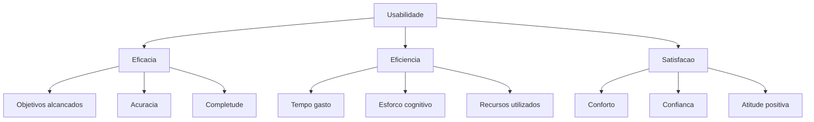

### 4.1 Eficácia

A eficácia mede se o usuário consegue atingir seus objetivos com acurácia e completude. Em um e-commerce, por exemplo, uma tarefa eficaz seria conseguir finalizar uma compra corretamente.

### 4.2 Eficiência

A eficiência mede os recursos gastos para atingir o objetivo: tempo, esforço, passos necessários, custo e carga cognitiva.

### 4.3 Satisfação

A satisfação mede o nível de conforto, confiança e aceitação do usuário em relação ao produto.

---

## 5. Contexto de uso e objetivos de usabilidade

Antes de medir usabilidade, é necessário definir o **contexto de uso**. O material destaca que é preciso identificar:

- quem é o usuário;
- qual tarefa será realizada;
- quais equipamentos serão usados;
- em qual ambiente o sistema será utilizado;
- qual resultado é esperado;
- quais métricas serão usadas para eficácia, eficiência e satisfação.

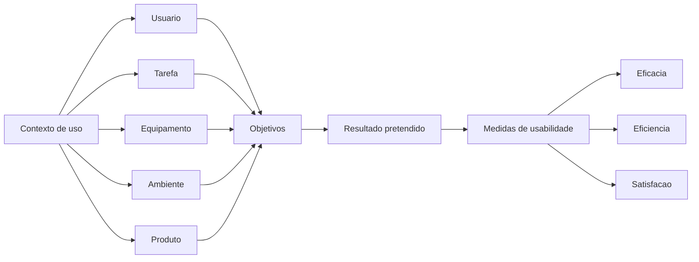

---

## 6. Técnicas de usabilidade

As técnicas de usabilidade ajudam a identificar dificuldades, validar decisões de interface e melhorar a experiência antes que o produto chegue ao usuário final.

### 6.1 Design Centrado no Usuário

O Design Centrado no Usuário considera necessidades, limitações, objetivos e expectativas dos usuários desde as primeiras etapas do projeto.

Aplicação prática:

| Etapa | Ação |
|---|---|
| Descoberta | Entender o público-alvo e suas tarefas. |
| Modelagem | Criar fluxos, jornadas e personas. |
| Prototipação | Testar alternativas de interface antes da implementação. |
| Validação | Observar usuários reais executando tarefas. |
| Melhoria | Ajustar o produto com base nos resultados dos testes. |

### 6.2 Wireframes

Wireframes são esboços estruturais da interface. Eles representam a organização visual inicial das telas, sem foco em detalhes estéticos.

Uso típico:

- organizar menus, botões e seções;
- validar hierarquia de informação;
- discutir fluxo com stakeholders;
- reduzir custo de alteração antes do desenvolvimento.

### 6.3 Protótipos

Protótipos são versões preliminares do sistema. Podem ser simples ou interativos e permitem que usuários e clientes experimentem uma ideia antes da implementação definitiva.

### 6.4 Testes de usabilidade

Testes de usabilidade observam usuários executando tarefas reais ou simuladas. O objetivo é descobrir onde há dificuldade, lentidão, erro, confusão ou insegurança.

No material, essa técnica é relacionada ao modelo de **caixa-preta**, pois avalia o comportamento visível do sistema e a satisfação do usuário, sem analisar diretamente código-fonte, banco de dados ou tecnologia interna.

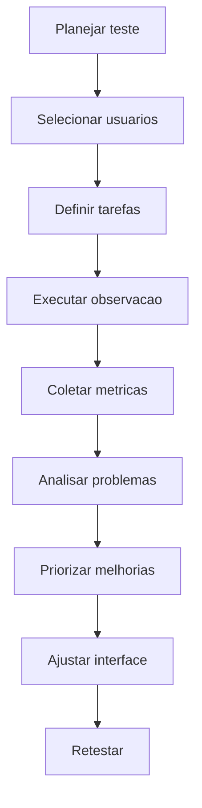

---

## 7. Métricas de usabilidade

As métricas transformam percepções em evidências. Elas ajudam a responder perguntas como:

- Os usuários conseguiram concluir a tarefa?
- Quanto tempo demoraram?
- Quantos erros cometeram?
- Ficaram satisfeitos?
- Precisaram de ajuda?
- Reclamaram de algum ponto?

### 7.1 Taxa de conclusão da tarefa

A taxa de conclusão mede a porcentagem de tarefas executadas corretamente.

```text
Taxa de conclusao = tarefas concluidas com sucesso / total de tarefas x 100
```

Exemplo:

```text
7 tarefas concluidas com sucesso
10 tarefas totais

Taxa de conclusao = 7 / 10 x 100 = 70 por cento
```

Interpretação: quanto maior a taxa de conclusão, maior a indicação de que os usuários conseguem interagir adequadamente com o sistema.

### 7.2 Tempo médio de execução

O tempo médio mede quanto tempo os usuários levam para executar uma tarefa.

Exemplo do material para a tarefa **Finalizar compra**:

| Usuário | Tempo em segundos |
|---|---:|
| Maria | 20 |
| Antônio | 36 |
| Pedro | 12 |
| Joana | 40 |
| Carlos | 20 |

```text
Tempo medio = soma dos tempos / quantidade de usuarios
Tempo medio = 128 / 5 = 25,6 segundos
```

Interpretação: quanto menor o tempo para executar uma tarefa essencial, melhor tende a ser a experiência, desde que a redução de tempo não prejudique segurança, clareza ou controle do usuário.

### 7.3 Questionários de satisfação

Questionários podem ser aplicados durante ou após testes de usabilidade. Eles ajudam a captar percepção, dificuldade, confiança e satisfação.

O material apresenta um conjunto de perguntas baseado no SUS, como:

- Eu usaria este sistema com frequência.
- Esse sistema é desnecessariamente complexo.
- O sistema é fácil de usar.
- Eu precisaria de ajuda de uma pessoa com conhecimentos técnicos para usar o sistema.
- As funções do sistema são muito bem integradas.
- O sistema apresenta muita inconsistência.
- As pessoas aprenderão como usar esse sistema rapidamente.
- O sistema é confuso para usar.
- Senti confiança ao utilizar o sistema.
- Precisei aprender várias coisas novas antes de conseguir utilizar o sistema.

### 7.4 Escala de Likert

A escala apresentada no material vai de 1 a 5:

| Valor | Interpretação |
|---:|---|
| 1 | Discordo totalmente |
| 2 | Discordo parcialmente |
| 3 | Não concordo nem discordo |
| 4 | Concordo parcialmente |
| 5 | Concordo totalmente |

### 7.5 Cálculo SUS apresentado no material

Regra:

- Questões ímpares: subtrair 1 da resposta.
- Questões pares: subtrair a resposta de 5.
- Somar os scores.
- Multiplicar o total por 2,5.
- Resultado final entre 0 e 100.

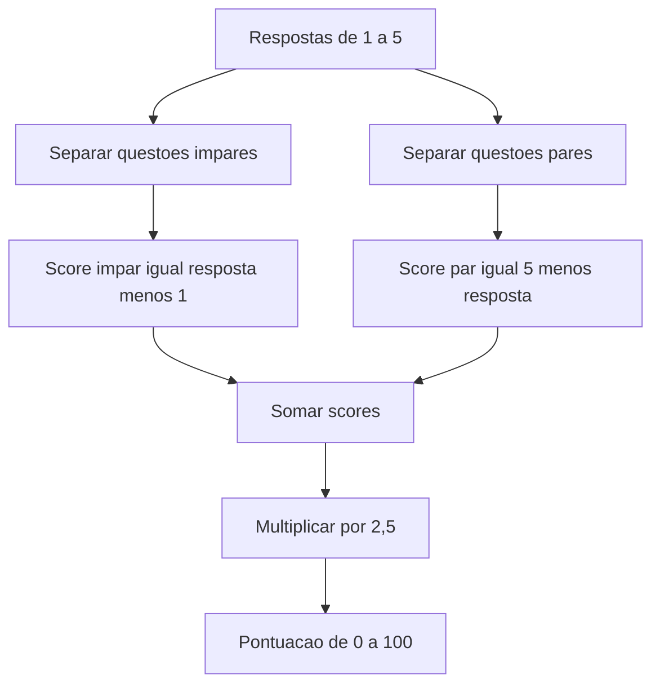

Faixas apresentadas no material:

| Pontuação | Interpretação |
|---:|---|
| Menor que 60 | Inaceitável |
| Maior que 60 e menor que 70 | OK |
| Maior que 70 e menor que 80 | Bom |
| Maior que 80 e menor que 90 | Excelente |
| Maior que 90 | Melhor usabilidade possível |

---

## 8. Experiência do usuário

Experiência do usuário, ou **UX**, é a percepção total do usuário ao interagir com um produto, sistema ou serviço. Ela envolve emoções, percepções, facilidade de uso, satisfação geral e valor percebido.

A usabilidade está contida dentro da UX, mas UX é mais ampla. Enquanto a usabilidade se concentra em facilidade, eficiência, eficácia e segurança, a UX inclui também estética, motivação, desejo, confiança, entretenimento, recompensa e valor.

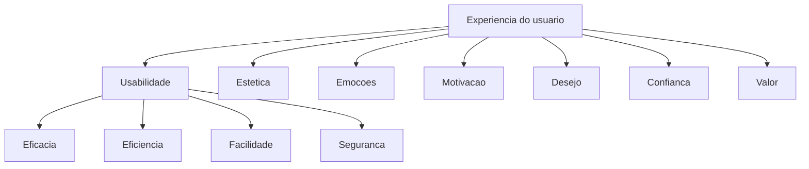

---

## 9. Componentes da UX

O material apresenta os componentes da UX como um conjunto de características que devem estar presentes em um produto para que ele ofereça boa experiência.

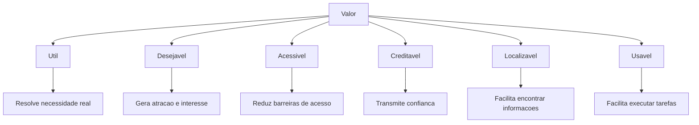

| Componente | Explicação |
|---|---|
| Útil | O produto deve resolver uma necessidade real para o usuário e para a organização. |
| Desejável | O produto deve despertar interesse, valor de imagem e vínculo emocional. |
| Acessível | O produto deve poder ser utilizado por diferentes perfis de usuários. |
| Creditável | O sistema deve transmitir confiança no design, no conteúdo e no comportamento. |
| Localizável | O usuário deve encontrar facilmente o que procura. |
| Usável | O sistema deve ser fácil de aprender e operar. |
| Valor | O produto deve gerar valor para quem usa e para quem o desenvolve. |

---

## 10. Técnicas para experiência do usuário

### 10.1 Wireframes

Usados para representar a estrutura inicial da interface, a hierarquia das informações e a disposição dos elementos.

### 10.2 Protótipos

Usados para simular o funcionamento do produto e permitir validação com clientes e usuários.

### 10.3 Sitemap

O sitemap representa a estrutura de navegação de um site ou sistema.

Equivalente Mermaid do sitemap de e-commerce apresentado no material:

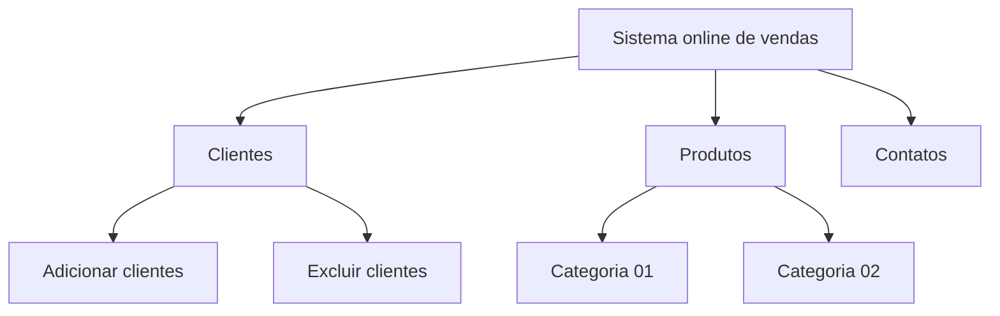

### 10.4 Personas

Personas representam perfis de usuários com comportamentos, necessidades e objetivos. Elas ajudam a equipe a projetar decisões mais alinhadas ao público-alvo.

### 10.5 Brainstorming

Usado para geração de ideias e resolução de problemas. Pode apoiar a descoberta de soluções para dificuldades encontradas durante testes de usabilidade.

### 10.6 Pesquisa e validação

Inclui coleta de dados, entrevistas, questionários, análise retrospectiva, experiência por amostragem e outras técnicas para entender comportamento e percepção do usuário.

---

## 11. Princípios fundamentais de UX destacados nos slides

Os slides do Tema 03 reforçam cinco princípios práticos:

| Princípio | Aplicação |
|---|---|
| Conheça o usuário | Entenda perfil, contexto, limitações e objetivos. |
| Foco na simplicidade | Evite excesso de opções e telas poluídas. |
| Consistência | Use padrões visuais e comportamentais previsíveis. |
| Feedback imediato | Informe claramente o resultado das ações do usuário. |
| Acessibilidade universal | Reduza barreiras para diferentes perfis de uso. |

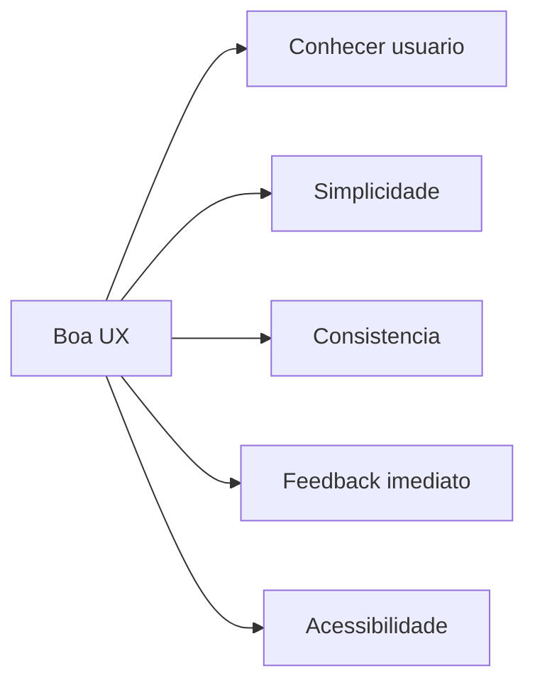

---

## 12. As 10 heurísticas de Nielsen

Os slides apresentam as 10 heurísticas de Nielsen como referência para avaliar interfaces.

| Nº | Heurística | Ideia central |
|---:|---|---|
| 1 | Visibilidade do estado do sistema | O sistema deve informar o que está acontecendo. |
| 2 | Correspondência com o mundo real | A linguagem e os fluxos devem fazer sentido para o usuário. |
| 3 | Controle e liberdade do usuário | O usuário deve conseguir desfazer, cancelar e sair de fluxos. |
| 4 | Consistência e padrões | Elementos semelhantes devem se comportar de forma semelhante. |
| 5 | Prevenção de erros | Melhor evitar o erro do que apenas mostrar mensagem depois. |
| 6 | Reconhecimento em vez de recordação | A interface deve reduzir esforço de memória. |
| 7 | Flexibilidade e eficiência de uso | Deve atender iniciantes e usuários experientes. |
| 8 | Estética e design minimalista | A interface deve evitar excesso de informação. |
| 9 | Ajuda para reconhecer e corrigir erros | Mensagens devem ser claras e orientativas. |
| 10 | Ajuda e documentação | Deve haver suporte quando o usuário precisar. |

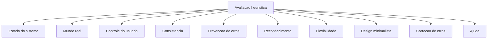

---

## 13. Estudo de caso dos slides: aplicativo financeiro pessoal

Situação apresentada: uma equipe está desenvolvendo um aplicativo de gerenciamento financeiro pessoal. Durante testes beta, os usuários relataram três problemas:

1. Navegação confusa.
2. Falta de feedback após ações.
3. Sobrecarga de informações na tela inicial.

### 13.1 Diagnóstico e solução

| Problema | Heurísticas relacionadas | Solução recomendada |
|---|---|---|
| Navegação confusa | Consistência, reconhecimento, correspondência com o mundo real | Reorganizar menus, destacar funcionalidades principais e usar termos familiares. |
| Falta de feedback | Visibilidade do estado do sistema | Exibir confirmação após salvar orçamento, configurar alerta ou concluir ação. |
| Sobrecarga de informações | Estética e design minimalista | Reduzir a tela inicial ao essencial e organizar detalhes em níveis progressivos. |

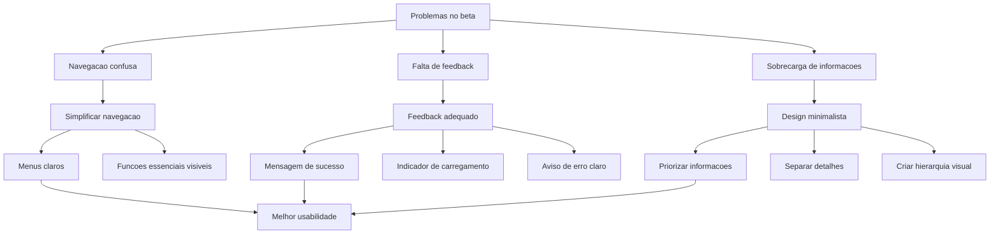

---

## 14. Relação entre Clean Code, tratamento de erros e usabilidade

O podcast do Tema 03 aproxima Clean Code e usabilidade ao reforçar que o tratamento de erros deve ser feito de forma correta para não prejudicar a experiência do usuário.

Essa conexão é importante porque a usabilidade não depende apenas da interface visual. Ela também depende de como o sistema se comporta quando algo dá errado.

Boas práticas associadas:

| Prática | Impacto na usabilidade |
|---|---|
| Mensagens claras de erro | O usuário entende o problema e sabe como agir. |
| Prevenção de erros | Reduz frustração e retrabalho. |
| Código limpo | Facilita manutenção e correção rápida de problemas. |
| Padrões de implementação | Aumentam previsibilidade do sistema. |
| Feedback adequado | Dá confiança de que a ação foi processada. |

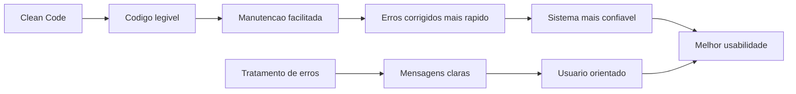

---

## 15. Checklist prático para avaliar usabilidade

### 15.1 Antes do desenvolvimento

- [ ] O público-alvo está definido?
- [ ] As tarefas principais foram identificadas?
- [ ] Os objetivos de usabilidade foram documentados?
- [ ] Há critérios de sucesso para cada tarefa?
- [ ] O contexto de uso foi considerado?
- [ ] Existem requisitos de acessibilidade?

### 15.2 Durante o design

- [ ] A navegação é simples?
- [ ] As funcionalidades essenciais estão visíveis?
- [ ] A interface usa linguagem familiar ao usuário?
- [ ] Há consistência visual e comportamental?
- [ ] A tela evita excesso de informação?
- [ ] O usuário recebe feedback após cada ação importante?

### 15.3 Durante os testes

- [ ] A taxa de conclusão da tarefa foi medida?
- [ ] O tempo médio foi registrado?
- [ ] Os erros dos usuários foram observados?
- [ ] Foi aplicado questionário de satisfação?
- [ ] Foram identificados pontos de confusão?
- [ ] As melhorias foram priorizadas?

### 15.4 Após ajustes

- [ ] A interface foi simplificada?
- [ ] As mensagens de erro foram reescritas?
- [ ] Os problemas foram retestados?
- [ ] O produto ficou mais acessível?
- [ ] A experiência ficou mais clara e satisfatória?

---

## 16. Pontos de prova

- Usabilidade está ligada a **eficácia**, **eficiência** e **satisfação**.
- UX é mais ampla que usabilidade, pois envolve também emoções, estética, motivação, desejo, confiança e valor.
- Testes de usabilidade são voltados à observação do comportamento do usuário diante de tarefas.
- A taxa de conclusão mede quantas tarefas foram concluídas corretamente.
- O tempo médio mede o esforço temporal para realizar uma tarefa.
- Questionários e SUS ajudam a transformar percepção em indicador.
- Wireframes ajudam a validar estrutura antes do layout final.
- Protótipos ajudam a testar funcionamento antes da implementação definitiva.
- Sitemap representa a estrutura de navegação.
- As heurísticas de Nielsen ajudam a diagnosticar problemas de interface.
- Feedback imediato é essencial para reduzir incerteza do usuário.
- Design minimalista reduz sobrecarga cognitiva.
- Tratamento de erros também é parte da usabilidade, pois orienta o usuário em situações de falha.

---

## 17. Flashcards de revisão

### Flashcard 1

**Pergunta:** Quais são os três pilares da usabilidade segundo o modelo apresentado?  
**Resposta:** Eficácia, eficiência e satisfação.

### Flashcard 2

**Pergunta:** Qual é a diferença entre usabilidade e UX?  
**Resposta:** Usabilidade foca facilidade, eficiência, eficácia e satisfação no uso. UX é mais ampla e inclui percepção, emoções, estética, motivação, confiança e valor.

### Flashcard 3

**Pergunta:** O que mede a taxa de conclusão da tarefa?  
**Resposta:** Mede a porcentagem de tarefas concluídas corretamente pelos usuários.

### Flashcard 4

**Pergunta:** Para que serve um wireframe?  
**Resposta:** Para representar a estrutura inicial da interface e validar organização visual e hierarquia de informações.

### Flashcard 5

**Pergunta:** Para que serve um protótipo?  
**Resposta:** Para simular o produto antes da implementação final, permitindo validação com usuários e clientes.

### Flashcard 6

**Pergunta:** Qual heurística de Nielsen está diretamente associada ao feedback após uma ação?  
**Resposta:** Visibilidade do estado do sistema.

### Flashcard 7

**Pergunta:** Qual heurística ajuda a combater telas com excesso de informação?  
**Resposta:** Estética e design minimalista.

### Flashcard 8

**Pergunta:** Como o Clean Code contribui para a usabilidade?  
**Resposta:** Código limpo facilita manutenção, tratamento de erros, correções rápidas e evolução do sistema, o que contribui para uma experiência mais confiável ao usuário.

---

## 18. Questões de fixação

### Questão 1

Qual prática é mais eficaz para melhorar a usabilidade de um sistema?

A. Adicionar mais funcionalidades à interface.  
B. Focar apenas no visual, mesmo com navegação complexa.  
C. Simplificar a navegação e tornar funcionalidades essenciais acessíveis.  
D. Eliminar todo feedback visual e sonoro.

**Resposta:** C.

### Questão 2

Um usuário salva um orçamento e o sistema não mostra nenhuma confirmação. Qual heurística está sendo violada?

A. Visibilidade do estado do sistema.  
B. Ajuda e documentação.  
C. Flexibilidade de uso.  
D. Correspondência com o mundo real.

**Resposta:** A.

### Questão 3

Uma tela inicial exibe muitos gráficos, alertas, banners, atalhos e mensagens ao mesmo tempo. Qual princípio deve ser aplicado?

A. Adicionar mais opções.  
B. Estética e design minimalista.  
C. Ocultar todas as funções.  
D. Remover navegação.

**Resposta:** B.

### Questão 4

Em um teste com 20 tarefas, 15 foram concluídas corretamente. Qual é a taxa de conclusão?

```text
15 / 20 x 100 = 75 por cento
```

**Resposta:** 75%.

---

## 19. Resumo final

O Tema 03 mostra que qualidade de software não se limita a ausência de defeitos técnicos. Um software de qualidade precisa ser compreensível, útil, eficiente, seguro, acessível e satisfatório para seus usuários.

A usabilidade mede a capacidade do usuário de atingir objetivos com eficácia, eficiência e satisfação. A experiência do usuário amplia essa visão, considerando também percepções, emoções, estética, confiança e valor.

Técnicas como Design Centrado no Usuário, wireframes, protótipos, sitemaps, personas, testes de usabilidade, questionários e heurísticas de Nielsen ajudam a construir produtos melhores. Além disso, o tratamento de erros e a clareza do código influenciam a experiência, pois sistemas mais bem estruturados são mais fáceis de corrigir, evoluir e manter.

---

## 20. Referências do material-base

- LAMOUNIER, Stella Marys Dornelas. **Qualidade de software com Clean Code e técnicas de usabilidade**. Leitura Digital. Platos Soluções Educacionais, 2021.
- Slides do Tema 03. **Técnicas de usabilidade: melhorando a qualidade da experiência do usuário**.
- Podcast do Tema 03. **Técnicas de Usabilidade: melhorando a qualidade da experiência do usuário**.
