# Tema 04 — Integrando Clean Code e técnicas de usabilidade para ampliar a qualidade

> **Disciplina:** Qualidade de software com Clean Code e técnicas de usabilidade
> **Tema:** Integrando Clean Code e técnicas de usabilidade para ampliar a qualidade
> **Material-base:** leitura digital, slides do Tema 04 e podcast do Tema 04.   

---

## 1. Objetivo do tema

O Tema 04 fecha a disciplina integrando dois pontos que, muitas vezes, são tratados separadamente:

1. **Clean Code**, que melhora a qualidade interna do software.
2. **Usabilidade e UX**, que melhoram a qualidade percebida pelo usuário.

A ideia central é que **um software de qualidade precisa ser bom por dentro e por fora**. Não basta ter uma interface bonita se o código é difícil de manter. Também não basta ter um código bem estruturado se o usuário não consegue realizar suas tarefas com facilidade.

---

## 2. Visão geral do tema

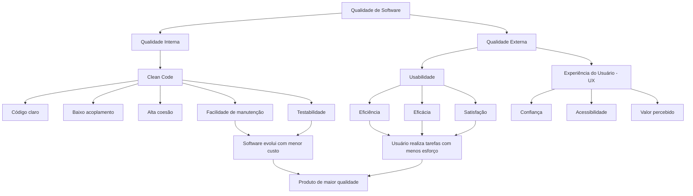

---

## 3. A importância de um código bem escrito

Um código bem escrito é aquele que comunica sua intenção de forma clara. Ele facilita a leitura, reduz ambiguidades e permite que outros desenvolvedores compreendam rapidamente o que está sendo feito.

Segundo o material, técnicas de Clean Code devem ser aplicadas desde o início da construção do código, porque o código sofre alterações ao longo do tempo e tende a se degradar quando não há organização, clareza e padronização. 

### 3.1 Características de um código bem escrito

| Característica    | Explicação                                                        |
| ----------------- | ----------------------------------------------------------------- |
| Clareza           | O código deve ser compreensível sem exigir esforço excessivo.     |
| Simplicidade      | A solução deve evitar complexidade desnecessária.                 |
| Organização       | Arquivos, classes, métodos e blocos devem estar bem estruturados. |
| Manutenibilidade  | Deve ser fácil alterar o código sem quebrar outras partes.        |
| Testabilidade     | O código deve permitir testes manuais e automatizados.            |
| Reutilização      | Trechos comuns devem ser reaproveitados, evitando duplicidade.    |
| Coesão            | Cada classe ou método deve ter uma responsabilidade clara.        |
| Baixo acoplamento | Componentes devem depender o mínimo possível uns dos outros.      |

---

## 4. Clean Code como base para usabilidade

Os slides do Tema 04 reforçam uma ideia importante: **código e interface trabalham juntos**. O código é a fundação; a interface é a face visível do sistema. 

Uma interface intuitiva exige um código bem planejado por trás. Quando o código é confuso, duplicado ou difícil de manter, mudanças simples na experiência do usuário podem se tornar caras, demoradas e arriscadas.

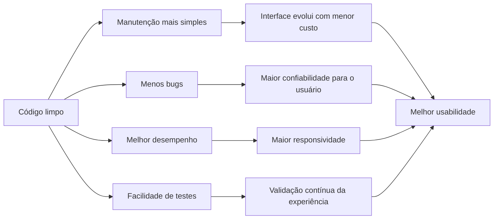

### 4.1 Impactos diretos do código na experiência do usuário

| Prática interna                | Efeito externo percebido pelo usuário                               |
| ------------------------------ | ------------------------------------------------------------------- |
| Código modular                 | Interface mais fácil de evoluir.                                    |
| Tratamento adequado de erros   | Mensagens mais claras e menos falhas inesperadas.                   |
| Baixa duplicação               | Correções mais consistentes em várias telas.                        |
| Boa performance                | Menor tempo de carregamento e resposta.                             |
| Testes automatizados           | Redução de regressões em fluxos importantes.                        |
| Separação de responsabilidades | Menor risco de uma mudança afetar funcionalidades não relacionadas. |

---

## 5. Formatação de código como comunicação

O material destaca que a formatação do código não é apenas uma questão estética. Ela funciona como um **elo de comunicação entre as regras de negócio e o desenvolvedor**. 

Um código mal formatado pode até funcionar, mas dificulta leitura, manutenção e colaboração.

---

## 6. Formatação vertical

A formatação vertical trata da disposição do código de cima para baixo. Ela ajuda o leitor a entender a estrutura geral do arquivo.

O material compara a leitura de código com a leitura de um jornal: primeiro aparecem os conceitos de alto nível; depois, conforme a leitura avança, surgem os detalhes. 

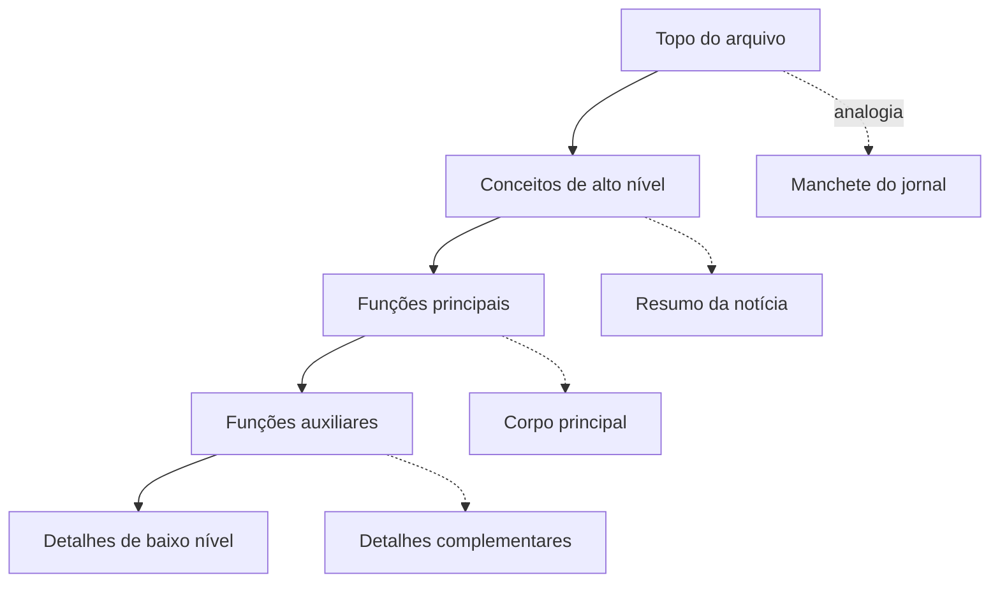

### 6.1 Boas práticas de formatação vertical

| Prática                                | Explicação                                                   |
| -------------------------------------- | ------------------------------------------------------------ |
| Separar conceitos com linhas em branco | Facilita a identificação de blocos lógicos.                  |
| Manter linhas relacionadas próximas    | Evita que o leitor precise procurar dependências espalhadas. |
| Declarar variáveis perto do uso        | Reduz esforço de leitura e risco de erro.                    |
| Manter funções dependentes próximas    | A função que chama deve estar próxima da função chamada.     |
| Evitar arquivos muito longos           | Arquivos menores são mais fáceis de entender.                |

### 6.2 Exemplo ruim

```java
public class GerarListaCompras {
public static void main(String[] args) {
int contador = 0;
int[] listaDeProdutos = new int[10];
for (int numero : listaDeProdutos)
System.out.println("Lista de produtos comprados: " + numero);
}}
```

### 6.3 Exemplo melhorado

```java
public class GerarListaCompras {

    public static void main(String[] args) {
        int contador = 0;
        int[] listaDeProdutos = new int[10];

        for (int numero : listaDeProdutos) {
            System.out.println("Lista de produtos comprados: " + numero);
        }
    }
}
```

A segunda versão não muda a lógica, mas melhora a leitura. O bloco da classe, o método principal, a variável e o laço ficam visualmente organizados.

---

## 7. Formatação horizontal

A formatação horizontal trata da organização da linha de código. O material recomenda manter linhas curtas, preferencialmente entre **100 e 120 caracteres**, para facilitar a leitura. 

### 7.1 Boas práticas de formatação horizontal

| Prática                                    | Explicação                                              |
| ------------------------------------------ | ------------------------------------------------------- |
| Evitar linhas longas                       | Linhas grandes dificultam leitura e revisão.            |
| Usar espaços para separar operadores       | Ajuda a distinguir operandos, atribuições e expressões. |
| Não separar nome da função dos parênteses  | O nome da função e seus parâmetros formam uma unidade.  |
| Manter indentação consistente              | Facilita leitura e comparação de blocos.                |
| Evitar alinhamentos artificiais excessivos | O foco deve ser clareza, não “desenho” do código.       |

### 7.2 Exemplo

```java
int tamanhoNome = nome.length();
totalCaracteres += tamanhoNome;
```

Essa estrutura é mais legível do que uma linha compactada e sem espaçamento adequado.

---

## 8. Tratamento de erros

O material destaca que falhas inesperadas podem ocorrer por vários motivos: entrada de dados incorreta, conexão de rede, problemas de hardware, falhas em banco de dados ou erros de programação. Por isso, o tratamento de exceções deve ser planejado. 

Um bom tratamento de erro deve:

1. proteger a execução do sistema;
2. evitar perda de dados;
3. facilitar a identificação do problema;
4. informar o usuário de forma adequada;
5. permitir registro técnico para análise posterior.

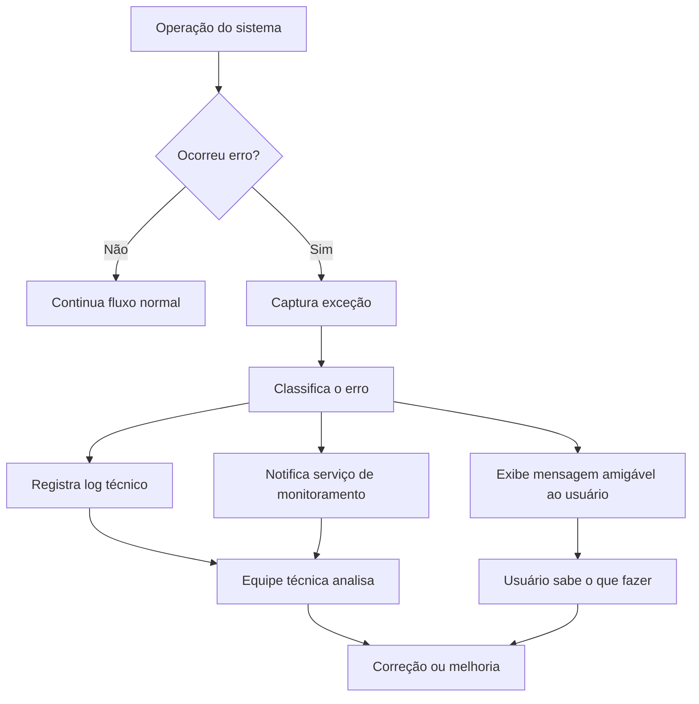

### 8.1 Exemplo ruim

```javascript
try {
    funcaoDeExcecao();
} catch (error) {
    console.log(error);
}
```

Esse tratamento é fraco porque apenas escreve o erro no console. Em produção, isso pode não ajudar o usuário nem a equipe técnica.

### 8.2 Exemplo melhor

```javascript
try {
    funcaoDeExcecao();
} catch (error) {
    console.error(error);
    notificarUsuario("Não foi possível concluir a operação. Tente novamente.");
    reportarParaServicoDeMonitoramento(error);
}
```

Essa versão é mais adequada porque:

* registra o erro;
* informa o usuário;
* envia dados para monitoramento;
* facilita investigação posterior.

---

## 9. Evitar retorno ou passagem de `null`

O material alerta para o risco de códigos cheios de verificações `null`. Esse tipo de prática aumenta a complexidade e pode causar exceções como `NullPointerException`. 

### 9.1 Exemplo problemático

```java
public void registrarCompra(Compra compra) {
    if (compra != null) {
        ItemCompra registro = persistentStore.getItemCompra();

        if (registro != null) {
            Item item = registro.getItem(compra.getId());

            if (item != null && item.getBillingPeriod().hasRetailOwner()) {
                item.registrar(compra);
            }
        }
    }
}
```

### 9.2 Melhor abordagem

```java
public void registrarCompra(Compra compra) {
    validarCompra(compra);

    ItemCompra registro = buscarRegistroDaCompra();
    Item item = buscarItemDaCompra(registro, compra);

    if (item.possuiResponsavelComercial()) {
        item.registrar(compra);
    }
}

private void validarCompra(Compra compra) {
    if (compra == null) {
        throw new IllegalArgumentException("Compra não informada.");
    }
}
```

A segunda versão reduz aninhamentos, deixa a intenção mais clara e centraliza validações.

---

## 10. Separação entre construção e uso do sistema

Outro ponto importante do Tema 04 é a separação entre:

* **construir objetos e dependências**;
* **usar os objetos na regra de negócio**.

O material apresenta um diagrama em que a função `Main` constrói os objetos e depois passa a execução para o aplicativo. A aplicação usa os objetos construídos, mas não precisa conhecer todos os detalhes da construção. 

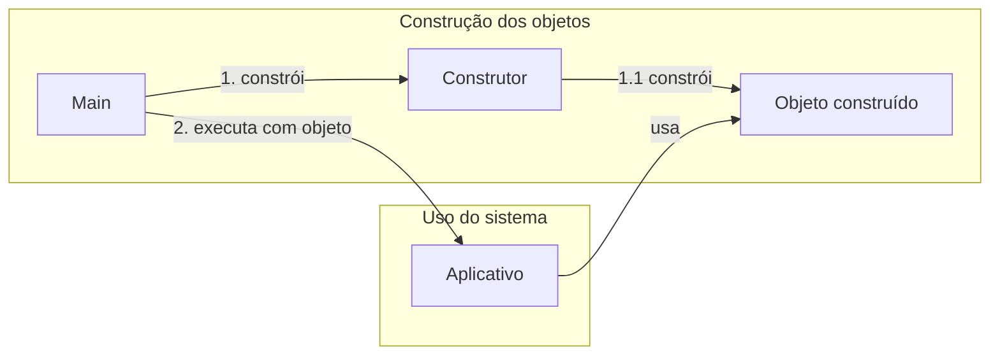

### 10.1 Por que separar construção e uso?

| Benefício              | Explicação                                                              |
| ---------------------- | ----------------------------------------------------------------------- |
| Menor acoplamento      | A aplicação não precisa saber todos os detalhes de criação dos objetos. |
| Mais testabilidade     | Fica mais fácil substituir dependências em testes.                      |
| Melhor organização     | Inicialização, configuração e regra de negócio ficam separadas.         |
| Facilidade de evolução | Mudanças na construção não afetam diretamente o uso.                    |

Essa ideia também se relaciona com padrões como **Factory** e **Abstract Factory**, citados no material como alternativas para organizar a criação de objetos. 

---

## 11. Quatro regras simples para bons projetos com Clean Code

O material apresenta quatro regras importantes associadas à construção de bons projetos com Clean Code: 

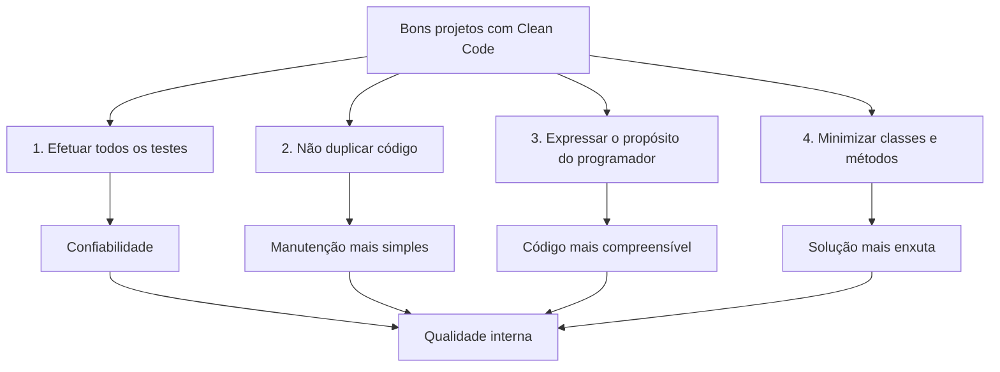

### 11.1 Efetuar todos os testes

O software deve ser testável e deve passar por testes manuais e automatizados. Isso inclui requisitos funcionais e não funcionais.

### 11.2 Não duplicar código

Código duplicado aumenta esforço de manutenção. Quando uma regra muda, várias partes precisam ser alteradas.

### 11.3 Expressar o propósito do programador

O código deve deixar clara a intenção de quem o escreveu. Bons nomes, funções pequenas e responsabilidades bem definidas ajudam nisso.

### 11.4 Minimizar classes e métodos

O objetivo não é criar o menor número possível de classes a qualquer custo, mas evitar complexidade desnecessária. Classes e métodos devem existir quando agregam clareza e organização.

---

## 12. Princípio da Responsabilidade Única — SRP

O **Single Responsibility Principle**, ou **Princípio da Responsabilidade Única**, afirma que uma classe ou módulo deve ter apenas uma responsabilidade principal.

No material, esse princípio é apresentado como uma forma de manter classes mais coesas, menores, fáceis de testar e com menor acoplamento. 

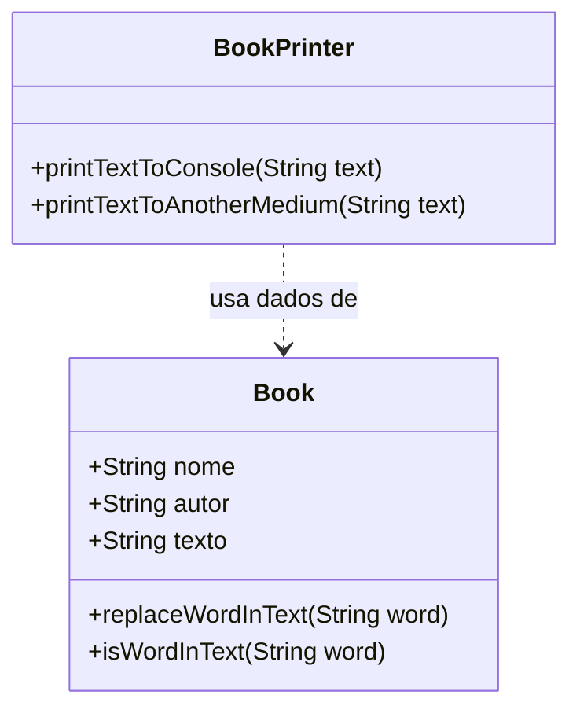

### 12.1 Exemplo de violação do SRP

```csharp
public class Book {
    public string Nome { get; set; }
    public string Autor { get; set; }
    public string Texto { get; set; }

    public string ReplaceWordInText(string word) {
        return Texto.Replace(word, Texto);
    }

    public bool IsWordInText(string word) {
        return Texto.Contains(word);
    }

    public void PrintTextToConsole() {
        Console.WriteLine(Texto);
    }
}
```

A classe `Book` mistura responsabilidades:

* representar os dados do livro;
* manipular texto;
* imprimir conteúdo.

### 12.2 Versão melhorada

```csharp
public class Book {
    public string Nome { get; set; }
    public string Autor { get; set; }
    public string Texto { get; set; }

    public string ReplaceWordInText(string word) {
        return Texto.Replace(word, Texto);
    }

    public bool IsWordInText(string word) {
        return Texto.Contains(word);
    }
}
```

```csharp
public class BookPrinter {
    public void PrintTextToConsole(string text) {
        Console.WriteLine($"Nome do livro: {text}");
    }

    public void PrintTextToAnotherMedium(string text) {
        Console.WriteLine(text);
    }
}
```

Agora cada classe tem uma responsabilidade mais clara:

| Classe        | Responsabilidade                          |
| ------------- | ----------------------------------------- |
| `Book`        | Representar e manipular dados do livro.   |
| `BookPrinter` | Imprimir ou apresentar os dados do livro. |

---

## 13. Integração entre Clean Code e usabilidade

A integração entre Clean Code e usabilidade ocorre quando a equipe entende que a experiência do usuário depende também da estrutura interna do sistema.

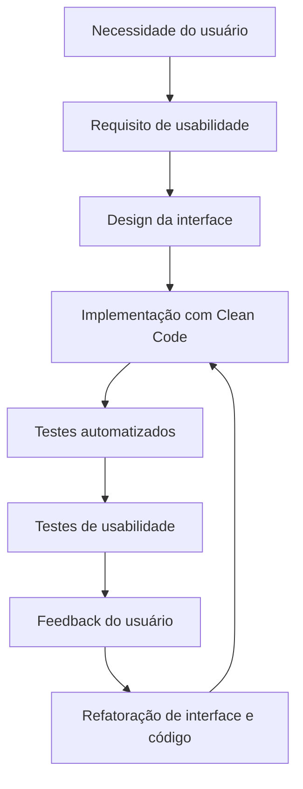

### 13.1 Exemplo prático

Imagine uma tela de agendamento de consulta médica.

Do ponto de vista do usuário, a tela precisa ser simples:

1. escolher especialidade;
2. escolher profissional;
3. escolher data;
4. confirmar consulta.

Do ponto de vista do código, essa simplicidade exige boa estrutura:

* serviços separados;
* validações claras;
* tratamento de erro;
* feedback imediato;
* persistência confiável;
* testes automatizados;
* monitoramento de abandono do fluxo.

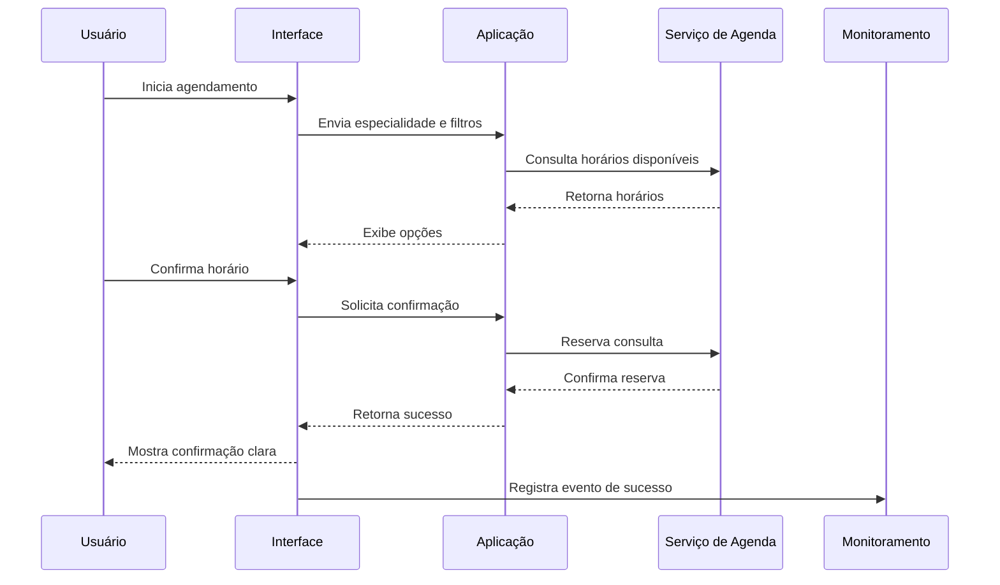

---

## 14. Ferramentas de usabilidade

O material da leitura digital cita ferramentas como **Loop 11**, **Fivesecondtest** e **Google Analytics**. Os slides do Tema 04 também destacam ferramentas como **UsabilityHub**, **Hotjar** e **Crazy Egg**.  

Essas ferramentas ajudam a coletar dados sobre comportamento, dificuldades, abandono de fluxo, cliques, tempo de execução e percepção do usuário.

### 14.1 Categorias de ferramentas

| Categoria                     | Exemplos citados no material | Uso principal                                             |
| ----------------------------- | ---------------------------- | --------------------------------------------------------- |
| Testes rápidos de usabilidade | UsabilityHub, Fivesecondtest | Validar percepção inicial e decisões de design.           |
| Testes com tarefas            | Loop 11                      | Avaliar se usuários conseguem concluir tarefas.           |
| Mapas de calor e gravações    | Hotjar, Crazy Egg            | Identificar onde usuários clicam, param ou se confundem.  |
| Analytics de navegação        | Google Analytics             | Medir tráfego, abandono, conversão e comportamento geral. |

---

## 15. Ciclo de melhoria com ferramentas de usabilidade

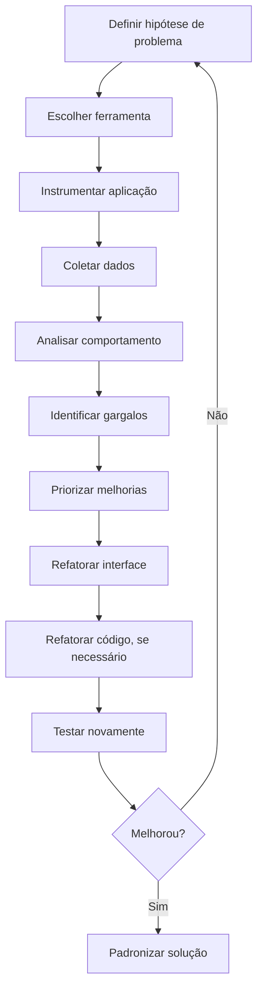

---

## 16. Métricas úteis para avaliar usabilidade

| Métrica                     | O que mede                          | Exemplo de uso                           |
| --------------------------- | ----------------------------------- | ---------------------------------------- |
| Taxa de conclusão da tarefa | Quantos usuários finalizam uma ação | Agendar consulta com sucesso.            |
| Tempo para concluir tarefa  | Quanto tempo o usuário leva         | Tempo médio para finalizar cadastro.     |
| Taxa de abandono            | Onde o usuário desiste              | Abandono na escolha de horário.          |
| Taxa de erro                | Quantas vezes o usuário erra        | Erros ao preencher formulário.           |
| Cliques por tarefa          | Esforço necessário                  | Muitos cliques para chegar a uma função. |
| Frequência de reclamações   | Insatisfação percebida              | Reclamações sobre navegação confusa.     |
| Feedback direto             | Percepção qualitativa               | Comentários de usuários em testes.       |
| Mapas de calor              | Atenção e interação visual          | Áreas mais clicadas ou ignoradas.        |

---

## 17. Caso prático — aplicativo de consultas médicas

Os slides propõem uma situação prática: uma equipe desenvolveu um aplicativo de agendamento de consultas médicas online, mas os usuários relatam dificuldade para navegar, visualizar histórico, alterar perfil e finalizar agendamentos. Muitos abandonam o processo antes da conclusão. 

### 17.1 Diagnóstico inicial

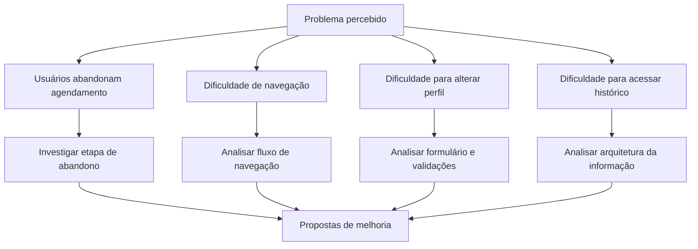

### 17.2 Ferramentas indicadas

| Problema                                | Ferramenta adequada                       | Objetivo                                               |
| --------------------------------------- | ----------------------------------------- | ------------------------------------------------------ |
| Abandono no agendamento                 | Google Analytics ou ferramenta de eventos | Descobrir em qual etapa o usuário abandona.            |
| Cliques em locais errados               | Hotjar ou Crazy Egg                       | Ver mapas de calor e gravações de sessão.              |
| Dúvida sobre primeira impressão da tela | Fivesecondtest ou UsabilityHub            | Avaliar se a tela comunica rapidamente sua finalidade. |
| Validação de fluxo completo             | Loop 11                                   | Criar tarefas e medir taxa de conclusão.               |
| Feedback direto                         | Questionários e entrevistas               | Entender a percepção do usuário.                       |

### 17.3 Métricas que deveriam ser coletadas

| Fluxo                     | Métricas                                                                            |
| ------------------------- | ----------------------------------------------------------------------------------- |
| Agendamento de consulta   | Taxa de conclusão, taxa de abandono por etapa, tempo médio, erros de preenchimento. |
| Visualização de histórico | Tempo até encontrar histórico, cliques até a tela, taxa de sucesso.                 |
| Alteração de perfil       | Campos com maior erro, abandono do formulário, mensagens de validação.              |
| Navegação geral           | Páginas mais acessadas, páginas de saída, cliques em elementos não clicáveis.       |

### 17.4 Possíveis melhorias

| Causa provável             | Melhoria sugerida                                         |
| -------------------------- | --------------------------------------------------------- |
| Fluxo de agendamento longo | Dividir em etapas claras com indicador de progresso.      |
| Usuário não sabe onde está | Melhorar menu, títulos e breadcrumbs.                     |
| Campos confusos            | Usar rótulos claros, máscaras e validações em tempo real. |
| Falta de feedback          | Exibir mensagens de sucesso, erro e carregamento.         |
| Excesso de informação      | Priorizar dados essenciais por etapa.                     |
| Baixa confiança            | Confirmar informações antes de concluir o agendamento.    |

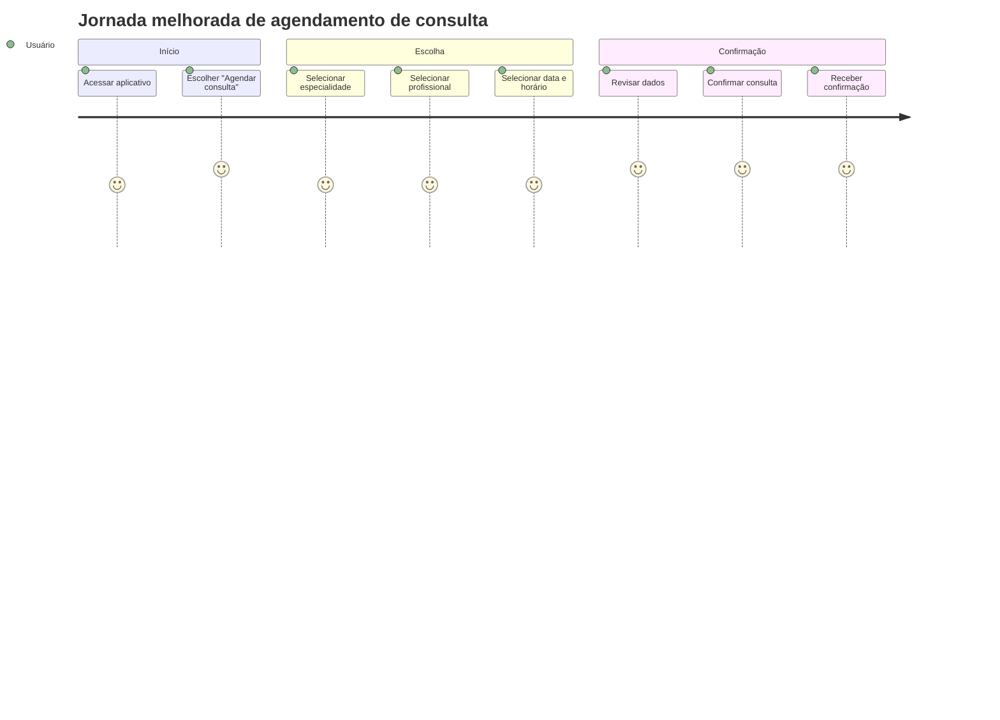

---

## 18. Checklist de qualidade para integrar Clean Code e usabilidade

### 18.1 Checklist para código

* [ ] Os nomes de classes, métodos e variáveis são claros?
* [ ] Cada classe possui responsabilidade bem definida?
* [ ] Métodos são pequenos e objetivos?
* [ ] Existe duplicidade de código?
* [ ] O tratamento de erros é claro e útil?
* [ ] O código evita retornos `null` desnecessários?
* [ ] As dependências estão organizadas?
* [ ] O código possui testes automatizados?
* [ ] A formatação vertical e horizontal está consistente?
* [ ] A estrutura favorece manutenção futura?

### 18.2 Checklist para usabilidade

* [ ] O usuário entende rapidamente o objetivo da tela?
* [ ] O fluxo principal tem poucos passos?
* [ ] Há feedback claro para ações importantes?
* [ ] Mensagens de erro ajudam o usuário a corrigir o problema?
* [ ] O sistema evita retrabalho?
* [ ] O tempo de resposta é aceitável?
* [ ] O usuário consegue concluir a tarefa sem ajuda?
* [ ] Existem métricas de abandono, erro e sucesso?
* [ ] A interface foi validada com usuários?
* [ ] As melhorias são baseadas em dados?

### 18.3 Checklist para equipe

* [ ] Existem padrões de código compartilhados?
* [ ] Existe revisão de código?
* [ ] Existe revisão de interface?
* [ ] UX, desenvolvimento e testes trabalham juntos?
* [ ] O time acompanha métricas reais de uso?
* [ ] O time refatora código e interface continuamente?

---

## 19. Relação com o podcast

O podcast do Tema 04 amplia a discussão técnica e aborda o comportamento profissional do desenvolvedor. Ele reforça que ser um bom programador não envolve apenas aplicar Clean Code, mas também ter responsabilidade, saber trabalhar em equipe, fazer perguntas corretas, negociar prazos, evitar sobrecarga e cuidar da própria vida pessoal. 

Essa reflexão é importante porque qualidade de software também depende da maturidade profissional da equipe.

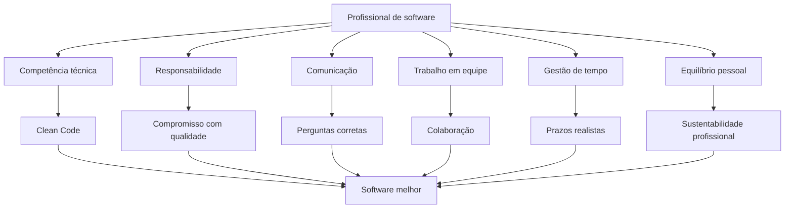

---

## 20. Síntese do aprendizado

A integração entre Clean Code e usabilidade mostra que qualidade de software não é apenas “fazer funcionar”. Um sistema de qualidade precisa:

* ser compreensível para quem mantém;
* ser confiável para quem usa;
* ser fácil de evoluir;
* permitir testes;
* reduzir erros;
* oferecer boa experiência;
* apoiar as necessidades reais do usuário.

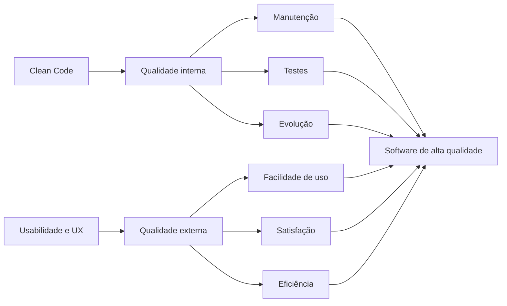

---

## 21. Questão de revisão

**Qual prática melhor exemplifica a integração entre Clean Code e usabilidade para garantir a qualidade do software?**

Alternativas:

A. Focar apenas em reduzir o número de linhas de código, independentemente da legibilidade.
B. Priorizar um design visualmente atraente, mesmo que o código por trás seja complexo e difícil de manter.
C. Escrever código claro e bem estruturado que suporte uma interface intuitiva e fácil de usar.
D. Adicionar o máximo de funcionalidades possível, sem considerar o impacto na interface e na estrutura do código.

**Resposta correta:** C.

A integração eficaz entre Clean Code e usabilidade exige equilíbrio entre estrutura interna e experiência externa. Código claro, legível e fácil de manter permite construir interfaces mais intuitivas, confiáveis e evolutivas. 

---

## 22. Conclusão

O Tema 04 consolida a disciplina ao mostrar que Clean Code e usabilidade não competem entre si. Eles se complementam.

Clean Code melhora a estrutura interna do software. Usabilidade melhora a experiência externa. Quando os dois são aplicados em conjunto, o resultado é um software mais fácil de manter, mais confiável, mais eficiente e mais alinhado às necessidades do usuário.

Em termos práticos:

> **Clean Code sustenta a evolução do sistema. Usabilidade sustenta a adoção pelo usuário. A união dos dois amplia a qualidade do software.**
