# Teste e Inspeção de Software: Técnicas e Automatização

## Tema 01 — Conceituando Teste e Inspeção de Software

> **Objetivo do capítulo:** compreender os fundamentos de teste e inspeção de software, diferenciá-los, identificar as causas de defeitos, analisar suas vantagens e limitações e reconhecer sua importância durante todo o ciclo de desenvolvimento.

A documentação foi consolidada a partir da leitura digital, dos slides e do podcast do Tema 01.   

---

## 1. Visão geral

Sistemas de software estão presentes em operações bancárias, comércio eletrônico, saúde, telecomunicações, serviços públicos, transporte e inúmeras atividades cotidianas. Quanto maior a dependência desses sistemas, maiores são as exigências relacionadas a:

* qualidade;
* confiabilidade;
* segurança;
* desempenho;
* facilidade de uso;
* integridade das informações;
* disponibilidade.

Nesse contexto, **testes e inspeções são práticas complementares de garantia da qualidade**.

A inspeção procura encontrar problemas nos artefatos produzidos durante o desenvolvimento, normalmente sem executar o software. Os testes dinâmicos, por sua vez, executam o sistema ou parte dele para observar seu comportamento.

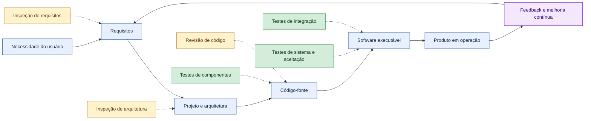

O objetivo não é apenas “encontrar bugs”. Essas atividades ajudam a construir um produto que:

1. esteja de acordo com as especificações;
2. resolva o problema real do usuário;
3. apresente risco aceitável para sua utilização;
4. possa evoluir sem perder estabilidade.

---

## 2. Objetivos de aprendizagem

Ao concluir este tema, espera-se que o estudante seja capaz de:

* explicar o que são teste e inspeção de software;
* diferenciar atividades estáticas e dinâmicas;
* distinguir erro, defeito e falha;
* compreender verificação e validação;
* identificar causas comuns de defeitos;
* descrever as responsabilidades do analista de testes;
* avaliar vantagens e limitações de testes e inspeções;
* posicionar essas práticas ao longo do ciclo de desenvolvimento.

---

# 3. Evolução dos testes e inspeções

O podcast apresenta uma evolução didática das práticas de qualidade, partindo de processos praticamente inexistentes até a automação apoiada por inteligência artificial. 

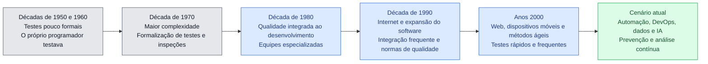

## 3.1 Primeiros anos

Nas décadas de 1950 e 1960:

* os programas eram menores e executados em ambientes restritos;
* não havia processos de teste bem estabelecidos;
* frequentemente o próprio desenvolvedor escrevia e testava o código;
* os testes eram vistos mais como uma etapa final do que como uma atividade contínua.

## 3.2 Formalização

Com o crescimento da complexidade dos sistemas, especialmente a partir da década de 1970, erros de software passaram a representar riscos operacionais, financeiros e institucionais maiores.

Consequentemente, começaram a ser formalizados:

* procedimentos de teste;
* inspeções de código;
* revisões técnicas;
* equipes especializadas em qualidade;
* critérios de aceitação.

## 3.3 Qualidade integrada ao desenvolvimento

Nas décadas seguintes, a qualidade deixou de ser responsabilidade exclusiva de uma equipe localizada no final do projeto. Testes e revisões passaram a acompanhar diferentes fases do desenvolvimento.

Essa mudança sustenta práticas atuais como:

* desenvolvimento iterativo;
* integração contínua;
* entrega contínua;
* revisão por pares;
* análise estática;
* testes automatizados;
* testes de regressão.

## 3.4 Atualização normativa

O podcast menciona a **ISO/IEC 9126**, importante historicamente para a definição de características da qualidade de software. Essa norma foi retirada e sucedida pela família SQuaRE. A referência atual para modelos de qualidade de produto é a **ISO/IEC 25010:2023**. ([ISO][1])

---

# 4. Conceitos fundamentais

## 4.1 Teste de software

Teste de software é um conjunto planejado de atividades utilizado para avaliar artefatos, componentes ou sistemas, buscando:

* encontrar defeitos;
* provocar e observar falhas;
* verificar requisitos;
* validar necessidades dos usuários;
* avaliar características de qualidade;
* fornecer informações para decisões;
* reduzir os riscos associados ao produto.

Na abordagem didática principal do material, o teste é apresentado como uma atividade que executa o software e compara:

```text
Resultado esperado × Resultado obtido
```

Um caso de teste normalmente contém:

| Elemento           | Descrição                               |
| ------------------ | --------------------------------------- |
| Objetivo           | Comportamento que será avaliado         |
| Pré-condições      | Estado necessário antes da execução     |
| Dados de entrada   | Valores utilizados no teste             |
| Passos             | Ações executadas                        |
| Resultado esperado | Comportamento previsto                  |
| Resultado obtido   | Comportamento observado                 |
| Situação           | Aprovado, reprovado ou bloqueado        |
| Evidências         | Logs, capturas, relatórios ou registros |

### Exemplo

Para uma funcionalidade de login:

```text
Dado que o usuário possui uma conta ativa
Quando informar e-mail e senha válidos
Então o sistema deve autenticá-lo
E direcioná-lo para a página inicial
```

### Importante

Nenhum conjunto finito de testes consegue garantir que um software esteja completamente livre de defeitos. Testes demonstram a presença de problemas encontrados e reduzem o risco de problemas não descobertos, mas não provam sua inexistência. ([ISTQB][2])

---

## 4.2 Inspeção de software

A inspeção é uma forma estruturada de examinar um artefato sem depender da execução do programa.

Podem ser inspecionados:

* requisitos;
* histórias de usuário;
* critérios de aceitação;
* modelos de domínio;
* diagramas;
* especificações técnicas;
* arquitetura;
* código-fonte;
* scripts de banco de dados;
* planos e casos de teste;
* manuais;
* contratos de interface;
* configurações de segurança.

A inspeção procura identificar antecipadamente problemas como:

* ambiguidades;
* omissões;
* contradições;
* requisitos impossíveis de testar;
* violações de padrões;
* falhas de projeto;
* vulnerabilidades;
* código duplicado;
* dependências inadequadas;
* interfaces incompatíveis.

O material enfatiza que a inspeção é colaborativa e pode envolver desenvolvedores, analistas, testadores, arquitetos e representantes do negócio. 

---

## 4.3 Terminologia atual: teste estático e teste dinâmico

Uma distinção mais precisa, alinhada ao ISTQB, é:

* **teste estático:** examina produtos de trabalho sem executar o software;
* **teste dinâmico:** executa o software e observa seu comportamento.

Assim, uma inspeção é uma modalidade de teste estático ou revisão formal. Teste não significa obrigatoriamente execução: revisões, inspeções e análise estática também pertencem ao campo de testes. ([ISTQB][2])

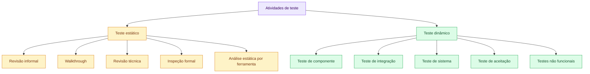

---

# 5. Teste × inspeção

| Critério              | Inspeção ou teste estático                                    | Teste dinâmico                                   |
| --------------------- | ------------------------------------------------------------- | ------------------------------------------------ |
| Execução do software  | Não é necessária                                              | Necessária                                       |
| Objeto analisado      | Requisitos, modelos, código, documentação                     | Componente ou sistema executável                 |
| Momento de aplicação  | Desde as primeiras fases                                      | Quando há algo executável                        |
| Forma de descoberta   | O defeito pode ser observado diretamente                      | Uma falha é provocada e investigada              |
| Exemplos              | Revisão de requisitos, code review, análise estática          | Teste unitário, integração, sistema              |
| Problemas encontrados | Ambiguidade, omissão, código inalcançável, padrão violado     | Resultado incorreto, lentidão, indisponibilidade |
| Participantes         | Revisores, autores, especialistas e stakeholders              | Desenvolvedores, testadores, usuários            |
| Principal vantagem    | Detecção precoce                                              | Avaliação do comportamento real                  |
| Limitação             | Não mede adequadamente comportamentos dependentes da execução | Exige produto executável e ambiente preparado    |

## 5.1 Complementaridade

Inspeção e teste não concorrem entre si.

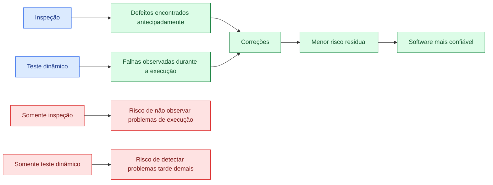

A estratégia mais eficiente combina:

1. inspeção dos artefatos;
2. análise estática automatizada;
3. execução de testes;
4. correção;
5. testes de confirmação;
6. testes de regressão;
7. acompanhamento em produção.

---

# 6. Erro, defeito e falha

Esses conceitos representam momentos diferentes de uma cadeia causal.

| Conceito    | Significado                                           | Exemplo                                                   |
| ----------- | ----------------------------------------------------- | --------------------------------------------------------- |
| **Erro**    | Ação, entendimento ou decisão humana incorreta        | Analista interpreta uma regra de desconto de forma errada |
| **Defeito** | Imperfeição introduzida em um artefato                | Código aplica 15% de desconto em vez de 10%               |
| **Falha**   | Manifestação observável do defeito durante a execução | Cliente recebe desconto maior do que deveria              |
| **Efeito**  | Consequência técnica ou de negócio                    | Perda financeira e cobrança incorreta                     |

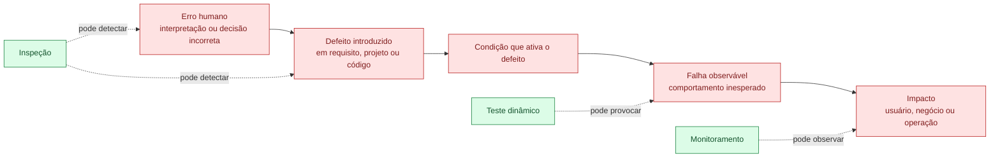

## 6.1 Nem todo defeito produz uma falha imediatamente

Um defeito pode permanecer oculto quando:

* o trecho afetado não é executado;
* a combinação de dados necessária não ocorre;
* a funcionalidade é pouco utilizada;
* outro defeito mascara seu comportamento;
* o ambiente não ativa a condição;
* a falha ocorre, mas não é percebida.

### Exemplo

```java
public double dividir(double valor, double divisor) {
    return valor / divisor;
}
```

O código contém risco relacionado à ausência de validação do divisor. A falha somente será observada quando o método receber uma condição problemática, como um divisor igual a zero, conforme o tipo e o comportamento esperado da aplicação.

---

# 7. Verificação e validação

Teste e inspeção fazem parte das atividades de **verificação e validação — V&V**.

## 7.1 Verificação

A verificação procura responder:

> **Estamos construindo o produto corretamente?**

Ela compara o artefato produzido com especificações, padrões e critérios previamente definidos.

Exemplos:

* verificar se o código implementa o requisito;
* revisar se uma API segue seu contrato;
* conferir se o modelo de dados atende ao projeto;
* verificar conformidade com padrões de segurança;
* analisar se os critérios de aceitação são testáveis.

## 7.2 Validação

A validação procura responder:

> **Estamos construindo o produto correto?**

Ela avalia se a solução atende às necessidades reais dos usuários e do negócio.

Exemplos:

* validar um protótipo com usuários;
* executar teste de aceitação;
* observar se o fluxo resolve o problema operacional;
* avaliar usabilidade;
* confirmar se a funcionalidade produz valor.

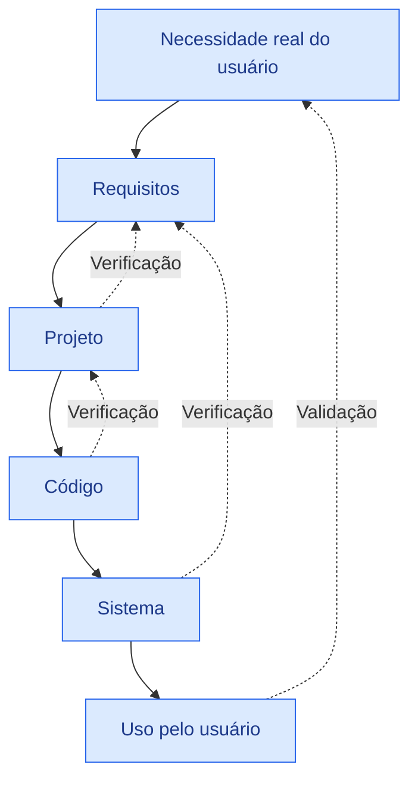

## 7.3 Exemplo prático

Requisito:

> O sistema deverá gerar um relatório financeiro em até cinco segundos.

### Verificação

* o requisito foi implementado?
* o limite está configurado corretamente?
* os casos de teste cobrem cinco segundos?
* o relatório contém todos os campos especificados?

### Validação

* cinco segundos são aceitáveis para o usuário?
* o relatório resolve sua necessidade?
* as informações estão organizadas de forma compreensível?
* o fluxo é adequado ao processo de trabalho?

Um sistema pode estar de acordo com a especificação e, ainda assim, não atender adequadamente à necessidade real. Por isso, verificação e validação precisam ser combinadas.

---

# 8. Principais causas de defeitos

O material identifica como causas frequentes:

* falhas de comunicação;
* interpretação incorreta dos requisitos;
* erros humanos na codificação;
* inspeções incompletas;
* testes inadequados;
* ausência de alinhamento entre os envolvidos. 

Essas causas podem ser agrupadas em categorias.

```mermaid
flowchart TB
    D["Defeitos de software"]

    D --> R["Requisitos"]
    D --> P["Pessoas"]
    D --> PR["Processos"]
    D --> T["Tecnologia"]
    D --> A["Ambiente"]

    R --> R1["Ambiguidade"]
    R --> R2["Omissão"]
    R --> R3["Regra contraditória"]
    R --> R4["Critério não testável"]

    P --> P1["Falha de comunicação"]
    P --> P2["Conhecimento insuficiente"]
    P --> P3["Pressão e fadiga"]
    P --> P4["Interpretação incorreta"]

    PR --> PR1["Ausência de revisão"]
    PR --> PR2["Teste tardio"]
    PR --> PR3["Critérios de saída indefinidos"]
    PR --> PR4["Rastreabilidade deficiente"]

    T --> T1["Biblioteca incompatível"]
    T --> T2["Configuração incorreta"]
    T --> T3["Ferramenta inadequada"]
    T --> T4["Integração defeituosa"]

    A --> A1["Diferenças entre ambientes"]
    A --> A2["Dados inconsistentes"]
    A --> A3["Dependência indisponível"]
    A --> A4["Infraestrutura limitada"]

    classDef centro fill:#fee2e2,stroke:#b91c1c,color:#7f1d1d;
    classDef categoria fill:#dbeafe,stroke:#2563eb,color:#1e3a8a;
    classDef causa fill:#f8fafc,stroke:#64748b,color:#1e293b;

    class D centro;
    class R,P,PR,T,A categoria;
    class R1,R2,R3,R4,P1,P2,P3,P4,PR1,PR2,PR3,PR4,T1,T2,T3,T4,A1,A2,A3,A4 causa;
```

## 8.1 Defeitos em requisitos

Exemplos:

* “O sistema deve responder rapidamente.”
* “O usuário poderá cancelar o pedido quando necessário.”
* “A senha deve ser segura.”

Essas frases são vagas porque não definem critérios mensuráveis.

Uma especificação mais testável seria:

> Em 95% das solicitações, a consulta deverá responder em até dois segundos quando houver até 500 usuários simultâneos.

## 8.2 Defeitos de comunicação

Podem ocorrer quando:

* regras são explicadas apenas verbalmente;
* decisões não são registradas;
* áreas utilizam termos diferentes;
* alterações não chegam a todos;
* dúvidas não são resolvidas com o responsável pelo negócio.

## 8.3 Defeitos de codificação

Exemplos:

* comparação incorreta;
* condição de limite incompleta;
* validação ausente;
* tratamento inadequado de exceção;
* concorrência não controlada;
* consulta incorreta;
* exposição de dados;
* conversão de tipos inadequada.

---

# 9. Papel do analista de testes

O material descreve o analista de testes como um **“guardião da qualidade”**, responsável por avaliar funcionalidades, desempenho e segurança, comunicar problemas e colaborar com a equipe. 

Essa expressão não significa que a qualidade seja responsabilidade apenas desse profissional. Qualidade é uma responsabilidade compartilhada, mas o analista ajuda a estruturar, orientar e dar visibilidade a essas atividades.

## 9.1 Responsabilidades principais

### Análise

* compreender requisitos e regras de negócio;
* identificar ambiguidades;
* avaliar riscos;
* definir prioridades;
* determinar o que precisa ser testado.

### Planejamento

* definir estratégia de teste;
* estimar esforço;
* escolher níveis e tipos de teste;
* preparar ambientes e dados;
* definir critérios de entrada e saída.

### Projeto dos testes

* elaborar cenários;
* escrever casos de teste;
* identificar pré-condições;
* definir resultados esperados;
* preparar massa de dados;
* estabelecer rastreabilidade.

### Execução

* executar testes;
* coletar evidências;
* comparar resultados;
* registrar defeitos;
* retestar correções;
* realizar regressão.

### Comunicação

* informar riscos;
* apresentar métricas;
* colaborar com desenvolvedores;
* apoiar a tomada de decisão;
* explicar consequências para o negócio.

### Melhoria contínua

* analisar defeitos recorrentes;
* aperfeiçoar checklists;
* propor automação;
* melhorar critérios de aceitação;
* participar das revisões do processo.

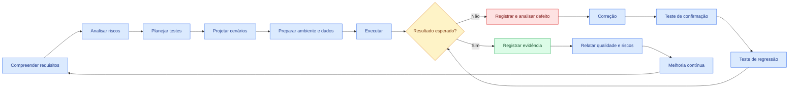

## 9.2 Competências importantes

| Categoria       | Competências                                                           |
| --------------- | ---------------------------------------------------------------------- |
| Técnicas        | Técnicas de teste, automação, APIs, banco de dados, logs e ferramentas |
| Analíticas      | Pensamento crítico, análise de risco e investigação                    |
| Negócio         | Compreensão dos processos e impactos                                   |
| Comunicação     | Clareza, negociação e registro objetivo                                |
| Colaboração     | Trabalho com desenvolvimento, produto, segurança e operação            |
| Organizacionais | Planejamento, priorização e rastreabilidade                            |
| Éticas          | Imparcialidade, responsabilidade e proteção de informações             |

---

# 10. Vantagens de testes e inspeções

## 10.1 Detecção precoce

A principal vantagem é encontrar problemas antes que avancem para fases posteriores.

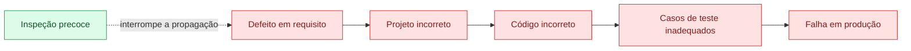

Quanto mais cedo o defeito é encontrado, menores tendem a ser:

* o número de artefatos afetados;
* o retrabalho;
* o tempo de investigação;
* o impacto no cronograma;
* o risco para o usuário.

## 10.2 Redução de riscos

Testes e inspeções ajudam a reduzir riscos relacionados a:

* perdas financeiras;
* indisponibilidade;
* vazamento de dados;
* decisões incorretas;
* prejuízo à reputação;
* sanções contratuais;
* impacto operacional;
* segurança das pessoas.

## 10.3 Melhoria da qualidade

A aplicação sistemática dessas práticas contribui para:

* maior estabilidade;
* melhor aderência aos requisitos;
* comportamento mais previsível;
* melhor desempenho;
* maior segurança;
* melhor experiência do usuário.

## 10.4 Aprendizado da equipe

Revisões colaborativas possibilitam:

* disseminação do conhecimento;
* identificação de padrões de erro;
* padronização;
* desenvolvimento técnico;
* melhor entendimento do produto;
* redução da dependência de indivíduos.

## 10.5 Confiança para evoluir

Uma base consistente de testes permite modificar o sistema com menor risco, desde que os testes sejam mantidos e executados regularmente.

---

# 11. Limitações e desafios

## 11.1 Custos iniciais

Testes e inspeções exigem investimento em:

* profissionais;
* treinamento;
* ambientes;
* ferramentas;
* automação;
* manutenção dos testes;
* gestão de dados;
* infraestrutura.

## 11.2 Tempo

Inspeções detalhadas e testes abrangentes demandam tempo. Quando o planejamento é inadequado, a equipe pode tratar qualidade como um obstáculo em vez de uma parte do desenvolvimento.

## 11.3 Limitações da inspeção

A inspeção pode não revelar adequadamente problemas que dependem da execução, como:

* lentidão sob carga;
* consumo excessivo de memória;
* condições de concorrência;
* falhas de infraestrutura;
* problemas específicos de dispositivos;
* percepção real de usabilidade.

## 11.4 Limitações dos testes dinâmicos

Os testes dinâmicos também possuem limitações:

* não é viável testar todas as combinações possíveis;
* os resultados dependem da qualidade dos cenários;
* ambientes podem não representar a produção;
* dados de teste podem ser insuficientes;
* defeitos podem permanecer em caminhos não exercitados;
* testes desatualizados podem produzir falsa confiança.

## 11.5 Automação não elimina trabalho humano

Automação é especialmente útil para atividades repetitivas e verificações frequentes. Entretanto, não substitui:

* análise crítica;
* testes exploratórios;
* entendimento do negócio;
* avaliação de usabilidade;
* descoberta de riscos;
* comunicação entre pessoas.

---

## 11.6 Quadro comparativo

| Prática                | Vantagens                                                | Limitações                                      |
| ---------------------- | -------------------------------------------------------- | ----------------------------------------------- |
| Inspeção de requisitos | Detecta ambiguidades e omissões cedo                     | Depende da participação dos stakeholders        |
| Revisão de código      | Compartilha conhecimento e encontra defeitos estruturais | Pode consumir tempo e sofrer viés dos revisores |
| Análise estática       | Automática, rápida e repetível                           | Pode produzir falsos positivos                  |
| Teste manual           | Flexível e adequado à exploração                         | Menor repetibilidade e maior custo recorrente   |
| Teste automatizado     | Rápido, repetível e integrado ao pipeline                | Exige desenvolvimento e manutenção              |
| Teste de sistema       | Avalia o produto integrado                               | Exige ambiente próximo do real                  |
| Teste de aceitação     | Valida necessidades do usuário                           | Pode ocorrer tarde quando mal planejado         |

---

# 12. Testes e inspeções no ciclo de desenvolvimento

Essas práticas devem ser distribuídas durante todo o ciclo, e não concentradas no final.

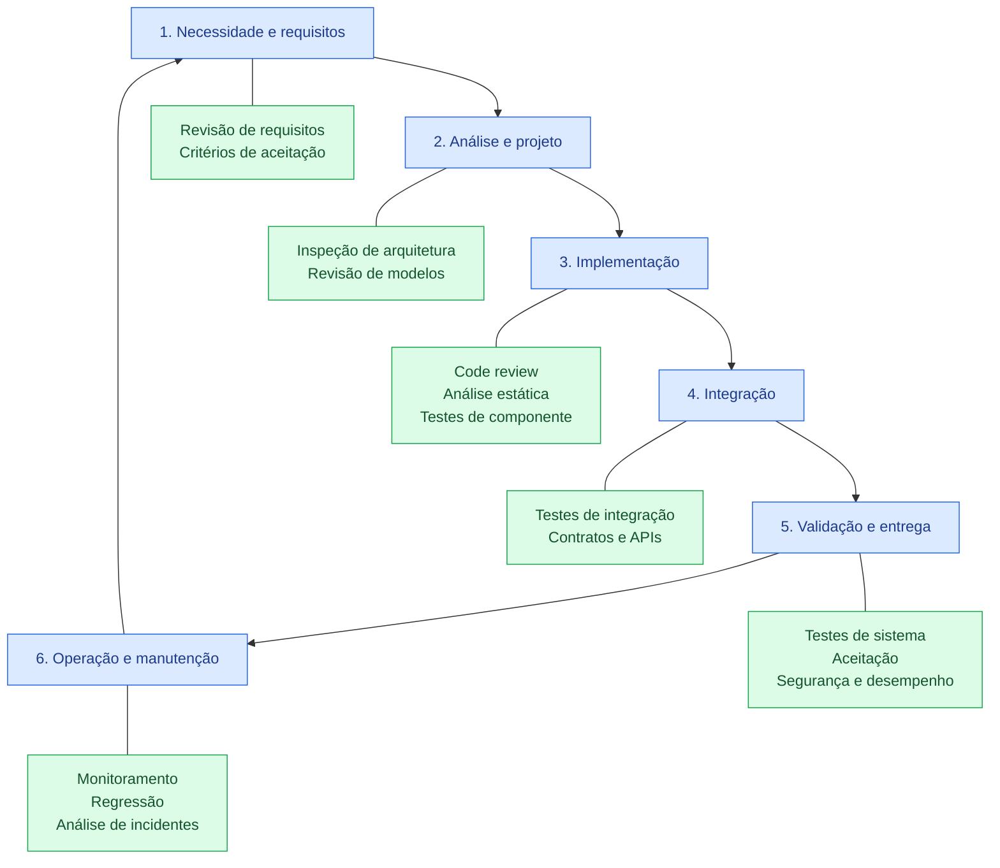

## 12.1 Requisitos

Atividades recomendadas:

* revisar clareza e consistência;
* identificar ambiguidades;
* definir critérios de aceitação;
* verificar testabilidade;
* validar com o negócio;
* mapear riscos.

## 12.2 Projeto e arquitetura

Atividades recomendadas:

* revisar componentes e responsabilidades;
* avaliar integração;
* revisar modelos de dados;
* analisar ameaças;
* validar requisitos não funcionais;
* verificar decisões arquiteturais.

## 12.3 Implementação

Atividades recomendadas:

* revisão por pares;
* análise estática;
* testes de componente;
* verificação de padrões;
* validação de tratamento de erros;
* testes de segurança no código.

## 12.4 Integração

Atividades recomendadas:

* testar contratos entre módulos;
* verificar APIs;
* testar persistência;
* validar mensagens e eventos;
* testar integrações externas;
* avaliar comportamento em falhas.

## 12.5 Entrega

Atividades recomendadas:

* testes de sistema;
* testes de aceitação;
* testes de regressão;
* desempenho;
* segurança;
* usabilidade;
* compatibilidade.

## 12.6 Operação

Atividades recomendadas:

* monitorar indicadores;
* analisar logs;
* registrar incidentes;
* avaliar defeitos escapados;
* atualizar testes;
* revisar processos.

---

# 13. Cultura de qualidade

Qualidade não deve ser uma atividade isolada executada apenas antes da entrega.

Uma cultura de qualidade envolve:

* participação antecipada dos testadores;
* critérios de aceitação claros;
* colaboração entre negócio e tecnologia;
* revisões frequentes;
* automação adequada;
* transparência sobre riscos;
* análise de causas;
* aprendizado com incidentes;
* melhoria contínua.

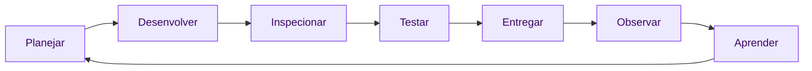

O resultado esperado não é simplesmente aumentar a quantidade de testes, mas utilizar as técnicas apropriadas conforme:

* criticidade;
* contexto;
* risco;
* arquitetura;
* frequência de mudança;
* impacto de uma falha.

---

# 14. Estudo de caso — Aplicação de gerenciamento de projetos

Os slides propõem uma situação em que uma empresa está lançando uma aplicação de gerenciamento de projetos, mas diversas funcionalidades apresentam falhas e prejudicam a experiência do usuário. 

## 14.1 Falhas identificadas

| Falha                                | Comportamento observado                             | Impacto                                         |
| ------------------------------------ | --------------------------------------------------- | ----------------------------------------------- |
| Atribuição incorreta de tarefas      | Tarefa é associada ao usuário errado ou não é salva | Trabalho perdido ou responsabilidade incorreta  |
| Falta de acompanhamento do progresso | Percentual e status não são atualizados             | Gestão toma decisões com informações incorretas |
| Problemas em integrações externas    | Calendário ou ferramenta externa não sincroniza     | Dados divergentes e retrabalho                  |

## 14.2 Possíveis causas

| Falha                   | Possíveis causas                                                                    |
| ----------------------- | ----------------------------------------------------------------------------------- |
| Atribuição de tarefas   | Requisito ambíguo, validação ausente, concorrência, teste de permissão insuficiente |
| Progresso desatualizado | Regra de cálculo incorreta, eventos não processados, integração incompleta          |
| Falha de integração     | Contrato incompatível, autenticação incorreta, indisponibilidade não tratada        |

## 14.3 Inspeções que poderiam prevenir os problemas

* revisão dos requisitos de atribuição;
* inspeção das regras de permissão;
* revisão dos critérios de atualização do progresso;
* inspeção do contrato da API;
* revisão do tratamento de indisponibilidade;
* análise de consistência transacional.

## 14.4 Testes que poderiam detectar as falhas

### Atribuição

* atribuir tarefa a usuário válido;
* tentar atribuir a usuário inexistente;
* atribuir simultaneamente por dois gestores;
* validar permissões;
* remover usuário que possui tarefas abertas.

### Progresso

* atualizar uma subtarefa;
* concluir todas as tarefas;
* reabrir tarefa;
* verificar arredondamento;
* validar projetos sem tarefas.

### Integração

* API externa disponível;
* API indisponível;
* resposta lenta;
* token expirado;
* resposta inválida;
* envio duplicado;
* recuperação após falha.

## 14.5 Processo de melhoria

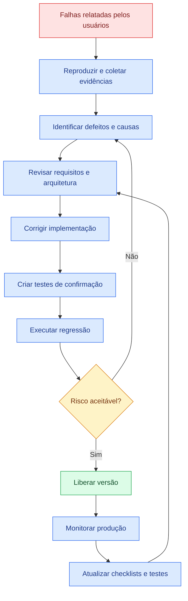

---

# 15. Exemplo complementar — Aplicativo de delivery

O e-book apresenta um aplicativo de delivery no qual falhas podem causar atrasos, cálculos incorretos de frete e cobranças indevidas. 

## 15.1 Inspeção

A equipe pode revisar:

* regra de cálculo de frete;
* regras de cupom;
* limites de desconto;
* tratamento de pagamento duplicado;
* segurança dos dados;
* integração com o entregador.

## 15.2 Testes

A equipe pode executar:

* pedido sem cupom;
* cupom válido;
* cupom expirado;
* dois cupons simultâneos;
* endereço fora da área de entrega;
* pagamento recusado;
* confirmação duplicada;
* cancelamento após cobrança;
* alta quantidade de pedidos.

## 15.3 Rastreabilidade

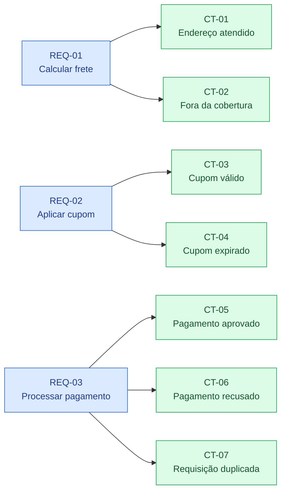

---

# 16. Checklist prático

## 16.1 Inspeção de requisitos

* [ ] O requisito possui objetivo claro?
* [ ] Existe apenas uma interpretação possível?
* [ ] Os termos utilizados estão definidos?
* [ ] O requisito é necessário?
* [ ] Ele é tecnicamente viável?
* [ ] Pode ser testado?
* [ ] Possui critérios de aceitação mensuráveis?
* [ ] Há regras para entradas inválidas?
* [ ] As permissões estão definidas?
* [ ] Os requisitos de segurança foram considerados?
* [ ] Os requisitos não funcionais estão definidos?
* [ ] Existe rastreabilidade com a necessidade de negócio?

## 16.2 Revisão de código

* [ ] O código implementa o requisito?
* [ ] Os nomes representam a intenção?
* [ ] Há validação das entradas?
* [ ] Os erros são tratados adequadamente?
* [ ] Informações sensíveis estão protegidas?
* [ ] Há duplicação desnecessária?
* [ ] A complexidade é aceitável?
* [ ] Dependências foram utilizadas corretamente?
* [ ] Existem testes para os principais caminhos?
* [ ] Logs são úteis e não expõem dados sensíveis?

## 16.3 Planejamento dos testes

* [ ] O escopo está definido?
* [ ] Os riscos foram identificados?
* [ ] Os tipos de teste foram escolhidos?
* [ ] O ambiente está disponível?
* [ ] Os dados foram preparados?
* [ ] As dependências externas foram consideradas?
* [ ] Os critérios de entrada estão claros?
* [ ] Os critérios de saída estão claros?
* [ ] Existe estratégia de regressão?
* [ ] Há responsáveis definidos?
* [ ] As evidências serão armazenadas?
* [ ] Os resultados serão comunicados?

---

# 17. Indicadores úteis

| Indicador                        | Finalidade                                     |
| -------------------------------- | ---------------------------------------------- |
| Defeitos encontrados em inspeção | Avaliar detecção antecipada                    |
| Defeitos encontrados por fase    | Identificar onde os problemas são introduzidos |
| Defeitos escapados para produção | Avaliar risco residual                         |
| Taxa de aprovação dos testes     | Acompanhar estabilidade                        |
| Cobertura de requisitos          | Verificar requisitos associados a testes       |
| Tempo médio de correção          | Avaliar eficiência da resposta                 |
| Reincidência de defeitos         | Identificar correções incompletas              |
| Taxa de reabertura               | Avaliar qualidade das correções                |
| Automação da regressão           | Acompanhar capacidade de feedback rápido       |
| Incidentes por versão            | Comparar qualidade das entregas                |

Indicadores não devem ser usados isoladamente para avaliar pessoas. Eles devem apoiar decisões e a melhoria do processo.

---

# 18. Erros comuns de interpretação

## “Testar é provar que o sistema não tem defeitos”

Incorreto. Testar reduz incerteza e encontra defeitos, mas não prova sua inexistência.

## “Inspeção é apenas revisar código”

Incorreto. Requisitos, arquitetura, modelos, casos de teste e outros artefatos também podem ser inspecionados.

## “Qualidade é responsabilidade do testador”

Incorreto. O testador possui papel especializado, mas a qualidade é responsabilidade de toda a equipe.

## “Automação elimina testes manuais”

Incorreto. Automação e exploração humana atendem a objetivos diferentes.

## “Os testes devem começar quando o código estiver pronto”

Incorreto. Revisão de requisitos, definição de critérios e planejamento de testes devem começar antecipadamente.

## “Se o sistema atende ao requisito, o usuário ficará satisfeito”

Não necessariamente. Um requisito pode estar incompleto ou não representar a necessidade real. Por isso, também é necessária a validação.

---

# 19. Questões para revisão

<details>
<summary><strong>1. Qual é a principal diferença entre inspeção e teste dinâmico?</strong></summary>

A inspeção examina artefatos sem executar o software. O teste dinâmico executa o componente ou sistema e observa seu comportamento.

</details>

<details>
<summary><strong>2. Qual é a relação entre erro, defeito e falha?</strong></summary>

Um erro humano pode introduzir um defeito em um artefato. Quando uma condição ativa esse defeito durante a execução, pode ocorrer uma falha observável.

</details>

<details>
<summary><strong>3. Por que encontrar defeitos antecipadamente é vantajoso?</strong></summary>

Porque impede que o problema se propague para projeto, código, testes e produção, reduzindo retrabalho, custo, prazo e risco.

</details>

<details>
<summary><strong>4. Qual é a diferença entre verificação e validação?</strong></summary>

Verificação analisa se o produto está sendo construído de acordo com as especificações. Validação analisa se o produto atende à necessidade real do usuário.

</details>

<details>
<summary><strong>5. A inspeção substitui os testes dinâmicos?</strong></summary>

Não. A inspeção encontra determinados defeitos antecipadamente, mas não avalia adequadamente comportamentos dependentes da execução, como desempenho e concorrência.

</details>

<details>
<summary><strong>6. Qual é a principal vantagem das inspeções nas fases iniciais?</strong></summary>

Detectar e corrigir problemas antes que eles se propaguem e antes da execução do software, reduzindo retrabalho e custos. Essa é também a resposta destacada no quiz dos slides. 

</details>

<details>
<summary><strong>7. Por que o analista de testes é chamado de guardião da qualidade?</strong></summary>

Porque ajuda a planejar avaliações, identificar riscos, detectar defeitos, comunicar problemas e apoiar decisões sobre a qualidade e a liberação do produto.

</details>

---

# 20. Resumo para prova

```text
TESTE
Avalia produtos de trabalho e sistemas para encontrar defeitos,
verificar requisitos, validar necessidades e reduzir riscos.

INSPEÇÃO
Revisão estruturada de requisitos, projeto, código ou outros
artefatos sem necessidade de executar o software.

TESTE ESTÁTICO
Avaliação sem execução: revisões, inspeções e análise estática.

TESTE DINÂMICO
Avaliação com execução do componente ou sistema.

ERRO
Ação ou decisão humana incorreta.

DEFEITO
Imperfeição introduzida em um artefato.

FALHA
Manifestação observável de um defeito durante a execução.

VERIFICAÇÃO
Estamos construindo corretamente o produto?

VALIDAÇÃO
Estamos construindo o produto correto?

PRINCIPAL BENEFÍCIO
Detecção antecipada, redução de riscos, custos e retrabalho.

PRINCIPAL LIMITAÇÃO
Não é possível testar todas as combinações nem garantir ausência
total de defeitos.

ANALISTA DE TESTES
Analisa riscos, planeja, projeta, executa, registra defeitos,
comunica resultados e promove melhoria contínua.
```

---

# 21. Mapa mental do Tema 01

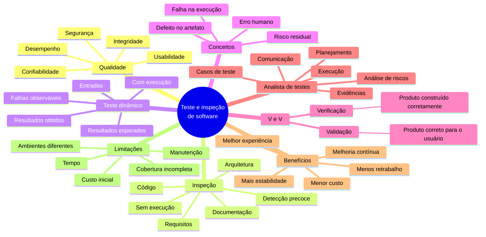

---

# 22. Conclusão

Teste e inspeção de software são práticas essenciais e complementares.

A inspeção antecipa a identificação de defeitos em requisitos, modelos, código e outros artefatos. Os testes dinâmicos observam o comportamento do software em execução e verificam se os resultados correspondem ao esperado.

Quando distribuídas durante todo o ciclo de desenvolvimento, essas práticas:

* reduzem a propagação de defeitos;
* diminuem retrabalho;
* fornecem feedback antecipado;
* aumentam a confiança nas mudanças;
* melhoram segurança e estabilidade;
* promovem aprendizado;
* favorecem a satisfação dos usuários.

O maior ganho não está apenas em encontrar problemas. Está em criar um processo capaz de **preveni-los, detectá-los cedo, compreender suas causas e evitar sua recorrência**.

---

# Referências do material

* ANICHE, Mauricio. *Testes automatizados de software: um guia prático*. São Paulo: Casa do Código, 2015.
* DELAMARO, Márcio; JINO, Mario; MALDONADO, José. *Introdução ao teste de software*. 2. ed. Rio de Janeiro: Campus, 2016.
* FÉLIX, Rafael. *Teste de software*. São Paulo: Pearson, 2016.
* POLO, Rodrigo Cantú. *Validação e teste de software*. São Paulo: Contentus, 2020.
* PRESSMAN, Roger S. *Engenharia de software: uma abordagem profissional*. 8. ed. Porto Alegre: AMGH, 2016.
* SANTOS, Luiz Diego Vidal; OLIVEIRA, Catuxe Varjão de Santana. *Introdução à garantia de qualidade de software*. Timburi: Cia do eBook, 2017.

[1]: https://www.iso.org/standard/22749.html?utm_source=chatgpt.com "ISO/IEC 9126-1:2001 - Software engineering"
[2]: https://istqb.org/wp-content/uploads/2024/11/ISTQB_CTFL_Syllabus_v4.0.1.pdf "ISTQB Certified Tester - Foundation Level Syllabus v4.0"
