# Teste e Inspeção de Software: Técnicas e Automatização

## Tema 02 — Técnicas de Teste de Software

> **Objetivo do capítulo:** compreender as principais técnicas de teste de software, identificar quando aplicá-las e relacioná-las às diferentes fases do desenvolvimento, aos riscos do produto e às necessidades dos usuários.

Esta documentação consolida o conteúdo da leitura digital, dos slides e do podcast do Tema 02.   

---

## 1. Visão geral

O desenvolvimento de software é formado por atividades interdependentes. Um componente pode funcionar corretamente de maneira isolada e, ainda assim, falhar quando integrado a outros componentes, executado sob carga ou utilizado em determinado dispositivo.

Por isso, não existe uma única técnica capaz de avaliar todos os aspectos de um sistema. É necessário combinar testes que observem:

* unidades isoladas;
* integrações;
* comportamento completo do sistema;
* atendimento às necessidades do usuário;
* estrutura interna do código;
* entradas e saídas;
* desempenho;
* segurança;
* usabilidade;
* compatibilidade;
* efeitos provocados por alterações.

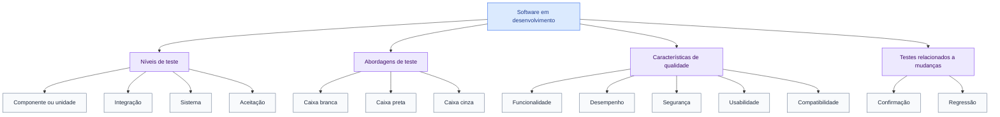

A escolha das técnicas deve considerar:

1. o estágio do desenvolvimento;
2. o tipo de defeito procurado;
3. o risco da funcionalidade;
4. a arquitetura do sistema;
5. os requisitos funcionais e não funcionais;
6. o custo de uma possível falha.

---

## 2. Objetivos de aprendizagem

Ao final do Tema 02, espera-se que o estudante seja capaz de:

* explicar as principais técnicas de teste;
* diferenciar níveis, tipos e abordagens;
* aplicar técnicas apropriadas em cada fase;
* distinguir caixa branca, caixa preta e caixa cinza;
* compreender testes unitários, de integração, sistema e aceitação;
* reconhecer a função dos testes de regressão;
* avaliar desempenho, segurança, usabilidade e compatibilidade;
* relacionar técnicas de teste a riscos e benefícios.

---

# 3. O que são técnicas de teste de software

Técnicas de teste são métodos organizados para:

* definir cenários;
* selecionar dados de entrada;
* estabelecer resultados esperados;
* executar verificações;
* identificar defeitos;
* observar falhas;
* fornecer evidências sobre a qualidade do produto.

O material destaca que as técnicas variam conforme sua abordagem e aplicabilidade. Cada uma procura defeitos diferentes e produz informações distintas sobre o software. 

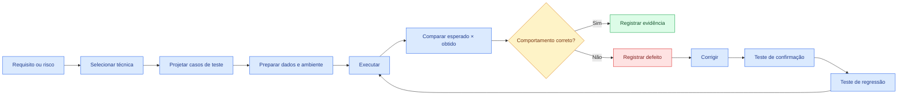

---

# 4. Formas de classificar os testes

É comum organizar os testes por diferentes dimensões.

## 4.1 Por nível

Representa **onde** o teste é executado na estrutura do sistema:

* componente ou unidade;
* integração;
* sistema;
* aceitação.

## 4.2 Pela visibilidade da estrutura interna

Representa **quanto o testador conhece da implementação**:

* caixa branca;
* caixa preta;
* caixa cinza.

## 4.3 Pelo objetivo de qualidade

Representa **qual característica está sendo avaliada**:

* funcionalidade;
* desempenho;
* segurança;
* usabilidade;
* compatibilidade.

## 4.4 Pela relação com mudanças

Representa **como o teste é usado após uma alteração**:

* teste de confirmação;
* teste de regressão.

Essas classificações não são excludentes. Um mesmo caso pode ser, por exemplo:

> teste de integração, de segurança e caixa cinza.

---

# 5. Níveis de teste

## 5.1 Visão geral

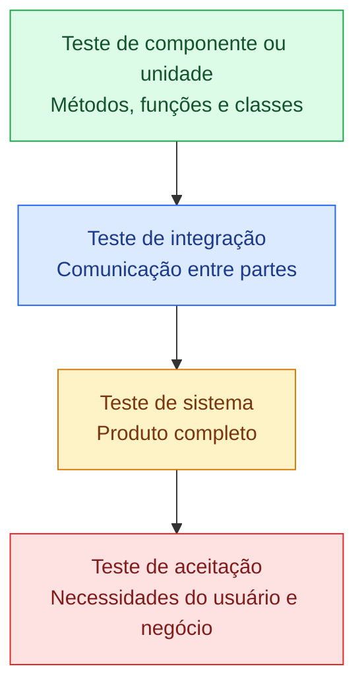

Quanto mais baixo o nível:

* menor o escopo;
* mais rápida tende a ser a execução;
* mais simples tende a ser a localização do defeito.

Quanto mais alto o nível:

* maior o número de componentes envolvidos;
* maior a proximidade com o uso real;
* maior a complexidade de diagnóstico;
* maior o custo de execução.

---

## 5.2 Teste unitário ou de componente

O teste unitário verifica pequenas unidades de implementação de forma isolada.

Exemplos:

* método;
* função;
* classe;
* componente;
* regra de cálculo;
* validador;
* conversor.

O material destaca que esse teste normalmente é realizado pelos desenvolvedores e é especialmente útil nas fases iniciais. 

### Objetivos

* verificar regras isoladas;
* encontrar defeitos rapidamente;
* facilitar a localização da causa;
* apoiar refatorações;
* reduzir o custo de correção.

### Exemplo de regra

```java
public class CalculadoraDesconto {

    public BigDecimal calcular(BigDecimal valor, BigDecimal percentual) {
        if (valor == null || percentual == null) {
            throw new IllegalArgumentException("Valor e percentual são obrigatórios.");
        }

        if (percentual.compareTo(BigDecimal.ZERO) < 0
                || percentual.compareTo(new BigDecimal("100")) > 0) {
            throw new IllegalArgumentException("Percentual inválido.");
        }

        return valor.subtract(
            valor.multiply(percentual)
                 .divide(new BigDecimal("100"))
        );
    }
}
```

### Casos de teste relevantes

| Cenário                    | Entrada       | Resultado esperado |
| -------------------------- | ------------- | ------------------ |
| Desconto normal            | R$ 100 e 10%  | R$ 90              |
| Sem desconto               | R$ 100 e 0%   | R$ 100             |
| Desconto total             | R$ 100 e 100% | R$ 0               |
| Percentual negativo        | -1%           | Exceção            |
| Percentual acima do limite | 101%          | Exceção            |
| Valor ausente              | `null`        | Exceção            |

### Vantagens

* execução rápida;
* falha localizada;
* baixo custo;
* fácil automação;
* feedback imediato.

### Limitações

Um teste unitário aprovado não garante que:

* o banco de dados funcione;
* a API externa responda corretamente;
* os módulos se integrem;
* a interface seja compreensível;
* o sistema completo atenda ao usuário.

---

## 5.3 Teste de integração

O teste de integração avalia a comunicação entre partes do sistema.

Pode envolver:

* classe e repositório;
* serviço e banco de dados;
* aplicação e fila;
* microsserviço e API;
* frontend e backend;
* sistemas internos e externos.

### Objetivos

* verificar contratos;
* validar troca de dados;
* detectar incompatibilidades;
* avaliar tratamento de falhas;
* verificar transações;
* confirmar sequências de comunicação.

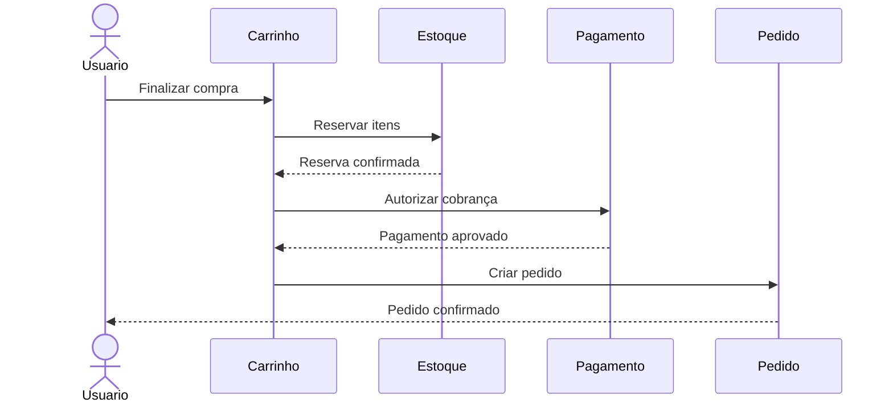

O teste de integração não deve verificar apenas o caminho de sucesso.

### Cenários de integração

* estoque indisponível;
* pagamento recusado;
* timeout;
* resposta incompleta;
* autenticação expirada;
* mensagem duplicada;
* indisponibilidade temporária;
* falha após execução parcial;
* compensação de transação.

### Exemplo de risco

O módulo de pagamento pode funcionar isoladamente, assim como o módulo de pedidos. Entretanto, uma falha pode ocorrer quando:

1. o pagamento é aprovado;
2. a criação do pedido falha;
3. o cliente é cobrado;
4. nenhum pedido é registrado.

Esse defeito somente aparece quando a interação entre módulos é testada.

---

## 5.4 Teste de sistema

O teste de sistema avalia o produto completo, integrado e executado em um ambiente representativo.

O material o descreve como uma avaliação abrangente do software, considerando requisitos funcionais e não funcionais. 

### Objetivos

* validar fluxos completos;
* avaliar requisitos funcionais;
* avaliar requisitos não funcionais;
* verificar configuração;
* observar comportamento global;
* simular situações reais.

### Exemplo de fluxo de e-commerce


O teste de sistema deve verificar o fluxo completo e suas variações:

* usuário autenticado ou anônimo;
* produto disponível ou indisponível;
* desconto válido ou inválido;
* endereço atendido ou não atendido;
* pagamento aprovado ou recusado;
* falha no envio da notificação.

---

## 5.5 Teste de aceitação

O teste de aceitação avalia se o sistema:

* atende aos requisitos do usuário;
* suporta os processos de negócio;
* está apto para utilização;
* possui risco aceitável para liberação.

O material destaca a participação do cliente ou usuário na validação do produto. 

### Modalidades comuns

* aceitação do usuário;
* aceitação operacional;
* aceitação contratual;
* aceitação regulatória;
* testes alfa;
* testes beta.

### Exemplo em formato BDD

```gherkin
Funcionalidade: Aplicar cupom de desconto

  Cenário: Aplicar cupom válido
    Dado que o cliente possui produtos no carrinho
    E existe um cupom válido de 10%
    Quando o cliente informar o cupom
    Então o sistema deve reduzir o total do pedido em 10%
    E deve exibir o desconto aplicado
```

### Pergunta central

> O produto está pronto e adequado para cumprir sua finalidade?

---

# 6. Abordagens de caixa preta, branca e cinza

A leitura digital e os slides apresentam a distinção visual entre as três abordagens: caixa preta observa entradas e saídas; caixa branca examina a estrutura interna; caixa cinza utiliza conhecimento parcial da implementação.  

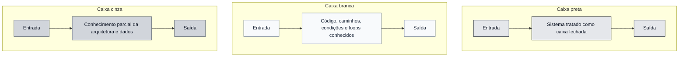

---

## 6.1 Teste de caixa preta

O teste de caixa preta avalia o comportamento externo, sem depender do conhecimento do código-fonte.

### Base para criação dos testes

* requisitos;
* regras de negócio;
* histórias de usuário;
* contratos de API;
* protótipos;
* manuais;
* critérios de aceitação.

### Defeitos encontrados

* função ausente;
* resultado incorreto;
* validação inadequada;
* mensagem incorreta;
* regra de negócio violada;
* erro de interface;
* comportamento inconsistente.

### Exemplo

Regra:

> Usuários entre 18 e 60 anos podem contratar determinado produto.

Uma divisão simples de classes seria:

| Classe          |   Valores | Resultado |
| --------------- | --------: | --------- |
| Menor de idade  |    `< 18` | Rejeitado |
| Faixa válida    | `18 a 60` | Aceito    |
| Acima do limite |    `> 60` | Rejeitado |

Casos de limite:

* 17;
* 18;
* 19;
* 59;
* 60;
* 61.

---

## 6.2 Técnicas comuns de caixa preta

### Particionamento de equivalência

Divide os dados em grupos que deveriam produzir comportamentos semelhantes.

Exemplo: campo de quantidade entre 1 e 100.

| Partição          | Valores       |
| ----------------- | ------------- |
| Inválida inferior | Menor que 1   |
| Válida            | De 1 a 100    |
| Inválida superior | Maior que 100 |

Não é necessário testar todos os valores. Seleciona-se um representante de cada partição, complementado por testes de limite.

### Análise de valor-limite

Concentra-se nos pontos de transição entre classes.

Para o intervalo de 1 a 100:

```text
0, 1, 2, 99, 100, 101
```

### Tabela de decisão

Adequada para regras com múltiplas condições.

Exemplo: concessão de frete grátis.

| Condição/ação    | Regra 1 | Regra 2 | Regra 3 | Regra 4 |
| ---------------- | ------: | ------: | ------: | ------: |
| Cliente premium? |     Sim |     Sim |     Não |     Não |
| Compra ≥ R$ 200? |     Sim |     Não |     Sim |     Não |
| Frete grátis?    |     Sim |     Sim |     Sim |     Não |

### Transição de estados

Adequada quando o comportamento depende do estado atual.

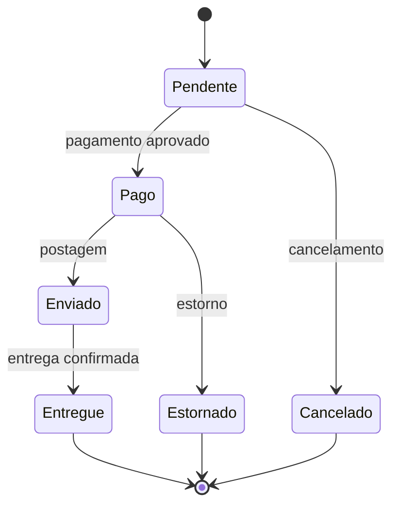

Possíveis testes:

* cancelar pedido pendente;
* tentar cancelar pedido entregue;
* enviar pedido ainda não pago;
* estornar pagamento aprovado;
* tentar estornar pedido já estornado.

---

## 6.3 Teste de caixa branca

O teste de caixa branca avalia a estrutura interna do código.

O podcast destaca sua utilidade na identificação de condições lógicas incorretas, loops inadequados e defeitos em áreas complexas. 

### Elementos analisados

* instruções;
* decisões;
* condições;
* caminhos;
* loops;
* tratamento de exceções;
* fluxo de dados;
* cobertura do código.

### Exemplo

```java
public String classificar(int idade, boolean possuiAutorizacao) {
    if (idade >= 18) {
        return "ADULTO";
    }

    if (idade >= 16 && possuiAutorizacao) {
        return "AUTORIZADO";
    }

    return "NAO_AUTORIZADO";
}
```

Para cobrir as decisões, são necessários casos como:

| Idade | Autorização | Resultado      |
| ----: | ----------- | -------------- |
|    20 | Não         | ADULTO         |
|    17 | Sim         | AUTORIZADO     |
|    17 | Não         | NAO_AUTORIZADO |
|    15 | Sim         | NAO_AUTORIZADO |

### Coberturas estruturais

#### Cobertura de instruções

Verifica se cada instrução foi executada ao menos uma vez.

#### Cobertura de decisões

Verifica se cada decisão produziu resultados verdadeiro e falso.

#### Cobertura de condições

Verifica cada condição booleana individualmente.

#### Cobertura de caminhos

Procura executar diferentes rotas possíveis pelo código.

> Cobertura alta não significa ausência de defeitos. Ela indica o quanto da estrutura foi exercitado, não a qualidade das verificações realizadas.

---

## 6.4 Teste de caixa cinza

O teste de caixa cinza combina a visão externa com conhecimento parcial da implementação.

O testador pode conhecer:

* estrutura do banco de dados;
* endpoints;
* arquitetura;
* filas utilizadas;
* formato dos tokens;
* regras de cache;
* integrações internas.

### Exemplo

Em um teste de recuperação de senha, o testador:

1. utiliza a interface pública;
2. conhece a tabela de tokens;
3. verifica se o token foi persistido;
4. valida a expiração;
5. tenta reutilizar o token;
6. confirma que a senha foi alterada corretamente.

### Benefícios

* cenários externos mais precisos;
* melhor avaliação de integrações;
* identificação de problemas de arquitetura;
* cobertura entre comportamento e estrutura.

---

## 6.5 Comparação

| Critério             | Caixa preta                       | Caixa branca                           | Caixa cinza                           |
| -------------------- | --------------------------------- | -------------------------------------- | ------------------------------------- |
| Conhecimento interno | Nenhum ou irrelevante             | Completo                               | Parcial                               |
| Foco                 | Comportamento externo             | Estrutura interna                      | Comportamento e arquitetura           |
| Base                 | Requisitos                        | Código                                 | Requisitos e conhecimento técnico     |
| Defeitos típicos     | Regra incorreta, entrada inválida | Caminho não executado, condição errada | Integração, dados e configuração      |
| Participantes comuns | Testadores e usuários             | Desenvolvedores                        | Testadores técnicos e desenvolvedores |
| Aplicação            | Sistema e aceitação               | Componente                             | Integração e sistema                  |

---

# 7. Teste de regressão

O teste de regressão verifica se uma alteração introduziu efeitos indesejados em funcionalidades que já funcionavam.

O podcast apresenta o exemplo de uma nova funcionalidade que faz um botão antigo deixar de responder. 

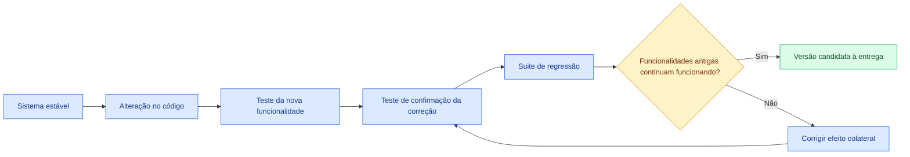

## 7.1 Confirmação × regressão

| Teste       | Pergunta                                                |
| ----------- | ------------------------------------------------------- |
| Confirmação | O defeito corrigido realmente deixou de ocorrer?        |
| Regressão   | A correção ou alteração quebrou outra parte do sistema? |

## 7.2 Quando executar regressão

* correção de defeito;
* nova funcionalidade;
* refatoração;
* alteração em biblioteca;
* mudança de banco;
* atualização de infraestrutura;
* alteração de configuração;
* modificação em contrato de API;
* mudança de regra de negócio.

## 7.3 Priorização

Nem toda regressão precisa executar todos os testes em todas as alterações.

Pode-se priorizar:

* funcionalidades críticas;
* partes diretamente alteradas;
* módulos dependentes;
* fluxos mais utilizados;
* áreas com histórico de defeitos;
* recursos de maior risco.

---

# 8. Testes funcionais e não funcionais

## 8.1 Teste funcional

Verifica **o que o sistema faz**.

Exemplos:

* cadastrar usuário;
* calcular imposto;
* emitir relatório;
* autorizar pagamento;
* atualizar estoque;
* cancelar pedido.

## 8.2 Teste não funcional

Verifica **como o sistema se comporta**.

Exemplos:

* velocidade;
* estabilidade;
* segurança;
* usabilidade;
* acessibilidade;
* compatibilidade;
* confiabilidade.

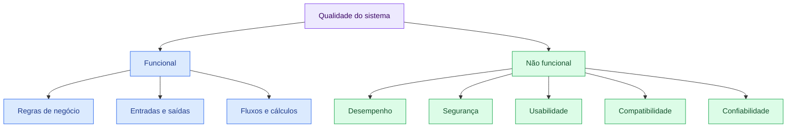

Um sistema pode executar corretamente sua função e, mesmo assim, ser inadequado porque:

* demora demais;
* expõe dados;
* não suporta a quantidade de usuários;
* é difícil de utilizar;
* não funciona em determinado navegador.

---

# 9. Teste de desempenho

O teste de desempenho avalia o comportamento do software sob diferentes condições de utilização.

O material relaciona esse teste à resposta, estabilidade e escalabilidade do sistema. 

## 9.1 Teste de carga

Avalia o comportamento sob a carga esperada.

Exemplo:

> 500 usuários simultâneos realizando consultas.

## 9.2 Teste de estresse

Ultrapassa os limites esperados para descobrir o ponto de degradação ou falha.

Exemplo:

> aumentar gradualmente de 500 para 5.000 usuários.

## 9.3 Teste de pico

Avalia mudanças bruscas de demanda.

Exemplo:

> passar de 100 para 3.000 acessos em poucos segundos.

## 9.4 Teste de resistência

Mantém determinada carga por longo período.

Objetivos:

* detectar vazamento de memória;
* observar degradação;
* avaliar estabilidade;
* identificar acúmulo de conexões.

## 9.5 Indicadores

* tempo de resposta;
* vazão;
* taxa de erro;
* uso de CPU;
* consumo de memória;
* conexões;
* filas;
* disponibilidade.

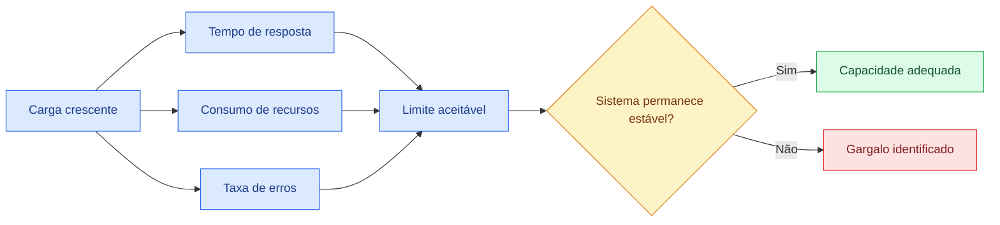

---

# 10. Teste de segurança

O teste de segurança procura identificar vulnerabilidades e verificar se os mecanismos de proteção funcionam adequadamente.

## 10.1 Aspectos avaliados

* autenticação;
* autorização;
* confidencialidade;
* integridade;
* proteção de dados;
* gerenciamento de sessão;
* validação de entradas;
* registros de auditoria;
* comunicação segura;
* tratamento de erros.

## 10.2 Exemplos de cenários

* usuário comum acessando função administrativa;
* reutilização de sessão expirada;
* alteração de identificador na URL;
* entrada maliciosa;
* tentativa de força bruta;
* acesso direto a arquivo protegido;
* exposição de informações em mensagens de erro;
* ausência de auditoria em operação sensível.

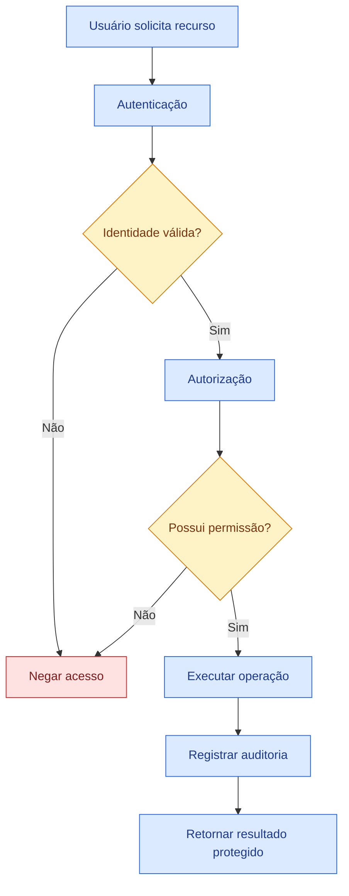

Testar segurança não significa apenas tentar “invadir” o sistema. Também inclui verificar requisitos, configurações e controles esperados.

---

# 11. Teste de usabilidade

O teste de usabilidade avalia a facilidade com que usuários conseguem utilizar o produto.

O podcast destaca a participação direta dos usuários e a coleta de feedback sobre interface e navegação. 

## 11.1 Aspectos avaliados

* facilidade de aprendizado;
* clareza;
* eficiência;
* consistência;
* prevenção de erros;
* recuperação de erros;
* satisfação;
* acessibilidade;
* compreensão das mensagens.

## 11.2 Exemplo

Tarefa:

> localizar um produto, adicioná-lo ao carrinho e finalizar a compra.

Indicadores:

* tempo para concluir;
* número de erros;
* quantidade de ajuda necessária;
* abandono;
* dificuldade relatada;
* satisfação do usuário.

## 11.3 Problemas comuns

* botão sem destaque;
* linguagem técnica;
* fluxo excessivamente longo;
* mensagem de erro genérica;
* ausência de confirmação;
* navegação inconsistente;
* informação importante escondida.

---

# 12. Teste de compatibilidade

O teste de compatibilidade verifica o funcionamento do software em diferentes combinações de ambiente.

## 12.1 Variações relevantes

* navegadores;
* versões de navegador;
* sistemas operacionais;
* dispositivos;
* resoluções;
* bancos de dados;
* versões de APIs;
* redes;
* equipamentos;
* idiomas e localidades.

### Matriz simplificada

| Plataforma | Chrome | Firefox | Edge | Safari |
| ---------- | -----: | ------: | ---: | -----: |
| Windows    |    Sim |     Sim |  Sim |      — |
| Linux      |    Sim |     Sim |    — |      — |
| macOS      |    Sim |     Sim |    — |    Sim |
| Android    |    Sim |       — |  Sim |      — |
| iOS        |      — |       — |    — |    Sim |

A matriz deve ser definida com base no perfil real de utilização, e não apenas na quantidade de combinações disponíveis.

---

# 13. Aplicação das técnicas nas fases do desenvolvimento

Os slides apresentam um direcionamento prático:

* desenvolvimento inicial: teste unitário e caixa branca;
* integração: teste de integração e caixa cinza;
* sistema: teste de sistema e caixa preta;
* validação: aceitação, usabilidade e segurança;
* manutenção: regressão e compatibilidade. 

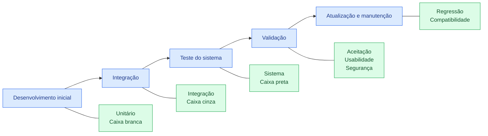

## 13.1 Matriz de aplicação

| Fase          | Técnicas prioritárias                          | Objetivo                          |
| ------------- | ---------------------------------------------- | --------------------------------- |
| Requisitos    | Caixa preta, tabela de decisão, valores-limite | Tornar regras verificáveis        |
| Implementação | Unitário, caixa branca                         | Verificar lógica isolada          |
| Integração    | Integração, caixa cinza                        | Validar comunicação               |
| Sistema       | Sistema, caixa preta                           | Avaliar produto completo          |
| Validação     | Aceitação, usabilidade, segurança              | Confirmar adequação ao uso        |
| Entrega       | Regressão, desempenho, compatibilidade         | Reduzir risco de liberação        |
| Manutenção    | Confirmação e regressão                        | Preservar comportamento existente |

---

# 14. Particularidades e benefícios

## 14.1 Teste unitário

**Particularidade:** escopo pequeno e isolado.

**Benefícios:**

* retorno rápido;
* fácil localização de defeitos;
* segurança para refatorar;
* menor custo de correção.

## 14.2 Teste de integração

**Particularidade:** verifica dependências e contratos.

**Benefícios:**

* detecta incompatibilidades;
* encontra problemas de dados;
* verifica tratamento de falhas;
* valida comunicação real.

## 14.3 Teste de sistema

**Particularidade:** avalia o produto completo.

**Benefícios:**

* valida fluxos ponta a ponta;
* aproxima-se do ambiente real;
* combina aspectos funcionais e não funcionais.

## 14.4 Teste de aceitação

**Particularidade:** foco no usuário e no negócio.

**Benefícios:**

* valida valor;
* reduz risco de rejeição;
* apoia decisão de liberação.

## 14.5 Teste de regressão

**Particularidade:** executado após mudanças.

**Benefícios:**

* detecta efeitos colaterais;
* protege funcionalidades existentes;
* aumenta confiança nas entregas.

## 14.6 Testes de desempenho e segurança

**Particularidade:** avaliam riscos não funcionais críticos.

**Benefícios:**

* aumentam robustez;
* protegem dados;
* identificam gargalos;
* reduzem risco operacional.

## 14.7 Usabilidade e compatibilidade

**Particularidade:** observam contexto de uso.

**Benefícios:**

* melhor experiência;
* menor necessidade de suporte;
* maior alcance do produto;
* redução de abandono.

---

# 15. Estratégia baseada em risco

Nem todas as funcionalidades possuem a mesma criticidade.

Uma estratégia de teste deve considerar:

```text
Risco = probabilidade de falha × impacto da falha
```

## 15.1 Exemplos

| Funcionalidade        | Probabilidade | Impacto    | Prioridade |
| --------------------- | ------------- | ---------- | ---------- |
| Pagamento             | Média         | Muito alto | Crítica    |
| Login                 | Média         | Alto       | Alta       |
| Alteração de tema     | Baixa         | Baixo      | Baixa      |
| Cálculo médico        | Média         | Muito alto | Crítica    |
| Exportação secundária | Baixa         | Médio      | Média      |

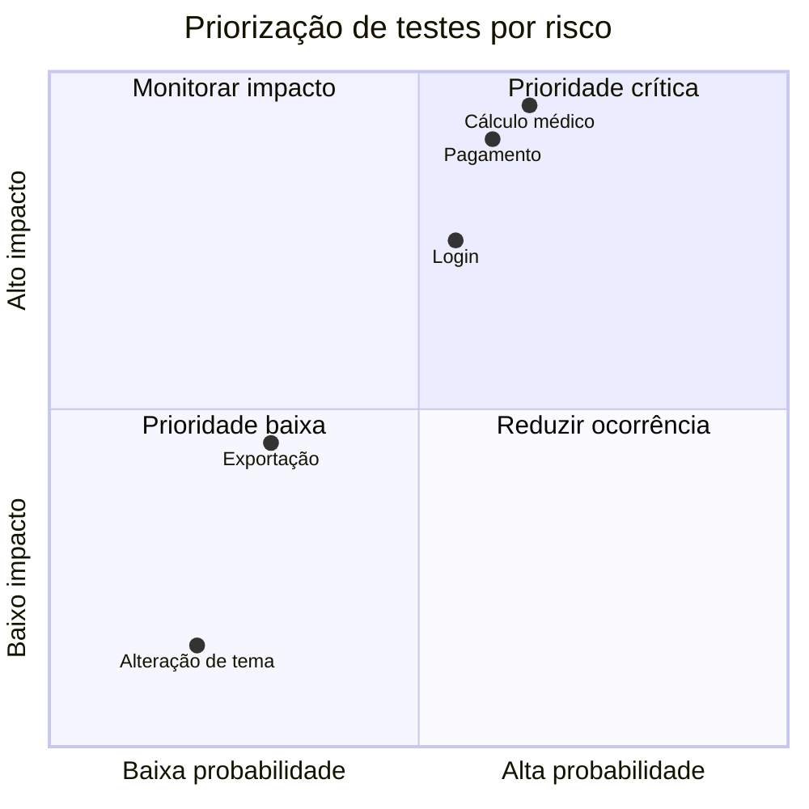

Funcionalidades críticas devem receber:

* maior profundidade;
* mais níveis de teste;
* maior cobertura;
* testes negativos;
* avaliação de segurança;
* avaliação de desempenho;
* automação de regressão;
* monitoramento após a entrega.

---

# 16. Estudo de caso — Aplicativo de monitoramento de saúde

Os slides apresentam um aplicativo com cálculo de frequência cardíaca, monitoramento do sono e alertas personalizados. Pequenos erros em funcionalidades integradas começaram a gerar alertas incorretos. 

## 16.1 Riscos

* cálculo incorreto;
* alerta desnecessário;
* ausência de alerta necessário;
* interpretação errada dos dados;
* falha de integração com sensores;
* perda de dados;
* exposição de informações pessoais.

## 16.2 Estratégia por fase

### Desenvolvimento inicial

**Testes unitários e caixa branca**

* cálculo de média cardíaca;
* classificação de faixas;
* transformação de dados;
* validação de limites;
* geração de alertas.

### Integração

**Testes de integração e caixa cinza**

* sensor → aplicativo;
* aplicativo → serviço de processamento;
* processamento → notificações;
* sincronização local e remota;
* comportamento sem conexão.

### Sistema

**Teste de sistema e caixa preta**

* monitoramento completo;
* cadastro de limites;
* geração de alertas;
* histórico;
* alteração de preferências;
* recuperação após falha.

### Validação

**Aceitação, usabilidade e segurança**

* entendimento dos alertas;
* clareza das informações;
* proteção dos dados;
* controle de acesso;
* consentimento do usuário.

### Manutenção

**Regressão e compatibilidade**

* atualizações não podem alterar cálculos existentes;
* novas versões devem funcionar nos dispositivos suportados;
* mudanças em sensores não podem quebrar a integração.

---

## 16.3 Fluxo crítico

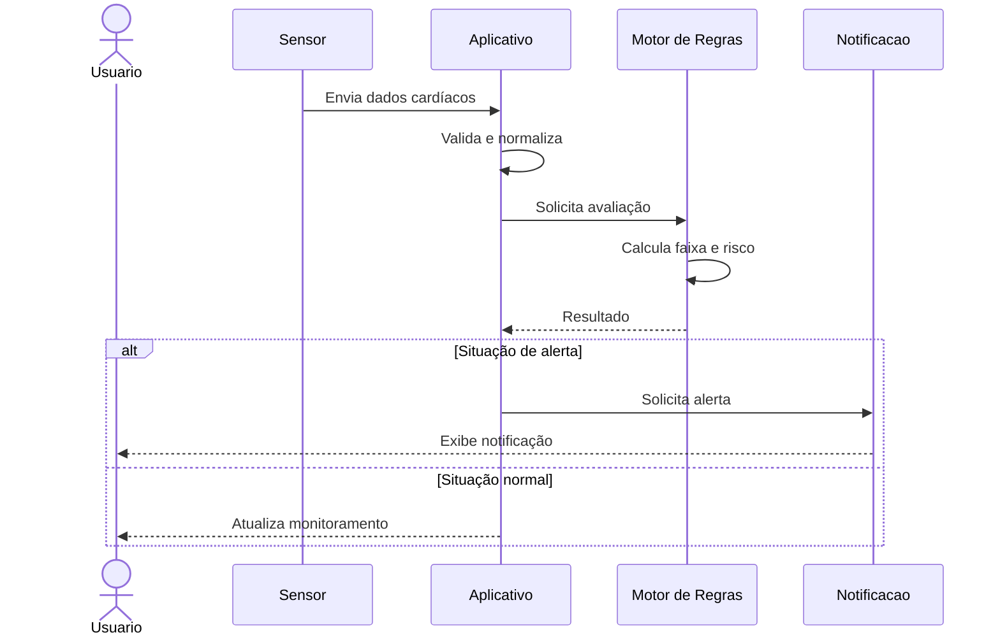

## 16.4 Casos de teste essenciais

| Cenário                           | Técnica     | Resultado esperado          |
| --------------------------------- | ----------- | --------------------------- |
| Frequência dentro da faixa        | Unitário    | Nenhum alerta               |
| Valor acima do limite             | Unitário    | Alerta correto              |
| Sensor envia dado inválido        | Integração  | Dado rejeitado e registrado |
| Conexão interrompida              | Integração  | Recuperação sem duplicidade |
| Alteração do limite pelo usuário  | Sistema     | Nova regra aplicada         |
| Usuário não entende o alerta      | Usabilidade | Interface deve ser revista  |
| Outro usuário acessa dados        | Segurança   | Acesso negado               |
| Atualização altera cálculo antigo | Regressão   | Defeito detectado           |

---

# 17. Estudo de caso — Aplicativo de compras on-line

A leitura digital apresenta um sistema com catálogo, carrinho, descontos e finalização de compra. 

## 17.1 Aplicação das técnicas

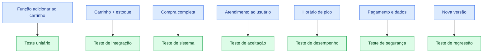

## 17.2 Cenários prioritários

* adicionar produto disponível;
* adicionar produto sem estoque;
* alterar quantidade;
* remover item;
* aplicar desconto válido;
* aplicar desconto expirado;
* pagar com sucesso;
* receber recusa;
* evitar cobrança duplicada;
* manter carrinho após interrupção;
* suportar pico de acessos.

---

# 18. Como elaborar um bom caso de teste

## 18.1 Estrutura recomendada

```text
Identificador:
Título:
Objetivo:
Requisito relacionado:
Prioridade:
Pré-condições:
Dados de entrada:
Passos:
Resultado esperado:
Resultado obtido:
Situação:
Evidências:
```

## 18.2 Exemplo

```text
Identificador: CT-CUPOM-003
Título: Rejeitar cupom expirado
Objetivo: Verificar que cupons fora da validade não sejam aplicados.
Requisito: RF-027
Prioridade: Alta

Pré-condições:
- Cliente autenticado.
- Carrinho com total de R$ 200.
- Cupom TESTE10 expirado.

Passos:
1. Acessar o carrinho.
2. Informar TESTE10.
3. Selecionar "Aplicar".

Resultado esperado:
- O desconto não deve ser aplicado.
- O total deve permanecer em R$ 200.
- Deve ser exibida uma mensagem informando que o cupom expirou.
```

## 18.3 Características de um bom caso

* claro;
* objetivo;
* reproduzível;
* rastreável;
* independente quando possível;
* focado em um comportamento;
* com resultado esperado verificável;
* com dados explicitamente definidos.

---

# 19. Testes positivos e negativos

## 19.1 Teste positivo

Utiliza condições válidas e verifica o funcionamento esperado.

Exemplo:

* login com credenciais válidas;
* pagamento autorizado;
* arquivo no formato aceito.

## 19.2 Teste negativo

Utiliza condições inválidas, inesperadas ou extremas.

Exemplo:

* senha incorreta;
* campo obrigatório vazio;
* quantidade negativa;
* arquivo corrompido;
* API indisponível;
* operação sem permissão.

Uma estratégia baseada apenas em testes positivos é insuficiente.

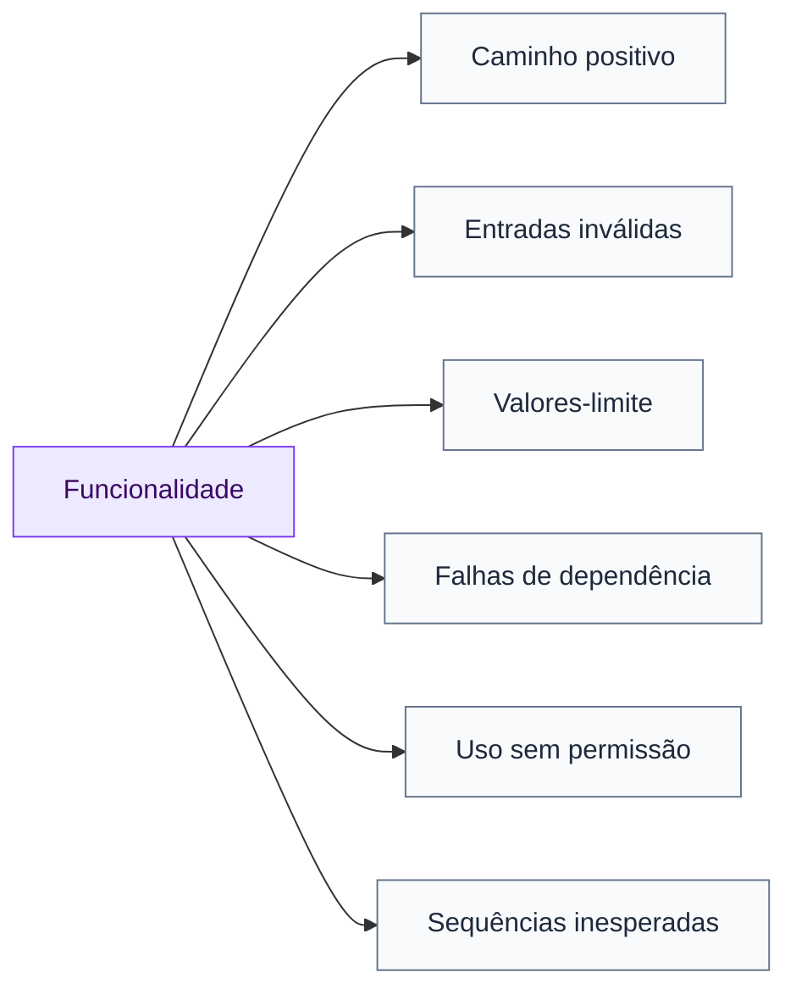

---

# 20. Critérios de entrada e saída

## 20.1 Critérios de entrada

Condições necessárias para iniciar os testes:

* requisitos aprovados;
* versão implantada;
* ambiente disponível;
* dados preparados;
* dependências acessíveis;
* casos revisados;
* bloqueios conhecidos registrados.

## 20.2 Critérios de saída

Condições para encerrar ou aceitar uma etapa:

* testes críticos executados;
* cobertura mínima atingida;
* ausência de defeitos impeditivos;
* defeitos residuais avaliados;
* regressão aprovada;
* riscos comunicados;
* evidências armazenadas;
* aceite registrado.

Os testes não terminam apenas porque “todos os casos foram executados”. É necessário avaliar o risco residual.

---

# 21. Erros comuns ao aplicar técnicas de teste

## 21.1 Usar apenas testes de interface

Problema:

* execução lenta;
* diagnóstico difícil;
* instabilidade;
* alto custo de manutenção.

Correção:

* fortalecer testes unitários e de integração;
* reservar a interface para fluxos essenciais.

## 21.2 Confundir cobertura com qualidade

Cobrir 100% das linhas não garante que:

* os resultados esperados estejam corretos;
* os requisitos tenham sido entendidos;
* os casos relevantes tenham sido testados;
* os testes possuam boas asserções.

## 21.3 Testar apenas o caminho feliz

Isso deixa de avaliar:

* entradas inválidas;
* falhas externas;
* permissões;
* limites;
* concorrência;
* indisponibilidade.

## 21.4 Executar testes apenas no final

Consequências:

* defeitos descobertos tarde;
* maior retrabalho;
* correções arriscadas;
* atraso na entrega.

## 21.5 Automatizar tudo indiscriminadamente

Nem todo teste possui retorno adequado para automação.

São bons candidatos:

* repetitivos;
* previsíveis;
* críticos;
* executados com frequência;
* com resultado objetivo.

## 21.6 Ignorar requisitos não funcionais

Um sistema funcionalmente correto pode falhar em produção por:

* lentidão;
* vulnerabilidade;
* incompatibilidade;
* dificuldade de uso;
* instabilidade.

---

# 22. Checklist prático

## 22.1 Seleção da técnica

* [ ] Qual risco será avaliado?
* [ ] Qual nível é apropriado?
* [ ] O teste precisa conhecer a estrutura interna?
* [ ] O foco é funcional ou não funcional?
* [ ] Existe requisito mensurável?
* [ ] O cenário exige dados específicos?
* [ ] Há dependências externas?
* [ ] A execução precisa ser repetida?
* [ ] O teste é candidato à automação?

## 22.2 Teste unitário

* [ ] Caminho principal testado?
* [ ] Valores-limite testados?
* [ ] Entradas inválidas testadas?
* [ ] Exceções verificadas?
* [ ] Dependências isoladas?
* [ ] Resultados determinísticos?
* [ ] Nomes dos testes claros?

## 22.3 Teste de integração

* [ ] Contratos validados?
* [ ] Formatos de dados conferidos?
* [ ] Falhas externas simuladas?
* [ ] Timeouts avaliados?
* [ ] Transações verificadas?
* [ ] Duplicidades tratadas?
* [ ] Autenticação e autorização avaliadas?

## 22.4 Teste de sistema

* [ ] Fluxos críticos cobertos?
* [ ] Requisitos funcionais avaliados?
* [ ] Segurança considerada?
* [ ] Desempenho considerado?
* [ ] Compatibilidade considerada?
* [ ] Cenários negativos incluídos?
* [ ] Ambiente representa a produção?

## 22.5 Regressão

* [ ] Alteração analisada?
* [ ] Componentes dependentes identificados?
* [ ] Teste de confirmação executado?
* [ ] Suite crítica executada?
* [ ] Novos testes adicionados?
* [ ] Resultado comparado com versão anterior?

---

# 23. Quadro consolidado

| Técnica         | Escopo principal                       | Momento comum          | Benefício central              |
| --------------- | -------------------------------------- | ---------------------- | ------------------------------ |
| Unitário        | Método, função ou classe               | Implementação          | Localização rápida             |
| Integração      | Comunicação entre partes               | Integração             | Detectar incompatibilidades    |
| Sistema         | Produto completo                       | Validação técnica      | Avaliar comportamento global   |
| Aceitação       | Necessidade do usuário                 | Pré-entrega            | Confirmar adequação            |
| Regressão       | Funcionalidades existentes             | Após mudanças          | Encontrar efeitos colaterais   |
| Desempenho      | Resposta e estabilidade                | Sistema e pré-produção | Identificar gargalos           |
| Segurança       | Proteção e controle                    | Todo o ciclo           | Reduzir vulnerabilidades       |
| Usabilidade     | Experiência do usuário                 | Protótipos e sistema   | Melhorar facilidade de uso     |
| Compatibilidade | Ambientes e dispositivos               | Sistema e entrega      | Garantir funcionamento amplo   |
| Caixa branca    | Estrutura interna                      | Unidade e integração   | Cobrir lógica e caminhos       |
| Caixa preta     | Entradas e saídas                      | Todos os níveis        | Validar comportamento          |
| Caixa cinza     | Comportamento com conhecimento parcial | Integração e sistema   | Investigar arquitetura e dados |

---

# 24. Questões para revisão

<details>
<summary><strong>1. Qual é o objetivo do teste unitário?</strong></summary>

Verificar pequenas unidades de código isoladamente, como métodos, funções ou classes, facilitando a identificação rápida de defeitos.

</details>

<details>
<summary><strong>2. Qual é a diferença entre teste unitário e teste de integração?</strong></summary>

O teste unitário avalia partes isoladas. O teste de integração verifica se diferentes partes comunicam-se e funcionam corretamente em conjunto.

</details>

<details>
<summary><strong>3. O que caracteriza um teste de caixa preta?</strong></summary>

O foco nas entradas, saídas e comportamento externo do sistema, sem depender do conhecimento da implementação interna.

</details>

<details>
<summary><strong>4. O que caracteriza um teste de caixa branca?</strong></summary>

O conhecimento da estrutura interna do código e a avaliação de instruções, decisões, condições, caminhos e loops.

</details>

<details>
<summary><strong>5. Quando utilizar caixa cinza?</strong></summary>

Quando o testador avalia o comportamento externo, mas utiliza conhecimento parcial da arquitetura, banco de dados, APIs ou integrações para criar cenários mais precisos.

</details>

<details>
<summary><strong>6. Qual é a função do teste de regressão?</strong></summary>

Verificar se alterações provocaram falhas em funcionalidades que anteriormente funcionavam.

</details>

<details>
<summary><strong>7. Qual é a diferença entre confirmação e regressão?</strong></summary>

A confirmação verifica se o defeito corrigido deixou de ocorrer. A regressão procura efeitos colaterais em outras partes.

</details>

<details>
<summary><strong>8. Por que os testes devem ser aplicados durante todo o desenvolvimento?</strong></summary>

Porque a detecção antecipada reduz o custo e a complexidade das correções, evitando que pequenos defeitos se transformem em falhas maiores. Essa é a resposta indicada no quiz dos slides. 

</details>

---

# 25. Resumo para prova

```text
TESTE UNITÁRIO
Avalia métodos, funções ou componentes isolados.

TESTE DE INTEGRAÇÃO
Verifica a comunicação entre módulos, serviços e sistemas.

TESTE DE SISTEMA
Avalia o produto completo em ambiente representativo.

TESTE DE ACEITAÇÃO
Confirma se o produto atende ao usuário e ao negócio.

TESTE DE REGRESSÃO
Verifica se alterações quebraram funcionalidades existentes.

TESTE DE CONFIRMAÇÃO
Confirma se um defeito corrigido deixou de ocorrer.

CAIXA PRETA
Avalia entradas, saídas e comportamento externo.

CAIXA BRANCA
Avalia código, decisões, condições, loops e caminhos.

CAIXA CINZA
Combina comportamento externo com conhecimento parcial interno.

TESTE DE DESEMPENHO
Avalia tempo de resposta, estabilidade, carga e escalabilidade.

TESTE DE SEGURANÇA
Avalia proteção, autenticação, autorização e dados.

TESTE DE USABILIDADE
Avalia facilidade de aprendizado, uso e compreensão.

TESTE DE COMPATIBILIDADE
Avalia funcionamento em diferentes ambientes e dispositivos.

IDEIA CENTRAL
Cada técnica encontra tipos diferentes de defeito.
A qualidade depende da combinação adequada das técnicas.
```

---

# 26. Mapa mental

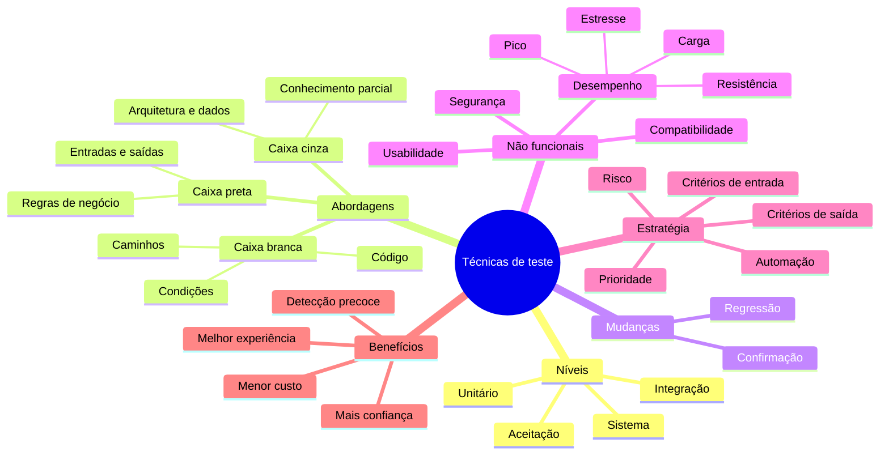

---

# 27. Conclusão

As técnicas de teste possuem objetivos diferentes e complementares.

Testes unitários verificam pequenas partes. Testes de integração avaliam a comunicação entre componentes. Testes de sistema examinam o produto completo. Testes de aceitação confirmam se a solução atende às necessidades do usuário.

Caixa preta observa o comportamento externo. Caixa branca examina a estrutura interna. Caixa cinza combina as duas perspectivas. Testes de desempenho, segurança, usabilidade e compatibilidade avaliam características que ultrapassam a simples correção funcional.

A estratégia eficaz não consiste em escolher uma única técnica, mas em compor uma combinação coerente com:

* a fase do desenvolvimento;
* os riscos;
* a criticidade;
* a arquitetura;
* o perfil de uso;
* o impacto das falhas.

O principal aprendizado do Tema 02 é que **técnicas diferentes devem ser aplicadas em momentos diferentes para revelar defeitos diferentes**. Quando utilizadas de forma sistemática, elas aumentam a estabilidade, a segurança e a confiança da equipe e do usuário no produto.

---

# Referências do material

* ANICHE, Mauricio. *Testes automatizados de software: um guia prático*. São Paulo: Casa do Código, 2015.
* DELAMARO, Márcio; JINO, Mario; MALDONADO, José. *Introdução ao teste de software*. 2. ed. Rio de Janeiro: Campus, 2016.
* FÉLIX, Rafael. *Teste de software*. São Paulo: Pearson, 2016.
* POLO, Rodrigo Cantú. *Validação e teste de software*. São Paulo: Contentus, 2020.
* PRESSMAN, Roger S. *Engenharia de software: uma abordagem profissional*. 8. ed. Porto Alegre: AMGH, 2016.
* SANTOS, Luiz Diego Vidal; OLIVEIRA, Catuxe Varjão de Santana. *Introdução à garantia de qualidade de software*. Timburi: Cia do eBook, 2017.
