# Teste e Inspeção de Software: Técnicas e Automatização

## Tema 03 — Técnicas de Inspeção de Software

> **Objetivo do capítulo:** compreender o conceito de inspeção de software, conhecer as principais técnicas de leitura e revisão, estruturar um processo de inspeção e utilizar ferramentas de apoio para identificar defeitos antes que eles se manifestem durante a execução do sistema.

Esta documentação consolida o conteúdo da leitura digital, dos slides e do podcast do Tema 03, mantendo o padrão didático dos capítulos anteriores.   

---

# 1. Visão geral

A inspeção de software é uma atividade de verificação estática utilizada para examinar artefatos produzidos durante o desenvolvimento, sem depender da execução da aplicação.

Podem ser inspecionados:

* requisitos;
* histórias de usuário;
* critérios de aceitação;
* modelos de processo;
* diagramas;
* arquitetura;
* projeto detalhado;
* código-fonte;
* scripts de banco de dados;
* contratos de APIs;
* planos de teste;
* casos de teste;
* documentação operacional.

O objetivo é encontrar defeitos antes que eles se propaguem para outros artefatos e se transformem em falhas percebidas pelo usuário.

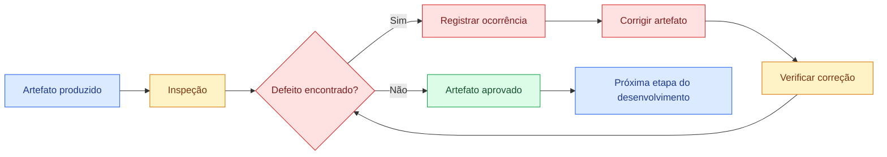

A inspeção não substitui os testes dinâmicos. Ela os complementa:

* a inspeção procura defeitos diretamente nos artefatos;
* o teste executa o software para observar seu comportamento;
* o uso conjunto das duas práticas aumenta a capacidade de detecção.

---

# 2. Objetivos de aprendizagem

Ao concluir este tema, espera-se que o estudante seja capaz de:

1. explicar o conceito de inspeção de software;
2. diferenciar erro, defeito e falha;
3. identificar quais artefatos podem ser inspecionados;
4. aplicar leitura ad hoc, checklists, cenários e perspectivas;
5. estruturar uma inspeção colaborativa;
6. elaborar checklists de revisão;
7. registrar e acompanhar defeitos;
8. utilizar ferramentas de análise estática e revisão colaborativa;
9. integrar inspeção ao fluxo de desenvolvimento;
10. avaliar benefícios e limitações da inspeção.

---

# 3. Conceito de inspeção de software

Inspeção é uma revisão técnica, sistemática e criteriosa de um produto de trabalho.

O material caracteriza a inspeção como uma prática voltada à identificação antecipada de inconformidades em requisitos, design, código e documentação. Ela também favorece o entendimento compartilhado do projeto entre os membros da equipe. 

## 3.1 Características fundamentais

Uma inspeção eficaz apresenta as seguintes características:

| Característica        | Significado                                            |
| --------------------- | ------------------------------------------------------ |
| Estática              | Não exige a execução do software                       |
| Antecipada            | Pode ser aplicada desde a especificação dos requisitos |
| Sistemática           | Utiliza critérios, papéis e procedimentos definidos    |
| Colaborativa          | Reúne diferentes conhecimentos e perspectivas          |
| Documentada           | Registra defeitos, decisões e resultados               |
| Preventiva            | Evita a propagação de problemas                        |
| Repetível             | Pode seguir o mesmo processo em diversos artefatos     |
| Orientada à qualidade | Avalia conformidade, consistência, segurança e clareza |

## 3.2 Inspeção, revisão e análise estática

Os termos são relacionados, mas não necessariamente equivalentes.

| Atividade        | Descrição                                                                             |
| ---------------- | ------------------------------------------------------------------------------------- |
| Revisão          | Termo amplo para avaliação de um artefato por uma ou mais pessoas                     |
| Inspeção         | Revisão estruturada, com critérios, papéis e registros                                |
| Análise estática | Avaliação de código ou artefatos sem execução, frequentemente apoiada por ferramentas |
| Code review      | Revisão colaborativa de alterações no código                                          |
| Walkthrough      | O autor apresenta o artefato para obter feedback dos participantes                    |

Neste capítulo, inspeção é tratada como o processo organizado de examinar artefatos, podendo envolver revisão humana e ferramentas automatizadas.

---

# 4. Inspeção versus teste dinâmico

| Critério             | Inspeção                                           | Teste dinâmico                                     |
| -------------------- | -------------------------------------------------- | -------------------------------------------------- |
| Execução do software | Não necessária                                     | Necessária                                         |
| Objeto avaliado      | Qualquer artefato                                  | Componente ou sistema executável                   |
| Momento de aplicação | Desde os requisitos                                | Quando existe uma parte executável                 |
| Forma de detecção    | Defeito observado diretamente                      | Falha provocada durante a execução                 |
| Exemplo              | Requisito contraditório                            | Cálculo retorna valor incorreto                    |
| Participantes        | Analistas, desenvolvedores, testadores, arquitetos | Desenvolvedores, testadores e usuários             |
| Principal benefício  | Detecção antecipada                                | Avaliação do comportamento real                    |
| Limitação            | Não observa integralmente condições de execução    | Pode encontrar o problema apenas em fase posterior |

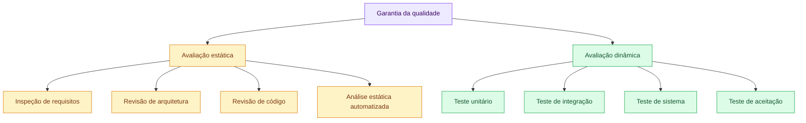

---

# 5. Erro, defeito e falha

Esses conceitos representam diferentes momentos da origem de um problema.

| Conceito    | Definição                                  | Exemplo                                                        |
| ----------- | ------------------------------------------ | -------------------------------------------------------------- |
| **Erro**    | Ação ou decisão humana incorreta           | Analista interpreta uma regra de negócio de maneira equivocada |
| **Defeito** | Imperfeição introduzida em um artefato     | Requisito ou código contém a regra incorreta                   |
| **Falha**   | Manifestação do defeito durante a execução | Sistema calcula um valor diferente do esperado                 |

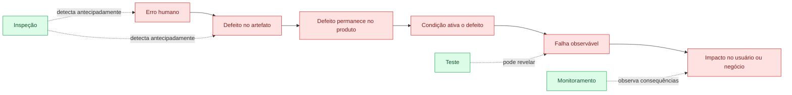

## 5.1 Exemplo prático

Regra correta:

> Uma transferência somente pode ser realizada quando o saldo disponível for maior ou igual ao valor solicitado.

### Erro

O desenvolvedor compreende que deve verificar apenas se existe algum saldo positivo.

### Defeito

```java
if (conta.getSaldo().compareTo(BigDecimal.ZERO) > 0) {
    realizarTransferencia();
}
```

### Falha

Uma conta com saldo de R$ 50 permite uma transferência de R$ 500.

### Prevenção por inspeção

Durante o code review, o revisor compara a implementação com a regra e identifica que o valor da transferência não foi considerado.

---

# 6. Artefatos que podem ser inspecionados

A figura apresentada na página 35 da leitura digital e na página 12 dos slides mostra pontos de inspeção distribuídos entre requisitos, projeto de alto nível, projeto detalhado, código, plano de testes e casos de teste.

O diagrama equivalente é:

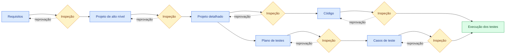

## 6.1 Requisitos

Podem ser avaliados:

* clareza;
* completude;
* consistência;
* viabilidade;
* testabilidade;
* rastreabilidade;
* ausência de ambiguidades;
* critérios de aceitação.

## 6.2 Arquitetura

Podem ser avaliados:

* separação de responsabilidades;
* dependências;
* escalabilidade;
* segurança;
* tolerância a falhas;
* integração;
* observabilidade;
* aderência aos requisitos não funcionais.

## 6.3 Projeto detalhado

Podem ser avaliados:

* classes;
* interfaces;
* contratos;
* modelos de dados;
* fluxos;
* tratamento de erros;
* concorrência;
* persistência.

## 6.4 Código-fonte

Podem ser avaliados:

* lógica;
* legibilidade;
* duplicação;
* complexidade;
* tratamento de exceções;
* vulnerabilidades;
* validação de dados;
* uso de recursos;
* cobertura por testes.

## 6.5 Artefatos de teste

Também devem ser inspecionados:

* estratégia de testes;
* plano de testes;
* cenários;
* casos de teste;
* dados;
* resultados esperados;
* critérios de entrada e saída;
* evidências.

Um caso de teste incorreto pode aprovar um comportamento defeituoso. Por isso, os próprios testes precisam passar por revisão.

---

# 7. Inspeção de requisitos

A especificação de requisitos é uma das bases mais importantes da inspeção. Requisitos claros orientam os revisores, reduzem ambiguidades e evitam que interpretações diferentes sejam incorporadas ao produto. 

## 7.1 Exemplo de requisito inadequado

> O sistema deve responder rapidamente às consultas.

Problemas:

* “rapidamente” não é mensurável;
* não informa volume de dados;
* não informa quantidade de usuários;
* não define percentual de respostas;
* não especifica ambiente.

## 7.2 Versão mais verificável

> O sistema deverá responder a 95% das consultas em até dois segundos, considerando até 300 usuários simultâneos e uma base com até dois milhões de registros.

## 7.3 Critérios de inspeção

| Critério        | Pergunta                                                |
| --------------- | ------------------------------------------------------- |
| Necessidade     | O requisito representa uma necessidade real?            |
| Clareza         | Existe apenas uma interpretação plausível?              |
| Completude      | Todas as condições estão definidas?                     |
| Consistência    | Existe conflito com outro requisito?                    |
| Viabilidade     | A implementação é tecnicamente possível?                |
| Testabilidade   | É possível definir um resultado esperado?               |
| Rastreabilidade | A origem e os artefatos relacionados estão registrados? |
| Segurança       | Há regras de acesso e proteção de dados?                |
| Exceções        | Situações inválidas estão descritas?                    |
| Mensurabilidade | Os critérios não funcionais possuem valores objetivos?  |

---

# 8. Processo estruturado de inspeção

Uma inspeção pode variar de uma revisão rápida até um processo formal. Em sistemas críticos, é recomendável adotar uma sequência estruturada.

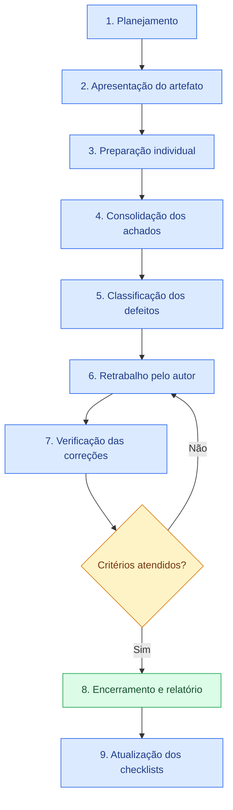

## 8.1 Planejamento

Define-se:

* artefato;
* objetivo;
* escopo;
* participantes;
* técnica de leitura;
* critérios;
* prazo;
* forma de registro;
* critérios de conclusão.

## 8.2 Apresentação

O autor contextualiza:

* finalidade;
* dependências;
* decisões;
* restrições;
* riscos;
* pontos que exigem atenção.

O objetivo não é defender o artefato, mas fornecer informações para a análise.

## 8.3 Preparação individual

Cada revisor examina o artefato de forma independente.

Essa etapa reduz:

* influência dos demais participantes;
* discussões prematuras;
* dependência de uma única opinião;
* perda de defeitos por consenso antecipado.

## 8.4 Consolidação

Os achados são reunidos, eliminando duplicidades e esclarecendo o contexto.

A discussão deve se concentrar no artefato, não na pessoa que o produziu.

## 8.5 Classificação

Os defeitos podem ser classificados por:

* tipo;
* gravidade;
* impacto;
* origem;
* prioridade;
* artefato;
* responsável pela correção.

## 8.6 Retrabalho

O autor corrige os problemas aceitos.

Nem todo comentário precisa resultar em alteração. Sugestões de estilo, preferências pessoais e defeitos reais devem ser diferenciados.

## 8.7 Verificação

O moderador ou revisor confirma se:

* o defeito foi corrigido;
* a correção está adequada;
* não foram introduzidas novas inconsistências;
* os critérios de saída foram atendidos.

## 8.8 Encerramento

O processo é concluído com:

* artefato aprovado;
* pendências registradas;
* relatório;
* métricas;
* lições aprendidas.

---

# 9. Papéis em uma inspeção

| Papel                   | Responsabilidade                                   |
| ----------------------- | -------------------------------------------------- |
| Autor                   | Produz o artefato e realiza as correções           |
| Moderador               | Organiza o processo e mantém o foco                |
| Revisores               | Procuram defeitos utilizando as técnicas definidas |
| Especialista de domínio | Avalia regras de negócio                           |
| Especialista técnico    | Avalia arquitetura, código ou infraestrutura       |
| Testador                | Avalia testabilidade, cenários e riscos            |
| Registrador             | Documenta achados e decisões                       |
| Gestor ou responsável   | Acompanha riscos sem interferir na análise técnica |

Em equipes pequenas, uma pessoa pode exercer mais de um papel. Entretanto, o autor não deve ser o único revisor de seu próprio trabalho.

---

# 10. Técnicas de inspeção

O Tema 03 apresenta quatro técnicas principais:

1. leitura ad hoc;
2. leitura baseada em checklists;
3. leitura baseada em cenários;
4. leitura baseada em perspectivas.

O podcast descreve sua evolução: a inspeção começou de forma pouco estruturada e tornou-se progressivamente mais sistemática, contextual e multidimensional. 

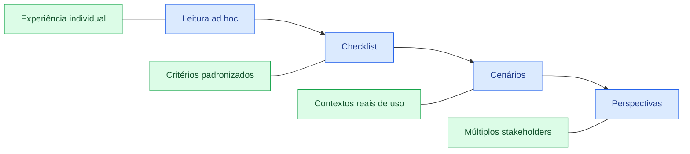

---

# 11. Leitura ad hoc

A leitura ad hoc é uma revisão informal baseada na experiência do revisor.

Não existe obrigatoriamente:

* roteiro;
* checklist;
* perspectiva;
* sequência padronizada;
* critério de cobertura.

## 11.1 Exemplo

O revisor abre uma classe e procura livremente por:

* código confuso;
* erros lógicos;
* validações ausentes;
* possíveis exceções;
* problemas de nomenclatura.

## 11.2 Vantagens

* rápida;
* baixa preparação;
* útil em alterações pequenas;
* adequada para avaliações preliminares;
* aproveita a experiência do especialista.

## 11.3 Limitações

* depende fortemente do revisor;
* apresenta cobertura imprevisível;
* dificulta a repetição;
* pode ignorar categorias inteiras de defeitos;
* produz resultados diferentes entre pessoas.

## 11.4 Quando aplicar

* correção simples;
* alteração localizada;
* avaliação preliminar;
* revisão com pouco risco;
* situação que exige feedback imediato.

A leitura ad hoc não deve ser a única técnica em funcionalidades críticas.

---

# 12. Leitura baseada em checklists

O checklist define itens objetivos que devem ser verificados pelo revisor.

O podcast cita exemplos como inicialização de variáveis e tratamento de exceções. Essa técnica reduz a probabilidade de pontos importantes serem esquecidos. 

## 12.1 Exemplo de checklist de código

* [ ] Entradas são validadas?
* [ ] Valores nulos são tratados?
* [ ] Recursos são fechados?
* [ ] Exceções são tratadas adequadamente?
* [ ] Informações sensíveis aparecem em logs?
* [ ] Operações possuem controle de autorização?
* [ ] Existem condições de concorrência?
* [ ] As transações são consistentes?
* [ ] Os nomes representam a intenção?
* [ ] A complexidade está adequada?
* [ ] Existem testes para os caminhos críticos?

## 12.2 Vantagens

* padronização;
* cobertura mais previsível;
* facilidade de treinamento;
* repetibilidade;
* registro objetivo;
* aproveitamento de defeitos históricos.

## 12.3 Limitações

* checklists genéricos podem ser superficiais;
* listas muito longas tornam-se burocráticas;
* o revisor pode marcar itens sem analisar profundamente;
* novos tipos de defeito podem não estar contemplados.

## 12.4 Evolução do checklist

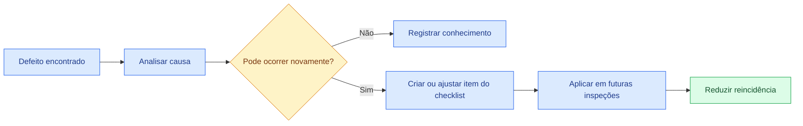

Um checklist deve ser tratado como um artefato vivo, atualizado com base em:

* incidentes;
* defeitos recorrentes;
* mudanças tecnológicas;
* padrões internos;
* riscos do domínio;
* auditorias.

---

# 13. Leitura baseada em cenários

A leitura baseada em cenários coloca o revisor diante de uma situação específica que o sistema precisa suportar.

Em vez de perguntar apenas “o código está correto?”, o revisor investiga:

> Como este artefato se comportaria nesta situação?

## 13.1 Exemplos de cenários

* milhares de solicitações simultâneas;
* indisponibilidade de uma API externa;
* duplicação de mensagem;
* falha após pagamento;
* usuário sem permissão;
* dado incompleto;
* reinício durante uma transação;
* perda temporária de conexão;
* envio repetido da mesma requisição.

## 13.2 Exemplo em um sistema de pedidos

Cenário:

> O pagamento foi aprovado, mas o serviço de criação do pedido ficou indisponível.

Durante a inspeção, procura-se verificar:

* existe transação distribuída?
* existe mecanismo de compensação?
* a cobrança pode ser duplicada?
* a operação pode ser repetida?
* o erro é registrado?
* existe fila de recuperação?
* o usuário recebe uma mensagem adequada?

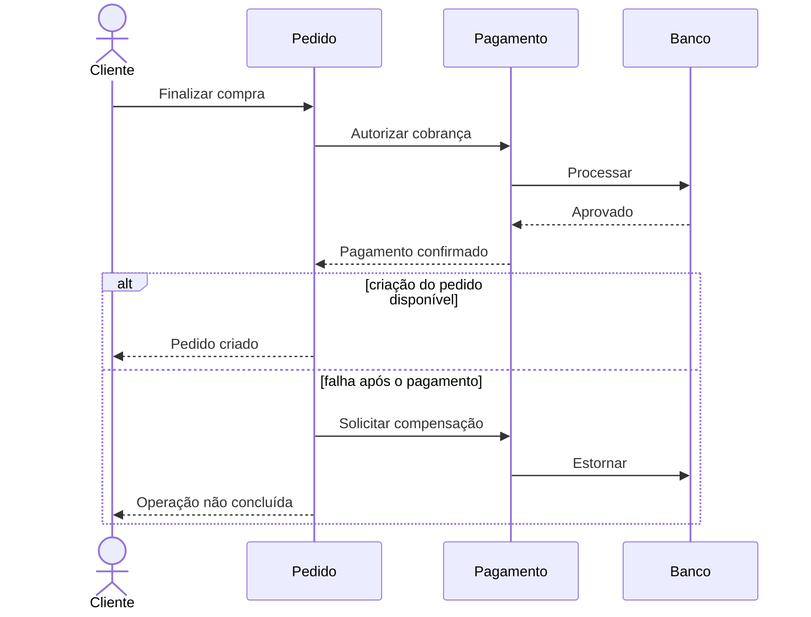

## 13.3 Vantagens

* aproxima a inspeção do contexto real;
* revela riscos operacionais;
* favorece análise de exceções;
* amplia a visão sobre integrações;
* identifica defeitos que checklists genéricos não encontrariam.

## 13.4 Limitações

* exige conhecimento do domínio;
* depende da qualidade dos cenários;
* pode deixar contextos não selecionados sem cobertura;
* demanda mais preparação.

---

# 14. Leitura baseada em perspectivas

Na leitura baseada em perspectivas, cada revisor examina o artefato a partir de um papel diferente.

O material menciona pontos de vista como usuário, desenvolvedor e gerente de projeto. O podcast também exemplifica administrador de sistema e profissional de segurança. 

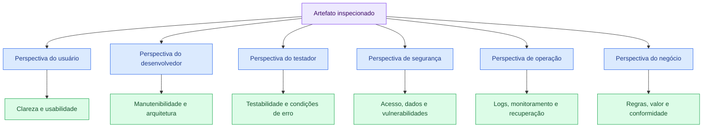

## 14.1 Perspectiva do usuário

Perguntas:

* o fluxo é compreensível?
* as mensagens ajudam?
* é possível recuperar-se de um erro?
* as informações necessárias estão visíveis?
* o comportamento corresponde à expectativa?

## 14.2 Perspectiva do desenvolvedor

Perguntas:

* o código é compreensível?
* a solução possui acoplamento excessivo?
* as responsabilidades estão separadas?
* a manutenção será segura?
* há duplicação?

## 14.3 Perspectiva do testador

Perguntas:

* os requisitos são testáveis?
* os resultados esperados estão definidos?
* existem condições de limite?
* os fluxos alternativos foram descritos?
* é possível controlar os dados?

## 14.4 Perspectiva de segurança

Perguntas:

* quem pode executar a operação?
* os dados sensíveis estão protegidos?
* os parâmetros são validados?
* os eventos críticos são auditados?
* mensagens expõem detalhes internos?

## 14.5 Perspectiva de operação

Perguntas:

* existem logs suficientes?
* é possível monitorar a funcionalidade?
* o sistema se recupera de falhas?
* alarmes foram previstos?
* existe procedimento de contingência?

## 14.6 Perspectiva do negócio

Perguntas:

* a regra foi implementada corretamente?
* o processo atende ao objetivo?
* existem riscos financeiros?
* há necessidade de conformidade?
* o resultado agrega valor?

---

# 15. Comparação entre as técnicas

| Técnica      | Estrutura  | Principal base          | Melhor aplicação                        | Limitação                         |
| ------------ | ---------- | ----------------------- | --------------------------------------- | --------------------------------- |
| Ad hoc       | Baixa      | Experiência do revisor  | Revisão rápida e pontual                | Cobertura imprevisível            |
| Checklist    | Média/alta | Lista de critérios      | Defeitos conhecidos e recorrentes       | Pode tornar-se mecânico           |
| Cenários     | Alta       | Situações reais de uso  | Fluxos críticos e exceções              | Depende dos cenários selecionados |
| Perspectivas | Alta       | Papéis dos stakeholders | Sistemas complexos e multidisciplinares | Exige vários conhecimentos        |

## 15.1 Seleção da técnica

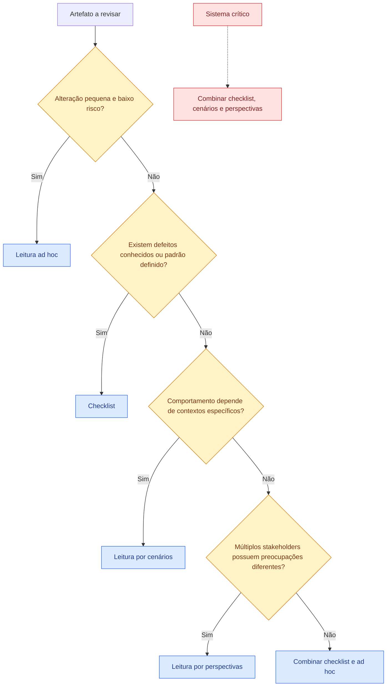

Na prática, as técnicas podem e devem ser combinadas.

---

# 16. Relatório de inspeção

O podcast destaca a importância dos registros: o relatório permite saber o que foi verificado, quem realizou a revisão e quais resultados foram encontrados. Esses registros também formam uma base de conhecimento para futuras inspeções. 

## 16.1 Estrutura recomendada

```text
Identificação da inspeção:
Artefato:
Versão:
Autor:
Moderador:
Revisores:
Data:
Técnica utilizada:
Escopo:
Critérios aplicados:
Quantidade de páginas ou linhas:
Tempo de preparação:
Tempo de reunião:
Defeitos encontrados:
Pendências:
Resultado:
Data da verificação:
```

## 16.2 Registro de defeito

| Campo         | Exemplo                                           |
| ------------- | ------------------------------------------------- |
| Identificador | INS-SEC-014                                       |
| Artefato      | TransferenciaService.java                         |
| Localização   | Método `transferir`, linha 87                     |
| Categoria     | Segurança                                         |
| Descrição     | Operação não verifica autorização do usuário      |
| Impacto       | Usuário pode tentar movimentar conta de terceiros |
| Gravidade     | Crítica                                           |
| Recomendação  | Validar vínculo e permissão antes da operação     |
| Responsável   | Equipe de contas                                  |
| Situação      | Em correção                                       |

---

# 17. Classificação dos defeitos

## 17.1 Por gravidade

| Gravidade | Característica                                                                          |
| --------- | --------------------------------------------------------------------------------------- |
| Crítica   | Pode causar perda financeira, vazamento, indisponibilidade grave ou risco à integridade |
| Alta      | Compromete função principal ou requisito importante                                     |
| Média     | Afeta comportamento secundário ou manutenibilidade                                      |
| Baixa     | Problema localizado, textual ou de padronização                                         |

## 17.2 Por categoria

* requisitos;
* regra de negócio;
* arquitetura;
* lógica;
* segurança;
* desempenho;
* usabilidade;
* compatibilidade;
* documentação;
* testabilidade;
* tratamento de erros;
* observabilidade;
* manutenibilidade.

## 17.3 Ciclo de vida

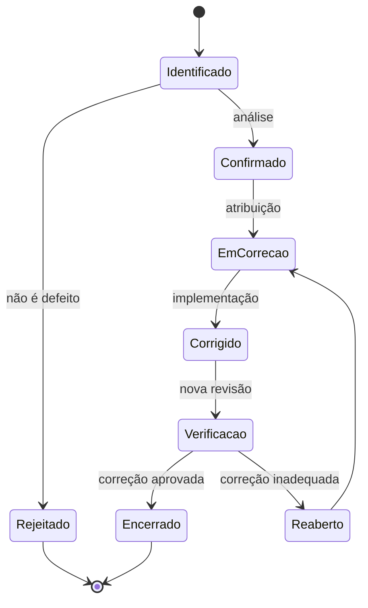

---

# 18. Inspeção de código

A inspeção de código busca defeitos antes que sejam observados em testes ou produção.

## 18.1 Exemplo com problemas

```java
public void transferir(
        Long contaOrigem,
        Long contaDestino,
        BigDecimal valor,
        Usuario usuario) {

    Conta origem = contaRepository.buscar(contaOrigem);
    Conta destino = contaRepository.buscar(contaDestino);

    log.info("Transferência do usuário {} no valor {}",
            usuario.getCpf(), valor);

    origem.debitar(valor);
    destino.creditar(valor);

    contaRepository.salvar(origem);
    contaRepository.salvar(destino);
}
```

## 18.2 Achados possíveis

| Categoria          | Problema                                          |
| ------------------ | ------------------------------------------------- |
| Validação          | Não verifica se o valor é nulo, zero ou negativo  |
| Autorização        | Não confirma se o usuário pode movimentar a conta |
| Disponibilidade    | Não verifica se as contas existem                 |
| Consistência       | Não demonstra uma transação atômica               |
| Concorrência       | O saldo pode ser alterado simultaneamente         |
| Segurança          | CPF completo é escrito no log                     |
| Regra de negócio   | Não verifica saldo ou limite                      |
| Auditoria          | Não registra identificador da operação            |
| Tratamento de erro | Falhas de persistência não são tratadas           |

## 18.3 Versão ilustrativa melhorada

```java
@Transactional
public TransferenciaResultado transferir(TransferenciaComando comando) {
    validarComando(comando);

    Conta origem = contaRepository.buscarObrigatoria(
            comando.getContaOrigem());

    Conta destino = contaRepository.buscarObrigatoria(
            comando.getContaDestino());

    autorizacaoService.validarMovimentacao(
            comando.getUsuario(),
            origem);

    origem.validarSaldoDisponivel(comando.getValor());

    origem.debitar(comando.getValor());
    destino.creditar(comando.getValor());

    String idOperacao = UUID.randomUUID().toString();

    auditoriaService.registrarTransferencia(
            idOperacao,
            origem.getId(),
            destino.getId(),
            comando.getValor());

    return new TransferenciaResultado(idOperacao);
}
```

A versão revisada não deve ser considerada automaticamente perfeita. Ela ainda deve ser avaliada quanto a concorrência, isolamento transacional, idempotência e requisitos específicos do sistema.

---

# 19. Ferramentas de apoio

O material organiza as ferramentas em três funções principais:

1. análise estática;
2. revisão colaborativa;
3. gerenciamento de defeitos.

Também apresenta o Crucible como ferramenta de revisão integrada a repositórios. 

| Ferramenta apresentada | Função no material               | Benefício                                              |
| ---------------------- | -------------------------------- | ------------------------------------------------------ |
| SonarQube              | Análise estática                 | Detectar vulnerabilidades, inconsistências e violações |
| GitHub/Gerrit          | Revisão colaborativa             | Facilitar comentários e colaboração                    |
| Jira/Bugzilla          | Gerenciamento de defeitos        | Rastrear os problemas até a resolução                  |
| Crucible               | Revisão integrada ao repositório | Organizar fluxo e automatizar atividades               |

## 19.1 Análise estática

A ferramenta examina o código sem executar a aplicação.

Pode apontar:

* duplicação;
* vulnerabilidades;
* complexidade;
* código não utilizado;
* padrões inadequados;
* possíveis erros;
* violações de convenções.

### Limitações

* pode produzir falsos positivos;
* não compreende integralmente o negócio;
* não substitui revisão humana;
* não garante ausência de vulnerabilidades;
* depende da configuração das regras.

## 19.2 Revisão colaborativa

Plataformas de versionamento permitem:

* abrir uma solicitação de alteração;
* visualizar diferenças;
* comentar linhas;
* solicitar mudanças;
* aprovar ou rejeitar;
* manter histórico;
* relacionar código e requisito.

## 19.3 Gerenciamento de defeitos

Uma ferramenta de acompanhamento permite:

* registrar;
* classificar;
* priorizar;
* atribuir;
* acompanhar;
* relacionar à versão;
* verificar;
* encerrar.

---

# 20. Fluxo integrado de ferramentas

O estudo de caso dos slides recomenda SonarQube para análise estática, GitHub para revisão colaborativa e Jira para acompanhamento dos defeitos.

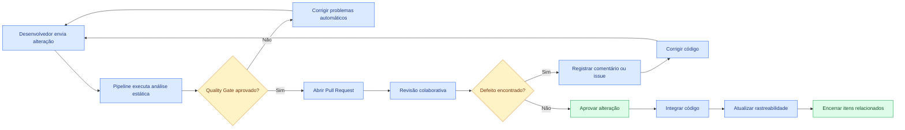

## 20.1 Responsabilidades das ferramentas

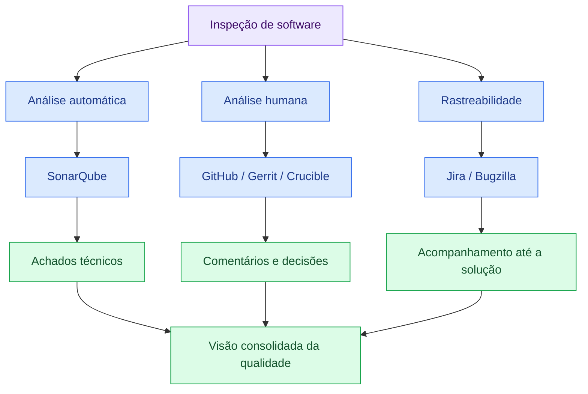

---

# 21. Estudo de caso — Aplicação bancária

Os slides apresentam uma aplicação web bancária em fase final de desenvolvimento. O sistema realizará transações financeiras e exige elevado nível de segurança e precisão. A tarefa é aplicar ferramentas de inspeção para identificar defeitos críticos antes do lançamento. 

## 21.1 Riscos principais

* transferência sem autorização;
* valor incorreto;
* cobrança duplicada;
* saldo inconsistente;
* exposição de dados;
* perda de auditoria;
* vulnerabilidade no controle de acesso;
* falha parcial em uma transação;
* mensagem de erro com dados internos;
* concorrência entre operações.

## 21.2 Artefatos prioritários

| Artefato                    | Avaliação                                           |
| --------------------------- | --------------------------------------------------- |
| Requisitos de transferência | Limites, permissões, horários e exceções            |
| Arquitetura                 | Transações, disponibilidade e segurança             |
| API                         | Autenticação, autorização, idempotência e contratos |
| Código                      | Validações, concorrência e tratamento de erros      |
| Banco de dados              | Integridade, bloqueios e auditoria                  |
| Logs                        | Rastreabilidade sem exposição de dados              |
| Casos de teste              | Cenários críticos e negativos                       |
| Configuração                | Segredos, comunicação e permissões                  |

## 21.3 Estratégia recomendada

### Análise estática

Utilizar regras voltadas a:

* vulnerabilidades;
* exposição de dados;
* complexidade;
* erros comuns;
* código duplicado;
* tratamento inadequado de exceções.

### Revisão colaborativa

Distribuir a análise entre:

* especialista no negócio bancário;
* desenvolvedor;
* testador;
* segurança;
* banco de dados;
* operações.

### Gerenciamento de defeitos

Para cada problema:

1. registrar;
2. classificar;
3. priorizar;
4. atribuir;
5. corrigir;
6. revisar;
7. encerrar.

---

## 21.4 Fluxo da inspeção bancária

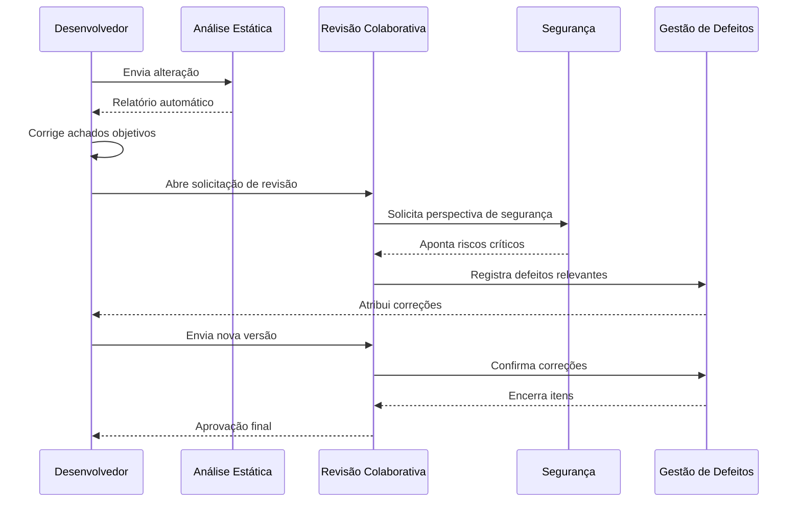

---

# 22. Exemplo de checklist para aplicação financeira

## 22.1 Autenticação e sessão

* [ ] A autenticação é obrigatória?
* [ ] A sessão expira?
* [ ] Tokens são invalidados após logout?
* [ ] Tentativas repetidas são controladas?
* [ ] Dados de autenticação aparecem em logs?

## 22.2 Autorização

* [ ] O usuário pode acessar apenas suas contas?
* [ ] A permissão é verificada no backend?
* [ ] Perfis administrativos possuem restrições?
* [ ] Identificadores enviados pelo cliente são validados?
* [ ] Operações sensíveis exigem validação adicional?

## 22.3 Transações

* [ ] O valor deve ser maior que zero?
* [ ] O saldo disponível é verificado?
* [ ] Limites diários são aplicados?
* [ ] A operação é atômica?
* [ ] Existe proteção contra duplicidade?
* [ ] Existe identificador único?
* [ ] Falhas parciais possuem compensação?

## 22.4 Dados e auditoria

* [ ] Dados sensíveis estão protegidos?
* [ ] Logs evitam CPF, senha, token ou conta completa?
* [ ] Operações críticas são auditadas?
* [ ] A auditoria registra data, usuário e resultado?
* [ ] Os registros não podem ser alterados indevidamente?

## 22.5 Tratamento de erros

* [ ] Mensagens não revelam detalhes internos?
* [ ] Exceções técnicas são convertidas adequadamente?
* [ ] O usuário recebe orientação?
* [ ] A falha pode ser diagnosticada por logs?
* [ ] Existe correlação entre as chamadas?

---

# 23. Benefícios da inspeção

## 23.1 Detecção antecipada

A inspeção pode encontrar problemas antes de:

* implementação;
* integração;
* testes;
* homologação;
* produção.

## 23.2 Redução de custos

Um defeito em requisito pode afetar:

* arquitetura;
* código;
* banco;
* interface;
* testes;
* documentação.

Ao encontrá-lo no requisito, evita-se corrigir todos esses artefatos posteriormente.

```mermaid
flowchart LR
    A["Defeito no requisito"] --> B["Projeto incorreto"]
    B --> C["Código incorreto"]
    C --> D["Casos de teste incorretos"]
    D --> E["Falha em produção"]

    I["Inspeção no requisito"] -. "interrompe a propagação" .-> A

    classDef cadeia fill:#fee2e2,stroke:#dc2626,color:#7f1d1d;
    classDef prevencao fill:#dcfce7,stroke:#16a34a,color:#14532d;

    class A,B,C,D,E cadeia;
    class I prevencao;
```

## 23.3 Compartilhamento de conhecimento

A revisão colaborativa:

* dissemina decisões;
* reduz dependência de uma pessoa;
* melhora a compreensão da arquitetura;
* desenvolve revisores;
* fortalece padrões internos.

## 23.4 Melhoria contínua

Os defeitos encontrados podem ser utilizados para:

* atualizar checklists;
* melhorar templates;
* aperfeiçoar padrões;
* criar regras de análise estática;
* ampliar testes;
* revisar processos.

---

# 24. Limitações e desafios

## 24.1 Dependência de conhecimento

Uma equipe pode não encontrar um defeito quando não possui conhecimento suficiente sobre:

* domínio;
* tecnologia;
* segurança;
* arquitetura;
* operação.

## 24.2 Custo de preparação

Inspeções estruturadas exigem:

* organização;
* tempo;
* revisores;
* material;
* acompanhamento;
* ferramentas.

## 24.3 Excesso de formalidade

Processos muito pesados podem:

* atrasar pequenas alterações;
* gerar burocracia;
* reduzir o engajamento;
* transformar a revisão em mera aprovação administrativa.

## 24.4 Conflitos interpessoais

Comentários inadequados podem ser percebidos como ataques ao autor.

A comunicação deve ser:

* objetiva;
* respeitosa;
* baseada em critérios;
* direcionada ao artefato;
* acompanhada de contexto.

## 24.5 Limitações técnicas

A inspeção não consegue comprovar completamente:

* desempenho real;
* comportamento sob carga;
* experiência real do usuário;
* condições de infraestrutura;
* falhas temporais;
* concorrência durante a execução.

Esses aspectos exigem testes dinâmicos.

---

# 25. Antipadrões de inspeção

## 25.1 Aprovação automática

A revisão é aprovada sem leitura real.

**Consequência:** falsa sensação de controle.

## 25.2 Revisão baseada apenas em estilo

A discussão concentra-se em formatação enquanto problemas de regra e segurança são ignorados.

**Correção:** automatizar estilo e priorizar riscos.

## 25.3 Alteração muito grande

Uma única revisão contém centenas de arquivos.

**Consequência:** fadiga, perda de contexto e menor capacidade de detecção.

## 25.4 Apenas um revisor para tudo

A mesma pessoa avalia domínio, segurança, banco, interface e arquitetura.

**Consequência:** perspectivas importantes ficam ausentes.

## 25.5 Discussão sobre autoria

Comentários atacam o profissional em vez do artefato.

Exemplo inadequado:

> Você não sabe tratar exceções.

Exemplo adequado:

> Este bloco captura uma exceção genérica e não preserva a causa. Isso pode dificultar o diagnóstico. Avaliar tratamento específico e registro da causa.

## 25.6 Checklist imutável

A equipe usa durante anos uma lista que não reflete incidentes, novas tecnologias ou riscos atuais.

---

# 26. Métricas de inspeção

As métricas devem apoiar a melhoria do processo, e não ser utilizadas isoladamente para avaliar pessoas.

| Métrica                | Objetivo                          |
| ---------------------- | --------------------------------- |
| Defeitos encontrados   | Avaliar resultado da inspeção     |
| Defeitos por categoria | Identificar padrões               |
| Defeitos por artefato  | Localizar etapas frágeis          |
| Tempo de preparação    | Avaliar esforço                   |
| Tempo de correção      | Avaliar retrabalho                |
| Taxa de reabertura     | Identificar correções inadequadas |
| Defeitos escapados     | Avaliar capacidade preventiva     |
| Reincidência           | Verificar aprendizado             |
| Cobertura da inspeção  | Identificar artefatos avaliados   |
| Achados por técnica    | Comparar adequação das abordagens |

## 26.1 Exemplo de indicador

```text
Eficiência de remoção =
defeitos encontrados na inspeção
-----------------------------------------------
defeitos encontrados na inspeção + posteriormente
```

O valor deve ser analisado em conjunto com:

* criticidade;
* tamanho do artefato;
* experiência dos revisores;
* complexidade;
* histórico do produto.

---

# 27. Critérios de entrada e saída

## 27.1 Entrada

Antes da inspeção:

* [ ] artefato possui versão identificada;
* [ ] escopo foi definido;
* [ ] autor concluiu uma autoavaliação;
* [ ] participantes foram selecionados;
* [ ] técnica de leitura foi escolhida;
* [ ] checklists estão disponíveis;
* [ ] documentação de apoio foi fornecida;
* [ ] prazo foi definido.

## 27.2 Saída

A inspeção pode ser concluída quando:

* [ ] defeitos críticos foram corrigidos;
* [ ] correções foram verificadas;
* [ ] pendências estão registradas;
* [ ] relatório foi concluído;
* [ ] decisão de aprovação foi documentada;
* [ ] checklists foram atualizados quando necessário;
* [ ] riscos residuais foram comunicados.

---

# 28. Checklist geral de inspeção

## 28.1 Requisitos

* [ ] São claros?
* [ ] São completos?
* [ ] São consistentes?
* [ ] São testáveis?
* [ ] Possuem critérios de aceitação?
* [ ] Tratam fluxos alternativos?
* [ ] Incluem requisitos não funcionais?
* [ ] Possuem rastreabilidade?

## 28.2 Arquitetura

* [ ] Atende aos requisitos?
* [ ] Responsabilidades estão separadas?
* [ ] Dependências estão justificadas?
* [ ] Falhas externas são tratadas?
* [ ] Segurança foi considerada?
* [ ] Monitoramento foi previsto?
* [ ] Decisões importantes estão documentadas?

## 28.3 Código

* [ ] Implementa a regra correta?
* [ ] Valida entradas?
* [ ] Trata erros?
* [ ] Protege dados sensíveis?
* [ ] Verifica autorização?
* [ ] Evita duplicação?
* [ ] Possui complexidade adequada?
* [ ] Tem testes?
* [ ] Gera logs úteis?
* [ ] Mantém consistência transacional?

## 28.4 Casos de teste

* [ ] Estão relacionados aos requisitos?
* [ ] Possuem pré-condições?
* [ ] Definem dados de entrada?
* [ ] Definem resultado esperado?
* [ ] Incluem caminhos negativos?
* [ ] Incluem valores-limite?
* [ ] São reproduzíveis?
* [ ] Possuem prioridade?

---

# 29. Questões para revisão

<details>
<summary><strong>1. O que é inspeção de software?</strong></summary>

É uma revisão estática e estruturada de artefatos, realizada para encontrar defeitos sem depender da execução do software.

</details>

<details>
<summary><strong>2. Qual é a principal diferença entre inspeção e teste dinâmico?</strong></summary>

A inspeção examina artefatos sem executar o sistema. O teste dinâmico executa o software e observa seu comportamento.

</details>

<details>
<summary><strong>3. Qual é a diferença entre erro, defeito e falha?</strong></summary>

Erro é uma ação ou decisão humana incorreta. Defeito é a imperfeição introduzida no artefato. Falha é a manifestação observável durante a execução.

</details>

<details>
<summary><strong>4. O que caracteriza a leitura ad hoc?</strong></summary>

É uma revisão informal conduzida de acordo com a experiência e os critérios próprios do revisor.

</details>

<details>
<summary><strong>5. Qual é o principal benefício de um checklist?</strong></summary>

Padronizar a avaliação e reduzir a possibilidade de critérios importantes serem esquecidos.

</details>

<details>
<summary><strong>6. Quando utilizar leitura baseada em cenários?</strong></summary>

Quando o comportamento depende de contextos específicos, situações de uso, falhas externas ou fluxos críticos.

</details>

<details>
<summary><strong>7. O que é leitura baseada em perspectivas?</strong></summary>

É a inspeção realizada sob diferentes pontos de vista, como usuário, desenvolvedor, testador, segurança, operação e negócio.

</details>

<details>
<summary><strong>8. Qual é a função da análise estática?</strong></summary>

Examinar o código sem executá-lo para encontrar possíveis erros, vulnerabilidades, duplicações e violações de padrões.

</details>

<details>
<summary><strong>9. Por que registrar os resultados da inspeção?</strong></summary>

Para manter rastreabilidade, acompanhar correções, produzir conhecimento e melhorar futuras revisões.

</details>

<details>
<summary><strong>10. Qual é o objetivo principal da inspeção?</strong></summary>

Detectar problemas nos artefatos antes dos testes ou da operação, aumentando a qualidade e reduzindo a propagação dos defeitos. Essa é a resposta indicada no quiz do Tema 03. 

</details>

---

# 30. Resumo para prova

```text
INSPEÇÃO DE SOFTWARE
Revisão estática de requisitos, design, código, testes e documentação.

OBJETIVO
Encontrar defeitos antecipadamente, antes que se tornem falhas.

ERRO
Ação ou decisão humana incorreta.

DEFEITO
Imperfeição introduzida em um artefato.

FALHA
Manifestação do defeito durante a execução.

LEITURA AD HOC
Revisão informal baseada na experiência do revisor.

LEITURA POR CHECKLIST
Revisão estruturada por uma lista de critérios.

LEITURA POR CENÁRIOS
Avaliação considerando situações reais ou críticas.

LEITURA POR PERSPECTIVAS
Avaliação sob diferentes pontos de vista.

ANÁLISE ESTÁTICA
Exame automatizado do código sem execução.

REVISÃO COLABORATIVA
Análise humana compartilhada em repositórios.

GERENCIAMENTO DE DEFEITOS
Registro e acompanhamento dos problemas até a solução.

FERRAMENTAS CITADAS NO MATERIAL
SonarQube, GitHub, Gerrit, Jira, Bugzilla e Crucible.

PRINCIPAL BENEFÍCIO
Detecção antecipada, redução de retrabalho e melhoria da qualidade.

PRINCIPAL LIMITAÇÃO
Não substitui os testes que avaliam o comportamento em execução.
```

---

# 31. Mapa mental

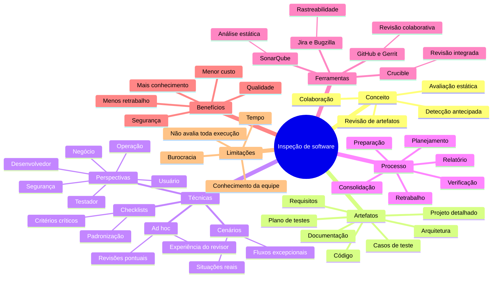

---

# 32. Conclusão

A inspeção de software é uma prática preventiva de garantia da qualidade. Seu valor está em examinar requisitos, arquitetura, código, testes e documentação antes que seus defeitos se propaguem pelo desenvolvimento.

As quatro técnicas apresentadas possuem finalidades complementares:

* **ad hoc:** agilidade e experiência individual;
* **checklist:** padronização e cobertura;
* **cenários:** proximidade com situações reais;
* **perspectivas:** análise multidisciplinar.

As ferramentas ampliam a capacidade da equipe:

* a análise estática encontra padrões automaticamente;
* a revisão colaborativa reúne diferentes conhecimentos;
* o gerenciamento de defeitos garante rastreabilidade.

Entretanto, a ferramenta não substitui o julgamento técnico. A inspeção eficaz depende de critérios claros, preparação, colaboração, registro e aprendizado contínuo.

O principal aprendizado do Tema 03 é que **a qualidade pode ser construída antes da execução do software**. Quanto mais cedo um defeito é identificado, menor tende a ser sua propagação, seu custo e seu impacto para o usuário.

---

# Referências do material

* ANICHE, Mauricio. *Testes automatizados de software: um guia prático*. São Paulo: Casa do Código, 2015.
* DELAMARO, Márcio; JINO, Mario; MALDONADO, José. *Introdução ao teste de software*. 2. ed. Rio de Janeiro: Campus, 2016.
* FÉLIX, Rafael. *Teste de software*. São Paulo: Pearson, 2016.
* KALINOWSKI, Marcos; SPÍNOLA, Rodrigo. *Introdução à Inspeção de Software — Aumentando a Qualidade Através de Verificações Intermediárias*. Engenharia de Software Magazine, 2008.
* POLO, Rodrigo Cantú. *Validação e teste de software*. São Paulo: Contentus, 2020.
* PRESSMAN, Roger S. *Engenharia de software: uma abordagem profissional*. 8. ed. Porto Alegre: AMGH, 2016.
* SANTOS, Luiz Diego Vidal; OLIVEIRA, Catuxe Varjão de Santana. *Introdução à garantia de qualidade de software*. Timburi: Cia do eBook, 2017.
* SOMMERVILLE, Ian. *Engenharia de Software*. São Paulo: Pearson, 2011.
* PICHILIANI, M.; NAKAMURA, M. *Qualidade de Software: Teoria e Prática*. São Paulo: Novatec, 2013.
