# Teste e Inspeção de Software: Técnicas e Automatização

## Tema 04 — Processos e Casos de Testes Automatizados

> **Objetivo do capítulo:** compreender os fundamentos da automação de testes, estruturar um processo de automação, selecionar casos adequados, integrar os testes ao ciclo de desenvolvimento e reconhecer a finalidade de ferramentas como JUnit, Selenium, Postman e Jenkins.

Esta documentação consolida o conteúdo da leitura digital, dos slides e do podcast do Tema 04, mantendo o padrão didático dos capítulos anteriores.   

---

# 1. Visão geral

A automação de testes utiliza programas, scripts, frameworks e ferramentas para executar verificações sobre um software com pouca ou nenhuma intervenção humana durante a execução.

O objetivo não é simplesmente substituir uma pessoa que executa passos manualmente. Uma automação adequada deve:

* representar um comportamento relevante;
* preparar o estado necessário;
* executar a funcionalidade;
* comparar o resultado observado com o esperado;
* produzir evidências;
* informar claramente se o teste foi aprovado ou reprovado;
* permitir novas execuções de maneira confiável.

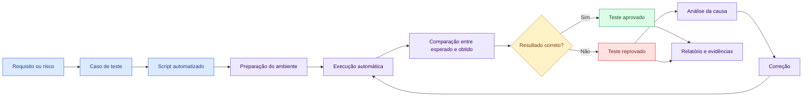

O material destaca que os testes automatizados são especialmente importantes em contextos com:

* mudanças frequentes;
* várias versões;
* ciclos curtos de desenvolvimento;
* necessidade de regressão constante;
* sistemas críticos;
* grande quantidade de cenários;
* integração contínua;
* necessidade de respostas rápidas sobre a qualidade. 

---

# 2. Objetivos de aprendizagem

Ao concluir este tema, espera-se que o estudante seja capaz de:

1. explicar o conceito de automação de testes;
2. diferenciar processo, caso de teste e script automatizado;
3. identificar benefícios e limitações da automação;
4. selecionar cenários adequados para automatização;
5. estruturar um processo de desenvolvimento dos testes;
6. organizar testes unitários, de integração, API e interface;
7. compreender o papel de Selenium, JUnit, Postman e Jenkins;
8. integrar testes a um pipeline de integração contínua;
9. analisar resultados e manter a suíte;
10. elaborar uma estratégia inicial para um projeto real.

---

# 3. Evolução dos testes automatizados

O podcast apresenta uma evolução histórica que parte da execução exclusivamente manual e chega a ambientes contínuos, com automação integrada ao desenvolvimento e apoio de técnicas mais avançadas. 

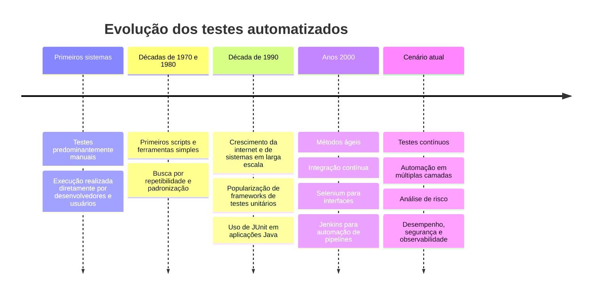

## 3.1 Testes exclusivamente manuais

Inicialmente, uma nova versão precisava ser verificada por uma pessoa, que:

1. instalava ou acessava o sistema;
2. navegava pelas telas;
3. preenchia os dados;
4. observava as respostas;
5. registrava os resultados.

Esse método ainda é importante, especialmente para exploração, usabilidade e avaliação subjetiva. Porém, torna-se insuficiente quando a quantidade de versões e cenários aumenta.

## 3.2 Primeiros scripts

A automação começou a responder a uma necessidade prática:

> Como executar repetidamente a mesma verificação sem repetir manualmente todos os passos?

Os primeiros scripts eram simples e frequentemente acoplados ao ambiente. Mesmo assim, permitiam:

* repetição;
* padronização;
* menor esforço operacional;
* execução em horários diferentes;
* comparação mais consistente.

## 3.3 Frameworks de teste

Com frameworks como JUnit, os testes passaram a ser tratados como código:

* organizados em classes;
* versionados;
* executados automaticamente;
* integrados à compilação;
* associados diretamente às unidades testadas.

## 3.4 Automação contínua

Com integração contínua, os testes deixaram de ser executados apenas antes da entrega. Eles passaram a ser disparados sempre que determinadas mudanças ocorrem.

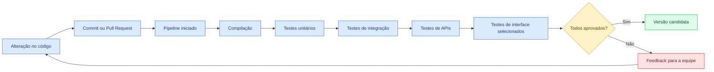

---

# 4. Conceitos fundamentais

## 4.1 Processo de teste automatizado

Processo é o conjunto organizado de atividades utilizadas para planejar, desenvolver, executar, analisar e manter a automação.

Um processo não se resume à escrita do script.

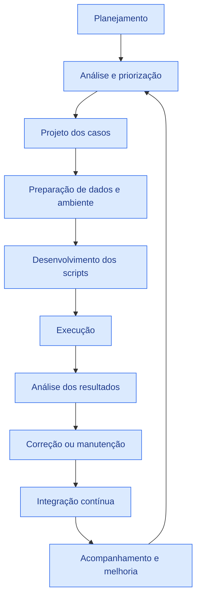

## 4.2 Caso de teste

Caso de teste é a especificação de uma condição a ser verificada.

Pode conter:

* identificador;
* objetivo;
* requisito relacionado;
* pré-condições;
* dados de entrada;
* passos;
* resultado esperado;
* prioridade;
* evidências;
* critérios de aprovação.

## 4.3 Script de teste

É a implementação executável do caso de teste.

Um mesmo caso pode ser implementado:

* em Java com JUnit;
* em uma coleção de API;
* em um script de navegador;
* em uma ferramenta de desempenho;
* em uma etapa de pipeline.

## 4.4 Suíte de testes

É um conjunto organizado de casos automatizados.

Exemplos:

* suíte de login;
* suíte de pagamentos;
* suíte de regressão crítica;
* suíte de APIs;
* suíte de testes unitários;
* suíte de compatibilidade.

## 4.5 Asserção

Asserção é a verificação que compara o resultado observado com o esperado.

Exemplos:

```java
assertEquals(new BigDecimal("90.00"), valorFinal);
assertTrue(resultado.isSucesso());
assertNotNull(resposta.getIdPedido());
```

Sem uma asserção significativa, um script pode apenas executar ações sem realmente confirmar o comportamento.

## 4.6 Oráculo de teste

É o mecanismo utilizado para determinar o resultado correto.

O oráculo pode ser:

* um valor conhecido;
* uma regra matemática;
* um requisito;
* um contrato de API;
* uma base de referência;
* o resultado de uma versão anterior confiável;
* uma propriedade que deve permanecer verdadeira.

## 4.7 Fixture

É o conjunto de condições necessárias para o teste.

Inclui:

* objetos;
* banco de dados;
* usuários;
* configurações;
* arquivos;
* serviços simulados;
* estado inicial.

## 4.8 Dados de teste

São os valores utilizados nos cenários.

Exemplos:

* usuário ativo;
* cupom expirado;
* endereço fora da cobertura;
* produto sem estoque;
* pagamento recusado;
* valor-limite;
* resposta externa inválida.

---

# 5. Teste manual versus teste automatizado

| Critério             | Teste manual                   | Teste automatizado                           |
| -------------------- | ------------------------------ | -------------------------------------------- |
| Execução             | Realizada por uma pessoa       | Realizada por ferramenta ou script           |
| Repetição            | Maior esforço a cada ciclo     | Baixo esforço após implementação             |
| Velocidade           | Limitada pelo executor         | Geralmente mais rápida                       |
| Consistência         | Sujeita a variações humanas    | Reproduz o mesmo procedimento                |
| Exploração           | Muito adequada                 | Limitada ao comportamento programado         |
| Usabilidade          | Adequada para avaliação humana | Não substitui percepção do usuário           |
| Regressão            | Cara quando extensa            | Forte candidata à automação                  |
| Manutenção           | Casos precisam ser atualizados | Scripts e dados também precisam ser mantidos |
| Investimento inicial | Menor                          | Maior                                        |
| Execução contínua    | Difícil                        | Adequada                                     |
| Resultado subjetivo  | Pode ser avaliado              | Requer critérios objetivos                   |

## 5.1 Automação não elimina testes manuais

O quiz dos slides destaca que uma vantagem importante é a redução do esforço humano em tarefas repetitivas, e não a eliminação completa da participação humana. 

Testes manuais continuam adequados para:

* exploração;
* usabilidade;
* acessibilidade com usuários;
* avaliação visual;
* investigação de comportamentos inesperados;
* validação de novas funcionalidades ainda instáveis;
* cenários executados raramente.

Testes automatizados são mais adequados para:

* regressão;
* validações repetitivas;
* regras determinísticas;
* combinações de dados;
* APIs;
* unidades;
* verificações executadas a cada mudança.

---

# 6. Benefícios da automação

O material destaca reprodutibilidade, escalabilidade, economia de recursos, rapidez, maior detalhamento dos resultados e suporte aos testes contínuos. 

## 6.1 Repetibilidade

Um script pode ser executado:

* várias vezes;
* por diferentes pessoas;
* em horários distintos;
* em várias versões;
* em ambientes diferentes.

Desde que o ambiente seja controlado, a sequência será a mesma.

## 6.2 Velocidade de feedback

A automação permite descobrir rapidamente que uma alteração:

* quebrou uma regra;
* alterou um contrato;
* afetou uma integração;
* modificou o comportamento de uma tela;
* causou regressão.

## 6.3 Execução frequente

Os testes podem ser executados:

* a cada commit;
* a cada Pull Request;
* durante a noite;
* antes da implantação;
* depois da implantação;
* sob demanda.

## 6.4 Cobertura de combinações

Uma regra pode ser exercitada com diversos dados.

Exemplo para frete:

* estados diferentes;
* CEP válido e inválido;
* pesos variados;
* entrega expressa e normal;
* cliente premium;
* cupom de frete;
* área não atendida.

## 6.5 Redução do esforço repetitivo

A automação libera a equipe para atividades que exigem análise humana:

* exploração;
* definição de estratégia;
* investigação de riscos;
* revisão de requisitos;
* análise de resultados;
* melhoria do produto.

## 6.6 Segurança para mudanças

Uma suíte confiável funciona como uma rede de proteção.

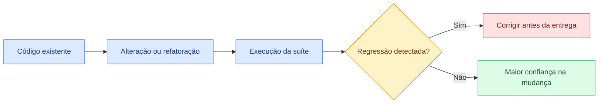

## 6.7 Apoio à integração contínua

A automação permite que o pipeline forneça uma resposta objetiva:

* compilou;
* não compilou;
* testes passaram;
* testes falharam;
* qualidade mínima foi atendida;
* versão pode ou não avançar.

---

# 7. Limitações e custos

A automação possui benefícios importantes, mas não é gratuita.

## 7.1 Investimento inicial

É necessário investir em:

* aprendizagem;
* frameworks;
* infraestrutura;
* ambientes;
* dados;
* integração;
* manutenção;
* análise de falhas.

## 7.2 Manutenção

Mudanças em:

* tela;
* contrato;
* banco;
* regra;
* arquitetura;
* autenticação;
* configuração;

podem exigir atualizações nos testes.

## 7.3 Falsa confiança

Uma suíte aprovada não garante que o sistema esteja sem defeitos.

Isso pode ocorrer quando:

* os casos são insuficientes;
* as asserções são fracas;
* os dados não representam situações reais;
* os testes cobrem apenas o caminho feliz;
* cenários importantes não foram automatizados;
* os testes verificam a implementação, mas não o requisito.

## 7.4 Instabilidade

Testes podem falhar sem existir defeito real no produto.

Causas comuns:

* dependência de horário;
* dados compartilhados;
* ambiente indisponível;
* seletor de tela frágil;
* concorrência;
* execução fora de ordem;
* resposta externa variável.

Esses testes são frequentemente chamados de testes instáveis ou *flaky tests*.

## 7.5 Tempo de execução

Uma suíte mal organizada pode levar horas, prejudicando o feedback.

## 7.6 Dependência da interface

Testes excessivamente concentrados na interface tendem a ser:

* mais lentos;
* mais frágeis;
* mais caros;
* mais difíceis de diagnosticar.

---

# 8. O que deve ser automatizado

Nem todo caso de teste deve ser automatizado.

## 8.1 Bons candidatos

* executados frequentemente;
* repetitivos;
* críticos para o negócio;
* determinísticos;
* com resultado objetivo;
* estáveis;
* necessários em regressão;
* com muitas combinações;
* difíceis de executar manualmente;
* necessários em vários ambientes.

## 8.2 Candidatos fracos

* executados apenas uma vez;
* muito instáveis;
* sujeitos a avaliação subjetiva;
* dependentes de percepção humana;
* funcionalidades em protótipo;
* cenários com custo de automação maior que o benefício;
* fluxos que mudam constantemente.

## 8.3 Matriz de decisão

| Frequência | Risco    | Estabilidade | Recomendação                 |
| ---------- | -------- | ------------ | ---------------------------- |
| Alta       | Alto     | Alta         | Automatizar prioritariamente |
| Alta       | Médio    | Alta         | Automatizar                  |
| Baixa      | Alto     | Alta         | Avaliar automação            |
| Alta       | Baixo    | Baixa        | Estabilizar antes            |
| Baixa      | Baixo    | Baixa        | Manter manual                |
| Única      | Qualquer | Baixa        | Normalmente não automatizar  |

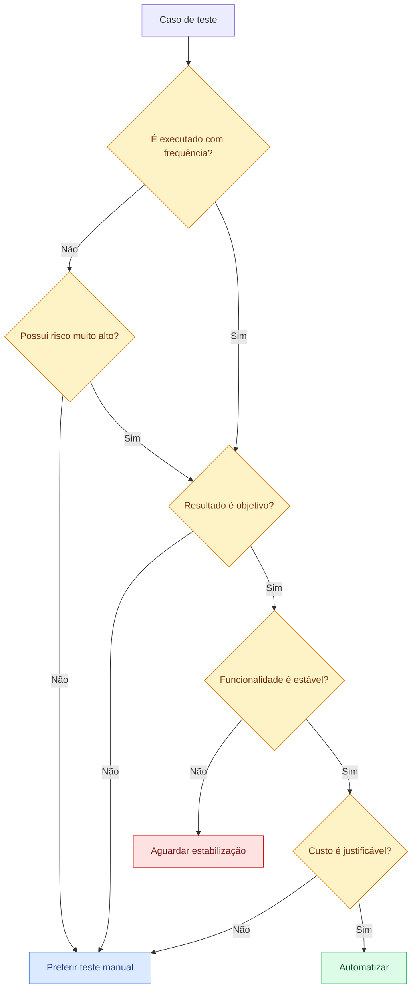

---

# 9. Níveis de automação

## 9.1 Testes unitários

Avaliam funções, métodos e classes isoladamente.

Características:

* rápidos;
* numerosos;
* fáceis de localizar;
* adequados a cada compilação;
* normalmente escritos pelos desenvolvedores.

## 9.2 Testes de integração

Avaliam a comunicação entre:

* serviço e banco;
* módulo e fila;
* aplicação e cache;
* componentes internos;
* microsserviços;
* aplicação e sistema externo.

## 9.3 Testes de API

Avaliam contratos sem depender da interface gráfica.

Podem verificar:

* método HTTP;
* status;
* cabeçalhos;
* corpo;
* validação;
* autenticação;
* autorização;
* esquema;
* tempo de resposta;
* comportamento em erros.

## 9.4 Testes de interface

Simulam ações do usuário em:

* navegador;
* aplicativo;
* formulário;
* fluxo de compra;
* navegação;
* autenticação.

## 9.5 Testes ponta a ponta

Validam um fluxo completo, atravessando múltiplas camadas.

Exemplo:

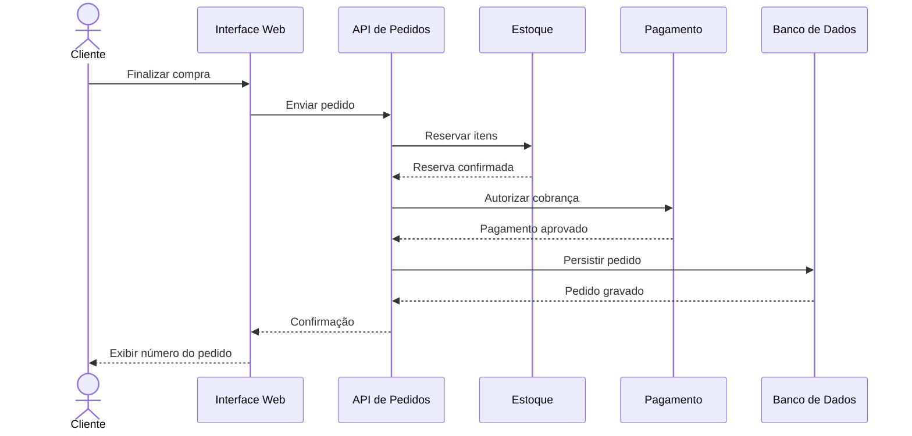

---

# 10. Pirâmide de testes

Uma estratégia equilibrada tende a ter:

* muitos testes unitários;
* quantidade intermediária de testes de integração e API;
* poucos testes ponta a ponta.

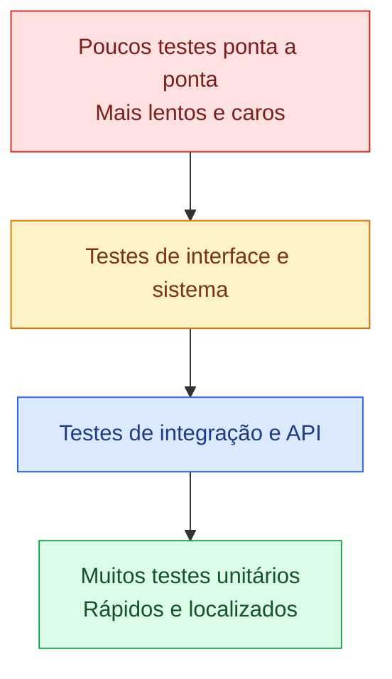

## 10.1 Motivo da distribuição

Testes unitários:

* executam rápido;
* indicam a causa com maior precisão;
* possuem menor dependência externa.

Testes ponta a ponta:

* envolvem várias camadas;
* exigem ambiente;
* utilizam mais dados;
* são mais sujeitos à instabilidade;
* dificultam a localização do defeito.

A pirâmide não é uma regra matemática rígida. Ela representa uma orientação econômica e técnica.

---

# 11. Ciclo de vida da automação

## 11.1 Planejamento

Define-se:

* objetivo;
* escopo;
* riscos;
* ferramentas;
* orçamento;
* responsáveis;
* ambientes;
* critérios de sucesso.

## 11.2 Análise

A equipe identifica:

* fluxos críticos;
* cenários frequentes;
* dependências;
* requisitos;
* riscos de regressão;
* dados necessários;
* pontos de observação.

## 11.3 Projeto

São definidos:

* estrutura dos testes;
* padrão de nomes;
* organização da suíte;
* estratégia de dados;
* tratamento de dependências;
* relatórios;
* níveis de teste.

## 11.4 Implementação

Inclui:

* código dos testes;
* objetos auxiliares;
* preparação de dados;
* simuladores;
* configurações;
* asserções;
* limpeza do ambiente.

## 11.5 Execução

Pode ocorrer:

* localmente;
* no pipeline;
* em agenda;
* sob demanda;
* em vários ambientes;
* em diferentes navegadores.

## 11.6 Análise

Cada falha deve ser classificada.

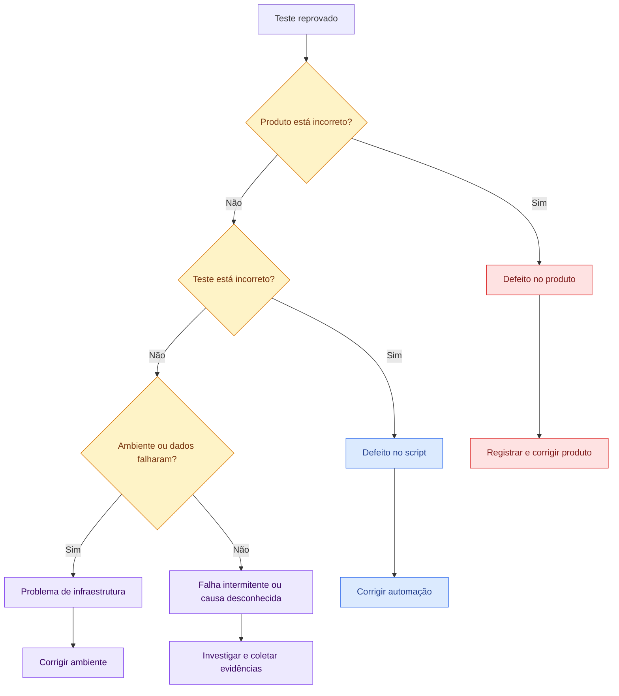

## 11.7 Manutenção

A suíte deve acompanhar:

* novas regras;
* correções;
* mudanças arquiteturais;
* alterações de interface;
* evolução dos dados;
* incidentes;
* novas dependências.

---

# 12. Anatomia de um teste automatizado

Um teste costuma seguir o padrão:

1. preparar;
2. executar;
3. verificar.

Também conhecido como:

* Arrange;
* Act;
* Assert.

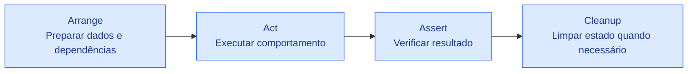

## 12.1 Exemplo conceitual

```java
@Test
void deveAplicarDescontoDeDezPorCento() {
    // Arrange
    BigDecimal valor = new BigDecimal("100.00");
    BigDecimal percentual = new BigDecimal("10");

    // Act
    BigDecimal resultado = calculadora.calcular(valor, percentual);

    // Assert
    assertEquals(new BigDecimal("90.00"), resultado);
}
```

---

# 13. Boas características dos testes automatizados

## 13.1 Independência

Um teste não deve depender do resultado de outro.

Inadequado:

```text
Teste 1 cria usuário
Teste 2 presume que o usuário do Teste 1 existe
Teste 3 remove o usuário
```

Problemas:

* execução fora de ordem;
* falha em cascata;
* dificuldade de execução isolada.

## 13.2 Determinismo

Com as mesmas condições, o teste deve produzir o mesmo resultado.

## 13.3 Clareza

O nome deve explicar o comportamento.

Exemplos:

```java
deveRecusarCupomExpirado()
deveCalcularFreteExpressoParaRegiaoAtendida()
deveNegarTransferenciaSemSaldo()
```

## 13.4 Rapidez

Testes rápidos produzem feedback útil.

## 13.5 Isolamento

Dependências externas devem ser controladas quando o objetivo for testar apenas uma unidade.

## 13.6 Asserções relevantes

O teste precisa verificar o resultado de negócio, não apenas a ausência de exceções.

Fraco:

```java
assertNotNull(resposta);
```

Melhor:

```java
assertEquals(StatusPedido.CONFIRMADO, resposta.getStatus());
assertEquals(new BigDecimal("150.00"), resposta.getTotal());
```

## 13.7 Diagnóstico

Quando falha, o teste deve ajudar a localizar a causa.

---

# 14. Testes parametrizados

Testes parametrizados executam a mesma lógica com vários conjuntos de dados.

```java
@ParameterizedTest
@CsvSource({
    "0, 10, 0",
    "100, 0, 100",
    "100, 10, 90",
    "100, 100, 0"
})
void deveCalcularDesconto(
        String valor,
        String percentual,
        String esperado) {

    BigDecimal resultado = calculadora.calcular(
            new BigDecimal(valor),
            new BigDecimal(percentual));

    assertEquals(new BigDecimal(esperado), resultado);
}
```

## 14.1 Benefícios

* menos duplicação;
* mais combinações;
* clareza dos dados;
* facilidade para adicionar casos;
* boa cobertura de limites e partições.

---

# 15. Simulação de dependências

Uma unidade pode depender de:

* banco de dados;
* serviço externo;
* relógio;
* fila;
* sistema de pagamento;
* envio de e-mail.

Quando o objetivo é testar apenas a regra da unidade, essas dependências podem ser substituídas por objetos controlados.

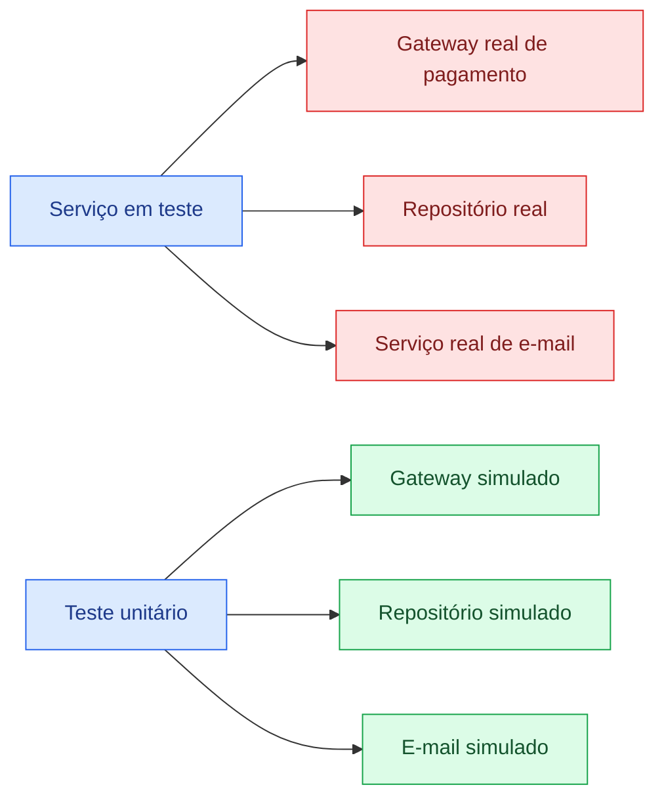

Essa técnica ajuda a:

* controlar respostas;
* simular erros;
* eliminar dependências instáveis;
* executar rapidamente;
* testar caminhos difíceis.

Ela não substitui testes de integração com as dependências reais.

---

# 16. Automação de APIs

APIs são candidatas fortes à automação porque possuem contratos objetivos.

## 16.1 Exemplo de requisição

```http
POST /pedidos
Content-Type: application/json
Authorization: Bearer <token>
```

```json
{
  "clienteId": 123,
  "itens": [
    {
      "produtoId": 10,
      "quantidade": 2
    }
  ],
  "cepEntrega": "70000-000"
}
```

## 16.2 Verificações possíveis

* status `201`;
* cabeçalho de localização;
* corpo válido;
* identificador gerado;
* total correto;
* itens persistidos;
* estoque reservado;
* operação auditada.

## 16.3 Exemplo de asserção em uma ferramenta de API

```javascript
pm.test("Deve criar o pedido", function () {
    pm.response.to.have.status(201);

    const body = pm.response.json();

    pm.expect(body.id).to.exist;
    pm.expect(body.status).to.eql("CRIADO");
    pm.expect(body.total).to.be.above(0);
});
```

## 16.4 Cenários negativos

* corpo vazio;
* produto inexistente;
* quantidade negativa;
* token ausente;
* usuário sem permissão;
* CEP inválido;
* estoque insuficiente;
* requisição duplicada;
* serviço externo indisponível.

---

# 17. Automação de interfaces web

O Selenium é apresentado no material como ferramenta para automatizar interações em navegadores e reproduzir comportamentos de usuários. 

## 17.1 Fluxo conceitual

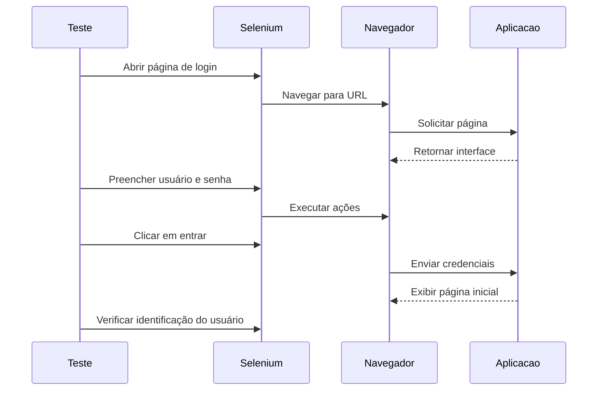

## 17.2 Exemplo ilustrativo

```java
@Test
void deveAutenticarUsuarioValido() {
    driver.get("https://aplicacao.exemplo/login");

    driver.findElement(By.id("email"))
          .sendKeys("usuario@exemplo.com");

    driver.findElement(By.id("senha"))
          .sendKeys("senha-valida");

    driver.findElement(By.id("entrar"))
          .click();

    WebElement identificacao = driver.findElement(
            By.id("usuario-autenticado"));

    assertEquals("Usuário de Teste", identificacao.getText());
}
```

## 17.3 Riscos de testes de interface

* seletores frágeis;
* carregamento assíncrono;
* dependência do navegador;
* lentidão;
* dados compartilhados;
* mudanças visuais frequentes;
* dificuldade de diagnóstico.

## 17.4 Boas práticas

* utilizar identificadores estáveis;
* esperar condições, não tempos fixos;
* preparar dados por API quando possível;
* manter poucos fluxos ponta a ponta;
* separar ações de página e asserções;
* executar testes críticos em cada pipeline;
* executar suítes extensas em horários programados.

---

# 18. JUnit

O JUnit é apresentado no material como framework para automação de testes unitários em aplicações Java. 

## 18.1 Responsabilidades típicas

* identificar métodos de teste;
* executar testes;
* fornecer asserções;
* organizar ciclos de preparação;
* agrupar testes;
* produzir resultados;
* integrar-se ao processo de compilação.

## 18.2 Exemplo completo

```java
class FreteServiceTest {

    private FreteService freteService;

    @BeforeEach
    void preparar() {
        freteService = new FreteService();
    }

    @Test
    void deveRetornarFreteGratisParaCompraElegivel() {
        Pedido pedido = new Pedido(
                new BigDecimal("250.00"),
                "70000-000",
                TipoEntrega.NORMAL);

        BigDecimal frete = freteService.calcular(pedido);

        assertEquals(BigDecimal.ZERO, frete);
    }

    @Test
    void deveRejeitarCepInvalido() {
        Pedido pedido = new Pedido(
                new BigDecimal("100.00"),
                "CEP-INVALIDO",
                TipoEntrega.NORMAL);

        IllegalArgumentException erro =
                assertThrows(
                        IllegalArgumentException.class,
                        () -> freteService.calcular(pedido));

        assertEquals("CEP inválido.", erro.getMessage());
    }
}
```

## 18.3 O que não deve ser feito

* acessar serviços externos em teste unitário;
* depender de data atual sem controlá-la;
* utilizar dados de produção;
* incluir muitos comportamentos em um único teste;
* escrever teste sem asserção;
* ocultar a intenção em métodos genéricos.

---

# 19. Postman

O material apresenta o Postman como plataforma para testar APIs e validar a comunicação entre sistemas. 

## 19.1 Possibilidades

* criar requisições;
* organizar coleções;
* configurar ambientes;
* utilizar variáveis;
* executar scripts;
* validar respostas;
* encadear chamadas;
* gerar dados;
* executar coleções automaticamente.

## 19.2 Estrutura de uma coleção

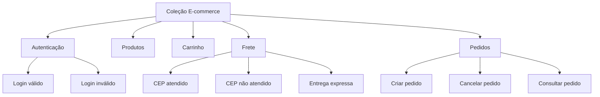

## 19.3 Cuidados

* não armazenar segredos diretamente na coleção;
* separar ambientes;
* limpar dados;
* validar mais que o status;
* não depender de ordem sem necessidade;
* evitar dados fixos conflitantes;
* registrar contratos esperados.

---

# 20. Selenium

O Selenium aparece no material como solução voltada à automação de navegadores e interfaces web. As páginas 50 da leitura e 16 dos slides apresentam a interface do Selenium IDE. 

## 20.1 Aplicações

* login;
* pesquisa;
* carrinho;
* checkout;
* cadastro;
* filtros;
* navegação;
* validação de mensagens;
* compatibilidade entre navegadores.

## 20.2 Page Object

Uma forma de organizar os testes é representar cada página por um objeto.

```java
public class LoginPage {

    private final WebDriver driver;

    private final By campoEmail = By.id("email");
    private final By campoSenha = By.id("senha");
    private final By botaoEntrar = By.id("entrar");

    public LoginPage(WebDriver driver) {
        this.driver = driver;
    }

    public void autenticar(String email, String senha) {
        driver.findElement(campoEmail).sendKeys(email);
        driver.findElement(campoSenha).sendKeys(senha);
        driver.findElement(botaoEntrar).click();
    }
}
```

Teste:

```java
@Test
void deveRealizarLogin() {
    driver.get(urlBase + "/login");

    LoginPage pagina = new LoginPage(driver);
    pagina.autenticar("teste@exemplo.com", "senha-valida");

    assertTrue(driver.getCurrentUrl().endsWith("/inicio"));
}
```

## 20.3 Benefício

Quando um seletor muda, a correção fica concentrada no objeto de página, e não espalhada por todos os testes.

---

# 21. Jenkins

O Jenkins é apresentado como ferramenta de integração contínua capaz de executar testes e *builds* quando novas alterações são realizadas. 

## 21.1 Papel no processo

O Jenkins não substitui JUnit, Selenium ou Postman. Ele coordena a execução.

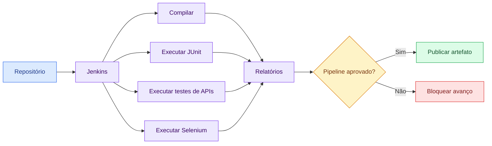

## 21.2 Pipeline ilustrativo

```groovy
pipeline {
    agent any

    stages {
        stage('Compilação') {
            steps {
                sh 'mvn clean compile'
            }
        }

        stage('Testes unitários') {
            steps {
                sh 'mvn test'
            }
        }

        stage('Testes de integração') {
            steps {
                sh 'mvn verify'
            }
        }

        stage('Publicação de relatórios') {
            steps {
                junit 'target/surefire-reports/*.xml'
            }
        }
    }

    post {
        always {
            archiveArtifacts(
                artifacts: 'target/**/*.log',
                allowEmptyArchive: true
            )
        }
    }
}
```

O exemplo é conceitual. Os comandos reais dependem da linguagem, infraestrutura e estratégia da organização.

---

# 22. Integração entre as ferramentas

O quadro apresentado nas páginas 52 da leitura e 19 dos slides relaciona:

| Ferramenta | Foco principal      | Aplicação                         |
| ---------- | ------------------- | --------------------------------- |
| Selenium   | Navegadores         | Testes de interface web           |
| JUnit      | Aplicações Java     | Testes unitários                  |
| Postman    | APIs                | Testes de comunicação e contratos |
| Jenkins    | Integração contínua | Execução de testes e *builds*     |


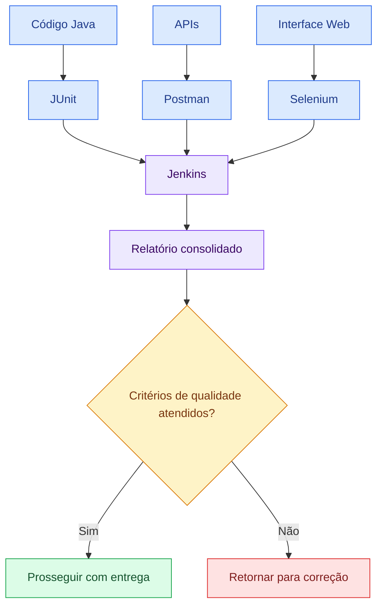

---

# 23. Integração contínua e testes contínuos

## 23.1 Integração contínua

Prática em que mudanças são integradas frequentemente e validadas automaticamente.

## 23.2 Testes contínuos

Execução de verificações ao longo do fluxo de desenvolvimento.

Não significa que todos os testes são executados o tempo inteiro. Significa que existem testes adequados em cada ponto.

## 23.3 Estratégia por estágio

| Estágio          | Testes recomendados                        |
| ---------------- | ------------------------------------------ |
| Alteração local  | Unitários e verificações rápidas           |
| Commit           | Unitários e análise estática               |
| Pull Request     | Unitários, integração e APIs afetadas      |
| Integração       | Regressão intermediária                    |
| Versão candidata | Sistema, interface, segurança e desempenho |
| Pós-implantação  | Testes de fumaça e monitoramento           |

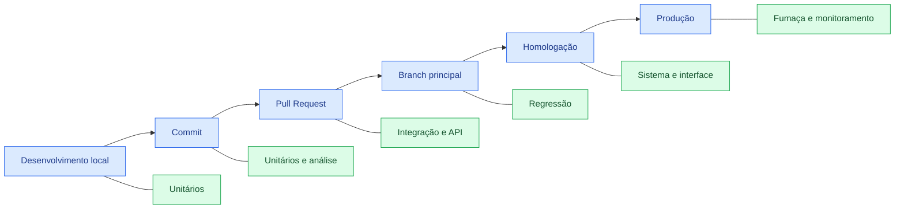

---

# 24. Estratégia de dados de teste

Os dados influenciam diretamente a confiabilidade da automação.

## 24.1 Problemas comuns

* uso do mesmo usuário por vários testes;
* dependência de dados permanentes;
* dados que expiram;
* conflito entre execuções;
* dependência de produção;
* dificuldade de limpeza;
* valores que mudam com o tempo.

## 24.2 Estratégias

* criar dados por teste;
* utilizar identificadores únicos;
* apagar dados após execução;
* restaurar banco conhecido;
* usar massa versionada;
* gerar dados dinamicamente;
* utilizar ambientes isolados;
* anonimizar informações.

## 24.3 Ciclo dos dados

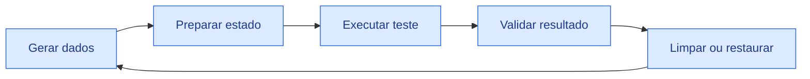

---

# 25. Ambientes de teste

Uma suíte pode falhar por problemas no ambiente, mesmo quando o produto está correto.

## 25.1 Elementos do ambiente

* versão da aplicação;
* banco;
* serviços;
* filas;
* autenticação;
* navegador;
* variáveis;
* certificados;
* rede;
* dados;
* permissões.

## 25.2 Boas práticas

* versionar configurações;
* identificar a versão testada;
* evitar alterações manuais não registradas;
* monitorar dependências;
* manter dados controlados;
* registrar indisponibilidades;
* isolar execuções quando necessário.

---

# 26. Relatórios e evidências

Um resultado útil deve responder:

* qual teste falhou?
* qual versão foi testada?
* em qual ambiente?
* qual dado foi utilizado?
* qual era o resultado esperado?
* qual foi o resultado observado?
* há log, imagem ou resposta?
* a falha é reproduzível?

## 26.1 Estrutura recomendada

```text
Identificador:
Nome do teste:
Data e hora:
Versão:
Ambiente:
Dados:
Resultado esperado:
Resultado obtido:
Situação:
Mensagem de falha:
Log:
Evidência:
Tempo de execução:
```

## 26.2 Painel conceitual

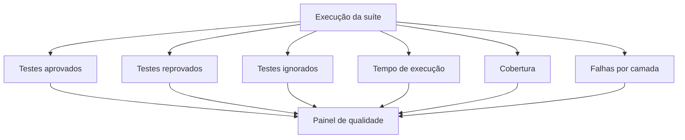

---

# 27. Métricas de automação

| Métrica                  | Finalidade                          |
| ------------------------ | ----------------------------------- |
| Quantidade de testes     | Acompanhar tamanho da suíte         |
| Taxa de aprovação        | Avaliar estabilidade da versão      |
| Tempo de execução        | Verificar velocidade do feedback    |
| Testes instáveis         | Identificar perda de confiança      |
| Defeitos encontrados     | Avaliar capacidade de detecção      |
| Defeitos escapados       | Identificar lacunas                 |
| Cobertura de requisitos  | Relacionar testes e funcionalidades |
| Cobertura de código      | Verificar partes exercitadas        |
| Tempo de manutenção      | Avaliar custo da suíte              |
| Frequência de execução   | Verificar uso efetivo               |
| Taxa de falha por camada | Localizar áreas frágeis             |
| Tempo até diagnóstico    | Avaliar qualidade dos relatórios    |

## 27.1 Cuidados com métricas

Cobertura alta não significa qualidade alta.

Exemplo:

```java
@Test
void testeSemValorReal() {
    servico.processar();
    assertTrue(true);
}
```

Esse teste pode executar linhas e aumentar a cobertura sem verificar nada relevante.

---

# 28. Antipadrões

## 28.1 Automatizar tudo pela interface

Consequências:

* lentidão;
* fragilidade;
* manutenção excessiva;
* diagnóstico difícil.

## 28.2 Testes dependentes de ordem

Consequências:

* falhas em cascata;
* impossibilidade de execução isolada;
* comportamento imprevisível.

## 28.3 Esperas fixas

Exemplo inadequado:

```java
Thread.sleep(5000);
```

Problemas:

* cinco segundos podem ser insuficientes;
* podem ser excessivos;
* aumentam a duração;
* produzem instabilidade.

## 28.4 Dados compartilhados

Vários testes alteram o mesmo registro.

## 28.5 Ignorar testes instáveis

Uma suíte que “às vezes falha” perde credibilidade.

## 28.6 Testes sem asserção

Executam passos, mas não confirmam o resultado.

## 28.7 Copiar e colar scripts

Gera duplicação e manutenção difícil.

## 28.8 Automatizar antes de estabilizar o processo

Se o requisito muda diariamente, o script também mudará diariamente.

## 28.9 Medir sucesso apenas pela quantidade

Mil testes fracos podem ser menos úteis que cem testes bem escolhidos.

---

# 29. Estudo de caso — E-commerce

Os slides apresentam uma plataforma de comércio eletrônico que, após o lançamento, recebeu reclamações sobre o fluxo de compra e o cálculo de frete. A empresa deseja iniciar a automação, mas ainda não possui experiência. 

## 29.1 Prioridades indicadas no material

* fluxo de compra, do carrinho ao pagamento;
* cálculo de frete com diferentes endereços e modalidades;
* login;
* cadastro de usuários.

As ferramentas indicadas são:

* Selenium para simular interações no navegador;
* Postman para testar a API de frete. 

## 29.2 Análise de risco

| Funcionalidade |    Impacto | Frequência | Prioridade |
| -------------- | ---------: | ---------: | ---------: |
| Login          |       Alto |       Alta |       Alta |
| Pesquisa       |      Médio |       Alta |      Média |
| Carrinho       |       Alto |       Alta |       Alta |
| Frete          |       Alto |       Alta |    Crítica |
| Pagamento      | Muito alto |       Alta |    Crítica |
| Histórico      |      Médio |      Média |      Média |
| Tema visual    |      Baixo |      Baixa |      Baixa |

## 29.3 Estratégia em camadas

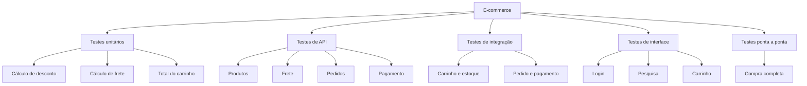

## 29.4 Plano inicial

### Fase 1 — Proteção rápida

Automatizar:

* regra de frete;
* regra de total;
* cupom;
* login por API;
* criação de pedido por API.

### Fase 2 — Integrações críticas

Automatizar:

* carrinho e estoque;
* pedido e pagamento;
* cancelamento e estorno;
* cálculo de frete por fornecedor externo.

### Fase 3 — Interface

Automatizar:

* login;
* busca;
* adicionar ao carrinho;
* finalizar compra;
* exibir confirmação.

### Fase 4 — Pipeline

Configurar:

* unitários em todo commit;
* APIs em Pull Requests;
* interface crítica na branch principal;
* regressão completa programada.

---

# 30. Casos de teste para o cálculo de frete

| Cenário                      | Entrada                  | Resultado esperado             |
| ---------------------------- | ------------------------ | ------------------------------ |
| CEP atendido                 | CEP válido e peso normal | Frete calculado                |
| Frete grátis                 | Compra acima do limite   | Valor zero                     |
| CEP inválido                 | Formato incorreto        | Rejeição                       |
| Área não atendida            | CEP fora da cobertura    | Mensagem apropriada            |
| Entrega expressa             | Modalidade expressa      | Valor e prazo ajustados        |
| Peso-limite                  | Peso máximo permitido    | Cálculo realizado              |
| Peso acima do limite         | Peso excedido            | Rejeição                       |
| Serviço externo indisponível | Timeout                  | Erro controlado ou alternativa |
| Requisição repetida          | Mesmos dados             | Resultado consistente          |

## 30.1 Tabela de decisão

| Condição/ação                   | Regra 1 | Regra 2 |      Regra 3 |  Regra 4 |
| ------------------------------- | ------: | ------: | -----------: | -------: |
| CEP atendido?                   |     Sim |     Sim |          Não |      Sim |
| Compra elegível a frete grátis? |     Sim |     Não |            — |      Não |
| Entrega expressa?               |     Não |     Não |            — |      Sim |
| Resultado                       |  Grátis |  Normal | Indisponível | Expresso |

---

# 31. Fluxo automatizado de compra

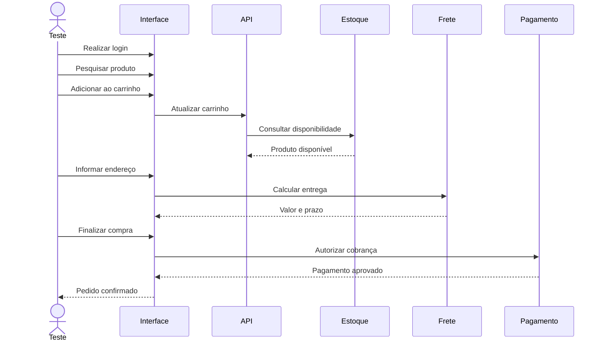

## 31.1 Asserções essenciais

* usuário autenticado;
* produto correto no carrinho;
* quantidade correta;
* total correto;
* frete correto;
* pagamento aprovado;
* número do pedido gerado;
* estoque atualizado;
* pedido persistido;
* confirmação exibida.

---

# 32. Aplicabilidade por setor

O material destaca que a automação deve ser adaptada ao domínio. 

## 32.1 E-commerce

Prioridades:

* pagamento;
* frete;
* estoque;
* promoções;
* concorrência;
* picos de acesso.

## 32.2 Sistemas financeiros

Prioridades:

* precisão;
* autorização;
* consistência;
* auditoria;
* segurança;
* idempotência.

## 32.3 Saúde

Prioridades:

* integridade dos dados;
* rastreabilidade;
* precisão;
* privacidade;
* regras clínicas;
* disponibilidade.

## 32.4 Governo e serviços públicos

Prioridades:

* segurança;
* acessibilidade;
* rastreabilidade;
* alto volume;
* conformidade;
* continuidade.

## 32.5 Telecomunicações

Prioridades:

* grande escala;
* eventos;
* integrações;
* desempenho;
* faturamento;
* disponibilidade.

---

# 33. Segurança da própria automação

Os testes também podem introduzir riscos.

## 33.1 Riscos

* senhas no código;
* tokens versionados;
* dados reais de clientes;
* acesso excessivo;
* logs com informações sensíveis;
* ambientes de teste expostos;
* contas administrativas compartilhadas.

## 33.2 Cuidados

* utilizar cofres de segredo;
* criar usuários específicos;
* limitar permissões;
* anonimizar dados;
* rotacionar credenciais;
* evitar segredos nos relatórios;
* proteger artefatos do pipeline;
* separar ambientes.

---

# 34. Critérios de entrada e saída

## 34.1 Critérios de entrada

Antes de automatizar:

* [ ] requisito compreendido;
* [ ] comportamento estável;
* [ ] resultado esperado objetivo;
* [ ] ambiente disponível;
* [ ] dados controláveis;
* [ ] ferramenta selecionada;
* [ ] risco e prioridade definidos;
* [ ] responsável identificado.

## 34.2 Critérios de saída

Um caso automatizado pode ser considerado pronto quando:

* [ ] possui nome claro;
* [ ] executa isoladamente;
* [ ] possui asserções relevantes;
* [ ] prepara seus dados;
* [ ] não expõe informações sensíveis;
* [ ] produz evidência adequada;
* [ ] está versionado;
* [ ] foi revisado;
* [ ] executa no pipeline previsto;
* [ ] possui documentação mínima.

---

# 35. Checklist de automação

## 35.1 Estratégia

* [ ] Quais riscos serão cobertos?
* [ ] Quais camadas serão testadas?
* [ ] Quais cenários permanecerão manuais?
* [ ] Qual será a pirâmide?
* [ ] Qual frequência de execução?
* [ ] Quais ambientes serão utilizados?
* [ ] Como os resultados serão comunicados?

## 35.2 Código dos testes

* [ ] Nome descreve comportamento?
* [ ] Teste é independente?
* [ ] Resultado é determinístico?
* [ ] Asserção é relevante?
* [ ] Dados são controlados?
* [ ] Dependências são adequadas ao nível?
* [ ] Logs ajudam no diagnóstico?
* [ ] Não há informação sensível?
* [ ] Duplicação foi evitada?

## 35.3 Interface

* [ ] Seletores são estáveis?
* [ ] Esperas são condicionais?
* [ ] Fluxo é realmente crítico?
* [ ] Dados são preparados de forma eficiente?
* [ ] Capturas são geradas em falhas?
* [ ] O navegador é encerrado?

## 35.4 API

* [ ] Status é validado?
* [ ] Corpo é validado?
* [ ] Contrato é verificado?
* [ ] Autorização é testada?
* [ ] Cenários negativos existem?
* [ ] Idempotência foi considerada?
* [ ] Tempo de resposta é observado?

## 35.5 Pipeline

* [ ] Testes rápidos executam cedo?
* [ ] Falhas bloqueiam o avanço?
* [ ] Relatórios são publicados?
* [ ] Evidências são armazenadas?
* [ ] Segredos estão protegidos?
* [ ] Suítes extensas possuem agendamento?
* [ ] Testes instáveis são tratados?

---

# 36. Questões para revisão

<details>
<summary><strong>1. O que é um teste automatizado?</strong></summary>

É uma verificação executada por script ou ferramenta que prepara condições, executa o software, compara resultados e registra a aprovação ou reprovação.

</details>

<details>
<summary><strong>2. Qual é a diferença entre caso de teste e script?</strong></summary>

O caso descreve o cenário, dados e resultado esperado. O script é a implementação executável desse caso.

</details>

<details>
<summary><strong>3. A automação elimina os testes manuais?</strong></summary>

Não. Testes exploratórios, de usabilidade e avaliações subjetivas continuam exigindo participação humana.

</details>

<details>
<summary><strong>4. Qual é uma vantagem importante da automação?</strong></summary>

Reduzir o esforço humano em tarefas repetitivas, permitindo execuções frequentes e consistentes. Essa é a resposta indicada no quiz dos slides. 

</details>

<details>
<summary><strong>5. Por que não concentrar todos os testes na interface?</strong></summary>

Porque testes de interface tendem a ser mais lentos, frágeis, caros e difíceis de diagnosticar.

</details>

<details>
<summary><strong>6. Qual é o papel do JUnit?</strong></summary>

Apoiar a implementação e execução de testes automatizados em aplicações Java, especialmente testes unitários.

</details>

<details>
<summary><strong>7. Qual é o papel do Selenium?</strong></summary>

Automatizar interações em navegadores e verificar fluxos de interfaces web.

</details>

<details>
<summary><strong>8. Qual é o papel do Postman?</strong></summary>

Criar, executar e organizar testes de APIs, verificando requisições, respostas e contratos.

</details>

<details>
<summary><strong>9. Qual é o papel do Jenkins?</strong></summary>

Orquestrar etapas de integração contínua, incluindo compilação, execução de testes e publicação de relatórios.

</details>

<details>
<summary><strong>10. O que é um teste instável?</strong></summary>

É um teste que alterna entre aprovação e reprovação sem uma mudança correspondente no produto.

</details>

<details>
<summary><strong>11. O que caracteriza um bom candidato à automação?</strong></summary>

Frequência alta, risco relevante, resultado objetivo, comportamento estável e custo justificável.

</details>

<details>
<summary><strong>12. O que deve ocorrer quando um teste automatizado falha?</strong></summary>

A equipe deve investigar se a causa está no produto, no script, nos dados, no ambiente ou em uma dependência.

</details>

---

# 37. Resumo para prova

```text
AUTOMAÇÃO DE TESTES
Uso de scripts e ferramentas para executar verificações repetíveis.

PROCESSO DE AUTOMAÇÃO
Planejamento, análise, projeto, implementação, execução,
análise de resultados e manutenção.

CASO DE TESTE
Descrição do cenário, entrada, condições e resultado esperado.

SCRIPT
Implementação executável do caso de teste.

ASSERÇÃO
Comparação entre resultado esperado e resultado observado.

SUÍTE
Conjunto organizado de testes automatizados.

PRINCIPAIS BENEFÍCIOS
Rapidez, repetibilidade, escalabilidade, regressão e feedback contínuo.

PRINCIPAIS LIMITAÇÕES
Investimento inicial, manutenção, instabilidade e falsa confiança.

JUNIT
Framework utilizado em testes automatizados de aplicações Java.

SELENIUM
Automação de navegadores e interfaces web.

POSTMAN
Criação e execução de testes de APIs.

JENKINS
Orquestração de integração contínua, builds e testes.

PIRÂMIDE
Muitos testes unitários, quantidade intermediária de integração
e poucos testes ponta a ponta.

BOM CANDIDATO
Teste frequente, determinístico, estável e relevante para o negócio.

TESTE INSTÁVEL
Falha de forma intermitente sem defeito consistente no produto.

IDEIA CENTRAL
Automação não é apenas executar testes mais rápido.
É construir um processo confiável de feedback sobre a qualidade.
```

---

# 38. Mapa mental

```mermaid
mindmap
  root((Testes automatizados))
    Conceitos
      Processo
      Caso de teste
      Script
      Suíte
      Asserção
      Oráculo
      Fixture
      Dados
    Benefícios
      Rapidez
      Repetibilidade
      Escalabilidade
      Regressão
      Feedback contínuo
      Menor esforço repetitivo
    Limitações
      Investimento
      Manutenção
      Instabilidade
      Falsa confiança
      Ambientes
    Camadas
      Unitário
      Integração
      API
      Interface
      Ponta a ponta
    Ferramentas
      JUnit
        Java
        Testes unitários
      Selenium
        Navegadores
        Interface web
      Postman
        APIs
        Contratos
      Jenkins
        Pipeline
        Integração contínua
    Processo
      Planejar
      Priorizar
      Projetar
      Implementar
      Executar
      Analisar
      Manter
    Boas práticas
      Independência
      Determinismo
      Clareza
      Rapidez
      Dados controlados
      Asserções relevantes
    Aplicações
      E-commerce
      Finanças
      Saúde
      Governo
      Telecomunicações
```

---

# 39. Conclusão

Os processos e casos de testes automatizados permitem transformar verificações repetitivas em um mecanismo contínuo de feedback.

O valor da automação não está apenas na velocidade. Está na capacidade de:

* repetir verificações;
* proteger funcionalidades existentes;
* apoiar mudanças;
* detectar regressões;
* aumentar a confiança;
* integrar qualidade ao fluxo de desenvolvimento;
* liberar profissionais para atividades analíticas.

As ferramentas apresentadas possuem responsabilidades complementares:

* **JUnit:** valida unidades e regras Java;
* **Postman:** verifica APIs e contratos;
* **Selenium:** automatiza fluxos em navegadores;
* **Jenkins:** coordena a execução no pipeline.

Uma estratégia eficaz evita a concentração excessiva na interface e distribui os testes em diferentes camadas. Também seleciona casos com base em risco, frequência, estabilidade e retorno do investimento.

O principal aprendizado do Tema 04 é que **automação de testes é um processo de engenharia, e não apenas a gravação de passos em uma ferramenta**. Para gerar valor, os testes precisam ser confiáveis, claros, sustentáveis, integrados ao desenvolvimento e alinhados aos riscos do produto.

---

# Referências do material

* ANICHE, Mauricio. *Testes automatizados de software: um guia prático*. São Paulo: Casa do Código, 2015.
* DELAMARO, Márcio; JINO, Mario; MALDONADO, José. *Introdução ao teste de software*. 2. ed. Rio de Janeiro: Campus, 2016.
* FÉLIX, Rafael. *Teste de software*. São Paulo: Pearson, 2016.
* KALINOWSKI, Marcos; SPÍNOLA, Rodrigo. *Introdução à Inspeção de Software — Aumentando a Qualidade Através de Verificações Intermediárias*. Engenharia de Software Magazine, 2008.
* KAWAGUCHI, Kohsuke. *User Interface Refresh*. Jenkins, 2014.
* PERES, Hugo. *Automatizando Testes de Software com Selenium*. Rio de Janeiro: Simplíssimo Livros, 2016.
* POLO, Rodrigo Cantú. *Validação e teste de software*. São Paulo: Contentus, 2020.
* PRESSMAN, Roger S. *Engenharia de software: uma abordagem profissional*. 8. ed. Porto Alegre: AMGH, 2016.
* RIOS, Emerson; MOREIRA, Trayahú. *Teste de Software*. Alta Books, 2013.
* SANTOS, Luiz Diego Vidal; OLIVEIRA, Catuxe Varjão de Santana. *Introdução à garantia de qualidade de software*. Timburi: Cia do eBook, 2017.
