# Tema 01 — Qualidade do Software, Documentação de Testes e Modelo TMMi

> **Disciplina:** Validação do Software: Testes de Software e Aplicações de Segurança no Sistema
> **Tema:** Qualidade do software, documentação de testes e o modelo TMMi
> **Autoria do material:** Luís Otávio Toledo Perin
> **Objetivo deste documento:** consolidar o conteúdo do Tema 01 em formato técnico, didático e adequado para consulta e revisão.

---

## 1. Objetivos de aprendizagem

Ao concluir este tema, deve-se ser capaz de:

1. **Definir o conceito de qualidade de software**.
2. **Compreender o processo de documentação de testes de software**.
3. **Compreender a estrutura e a finalidade do modelo TMMi** (*Test Maturity Model integration*).

## Esses são exatamente os três objetivos estabelecidos pela leitura digital e pelos slides do Tema 01.

# 2. Visão geral

A ideia central deste tema é que **qualidade não deve ser tratada como uma atividade executada somente depois que o software está pronto**.

Ela precisa fazer parte de todo o processo de engenharia de software.

A construção de software envolve:

* requisitos;
* projeto;
* implementação;
* testes;
* documentação;
* métricas;
* avaliação dos resultados;
* manutenção;
* melhoria contínua.

O material ressalta que o sucesso ou fracasso de um sistema depende das boas práticas utilizadas durante seu desenvolvimento e da capacidade da organização de detectar e solucionar problemas.

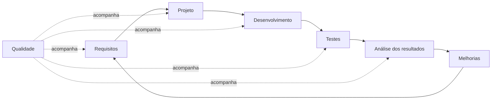

A mensagem mais importante é:

> **Qualidade é um processo contínuo, e não uma etapa isolada do desenvolvimento.**

---

# 3. Qualidade de software

## 3.1 O que significa qualidade?

No contexto apresentado no material, qualidade envolve principalmente duas perspectivas:

### Qualidade do projeto

Está relacionada ao grau em que o projeto contempla as:

* funções;
* características;
* necessidades;
* requisitos definidos para o software.

### Qualidade de conformidade

Está relacionada ao quanto a implementação realizada realmente:

* segue o projeto definido;
* satisfaz os requisitos;
* atende às necessidades;
* cumpre as metas de desempenho.

Assim, não basta desenvolver muitas funcionalidades.

O software precisa **implementar corretamente aquilo que foi especificado** e oferecer comportamento compatível com aquilo que o usuário necessita.

---

## 3.2 Qualidade vai além da ausência de bugs

Um software que simplesmente "não apresenta erro" não necessariamente possui qualidade.

A avaliação precisa considerar aspectos como:

* funcionalidade;
* confiabilidade;
* usabilidade;
* eficiência;
* manutenibilidade;
* portabilidade;
* segurança;
* comportamento diante das necessidades do usuário.

O próprio material enfatiza que avaliar qualidade de software vai além da simples preocupação com defeitos de funcionamento.

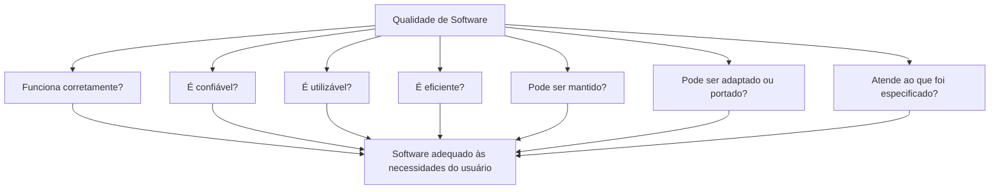

---

# 4. Qualidade não significa perfeição

Um conceito particularmente importante para provas e para a prática profissional é:

> **Buscar qualidade não significa garantir que nunca haverá defeitos.**

Nenhum software está completamente imune a falhas.

Qualidade envolve:

* prevenção de defeitos;
* detecção de problemas;
* planejamento;
* medição;
* correção;
* aprendizado;
* melhoria contínua.

O material contrapõe explicitamente **perfeição** a **aperfeiçoamento contínuo**, destacando técnicas de prevenção e detecção como componentes da garantia da qualidade.

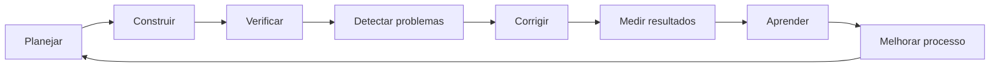

---

# 5. Planejamento da qualidade

Antes de avaliar a qualidade de um software é necessário saber **o que significa qualidade para aquele projeto**.

O material apresenta quatro entradas fundamentais para o planejamento:

1. **Política da qualidade**;
2. **Escopo do projeto**;
3. **Processos, procedimentos e padrões**;
4. **Especificação do produto**.

Esses elementos alimentam o planejamento da qualidade e resultam em um **plano da qualidade**.

## 5.1 Diagrama — Planejamento da qualidade

A figura apresentada no material pode ser representada em Mermaid da seguinte maneira:

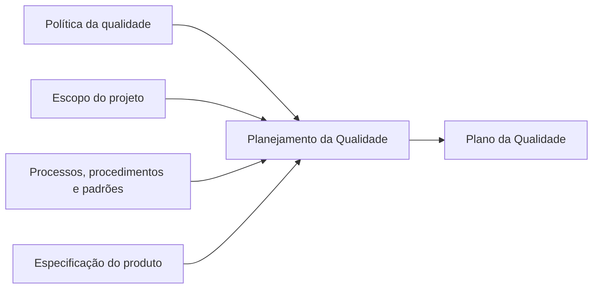

### Política da qualidade

Determina os princípios e o nível de qualidade esperado.

### Escopo do projeto

Determina:

* quais problemas serão resolvidos;
* quais necessidades deverão ser atendidas;
* o que pertence ao sistema;
* o que está fora do sistema.

### Processos, procedimentos e padrões

Estabelecem a forma pela qual o projeto será executado.

### Especificação do produto

É necessário conhecer claramente:

* o que o software faz;
* o que o software não faz;
* quais características são esperadas.

Sem esses elementos, torna-se difícil definir objetivamente o que deve ser considerado um produto de qualidade.

---

# 6. Garantia da qualidade

Planejar não é suficiente.

Depois da criação do plano, é necessário garantir que a qualidade realmente seja alcançada.

O material associa a garantia da qualidade a aspectos como:

* segurança;
* eficiência;
* confiabilidade;
* integridade;
* usabilidade;
* prevenção de defeitos.

O processo combina o **plano da qualidade** com **métricas**, produzindo informações que permitam melhorar o produto e o processo.

## 6.1 Diagrama — Garantia da qualidade

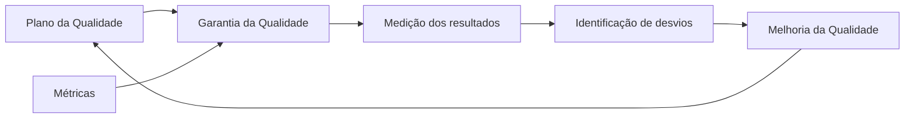

A diferença entre os dois conceitos pode ser resumida assim:

| Planejamento da qualidade    | Garantia da qualidade                          |
| ---------------------------- | ---------------------------------------------- |
| Define o que será realizado  | Verifica se aquilo foi realizado adequadamente |
| Estabelece critérios         | Aplica critérios e métricas                    |
| Produz o plano da qualidade  | Produz evidências e melhoria                   |
| Tem forte caráter preventivo | Combina prevenção, avaliação e melhoria        |

---

# 7. Modelo de qualidade ISO/IEC 9126 no material

O conteúdo utiliza a **ISO/IEC 9126** como modelo para avaliação da qualidade do produto de software.

O modelo apresentado divide a qualidade em seis características principais.

| Característica       | Objetivo                                                        | Subcaracterísticas apresentadas                                                          |
| -------------------- | --------------------------------------------------------------- | ---------------------------------------------------------------------------------------- |
| **Funcionalidade**   | Atender às necessidades do usuário por meio das funcionalidades | Adequação, acurácia, interoperabilidade e segurança                                      |
| **Confiabilidade**   | Manter o nível de desempenho nas condições estabelecidas        | Maturidade, tolerância a falhas e recuperabilidade                                       |
| **Usabilidade**      | Permitir que o software seja compreendido e utilizado           | Inteligibilidade, apreensibilidade, operacionalidade e atratividade                      |
| **Eficiência**       | Relacionar recursos consumidos ao desempenho                    | Comportamento e utilização de recursos                                                   |
| **Manutenibilidade** | Permitir que o sistema seja analisado e modificado              | Analisabilidade, modificabilidade, estabilidade e testabilidade                          |
| **Portabilidade**    | Possibilitar a transferência para outros ambientes              | Adaptabilidade, capacidade para ser instalado, coexistência e capacidade para substituir |

### Representação visual

```mermaid
flowchart TD
    ISO["Qualidade do Produto — ISO/IEC 9126"]

    ISO --> F["Funcionalidade"]
    ISO --> C["Confiabilidade"]
    ISO --> U["Usabilidade"]
    ISO --> E["Eficiência"]
    ISO --> M["Manutenibilidade"]
    ISO --> P["Portabilidade"]

    F --> F1["Adequação"]
    F --> F2["Acurácia"]
    F --> F3["Interoperabilidade"]
    F --> F4["Segurança"]

    C --> C1["Maturidade"]
    C --> C2["Tolerância a falhas"]
    C --> C3["Recuperabilidade"]

    U --> U1["Inteligibilidade"]
    U --> U2["Apreensibilidade"]
    U --> U3["Operacionalidade"]
    U --> U4["Atratividade"]

    E --> E1["Comportamento"]
    E --> E2["Utilização de recursos"]

    M --> M1["Analisabilidade"]
    M --> M2["Modificabilidade"]
    M --> M3["Estabilidade"]
    M --> M4["Testabilidade"]

    P --> P1["Adaptabilidade"]
    P --> P2["Capacidade para ser instalado"]
    P --> P3["Coexistência"]
    P --> P4["Capacidade para substituir"]
```

---

# 8. Documentação de testes de software

## 8.1 Por que documentar testes?

Executar um teste sem documentá-lo reduz drasticamente seu valor para a organização.

A documentação possibilita:

* registrar o que foi testado;
* indicar como o teste foi executado;
* registrar entradas utilizadas;
* determinar o resultado esperado;
* registrar o resultado obtido;
* identificar incidentes;
* reproduzir testes;
* acompanhar defeitos;
* comparar versões;
* manter histórico;
* gerar métricas;
* fornecer rastreabilidade.

O material destaca que documentação simples, clara, baseada em métricas e processos precisos contribui para evitar imprecisão e perda das informações utilizadas na avaliação do software.

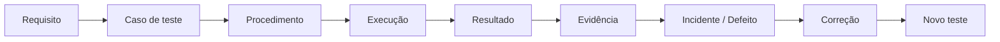

---

# 9. IEEE 829 no material da disciplina

O material utiliza a **IEEE 829** como referência para documentação de testes.

A proposta da norma é estabelecer uma estrutura padronizada para registrar as informações relacionadas ao processo de teste.

São apresentados **oito documentos principais**.

1. Plano de testes.
2. Especificação do projeto de teste.
3. Especificação de caso de teste.
4. Especificação do procedimento de teste.
5. Relatório de transição de itens de teste.
6. Relatório de log de teste.
7. Relatório de incidentes.
8. Relatório final ou sumário.

---

# 10. Organização lógica da documentação

Os oito documentos podem ser entendidos didaticamente em três grandes grupos.

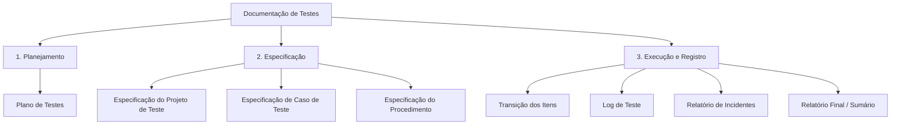

Essa separação ajuda a visualizar o processo como:

```text
ANTES DO TESTE → DURANTE O TESTE → DEPOIS DO TESTE
```

Ou:

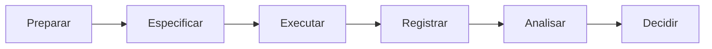

---

# 11. Plano de testes

O **plano de testes** estabelece como o processo será conduzido.

De acordo com o material, ele prepara a elaboração e a execução dos testes e pode identificar:

* funcionalidades que serão testadas;
* itens de teste;
* tarefas;
* riscos;
* recursos;
* responsabilidades;
* condições necessárias para execução.

Um plano responde, essencialmente:

```text
O que testar?
Por que testar?
Como testar?
Quem testará?
Quando testar?
Onde testar?
Quais riscos existem?
```

---

# 12. Especificações de teste

As especificações determinam de maneira mais detalhada como o teste será realizado.

Elas estabelecem:

* casos de teste;
* entradas;
* resultados esperados;
* procedimentos;
* sequência de execução.

A lógica é:

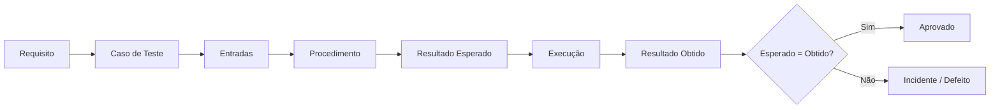

---

# 13. Relatórios de testes

Após a execução, os acontecimentos relevantes precisam ser registrados.

Os relatórios possibilitam manter um histórico contendo:

* eventos ocorridos;
* resultados;
* incidentes;
* anormalidades;
* evidências;
* informações necessárias para análise.

Essa documentação transforma uma simples execução em uma **evidência verificável de qualidade**.

---

# 14. Caso de teste

## 14.1 Conceito

Um caso de teste define as condições necessárias para verificar determinado comportamento do software.

O material utiliza um exemplo tradicional baseado na validação de um triângulo equilátero.

A estrutura apresentada contém:

| Campo             | Significado                             |
| ----------------- | --------------------------------------- |
| **ID**            | Identificador único do teste            |
| **Nome**          | O que será verificado                   |
| **Ambiente**      | Ambiente no qual o teste será realizado |
| **Ator**          | Quem executa ou participa do cenário    |
| **Precondições**  | Estado necessário antes da execução     |
| **Procedimento**  | Sequência de passos                     |
| **Pós-condições** | Estado esperado ao final                |

No exemplo do material:

* ID: `TCS-111`;
* objetivo: verificar um triângulo equilátero;
* entradas: lados 7, 7 e 7;
* resultado esperado: identificação do triângulo como equilátero.

---

# 15. Estrutura conceitual de um bom caso de teste

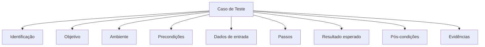

Quanto mais preciso o caso, maior a possibilidade de:

* reproduzir o comportamento;
* comparar execuções;
* identificar regressões;
* gerar estatísticas;
* fundamentar decisões.

---

# 16. Relação entre requisitos e testes

Um teste não deve existir isoladamente.

Idealmente deve ser possível responder:

> **Qual requisito este teste está validando?**

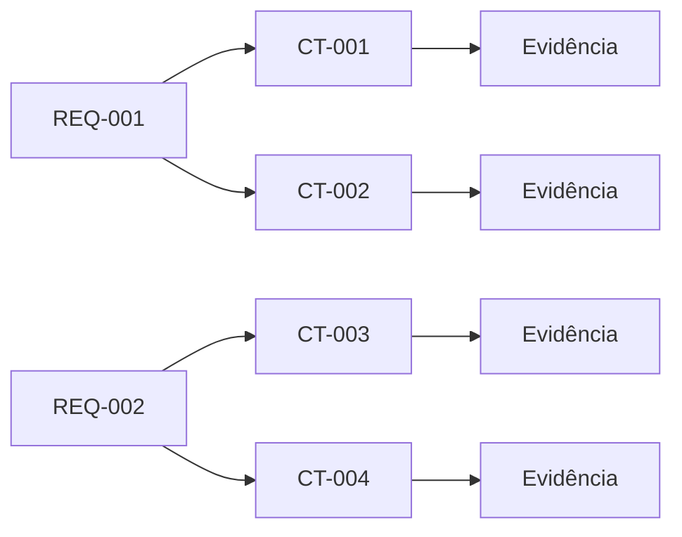

Essa relação produz **rastreabilidade**, permitindo conhecer quais requisitos foram testados e quais ainda precisam ser validados.

---

# 17. TMMi — Test Maturity Model integration

## 17.1 Finalidade

Organizações diferentes apresentam diferentes níveis de maturidade na forma de realizar testes.

Algumas trabalham de maneira:

* improvisada;
* sem documentação;
* sem estratégia;
* sem métricas;
* dependente do conhecimento individual.

Outras possuem:

* processos definidos;
* equipes especializadas;
* métricas;
* monitoramento;
* automação;
* melhoria contínua.

O **TMMi** foi criado para estruturar essa evolução do processo de testes.

O modelo complementa abordagens de melhoria de processos, como CMMI, direcionando-se especificamente à maturidade dos processos de teste.

---

# 18. Estrutura do TMMi

O modelo é composto por **cinco níveis de maturidade**.

Uma organização evolui gradualmente conforme seus processos passam de uma condição essencialmente **ad hoc** para uma condição **controlada, mensurada e continuamente otimizada**.

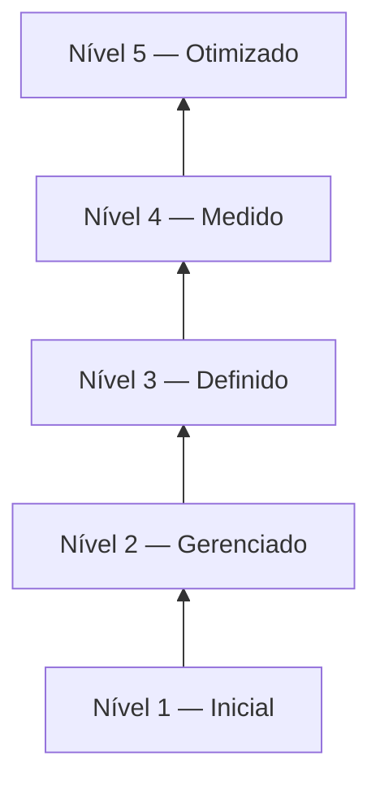

---

# 19. Nível 1 — Inicial

No primeiro nível:

* não existem métricas de teste bem definidas;
* testes são realizados de forma **ad hoc**;
* teste e depuração podem ser confundidos;
* os testes aparecem principalmente após o término da codificação;
* o objetivo acaba sendo demonstrar simplesmente que o programa executa;
* o sucesso depende fortemente das pessoas;
* qualidade e riscos têm baixa visibilidade.

O material caracteriza esse nível como essencialmente caótico e sem processo formalizado.

```text
Desenvolver → Encontrar problema → Depurar → Testar → Liberar
```

---

# 20. Nível 2 — Gerenciado

No nível 2 começa a existir um **processo de teste gerenciado** e separado da simples depuração.

São introduzidos:

* estratégia de teste;
* planejamento;
* gerenciamento de riscos;
* envolvimento dos stakeholders;
* monitoramento;
* controle;
* ambiente de testes.

O objetivo passa a ser verificar se o produto satisfaz seus requisitos, embora o material ressalte que os testes ainda tendem a ocorrer relativamente tarde no ciclo de vida.

As áreas de processo apresentadas pelo TMMi para este estágio incluem política e estratégia de testes, planejamento, monitoramento e controle, projeto e execução e ambiente de testes.

---

# 21. Nível 3 — Definido

No nível 3:

* testes são integrados ao ciclo de desenvolvimento;
* o planejamento ocorre antecipadamente;
* existe um plano mestre de testes;
* profissionais especializados em testes são reconhecidos;
* programas de treinamento são instituídos;
* testes não funcionais passam a receber tratamento sistemático;
* revisões por pares são incorporadas.

As áreas de processo associadas ao nível incluem:

* organização de testes;
* programa de treinamento em testes;
* ciclo de vida e integração de testes;
* testes não funcionais;
* revisões por pares.

---

# 22. Nível 4 — Medido

Neste nível, o processo está:

* definido;
* fundamentado;
* mensurado;
* orientado por dados.

Passam a existir objetivos quantitativos para avaliar:

* desempenho do processo de teste;
* qualidade do produto;
* confiabilidade;
* usabilidade;
* manutenibilidade.

O teste passa a ser compreendido de forma mais ampla, envolvendo atividades de verificação e validação durante o ciclo de vida.

Áreas de processo:

* medição de testes;
* avaliação da qualidade do produto;
* revisões avançadas.

---

# 23. Nível 5 — Otimizado

É o nível de maior maturidade apresentado pelo modelo.

Nele:

* o processo é completamente definido;
* custos e efetividade podem ser controlados;
* existe melhoria contínua;
* prevenção de defeitos ganha destaque;
* controle da qualidade é institucionalizado;
* técnicas estatísticas são utilizadas;
* automação e ferramentas apoiam a otimização.

As áreas de processo incluem:

* prevenção de defeitos;
* otimização do processo de testes;
* controle da qualidade.

---

# 24. TMMi completo — níveis e áreas de processo

Uma representação equivalente à figura de maturidade presente no material é:

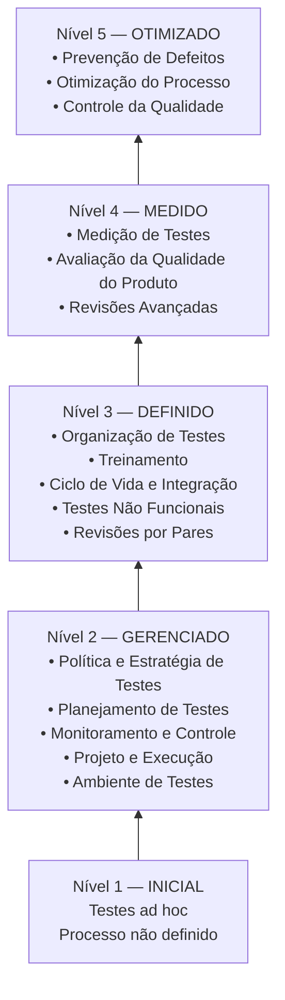

A estrutura oficial do TMMi confirma a progressão de **Initial → Managed → Defined → Measured → Optimization**, com áreas de processo específicas em cada nível a partir do nível 2.

---

# 25. Como interpretar o TMMi

O objetivo não é simplesmente conseguir um "selo".

O raciocínio do modelo é:

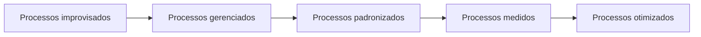

Quanto maior a maturidade:

* menor a dependência de improvisação;
* maior a previsibilidade;
* maior a rastreabilidade;
* maior a utilização de evidências;
* maior o controle;
* maior a capacidade de melhoria.

O próprio TMMi alerta que cada nível cria a fundação necessária para o seguinte e que simplesmente tentar saltar níveis tende a ser contraproducente.

---

# 26. Relação entre qualidade, documentação e TMMi

Os três grandes assuntos deste tema não são independentes.

Eles formam uma sequência lógica:

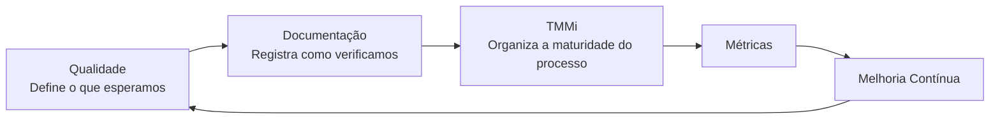

### Qualidade

Determina **o que significa um produto satisfatório**.

### Documentação

Registra **como essa qualidade foi verificada**.

### TMMi

Estrutura **como a organização amadurece seu processo de testes**.

---

# 27. Erro comum: confundir teste com garantia absoluta de qualidade

Testar não prova que o software não possui defeitos.

O teste fornece **evidências** sobre:

* comportamentos observados;
* requisitos validados;
* cenários executados;
* falhas identificadas;
* riscos conhecidos.

Por isso, a qualidade depende da combinação de:

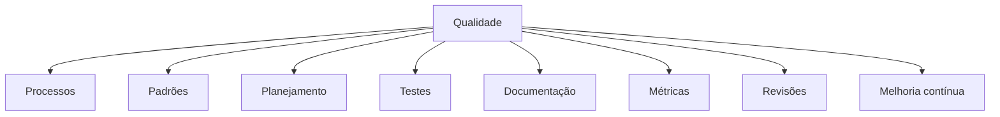

---

# 28. Papel das métricas

Uma organização não consegue melhorar de forma consistente aquilo que não consegue observar.

Métricas ajudam a transformar percepções subjetivas em informações para decisão.

Exemplos didáticos:

* quantidade de defeitos identificados;
* defeitos por funcionalidade;
* defeitos reabertos;
* percentual de testes aprovados;
* percentual de requisitos cobertos;
* tempo médio para correção;
* quantidade de regressões;
* custo associado ao retrabalho.

No TMMi, a medição ganha importância crescente, tornando-se institucionalizada principalmente no nível 4.

---

# 29. Da reação à prevenção

Um dos principais efeitos da maturidade é mudar a forma de pensar.

### Organização pouco madura

```text
Problema → Corrigir → Liberar
```

### Organização madura

```text
Planejar → Prevenir → Testar → Medir → Analisar → Melhorar
```

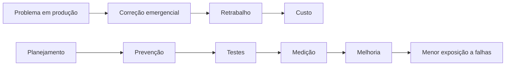

---

# 30. Aplicação ao Desafio Profissional — empresa de Robson

O Desafio Profissional descreve uma organização que, apesar de possuir um produto comercialmente relevante e uma equipe de testes e qualidade, mantém práticas motivadas pelo medo de perder sua propriedade intelectual e acaba resistindo à modernização dos processos.

No papel de analista de testes, a primeira tarefa indicada é **mapear os problemas recorrentes da aplicação**, principalmente aqueles que retornaram em razão de falhas de programação ou estrutura de código. O objetivo é demonstrar ao gestor o tempo e o dinheiro consumidos pelo retrabalho.

## 30.1 Diagnóstico

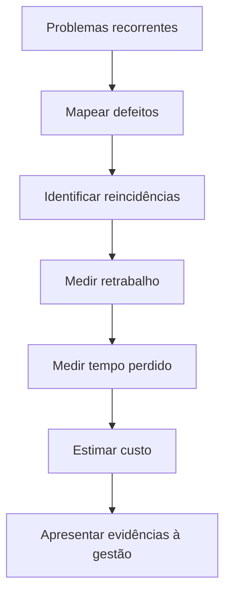

---

# 31. Proposta de atuação no Tema 01

A resposta coerente com o conteúdo estudado seria:

### 1. Levantar os defeitos recorrentes

Identificar:

* funcionalidade;
* defeito;
* versão;
* recorrência;
* origem provável;
* impacto;
* tempo de correção.

### 2. Quantificar o retrabalho

Transformar problemas técnicos em informação gerencial.

### 3. Padronizar a documentação dos testes

Estabelecer:

* plano;
* casos de teste;
* procedimentos;
* evidências;
* incidentes;
* relatórios.

### 4. Definir métricas

Por exemplo:

```text
Defeitos reabertos
Defeitos por versão
Defeitos encontrados em produção
Tempo médio de correção
Cobertura dos requisitos
Taxa de aprovação dos testes
```

### 5. Avaliar a maturidade atual

Utilizar o TMMi como referência para identificar a distância entre o processo atual e um processo estruturado.

### 6. Implementar melhoria incremental

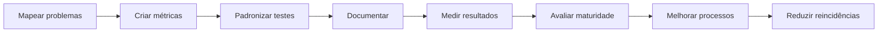

A proposta de resolução fornecida pela própria disciplina reforça que a argumentação para a gestão deve ser fundamentada em evidências: metodologia, métricas e boas práticas devem reduzir problemas, demanda de retrabalho e gastos, permitindo direcionar recursos para novos projetos. Para o Tema 01, o foco é justamente compreender **testes bem realizados como parte da garantia da qualidade do software**.

---

# 32. Relação entre qualidade e custo

Um problema encontrado repetidamente consome:

```text
tempo do desenvolvedor
      +
tempo do testador
      +
tempo de análise
      +
tempo de homologação
      +
risco de produção
      =
custo de retrabalho
```

Portanto:

```mermaid
flowchart LR
    D["Defeito"] --> R["Retrabalho"]
    R --> T["Tempo"]
    R --> C["Custo"]
    R --> A["Atrasos"]
    R --> I["Insatisfação"]

    P["Prevenção + Testes"] --> RD["Redução de defeitos"]
    RD --> RC["Redução de retrabalho"]
```

É justamente essa relação que deve ser demonstrada no caso da empresa de Robson.

---

# 33. Aprendizado do podcast

O podcast utiliza uma comparação entre sistemas antigos e modernos para mostrar a evolução da engenharia de software.

O cenário antigo envolve processos:

* manuais;
* lentos;
* centralizados;
* pouco amigáveis.

O cenário atual envolve:

* aplicações web;
* dispositivos móveis;
* integração;
* processamento praticamente imediato;
* interfaces mais ricas.

A conclusão apresentada é que a evolução da engenharia de software permitiu produzir soluções cada vez mais precisas e com maior qualidade.

A relação com o Tema 01 pode ser representada assim:

```mermaid
flowchart LR
    A["Sistemas simples"] --> B["Maior complexidade"]
    B --> C["Maior dependência de software"]
    C --> D["Maior exigência de qualidade"]
    D --> E["Processos de teste"]
    E --> F["Padronização"]
    F --> G["Métricas"]
    G --> H["Modelos de maturidade"]
```

---

# 34. Atualização técnica — referências atuais em 2026

> **ATENÇÃO PARA A PROVA:** as questões da disciplina devem ser respondidas de acordo com o material didático fornecido. Portanto, quando a questão mencionar o conteúdo estudado, considere **ISO/IEC 9126**, **IEEE 829** e a estrutura TMMi apresentada pelo curso.

Para utilização profissional atual, entretanto, algumas referências evoluíram.

## 34.1 Modelo atual de qualidade do produto

O material utiliza a ISO/IEC 9126. Atualmente, a **ISO/IEC 25010:2023** define o modelo de qualidade de produto aplicável a produtos de TIC e software e organiza o modelo em **nove características de qualidade**.

Portanto:

```text
DISCIPLINA / PROVA
ISO/IEC 9126
      ↓
REFERÊNCIA PROFISSIONAL ATUAL
ISO/IEC 25010:2023
```

---

## 34.2 Documentação atual de testes

O conteúdo utiliza a IEEE 829 para ensinar a estrutura da documentação de testes.

Na padronização internacional atual, a **ISO/IEC/IEEE 29119-3:2021** especifica templates de documentação de teste aplicáveis a organizações, projetos e atividades de teste, associados aos processos definidos pela parte 2 da série.

```text
BASE HISTÓRICA DO CURSO
IEEE 829
      ↓
REFERÊNCIA INTERNACIONAL ATUAL
ISO/IEC/IEEE 29119
      ↓
Parte 3 — Documentação de Testes
```

---

## 34.3 Evolução do TMMi

O TMMi continua sendo mantido pela TMMi Foundation.

A organização atualmente disponibiliza o **TMMi Model v2.0**, incorporando explicitamente contextos modernos como **Agile e DevOps**.

Isso reforça que maturidade de testes não significa necessariamente utilizar processos pesados ou incompatíveis com desenvolvimento ágil.

---

# 35. O que memorizar para a prova

## 35.1 Qualidade

**Qualidade não é perfeição.**

É:

```text
Planejamento
+ padrões
+ procedimentos
+ métricas
+ testes
+ análise
+ melhoria contínua
```

---

## 35.2 Planejamento

Memorize:

```text
Política da qualidade
        +
Escopo
        +
Processos, procedimentos e padrões
        +
Especificação do produto
        ↓
Planejamento da qualidade
        ↓
Plano da qualidade
```

---

## 35.3 Garantia

```text
Plano da qualidade
        +
Métricas
        ↓
Garantia da qualidade
        ↓
Melhoria da qualidade
```

---

## 35.4 ISO 9126 no material

Memorize as seis características:

```text
F C U E M P
```

* **F**uncionalidade
* **C**onfiabilidade
* **U**sabilidade
* **E**ficiência
* **M**anutenibilidade
* **P**ortabilidade

---

## 35.5 IEEE 829 no material

Pense em três grupos:

```text
PLANEJAR
    ↓
ESPECIFICAR
    ↓
REGISTRAR
```

E nos oito documentos:

1. Plano de testes.
2. Projeto de teste.
3. Caso de teste.
4. Procedimento de teste.
5. Transição de itens.
6. Log de teste.
7. Incidentes.
8. Relatório final.

---

## 35.6 TMMi

Memorize:

```text
1 — Inicial
2 — Gerenciado
3 — Definido
4 — Medido
5 — Otimizado
```

Ou:

```mermaid
flowchart LR
    A["1<br/>Inicial"] --> B["2<br/>Gerenciado"]
    B --> C["3<br/>Definido"]
    C --> D["4<br/>Medido"]
    D --> E["5<br/>Otimizado"]
```

---

# 36. Questões destacadas pelo material

O *Aprendizagem em Foco* apresenta duas questões especialmente úteis para revisão.

### Questão 1

A garantia da qualidade deve assegurar que ________, procedimentos e métricas sejam utilizados durante todo o ciclo de desenvolvimento.

**Resposta do material:** **Padrões**.

---

### Questão 2

Por que um conjunto de testes é dividido em testes menores ou estágios?

**Resposta indicada pelo material:** porque testes organizados em estágios são considerados mais fáceis de lidar e executar.

---

# 37. Perguntas de revisão

Antes de considerar o Tema 01 dominado, deve ser possível responder sem consulta:

1. O que é qualidade de software?
2. Qual a diferença entre qualidade de projeto e qualidade de conformidade?
3. Por que qualidade não significa perfeição?
4. Quais informações alimentam o planejamento da qualidade?
5. Qual é o resultado do planejamento da qualidade?
6. Qual é a função das métricas?
7. Quais são as seis características da ISO 9126 apresentadas no material?
8. Por que testes precisam ser documentados?
9. Qual é a finalidade da IEEE 829 no contexto estudado?
10. Quais são os oito documentos apresentados?
11. O que é um caso de teste?
12. O que são precondições?
13. O que são pós-condições?
14. Qual a função do TMMi?
15. Quais são seus cinco níveis?
16. Como se caracteriza o nível Inicial?
17. O que muda no nível Gerenciado?
18. Quando o processo passa a ser integrado ao ciclo de desenvolvimento?
19. Em qual nível predominam métricas quantitativas?
20. Em qual nível aparece a otimização contínua?
21. Como qualidade, documentação e maturidade se relacionam?
22. Como aplicar esses conceitos ao caso da empresa de Robson?

---

# 38. Mapa mental do Tema 01

```mermaid
flowchart TD
    T["TEMA 01<br/>Qualidade, Documentação e TMMi"]

    T --> Q["Qualidade"]
    T --> D["Documentação de Testes"]
    T --> M["Maturidade"]

    Q --> Q1["Planejamento"]
    Q --> Q2["Garantia"]
    Q --> Q3["Métricas"]
    Q --> Q4["ISO 9126"]

    D --> D1["IEEE 829"]
    D --> D2["Plano de Testes"]
    D --> D3["Caso de Teste"]
    D --> D4["Procedimentos"]
    D --> D5["Relatórios"]

    M --> M1["TMMi"]
    M1 --> L1["1 Inicial"]
    M1 --> L2["2 Gerenciado"]
    M1 --> L3["3 Definido"]
    M1 --> L4["4 Medido"]
    M1 --> L5["5 Otimizado"]
```

---

# 39. Resumo executivo

O Tema 01 estabelece que a qualidade de software deve ser construída ao longo de todo o ciclo de desenvolvimento e não verificada apenas ao final. Para isso, é necessário estabelecer políticas, escopo, processos, padrões e especificações, produzindo um plano da qualidade e utilizando métricas para avaliar seus resultados.

A documentação de testes fornece rastreabilidade e transforma as execuções em evidências analisáveis. O material utiliza a IEEE 829 para organizar essa documentação em plano, especificações, procedimentos e relatórios.

Os casos de teste estruturam aquilo que será verificado, estabelecendo ambiente, precondições, passos e resultados esperados. Dessa maneira, testes deixam de ser ações improvisadas e tornam-se processos reproduzíveis e mensuráveis.

O TMMi fornece um caminho de evolução da maturidade dos testes, começando pelo nível **Inicial**, caracterizado por práticas ad hoc, e evoluindo pelos níveis **Gerenciado**, **Definido** e **Medido** até chegar ao nível **Otimizado**, baseado em medição, prevenção e melhoria contínua.

No contexto do Desafio Profissional, essa abordagem deve ser utilizada para demonstrar que a adoção de metodologia, métricas e processos de teste reduz reincidências, retrabalho e custos, aumentando a capacidade da equipe de direcionar recursos para evolução do produto.

---

# 40. Glossário

| Termo                     | Definição                                                                                       |
| ------------------------- | ----------------------------------------------------------------------------------------------- |
| **Qualidade de software** | Grau em que o produto atende às características, requisitos e necessidades estabelecidas        |
| **Política da qualidade** | Diretrizes que estabelecem o nível e os princípios de qualidade esperados                       |
| **Plano da qualidade**    | Resultado do planejamento das atividades relacionadas à qualidade                               |
| **Garantia da qualidade** | Atividades destinadas a assegurar que padrões e critérios sejam cumpridos                       |
| **Métrica**               | Medida utilizada para avaliar quantitativamente algum aspecto do produto ou processo            |
| **Teste**                 | Atividade utilizada para verificar comportamentos e revelar defeitos                            |
| **Caso de teste**         | Especificação das condições e procedimentos utilizados para verificar determinado comportamento |
| **Precondição**           | Estado necessário antes da execução do teste                                                    |
| **Pós-condição**          | Estado esperado após sua execução                                                               |
| **IEEE 829**              | Referência de documentação de testes utilizada no material da disciplina                        |
| **TMMi**                  | Modelo de maturidade voltado à melhoria dos processos de teste                                  |
| **Maturidade**            | Grau de definição, gerenciamento, medição e otimização de um processo                           |
| **Rastreabilidade**       | Capacidade de relacionar requisitos, testes, resultados, defeitos e evidências                  |
| **Melhoria contínua**     | Evolução sistemática do produto e do processo a partir da análise dos resultados                |

---

# 41. Material-base utilizado

Esta documentação foi consolidada a partir dos materiais fornecidos para a disciplina:

* **Leitura Digital — Validação do Software: Testes de Software e Aplicações de Segurança no Sistema**.
* **Aprendizagem em Foco — Tema 01**.
* **Slides — Tema 01: Qualidade do software, documentação de testes e modelo TMMi**.
* **Podcast — Tema 01**.
* **Desafio Profissional**.
* **Proposta de Resolução do Desafio**.

### Referências técnicas atuais utilizadas apenas para atualização

* ISO/IEC 25010:2023 — modelo atual de qualidade de produto de software e TIC.
* ISO/IEC/IEEE 29119 — série internacional dedicada aos processos e documentação de testes; a Parte 3 trata da documentação de teste.
* TMMi Foundation — estrutura oficial dos níveis e áreas de processo e documentação atual do modelo.

---

## Conclusão

A síntese do Tema 01 pode ser reduzida a uma cadeia de raciocínio:

```mermaid
flowchart LR
    A["Definir qualidade"] --> B["Planejar"]
    B --> C["Estabelecer padrões"]
    C --> D["Criar testes"]
    D --> E["Documentar"]
    E --> F["Executar"]
    F --> G["Medir"]
    G --> H["Analisar"]
    H --> I["Melhorar"]
    I --> J["Aumentar maturidade"]
    J --> A
```

> **Qualidade é planejada.
> Testes fornecem evidências.
> Documentação fornece rastreabilidade.
> Métricas permitem medir.
> TMMi organiza a evolução.
> Melhoria contínua fecha o ciclo.**
