# Tema 02 — Gerenciamento dos Testes de Software com Ferramentas CASE *Open Source*

> **Disciplina:** Validação do Software: Testes de Software e Aplicações de Segurança no Sistema
> **Tema:** Gerenciamento dos testes de software com ferramentas CASE *open source*
> **Autoria do material:** Luís Otávio Toledo Perin
> **Objetivo desta documentação:** consolidar o conteúdo do Tema 02 em formato didático, técnico e adequado para manutenção no GitHub, preservando o conteúdo da disciplina e convertendo os principais elementos visuais para Mermaid.

A documentação foi elaborada a partir da **Leitura Digital**, dos **slides do Tema 02** e do **podcast** fornecidos.   

---

## 1. Objetivos de aprendizagem

O Tema 02 estabelece três objetivos centrais:

1. **Definir o que é teste de software.**
2. **Compreender o processo de teste de software.**
3. **Conhecer ferramentas CASE *open source* aplicáveis ao gerenciamento de testes.**

Esses objetivos aparecem tanto na Leitura Digital quanto nos slides da disciplina.  

---

# 2. Visão geral

O ponto de partida deste tema é que **testar software não deve ser opcional**.

O aumento da dependência de sistemas informatizados torna necessário verificar, por meio de processos, métricas, padrões e técnicas, se aquilo que foi desenvolvido realmente funciona de maneira compatível com os requisitos e com as expectativas do usuário. 

Um processo de teste organizado pode ser entendido assim:

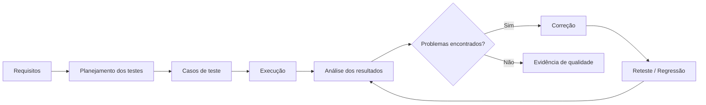

A ideia não é simplesmente executar o software.

É necessário responder previamente:

* **O que testar?**
* **Quando testar?**
* **Como testar?**
* **Qual resultado é esperado?**

---

# 3. Teste de software e qualidade

Um teste isolado, executado sem critério ou objetivo, possui pouco valor.

O material destaca que **testar por testar não é suficiente**. O teste precisa estar inserido em um processo de qualidade. Seu objetivo não é, por si próprio, corrigir problemas, mas identificar falhas, desvios e situações que necessitam de correção ou aperfeiçoamento. 

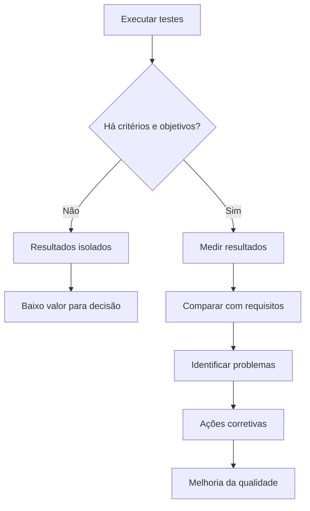

Portanto:

> **O teste fornece informação. A qualidade depende da utilização dessa informação dentro de um processo de engenharia.**

---

# 4. O ciclo de desenvolvimento e os testes

O desenvolvimento de software envolve diversas etapas, normalmente relacionadas a:

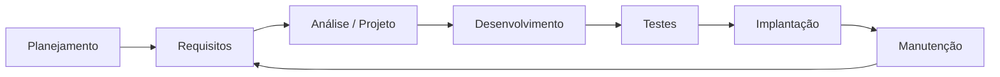

Mesmo com:

* métodos;
* métricas;
* ferramentas;
* processos definidos;

erros ainda podem ocorrer.

O material associa problemas não identificados à possibilidade de:

* aumento de custos;
* atrasos;
* retrabalho;
* comprometimento da qualidade;
* comprometimento da segurança;
* até insucesso do produto. 

Por isso são utilizadas práticas de **VV&T — Verificação, Validação e Teste** durante o ciclo de desenvolvimento.

---

# 5. Verificação, validação e teste — VV&T

O material utiliza VV&T como conjunto de práticas destinadas a reduzir a quantidade de problemas que chegam ao usuário.

Didaticamente:

| Conceito        | Pergunta principal                                                                   |
| --------------- | ------------------------------------------------------------------------------------ |
| **Verificação** | Estamos construindo o produto de acordo com o que foi especificado?                  |
| **Validação**   | Estamos construindo o produto adequado às necessidades do usuário?                   |
| **Teste**       | O comportamento executado apresenta resultados compatíveis com aquilo que se espera? |

Uma representação conceitual:

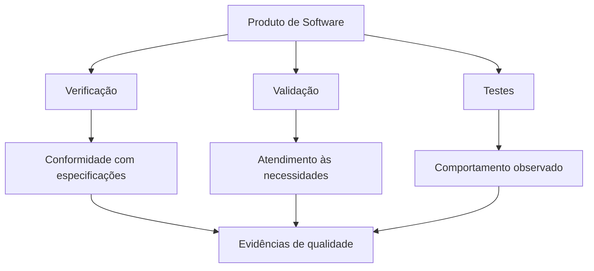

---

# 6. Gerenciamento da qualidade versus desenvolvimento

Uma das figuras mais importantes do Tema 02 apresenta **dois processos paralelos**:

1. processo de desenvolvimento;
2. processo de gerenciamento da qualidade.

A qualidade não aparece apenas no final. O processo de desenvolvimento produz entregas que são periodicamente avaliadas pelo processo de qualidade. 

## 6.1 Representação em Mermaid

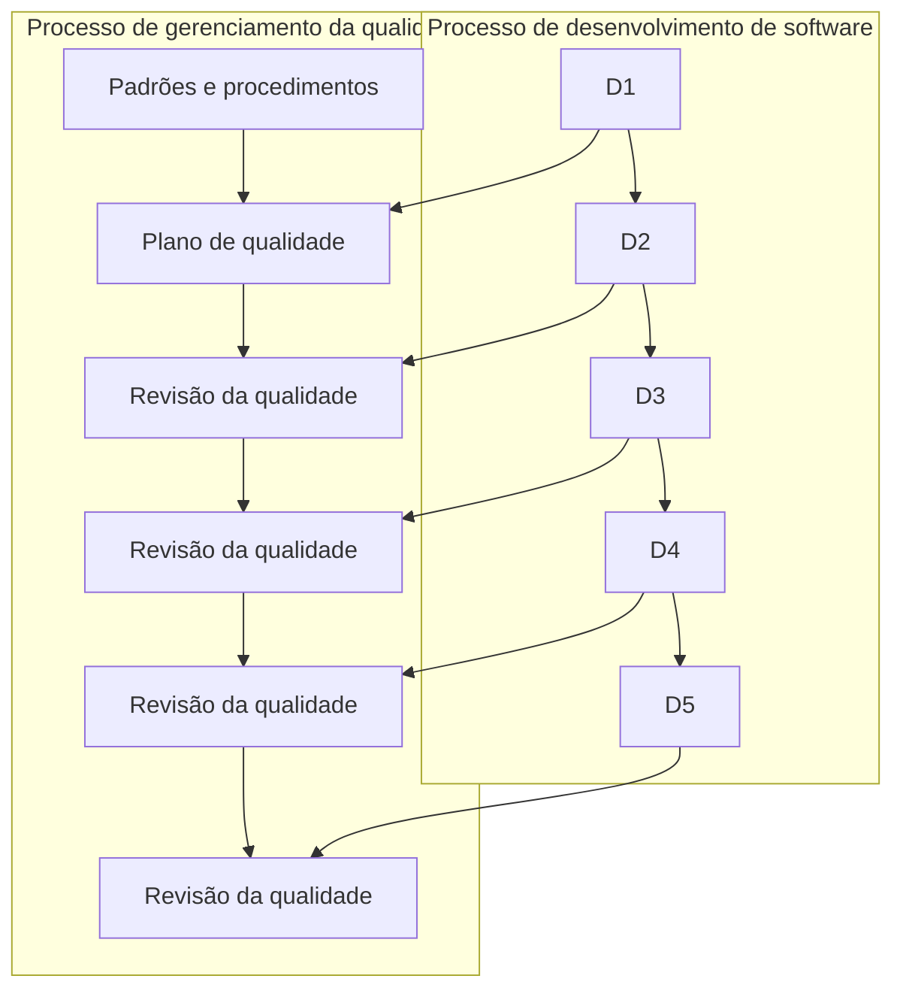

A figura demonstra que **qualidade acompanha as entregas durante o desenvolvimento**.

---

# 7. Independência da equipe de qualidade

O material enfatiza que desenvolvimento e qualidade devem possuir independência suficiente para que a avaliação seja objetiva.

A lógica apresentada é:

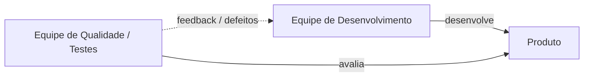

A independência tem como finalidade reduzir conflitos de interesse e proporcionar maior transparência na avaliação do produto. 

---

# 8. Pressão por prazo versus qualidade

O cronograma é apresentado no material como um possível fator de comprometimento da qualidade.

Um problema típico acontece quando:

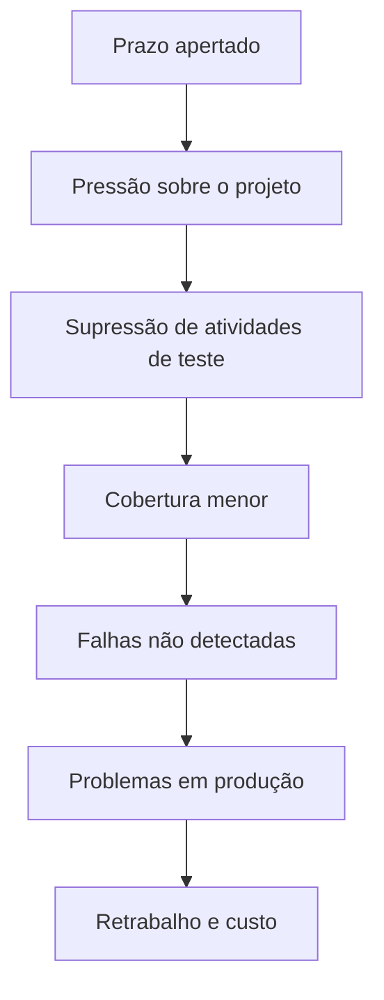

Reduzir artificialmente a atividade de testes pode permitir uma entrega mais rápida no curto prazo, mas aumenta a exposição do software a problemas que poderiam ter sido identificados anteriormente. 

---

# 9. O processo de teste de software

O material apresenta duas perguntas fundamentais:

> **Como devo testar?**

e

> **Qual é o resultado esperado?**

Sem essas respostas não existe um critério objetivo de aprovação.

O processo básico pode ser representado como:

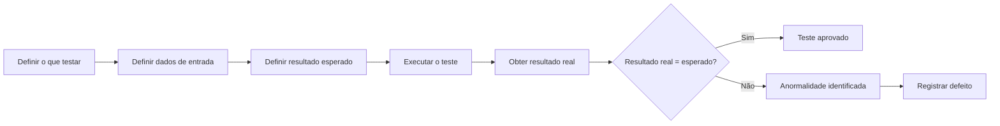

Durante a execução, dados podem ser inseridos no software e seus resultados comparados com aquilo que foi previsto.

---

# 10. Erro, defeito e falha

Este é um dos conceitos mais importantes do Tema 02.

O material diferencia:

* **Erro**
* **Defeito**
* **Falha**


## 10.1 Erro

Segundo a abordagem apresentada no material, o **erro** está associado a uma ação humana incorreta.

Por exemplo:

```java
if (idade > 18) {
    permitirAcesso();
}
```

Se a regra correta fosse permitir acesso a partir de 18 anos, o programador interpretou ou codificou incorretamente a condição.

---

## 10.2 Defeito

O **defeito**, também chamado de *bug* no material, é a imperfeição presente no software resultante de uma ação incorreta.

Exemplo:

```java
if (idade > 18)
```

quando deveria ser:

```java
if (idade >= 18)
```

---

## 10.3 Falha

A **falha** ocorre quando o defeito é executado e resulta em comportamento incorreto perceptível.

Por exemplo:

```text
Usuário: 18 anos
Resultado esperado: acesso permitido
Resultado obtido: acesso negado
```

---

# 11. Cadeia erro → defeito → falha

A relação didática pode ser representada assim:

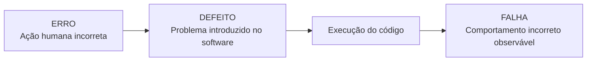

Ou seja:

```text
ERRO HUMANO
    ↓
introduz
    ↓
DEFEITO NO SOFTWARE
    ↓
quando executado pode provocar
    ↓
FALHA
```

Essa cadeia é fundamental para compreender por que **nem todo defeito produz uma falha em toda execução**: o código defeituoso precisa ser alcançado em condições capazes de manifestá-lo.

---

# 12. Representação da figura “Defeito versus erro versus falha”

A figura do material utiliza conceitos encaixados, relacionando cada problema a diferentes universos.

Uma versão conceitual em Mermaid:

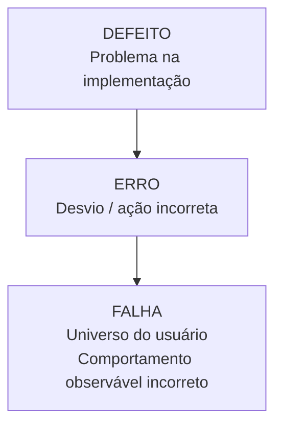

Para memorização:

| Conceito    | Pense em               |
| ----------- | ---------------------- |
| **Erro**    | Pessoa                 |
| **Defeito** | Artefato/software      |
| **Falha**   | Execução/comportamento |

---

# 13. Objetivos do testador

O material apresenta dois grandes objetivos do processo de teste.

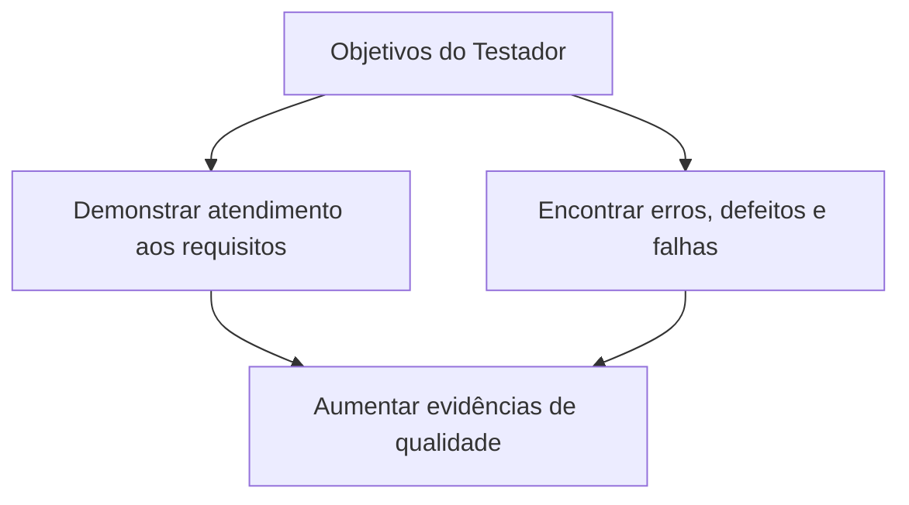

No software customizado, a leitura recomenda que as customizações sejam devidamente testadas. Em funcionalidades genéricas, as características implementadas também precisam possuir verificação correspondente. 

---

# 14. Quando, o que e como testar

Uma das figuras mais relevantes do conteúdo relaciona **níveis, tipos e técnicas de teste**.

Ela responde três perguntas:

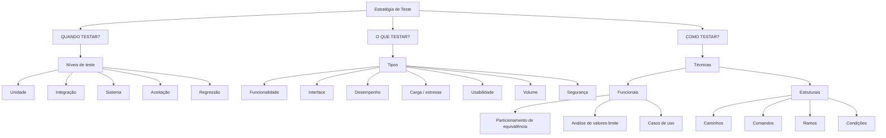

Essa representação corresponde à relação apresentada na figura da página 28 da Leitura Digital. 

---

# 15. Principais tipos de teste

O Tema 02 concentra-se nos seguintes testes:

| Tipo                          | Principal finalidade                             |
| ----------------------------- | ------------------------------------------------ |
| **Unitário**                  | Avaliar unidades ou módulos individualmente      |
| **Integração**                | Avaliar comunicação entre módulos                |
| **Sistema**                   | Avaliar o sistema integrado                      |
| **Aceitação**                 | Avaliar o produto sob a perspectiva do usuário   |
| **Regressão**                 | Detectar efeitos colaterais após alterações      |
| **Integridade de dados**      | Verificar confiabilidade e integridade dos dados |
| **Configuração e instalação** | Verificar operação em diferentes ambientes       |
| **Performance**               | Avaliar comportamento relacionado ao desempenho  |
| **Não funcional**             | Avaliar requisitos não funcionais                |


---

# 16. Teste unitário

O **teste unitário** trabalha com as menores partes do software.

Pode avaliar:

* métodos;
* funções;
* classes;
* componentes;
* pequenos módulos;
* trechos específicos de código.

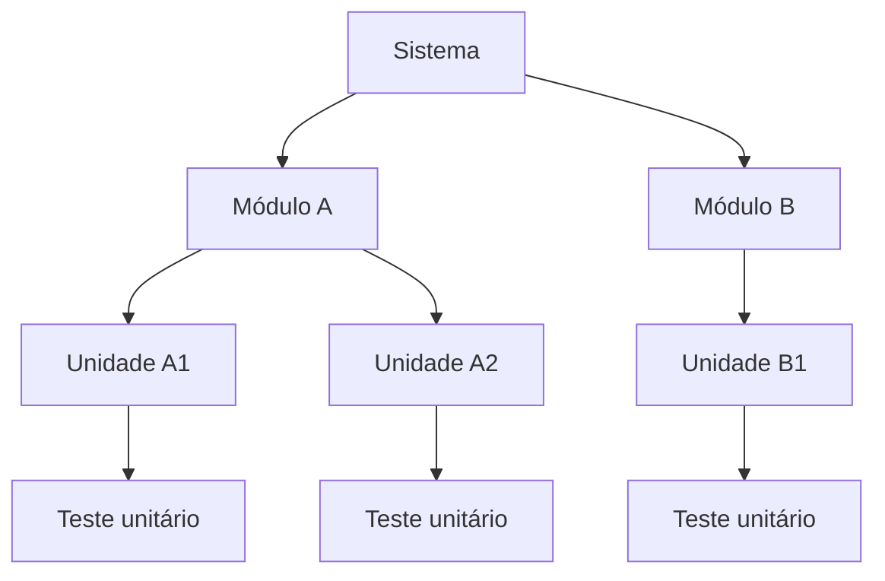

O objetivo é verificar cada unidade isoladamente antes de depender da composição completa do sistema. 

---

# 17. Teste de integração

Após verificar unidades individualmente, é necessário avaliar a interação entre elas.

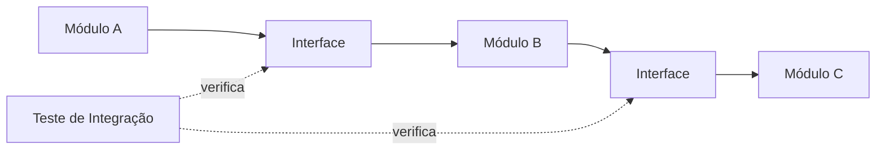

O foco é descobrir problemas de comunicação ou interface entre componentes. 

---

# 18. Teste de sistema

Depois que os componentes são integrados, passa a ser possível avaliar o software de maneira completa.

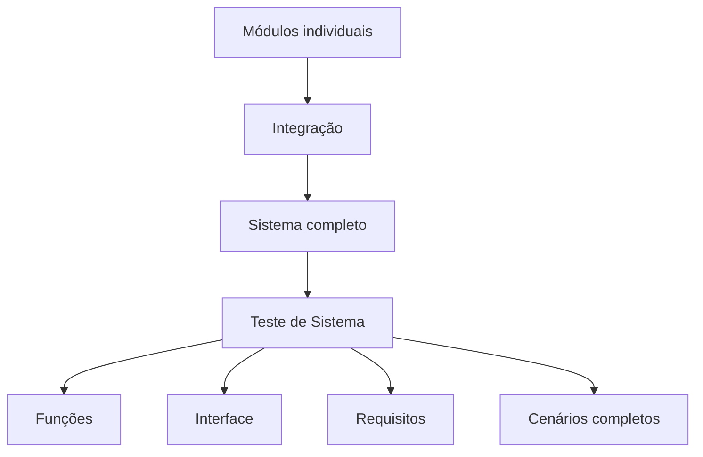

O ambiente deve se aproximar do contexto no qual o usuário utilizará o produto. 

---

# 19. Teste de aceitação

O teste de aceitação aproxima o produto do usuário final.

Seu objetivo é verificar se o sistema é aceitável sob a perspectiva daqueles que deverão utilizá-lo.

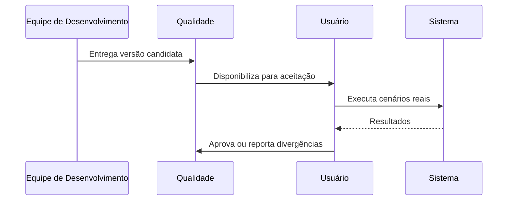

O material menciona:

* aceitação formal;
* aceitação informal;
* teste beta.


---

# 20. Teste de regressão

O teste de regressão é particularmente importante após uma alteração.

Uma correção pode introduzir um novo defeito em outra parte do sistema.

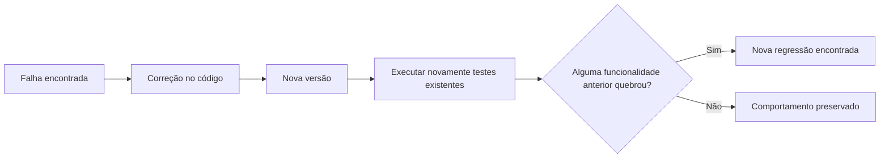

Para memorização:

> **Regressão = verificar se aquilo que funcionava continua funcionando após uma mudança.**

---

# 21. Teste de integridade de dados

Esse teste concentra-se na confiabilidade e consistência das informações manipuladas.

Exemplo conceitual:

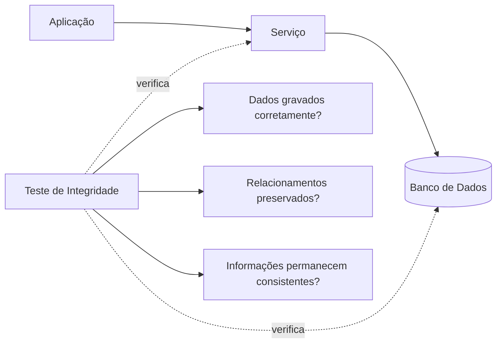

O material associa esse teste à robustez do software e à capacidade de resistir a determinadas condições de falha. 

---

# 22. Testes de configuração e instalação

Esses testes verificam o comportamento do produto em diferentes ambientes.

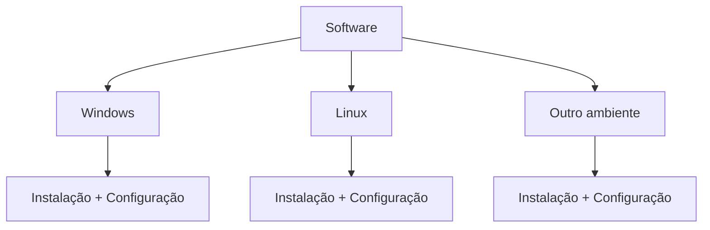

No material:

**Teste de instalação** verifica problemas relacionados a condições como:

* hardware;
* armazenamento;
* processo de instalação.

**Teste de configuração** verifica se o sistema oferece seus recursos adequadamente em diferentes plataformas. 

---

# 23. Teste de performance

O material divide os testes de performance em:

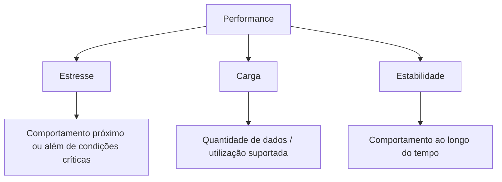

### Teste de estresse

Busca verificar o comportamento da aplicação em condições extremas ou próximas de seus limites.

### Teste de carga

Busca avaliar a capacidade de operação em determinada quantidade de dados ou utilização.

### Teste de estabilidade

Busca avaliar por quanto tempo o software consegue permanecer funcionando adequadamente.


---

# 24. Testes não funcionais

Enquanto requisitos funcionais normalmente expressam **o que o sistema faz**, requisitos não funcionais estão ligados às características e restrições de funcionamento.

Exemplos citados no material incluem:

```mermaid
flowchart TD
    NF["Testes não funcionais"]

    NF --> P["Performance"]
    NF --> C["Confiabilidade"]
    NF --> U["Usabilidade"]
    NF --> R["Recuperação"]
```

Esses testes avaliam atributos que muitas vezes não correspondem diretamente a uma funcionalidade de negócio, mas têm forte influência na qualidade percebida pelo usuário. 

---

# 25. Pirâmide conceitual dos níveis de teste

Uma forma didática de memorizar a progressão é:

```mermaid
flowchart BT
    U["Teste Unitário<br/>pequenas unidades"]
    I["Teste de Integração<br/>comunicação entre unidades"]
    S["Teste de Sistema<br/>produto completo"]
    A["Teste de Aceitação<br/>necessidades do usuário"]

    U --> I
    I --> S
    S --> A
```

Quanto mais se sobe:

* maior é o escopo;
* mais componentes participam;
* mais próximo o teste fica da perspectiva do usuário.

---

# 26. Ferramentas CASE

**CASE** significa *Computer-Aided Software Engineering*.

No contexto do Tema 02, ferramentas CASE são utilizadas para apoiar atividades da engenharia de software, especialmente a organização e o gerenciamento dos testes.

O material associa sua utilização a:

* maior agilidade;
* maior confiabilidade;
* padronização;
* redução de erros operacionais;
* registro das execuções;
* melhoria contínua;
* possibilidade de redução do custo do processo. 

```mermaid
flowchart TD
    CASE["Ferramenta CASE de Testes"]

    CASE --> CT["Casos de teste"]
    CASE --> PE["Planos / Execuções"]
    CASE --> R["Resultados"]
    CASE --> E["Evidências"]
    CASE --> RP["Relatórios"]
    CASE --> U["Usuários / Permissões"]

    CT --> G["Gestão centralizada"]
    PE --> G
    R --> G
    E --> G
    RP --> G
    U --> G
```

---

# 27. Por que utilizar uma ferramenta?

Sem uma ferramenta de gerenciamento, é possível cair em situações como:

```text
Planilha 1
Planilha 2
Documento Word
Papel
E-mail
Captura de tela isolada
Arquivo local do testador
```

O resultado pode ser:

```mermaid
flowchart TD
    A["Informações dispersas"] --> B["Baixa rastreabilidade"]
    B --> C["Dificuldade de saber o que foi testado"]
    C --> D["Resultados inconsistentes"]
    D --> E["Dificuldade para medir qualidade"]
```

Com uma ferramenta:

```mermaid
flowchart TD
    F["Ferramenta de gerenciamento"] --> C1["Centralização"]
    C1 --> C2["Padronização"]
    C2 --> C3["Rastreabilidade"]
    C3 --> C4["Histórico"]
    C4 --> C5["Métricas"]
    C5 --> C6["Melhoria do processo"]
```

---

# 28. O conceito *open source*

O Tema 02 recomenda ferramentas *open source* como alternativa para reduzir custos e apoiar os processos de teste.

O conteúdo ressalta que *open source* não significa apenas disponibilização do código-fonte: existe também um conjunto de princípios associados ao modelo de distribuição e desenvolvimento promovido pela comunidade. 

No contexto do capítulo, a vantagem prática está principalmente em poder adotar ferramentas sem o mesmo modelo tradicional de licenciamento proprietário e, dependendo da solução, adaptar ou integrar o produto às necessidades da organização.

---

# 29. Ferramentas apresentadas no material

O Tema 02 apresenta três ferramentas:

```mermaid
flowchart TD
    CASE["Ferramentas CASE<br/>Open Source"]

    CASE --> TL["TestLink"]
    CASE --> RTH["RTH"]
    CASE --> TM["TestMaster"]
```


> **Observação importante:** esta seção registra as ferramentas conforme o material didático. Como se trata de software, seu estado de manutenção e sua adequação a projetos atuais devem ser verificados antes de adoção profissional.

---

# 30. TestLink

O **TestLink** recebe maior destaque no Tema 02 e também é o protagonista do podcast.

Segundo o material, a ferramenta permite:

* criação de casos de teste;
* execução dos testes;
* organização do projeto;
* classificação de resultados;
* geração de relatórios;
* gerenciamento de permissões;
* integração com ferramentas de gerenciamento de defeitos, como Mantis e Bugzilla.


Uma representação funcional:

```mermaid
flowchart TD
    TL["TestLink"]

    TL --> P["Projeto de Teste"]
    P --> TS["Suítes de Teste"]
    TS --> CT["Casos de Teste"]

    CT --> PL["Plano de Teste"]
    PL --> EX["Execução"]

    EX --> PASS["Aprovado"]
    EX --> FAIL["Falhou"]
    EX --> BLOCK["Bloqueado"]

    EX --> REL["Relatórios / Métricas"]

    FAIL --> BUG["Ferramenta de Defeitos"]
```

---

# 31. TestLink e gerenciamento de defeitos

O material cita integração com ferramentas como **Mantis** e **Bugzilla**.

Conceitualmente:

```mermaid
sequenceDiagram
    participant QA as Testador
    participant TL as TestLink
    participant BT as Bug Tracker
    participant DEV as Desenvolvedor

    QA->>TL: Executa caso de teste
    TL-->>QA: Resultado diferente do esperado
    QA->>BT: Registra defeito
    BT->>DEV: Encaminha problema
    DEV->>BT: Registra correção
    BT->>QA: Disponibiliza para reteste
    QA->>TL: Executa novamente
```

Essa integração ajuda a relacionar **execução de teste** e **defeito identificado**.

---

# 32. RTH — Requirements and Testing Hub

O RTH é apresentado no material como ferramenta voltada a:

* criação de casos de teste;
* acompanhamento das execuções;
* organização das atividades;
* ambiente web;
* interação entre integrantes da equipe;
* exportação de informações para `.xlsx`.


Representação conceitual:

```mermaid
flowchart LR
    CT["Casos de teste"] --> RTH["RTH"]
    EX["Execuções"] --> RTH
    RTH --> MON["Monitoramento"]
    RTH --> XLS["Exportação XLSX"]
    RTH --> REL["Relatórios externos"]
```

O material observa que a exportação pode auxiliar na integração indireta com outras ferramentas.

---

# 33. TestMaster

O **TestMaster** é descrito como uma solução web escrita em Perl, utilizando Apache.

As funcionalidades mencionadas incluem:

* criação de casos de teste;
* execução;
* classificação dos resultados;
* relatórios;
* estatísticas;
* recursos de automação;
* importação e exportação de informações;
* arquivos `.doc`;
* arquivos CSV.


```mermaid
flowchart TD
    TM["TestMaster"]

    TM --> CT["Criar casos"]
    TM --> EX["Executar"]
    EX --> R["Registrar resultado"]
    R --> EST["Estatísticas"]
    R --> REL["Relatórios"]

    TM --> AUT["Automação"]
    TM --> IMP["Importação"]
    TM --> EXP["Exportação DOC / CSV"]
```

---

# 34. Comparativo conforme o material

| Característica             | TestLink                                  | RTH                     | TestMaster           |
| -------------------------- | ----------------------------------------- | ----------------------- | -------------------- |
| Gerenciamento de casos     | Sim                                       | Sim                     | Sim                  |
| Execução de testes         | Sim                                       | Sim                     | Sim                  |
| Web                        | Sim                                       | Sim                     | Sim                  |
| Relatórios                 | Sim                                       | Via recursos/exportação | Sim                  |
| Exportação                 | —                                         | XLSX                    | DOC / CSV            |
| Integração com bug tracker | Mantis/Bugzilla citados                   | Material não destaca    | Material não destaca |
| Automação                  | Não é o principal diferencial apresentado | Não destacada           | Destacada            |
| Tecnologia citada          | PHP                                       | PHP                     | Perl + Apache        |


---

# 35. Do requisito ao defeito utilizando uma ferramenta CASE

Uma visão completa do processo:

```mermaid
flowchart LR
    R["Requisito"] --> CT["Caso de Teste"]
    CT --> P["Plano"]
    P --> E["Execução"]
    E --> RE["Resultado"]

    RE --> D{"Resultado esperado?"}

    D -->|Sim| A["Aprovado"]
    D -->|Não| B["Defeito"]

    B --> C["Correção"]
    C --> RT["Reteste"]
    RT --> E

    A --> REL["Relatórios / Métricas"]
```

Esse fluxo representa a principal contribuição de uma ferramenta de gerenciamento: transformar diferentes atividades em um processo rastreável.

---

# 36. Caso apresentado nos slides

Os slides propõem a seguinte situação:

Um testador recém-contratado descobre que:

* não existe planejamento prévio adequado;
* resultados são registrados em papel;
* práticas e métricas são insuficientes.

O direcionamento dado pelo material é:

```mermaid
flowchart TD
    A["Identificar processo inadequado"] --> B["Solicitar reunião"]
    B --> C["Apresentar diagnóstico"]
    C --> D["Listar problemas"]
    D --> E["Analisar metodologia"]
    E --> F["Propor melhoria"]
    F --> G["Implantar processo controlado"]
```

A resposta esperada não é simplesmente aceitar o processo existente, mas **propor uma melhoria fundamentada**. 

---

# 37. Aplicação prática — como melhorar um processo de testes

Uma organização que ainda utiliza registros dispersos poderia evoluir em etapas:

```mermaid
flowchart LR
    A["1. Diagnóstico"] --> B["2. Padronização"]
    B --> C["3. Casos de teste"]
    C --> D["4. Ferramenta CASE"]
    D --> E["5. Métricas"]
    E --> F["6. Integração com defeitos"]
    F --> G["7. Automação"]
    G --> H["8. Melhoria contínua"]
```

### 1. Diagnóstico

Identificar como os testes são realizados atualmente.

### 2. Padronização

Definir:

* campos;
* critérios;
* status;
* evidências;
* responsabilidades.

### 3. Casos de teste

Criar testes reproduzíveis.

### 4. Ferramenta CASE

Centralizar os artefatos.

### 5. Métricas

Medir o processo.

### 6. Integração com defeitos

Relacionar falhas encontradas às correções.

### 7. Automação

Automatizar cenários repetitivos quando apropriado.

### 8. Melhoria contínua

Usar os resultados para revisar o próprio processo de teste.

---

# 38. Aprendizado do podcast

O podcast relata uma experiência real do autor com **TestLink**.

A empresa trabalhava com software de gestão educacional e decidiu melhorar sua estrutura de desenvolvimento e testes. Uma especialista em testes foi contratada e iniciou-se uma análise de situações problemáticas, incluindo:

* codificação inadequada;
* efeitos colaterais em outras áreas;
* problemas estruturais;
* problemas de performance;
* defeitos que voltavam após terem sido corrigidos.

Casos de teste foram criados e o TestLink foi utilizado para organizar o processo. 

O fluxo descrito no podcast pode ser sintetizado assim:

```mermaid
flowchart TD
    A["Problemas recorrentes"] --> B["Especialização da área de testes"]
    B --> C["Análise das principais falhas"]
    C --> D["Criação de casos de teste"]
    D --> E["Adoção do TestLink"]
    E --> F["Avaliações constantes"]
    F --> G["Menos reincidências"]
    G --> H["Maior qualidade percebida"]
```

O relato enfatiza que a melhoria não ocorreu somente pela ferramenta, mas pela combinação de:

```text
Pessoas
+ processo
+ casos de teste
+ ferramenta
+ execução constante
= melhoria da qualidade
```

---

# 39. Uma ferramenta não substitui o processo

Esse é um ponto essencial para interpretar corretamente o Tema 02.

Adotar TestLink, RTH, TestMaster ou qualquer outra solução não resolve automaticamente os problemas.

```mermaid
flowchart TD
    F["Ferramenta"] --> P{"Existe processo?"}

    P -->|Não| CAOS["Caos informatizado"]
    P -->|Sim| CT["Casos bem definidos"]

    CT --> M["Métricas"]
    M --> R["Rastreabilidade"]
    R --> Q["Melhoria da qualidade"]
```

> **Uma ferramenta ruim pode prejudicar um bom processo, mas uma boa ferramenta também não consegue salvar um processo inexistente.**

---

# 40. Testes manuais e automatizados

O conteúdo não reduz teste a automação.

Testes podem ser:

```mermaid
flowchart TD
    T["Testes"]

    T --> M["Manuais"]
    T --> A["Automatizados"]

    M --> M1["Exploratórios"]
    M --> M2["Aceitação"]
    M --> M3["Usabilidade"]

    A --> A1["Unitários"]
    A --> A2["Integração"]
    A --> A3["Regressão"]
```

O importante é escolher a técnica de acordo com:

* objetivo;
* custo;
* risco;
* repetição;
* contexto;
* fase do produto.

---

# 41. Rastreabilidade

Uma ferramenta de gerenciamento se torna especialmente valiosa quando possibilita relacionar artefatos.

```mermaid
flowchart LR
    REQ["REQ-001"] --> CT["CT-001"]
    CT --> EX["Execução #34"]
    EX --> EV["Evidência"]
    EX --> BUG["BUG-245"]
    BUG --> FIX["Commit / Correção"]
    FIX --> RT["Reteste"]
    RT --> EX2["Execução #35"]
```

Com isso podemos responder:

* qual requisito foi testado?
* qual teste verificou o requisito?
* em qual versão?
* qual execução falhou?
* qual defeito foi aberto?
* o defeito foi corrigido?
* o teste foi executado novamente?

---

# 42. Métricas úteis de gerenciamento

O material enfatiza a importância de métricas. Em uma implementação prática, podem ser acompanhados indicadores como:

| Métrica            | Exemplo de pergunta                                  |
| ------------------ | ---------------------------------------------------- |
| Casos planejados   | Quantos testes deveriam ser executados?              |
| Casos executados   | Quantos foram realmente executados?                  |
| Taxa de aprovação  | Qual percentual passou?                              |
| Falhas             | Quantos testes falharam?                             |
| Defeitos reabertos | Quantos problemas retornaram?                        |
| Regressões         | Quantas alterações quebraram comportamento anterior? |
| Cobertura          | Quantos requisitos possuem testes?                   |
| Tempo de correção  | Quanto tempo um defeito permanece aberto?            |

Exemplo:

```text
100 casos planejados
 90 executados
 72 aprovados
 18 falharam
```

Nesse exemplo:

```text
Taxa de execução = 90 / 100 = 90%
Taxa de aprovação entre executados = 72 / 90 = 80%
```

---

# 43. Priorização baseada em risco

Nem sempre é possível executar todos os testes em todas as situações.

Uma estratégia é considerar:

```mermaid
flowchart TD
    R["Risco"]

    R --> P["Probabilidade"]
    R --> I["Impacto"]

    P --> PR["Prioridade de teste"]
    I --> PR

    PR --> A["Alta"]
    PR --> M["Média"]
    PR --> B["Baixa"]
```

As funcionalidades mais críticas devem receber atenção proporcional ao risco.

Esse raciocínio conecta-se ao conteúdo do capítulo, que menciona gerenciamento de riscos e a necessidade de o analista definir o teste mais adequado para cada situação. 

---

# 44. Relação entre Tema 01 e Tema 02

O Tema 01 introduziu:

* qualidade;
* documentação;
* casos de teste;
* TMMi.

O Tema 02 passa da fundamentação para a execução e gerenciamento.

```mermaid
flowchart LR
    T1["Tema 01<br/>Qualidade e maturidade"] --> T2["Tema 02<br/>Execução e gerenciamento"]

    T1 --> Q["Qualidade"]
    T1 --> DOC["Documentação"]
    T1 --> TMMI["TMMi"]

    Q --> PROC["Processo de Teste"]
    DOC --> PROC
    TMMI --> PROC

    PROC --> CASE["Ferramentas CASE"]
    CASE --> RES["Resultados e métricas"]
```

Assim:

> **Tema 01 explica por que estruturar. Tema 02 começa a mostrar como executar e gerenciar.**

---

# 45. O que memorizar para a prova

## Erro, defeito e falha

```text
ERRO
ação humana

↓ produz

DEFEITO
problema no software

↓ quando executado

FALHA
comportamento incorreto observável
```

---

## Tipos principais de teste

Memorize:

```text
Unidade
Integração
Sistema
Aceitação
Regressão
Integridade de dados
Configuração / Instalação
Performance
Não funcional
```

Uma progressão fundamental:

```mermaid
flowchart LR
    U["Unitário"] --> I["Integração"]
    I --> S["Sistema"]
    S --> A["Aceitação"]
```

---

## Performance

```text
Performance
├── Estresse
├── Carga
└── Estabilidade
```

---

## Ferramentas do material

```text
TestLink
RTH
TestMaster
```

O **TestLink** merece atenção especial porque aparece tanto na leitura quanto no podcast. 

---

# 46. Armadilhas comuns de prova

### “Teste corrige defeitos.”

**Errado.**

O teste **detecta ou evidencia** problemas. A correção é realizada posteriormente pela atividade apropriada de desenvolvimento.

---

### “Somente o sistema completo precisa ser testado.”

**Errado.**

Existem diferentes níveis de teste, começando por unidades individuais e evoluindo até o sistema completo.

---

### “Depois de corrigir um defeito, não é mais necessário testar.”

**Errado.**

É preciso verificar a correção e utilizar testes de regressão para descobrir possíveis efeitos colaterais.

---

### “Ferramenta CASE substitui o testador.”

**Errado.**

A ferramenta **apoia** planejamento, organização, execução, registro e análise.

---

### “Teste de regressão serve somente para testar uma nova funcionalidade.”

**Errado.**

Seu ponto central é verificar se alterações afetaram comportamentos anteriormente existentes.

---

### “Performance é exclusivamente teste de carga.”

**Errado.**

No material, performance abrange carga, estresse e estabilidade.

---

# 47. Perguntas de revisão

Antes de considerar o Tema 02 dominado, deve ser possível explicar:

1. O que é teste de software?
2. Por que “testar por testar” não é suficiente?
3. Como qualidade e teste se relacionam?
4. O que significa VV&T?
5. Por que desenvolvimento e qualidade devem possuir independência?
6. Qual é o risco de reduzir testes para cumprir prazo?
7. Qual a diferença entre erro, defeito e falha?
8. Como um defeito se transforma em uma falha?
9. Quais são os dois objetivos fundamentais do testador?
10. O que significa “quando testar”?
11. O que significa “o que testar”?
12. O que significa “como testar”?
13. O que é teste unitário?
14. O que é teste de integração?
15. O que é teste de sistema?
16. O que é teste de aceitação?
17. O que é teste de regressão?
18. Qual a finalidade do teste de integridade de dados?
19. Qual a diferença entre configuração e instalação?
20. Quais são os três testes de performance apresentados?
21. O que são testes não funcionais?
22. O que é uma ferramenta CASE?
23. Por que utilizar uma ferramenta *open source*?
24. Para que serve o TestLink?
25. Qual vantagem há na integração entre TestLink e um bug tracker?
26. O que diferencia RTH e TestMaster na descrição do material?
27. Por que uma ferramenta não substitui um processo de testes?
28. Qual aprendizado principal pode ser extraído do podcast?

---

# 48. Mapa mental do Tema 02

```mermaid
flowchart TD
    T["TEMA 02<br/>Gerenciamento de Testes"]

    T --> Q["Qualidade"]
    T --> P["Processo de Teste"]
    T --> TT["Tipos de Teste"]
    T --> CASE["Ferramentas CASE"]

    Q --> VV["VV&T"]
    Q --> EQ["Equipe de qualidade"]
    Q --> MET["Métricas"]

    P --> EDF["Erro / Defeito / Falha"]
    P --> QDO["Quando testar"]
    P --> QOT["O que testar"]
    P --> QCO["Como testar"]

    TT --> U["Unitário"]
    TT --> I["Integração"]
    TT --> S["Sistema"]
    TT --> A["Aceitação"]
    TT --> R["Regressão"]
    TT --> ID["Integridade"]
    TT --> CI["Configuração / Instalação"]
    TT --> PERF["Performance"]
    TT --> NF["Não funcionais"]

    PERF --> EST["Estresse"]
    PERF --> CAR["Carga"]
    PERF --> ESTAB["Estabilidade"]

    CASE --> TL["TestLink"]
    CASE --> RTH["RTH"]
    CASE --> TM["TestMaster"]
```

---

# 49. Resumo executivo

O Tema 02 mostra que o teste de software precisa ser tratado como um **processo planejado e mensurável**, e não como uma execução informal da aplicação.

Durante o ciclo de desenvolvimento são aplicadas práticas de verificação, validação e teste com o objetivo de identificar desvios e reduzir a quantidade de problemas que alcançam o usuário. O gerenciamento da qualidade deve acompanhar as entregas produzidas pela equipe de desenvolvimento, avaliando requisitos, padrões, procedimentos e documentação. 

Uma distinção fundamental é a relação entre **erro, defeito e falha**: uma ação humana incorreta pode introduzir um defeito no software e, quando esse defeito é executado em condições apropriadas, pode produzir uma falha observável pelo usuário. 

Os testes precisam ser selecionados considerando **quando, o que e como testar**. Entre os tipos abordados estão testes unitários, integração, sistema, aceitação, regressão, integridade de dados, configuração e instalação, performance e testes não funcionais. 

Ferramentas CASE *open source* auxiliam na organização desse processo. O material apresenta **TestLink, RTH e TestMaster**, dando destaque ao TestLink como ferramenta para criação, execução e gerenciamento de casos de teste e integração com sistemas de rastreamento de defeitos. 

O podcast reforça o aspecto prático: a introdução de uma estrutura profissional de testes, casos de teste e TestLink permitiu que uma empresa passasse a avaliar continuamente seu produto, reduzindo problemas recorrentes e melhorando a qualidade entregue ao cliente. 

---

# 50. Síntese final

```mermaid
flowchart LR
    R["Requisitos"] --> P["Planejar testes"]
    P --> T["Selecionar tipo e técnica"]
    T --> CT["Criar casos"]
    CT --> CASE["Gerenciar em ferramenta CASE"]
    CASE --> EX["Executar"]
    EX --> RES["Comparar resultado"]
    RES --> DEF["Detectar defeitos"]
    DEF --> COR["Corrigir"]
    COR --> REG["Regressão"]
    REG --> MET["Medir"]
    MET --> Q["Melhorar qualidade"]
```

> **Testar não é simplesmente executar o software.**
> **Testar é planejar, executar, comparar, registrar e aprender.**
> **Ferramentas CASE organizam o processo, mas não substituem a metodologia.**
> **A qualidade surge da combinação de pessoas, processos, técnicas, métricas e ferramentas.**
