# Tema 03 — Procedimentos para Garantir a Segurança do Software

> **Disciplina:** Validação do Software: Testes de Software e Aplicações de Segurança no Sistema
> **Tema:** Procedimentos para garantir a segurança do software
> **Autoria do material:** Luís Otávio Toledo Perin
> **Objetivo da documentação:** consolidar o Tema 03 em formato técnico e didático para consulta no GitHub, mantendo a organização conceitual do material e representando visualmente os principais processos por meio de Mermaid.

Esta documentação foi elaborada a partir da **Leitura Digital**, dos **slides do Tema 03** e do **podcast correspondente**.   

---

## 1. Objetivos de aprendizagem

O Tema 03 estabelece três objetivos principais:

1. **Definir segurança de software.**
2. **Compreender o processo de segurança de software.**
3. **Conhecer normas aplicáveis à segurança de software.**

 

---

# 2. Visão geral

O princípio central do tema é que **segurança não pode ser adicionada somente depois que o software está pronto**.

Ela precisa acompanhar todo o ciclo de desenvolvimento:

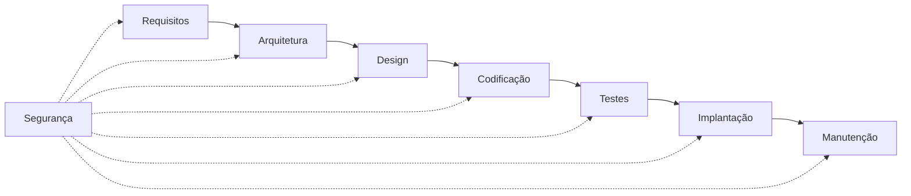

A segurança é apresentada no material como parte integrante da qualidade do software. Técnicas e métricas mal empregadas durante o desenvolvimento podem repercutir diretamente sobre a proteção, confiabilidade e usabilidade do produto. 

---

# 3. Qualidade e segurança

Qualidade e segurança devem ser tratadas como disciplinas relacionadas.

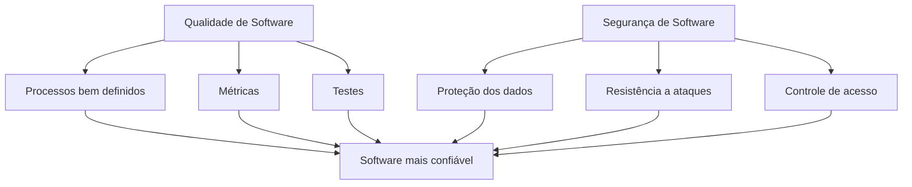

O material utiliza McGraw para reforçar que segurança, confiabilidade e disponibilidade precisam ser consideradas nas fases inicial, de projeto, arquitetura, codificação e testes. 

Uma consequência importante é:

> **um defeito de arquitetura pode representar um problema de segurança tão ou mais importante que um simples bug de implementação.**

---

# 4. Segurança desde o início

Uma abordagem incorreta seria:

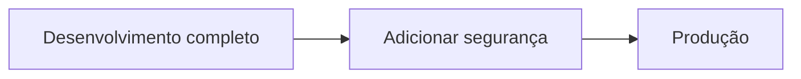

A abordagem defendida no material é:

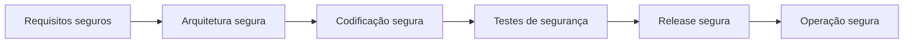

O objetivo é prevenir problemas em vez de depender exclusivamente da descoberta de vulnerabilidades depois da implantação.

---

# 5. Propriedades fundamentais da segurança da informação

O material apresenta inicialmente três propriedades básicas:

* **Confidencialidade**
* **Disponibilidade**
* **Integridade**


São os elementos normalmente visualizados como uma tríade:

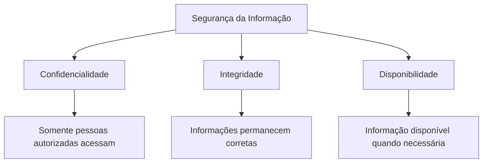

---

# 6. Confidencialidade

A **confidencialidade** busca impedir o acesso não autorizado às informações.

Exemplos:

* dados pessoais;
* credenciais;
* documentos restritos;
* informações comerciais;
* dados bancários.

Uma representação conceitual:

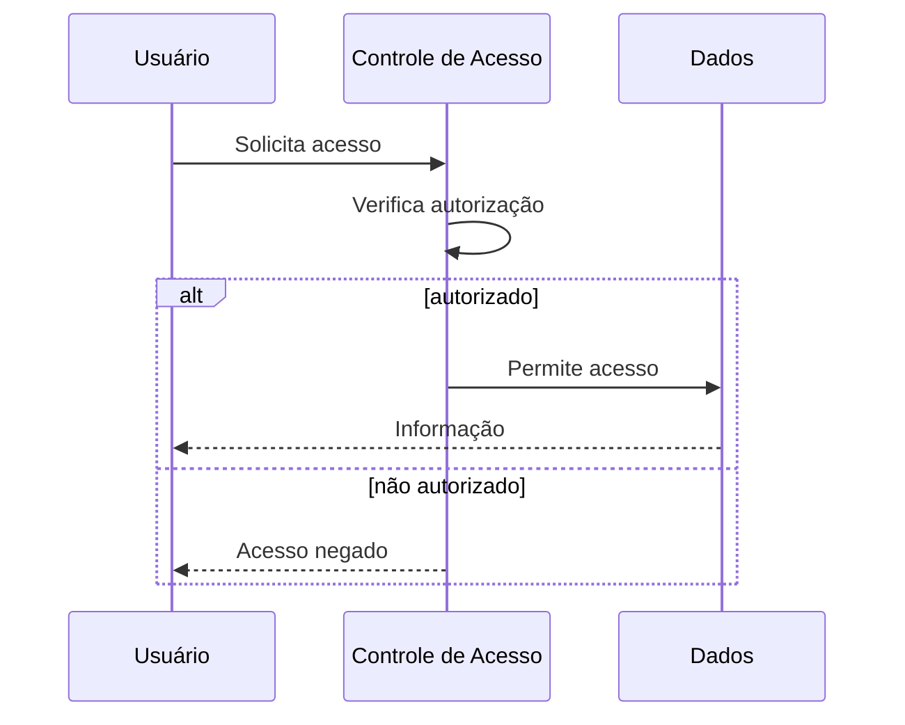

---

# 7. Integridade

A **integridade** assegura que a informação permaneça correta e não seja modificada indevidamente.

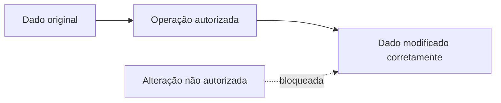

O conceito envolve não apenas impedir alterações maliciosas, mas também evitar corrupção acidental das informações.

---

# 8. Disponibilidade

A **disponibilidade** significa que sistemas e informações precisam estar acessíveis quando necessários.

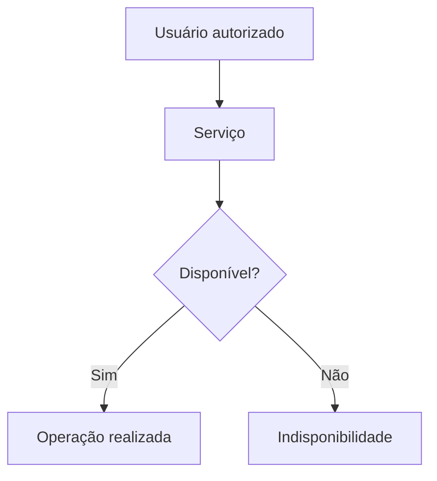

Um sistema pode preservar confidencialidade e integridade e ainda assim apresentar baixa qualidade de segurança caso fique indisponível durante períodos críticos.

---

# 9. Propriedades adicionais apresentadas no material

Além da tríade tradicional, o conteúdo apresenta:

* autenticação;
* não repúdio;
* legalidade;
* privacidade;
* autoria.


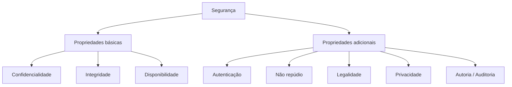

---

# 10. Autenticação

Busca confirmar que uma identidade é realmente quem afirma ser.

Exemplo:

```text
Usuário informa credenciais
        ↓
Sistema valida identidade
        ↓
Usuário autenticado
```

Importante distinguir:

```text
Autenticação = quem é você?

Autorização = o que você pode fazer?
```

---

# 11. Não repúdio

O não repúdio busca possibilitar a comprovação de determinada ação.

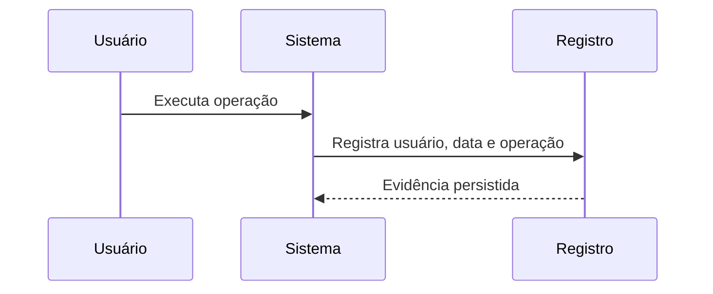

Posteriormente, pode-se comprovar que aquela ação realmente ocorreu.

---

# 12. Legalidade

A segurança também deve considerar leis, regulamentos e normas aplicáveis à organização.

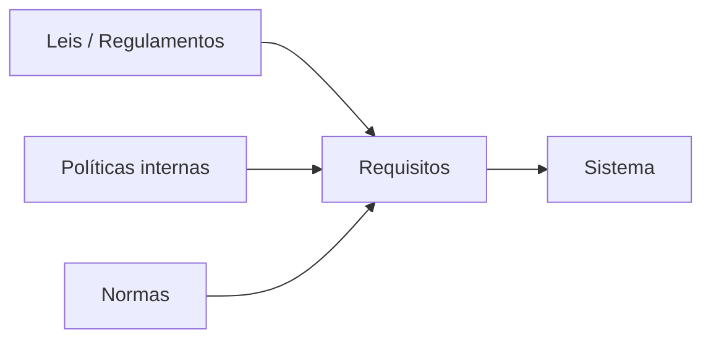

Assim, segurança não é exclusivamente uma questão tecnológica.

---

# 13. Privacidade

Privacidade está relacionada ao uso e proteção das informações pertencentes às pessoas.

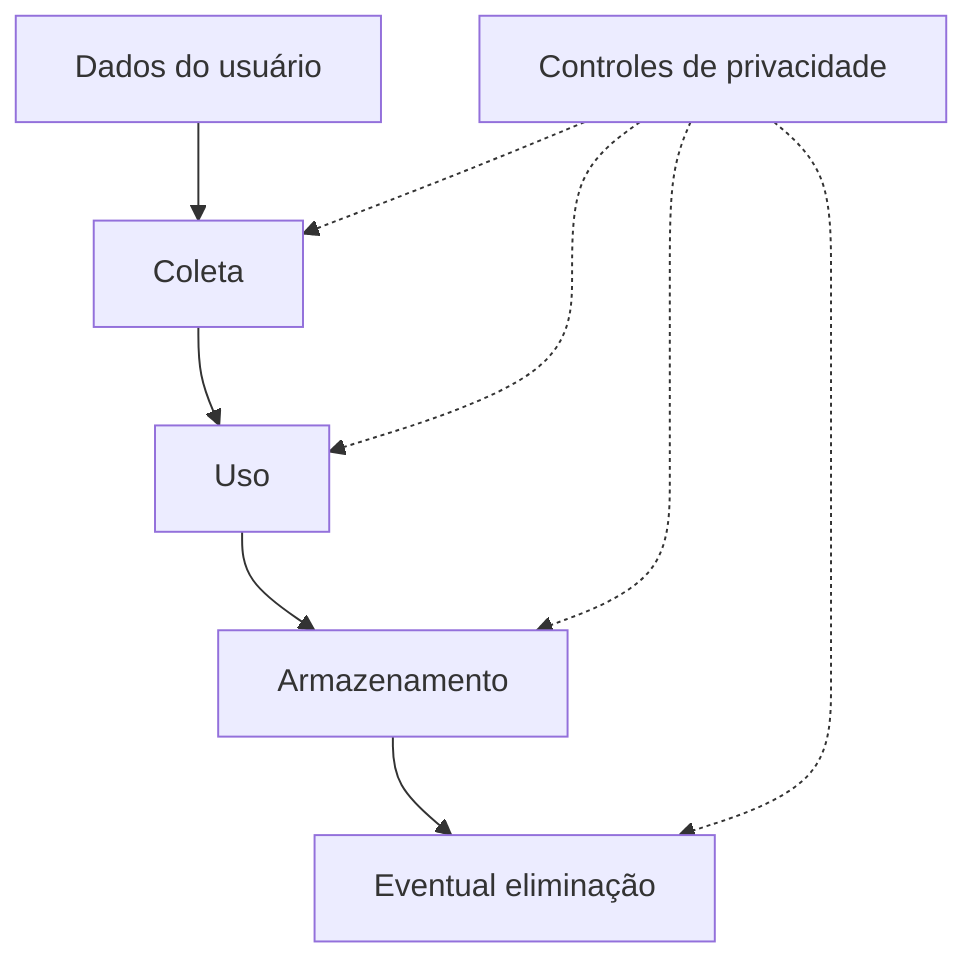

---

# 14. Autoria e auditoria

O material associa autoria à capacidade de identificar e comprovar ações realizadas por determinado usuário. 

Um exemplo de trilha:

```text
Usuário: joao.silva
Ação: ALTERAR_CLIENTE
Registro: 87232
Data/hora: 2026-08-30 15:14
Resultado: sucesso
```

Isso permite:

* auditoria;
* investigação;
* rastreabilidade;
* identificação de fraudes;
* análise de incidentes.

---

# 15. Normas apresentadas no Tema 03

O material concentra-se em:

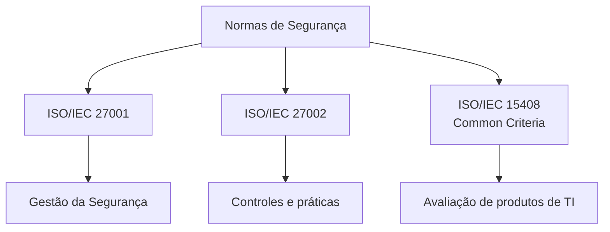

 

> A organização das normas apresentada abaixo segue a estrutura utilizada pelo material didático.

---

# 16. ISO/IEC 27001 e ISO/IEC 27002

Segundo o capítulo, as normas são utilizadas conjuntamente como referência para organizar a gestão da segurança da informação.

O foco envolve:

* princípios;
* diretrizes;
* controles;
* políticas;
* riscos;
* responsabilidades;
* melhoria contínua.


---

# 17. Estrutura apresentada para ISO/IEC 27002

O material organiza os assuntos em áreas como:

1. escopo;
2. termos e definições;
3. estrutura;
4. avaliação e tratamento de riscos;
5. política de segurança;
6. organização da segurança;
7. gestão de ativos;
8. segurança em recursos humanos;
9. segurança física e ambiental;
10. operações e comunicações;
11. controle de acesso;
12. aquisição, desenvolvimento e manutenção;
13. gestão de incidentes;
14. continuidade do negócio;
15. conformidade.


Uma visão simplificada:

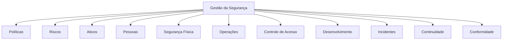

---

# 18. Gestão de ativos

Um ativo é qualquer elemento que possua valor para a organização.

Pode incluir:

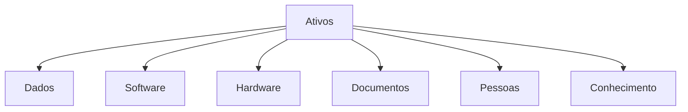

Não se protege aquilo que sequer foi identificado.

Por isso, a gestão de ativos antecede diversas decisões de segurança.

---

# 19. Controle de acesso

Um princípio fundamental apresentado no material é que a informação deve ser acessada somente pelas pessoas devidamente autorizadas.

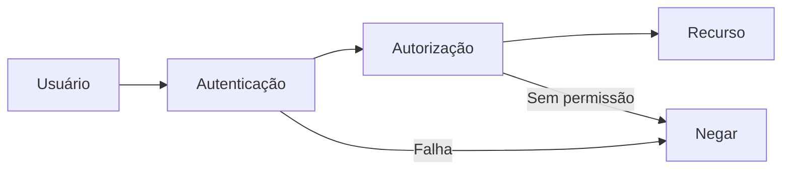

---

# 20. Segurança durante aquisição e desenvolvimento

O material enfatiza que **requisitos de segurança devem ser analisados antes da implementação**. 

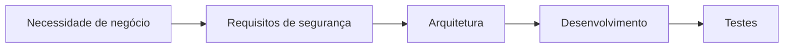

Essa visão está diretamente relacionada ao conceito moderno de incorporar segurança ao ciclo de desenvolvimento.

---

# 21. Gestão de incidentes

Incidentes precisam ser identificados, comunicados e tratados.

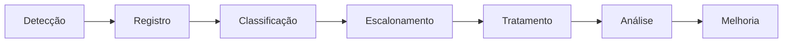

O material destaca a necessidade de procedimentos formais para comunicação e escalonamento. 

---

# 22. Continuidade do negócio

Segurança também envolve manter os processos essenciais funcionando diante de falhas ou incidentes.

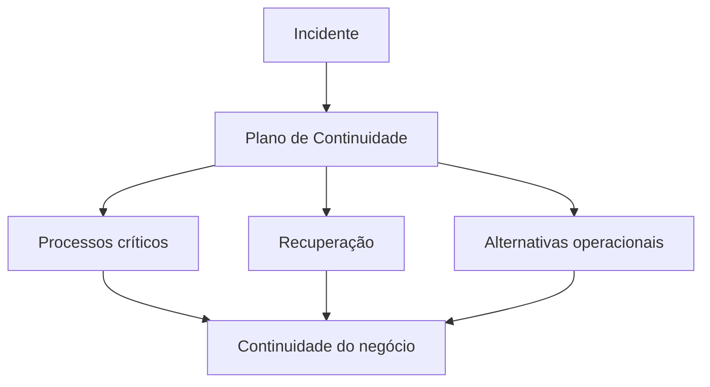

---

# 23. SGSI — Sistema de Gestão de Segurança da Informação

A aplicação organizada das políticas, práticas e controles resulta no que o material apresenta como **SGSI — Sistema de Gestão de Segurança da Informação** (*Information Security Management System*). 

O objetivo é organizar:

* políticas;
* riscos;
* controles;
* procedimentos;
* responsabilidades;
* auditorias;
* melhoria contínua.

---

# 24. O ciclo PDCA aplicado ao SGSI

A Figura da página 43 da Leitura Digital e o slide correspondente representam o SGSI através do ciclo PDCA.  

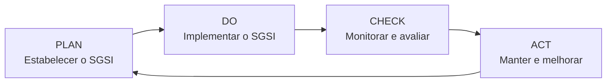

---

# 25. PLAN

O material associa à fase **Plan** atividades como:

* estruturação do SGSI;
* diagnóstico;
* plano diretor;
* avaliação dos riscos;
* tratamento dos riscos;
* seleção de controles;
* declaração de aplicabilidade.


---

# 26. DO

A fase **Do** compreende a implementação.

Entre as atividades apresentadas:

* comitê de segurança;
* política;
* classificação das informações;
* continuidade;
* treinamento;
* conscientização;
* implementação de controles.

---

# 27. CHECK

A fase **Check** verifica se aquilo que foi implementado está funcionando.

Inclui:

* monitoração dos controles;
* gestão de incidentes;
* revisão de risco residual;
* auditoria interna.

---

# 28. ACT

A fase **Act** promove a melhoria.

Inclui:

* ações corretivas;
* ações preventivas;
* melhorias;
* comunicação à administração;
* verificação da eficácia das ações.

---

# 29. Ciclo completo do gerenciamento de segurança

```mermaid
flowchart TD
    R["Identificar riscos"]
      --> P["Planejar controles"]
      --> I["Implementar"]
      --> M["Monitorar"]
      --> A["Auditar"]
      --> C["Corrigir"]
      --> O["Otimizar"]
      --> R
```

Isso mostra que segurança é um **processo contínuo**, não uma tarefa com fim definitivo.

---

# 30. ISO/IEC 15408 — Common Criteria

A ISO/IEC 15408 é apresentada no material como baseada no **Common Criteria for Information Technology Security Evaluation**.

Seu foco é a avaliação da segurança de produtos de tecnologia da informação. 

```mermaid
flowchart LR
    P["Produto de TI"]
      --> REQ["Requisitos de segurança"]
      --> EVA["Avaliação"]
      --> EAL["Nível EAL"]
      --> RES["Evidência de garantia"]
```

---

# 31. TOE — Target of Evaluation

O material utiliza o conceito **TOE — Target of Evaluation**, isto é, o objeto que está sendo avaliado.

```mermaid
flowchart TD
    TOE["TOE<br/>Target of Evaluation"]

    TOE --> F["Funcionalidade"]
    TOE --> A["Arquitetura / estrutura"]
    TOE --> T["Testes"]
    TOE --> V["Verificação"]

    F --> EAL["Evaluation Assurance Level"]
    A --> EAL
    T --> EAL
    V --> EAL
```

---

# 32. Níveis EAL

O conteúdo apresenta sete níveis:

| Nível     | Definição utilizada no material                 |
| --------- | ----------------------------------------------- |
| **EAL 1** | Funcionalmente testado                          |
| **EAL 2** | Estruturalmente testado                         |
| **EAL 3** | Metodicamente testado e verificado              |
| **EAL 4** | Metodicamente projetado, testado e verificado   |
| **EAL 5** | Semiformalmente projetado e testado             |
| **EAL 6** | Semiformalmente projetado, testado e verificado |
| **EAL 7** | Formalmente projetado, testado e verificado     |

 

Uma visualização:

```mermaid
flowchart BT
    E1["EAL 1<br/>Funcionalmente testado"]
      --> E2["EAL 2<br/>Estruturalmente testado"]
      --> E3["EAL 3<br/>Metodicamente testado e verificado"]
      --> E4["EAL 4<br/>Metodicamente projetado, testado e verificado"]
      --> E5["EAL 5<br/>Semiformalmente projetado e testado"]
      --> E6["EAL 6<br/>Semiformalmente projetado, testado e verificado"]
      --> E7["EAL 7<br/>Formalmente projetado, testado e verificado"]
```

Quanto maior o nível, maior o rigor das evidências e procedimentos de garantia.

---

# 33. Modelo SDL — Security Development Lifecycle

O Tema 03 apresenta o modelo **SDL**, desenvolvido pela Microsoft.

Seu objetivo é incorporar segurança ao processo de desenvolvimento.  

As etapas apresentadas são:

```mermaid
flowchart LR
    T["Training"]
      --> R["Requirements"]
      --> D["Design"]
      --> I["Implementation"]
      --> V["Verification"]
      --> REL["Release"]
      --> RESP["Response"]
```

---

# 34. 1 — Training

O treinamento de segurança prepara a equipe.

Assuntos destacados pelo material incluem:

* princípios de segurança;
* redução da superfície de ataque;
* defesa em profundidade;
* privilégio mínimo;
* padrões seguros;
* modelagem de ameaças;
* codificação segura;
* testes de segurança;
* privacidade.


---

# 35. 2 — Requirements

Durante requisitos são estabelecidos:

* requisitos de segurança;
* requisitos de privacidade;
* critérios mínimos;
* avaliação de riscos;
* parâmetros para acompanhamento de defeitos.

```mermaid
flowchart LR
    N["Necessidade"]
      --> RF["Requisito funcional"]
      --> RS["Requisito de segurança"]
      --> CR["Critério verificável"]
```

---

# 36. 3 — Design

No design são destacados:

* requisitos de projeto seguro;
* análise da superfície de ataque;
* modelagem de ameaças.

```mermaid
flowchart TD
    D["Design"]

    D --> A["Superfície de ataque"]
    D --> T["Threat Modeling"]
    D --> SR["Requisitos de segurança"]

    A --> ARQ["Arquitetura mais segura"]
    T --> ARQ
    SR --> ARQ
```

---

# 37. 4 — Implementation

Na implementação:

* ferramentas aprovadas;
* funções inseguras devem ser evitadas;
* análise estática;
* codificação segura.

```mermaid
flowchart LR
    DEV["Código"]
      --> RULES["Padrões de codificação"]
      --> SAST["Análise estática"]
      --> FIX["Correções"]
      --> BUILD["Build"]
```

---

# 38. 5 — Verification

A fase de verificação inclui:

* testes;
* análise dinâmica;
* *fuzz testing*;
* revisão da superfície de ataque;
* inspeção do código;
* avaliação de documentação.


```mermaid
flowchart TD
    V["Verification"]

    V --> DA["Dynamic Analysis"]
    V --> FUZZ["Fuzz Testing"]
    V --> AR["Attack Surface Review"]
    V --> CR["Code Review"]
```

---

# 39. 6 — Release

Antes da liberação:

* preparar resposta a incidentes;
* executar revisão final de segurança;
* arquivar informações da versão.

```mermaid
flowchart LR
    B["Build candidata"]
      --> FSR["Final Security Review"]
      --> IR["Incident Response Plan"]
      --> RA["Release Archive"]
      --> PROD["Produção"]
```

---

# 40. 7 — Response

A última fase trata da resposta aos problemas descobertos após a liberação.

```mermaid
flowchart LR
    I["Incidente"]
      --> A["Análise"]
      --> C["Correção"]
      --> U["Atualização"]
      --> L["Lições aprendidas"]
```

O SDL, portanto, reconhece que a responsabilidade por segurança continua mesmo depois da publicação.

---

# 41. SDL completo

```mermaid
flowchart TD
    T["Training<br/>Treinar equipe"]
      --> R["Requirements<br/>Definir segurança"]
      --> D["Design<br/>Modelar ameaças"]
      --> I["Implementation<br/>Codificação segura"]
      --> V["Verification<br/>Testes de segurança"]
      --> REL["Release<br/>Revisão final"]
      --> RESP["Response<br/>Tratar incidentes"]

    RESP -. "feedback" .-> R
```

---

# 42. Situação prática apresentada nos slides

Os slides apresentam uma empresa que:

* não possui práticas de segurança bem definidas;
* utiliza tecnologias semelhantes às de empresas que sofreram ataques;
* pode estar exposta aos mesmos riscos.

A orientação sugerida pelo material é: 

```mermaid
flowchart TD
    A["Conhecer ataques em organizações semelhantes"]
      --> B["Informar a gestão"]
      --> C["Analisar situação atual"]
      --> D["Identificar principais falhas"]
      --> E["Avaliar metodologia"]
      --> F["Implantar melhorias"]
```

---

# 43. Aprendizado do podcast — Tema 03

O podcast reforça a necessidade de incorporar a segurança **antes, durante e depois do desenvolvimento**.

Também reproduz estatísticas de fontes citadas pelo autor para enfatizar a importância das vulnerabilidades na camada de aplicação. Como essas estatísticas são apresentadas no podcast sem detalhamento metodológico adicional, devem ser entendidas como parte da argumentação do material didático, e não como dados aqui atualizados ou independentemente verificados. 

O raciocínio principal pode ser sintetizado:

```mermaid
flowchart LR
    V["Vulnerabilidades"]
      --> A["Aplicações expostas"]
      --> R["Risco aos dados"]
      --> S["Necessidade de segurança"]
      --> P["Práticas + métricas"]
      --> Q["Maior qualidade e proteção"]
```

---

# 44. O que memorizar para a prova — Tema 03

### Tríade fundamental

```text
Confidencialidade
Integridade
Disponibilidade
```

### Propriedades adicionais

```text
Autenticação
Não repúdio
Legalidade
Privacidade
Autoria
```

### Normas

```text
ISO/IEC 27001
ISO/IEC 27002
ISO/IEC 15408
```

### PDCA

```text
PLAN → DO → CHECK → ACT
```

### SDL

```text
Training
→ Requirements
→ Design
→ Implementation
→ Verification
→ Release
→ Response
```

### Common Criteria

```text
EAL 1 → EAL 7
```

---

# 45. Perguntas de revisão — Tema 03

1. Por que qualidade e segurança devem caminhar juntas?
2. O que significa confidencialidade?
3. O que significa integridade?
4. O que significa disponibilidade?
5. Qual a diferença entre autenticação e autorização?
6. O que é não repúdio?
7. Qual a relação entre auditoria e autoria?
8. Qual o objetivo de um SGSI?
9. Como o PDCA é aplicado ao SGSI?
10. Qual a finalidade da ISO/IEC 27001?
11. Qual a função apresentada para a ISO/IEC 27002?
12. O que é Common Criteria?
13. O que significa TOE?
14. O que representam os níveis EAL?
15. Quantos níveis EAL o material apresenta?
16. O que é SDL?
17. Quais são as sete fases do SDL?
18. Onde ocorre modelagem de ameaças?
19. Qual o papel da análise estática?
20. Por que existe uma fase de resposta após o release?

---

# 46. Mapa mental — Tema 03

```mermaid
flowchart TD
    T["TEMA 03<br/>Segurança do Software"]

    T --> QS["Qualidade + Segurança"]
    T --> PROP["Propriedades"]
    T --> ISO["Normas"]
    T --> SDL["SDL"]

    PROP --> C["Confidencialidade"]
    PROP --> I["Integridade"]
    PROP --> D["Disponibilidade"]
    PROP --> AU["Autenticação"]
    PROP --> NR["Não repúdio"]
    PROP --> P["Privacidade"]

    ISO --> I1["ISO 27001"]
    ISO --> I2["ISO 27002"]
    ISO --> I3["ISO 15408"]

    I1 --> SGSI["SGSI"]
    SGSI --> PDCA["PDCA"]

    I3 --> EAL["EAL 1–7"]

    SDL --> T1["Training"]
    SDL --> R["Requirements"]
    SDL --> DE["Design"]
    SDL --> IM["Implementation"]
    SDL --> V["Verification"]
    SDL --> REL["Release"]
    SDL --> RES["Response"]
```

---

# 47. Síntese do Tema 03

O Tema 03 estabelece a segurança como uma propriedade transversal do desenvolvimento de software. Ela deve ser considerada desde os requisitos e a arquitetura até a implantação, manutenção e resposta a incidentes.

As propriedades de confidencialidade, integridade e disponibilidade constituem a base, complementadas no material por autenticação, não repúdio, legalidade, privacidade e autoria. As normas ISO/IEC 27001 e 27002 são apresentadas como referências para organizar a gestão da segurança, enquanto a ISO/IEC 15408 introduz a avaliação de produtos de TI por meio do Common Criteria e seus níveis EAL. 

O SDL fecha o tema traduzindo a ideia de **segurança incorporada ao desenvolvimento** em um fluxo estruturado:

```mermaid
flowchart LR
    Pessoas["Pessoas treinadas"]
      --> Requisitos["Requisitos seguros"]
      --> Design["Design seguro"]
      --> Codigo["Código seguro"]
      --> Testes["Testes de segurança"]
      --> Release["Release controlado"]
      --> Resposta["Resposta a incidentes"]
```

