# Tema 04 — Ferramentas CASE para Testes de Segurança do Software

> **Disciplina:** Validação do Software: Testes de Software e Aplicações de Segurança no Sistema
> **Tema:** Ferramentas CASE para testes de segurança do software
> **Autoria do material:** Luís Otávio Toledo Perin
> **Objetivo da documentação:** consolidar o Tema 04, relacionando segurança, ciclo de vida, testes, NIST, Secure Tropos e ferramentas CASE.

Esta documentação baseia-se na **Leitura Digital**, nos **slides do Tema 04** e no **podcast correspondente**.   

---

# 1. Objetivos de aprendizagem

O Tema 04 estabelece três objetivos:

1. **Definir segurança em testes de software.**
2. **Compreender os principais testes de segurança em software.**
3. **Conhecer ferramentas CASE aplicáveis aos testes de segurança.**

 

---

# 2. Visão geral

Enquanto o Tema 03 enfatiza **procedimentos, normas e modelos**, o Tema 04 aproxima esses conceitos das atividades de teste e das ferramentas.

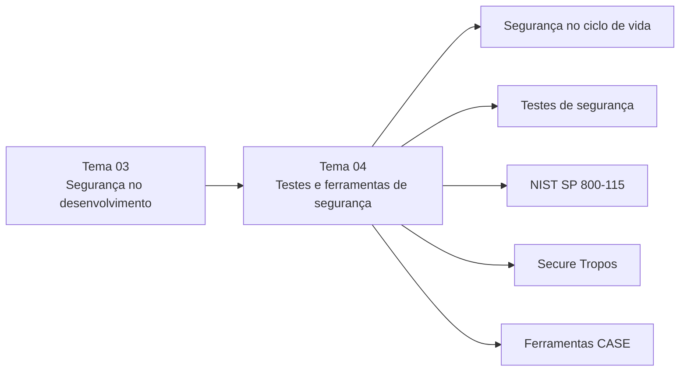

---

# 3. O produto software

O material adota a definição de Pressman segundo a qual software engloba mais que código executável.

O produto envolve:

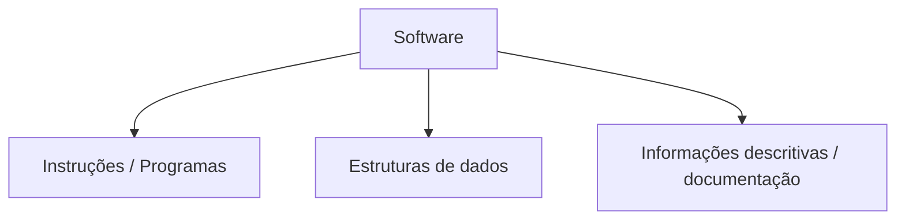

 

Isso é importante porque uma vulnerabilidade pode estar relacionada:

* ao código;
* aos dados;
* às interfaces;
* à configuração;
* à arquitetura;
* à operação;
* às pessoas;
* aos processos.

---

# 4. Categorias de software apresentadas

O material apresenta sete grandes categorias:

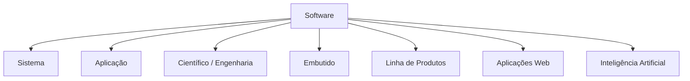

 

Cada categoria apresenta particularidades que afetam:

* arquitetura;
* requisitos;
* exposição;
* riscos;
* técnicas de teste.

---

# 5. Por que software precisa ser seguro?

O software manipula informações e normalmente interage com outros componentes.

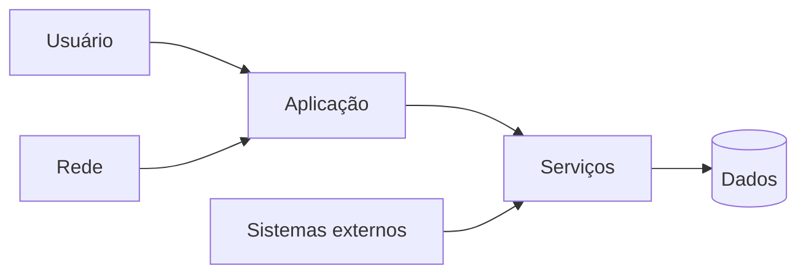

Cada interface aumenta as possibilidades de interação e também pode aumentar a superfície que precisa ser protegida.

---

# 6. Fatores que favorecem a exploração

O material cita quatro fatores importantes. 

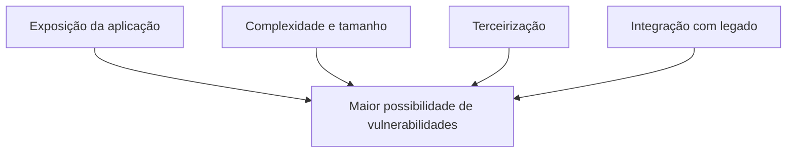

---

# 7. Exposição

Quanto mais exposta uma aplicação está, maior tende a ser sua superfície de interação.

Exemplos:

* Internet;
* APIs;
* aplicações web;
* serviços remotos;
* integrações externas.

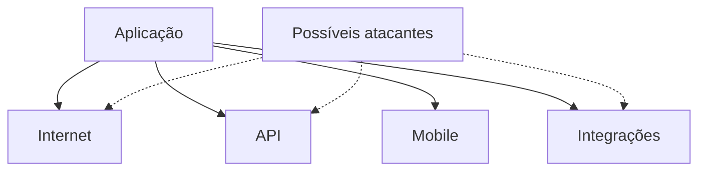

---

# 8. Complexidade

O crescimento do software normalmente significa:

* mais módulos;
* mais interfaces;
* mais integrações;
* mais caminhos de execução;
* maior dificuldade de teste.

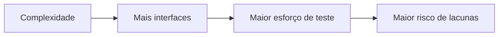

---

# 9. Terceirização

O material destaca a terceirização como fator que precisa ser controlado.

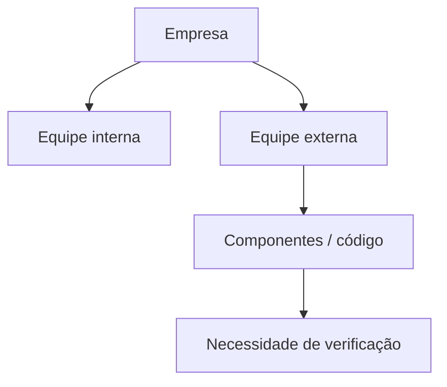

A questão não é que terceirização seja intrinsecamente insegura, mas que amplia a necessidade de governança e verificação dos componentes utilizados.

---

# 10. Software legado

A combinação de sistemas antigos com novos ambientes pode introduzir riscos.

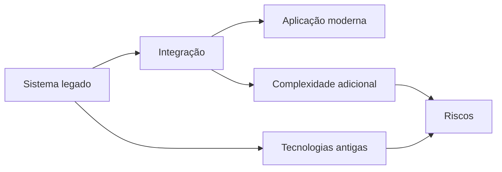

---

# 11. O que caracteriza software seguro?

O material caracteriza software seguro como aquele que:

* reduz a probabilidade de sucesso de ataques;
* é resistente;
* é tolerante ou resiliente;
* reduz os danos quando um ataque ocorre;
* incorpora segurança desde o planejamento.


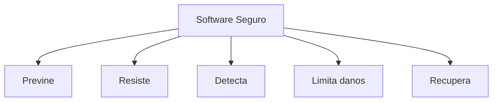

---

# 12. Propriedades de dependabilidade

O material apresenta seis propriedades:

| Propriedade           | Ideia central                        |
| --------------------- | ------------------------------------ |
| **Confiança**         | Funcionamento correto                |
| **Disponibilidade**   | Operacional quando necessário        |
| **Safety**            | Operação não deve provocar perigo    |
| **Confidencialidade** | Evitar divulgação não autorizada     |
| **Integridade**       | Evitar modificação não autorizada    |
| **Manutenibilidade**  | Possibilidade de correção e evolução |


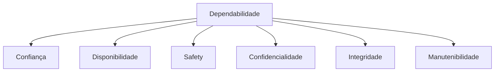

---

# 13. Segurança no ciclo de vida

A Figura da página 58 da leitura e a Figura 7 dos slides representam atividades de segurança distribuídas pelo ciclo de desenvolvimento.  

Uma representação equivalente:

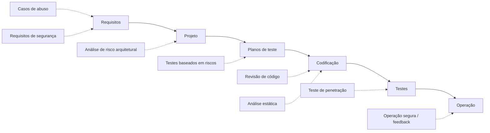

---

# 14. Casos de abuso

**Casos de abuso** representam cenários nos quais o sistema é usado de maneira indesejada ou maliciosa.

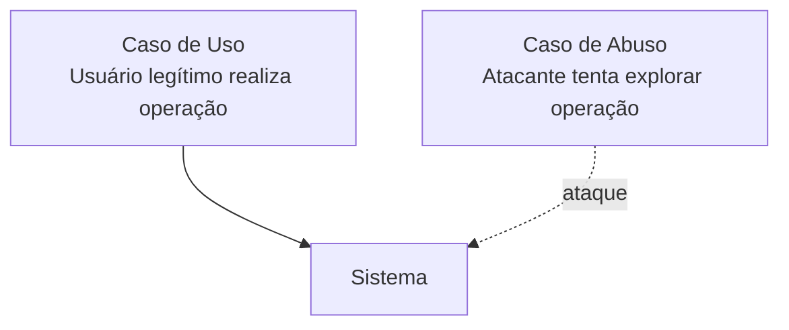

O objetivo é antecipar:

* comportamentos maliciosos;
* ameaças;
* vulnerabilidades potenciais;
* cenários que posteriormente devem ser testados.


---

# 15. Requisitos de segurança

Os requisitos de segurança devem surgir junto com os demais requisitos.

Exemplo:

```text
RF-001:
O usuário deve poder consultar seus dados.

RS-001:
Somente o próprio usuário ou um administrador autorizado
pode consultar os dados.
```

Visualmente:

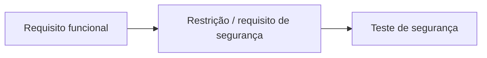

---

# 16. Análise de risco arquitetural

A análise procura identificar riscos antes da implementação.

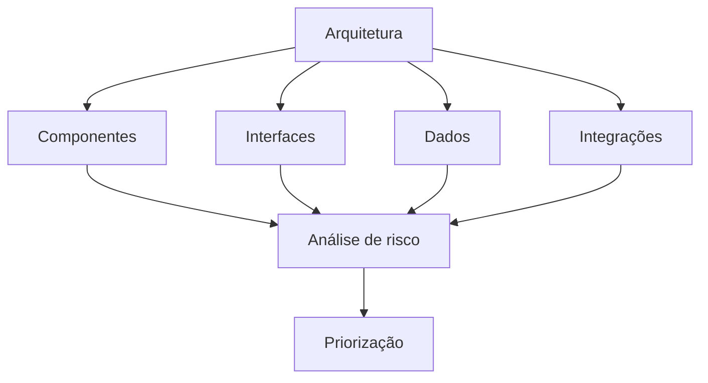

A vantagem é descobrir problemas quando ainda é possível corrigir decisões estruturais com menor impacto.

---

# 17. Testes de segurança baseados em risco

Nem todos os componentes possuem o mesmo nível de criticidade.

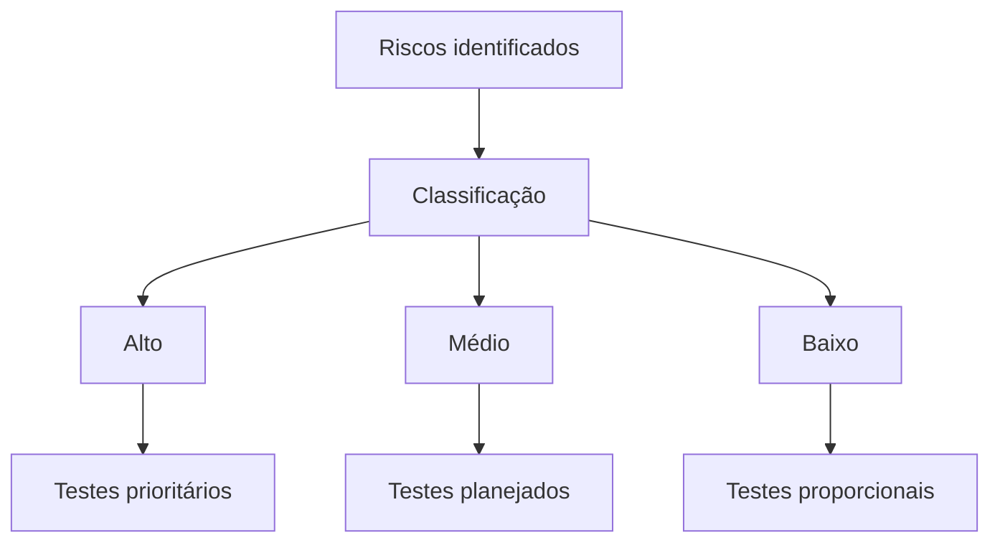

O material relaciona esses testes aos:

* requisitos de segurança;
* casos de abuso;
* padrões de ataque;
* riscos previamente identificados.


---

# 18. Revisão de código-fonte

Depois da codificação, o material recomenda revisar a implementação para verificar:

* requisitos de segurança;
* vulnerabilidades;
* problemas levantados anteriormente.


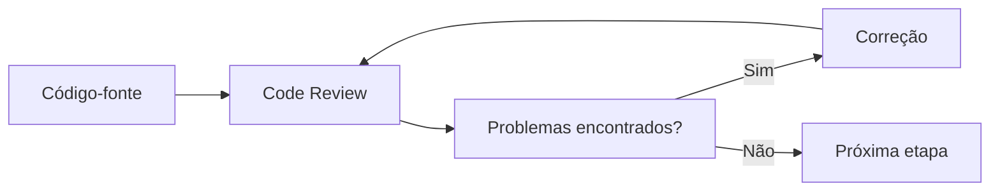

---

# 19. Revisão manual versus automatizada

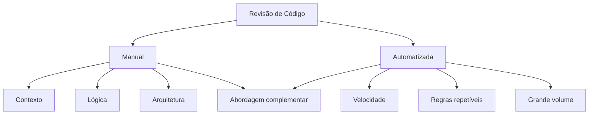

O próprio material adverte que uma análise automatizada pode não contemplar todos os cenários. 

---

# 20. Teste de penetração

O teste de penetração verifica dinamicamente a existência de vulnerabilidades exploráveis.

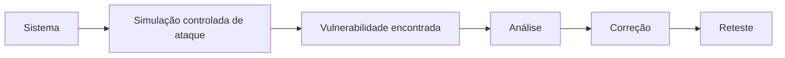

No contexto do material, essa técnica é utilizada para encontrar problemas que possam ser explorados durante a execução do sistema. 

---

# 21. Operação segura

A responsabilidade por segurança não termina com os testes.

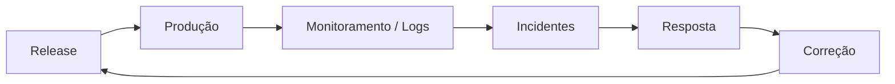

É necessário:

* rastrear operações;
* observar incidentes;
* proteger atividades;
* reagir a ataques.

---

# 22. Fluxo completo das atividades de segurança

```mermaid
flowchart LR
    AB["Casos de abuso"]
      --> SR["Requisitos de segurança"]
      --> RA["Risco arquitetural"]
      --> RT["Testes baseados em risco"]
      --> CR["Revisão de código"]
      --> PT["Penetration Testing"]
      --> OP["Operação segura"]

    OP -. "feedback" .-> AB
```

Esta é uma das relações mais importantes para a prova.

---

# 23. Teste de segurança

O objetivo do teste de segurança é encontrar vulnerabilidades e compreender o comportamento da aplicação diante de ataques.


```mermaid
flowchart TD
    T["Teste de Segurança"]

    T --> V["Encontrar vulnerabilidades"]
    T --> R["Avaliar resistência"]
    T --> P["Avaliar proteção de dados"]
    T --> C["Confirmar controles"]
    T --> RR["Apoiar análise de riscos"]
```

---

# 24. NIST SP 800-115

O material apresenta o **NIST Special Publication 800-115 — Technical Guide to Information Security Testing and Assessment** como referência para avaliações de segurança.  

O capítulo agrupa as técnicas em três categorias:

```mermaid
flowchart TD
    N["NIST SP 800-115"]

    N --> R["Técnicas de revisão"]
    N --> I["Identificação e análise"]
    N --> V["Validação de vulnerabilidades"]
```

---

# 25. Organização apresentada pelo material

A publicação é resumida em oito seções:

1. introdução;
2. visão geral das avaliações;
3. técnicas de avaliação;
4. identificação de alvos e vulnerabilidades;
5. validação de vulnerabilidades;
6. planejamento;
7. execução;
8. apresentação dos resultados e mitigação.


Visualmente:

```mermaid
flowchart LR
    P["Planejar"]
      --> D["Descobrir"]
      --> A["Analisar"]
      --> V["Validar"]
      --> R["Relatar"]
      --> M["Mitigar"]
```

---

# 26. Algumas técnicas mencionadas

O material cita como exemplos:

* análise documental;
* análise de logs;
* interceptação de dados de rede;
* verificação da integridade dos arquivos;
* identificação de alvos;
* identificação de vulnerabilidades;
* validação das vulnerabilidades.

```mermaid
flowchart TD
    A["Avaliação"]

    A --> DOC["Documentação"]
    A --> LOG["Logs"]
    A --> NET["Rede"]
    A --> FILE["Integridade de arquivos"]
    A --> HOST["Alvos"]
    A --> VULN["Vulnerabilidades"]
```

---

# 27. Penetration Testing segundo o fluxo do material

Antes de realizar um teste de penetração deve existir análise dos riscos, de forma a priorizar os componentes que merecem maior atenção. 

O material apresenta no mínimo três fases:

```mermaid
flowchart LR
    P["1. Planejamento"]
      --> E["2. Execução"]
      --> A["3. Avaliação"]
```

---

# 28. Planejamento

Determina:

* objetivo;
* escopo;
* ativos envolvidos;
* riscos;
* prioridades;
* metodologia.

```mermaid
flowchart TD
    P["Planejamento"]

    P --> S["Escopo"]
    P --> O["Objetivos"]
    P --> R["Riscos"]
    P --> A["Ativos"]
```

---

# 29. Execução

A execução busca identificar ou validar vulnerabilidades.

```mermaid
flowchart LR
    A["Alvo autorizado"]
      --> T["Técnicas planejadas"]
      --> V["Vulnerabilidades"]
      --> E["Evidências"]
```

---

# 30. Avaliação

Após a execução:

```mermaid
flowchart LR
    E["Evidências"]
      --> C["Classificação"]
      --> O["Origem / causa"]
      --> R["Recomendação"]
      --> C2["Correção"]
      --> RT["Reteste"]
```

---

# 31. Segurança antecipada e custo

O material reforça que testes de segurança devem começar cedo, porque vulnerabilidades arquiteturais descobertas tardiamente podem ter custo elevado de correção. 

```mermaid
flowchart LR
    R["Requisitos"]
      --> A["Arquitetura"]
      --> D["Desenvolvimento"]
      --> T["Testes"]
      --> PROD["Produção"]

    R -. "menor impacto de mudança" .-> C1["Correção antecipada"]
    PROD -. "maior impacto" .-> C2["Correção tardia"]
```

---

# 32. Secure Tropos

O **Secure Tropos** é apresentado como uma extensão de Tropos voltada à análise e modelagem de segurança durante o desenvolvimento. 

Ele relaciona:

```mermaid
flowchart TD
    ST["Secure Tropos"]

    ST --> R["Requisitos"]
    ST --> SC["Restrições de segurança"]
    ST --> SG["Objetivos de segurança"]
    ST --> A["Ataques"]
    ST --> V["Vulnerabilidades"]
    ST --> ACT["Atores"]
```

---

# 33. Quatro fases básicas

O material apresenta quatro fases:

```mermaid
flowchart LR
    F1["1. Análise de requisitos<br/>Identificar restrições"]
      --> F2["2. Analisar restrições<br/>Objetivos e entidades"]
      --> F3["3. Design<br/>Atores e requisitos"]
      --> F4["4. Projeto<br/>Modelagem com AUML"]
```

 

---

# 34. Restrições de segurança

Uma restrição determina condições que precisam ser respeitadas.

Exemplo:

```text
Objetivo:
Cliente consulta pedido.

Restrição:
Somente o proprietário do pedido ou usuário autorizado
pode consultar os detalhes.
```

Representação:

```mermaid
flowchart LR
    O["Objetivo"]
      --> R["Restrição de segurança"]
      --> M["Mecanismo"]
      --> V["Validação"]
```

---

# 35. Etapas do Secure Tropos apresentadas no material

O conteúdo enumera:

1. modelagem de atores;
2. modelagem de dependências;
3. identificação das restrições de segurança;
4. delegação de restrições e objetivos;
5. modelagem de objetivos;
6. modelagem de restrições;
7. modelagem de entidades de segurança;
8. análise de ameaças;
9. análise de vulnerabilidades;
10. modelagem de atacantes;
11. seleção de provedor de nuvem.


---

# 36. Visão consolidada das etapas

```mermaid
flowchart TD
    A["Atores"]
      --> D["Dependências"]
      --> C["Restrições"]
      --> O["Objetivos"]
      --> E["Entidades de segurança"]
      --> T["Ameaças"]
      --> V["Vulnerabilidades"]
      --> AT["Atacantes"]
      --> CP["Infraestrutura / provedor"]
```

---

# 37. Cinco visões do Secure Tropos

O material apresenta:

```mermaid
flowchart TD
    ST["Secure Tropos"]

    ST --> O["Visão Organizacional"]
    ST --> RS["Visão de Requisitos de Segurança"]
    ST --> CS["Visão de Componentes de Segurança"]
    ST --> AS["Visão de Ataques"]
    ST --> C["Visão de Análise de Nuvem"]
```


---

# 38. Ferramentas CASE no Tema 04

O capítulo apresenta ferramentas que apoiam Tropos/Secure Tropos.

A principal mencionada é **SecTro2**, e o material também lista alternativas. 

```mermaid
flowchart TD
    CASE["Ferramentas CASE"]

    CASE --> ST2["SecTro2"]
    CASE --> STS["STS-Tool"]
    CASE --> SI["Si* Tool"]
    CASE --> TAO["TAOM4E"]
    CASE --> GR["GR-Tool"]
    CASE --> TT["T-Tool"]
    CASE --> DW["DW-Tool"]
    CASE --> OO["OpenOME"]
    CASE --> DES["DESCARTES"]
    CASE --> SEC["SecTro"]
```

---

# 39. SecTro2

O material apresenta o **SecTro2** como ferramenta de apoio ao Secure Tropos.

Conceitualmente:

```mermaid
flowchart LR
    REQ["Requisitos"]
      --> ST["Modelagem Secure Tropos"]
      --> CASE["SecTro2"]
      --> MODELS["Modelos de segurança"]
      --> ANALYSIS["Análise"]
```

Segundo a leitura, a ferramenta apresentada é destinada ao ambiente Windows e requer banco de dados para armazenamento dos projetos. 

---

# 40. Ferramentas e finalidade conforme o material

| Ferramenta    | Finalidade apresentada                          |
| ------------- | ----------------------------------------------- |
| **STS-Tool**  | Modelagem de segurança sociotécnica             |
| **Si* Tool**  | Raciocínio e planejamento de risco              |
| **TAOM4E**    | Geração de código para JADEX                    |
| **GR-Tool**   | Raciocínio sobre objetivos                      |
| **T-Tool**    | Suporte a Tropos Formal                         |
| **DW-Tool**   | Projeto de Data Warehouse                       |
| **OpenOME**   | Modelagem orientada a requisitos e stakeholders |
| **DESCARTES** | Projeto orientado a agentes                     |
| **SecTro**    | Modelagem automatizada para Secure Tropos       |


> Esta tabela reflete especificamente as ferramentas e descrições apresentadas no material didático.

---

# 41. O papel de uma ferramenta CASE de segurança

Uma ferramenta CASE pode organizar o conhecimento produzido durante a análise.

```mermaid
flowchart TD
    CASE["Ferramenta CASE"]

    CASE --> A["Atores"]
    CASE --> R["Requisitos"]
    CASE --> T["Ameaças"]
    CASE --> V["Vulnerabilidades"]
    CASE --> O["Objetivos"]
    CASE --> C["Controles"]

    A --> TRACE["Rastreabilidade"]
    R --> TRACE
    T --> TRACE
    V --> TRACE
    O --> TRACE
    C --> TRACE
```

A principal contribuição não é “tornar o software automaticamente seguro”, mas estruturar e apoiar o processo.

---

# 42. Processo completo do Tema 04

```mermaid
flowchart LR
    R["Requisitos"]
      --> AB["Casos de abuso"]
      --> RIS["Análise de riscos"]
      --> ARQ["Arquitetura"]
      --> SEC["Requisitos de segurança"]
      --> DEV["Codificação"]
      --> REV["Revisão de código"]
      --> TEST["Testes de segurança"]
      --> PEN["Penetration Test"]
      --> PROD["Produção"]
      --> MON["Monitoramento"]

    MON -. "feedback" .-> RIS
```

---

# 43. Segurança, testes e ferramentas

Os três elementos não devem ser confundidos:

```mermaid
flowchart TD
    SEC["Segurança"]
    TEST["Teste de segurança"]
    TOOL["Ferramenta"]

    SEC --> P["Define propriedades e objetivos"]
    TEST --> V["Verifica comportamento e vulnerabilidades"]
    TOOL --> A["Apoia organização e execução"]

    P --> Q["Software mais seguro"]
    V --> Q
    A --> Q
```

---

# 44. Situação prática apresentada nos slides

O exercício do Tema 04 coloca o aluno como responsável por organizar o processo de desenvolvimento de uma nova empresa.

O direcionamento apresentado é: 

```mermaid
flowchart TD
    A["Nova equipe / novo projeto"]
      --> T["Levantar técnicas atuais"]
      --> E["Formar o time"]
      --> R["Definir responsabilidades"]
      --> M["Selecionar metodologia"]
      --> P["Padronizar processo"]
      --> S["Incorporar segurança"]
```

A ideia é evitar iniciar o desenvolvimento sem que exista:

* organização;
* responsabilidades;
* metodologia;
* padrões;
* preocupação com segurança.

---

# 45. Aprendizado do podcast — Tema 04

O podcast enfatiza que organização de processos influencia diretamente a qualidade e a segurança do software.

O autor compara dois ambientes:

```mermaid
flowchart TD
    A["Ambiente A"]
    A --> P["Processos definidos"]
    A --> Q["Qualidade setorizada"]
    A --> S["Segurança organizada"]
    A --> M["Métricas"]

    B["Ambiente B"]
    B --> DEV["Programador"]
    DEV --> AN["Também analisa"]
    DEV --> TE["Também testa"]

    P --> R1["Maior organização"]
    Q --> R1
    S --> R1
    M --> R1

    AN --> R2["Menor separação de responsabilidades"]
    TE --> R2
```

O relato sustenta que ambientes desorganizados e sem práticas bem definidas podem favorecer a existência de vulnerabilidades não identificadas. 

---

# 46. Integração entre os quatro temas da disciplina

Os quatro temas agora formam uma sequência lógica:

```mermaid
flowchart LR
    T1["Tema 01<br/>Qualidade, documentação e TMMi"]
      --> T2["Tema 02<br/>Gerenciamento de testes"]
      --> T3["Tema 03<br/>Segurança no desenvolvimento"]
      --> T4["Tema 04<br/>Testes e ferramentas de segurança"]
```

Podemos interpretar assim:

| Tema   | Pergunta principal                                 |
| ------ | -------------------------------------------------- |
| **01** | Como estruturar qualidade e maturidade dos testes? |
| **02** | Como executar e gerenciar testes?                  |
| **03** | Como incorporar segurança ao desenvolvimento?      |
| **04** | Como testar e modelar a segurança do software?     |

---

# 47. O que memorizar para a prova — Tema 04

## Segurança ao longo do ciclo

```text
Casos de abuso
→ Requisitos de segurança
→ Análise de risco arquitetural
→ Testes baseados em risco
→ Revisão de código
→ Penetration Testing
→ Operação segura
```

---

## Dependabilidade

```text
Confiança
Disponibilidade
Safety
Confidencialidade
Integridade
Manutenibilidade
```

---

## NIST SP 800-115

Três grupos apresentados:

```text
Revisão
Identificação e análise
Validação de vulnerabilidades
```

---

## Penetration Testing

```text
Planejamento
→ Execução
→ Avaliação
```

---

## Secure Tropos

Quatro momentos principais:

```text
Análise de requisitos
→ Restrições e objetivos
→ Design
→ Projeto / AUML
```

---

## Ferramenta central do conteúdo

```text
SecTro2
```

Além dela:

```text
STS-Tool
Si* Tool
TAOM4E
GR-Tool
T-Tool
DW-Tool
OpenOME
DESCARTES
SecTro
```

---

# 48. Armadilhas comuns de prova

### “A segurança deve ser testada somente depois do desenvolvimento.”

**Errado.**

O material defende atividades de segurança durante todo o ciclo.

---

### “Penetration Testing substitui todas as demais atividades de segurança.”

**Errado.**

Ele representa apenas uma das atividades.

---

### “A revisão automática de código encontra todos os problemas.”

**Errado.**

O próprio material destaca que ferramentas automatizadas podem deixar lacunas.

---

### “Secure Tropos preocupa-se apenas com codificação.”

**Errado.**

Seu foco envolve requisitos, atores, restrições, objetivos, ameaças, vulnerabilidades e modelagem.

---

### “Ferramenta CASE garante automaticamente um software seguro.”

**Errado.**

Ela dá suporte à metodologia e aos processos.

---

### “Segurança termina com a publicação do sistema.”

**Errado.**

O conteúdo inclui operação segura, feedback e tratamento de problemas após implantação.

---

# 49. Perguntas de revisão — Tema 04

1. O que compõe um produto software segundo a abordagem do material?
2. Quais são as sete categorias de software apresentadas?
3. Quais fatores favorecem a exploração de sistemas?
4. Por que complexidade aumenta o desafio de segurança?
5. O que caracteriza software seguro?
6. Quais propriedades de dependabilidade são apresentadas?
7. O que é um caso de abuso?
8. Quando requisitos de segurança devem ser definidos?
9. O que é análise de risco arquitetural?
10. O que significa teste baseado em risco?
11. Qual a finalidade da revisão de código?
12. Por que análise manual e automática podem ser complementares?
13. Qual a finalidade de um teste de penetração?
14. O que significa operação segura?
15. O que é NIST SP 800-115 no contexto do material?
16. Quais são os três grupos de técnicas apresentados?
17. Quais são as três fases mínimas do Penetration Testing descritas?
18. O que é Secure Tropos?
19. Quais são suas quatro fases básicas?
20. Quais visões o Secure Tropos apresenta?
21. Para que serve o SecTro2?
22. Qual o papel das ferramentas CASE em segurança?
23. Por que segurança precisa continuar em produção?

---

# 50. Mapa mental — Tema 04

```mermaid
flowchart TD
    T["TEMA 04<br/>Testes de Segurança"]

    T --> SW["Produto Software"]
    T --> CV["Ciclo de Vida"]
    T --> TS["Teste de Segurança"]
    T --> NIST["NIST 800-115"]
    T --> ST["Secure Tropos"]
    T --> CASE["Ferramentas CASE"]

    CV --> UA["Casos de abuso"]
    CV --> RS["Requisitos de segurança"]
    CV --> AR["Risco arquitetural"]
    CV --> CR["Revisão de código"]
    CV --> PT["Penetration Testing"]
    CV --> OP["Operação segura"]

    TS --> V["Vulnerabilidades"]
    TS --> R["Riscos"]

    NIST --> REV["Revisão"]
    NIST --> IA["Identificação / análise"]
    NIST --> VV["Validação"]

    ST --> ACT["Atores"]
    ST --> CONS["Restrições"]
    ST --> OBJ["Objetivos"]
    ST --> TH["Ameaças"]
    ST --> VUL["Vulnerabilidades"]

    CASE --> SEC["SecTro2"]
    CASE --> STS["STS-Tool"]
    CASE --> SI["Si* Tool"]
```

---

# 51. Resumo executivo dos Temas 03 e 04

Os dois temas fecham a disciplina estabelecendo um princípio fundamental:

> **Segurança precisa ser construída, verificada e mantida durante todo o ciclo de vida do software.**

No **Tema 03**, essa ideia é estruturada através das propriedades da segurança da informação, de SGSI, PDCA, ISO/IEC 27001, ISO/IEC 27002, ISO/IEC 15408 e do Security Development Lifecycle.  

No **Tema 04**, a segurança passa para o domínio das atividades concretas de engenharia: casos de abuso, requisitos de segurança, análise de risco arquitetural, revisão de código, testes baseados em risco, testes de penetração, operação segura, NIST SP 800-115 e Secure Tropos. Ferramentas CASE são introduzidas como mecanismos de apoio à modelagem e organização dessas atividades.  

A sequência completa da disciplina pode ser condensada da seguinte maneira:

```mermaid
flowchart LR
    Q["Qualidade"]
      --> DOC["Documentação"]
      --> TEST["Testes"]
      --> MAT["Maturidade"]
      --> SEC["Segurança"]
      --> RISK["Gestão de riscos"]
      --> ST["Testes de segurança"]
      --> CASE["Ferramentas CASE"]
      --> CI["Melhoria contínua"]
```

E o princípio que conecta os quatro temas é:

```text
REQUISITOS
    ↓
PROCESSOS
    ↓
QUALIDADE
    ↓
TESTES
    ↓
SEGURANÇA
    ↓
EVIDÊNCIAS
    ↓
MELHORIA CONTÍNUA
```

Com isso, os **Temas 01, 02, 03 e 04** ficam estruturados em uma mesma linha didática, com os diagramas principais convertidos para Mermaid e com conteúdo apropriado para documentação e revisão no GitHub.
