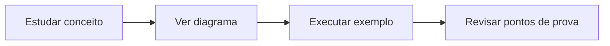

# Tech Foundation & Coding

Material de revisão em português, organizado para consulta no GitHub e estudo para prova.

> Base: e-books, slides e materiais complementares das Aulas 1, 2 e 3 da disciplina **Tech Foundation & Coding**.

## Como usar este repositório

1. Comece pelo resumo de cada aula.
2. Estude os diagramas Mermaid para fixar os fluxos.
3. Execute os exemplos Python no VSCode ou no terminal.
4. Revise a seção **Pontos de prova** antes da avaliação.
5. Use os flashcards para testar memorização rápida.

## Índice

| Aula | Tema | Arquivo |
|---|---|---|
| 01 | Fundamentos da Computação e Introdução à Programação | [`docs/01-fundamentos-computacao-programacao.md`](docs/01-fundamentos-computacao-programacao.md) |
| 02 | Estruturas de Dados, Algoritmos e Cloud Computing | [`docs/02-estruturas-dados-algoritmos-cloud.md`](docs/02-estruturas-dados-algoritmos-cloud.md) |
| 03 | Engenharia de Software, APIs, Segurança e IA | [`docs/03-engenharia-software-apis-seguranca-ia.md`](docs/03-engenharia-software-apis-seguranca-ia.md) |
| Extra | Exercícios explicados e padrões de código | [`docs/04-exercicios-python.md`](docs/04-exercicios-python.md) |

## Padrão didático adotado

Cada capítulo segue a mesma estrutura:

- **Objetivos da aula**: o que precisa ser entendido.
- **Mapa mental Mermaid**: visão visual do conteúdo.
- **Conceitos essenciais**: explicação em linguagem direta.
- **Diagramas Mermaid equivalentes**: substituem ou complementam os esquemas dos PDFs/slides.
- **Exemplos práticos**: códigos Python e cenários reais.
- **Pontos de prova**: itens com maior chance de cobrança.
- **Flashcards**: perguntas e respostas curtas para revisão.
- **Checklist final**: confirmação do domínio do conteúdo.

## Como visualizar Mermaid no GitHub

O GitHub renderiza blocos Mermaid automaticamente. Exemplo:



## Ambiente recomendado para prática

- Python 3 instalado.
- Visual Studio Code.
- Extensão Python no VSCode.
- Terminal integrado para executar arquivos `.py`.

Comando básico:

```bash
python arquivo.py
```

Em alguns sistemas, use:

```bash
python3 arquivo.py
```
