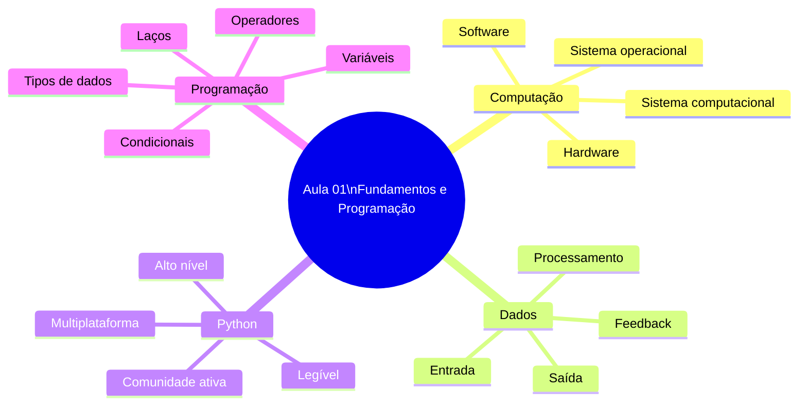
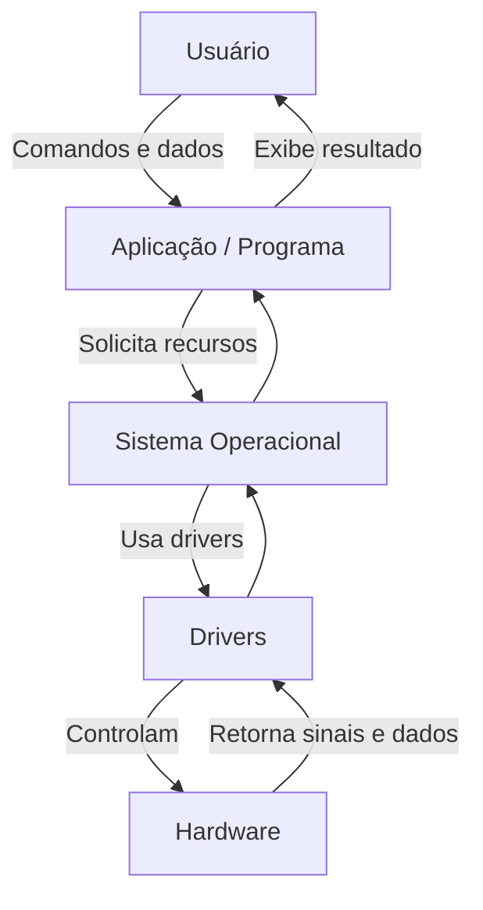
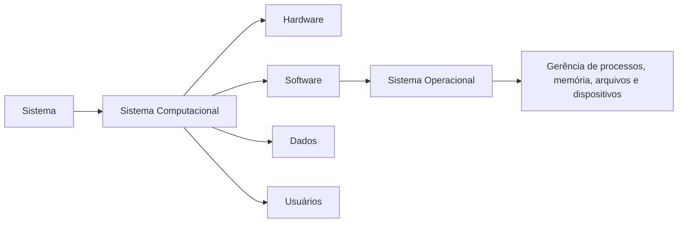
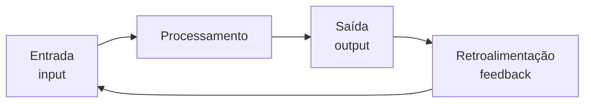
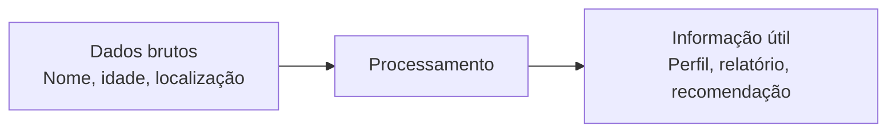
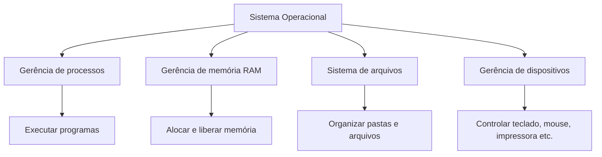
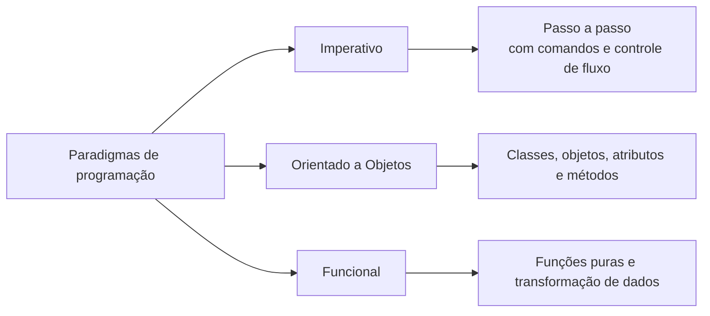
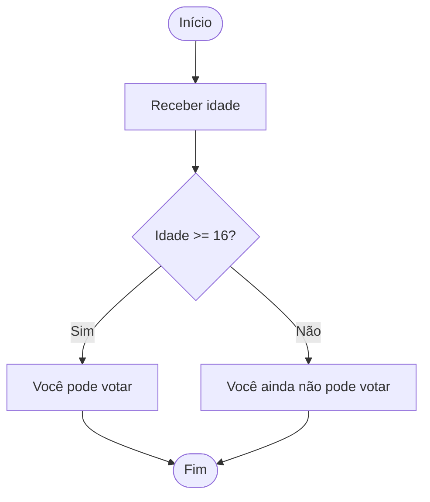
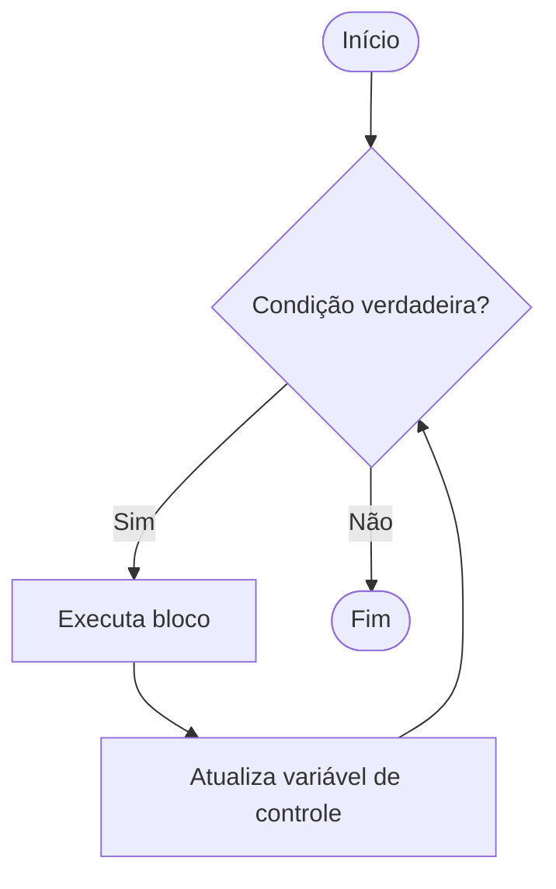

# Aula 01 - Fundamentos da Computação e Introdução à Programação

## 1. Objetivos da aula

Ao final desta aula, você deve conseguir:

- Diferenciar **hardware** e **software**.
- Explicar o que é um **sistema computacional**.
- Entender o papel do **sistema operacional**.
- Diferenciar **dados** de **informações**.
- Compreender os fundamentos da linguagem **Python**.
- Usar variáveis, tipos de dados, operadores, condicionais e laços de repetição.

---

## 2. Mapa mental da aula



---

## 3. Hardware, software e sistema computacional

### Hardware

É a parte física do computador, ou seja, tudo aquilo que pode ser tocado.

Exemplos:

- CPU;
- memória RAM;
- HD ou SSD;
- placa-mãe;
- teclado, mouse, impressora, câmera e outros periféricos.

### Software

É a parte lógica do sistema: programas, sistemas operacionais, aplicativos, APIs e drivers.

O software diz ao hardware **o que fazer**.

### Driver

Driver é um software específico que permite a comunicação entre o sistema operacional e um dispositivo físico. Sem driver adequado, o sistema pode não reconhecer uma impressora, câmera, teclado ou outro periférico.

---

## 4. Diagrama: relação entre hardware, software e usuário



### Como interpretar

O usuário não conversa diretamente com o hardware. Ele usa uma aplicação, a aplicação solicita recursos ao sistema operacional, o sistema operacional usa drivers e os drivers controlam os dispositivos físicos.

---

## 5. Componentes principais do computador

| Componente | Função |
|---|---|
| CPU | Executa instruções dos programas. |
| Memória RAM | Guarda temporariamente dados em uso. |
| HD/SSD | Armazena dados de forma permanente. |
| Placa-mãe | Interliga os componentes. |
| Barramentos | Permitem comunicação entre as partes. |
| Periféricos | Dispositivos de entrada e saída, como teclado, mouse, monitor e impressora. |

---

## 6. Sistema, sistema computacional e sistema operacional

### Sistema

Um sistema é um conjunto de partes interdependentes que trabalham juntas para atingir um objetivo comum.

### Sistema computacional

É o conjunto integrado de hardware, software, dados, usuários e periféricos que executa tarefas computacionais.

### Sistema operacional

É o software que funciona como camada intermediária entre o hardware e os demais programas.



---

## 7. Entrada, processamento, saída e feedback

Todo sistema pode ser entendido pelo ciclo:



### Exemplo com editor de texto

| Etapa | Exemplo |
|---|---|
| Entrada | Usuário digita um texto. |
| Processamento | O programa interpreta comandos e formata o conteúdo. |
| Saída | Texto aparece na tela. |
| Feedback | Usuário revisa, corrige e digita novamente. |

---

## 8. Dados x informações

| Conceito | Definição | Exemplo |
|---|---|---|
| Dado | Elemento bruto, isolado e sem contexto. | `25`, `Ana`, `DF` |
| Informação | Resultado do processamento de dados com significado. | `Ana tem 25 anos e mora no DF.` |



---

## 9. Sistema operacional

O sistema operacional gerencia os recursos do computador e permite que os programas sejam executados.

Funções principais:

- gerência de processos;
- gerência de memória;
- sistema de arquivos;
- gerência de dispositivos.



### Processo

Processo é um programa em execução. O sistema operacional alterna entre vários processos com base em prioridade e tempo, criando a sensação de multitarefa.

---

## 10. Introdução à linguagem Python

Python foi apresentado como uma linguagem adequada para iniciantes por ter sintaxe clara, legibilidade e uso amplo em automação, ciência de dados, web e inteligência artificial.

Características importantes:

- linguagem de alto nível;
- sintaxe simples;
- tipagem dinâmica;
- comunidade ativa;
- bibliotecas para várias áreas;
- suporta múltiplos paradigmas.

---

## 11. Paradigmas de programação



| Paradigma | Ideia central | Exemplo de raciocínio |
|---|---|---|
| Imperativo | Dar comandos em sequência. | Faça isso, depois aquilo. |
| Orientado a Objetos | Modelar entidades com atributos e comportamentos. | Cliente, Conta, Pedido. |
| Funcional | Processar dados por meio de funções. | Entrada -> função -> saída. |

---

## 12. Variáveis e tipos de dados

Variável é um espaço de memória com nome usado para armazenar um valor.

```python
nome = "Ana"
idade = 25
altura = 1.75
estudando = True
```

| Tipo | Descrição | Exemplo |
|---|---|---|
| `int` | Número inteiro. | `25` |
| `float` | Número decimal. | `1.75` |
| `str` | Texto. | `"Ana"` |
| `bool` | Valor lógico. | `True` ou `False` |

---

## 13. Atribuição e comparação

| Operador | Uso | Exemplo |
|---|---|---|
| `=` | Atribui valor. | `idade = 20` |
| `==` | Compara igualdade. | `idade == 20` |

```python
idade = 20
print(idade == 20)  # True
```

---

## 14. Operadores matemáticos

```python
a = 10
b = 3

print(a + b)   # soma: 13
print(a - b)   # subtração: 7
print(a * b)   # multiplicação: 30
print(a / b)   # divisão: 3.333...
print(a // b)  # divisão inteira: 3
print(a % b)   # resto: 1
print(a ** b)  # potência: 1000
```

---

## 15. Operadores lógicos

| Operador | Significado |
|---|---|
| `and` | Verdadeiro se todas as condições forem verdadeiras. |
| `or` | Verdadeiro se pelo menos uma condição for verdadeira. |
| `not` | Inverte o resultado lógico. |

```python
idade = 20
tem_habilitacao = True

if idade >= 18 and tem_habilitacao:
    print("Pode dirigir")
else:
    print("Não pode dirigir")
```

---

## 16. Estruturas condicionais

As estruturas condicionais permitem que o programa tome decisões.



### Exemplo com `if`, `elif` e `else`

```python
idade = int(input("Digite sua idade: "))

if idade < 16:
    print("Você ainda não pode votar.")
elif 16 <= idade < 18:
    print("Você pode votar, mas o voto é facultativo.")
else:
    print("Você é obrigado a votar.")
```

---

## 17. Laços de repetição

Laços repetem um bloco de código enquanto uma condição for verdadeira ou enquanto houver itens a percorrer.

### `for` com `range()`

```python
numero = 5

for i in range(1, 11):
    print(f"{numero} x {i} = {numero * i}")
```

### `while`

```python
senha_correta = "1234"
tentativa = ""

while tentativa != senha_correta:
    tentativa = input("Digite a senha: ")

print("Acesso liberado!")
```

### Cuidado com loop infinito

Um laço `while` precisa ter uma condição que em algum momento se torne falsa.



---

## 18. `break` e `continue`

| Comando | Função |
|---|---|
| `break` | Interrompe o laço imediatamente. |
| `continue` | Pula a iteração atual e continua na próxima. |

```python
while True:
    comando = input("Digite um comando ou 'sair': ")

    if comando == "sair":
        break

    print(f"Você digitou: {comando}")
```

```python
for i in range(1, 11):
    if i % 2 == 0:
        continue
    print(f"Número ímpar: {i}")
```

---

## 19. Pontos de prova

- Hardware é físico; software é lógico.
- Driver permite comunicação entre SO e dispositivo.
- Sistema computacional integra hardware, software, usuários e dados.
- Sistema operacional gerencia processos, memória, arquivos e dispositivos.
- Processo é programa em execução.
- Dado é bruto; informação é dado processado com significado.
- Python usa indentação para definir blocos.
- `=` atribui valor; `==` compara igualdade.
- `if`, `elif` e `else` controlam decisões.
- `for` é adequado para contagem e percorrer sequências.
- `while` é adequado quando não se sabe previamente o número de repetições.
- `break` encerra o laço; `continue` pula a iteração atual.

---

## 20. Flashcards

| Pergunta | Resposta |
|---|---|
| O que é hardware? | Parte física do computador. |
| O que é software? | Parte lógica: programas, SO, drivers e APIs. |
| O que é processo? | Programa em execução. |
| Qual função do SO? | Gerenciar recursos e intermediar hardware e aplicativos. |
| O que é dado? | Elemento bruto sem contexto. |
| O que é informação? | Dado processado com significado. |
| Para que serve `if`? | Tomar decisão com base em condição. |
| Para que serve `while`? | Repetir enquanto uma condição for verdadeira. |
| Para que serve `break`? | Interromper um laço. |
| Para que serve `continue`? | Ir para a próxima iteração do laço. |

---

## 21. Checklist final

- [ ] Sei explicar hardware e software.
- [ ] Sei descrever um sistema computacional.
- [ ] Sei explicar o papel do sistema operacional.
- [ ] Sei diferenciar dado e informação.
- [ ] Sei criar variáveis em Python.
- [ ] Sei usar operadores matemáticos, de comparação e lógicos.
- [ ] Sei montar condicionais com `if`, `elif` e `else`.
- [ ] Sei usar `for`, `while`, `break` e `continue`.
