# Aula 02 - Estruturas de Dados, Algoritmos e Cloud Computing

## 1. Objetivos da aula

Ao final desta aula, você deve conseguir:

- Explicar por que estruturas de dados ajudam a lidar com complexidade.
- Diferenciar listas, tuplas, dicionários, matrizes, conjuntos, filas, pilhas e hash tables.
- Entender a relação entre dicionários Python e hash tables.
- Comparar algoritmos de ordenação como TimSort, Merge Sort, Quick Sort e Heap Sort.
- Compreender o papel de APIs REST na comunicação entre sistemas.
- Explicar o que é computação em nuvem e diferenciar IaaS, PaaS e SaaS.

---

## 2. Mapa mental da aula

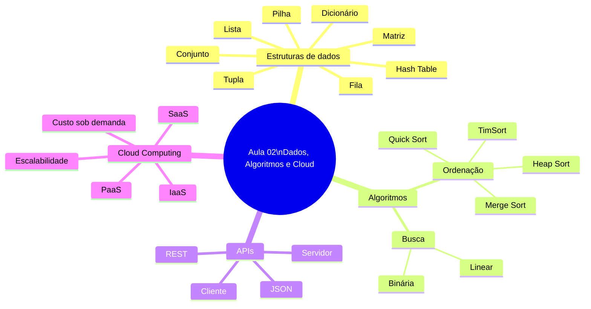

---

## 3. Estruturas de dados

Estruturas de dados são formas de organizar informações para que um programa consiga armazenar, acessar, modificar, buscar e processar dados com eficiência.

A ideia central da aula é: **composição é o primeiro passo para lidar com complexidade**.

Uma variável simples guarda um valor. Uma estrutura composta guarda vários valores ou organiza dados de forma mais rica.

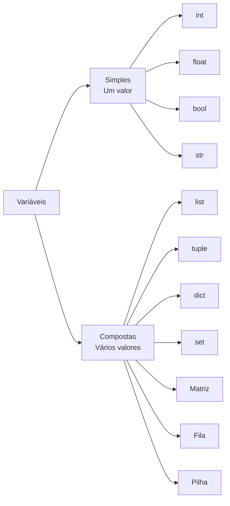

---

## 4. Listas

Listas são estruturas dinâmicas e mutáveis. Usam colchetes `[]`, permitem armazenar vários valores e acessar elementos por índice.

```python
alunos = ["Ana", "Bruno", "Carlos"]

print(alunos[0])  # Ana
print(alunos[1])  # Bruno

alunos[2] = "Clara"
print(alunos)
```

Características:

- índice começa em zero;
- permite alteração de elementos;
- aceita tipos diferentes;
- muito usada para coleções de dados.

```mermaid
flowchart LR
    Lista[Lista alunos] --> I0[Índice 0\nAna]
    Lista --> I1[Índice 1\nBruno]
    Lista --> I2[Índice 2\nCarlos]
    I2 --> Alteracao[Alteração\nalunos[2] = Clara]
    Alteracao --> Novo[Índice 2\nClara]
```

---

## 5. Tuplas

Tuplas são semelhantes às listas, mas são **imutáveis**. Usam parênteses `()` e não permitem alteração após a criação.

```python
data_nascimento = (25, 3, 1990)

print(data_nascimento[0])  # dia
print(data_nascimento[1])  # mês
print(data_nascimento[2])  # ano
```

Quando usar:

- coordenadas geográficas;
- datas fixas;
- constantes;
- dados que não devem ser alterados acidentalmente.

```python
coordenadas = (10.0, 20.0)
print(coordenadas[0])
print(coordenadas[1])
```

---

## 6. Dicionários

Dicionários armazenam pares **chave-valor**. Usam `{}` e permitem acesso rápido pelo nome da chave.

```python
usuario = {
    "nome": "Camila",
    "idade": 28,
    "email": "camila@email.com"
}

print(usuario["nome"])
print(usuario["idade"])
```

Uso comum:

- representar usuários;
- representar produtos;
- armazenar configurações;
- manipular dados de APIs em JSON.

```mermaid
flowchart LR
    Usuario[Usuário] --> Nome["nome" -> "Camila"]
    Usuario --> Idade["idade" -> 28]
    Usuario --> Email["email" -> "camila@email.com"]
```

---

## 7. Matrizes

Matrizes são listas dentro de listas. Organizam dados em linhas e colunas e usam dois índices: `[linha][coluna]`.

```python
matriz = [
    [1, 2],
    [3, 4]
]

print(matriz[1][1])  # 4
```

Exemplo com notas:

```python
notas = [
    [7.5, 8.0, 9.0],
    [6.0, 5.5, 7.0],
    [9.0, 8.5, 10.0]
]

print(notas[1][1])  # segunda prova do segundo aluno: 5.5
```

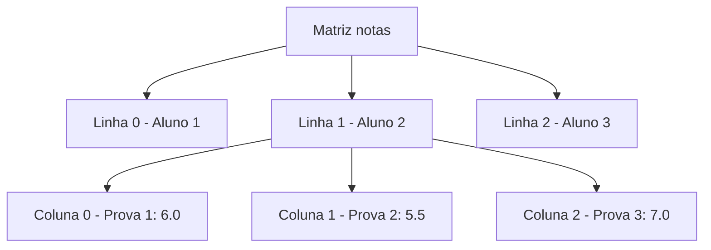

Aplicações:

- cálculos matemáticos;
- tabuleiros de jogos;
- dados tabulares;
- visão computacional, em que imagens podem ser representadas por matrizes de pixels.

---

## 8. Conjuntos

Conjuntos (`set`) não aceitam duplicidade e permitem operações matemáticas.

```python
conjunto = {1, 2, 3, 4}
conjunto.add(4)  # não duplica

print(2 in conjunto)  # True
```

Operações principais:

| Operação | Símbolo | Exemplo |
|---|---|---|
| União | `|` | `a | b` |
| Interseção | `&` | `a & b` |
| Diferença | `-` | `a - b` |

```python
set1 = {1, 2, 3, 4}
set2 = {3, 4, 5, 6}

print(set1 & set2)  # {3, 4}
```

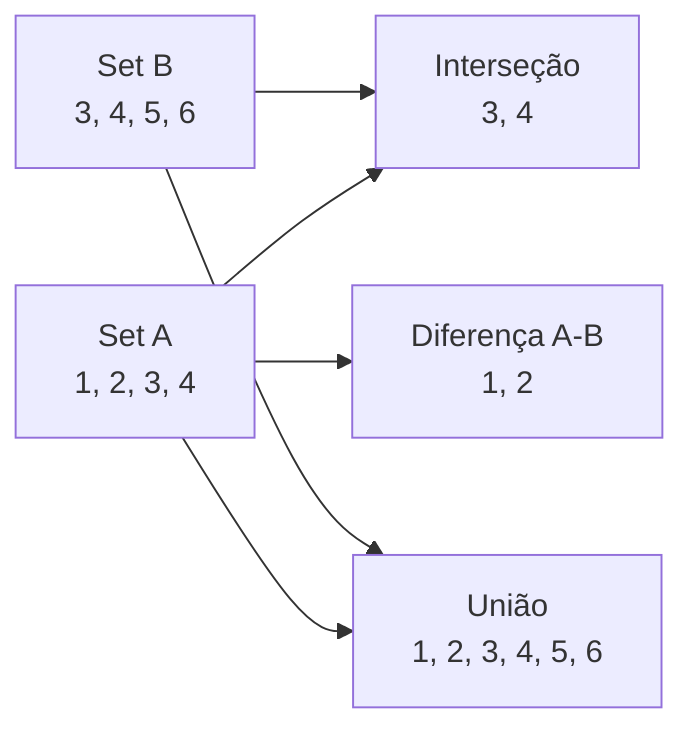

---

## 9. Filas e pilhas

### Fila - FIFO

Fila segue o princípio **FIFO - First In, First Out**: o primeiro a entrar é o primeiro a sair.

Exemplos:

- fila de banco;
- atendimento em SAC;
- documentos enviados para impressora;
- agendamento de processos.

```python
from collections import deque

fila = deque()
fila.append("Ana")
fila.append("Bruno")
fila.append("Carlos")

print(fila.popleft())  # Ana
```

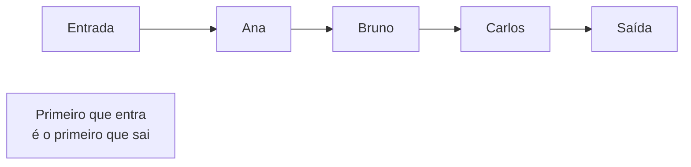

### Pilha - LIFO

Pilha segue o princípio **LIFO - Last In, First Out**: o último a entrar é o primeiro a sair.

Exemplos:

- pilha de pratos;
- histórico de navegação;
- desfazer ação (`Ctrl+Z`).

```python
pilha = []
pilha.append("abrir arquivo")
pilha.append("editar texto")
pilha.append("salvar")

print(pilha.pop())  # salvar
```

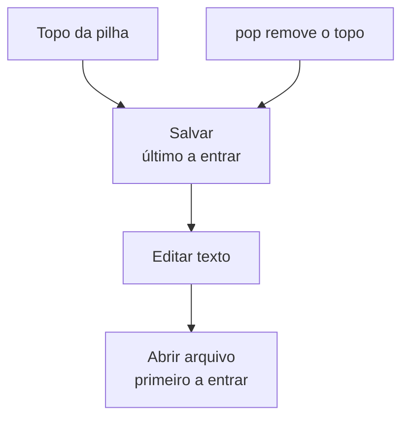

---

## 10. Hash Table

Hash table é uma estrutura eficiente para busca, inserção e remoção. Em Python, a implementação mais comum é o dicionário (`dict`).

A chave passa por uma função de hash, que gera um índice interno para localizar rapidamente o valor.

```python
agenda = {
    "Ana": "9999-1234",
    "Bruno": "9888-5678",
    "Carlos": "9777-0000"
}

print(agenda["Ana"])
```

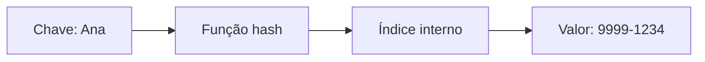

### Ideia para prova

Dicionário é a forma prática de usar hash table em Python.

---

## 11. Busca linear e busca binária

### Busca linear

Percorre item por item até encontrar o alvo.

```python
clientes = ["Ana", "Bruno", "Carlos"]

for cliente in clientes:
    if cliente == "Bruno":
        print("Encontrado")
        break
```

Complexidade: `O(n)`.

### Busca binária

Exige lista ordenada. Divide o espaço de busca pela metade a cada passo.

```python
def busca_binaria(lista, alvo):
    inicio = 0
    fim = len(lista) - 1

    while inicio <= fim:
        meio = (inicio + fim) // 2

        if lista[meio] == alvo:
            return meio
        elif lista[meio] < alvo:
            inicio = meio + 1
        else:
            fim = meio - 1

    return -1

print(busca_binaria([1, 3, 5, 7, 9], 7))
```

Complexidade: `O(log n)`.

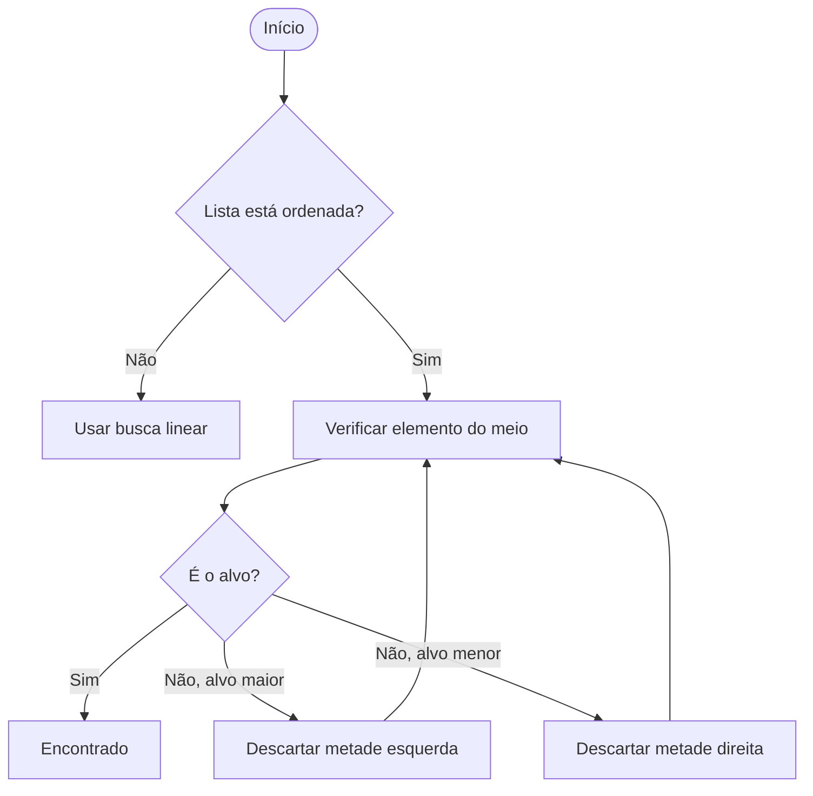

---

## 12. Algoritmos de ordenação

Ordenar é organizar dados por um critério: nome, data, valor, prioridade etc.

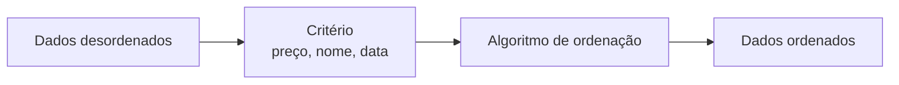

### Comparativo

| Algoritmo | Estável? | Uso prático |
|---|---:|---|
| TimSort | Sim | Padrão do Python em `sorted()` e `.sort()`. |
| Merge Sort | Sim | Integração e mesclagem de dados. |
| Quick Sort | Não | Alta performance média em listas grandes. |
| Heap Sort | Não | Ordenação por prioridade. |

### Estabilidade

Um algoritmo estável preserva a ordem relativa de elementos equivalentes.

Exemplo: se dois produtos têm o mesmo preço, um algoritmo estável mantém a ordem original entre eles.

---

## 13. TimSort

TimSort é o algoritmo de ordenação usado internamente pelo Python para listas comuns.

```python
produtos = [("Mouse", 50), ("Monitor", 800), ("Teclado", 120)]

ordenados = sorted(produtos, key=lambda p: p[1])
print(ordenados)
```

### Lambda

`lambda` permite definir uma função curta no próprio argumento.

```python
key=lambda p: p[1]
```

Significa: ordene usando o segundo item da tupla, ou seja, o preço.

---

## 14. Merge Sort

Merge Sort divide a lista em partes menores, ordena e depois mescla.

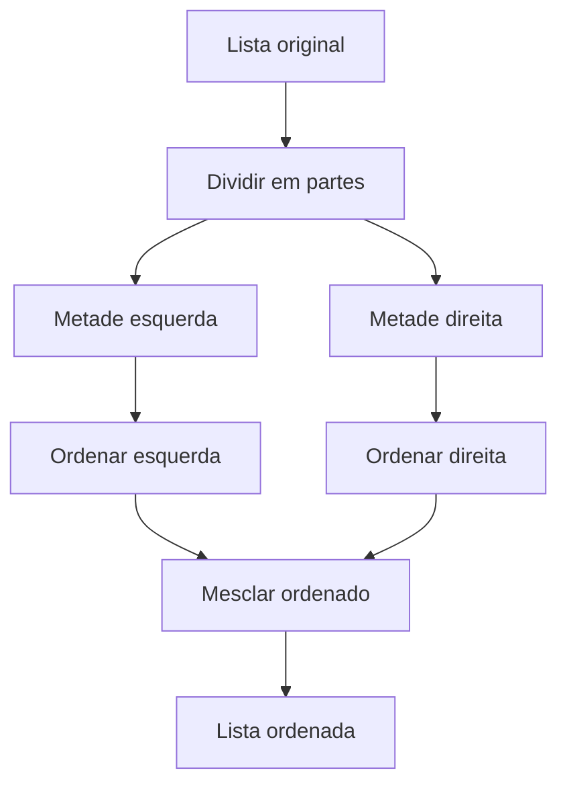

Exemplo simplificado de mesclagem:

```python
def merge(e, d):
    res = []

    while e and d:
        if e[0] < d[0]:
            res.append(e.pop(0))
        else:
            res.append(d.pop(0))

    return res + e + d

print(merge(["Ana", "Carlos"], ["Bruno", "João"]))
```

---

## 15. Quick Sort

Quick Sort escolhe um pivô e separa os elementos em dois grupos.

```python
def quick(lista):
    if len(lista) <= 1:
        return lista

    pivo = lista[0]
    maiores = [x for x in lista[1:] if x > pivo]
    menores_ou_iguais = [x for x in lista[1:] if x <= pivo]

    return quick(maiores) + [pivo] + quick(menores_ou_iguais)

print(quick([450, 120, 880, 300]))
```

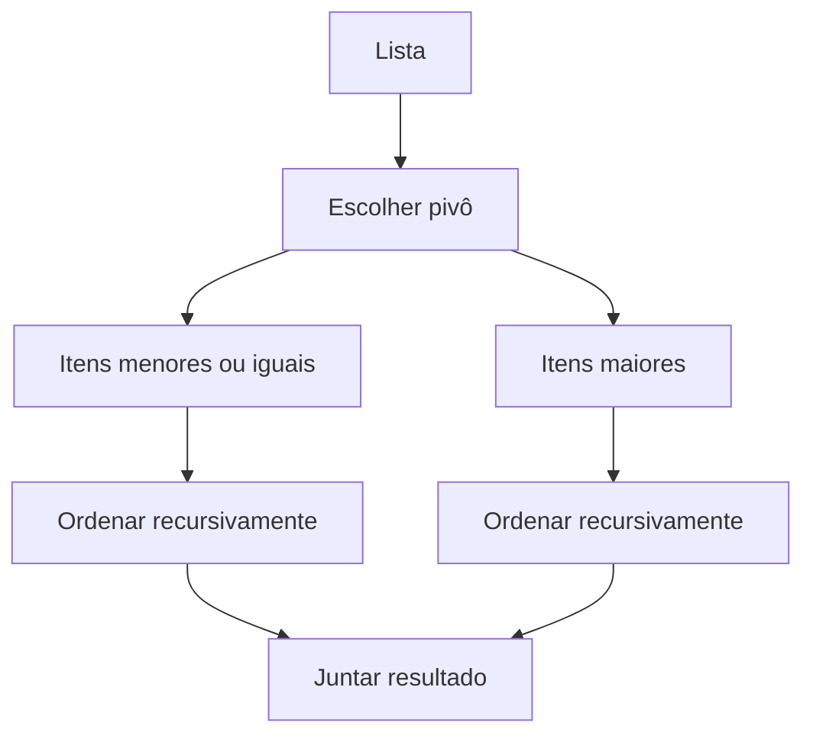

---

## 16. Heap Sort e fila de prioridade

Heap é adequado para cenários onde a prioridade importa.

```python
import heapq

pacientes = [(-82, "Carlos"), (-65, "Maria"), (-29, "João")]
heapq.heapify(pacientes)

print(heapq.heappop(pacientes))  # (-82, 'Carlos')
```

No exemplo, usa-se número negativo porque o `heapq` do Python trabalha como min-heap. Assim, `-82` vem antes de `-65`, representando maior prioridade para paciente mais velho.

---

## 17. APIs REST

API é uma interface de comunicação entre sistemas. REST é um estilo arquitetural muito usado para criar APIs web.

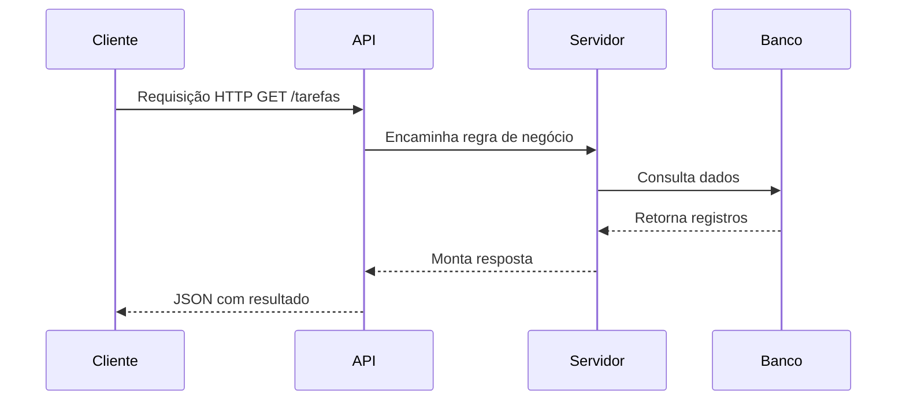

Conceitos importantes:

- cliente faz requisição;
- servidor processa;
- API expõe endpoints;
- JSON é formato comum de troca;
- HTTP define métodos como GET, POST, PUT e DELETE.

---

## 18. Cloud Computing

Computação em nuvem permite acessar recursos de tecnologia pela internet, sem precisar comprar e manter infraestrutura física própria.

Recursos comuns:

- servidores;
- armazenamento;
- banco de dados;
- redes;
- serviços gerenciados.

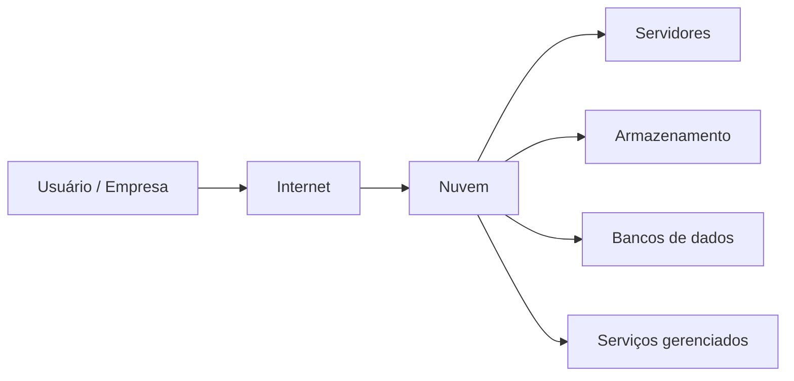

---

## 19. On-premise x Cloud

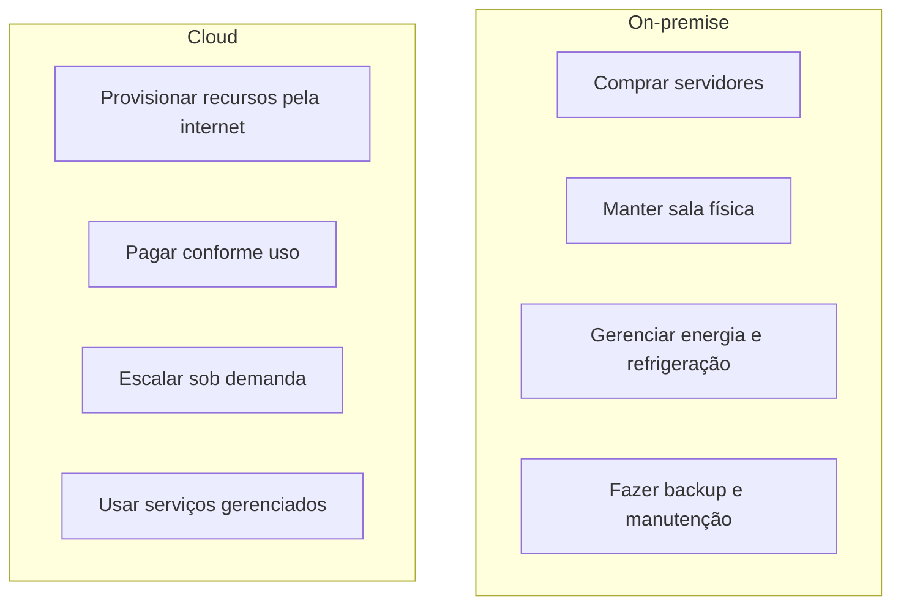

| Modelo | Característica |
|---|---|
| On-premise | Infraestrutura própria, maior responsabilidade operacional. |
| Cloud | Recursos sob demanda, elasticidade e pagamento pelo uso. |

---

## 20. IaaS, PaaS e SaaS

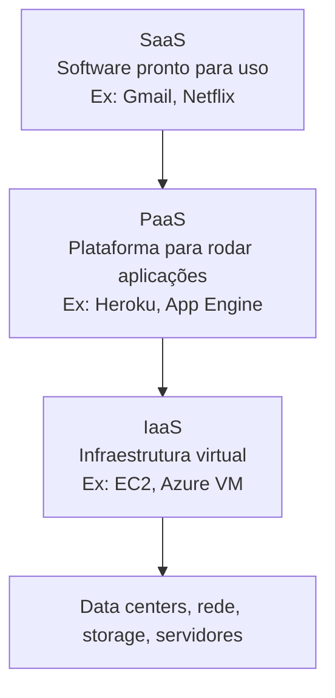

| Modelo | O que entrega | Exemplo |
|---|---|---|
| IaaS | Máquinas virtuais, rede e armazenamento. | Amazon EC2, Azure VM. |
| PaaS | Plataforma pronta para executar aplicações. | Heroku, Google App Engine. |
| SaaS | Software completo acessado pela internet. | Gmail, Netflix, Canva, Notion. |

---

## 21. Vantagens da nuvem

- Custo sob demanda.
- Escalabilidade automática.
- Flexibilidade.
- Segurança robusta quando bem configurada.
- Acesso global.
- Inovação acelerada.

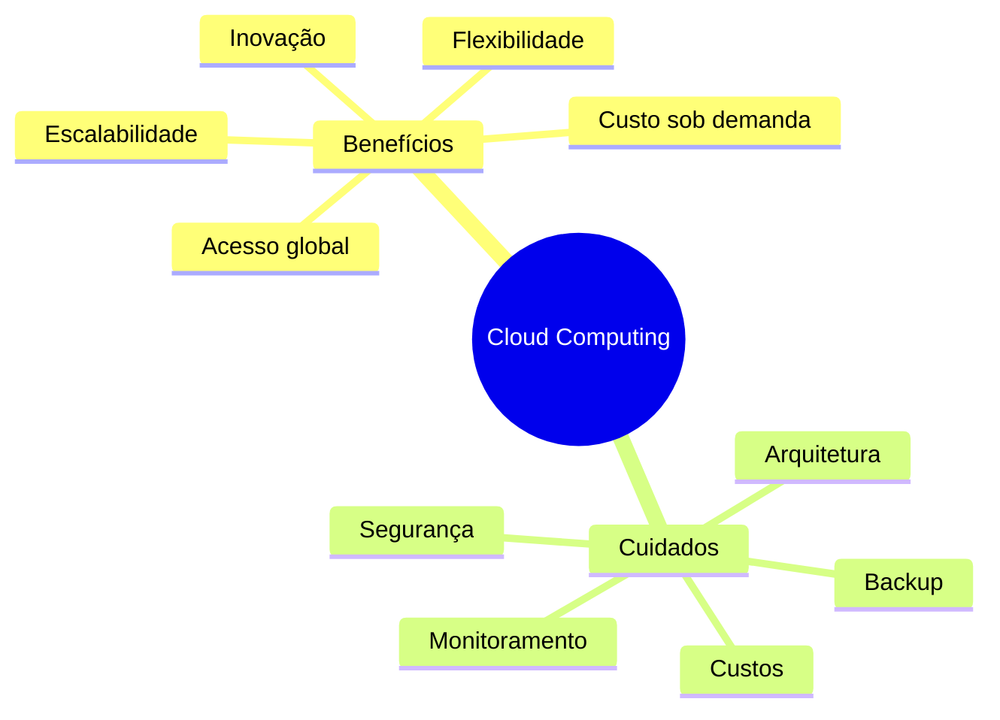

---

## 22. Cuidados com cloud

A nuvem facilita o provisionamento de recursos, mas isso também exige controle.

Cuidados principais:

- boa arquitetura;
- controle de custos;
- monitoramento constante;
- backup;
- criptografia;
- gestão de acessos;
- desativação de recursos não utilizados.

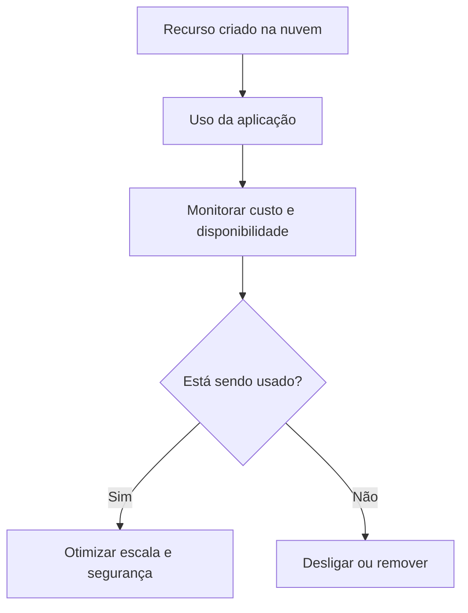

---

## 23. Pontos de prova

- Lista é mutável e usa índice iniciado em zero.
- Tupla é imutável.
- Dicionário usa chave-valor.
- Matriz é lista dentro de lista e usa dois índices.
- Set não permite duplicados.
- Fila é FIFO.
- Pilha é LIFO.
- Hash table permite busca rápida por chave; em Python, `dict` é a estrutura prática.
- Busca linear é `O(n)`.
- Busca binária exige lista ordenada e é `O(log n)`.
- TimSort é o padrão de ordenação do Python.
- Merge Sort é estável e útil para mesclar dados.
- Quick Sort é rápido em média, mas não estável.
- Heap é útil para prioridade.
- API REST conecta clientes e servidores por HTTP.
- Cloud reduz necessidade de infraestrutura própria.
- IaaS entrega infraestrutura; PaaS entrega plataforma; SaaS entrega software pronto.
- Em cloud, monitoramento evita surpresa de custo.

---

## 24. Flashcards

| Pergunta | Resposta |
|---|---|
| Qual índice do primeiro item de uma lista Python? | `0`. |
| Lista é mutável? | Sim. |
| Tupla é mutável? | Não. |
| Dicionário armazena dados como? | Pares chave-valor. |
| Matriz usa quantos índices? | Dois: linha e coluna. |
| Set aceita duplicados? | Não. |
| FIFO é qual estrutura? | Fila. |
| LIFO é qual estrutura? | Pilha. |
| Qual estrutura Python representa hash table? | `dict`. |
| Busca binária precisa de lista ordenada? | Sim. |
| Algoritmo padrão de ordenação do Python? | TimSort. |
| Modelo cloud de máquina virtual? | IaaS. |
| Modelo cloud de plataforma pronta para app? | PaaS. |
| Modelo cloud de software pronto? | SaaS. |

---

## 25. Checklist final

- [ ] Sei escolher entre lista, tupla, dicionário e set.
- [ ] Sei explicar FIFO e LIFO.
- [ ] Sei explicar hash table e sua relação com `dict`.
- [ ] Sei diferenciar busca linear e busca binária.
- [ ] Sei comparar TimSort, Merge Sort, Quick Sort e Heap Sort.
- [ ] Sei explicar o que é uma API REST.
- [ ] Sei diferenciar IaaS, PaaS e SaaS.
- [ ] Sei citar vantagens e cuidados da cloud computing.
