# Aula 03 - Engenharia de Software, APIs, Segurança e Inteligência Artificial

## 1. Objetivos da aula

Ao final desta aula, você deve conseguir:

- Explicar a importância da Engenharia de Software.
- Entender o ciclo de vida do software.
- Comparar modelos cascata, incremental e iterativo.
- Explicar valores do Manifesto Ágil.
- Diferenciar Scrum e Kanban.
- Entender papéis de Scrum Master, Product Owner e time de desenvolvimento.
- Comparar arquiteturas em camadas, MVC, SOA e microsserviços.
- Entender fundamentos de segurança em APIs.
- Diferenciar autenticação e autorização.
- Explicar criptografia, JWT, OAuth 2.0, HTTPS/TLS, rate limiting, SQL Injection, XSS e CORS.
- Compreender o conceito básico de IA supervisionada.

---

## 2. Mapa mental da aula

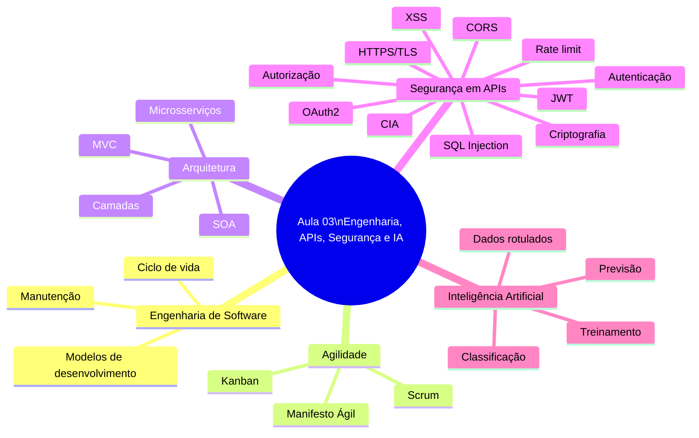

---

## 3. Engenharia de Software

Engenharia de Software aplica princípios científicos e boas práticas de engenharia ao desenvolvimento de software.

Objetivo: construir sistemas mais:

- confiáveis;
- sustentáveis;
- manuteníveis;
- previsíveis;
- alinhados às necessidades reais dos usuários.

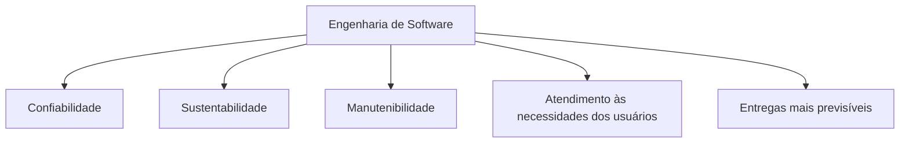

---

## 4. Ciclo de vida do software

O ciclo de vida do software é contínuo. Mesmo após a entrega, o sistema precisa de manutenção, correção, evolução e adaptação.

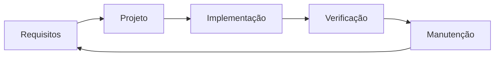

### Ideia central

Software não termina na entrega. Ele continua vivo enquanto precisa ser operado, corrigido e evoluído.

---

## 5. Impactos positivos da Engenharia de Software

| Impacto | Significado |
|---|---|
| Mais estabilidade | Menos falhas em produção. |
| Menos retrabalho | Menos correções repetidas e improvisadas. |
| Entregas previsíveis | Melhor planejamento e acompanhamento. |
| Maior vida útil | Sistemas evoluem com menos custo e risco. |

---

## 6. Modelos de desenvolvimento

### Modelo cascata

Modelo linear e sequencial. Cada fase depende da conclusão da anterior.

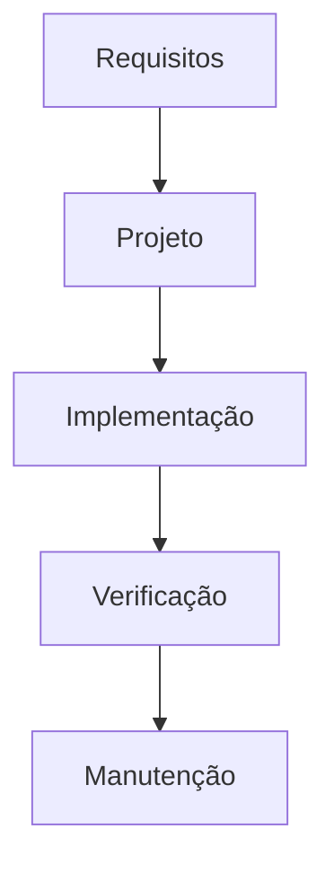

Características:

- requisitos definidos antes do desenvolvimento;
- pouca flexibilidade;
- útil em contextos regulados ou escopo muito estável;
- mudanças tardias tendem a ser caras.

### Modelo incremental e iterativo

Entrega o sistema em partes utilizáveis e permite feedback contínuo.

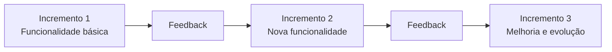

Características:

- entregas menores;
- aprendizado contínuo;
- adaptação a mudanças;
- redução de risco.

---

## 7. Manifesto Ágil

O Manifesto Ágil prioriza:

1. Indivíduos e interações mais que processos e ferramentas.
2. Software em funcionamento mais que documentação abrangente.
3. Colaboração com o cliente mais que negociação de contratos.
4. Responder a mudanças mais que seguir um plano.

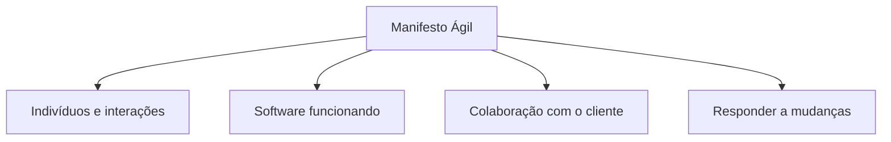

### Atenção

Ágil não significa fazer qualquer coisa rapidamente. A ideia é entregar valor continuamente, com adaptação e feedback.

---

## 8. Scrum

Scrum é um framework ágil baseado em ciclos chamados sprints.

### Papéis principais

| Papel | Responsabilidade |
|---|---|
| Scrum Master | Facilita o processo, remove impedimentos e protege os princípios do Scrum. |
| Product Owner | Gerencia o backlog, prioriza valor e conecta negócio e tecnologia. |
| Time de Desenvolvimento | Equipe multidisciplinar que entrega software funcionando. |

### Artefatos

| Artefato | Significado |
|---|---|
| Product Backlog | Lista de necessidades, melhorias e funcionalidades do produto. |
| Sprint Backlog | Itens escolhidos para a sprint. |
| Incremento | Entrega feita ao final da sprint. |

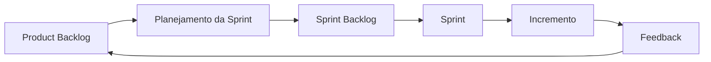

---

## 9. Kanban

Kanban trabalha com fluxo contínuo. Visualiza o trabalho, limita trabalho em progresso e busca melhoria contínua.

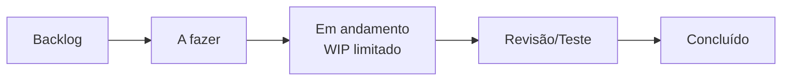

| Scrum | Kanban |
|---|---|
| Trabalha com sprints. | Trabalha com fluxo contínuo. |
| Papéis e eventos definidos. | Mais adaptável a processos existentes. |
| Entrega por ciclos. | Entrega conforme itens são concluídos. |

---

## 10. Ciclo de vida moderno do software

O ciclo moderno vai além do desenvolvimento: inclui operação, manutenção e evolução contínua.

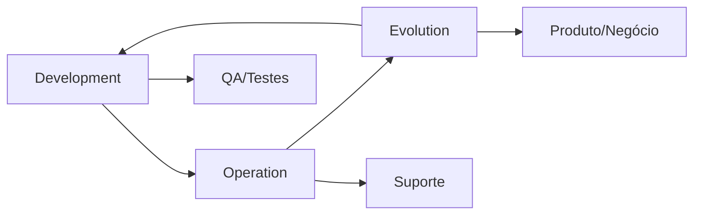

Equipes envolvidas:

- desenvolvimento;
- QA;
- produto;
- suporte;
- operações;
- segurança.

---

## 11. Arquiteturas de software

### Arquitetura em camadas

Separa responsabilidades por nível.

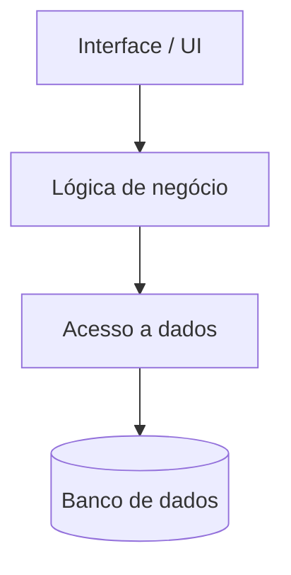

Vantagens:

- fácil entendimento;
- separação de responsabilidades;
- comum em sistemas corporativos;
- facilita manutenção e testes.

### MVC

MVC separa a aplicação em Model, View e Controller.

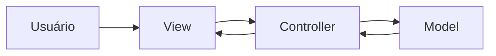

| Camada | Função |
|---|---|
| Model | Dados e regras de negócio. |
| View | Apresentação ao usuário. |
| Controller | Recebe requisições e coordena fluxo. |

### SOA

Arquitetura orientada a serviços usa componentes independentes que se comunicam por mensagens.

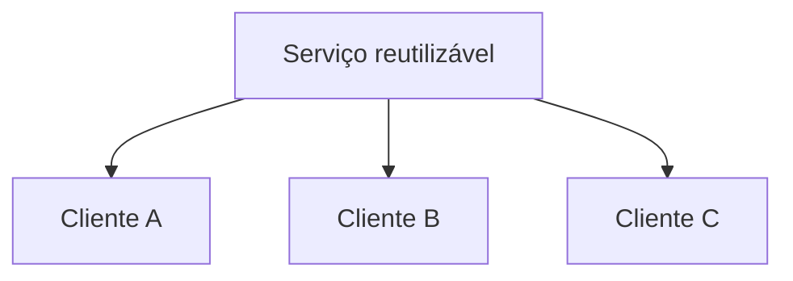

### Microsserviços

Divide funcionalidades em serviços pequenos e autônomos.

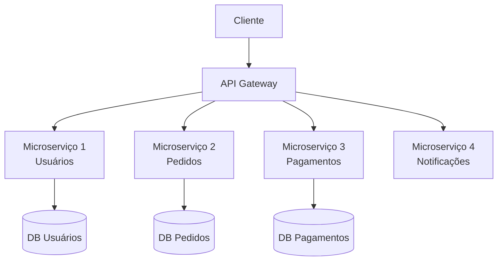

Vantagens:

- escalabilidade independente;
- autonomia de deploy;
- manutenção por serviço;
- boa aderência a ambientes cloud-native.

Cuidados:

- observabilidade;
- governança;
- comunicação entre serviços;
- segurança;
- complexidade operacional.

---

## 12. Segurança digital em APIs

Segurança em APIs protege dados e sistemas contra acesso indevido, vazamento, alteração e indisponibilidade.

### Tríade CIA

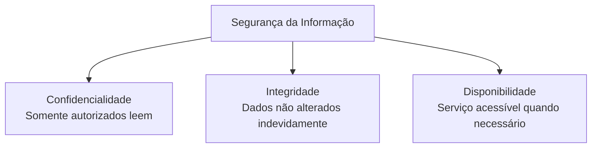

---

## 13. Autenticação x autorização

| Conceito | Pergunta que responde | Exemplo |
|---|---|---|
| Autenticação | Quem é você? | Login com usuário e senha. |
| Autorização | O que você pode fazer? | Permissão para aprovar pagamento. |

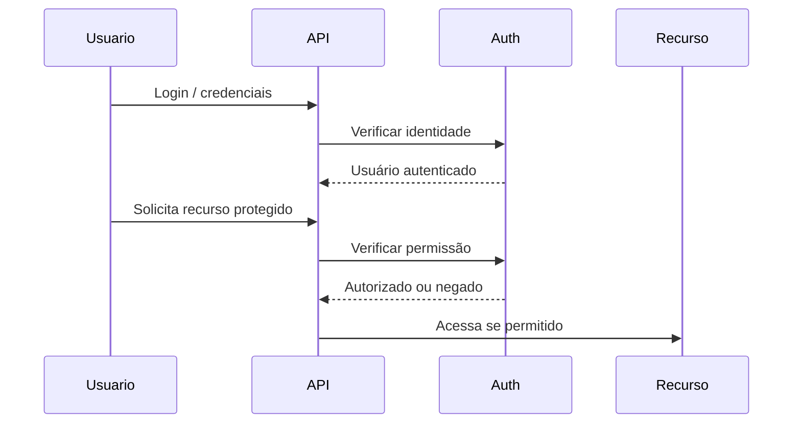

### Exemplo de prova

Um gerente e um operador podem estar autenticados, mas ter autorizações diferentes.

---

## 14. Senhas e armazenamento seguro

Boas práticas:

- usar senhas únicas e fortes;
- não reutilizar senha;
- não usar dados pessoais óbvios;
- nunca salvar senha em texto puro;
- usar hash e salt;
- usar cofres de senha.

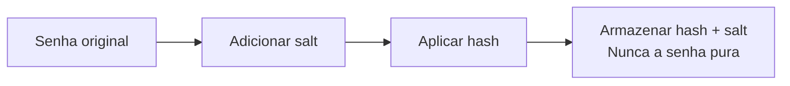

---

## 15. Criptografia

Criptografia codifica dados para torná-los ilegíveis a quem não possui a chave correta.

Objetivos:

- confidencialidade;
- integridade;
- autenticidade;
- não repúdio.

### Simétrica x assimétrica

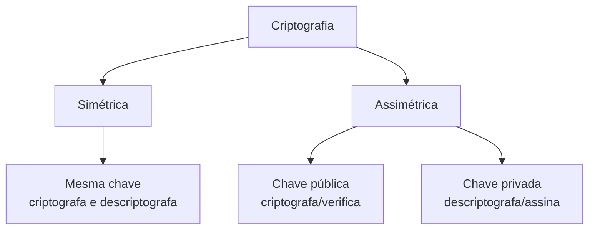

Exemplos de uso:

- HTTPS;
- certificados digitais;
- assinaturas eletrônicas;
- mensageria com criptografia ponta a ponta;
- tokens como JWT.

---

## 16. JWT - JSON Web Token

JWT é usado em autenticação stateless em APIs. Ele possui três partes:

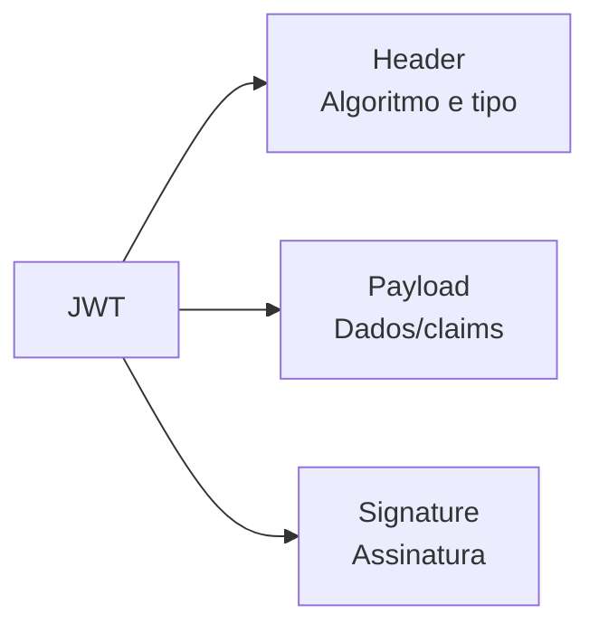

Fluxo típico:

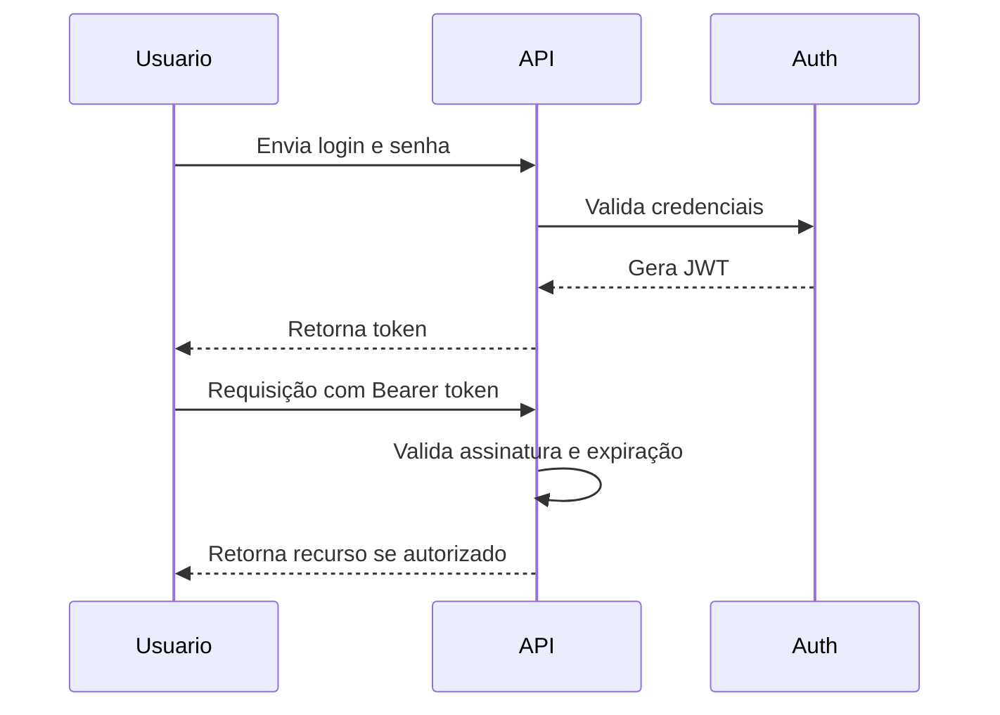

### Atenção

JWT não deve durar para sempre. Tokens precisam de prazo de validade e estratégia de revogação.

---

## 17. OAuth 2.0

OAuth 2.0 permite delegação de acesso sem expor credenciais diretamente ao serviço consumidor.

Exemplo: autorizar um aplicativo a acessar parte da sua conta com escopos limitados.

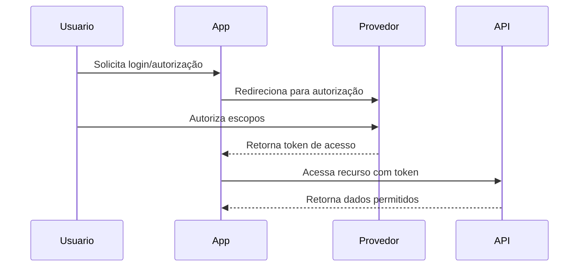

---

## 18. HTTPS e TLS

HTTPS usa TLS para criptografar a comunicação entre cliente e servidor.

```mermaid
flowchart LR
    Cliente[Cliente] -->|HTTPS/TLS criptografado| Servidor[Servidor]
    Servidor --> Cert[Certificado digital]
    Cert --> Identidade[Validação da identidade do servidor]
```

Sem HTTPS, dados podem ser interceptados ou manipulados no caminho.

---

## 19. Rate limiting

Rate limiting limita a quantidade de requisições em um intervalo de tempo.

Objetivos:

- evitar abuso;
- reduzir brute force;
- mitigar DoS;
- preservar disponibilidade.

```mermaid
flowchart TD
    Req[Requisição recebida] --> Conta[Contar requisições por cliente]
    Conta --> Limite{Dentro do limite?}
    Limite -->|Sim| Processa[Processar requisição]
    Limite -->|Não| Bloqueia[Retornar erro 429\nToo Many Requests]
```

---

## 20. SQL Injection

SQL Injection ocorre quando entrada do usuário é concatenada indevidamente em comandos SQL.

### Errado

```python
sql = "SELECT * FROM usuarios WHERE nome = '" + nome + "'"
```

### Correto

```python
cursor.execute(
    "SELECT * FROM usuarios WHERE nome = ?",
    (nome,)
)
```

```mermaid
flowchart LR
    Entrada[Entrada do usuário] --> Validacao[Validar e parametrizar]
    Validacao --> Query[Query preparada]
    Query --> Banco[(Banco de dados)]
```

Ponto de prova: **nunca concatenar entrada do usuário em SQL**.

---

## 21. XSS

XSS ocorre quando scripts maliciosos são injetados em respostas web.

Mitigações:

- escapar caracteres especiais;
- validar entradas;
- usar Content Security Policy quando aplicável;
- não retornar HTML/JS sem controle;
- configurar CORS corretamente.

```mermaid
flowchart TD
    Entrada[Entrada do usuário] --> Sanitizar[Sanitizar / escapar]
    Sanitizar --> Resposta[Resposta segura]
    Entrada -->|Sem tratamento| Script[Script malicioso]
    Script --> Risco[Execução indevida no navegador]
```

---

## 22. CORS

CORS controla quais origens podem acessar recursos de uma API a partir do navegador.

```mermaid
sequenceDiagram
    participant Browser
    participant API

    Browser->>API: Requisição de origem externa
    API-->>Browser: Cabeçalhos CORS
    Browser->>Browser: Verifica se a origem é permitida
    Browser-->>API: Continua ou bloqueia a chamada
```

Ponto de prova: CORS é uma política aplicada pelo navegador, controlada por cabeçalhos HTTP retornados pela API.

---

## 23. Logs e rastreabilidade

Logs ajudam a identificar falhas, acessos indevidos e comportamento suspeito.

Devem registrar, quando apropriado:

- IP;
- endpoint;
- timestamp;
- usuário ou identificador técnico;
- status da resposta.

Cuidados:

- não registrar senhas;
- não registrar tokens completos;
- não registrar dados sensíveis diretamente;
- proteger acesso aos logs.

---

## 24. Expiração e revogação de tokens

Tokens devem ter prazo de validade. Em logout, vazamento ou violação, o token precisa ser revogado.

```mermaid
stateDiagram-v2
    [*] --> Emitido
    Emitido --> Valido
    Valido --> Expirado: tempo de vida acabou
    Valido --> Revogado: logout ou incidente
    Expirado --> [*]
    Revogado --> [*]
```

Estratégias:

- tempo de expiração curto;
- refresh token controlado;
- blacklist para tokens revogados;
- rotação de tokens;
- monitoramento.

---

## 25. Boas práticas de segurança em APIs

```mermaid
mindmap
  root((API Segura))
    HTTPS
    Autenticação
    Autorização
    Validação de entrada
    Rate limit
    Logs
    Monitoramento
    Expiração de tokens
    Revogação
    CORS controlado
```

Checklist:

- usar HTTPS;
- proteger endpoints;
- autenticar usuários;
- autorizar ações;
- limitar requisições;
- validar todas as entradas;
- proteger contra SQL Injection;
- mitigar XSS;
- configurar CORS com origens confiáveis;
- monitorar logs;
- expirar e revogar tokens.

---

## 26. Inteligência Artificial

A aula apresenta IA como modelo matemático capaz de aprender padrões a partir de dados. IA não adivinha o futuro: ela calcula com base em padrões do passado.

Técnicas associadas:

- Machine Learning;
- sistemas especialistas;
- visão computacional;
- processamento de linguagem natural;
- IA simbólica.

---

## 27. IA supervisionada

Na IA supervisionada, o modelo aprende com dados rotulados, ou seja, dados de entrada acompanhados da resposta esperada.

Exemplo do projeto:

- entradas: nota 1, nota 2 e frequência;
- saída: aprovado ou reprovado;
- tipo: classificação binária;
- ferramenta: scikit-learn;
- algoritmo: regressão logística.

```mermaid
flowchart LR
    Dados[Dados históricos rotulados\nnota1, nota2, frequência, resultado] --> Treino[Treinamento do modelo]
    Treino --> Modelo[Modelo treinado]
    Novos[Novos dados\nnota1, nota2, frequência] --> Modelo
    Modelo --> Predicao[Previsão\naprovado ou reprovado]
```

---

## 28. Pontos de prova

- Engenharia de Software busca confiabilidade, sustentabilidade e manutenibilidade.
- Ciclo de vida do software inclui requisitos, projeto, implementação, verificação e manutenção.
- Modelo cascata é linear e pouco flexível.
- Modelo incremental entrega partes utilizáveis e permite feedback.
- Manifesto Ágil prioriza pessoas, software funcionando, colaboração e adaptação.
- Scrum trabalha com sprints; Kanban trabalha com fluxo contínuo.
- Scrum Master facilita; Product Owner prioriza valor; time entrega software.
- Arquitetura em camadas separa responsabilidades.
- SOA usa serviços reutilizáveis; microsserviços usam serviços pequenos e autônomos.
- Segurança em APIs envolve confidencialidade, integridade e disponibilidade.
- Autenticação verifica identidade; autorização define permissões.
- Senha não deve ser armazenada em texto puro.
- Hash com salt protege senhas armazenadas.
- HTTPS usa TLS para proteger comunicação.
- JWT tem header, payload e signature.
- OAuth 2.0 permite delegação de acesso com escopos.
- Rate limit reduz abuso e ataques.
- SQL Injection é mitigado com queries preparadas.
- XSS é mitigado com escape, validação e políticas de segurança.
- CORS controla chamadas cross-origin no navegador.
- Tokens devem expirar e podem ser revogados.
- IA supervisionada aprende com dados rotulados.

---

## 29. Flashcards

| Pergunta | Resposta |
|---|---|
| O que Engenharia de Software busca? | Software confiável, sustentável, manutenível e útil ao usuário. |
| Qual problema do modelo cascata? | Pouca flexibilidade para mudanças. |
| Qual vantagem do incremental? | Entrega progressiva e feedback contínuo. |
| Scrum trabalha com quê? | Sprints. |
| Kanban trabalha com quê? | Fluxo contínuo. |
| Quem prioriza o backlog? | Product Owner. |
| Quem remove impedimentos no Scrum? | Scrum Master. |
| O que é autenticação? | Verificar identidade. |
| O que é autorização? | Definir permissões. |
| Quais são os pilares CIA? | Confidencialidade, integridade e disponibilidade. |
| O que é JWT? | Token JSON assinado usado em autenticação stateless. |
| Para que serve HTTPS? | Criptografar comunicação com TLS. |
| Como evitar SQL Injection? | Usando queries preparadas/parametrizadas. |
| O que CORS controla? | Quais origens podem chamar uma API pelo navegador. |
| O que IA supervisionada usa? | Dados rotulados. |

---

## 30. Checklist final

- [ ] Sei explicar Engenharia de Software e seus benefícios.
- [ ] Sei diferenciar cascata, incremental e iterativo.
- [ ] Sei listar os quatro valores do Manifesto Ágil.
- [ ] Sei diferenciar Scrum e Kanban.
- [ ] Sei explicar papéis e artefatos do Scrum.
- [ ] Sei desenhar arquitetura em camadas, SOA e microsserviços.
- [ ] Sei diferenciar autenticação e autorização.
- [ ] Sei explicar criptografia, JWT, OAuth 2.0, HTTPS/TLS e rate limiting.
- [ ] Sei citar formas de mitigar SQL Injection, XSS e problemas de CORS.
- [ ] Sei explicar expiração e revogação de tokens.
- [ ] Sei explicar IA supervisionada em nível introdutório.
