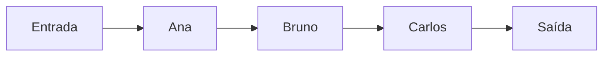
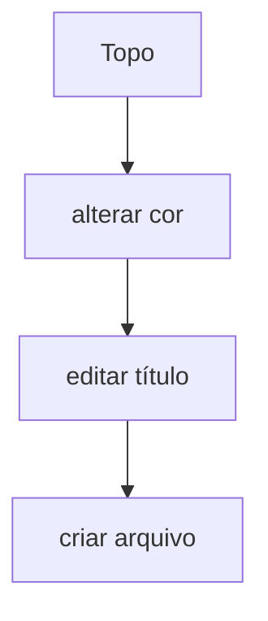
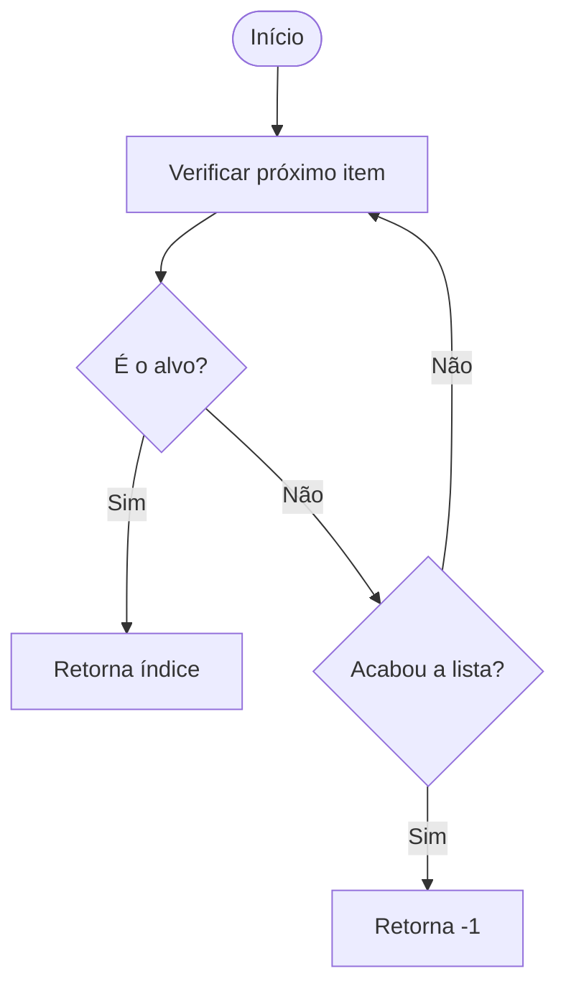
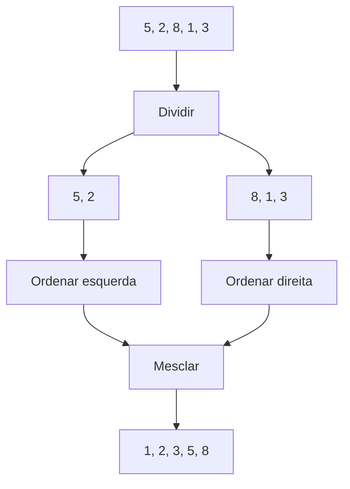
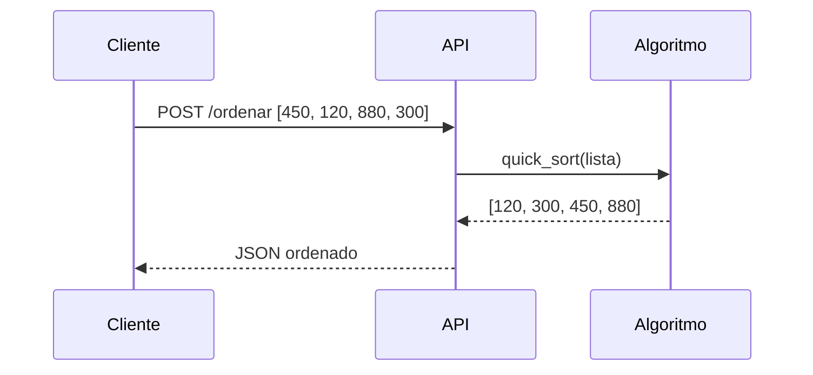
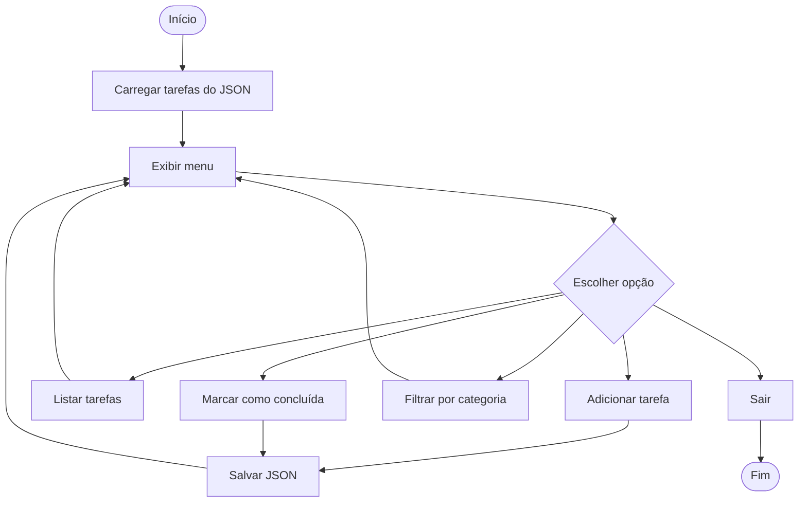

# Exercícios Python - Aula 02 e Projeto Integrador

Este arquivo consolida os exercícios explicados nos materiais complementares e transforma cada um em material de revisão prático.

## 1. Lista de atendimentos

### Objetivo

Criar uma lista com nomes de clientes em ordem de chegada e verificar se um nome está presente.

```python
clientes = ["Ana", "Bruno", "Carlos", "Diana"]

nome = "Bruno"

if nome in clientes:
    print(f"{nome} está na lista de atendimento.")
else:
    print(f"{nome} não foi encontrado.")
```

### Conceito cobrado

Lista é uma estrutura linear. A verificação com `in` faz uma busca simples.

---

## 2. Fila com `deque`

### Objetivo

Simular atendimento em ordem de chegada usando FIFO.

```python
from collections import deque

fila = deque()
fila.append("Ana")
fila.append("Bruno")
fila.append("Carlos")

while fila:
    cliente = fila.popleft()
    print(f"Atendendo: {cliente}")
```



### Conceito cobrado

Fila é FIFO: primeiro a entrar, primeiro a sair.

---

## 3. Pilha de ações - Undo

### Objetivo

Simular desfazer ações com LIFO.

```python
acoes = []

acoes.append("criar arquivo")
acoes.append("editar título")
acoes.append("alterar cor")

ultima_acao = acoes.pop()
print(f"Desfazendo: {ultima_acao}")
```



### Conceito cobrado

Pilha é LIFO: último a entrar, primeiro a sair.

---

## 4. Dicionário de atendentes

### Objetivo

Mapear atendente para quantidade de atendimentos.

```python
atendimentos = {
    "Ana": 12,
    "Bruno": 8,
    "Carlos": 15
}

print(atendimentos["Ana"])
```

### Conceito cobrado

Dicionários mapeiam chave para valor e permitem busca rápida pela chave.

---

## 5. Busca linear

### Objetivo

Percorrer uma lista até encontrar o valor desejado.

```python
def busca_linear(lista, alvo):
    for indice, valor in enumerate(lista):
        if valor == alvo:
            return indice
    return -1

nomes = ["Ana", "Bruno", "Carlos"]
print(busca_linear(nomes, "Carlos"))
```



### Complexidade

`O(n)`, pois no pior caso percorre todos os itens.

---

## 6. Busca binária

### Objetivo

Encontrar um item em uma lista ordenada dividindo a busca pela metade.

```python
def busca_binaria(lista, alvo):
    inicio = 0
    fim = len(lista) - 1

    while inicio <= fim:
        meio = (inicio + fim) // 2

        if lista[meio] == alvo:
            return meio
        elif lista[meio] < alvo:
            inicio = meio + 1
        else:
            fim = meio - 1

    return -1

numeros = [1, 3, 5, 7, 9, 11]
print(busca_binaria(numeros, 7))
```

### Complexidade

`O(log n)`, mas exige lista ordenada.

---

## 7. Merge Sort

### Objetivo

Ordenar usando divisão e mesclagem.

```python
def merge_sort(lista):
    if len(lista) <= 1:
        return lista

    meio = len(lista) // 2
    esquerda = merge_sort(lista[:meio])
    direita = merge_sort(lista[meio:])

    return merge(esquerda, direita)


def merge(esquerda, direita):
    resultado = []
    i = 0
    j = 0

    while i < len(esquerda) and j < len(direita):
        if esquerda[i] <= direita[j]:
            resultado.append(esquerda[i])
            i += 1
        else:
            resultado.append(direita[j])
            j += 1

    resultado.extend(esquerda[i:])
    resultado.extend(direita[j:])
    return resultado

print(merge_sort([5, 2, 8, 1, 3]))
```



---

## 8. Quick Sort como ideia de API

### Objetivo

Ordenar valores e imaginar que o algoritmo pode ser exposto por uma API.

```python
def quick_sort(lista):
    if len(lista) <= 1:
        return lista

    pivo = lista[0]
    menores = [x for x in lista[1:] if x <= pivo]
    maiores = [x for x in lista[1:] if x > pivo]

    return quick_sort(menores) + [pivo] + quick_sort(maiores)

print(quick_sort([450, 120, 880, 300]))
```

### Fluxo REST conceitual



---

## 9. Projeto: Organizador de tarefas

### Objetivo

Criar um sistema simples para organizar tarefas por categoria, com persistência em JSON.

### Estrutura de dados sugerida

```python
tarefas = [
    {
        "titulo": "Estudar Python",
        "categoria": "Estudo",
        "concluida": False
    }
]
```

### Funções principais

- carregar tarefas de arquivo JSON;
- salvar tarefas em arquivo JSON;
- adicionar tarefa;
- listar tarefas;
- marcar como concluída;
- filtrar por categoria;
- listar pendentes.

### Diagrama do sistema



### Código base

```python
import json
from pathlib import Path

ARQUIVO = Path("tarefas.json")


def carregar():
    try:
        with ARQUIVO.open("r", encoding="utf-8") as f:
            return json.load(f)
    except FileNotFoundError:
        return []


def salvar(tarefas):
    with ARQUIVO.open("w", encoding="utf-8") as f:
        json.dump(tarefas, f, ensure_ascii=False, indent=2)


def adicionar(tarefas):
    titulo = input("Título: ").strip()
    categoria = input("Categoria: ").strip()

    if not titulo or not categoria:
        print("Título e categoria são obrigatórios.")
        return

    tarefas.append({
        "titulo": titulo,
        "categoria": categoria,
        "concluida": False
    })
    salvar(tarefas)
    print("Tarefa adicionada.")


def listar(tarefas):
    if not tarefas:
        print("Nenhuma tarefa cadastrada.")
        return

    for i, tarefa in enumerate(tarefas, start=1):
        status = "OK" if tarefa["concluida"] else "PENDENTE"
        print(f"{i}. [{status}] {tarefa['titulo']} - {tarefa['categoria']}")


def concluir(tarefas):
    listar(tarefas)
    numero = int(input("Número da tarefa: "))

    if 1 <= numero <= len(tarefas):
        tarefas[numero - 1]["concluida"] = True
        salvar(tarefas)
        print("Tarefa concluída.")
    else:
        print("Número inválido.")


def filtrar_categoria(tarefas):
    categoria = input("Categoria: ").strip().lower()
    filtradas = [t for t in tarefas if t["categoria"].lower() == categoria]
    listar(filtradas)


def main():
    tarefas = carregar()

    while True:
        print("\n1 - Adicionar")
        print("2 - Listar")
        print("3 - Concluir")
        print("4 - Filtrar por categoria")
        print("0 - Sair")

        opcao = input("Escolha: ").strip()

        if opcao == "1":
            adicionar(tarefas)
        elif opcao == "2":
            listar(tarefas)
        elif opcao == "3":
            concluir(tarefas)
        elif opcao == "4":
            filtrar_categoria(tarefas)
        elif opcao == "0":
            break
        else:
            print("Opção inválida.")


if __name__ == "__main__":
    main()
```

---

## 10. Revisão rápida dos exercícios

| Exercício | Estrutura/algoritmo principal | Ideia de prova |
|---|---|---|
| Lista de atendimentos | Lista | Busca simples com `in`. |
| Fila com deque | Fila FIFO | Ordem de chegada. |
| Pilha de ações | Pilha LIFO | Desfazer última ação. |
| Dicionário de atendentes | Dict/hash | Chave-valor e busca rápida. |
| Busca linear | Algoritmo `O(n)` | Percorre item a item. |
| Busca binária | Algoritmo `O(log n)` | Exige ordenação. |
| Merge Sort | Ordenação estável | Divide e mescla. |
| Quick Sort | Ordenação rápida média | Usa pivô. |
| Organizador de tarefas | Projeto integrador | Lista + dict + JSON + menu. |
