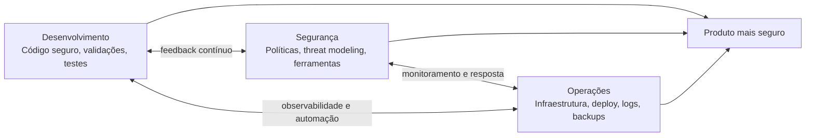
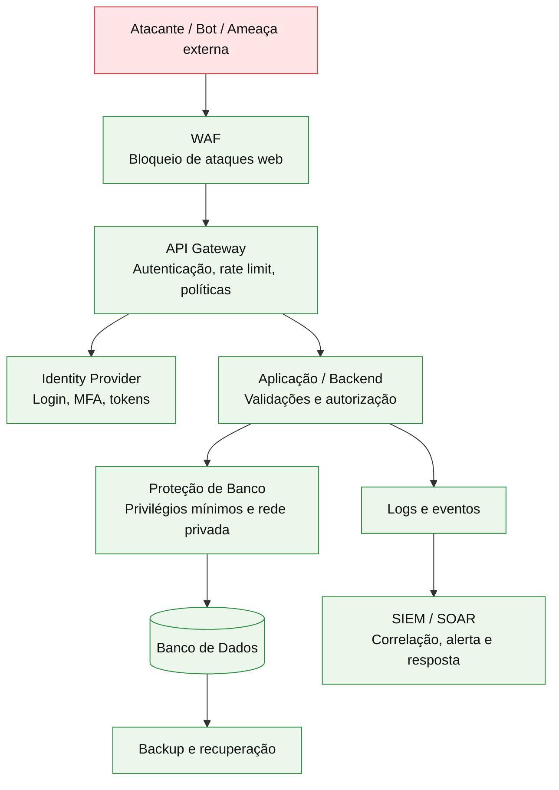

# Capítulo 1 - Introdução ao Desenvolvimento Seguro

## Objetivo

Entender por que desenvolvimento seguro não é responsabilidade isolada de uma pessoa ou de uma única equipe. O capítulo apresenta a disciplina, a importância de tratar segurança desde o início do ciclo de desenvolvimento e o conceito de **defesa em profundidade**.

## Ideia central para prova

Desenvolvimento seguro é uma prática compartilhada entre **desenvolvimento, segurança e operações**. Uma aplicação não está segura apenas porque o código está bem escrito, nem apenas porque a infraestrutura está protegida. A segurança depende do conjunto: código, dependências, banco de dados, rede, identidade, monitoração, processos e pessoas.

## Conceitos essenciais

### Desenvolvimento seguro

É o conjunto de práticas que busca reduzir vulnerabilidades durante todo o ciclo de vida do software. O foco não é apenas corrigir falhas depois que o sistema está em produção, mas prevenir brechas desde requisitos, arquitetura, implementação, testes, deploy, operação e monitoramento.

O maior risco é presumir que o código, o pipeline, o ambiente de publicação e os componentes usados estão livres de vulnerabilidades. Sistemas modernos têm muitas dependências, bibliotecas, serviços em nuvem, APIs, integrações e permissões. Por isso, a segurança precisa ser validada continuamente.

### DevSecOps

DevSecOps representa a integração de segurança ao fluxo de desenvolvimento e operação. A segurança deixa de ser uma etapa final e passa a fazer parte do processo diário.

### O problema do esforço isolado

Se o desenvolvedor usa frameworks atualizados, valida entradas e evita falhas conhecidas, mas o banco de dados fica exposto na internet com senha fraca, o sistema continua vulnerável. Da mesma forma, se o banco está isolado, mas o código usa uma versão vulnerável de framework ou expõe segredo no repositório, o risco permanece.

A conclusão é simples: **segurança precisa de colaboração**.

## Defesa em profundidade

Defesa em profundidade é uma estratégia que usa múltiplas camadas de proteção. A ideia é semelhante a sistemas críticos com redundância: se uma barreira falhar, outra camada ainda pode impedir ou reduzir o impacto do ataque.

## Camadas comuns de proteção

| Camada | Função |
|---|---|
| Banco de dados | Isolamento de rede, controle de acesso, criptografia, backup. |
| Aplicação/backend | Validação de entrada, autorização, tratamento de erros, logs seguros. |
| API Gateway | Ponto central para autenticação, rate limiting, políticas e roteamento. |
| Identity Provider | Gestão de identidade, login seguro, MFA, emissão e validação de tokens. |
| WAF | Proteção contra ataques comuns em aplicações web. |
| SIEM/SOAR | Detecção, correlação de eventos e automação de resposta a incidentes. |
| Backup | Recuperação em caso de comprometimento, ransomware ou falha operacional. |

## Como aplicar na prática

Em um projeto real, uma boa abordagem é revisar a aplicação sob três visões. Primeiro, o código: dependências, validações, erros, autenticação, autorização e segredos. Segundo, a infraestrutura: rede, firewall, banco, permissões, TLS e exposição pública. Terceiro, a operação: logs, alertas, incidentes, backup, atualização de patches e resposta a anomalias.

## Checklist de revisão

- O código valida entradas vindas de usuário, rede, arquivos e integrações?
- Existem segredos, senhas ou tokens no repositório?
- As dependências estão atualizadas e sem CVEs conhecidas críticas?
- O banco de dados não está exposto publicamente?
- A API exige autenticação e autorização adequadas?
- Existe MFA para contas privilegiadas?
- Logs e eventos são monitorados?
- Há backup e plano de recuperação testado?

## Questões de fixação

1. O que significa DevSecOps?
   - Resposta: colaboração entre desenvolvimento, segurança e operações para incorporar segurança ao ciclo de vida do software.

2. Por que apenas proteger o banco de dados não basta?
   - Resposta: porque vulnerabilidades no código, dependências ou APIs podem expor dados mesmo com o banco isolado.

3. O que é defesa em profundidade?
   - Resposta: uso de múltiplas camadas de proteção para que uma falha isolada não comprometa todo o sistema.

## Erros comuns

- Acreditar que segurança é responsabilidade exclusiva da equipe de segurança.
- Corrigir vulnerabilidades apenas no fim do projeto.
- Não atualizar ferramentas, frameworks e servidores.
- Depender de uma única camada de proteção.
