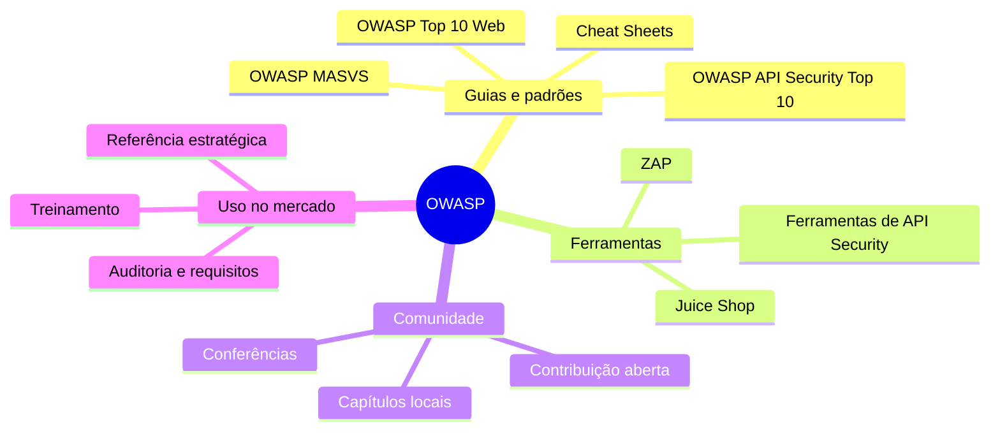
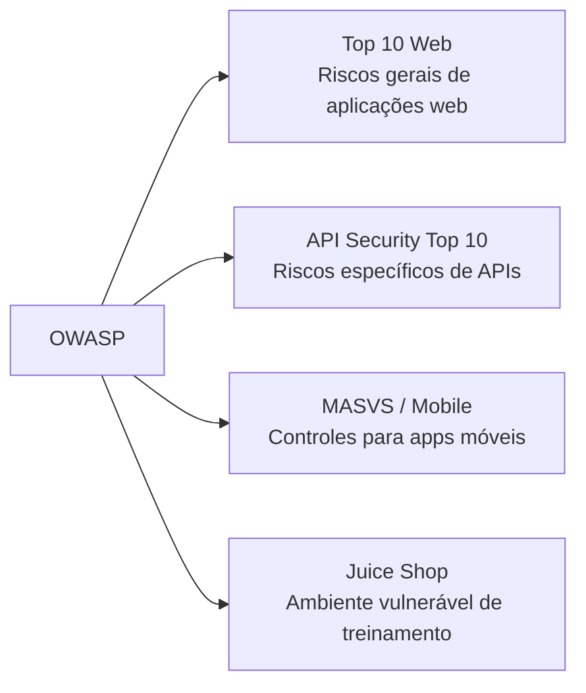

# Capítulo 2 - Projeto OWASP

## Objetivo

Conhecer o OWASP como referência global em segurança de aplicações, entender por que seus guias são usados pelo mercado e identificar os principais projetos citados no material.

## Ideia central para prova

O OWASP é uma organização aberta, comunitária e sem fins lucrativos que fornece padrões, guias, ferramentas e materiais gratuitos para melhorar a segurança de software. Em uma resposta de prova, associe OWASP a **boas práticas abertas**, **comunidade global** e **referência de mercado**.

## O que é OWASP

OWASP significa **Open Worldwide Application Security Project**. É uma comunidade global voltada a ajudar organizações a desenvolver, adquirir, testar e manter aplicações confiáveis. Seus recursos são abertos e gratuitos, o que facilita a adoção por times de desenvolvimento, segurança, arquitetura, QA e gestão.

## Por que o OWASP é importante

O OWASP ajuda a transformar segurança em uma linguagem comum. Quando uma equipe fala em BOLA, Broken Authentication, XSS, SQL Injection, Security Misconfiguration ou MASVS, está usando uma taxonomia compreensível por profissionais de diferentes empresas e países.

Essa padronização facilita:

- justificar decisões técnicas para gestores;
- priorizar vulnerabilidades;
- definir requisitos de segurança;
- treinar desenvolvedores;
- criar checklists de auditoria;
- alinhar times de Dev, Sec e Ops.

## Projetos OWASP citados no curso

| Projeto | Finalidade |
|---|---|
| OWASP Top 10 Web | Lista de riscos críticos para aplicações web. |
| OWASP API Security Top 10 | Lista de riscos críticos específicos de APIs. |
| OWASP MASVS | Padrão de verificação de segurança para aplicativos móveis. |
| OWASP Juice Shop | Aplicação vulnerável usada para treinamento, SAST, DAST e prática. |
| OWASP Cheat Sheets | Guias práticos por tema, como autenticação, senhas, logging, sessões etc. |

## OWASP Top 10 Web x OWASP API Security Top 10

É comum confundir os dois. O OWASP Top 10 Web trata riscos gerais de aplicações web. Já o OWASP API Security Top 10 trata riscos próprios de APIs, como autorização no nível de objeto, autenticação quebrada, autorização no nível de propriedade, consumo irrestrito de recursos e inventário inadequado de APIs.

## OWASP Juice Shop

O OWASP Juice Shop é uma aplicação intencionalmente vulnerável. Ela simula uma loja virtual e contém falhas de segurança para treinamento, demonstrações, CTFs e validação de ferramentas de segurança. No contexto do curso, ele é usado como projeto de exemplo para análise estática, análise de dependências e entendimento de vulnerabilidades reais.

## Como aplicar na prática

Use o OWASP como fonte para criar checklists técnicos. Por exemplo, em uma API REST, use o OWASP API Security Top 10 para revisar autorização, autenticação, rate limiting, configurações e inventário. Em um app mobile, use MASVS para revisar armazenamento, criptografia, autenticação, rede, plataforma, código, resiliência e privacidade.

## Checklist de revisão

- Sei explicar o que é OWASP?
- Sei diferenciar OWASP Top 10 Web, API Security Top 10 e MASVS?
- Consigo citar pelo menos três projetos OWASP?
- Entendo por que OWASP é usado como referência estratégica?
- Sei que os recursos OWASP são abertos e mantidos pela comunidade?

## Questões de fixação

1. Qual é o objetivo do OWASP?
   - Resposta: melhorar a segurança de software por meio de recursos abertos e gratuitos.

2. O OWASP é uma ferramenta paga?
   - Resposta: não. É uma comunidade e organização sem fins lucrativos com recursos abertos.

3. Para que serve o OWASP Juice Shop?
   - Resposta: para treinamento e prática em uma aplicação intencionalmente vulnerável.

## Erros comuns

- Tratar OWASP como um produto comercial.
- Usar o Top 10 Web como se fosse equivalente ao Top 10 de APIs.
- Achar que seguir OWASP elimina todos os riscos. OWASP orienta e prioriza, mas não substitui análise de risco, testes e arquitetura segura.
