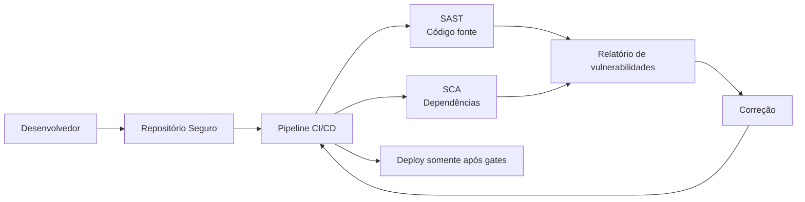
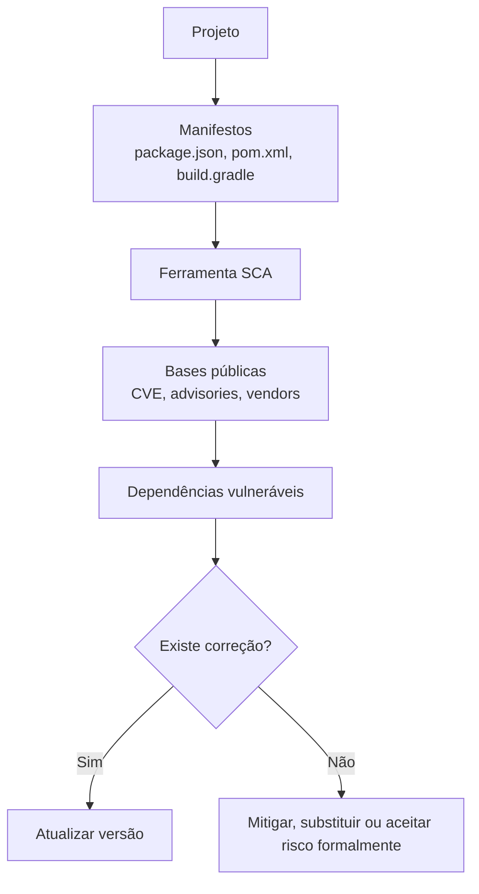
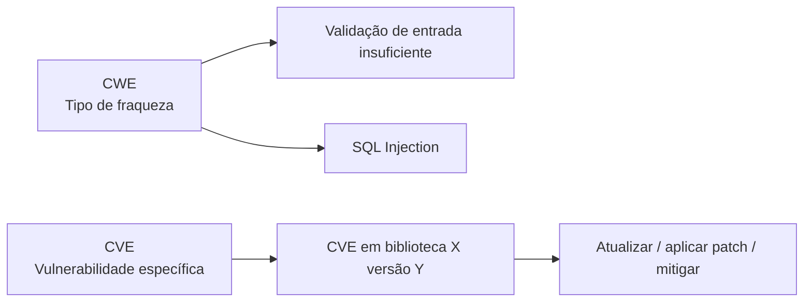

# Capítulo 3 - Tornando o Código Fonte Mais Seguro: Repositório, SAST e SCA

## Objetivo

Entender práticas para proteger o código fonte, com foco em repositório seguro, análise estática de código (**SAST**), análise de composição de software (**SCA**) e uso de bases de vulnerabilidades como **CVE** e **CWE**.

## Ideia central para prova

SAST analisa o código fonte estático em busca de vulnerabilidades no código escrito pela equipe. SCA analisa bibliotecas, dependências e componentes de terceiros em busca de vulnerabilidades conhecidas. Os dois são complementares.

## Segurança do repositório

O repositório é um ativo crítico. Ele contém o código fonte, histórico de commits, configurações, pipelines, scripts, chaves acidentalmente versionadas e documentação técnica. Se o repositório vazar, um atacante pode estudar o sistema, encontrar segredos, descobrir endpoints internos e entender regras de negócio.

Boas práticas:

- usar controle de acesso por menor privilégio;
- exigir MFA para contas de desenvolvedores e administradores;
- revisar visibilidade de repositórios privados;
- manter servidores GitLab/GitHub Enterprise/Azure DevOps atualizados;
- evitar segredos versionados;
- proteger branches principais;
- auditar acessos e alterações;
- manter backup.

## SAST - Static Application Security Testing

SAST é análise estática de segurança. A ferramenta examina o código sem executar a aplicação. Ela procura padrões perigosos, fluxos de dados suspeitos, uso inseguro de APIs, validações ausentes, injeção de SQL, XSS, secrets hardcoded, algoritmos fracos e outros problemas.

### Onde executar SAST

| Local | Vantagem |
|---|---|
| IDE | Feedback imediato ao desenvolvedor. |
| Pull Request | Impede entrada de vulnerabilidades novas. |
| Pipeline CI/CD | Gera gate de qualidade e segurança antes do deploy. |
| Auditoria periódica | Ajuda a revisar código legado. |

### Exemplos de ferramentas

O material cita Snyk, Checkmarx, SonarQube e VeraCode. A escolha depende de orçamento, linguagem, integração com IDE, qualidade das regras, suporte a pipeline e maturidade da empresa.

## SCA - Software Composition Analysis

SCA verifica bibliotecas e componentes de código aberto usados pela aplicação. Em um projeto Node.js, por exemplo, a ferramenta analisa arquivos como `package.json` e `package-lock.json`. Em Java, pode analisar `pom.xml` ou `build.gradle`.

O objetivo é responder:

- Quais bibliotecas usamos?
- Quais versões estão vulneráveis?
- Existe versão corrigida?
- A vulnerabilidade é crítica, alta, média ou baixa?
- A biblioteca ainda é mantida?

## CVE e CWE

### CVE

CVE significa **Common Vulnerabilities and Exposures**. É uma identificação padronizada para vulnerabilidades conhecidas. Um exemplo de formato é `CVE-2025-1234`.

### CWE

CWE significa **Common Weakness Enumeration**. Diferente da CVE, que identifica uma vulnerabilidade específica, a CWE classifica fraquezas de software. Por exemplo: validação insuficiente, exposição de informação sensível, injeção, falha de autenticação.

## Severidade, impacto e explorabilidade

Ferramentas de SAST/SCA classificam achados com atributos úteis para priorização:

| Atributo | Exemplo |
|---|---|
| Severidade | Critical, High, Medium, Low. |
| Tipo | SQL Injection, XSS, CSRF, erro de autenticação. |
| Impacto | Confidencialidade, integridade, disponibilidade. |
| Facilidade de exploração | Fácil, moderada, difícil. |
| Localização | Arquivo, linha, dependência e versão. |
| Recomendação | Atualização, validação, sanitização, troca de algoritmo. |

Uma vulnerabilidade crítica e fácil de explorar deve ser priorizada antes de uma falha baixa e difícil de explorar.

## Exemplo de achado SAST

| Campo | Valor exemplo |
|---|---|
| ID | CVE-2025-1234 |
| Severidade | Alta |
| Tipo | SQL Injection |
| Impacto | Confidencialidade |
| Exploração | Fácil |
| Localização | `/src/Login.java`, linha 10 |
| Recomendação | Validar entrada e usar consulta parametrizada |

## Checklist de revisão

- Repositórios privados estão realmente privados?
- Há MFA para acesso ao Git?
- Existem secrets hardcoded no repositório?
- SAST roda na IDE e no pipeline?
- SCA roda no pipeline?
- Dependências críticas são bloqueadas antes do deploy?
- Existe processo para atualizar bibliotecas vulneráveis?
- Achados têm dono, prazo e rastreabilidade?

## Questões de fixação

1. O que SAST analisa?
   - Resposta: o código fonte estático, sem executar a aplicação.

2. O que SCA analisa?
   - Resposta: bibliotecas e componentes de terceiros usados no projeto.

3. Qual a diferença entre CVE e CWE?
   - Resposta: CVE identifica vulnerabilidades específicas; CWE classifica tipos de fraquezas.

4. Por que repositório seguro é importante?
   - Resposta: porque o código fonte revela arquitetura, regras de negócio, segredos acidentais e potenciais vetores de ataque.

## Erros comuns

- Usar SAST uma única vez, apenas antes da entrega.
- Ignorar vulnerabilidades em dependências porque “não estão no nosso código”.
- Aceitar secrets no repositório.
- Corrigir apenas achados críticos sem criar processo contínuo.
