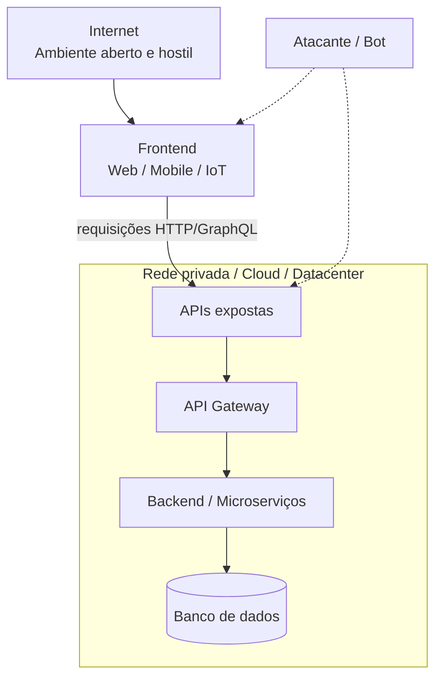
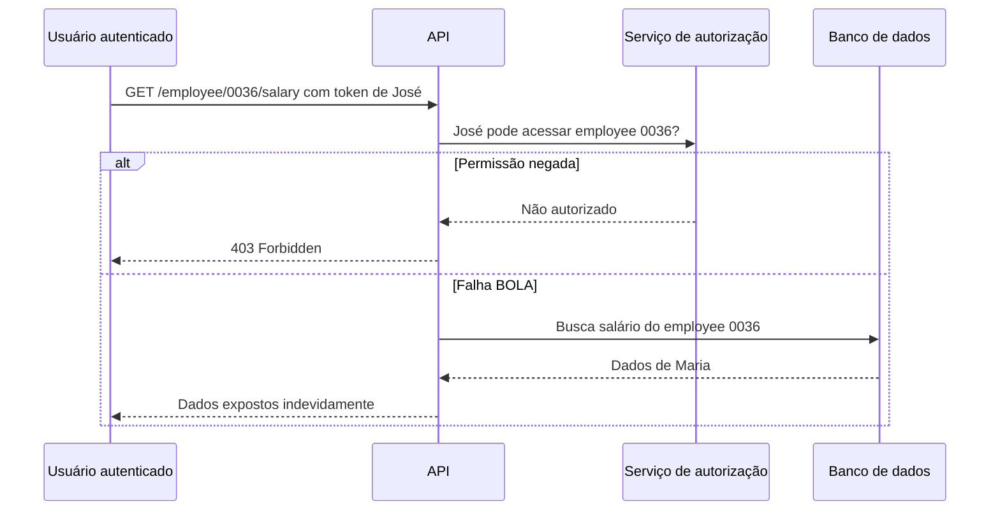
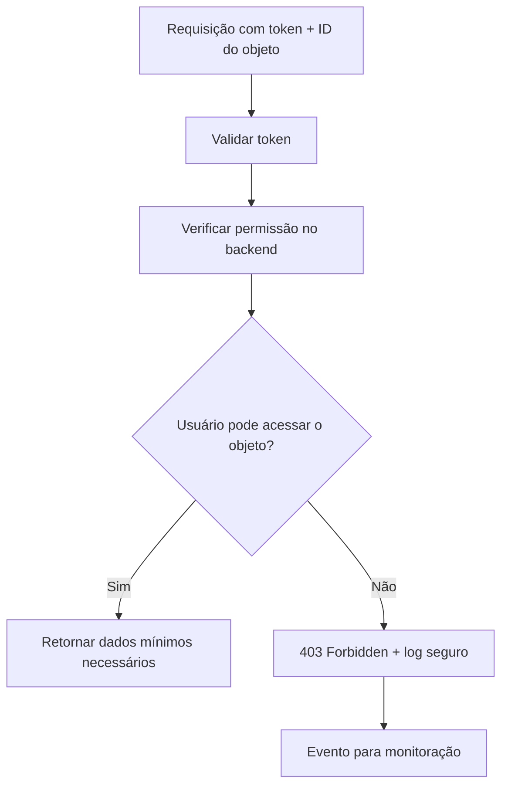

# Capítulo 4 - Ameaças em APIs e Broken Object Level Authorization (BOLA)

## Objetivo

Entender por que APIs são pontos críticos de exposição, conhecer os principais riscos do OWASP API Security Top 10 2023 e aprofundar o risco **API1:2023 - Broken Object Level Authorization (BOLA)**.

## Ideia central para prova

APIs são portas de entrada para dados e transações. O risco BOLA ocorre quando a API aceita um identificador de objeto vindo da requisição e não verifica se o usuário autenticado tem permissão para acessar aquele objeto.

## APIs como superfície de ataque

Aplicações modernas usam APIs em microserviços, arquitetura orientada a eventos, serverless, MVC/monolitos, aplicações mobile, desktop e IoT. Mesmo quando o backend e o banco estão em rede privada, o frontend normalmente se comunica com APIs expostas à internet ou a redes de parceiros.



## Por que proteger APIs

| Motivo | Explicação |
|---|---|
| Dados sensíveis | APIs manipulam dados pessoais, financeiros, médicos e corporativos. |
| Integridade | APIs executam transações e alteram estado do sistema. |
| Prevenção de ataques | APIs são alvo de vazamento, roubo de identidade, DoS e manipulação. |
| Conformidade | LGPD, PCI, GDPR e outras normas exigem proteção de dados. |
| Confiança | Falhas em APIs prejudicam reputação e continuidade do negócio. |

## OWASP API Security Top 10 2023

| Ordem | Risco |
|---:|---|
| 1 | Broken Object Level Authorization |
| 2 | Broken Authentication |
| 3 | Broken Object Property Level Authorization |
| 4 | Unrestricted Resource Consumption |
| 5 | Broken Function Level Authorization |
| 6 | Unrestricted Access to Sensitive Business Flows |
| 7 | Server Side Request Forgery (SSRF) |
| 8 | Security Misconfiguration |
| 9 | Improper Inventory Management |
| 10 | Unsafe Consumption of APIs |

## BOLA - Broken Object Level Authorization

BOLA ocorre quando um atacante manipula o identificador de um objeto para acessar recurso de outro usuário. O problema não é o uso de ID em si; o problema é a falta de autorização no backend.

Exemplo conceitual:

```http
GET /api/employee/0035/salary
Authorization: Bearer token-do-jose
```

Se José troca `0035` por `0036` e consegue ver o salário de Maria, existe BOLA.



## Possíveis impactos

- acesso a dados restritos;
- vazamento de dados pessoais ou financeiros;
- manipulação indevida de dados;
- perda de controle de conta;
- violação regulatória;
- dano reputacional.

## Como prevenir BOLA

### 1. Autorização baseada em políticas

A API deve verificar autorização em cada função que acessa dados usando identificadores fornecidos pelo usuário. Não basta validar que o token existe; é preciso validar se o usuário tem direito sobre aquele recurso.

### 2. Nunca confiar apenas no ID da URL

O ID da URL deve ser tratado como entrada não confiável. O backend deve comparar o usuário autenticado com o dono do recurso ou com as regras de hierarquia.

### 3. Usar identificadores imprevisíveis

GUIDs/UUIDs reduzem a facilidade de enumeração, mas não substituem autorização. Eles são uma camada adicional, não a defesa principal.

### 4. Testes automatizados de autorização

Crie testes para garantir que um usuário não consiga acessar dados de outro. Esses testes devem rodar no pipeline antes de produção.



## Checklist de revisão

- Todo endpoint que recebe ID valida autorização sobre o objeto?
- O backend consulta o dono do recurso antes de retornar dados?
- IDs sequenciais são evitados quando possível?
- Existe teste automatizado para acesso cruzado entre usuários?
- Erros de autorização retornam 403 sem expor detalhes internos?
- Há logs de tentativa de acesso indevido?

## Questões de fixação

1. O que é BOLA?
   - Resposta: falha de autorização no nível de objeto que permite acessar dados de outros usuários manipulando identificadores.

2. UUID resolve BOLA sozinho?
   - Resposta: não. Ajuda contra enumeração, mas autorização no backend continua obrigatória.

3. Autenticação é suficiente para evitar BOLA?
   - Resposta: não. O usuário pode estar autenticado e ainda assim não ter permissão sobre aquele objeto.

## Erros comuns

- Validar apenas se o token JWT é válido.
- Presumir que o frontend impedirá acesso indevido.
- Usar IDs imprevisíveis sem verificar autorização.
- Não testar acesso cruzado entre usuários.
