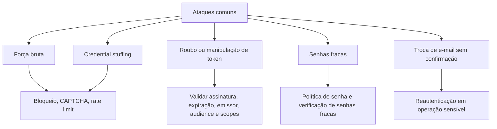
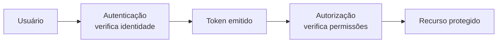
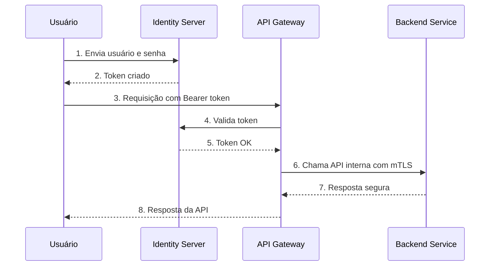
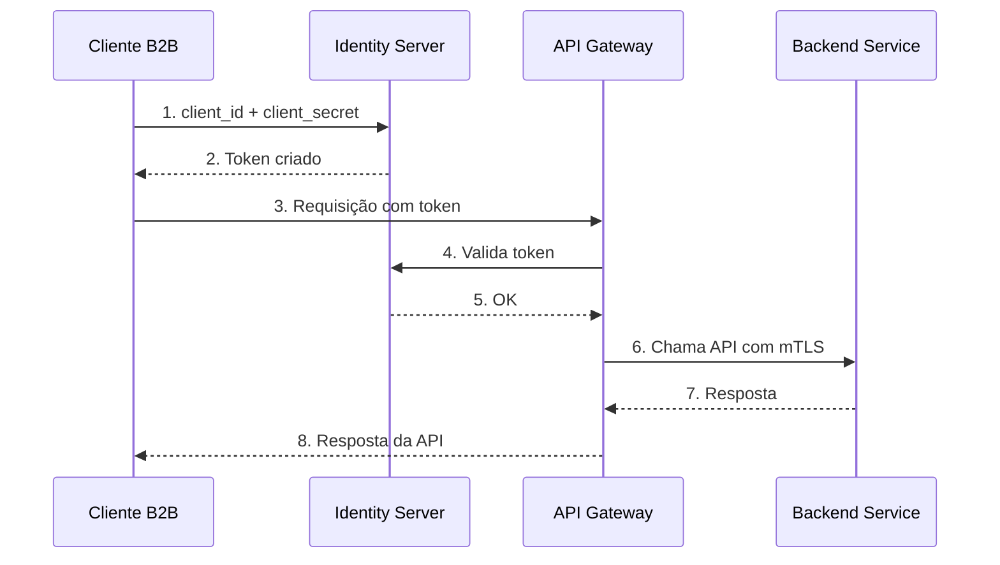

# Capítulo 5 - Detalhando a Autenticação em APIs

## Objetivo

Compreender o risco **Broken Authentication**, diferenciar autenticação de autorização, entender o papel de Identity Providers, OAuth 2.0, SAML, tokens e fluxos de autenticação em APIs.

## Ideia central para prova

Autenticação responde **quem é o usuário ou cliente**. Autorização responde **o que ele pode acessar**. OAuth 2.0 é primariamente um protocolo de autorização, não de autenticação. Tokens precisam ser validados quanto à assinatura, expiração, emissor e escopo.

## Broken Authentication

Broken Authentication ocorre quando mecanismos de autenticação são implementados incorretamente, permitindo que atacantes comprometam tokens, explorem senhas fracas ou assumam identidades de outros usuários.

Exemplos de falhas:

- ausência de mitigação contra força bruta;
- credential stuffing sem bloqueio ou CAPTCHA;
- tokens JWT sem validação adequada;
- tokens sem assinatura ou com algoritmo inseguro;
- senhas fracas aceitas;
- alteração de e-mail sem reautenticação;
- API keys expostas no frontend;
- ausência de MFA em operações críticas.

## Autenticação x Autorização

| Conceito | Pergunta que responde | Exemplo |
|---|---|---|
| Autenticação | Quem é você? | Login com usuário/senha, biometria, MFA. |
| Autorização | O que você pode fazer? | Acessar salário, alterar conta, consultar pedido. |

## OAuth 2.0, OpenID Connect e SAML

OAuth 2.0 permite que uma aplicação acesse recursos em nome de um usuário usando tokens, sem receber diretamente a senha do usuário. Para autenticação de usuário sobre OAuth 2.0, normalmente entra o **OpenID Connect**, que adiciona camada de identidade. SAML é um protocolo baseado em XML muito usado em SSO corporativo.

## Identity Providers

Um Identity Provider centraliza autenticação, emissão de tokens, MFA, política de senha, federação e integração com diretórios corporativos. Exemplos citados no material incluem Microsoft Entra ID, AWS Cognito, Google Login, Keycloak, Okta e Auth0.

A recomendação é não reinventar autenticação, geração de tokens ou armazenamento de senhas. Use soluções consolidadas, padrões conhecidos e bibliotecas maduras.

## Fluxo usuário e senha

## Fluxo client secret

Usado para comunicação entre sistemas, parceiros ou clientes B2B. Não deve ser confundido com autenticação de usuário final.

## Boas práticas de prevenção

- Usar Identity Provider consolidado.
- Entender o protocolo adotado, sem confundir autenticação com autorização.
- Validar tokens no backend ou no gateway.
- Exigir reautenticação para operações sensíveis.
- Implementar MFA quando possível.
- Aplicar bloqueio de conta, CAPTCHA e rate limiting contra força bruta.
- Não usar API keys para autenticar usuários finais.
- Não expor secrets no frontend.
- Usar mTLS para integrações críticas entre serviços.

## Checklist de revisão

- Tokens têm assinatura validada?
- Tokens têm expiração curta e refresh controlado?
- A API valida issuer, audience e scopes?
- Operações sensíveis exigem reautenticação?
- Há proteção contra brute force e credential stuffing?
- API keys estão restritas a clientes de API e não a usuários finais?
- Existem logs de falhas de autenticação sem expor dados sensíveis?

## Questões de fixação

1. OAuth 2.0 é autenticação?
   - Resposta: não. OAuth 2.0 é primariamente autorização; autenticação costuma ser feita com OpenID Connect sobre OAuth 2.0.

2. API key deve autenticar usuário mobile/web?
   - Resposta: não. API key é adequada para cliente de API, especialmente cenários B2B, não para usuário final.

3. O que é reautenticação em operação sensível?
   - Resposta: exigir confirmação adicional de identidade antes de ações críticas, como trocar e-mail, telefone 2FA ou realizar transação financeira.

## Erros comuns

- Validar apenas presença do token, sem checar assinatura e expiração.
- Guardar secrets no frontend.
- Permitir alteração de e-mail sem senha atual ou MFA.
- Confundir autenticação com autorização.
