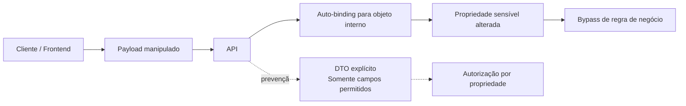
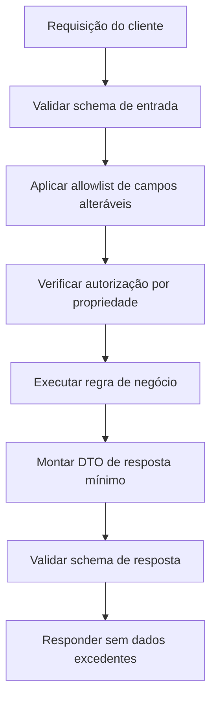
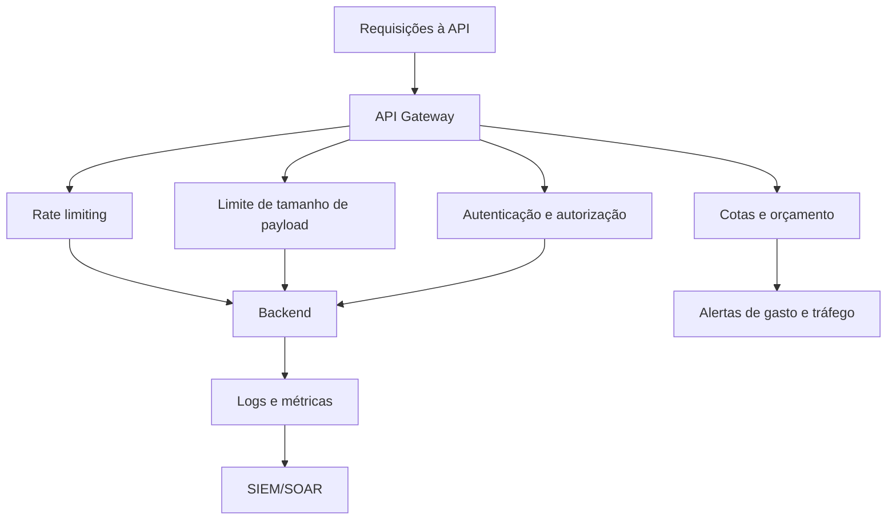

# Capítulo 6 - Tampering em APIs e Consumo Irrestrito de Recursos

## Objetivo

Estudar o risco **Broken Object Property Level Authorization**, associado a exposição excessiva de dados e mass assignment, e o risco **Unrestricted Resource Consumption**, associado a abuso de recursos computacionais e financeiros.

## Ideia central para prova

Nunca confie nos dados vindos do frontend. O backend deve decidir quais propriedades podem ser lidas ou alteradas. Além disso, APIs precisam limitar consumo para evitar DoS, custos indevidos e abuso de serviços pagos como SMS, e-mail, biometria ou LLMs.

## Tampering

Tampering é a manipulação não autorizada de dados, parâmetros ou payloads. Em APIs, ocorre quando o atacante altera campos enviados na requisição para induzir comportamento indevido.

Exemplo: o frontend envia apenas `description`, mas o atacante adiciona `blocked: false` ao payload para desbloquear conteúdo.

```http
PUT /api/video/update_video
{
  "description": "Um vídeo sobre gatos",
  "blocked": false
}
```

Se a API aceita automaticamente qualquer propriedade enviada pelo cliente, existe risco de **mass assignment**.

## Broken Object Property Level Authorization

Esse risco combina problemas antes tratados separadamente como **Excessive Data Exposure** e **Mass Assignment**. O foco é a falta de autorização no nível das propriedades do objeto.

A API é vulnerável quando:

- retorna propriedades sensíveis que o usuário não deveria ver;
- permite alterar propriedades que o usuário não deveria modificar;
- converte objetos internos completos para JSON sem filtro;
- aceita payloads genéricos e vincula automaticamente campos do cliente ao domínio interno.



## Prevenção contra manipulação

- Tratar todo dado do frontend como não confiável.
- Usar DTOs específicos para entrada e saída.
- Permitir atualização apenas de propriedades autorizadas.
- Evitar `to_json()` ou serialização completa de objetos de domínio.
- Retornar apenas os campos necessários para a tela ou caso de uso.
- Validar resposta com schema quando aplicável.
- Registrar tentativas de alteração de campos proibidos.



## Consumo irrestrito de recursos

APIs consomem CPU, memória, disco, rede, banco, filas, e também recursos cobrados por terceiros: envio de SMS, e-mail, validação biométrica, chamadas telefônicas, OCR, processamento de imagem, modelos de IA e LLMs.

Um atacante pode abusar de endpoints desprotegidos para gerar custos, indisponibilidade ou dano reputacional.

Exemplos:

- automatizar recuperação de senha para enviar milhares de SMS;
- usar endpoint SMTP para disparar phishing;
- enviar imagens enormes para esgotar memória;
- chamar endpoint de LLM caro de forma massiva;
- agrupar múltiplas operações em uma única chamada GraphQL para burlar limites.

## Prevenção contra consumo irrestrito



Medidas principais:

- implementar rate limiting por IP, usuário, cliente e endpoint;
- limitar tamanho de payload, uploads e profundidade de GraphQL;
- aplicar autenticação e autorização em recursos caros;
- configurar cotas por cliente ou plano;
- configurar alertas de custo por hora/dia;
- monitorar padrões anômalos;
- retornar erro adequado quando limites forem excedidos;
- diferenciar picos legítimos, como Black Friday, de comportamento malicioso.

## Checklist de revisão

- Endpoints aceitam apenas campos permitidos?
- Respostas retornam apenas dados necessários?
- Existe validação por schema?
- A API bloqueia mass assignment?
- Há rate limiting por usuário, IP e cliente?
- Uploads têm limite de tamanho?
- Endpoints caros têm cotas e alertas de gasto?
- GraphQL tem limites de profundidade e complexidade?

## Questões de fixação

1. Por que não confiar no frontend?
   - Resposta: porque payloads podem ser alterados por atacantes, proxies, scripts ou ferramentas de teste.

2. O que é mass assignment?
   - Resposta: vinculação automática de campos enviados pelo cliente a propriedades internas, permitindo alterar campos não autorizados.

3. Como prevenir consumo irrestrito?
   - Resposta: rate limiting, autenticação, autorização, limite de payload, cotas, alertas e monitoramento.

## Erros comuns

- Retornar objeto completo quando a tela precisa de dois campos.
- Aceitar qualquer propriedade do JSON.
- Rate limit apenas por IP, ignorando usuário e token.
- Não configurar alertas de custos em integrações pagas.
