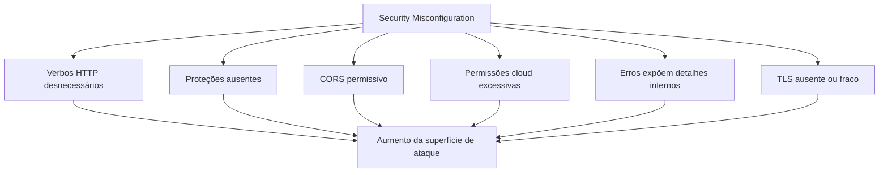
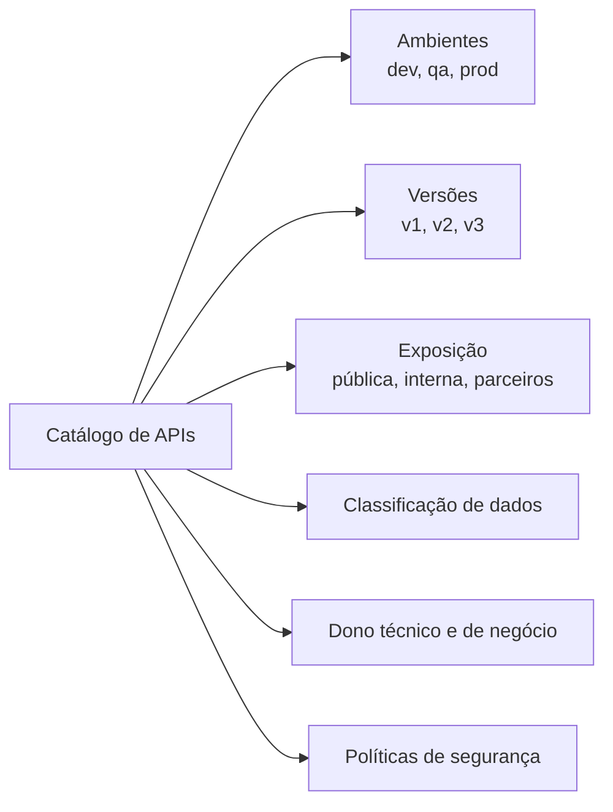
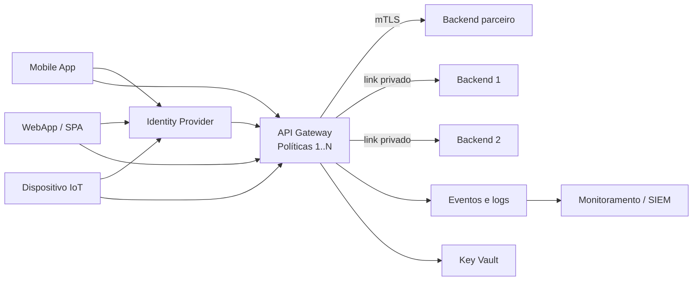

# Capítulo 7 - Estratégias de Governança e Segurança para APIs

## Objetivo

Estudar dois riscos de governança do OWASP API Security Top 10 2023: **Security Misconfiguration** e **Improper Inventory Management**, além de soluções gerenciadas e ferramentas de segurança para APIs.

## Ideia central para prova

Governança de APIs exige saber quais APIs existem, onde estão, quem pode acessá-las, quais versões estão ativas, quais políticas estão aplicadas e quais dados trafegam. Configurações inseguras e inventário desatualizado aumentam muito a superfície de ataque.

## Security Misconfiguration

APIs e seus ambientes possuem configurações complexas. Em prazos apertados, algumas configurações podem ser ignoradas, abrindo portas para ataques.

Falhas comuns:

- verbos HTTP desnecessários habilitados;
- endpoints sem autenticação;
- permissões de cloud excessivas;
- CORS aberto demais;
- mensagens de erro expondo stack, versões e detalhes internos;
- TLS ausente ou mal configurado;
- serviços desnecessários ativos;
- logs de debug expostos;
- buckets ou storage públicos por engano.

## Princípio “menos é mais”

Quanto menos informação e permissão forem concedidas, mais seguro será o ecossistema. Essa ideia aparece repetidamente no material e deve ser lembrada para prova.

Aplicações práticas:

- retornar apenas dados necessários;
- habilitar apenas métodos necessários;
- restringir permissões de contas e serviços;
- limitar origens CORS;
- ocultar detalhes internos em mensagens de erro;
- simplificar endpoints;
- bloquear ambientes não produtivos para acesso externo.

## Improper Inventory Management

Com o crescimento da empresa, surgem múltiplas APIs, ambientes, versões e integrações. Sem inventário, APIs antigas continuam expostas, rotas de teste vazam dados e versões obsoletas ficam sem proteção.

Perguntas de governança:

- Quais APIs existem?
- Estão em dev, QA, homologação ou produção?
- São públicas, internas ou de parceiros?
- Quais versões estão em execução?
- Quem é o dono técnico e de negócio?
- Quais dados trafegam?
- Há documentação atualizada?
- A API possui política de autenticação e autorização?

## Arquitetura de governança com soluções gerenciadas

Soluções citadas:

| Solução | Papel |
|---|---|
| API Gateway | Entrada central, políticas, autenticação, rate limiting e roteamento. |
| Identity Provider | Gestão de identidades, MFA, tokens, federação. |
| WAF | Proteção contra ataques web e bots. |
| Endpoint Protection | Proteção de endpoints e workloads. |
| SIEM/SOAR | Monitoramento, correlação de eventos e resposta. |
| Key Vault | Armazenamento seguro de segredos, certificados e chaves. |

## Ferramentas de segurança de APIs

O material menciona ferramentas de segurança de API com foco em runtime e teste dinâmico. Segundo a categorização OWASP, ferramentas podem atuar em:

- **API Security Posture**: inventário, métodos expostos e classificação de dados;
- **API Runtime Security**: proteção durante execução e tratamento de requisições;
- **API Security Testing**: avaliação dinâmica da API em execução.

## Checklist de revisão

- Existe inventário de APIs?
- Cada API tem dono técnico e de negócio?
- Ambientes dev/QA usam dados fictícios ou mascarados?
- Versões antigas têm política de descontinuação?
- Documentação é gerada e protegida?
- CORS está restrito?
- Erros não expõem stack ou versões?
- TLS está configurado corretamente?
- Políticas estão no API Gateway?
- Logs vão para SIEM/SOAR?

## Questões de fixação

1. O que é Security Misconfiguration?
   - Resposta: configuração insegura ou incompleta que expõe dados, detalhes internos ou abre portas para ataques.

2. O que é Improper Inventory Management?
   - Resposta: falha em manter controle sobre APIs, ambientes, versões, documentação, donos e exposição.

3. Por que dados reais não devem ser usados em dev/QA?
   - Resposta: porque ambientes não produtivos costumam ter controles mais fracos e podem expor dados pessoais ou sensíveis.

## Erros comuns

- Deixar documentação pública sem autenticação.
- Manter APIs antigas expostas indefinidamente.
- Usar CORS `*` em endpoints sensíveis.
- Retornar stack trace em erro 500.
- Não ter dono claro para cada API.
