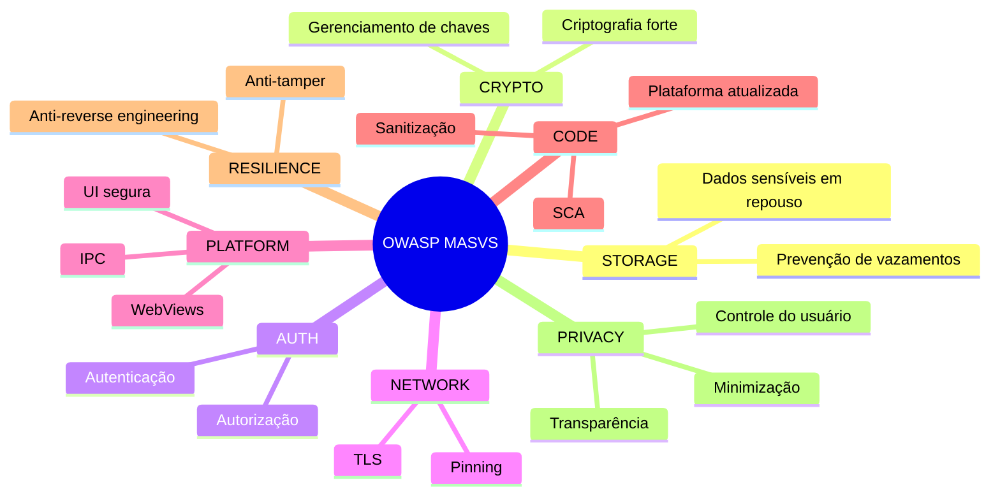
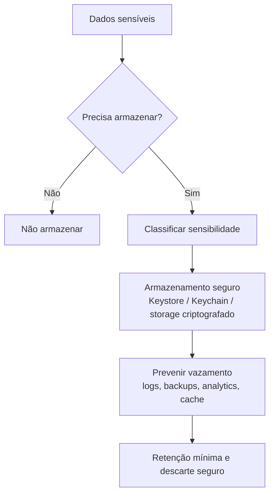
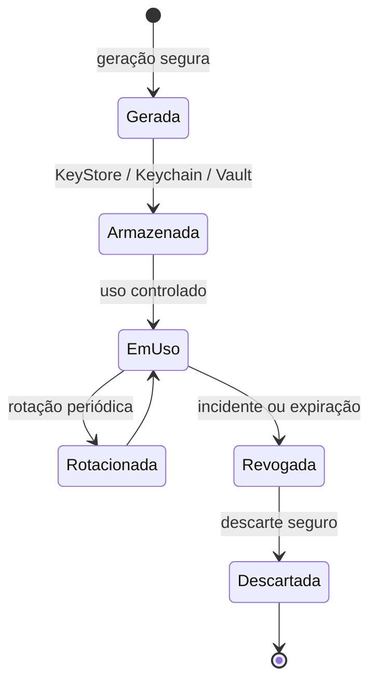

# Capítulo 8 - Desenvolvimento Seguro para Aplicativos Mobile: MASVS Storage e Crypto

## Objetivo

Introduzir o OWASP MASVS e aprofundar dois grupos de controles: **MASVS-STORAGE** e **MASVS-CRYPTO**.

## Ideia central para prova

O MASVS é um padrão de verificação de segurança para aplicativos móveis. Ele organiza controles em grupos que cobrem armazenamento, criptografia, autenticação, rede, plataforma, código, resiliência e privacidade.

## OWASP MASVS

MASVS significa **Mobile Application Security Verification Standard**. Ele define controles para avaliar e melhorar a segurança de aplicativos móveis em Android, iOS e plataformas híbridas ou multiplataforma.

## Aplicabilidade

O MASVS se aplica a:

- apps nativos Android e iOS;
- apps híbridos;
- apps multiplataforma como Flutter, React Native e Xamarin;
- SDKs e bibliotecas;
- apps pré-carregados.

Apps híbridos e multiplataforma podem herdar vulnerabilidades específicas da plataforma e da camada de framework, exigindo atenção adicional.

## Ética e autorização

Ferramentas de instrumentação, engenharia reversa, tampering e análise dinâmica devem ser usadas somente em testes autorizados, pesquisa acadêmica ou ambientes próprios. Usar essas técnicas contra sistemas sem permissão é ilegal e antiético.

## MASVS-STORAGE

### Controle geral

O aplicativo deve armazenar dados sensíveis de forma segura e prevenir vazamentos não intencionais.

Dados sensíveis podem incluir:

- tokens de sessão;
- chaves criptográficas;
- dados pessoais;
- dados financeiros;
- dados médicos;
- documentos;
- cache de respostas da API;
- logs com informações sigilosas.

### MASVS-STORAGE-1

O app armazena dados sensíveis de forma segura. Isso vale independentemente do local físico, cloud, país ou infraestrutura.

### MASVS-STORAGE-2

O app previne vazamento de dados sensíveis. Vazamentos podem ocorrer por logs, backups automáticos, analytics, cache, screenshots, arquivos temporários e mecanismos da plataforma.

## MASVS-CRYPTO

### Criptografia forte

O app deve usar algoritmos criptográficos atuais e robustos, aplicados conforme boas práticas. Criptografia é importante para dados em trânsito e dados em repouso.

### Gerenciamento de chaves

Criptografia forte não resolve se as chaves são mal gerenciadas. O ciclo de vida das chaves inclui geração, armazenamento, validade, rotação, revogação e descarte.

## Exemplo de ataque: roubo de chaves

Um app armazena chaves diretamente no sistema de arquivos do dispositivo. Um atacante com acesso físico, malware ou ambiente comprometido extrai a chave. Com ela, pode descriptografar dados, interceptar comunicação, falsificar transações ou manipular integridade.

## Como prevenir

- Usar Android Keystore, iOS Keychain ou Secure Enclave quando aplicável.
- Evitar chaves em texto claro no sistema de arquivos.
- Não versionar chaves no repositório.
- Rotacionar chaves periodicamente.
- Separar chaves por finalidade.
- Aplicar controle de acesso rigoroso.
- Evitar logs com dados sensíveis.
- Criptografar dados locais quando necessário.

## Checklist de revisão

- O app armazena apenas o necessário?
- Tokens e chaves ficam em storage seguro?
- Logs não contêm dados sensíveis?
- Backups excluem dados sensíveis quando necessário?
- As chaves têm rotação e expiração?
- Há separação entre dados de baixa e alta sensibilidade?
- O app evita cache indevido de respostas sensíveis?

## Questões de fixação

1. O que é MASVS?
   - Resposta: padrão OWASP para verificar e melhorar segurança de aplicativos móveis.

2. Por que armazenamento seguro é importante em mobile?
   - Resposta: porque o dispositivo está sob controle do usuário e pode ser perdido, comprometido ou analisado.

3. Por que gerenciamento de chaves é tão importante quanto criptografia?
   - Resposta: porque chaves mal protegidas permitem quebrar a proteção mesmo com algoritmo forte.

## Erros comuns

- Guardar token em armazenamento comum sem proteção.
- Colocar segredo no app achando que ofuscação basta.
- Enviar dados sensíveis para analytics sem necessidade.
- Usar algoritmo antigo ou configuração criptográfica fraca.
