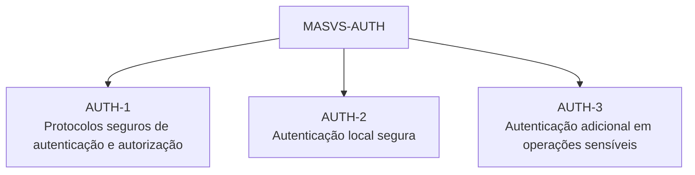
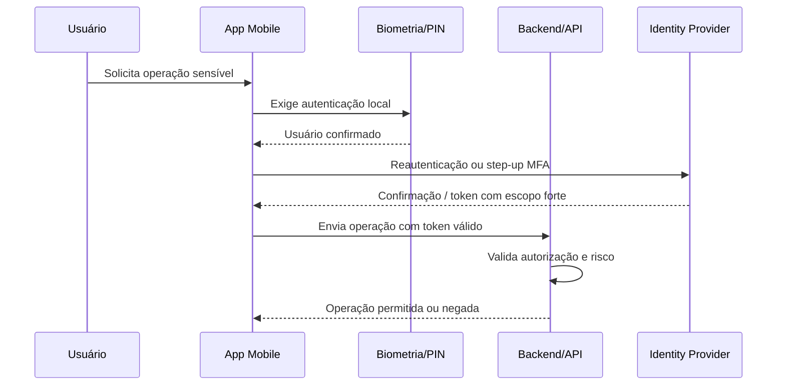
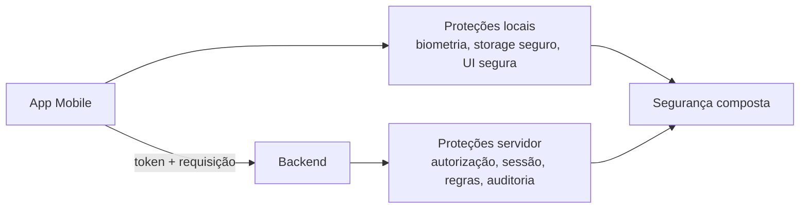

# Capítulo 9 - Autenticação Segura para Aplicativos

## Objetivo

Estudar autenticação e autorização em aplicativos móveis segundo **MASVS-AUTH**, incluindo protocolos seguros, autenticação local e proteção de operações sensíveis com autenticação adicional.

## Ideia central para prova

Aplicativos móveis devem usar protocolos seguros de autenticação e autorização, implementar autenticação local corretamente e exigir autenticação adicional para operações sensíveis.

## MASVS-AUTH

O grupo MASVS-AUTH trata autenticação, autorização, autenticação local e proteção de ações críticas.

## MASVS-AUTH-1: protocolos seguros

A maioria dos apps que se comunica com backend remoto precisa autenticar o usuário e impor autorização. Mesmo que a decisão final de autorização esteja no backend, o app deve seguir boas práticas: usar tokens corretamente, não expor secrets, proteger sessão e chamar endpoints seguros.

Práticas relevantes:

- usar OAuth 2.0/OpenID Connect quando aplicável;
- não armazenar senha localmente;
- usar refresh token com cuidado;
- validar expiração e renovar sessão de forma segura;
- não colocar API keys ou client secrets no app como se fossem secretos absolutos;
- tratar tokens como dados sensíveis.

## MASVS-AUTH-2: autenticação local segura

Autenticação local é o uso de PIN, biometria, Face ID, Touch ID ou mecanismos equivalentes para desbloquear o app ou proteger dados locais. Precisa seguir as melhores práticas da plataforma.

Atenção: biometria local não substitui autorização no backend. Ela protege o acesso local, mas o servidor ainda deve validar token, sessão e permissão.

## MASVS-AUTH-3: operações sensíveis

Operações sensíveis exigem autenticação adicional. Exemplos:

- PIX, transferência ou pagamento;
- alteração de e-mail;
- alteração de telefone de 2FA;
- cancelamento de contrato;
- visualização de dados médicos;
- alteração de endereço crítico;
- exclusão de conta;
- emissão de documento sigiloso.

## Dupla custódia: app e backend

A segurança mobile exige dupla proteção. O app protege armazenamento, UI, sessão local e comunicação. O backend valida identidade, autorização, regras de negócio, tokens, escopos e limites. Nenhuma das partes deve confiar cegamente na outra.

## Papel do Product Owner

O desenvolvedor deve trabalhar com Product Owner e áreas de negócio para identificar quais operações são sensíveis. Segurança não pode depender apenas de julgamento técnico; impacto de negócio e impacto ao usuário também contam.

## Checklist de revisão

- O app usa protocolo seguro para autenticação?
- Tokens são armazenados de forma segura?
- A sessão expira corretamente?
- Biometria/PIN são implementados conforme boas práticas da plataforma?
- Operações sensíveis exigem step-up/reautenticação?
- O backend valida autorização independentemente do app?
- O app não usa secrets fixos como autenticação de usuário?

## Questões de fixação

1. Autenticação local substitui autorização no backend?
   - Resposta: não. Ela protege o dispositivo/local, mas o backend deve validar permissões.

2. O que é step-up authentication?
   - Resposta: autenticação adicional exigida para uma ação de maior risco.

3. Quem deve ajudar a identificar operações sensíveis?
   - Resposta: desenvolvedores, segurança, negócio e Product Owner.

## Erros comuns

- Deixar alteração de e-mail sem reautenticação.
- Tratar biometria como garantia absoluta de identidade no servidor.
- Armazenar tokens em local inseguro.
- Não diferenciar operação comum de operação crítica.
