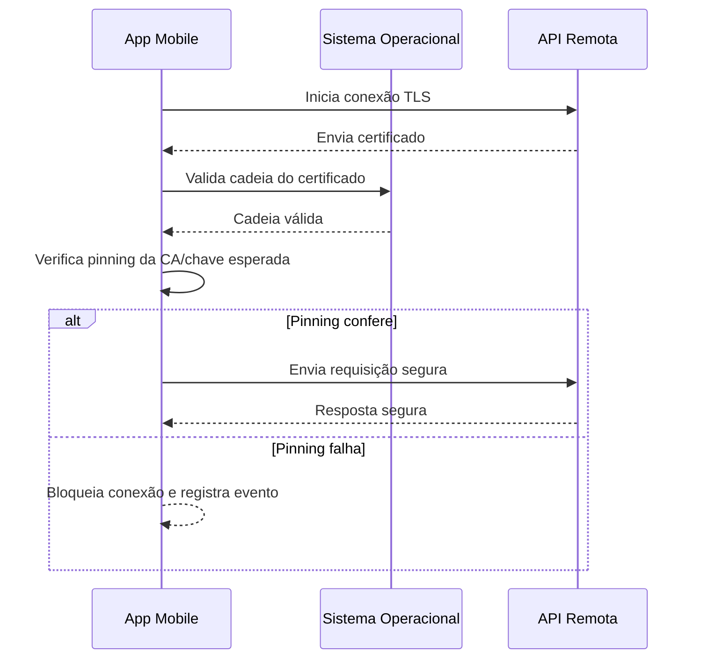
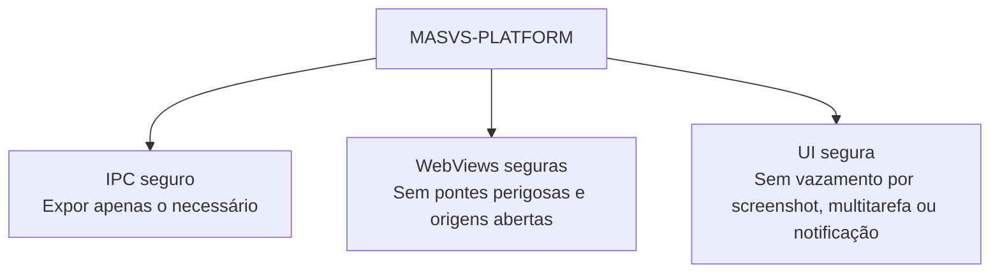

# Capítulo 10 - Protegendo Rede e Plataforma em Aplicativos Mobile

## Objetivo

Entender os controles **MASVS-NETWORK** e **MASVS-PLATFORM**, incluindo tráfego seguro, validação de certificados, pinning, IPC seguro, WebViews seguras e proteção de dados sensíveis na interface.

## Ideia central para prova

Todo tráfego sensível deve ser protegido em trânsito. O app deve validar o endpoint remoto, evitar confiança ampla demais em certificados e proteger interações com a plataforma, WebViews, IPC e interface do usuário.

## MASVS-NETWORK

### MASVS-NETWORK-1

O aplicativo protege todo o tráfego de rede conforme melhores práticas. Isso envolve criptografia e autenticação do endpoint remoto, tipicamente com TLS.

### MASVS-NETWORK-2

O aplicativo realiza pinning de identidade para endpoints sob controle do desenvolvedor. Em vez de confiar em todas as CAs raiz do dispositivo, o app confia apenas em CAs ou chaves específicas.



## Por que pinning importa

Sem pinning, um dispositivo comprometido ou uma CA adicionada indevidamente poderia permitir interceptação de tráfego. Com pinning, o app reduz a confiança ampla no conjunto de CAs do sistema e passa a confiar apenas em identidades específicas.

Atenção: pinning precisa de estratégia de rotação. Se o certificado expira ou muda sem planejamento, o app pode parar de se comunicar.

## MASVS-PLATFORM

O grupo PLATFORM trata uso seguro de recursos da plataforma móvel.

### IPC seguro

IPC significa comunicação entre processos. O app deve expor dados e funcionalidades a outros apps apenas quando necessário e de forma controlada.

### WebViews seguras

WebViews podem expor pontes JavaScript para código nativo e aumentar a superfície de ataque. Devem ser configuradas com cuidado, desabilitando recursos desnecessários, restringindo origens e evitando exposição de dados sensíveis.

### Interface de usuário segura

Dados sensíveis podem vazar por screenshots automáticas, tela de multitarefa, notificações, gravação de tela ou overlays. Apps financeiros e de saúde costumam bloquear capturas em telas críticas.



## Exemplo Android: FLAG_SECURE

A `FLAG_SECURE` impede que o conteúdo da janela seja capturado em screenshots ou exibido em miniaturas de multitarefa.

```java
public class MainActivity extends AppCompatActivity {
    @Override
    protected void onCreate(Bundle savedInstanceState) {
        super.onCreate(savedInstanceState);
        setContentView(R.layout.activity_main);

        getWindow().setFlags(
            WindowManager.LayoutParams.FLAG_SECURE,
            WindowManager.LayoutParams.FLAG_SECURE
        );
    }
}
```

## Checklist de revisão

- Toda comunicação usa TLS?
- Certificados são validados corretamente?
- Há pinning para endpoints críticos?
- Existe plano de rotação de certificados/pins?
- IPC expõe apenas o necessário?
- WebViews estão configuradas de forma segura?
- Telas com dados sensíveis bloqueiam screenshots quando necessário?
- Notificações não exibem dados sensíveis?

## Questões de fixação

1. O que é certificate pinning?
   - Resposta: fixar confiança em certificados, chaves públicas ou CAs específicas para endpoints controlados.

2. TLS é opcional para dados sensíveis?
   - Resposta: não. Dados sensíveis em trânsito devem ser protegidos.

3. Para que serve FLAG_SECURE no Android?
   - Resposta: impedir captura de tela e exposição do conteúdo em miniaturas de multitarefa.

## Erros comuns

- Aceitar qualquer certificado em ambiente de produção.
- Desabilitar validação TLS para “resolver erro de certificado”.
- Usar WebView com JavaScript bridge exposta sem restrição.
- Mostrar OTP ou dados sensíveis em notificação.
