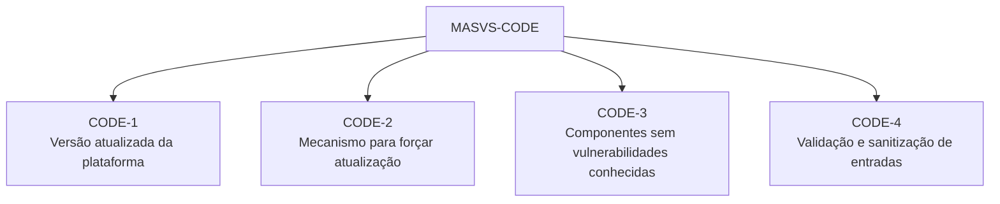
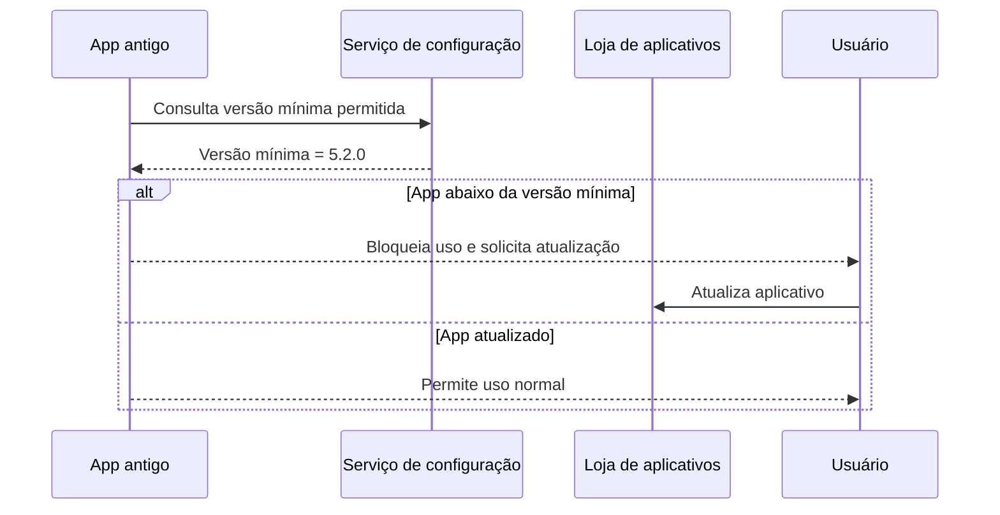
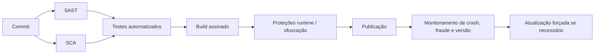

# Capítulo 11 - Protegendo Código Fonte e Versões do Aplicativo

## Objetivo

Estudar o grupo **MASVS-CODE**, que trata atualização da plataforma, atualização forçada do app, uso de componentes sem vulnerabilidades conhecidas e validação/sanitização de entradas não confiáveis.

## Ideia central para prova

Um app seguro precisa rodar em plataforma atualizada, ter mecanismo para forçar atualização quando houver vulnerabilidade crítica, usar componentes sem CVEs conhecidas e validar toda entrada não confiável.

## MASVS-CODE



## Plataforma atualizada

Cada versão de Android ou iOS traz patches e recursos de segurança. Suportar versões muito antigas aumenta a exposição a vulnerabilidades conhecidas. Existe um equilíbrio entre alcance de usuários e segurança, mas a decisão deve ser baseada em análise de risco.

Estratégias:

- definir versão mínima suportada;
- bloquear funções críticas em versões inseguras;
- informar usuário sobre necessidade de atualização;
- acompanhar vulnerabilidades da plataforma;
- alinhar decisão com segurança, negócio e produto.

## Atualização forçada

Se uma vulnerabilidade crítica for descoberta em produção, o app precisa ter mecanismo para obrigar atualização antes do uso. Sem isso, usuários podem continuar em versões vulneráveis indefinidamente.



## Componentes sem vulnerabilidades conhecidas

O app deve usar bibliotecas e SDKs sem vulnerabilidades conhecidas. SCA é essencial para detectar CVEs em dependências. Isso vale para libs de rede, analytics, criptografia, publicidade, SDKs de terceiros e frameworks híbridos.

## Entradas não confiáveis

Entradas de UI, rede, IPC e sistema de arquivos devem ser tratadas como não confiáveis. Podem ter sido manipuladas por usuários, malware, apps maliciosos ou tráfego interceptado.

Exemplos de ataques:

- SQL Injection;
- command injection;
- XSS em WebViews;
- path traversal;
- bypass de regra de segurança;
- manipulação de arquivos.

## Exemplo de validação simples

```java
findViewById(R.id.buttonSubmit).setOnClickListener(v -> {
    String input = userInput.getText().toString();

    if (isValidInput(input)) {
        String sanitized = sanitizeInput(input);
        Toast.makeText(this, "Entrada válida: " + sanitized, Toast.LENGTH_SHORT).show();
    } else {
        Toast.makeText(this, "Entrada inválida!", Toast.LENGTH_SHORT).show();
    }
});

private boolean isValidInput(String input) {
    return input.matches("^[a-zA-Z0-9]+$");
}

private String sanitizeInput(String input) {
    return input.trim();
}
```

A validação real deve ser adequada ao contexto. Para SQL, use consultas parametrizadas; para HTML, escape/encode; para arquivos, normalize caminhos e aplique allowlist.

## Pipeline seguro para app mobile



## Checklist de revisão

- Há versão mínima suportada da plataforma?
- Existe mecanismo de atualização forçada?
- SCA roda para dependências mobile e SDKs?
- Bibliotecas vulneráveis são bloqueadas no pipeline?
- Entradas de UI, rede, IPC e arquivos são validadas?
- Consultas usam parâmetros em vez de concatenação?
- Secrets não estão hardcoded no app?
- Build é assinado e protegido?

## Questões de fixação

1. Por que versões antigas da plataforma são risco?
   - Resposta: podem conter vulnerabilidades conhecidas sem correção.

2. Por que atualização forçada é importante?
   - Resposta: permite bloquear uso de versões vulneráveis em produção.

3. O que são entradas não confiáveis?
   - Resposta: dados vindos de UI, rede, IPC, arquivos ou qualquer fonte manipulável.

## Erros comuns

- Manter suporte indefinido a versões antigas sem análise de risco.
- Usar SDKs de terceiros sem SCA.
- Validar apenas no frontend.
- Usar regex genérica como única defesa para todos os contextos.
