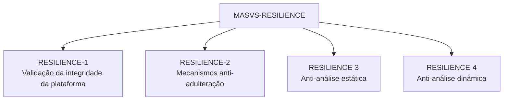
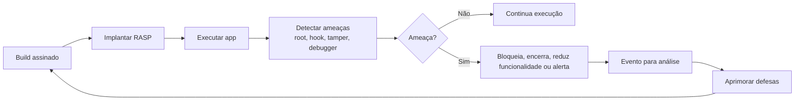
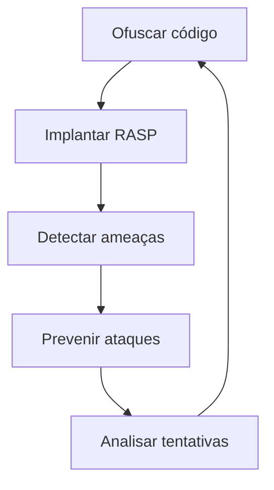

# Capítulo 12 - Técnicas contra Engenharia Reversa e Resiliência

## Objetivo

Estudar o grupo **MASVS-RESILIENCE**, que aborda integridade da plataforma, mecanismos anti-adulteração, anti-análise estática, anti-análise dinâmica, RASP e ofuscação.

## Ideia central para prova

Apps móveis rodam em dispositivos controlados pelo usuário. Portanto, atacantes podem tentar descompactar, instrumentar, modificar, depurar ou distribuir versões adulteradas. Resiliência busca dificultar engenharia reversa e detectar adulterações.

## MASVS-RESILIENCE

## Integridade da plataforma

O app deve validar se o ambiente de execução é confiável. Dispositivos com jailbreak, root, debuggers, hooks, malware ou alterações no sistema podem desativar proteções e expor dados.

Controles comuns:

- detecção de root/jailbreak;
- detecção de debugger;
- verificação de integridade do SO;
- checagem de ambiente comprometido;
- bloqueio ou redução de funcionalidade em ambiente inseguro.

## Anti-adulteração

Anti-tamper busca garantir que o pacote do app e sua lógica não foram modificados. Um atacante pode tentar alterar o APK/IPA, remover validações, inserir backdoor ou distribuir versão falsa fora das lojas oficiais.

## Anti-análise estática

Análise estática é examinar o pacote sem executá-lo. Em Android, um APK pode ser descompactado e decompilado. Sem proteção, o atacante entende fluxos internos, endpoints, regras e validações.

Técnicas:

- ofuscação de código;
- remoção de símbolos desnecessários;
- redução de strings legíveis;
- proteção contra decompilação;
- separação de segredos para backend/vault.

## Anti-análise dinâmica

Análise dinâmica observa o app em execução, inspecionando memória, chamadas, registradores, tráfego e comportamento. Ferramentas de instrumentação como Frida podem alterar o comportamento em runtime.

Técnicas:

- detecção de hooks/instrumentação;
- anti-debugging;
- verificação de integridade em runtime;
- RASP;
- validação contínua de assinatura/pacote.

## RASP - Runtime Application Self-Protection

RASP é proteção em tempo de execução. Ele detecta e pode bloquear ataques enquanto o app roda. Pode identificar tampering, instrumentação, ambiente inseguro e alterações no pacote.

## Ciclo de prevenção contra engenharia reversa

## Limitações importantes

Nenhuma técnica impede engenharia reversa para sempre. O objetivo é aumentar custo, tempo e complexidade do ataque, detectar tentativas e reduzir impacto. Segurança mobile é defesa em profundidade, não uma barreira única.

## Checklist de revisão

- O app valida integridade da plataforma?
- Há detecção de root/jailbreak quando aplicável?
- Existe ofuscação de código?
- O app detecta debug/hooking/instrumentação?
- O pacote assinado é validado?
- Há resposta definida para ambiente inseguro?
- Eventos de tampering são monitorados?
- Segredos críticos ficam no backend e não no app?

## Questões de fixação

1. O que é anti-tamper?
   - Resposta: mecanismos que buscam detectar ou impedir modificações não autorizadas no app ou em seus dados.

2. Qual a diferença entre análise estática e dinâmica?
   - Resposta: estática analisa o app sem executá-lo; dinâmica observa ou manipula o app em execução.

3. RASP substitui código seguro?
   - Resposta: não. RASP é camada adicional de defesa.

## Erros comuns

- Acreditar que ofuscação protege segredos hardcoded.
- Confiar apenas na validação da loja de aplicativos.
- Não monitorar eventos de tampering.
- Bloquear app em falsos positivos sem estratégia de suporte.
