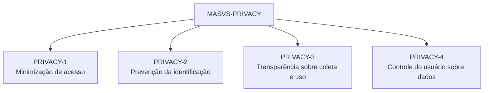
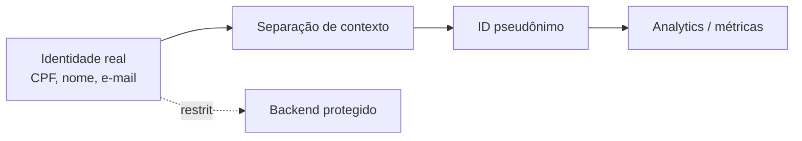
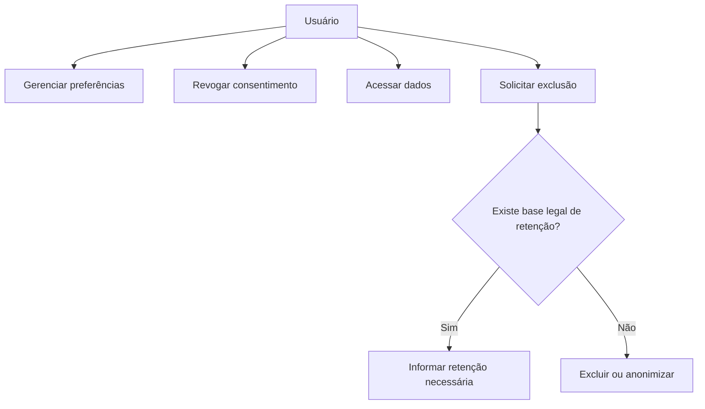

# Capítulo 13 - Controles sobre Privacidade

## Objetivo

Estudar o grupo **MASVS-PRIVACY**, com foco em minimização de acesso a dados, prevenção da identificação do usuário, transparência e controle do usuário sobre seus dados.

## Ideia central para prova

Privacidade não é apenas criptografar dados. É coletar menos, acessar menos, explicar claramente o uso, reduzir rastreamento e dar controle ao usuário, respeitando bases legais e requisitos regulatórios.

## MASVS-PRIVACY

## PRIVACY-1: minimização de acesso

O app deve solicitar apenas dados e permissões necessárias para a funcionalidade. A boa prática é “menos é mais” e “privacidade por padrão”.

Exemplos:

- não pedir localização se a funcionalidade não precisa;
- não acessar contatos sem necessidade clara;
- não coletar identificadores permanentes quando um ID pseudônimo basta;
- não manter dados por mais tempo que o necessário.

## PRIVACY-2: prevenção da identificação

Proteger a identidade do usuário reduz rastreamento. Técnicas incluem:

- anonimização;
- pseudonimização;
- abstração de dados;
- separação entre identificadores técnicos e identidade real;
- envio de dados agregados para analytics.

## PRIVACY-3: transparência

Usuários devem saber quais dados são coletados, por que são coletados, como são usados, com quem são compartilhados e por quanto tempo ficam armazenados. Termos de uso e política de privacidade precisam ser claros e coerentes com o comportamento real do app.

## PRIVACY-4: controle do usuário

O usuário deve poder gerenciar seus dados, alterar preferências, revogar consentimento, solicitar exclusão ou modificar informações quando aplicável. Existem exceções legais, como retenção obrigatória, mas devem ser justificadas.

## Relação com confiança

Privacidade impacta confiança. Um app que solicita permissões excessivas, não explica o uso de dados ou dificulta exclusão tende a gerar rejeição do usuário e risco regulatório.

## Checklist de revisão

- O app coleta apenas dados necessários?
- Permissões são solicitadas no momento correto e com justificativa?
- Analytics usa dados mínimos ou pseudônimos?
- Política de privacidade reflete o comportamento real do app?
- Usuário consegue alterar preferências?
- Usuário consegue revogar consentimento quando aplicável?
- Dados têm prazo de retenção definido?
- Exclusão/anonimização está implementada?

## Questões de fixação

1. O que significa minimização de dados?
   - Resposta: coletar e acessar apenas dados estritamente necessários para a finalidade.

2. Qual a importância da transparência?
   - Resposta: permite que o usuário saiba como seus dados são usados e aumenta confiança.

3. O usuário sempre pode excluir todos os dados imediatamente?
   - Resposta: depende. Pode haver bases legais de retenção, mas devem ser justificadas.

## Erros comuns

- Pedir todas as permissões na primeira abertura do app.
- Enviar CPF ou e-mail para analytics sem necessidade.
- Ter política de privacidade genérica que não reflete o app.
- Não fornecer mecanismo para controle de dados.
