# Todos os diagramas Mermaid

## Capítulo 1 - Introdução ao Desenvolvimento Seguro

### Diagrama 1

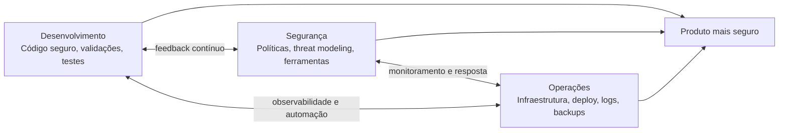

### Diagrama 2

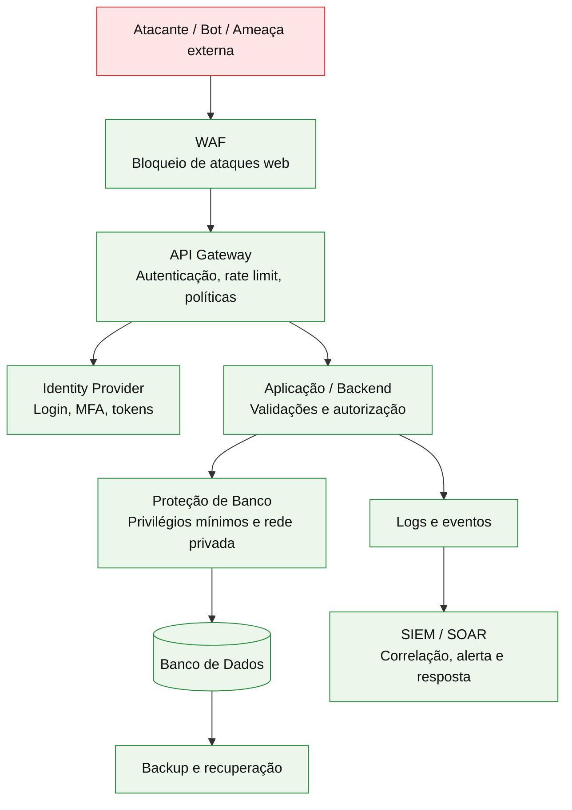

## Capítulo 2 - Projeto OWASP

### Diagrama 1

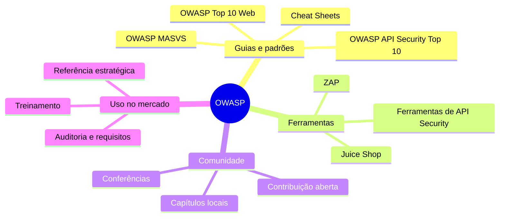

### Diagrama 2

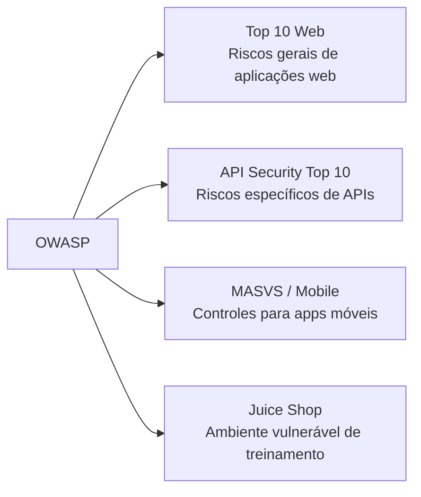

## Capítulo 3 - Tornando o Código Fonte Mais Seguro

### Diagrama 1

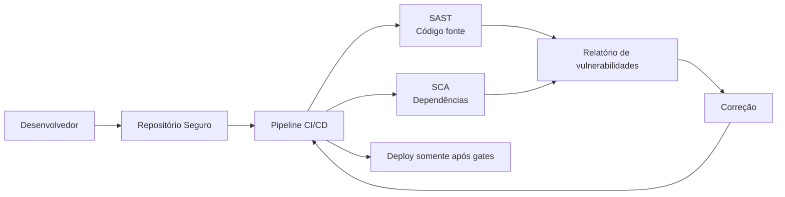

### Diagrama 2

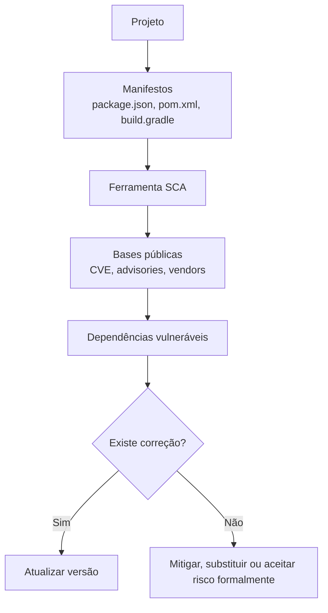

### Diagrama 3

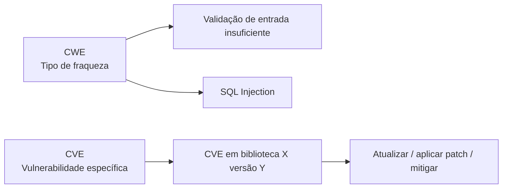

## Capítulo 4 - Ameaças em APIs e BOLA

### Diagrama 1

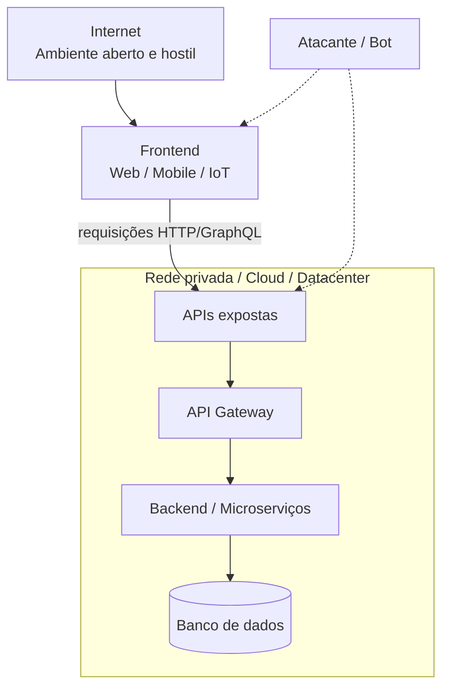

### Diagrama 2

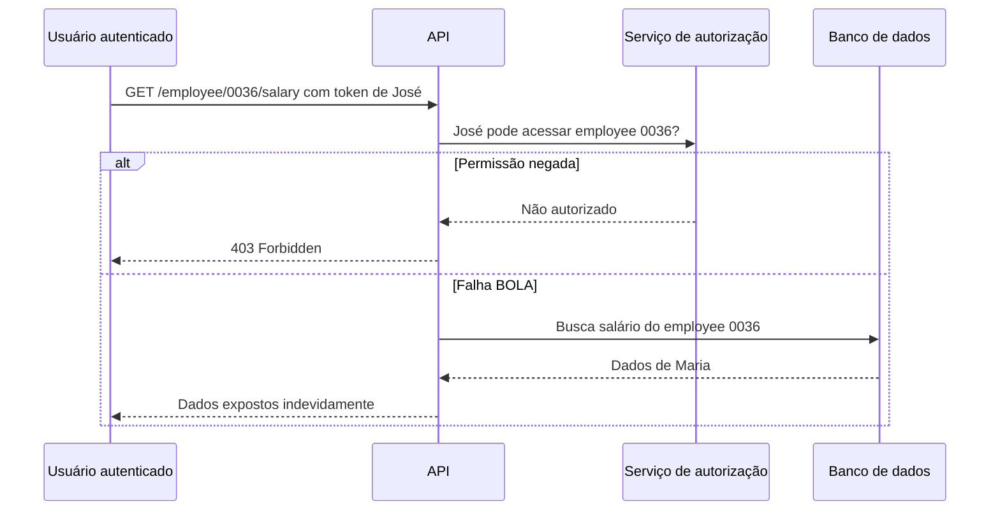

### Diagrama 3

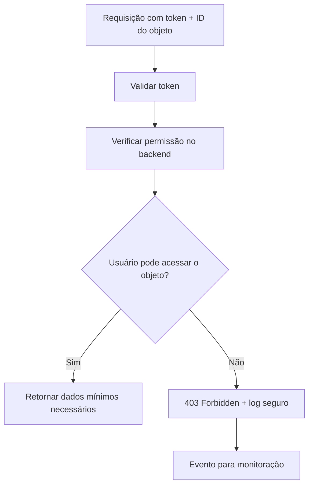

## Capítulo 5 - Autenticação em APIs

### Diagrama 1

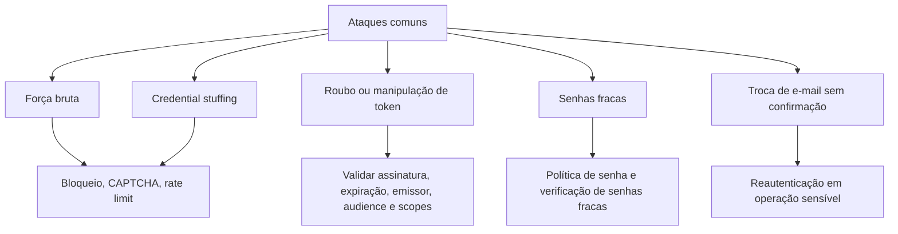

### Diagrama 2

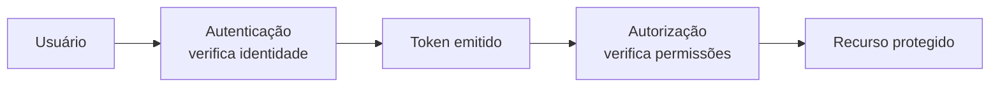

### Diagrama 3

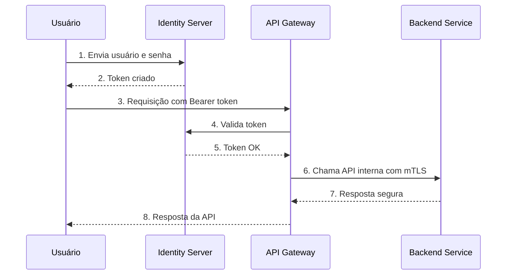

### Diagrama 4

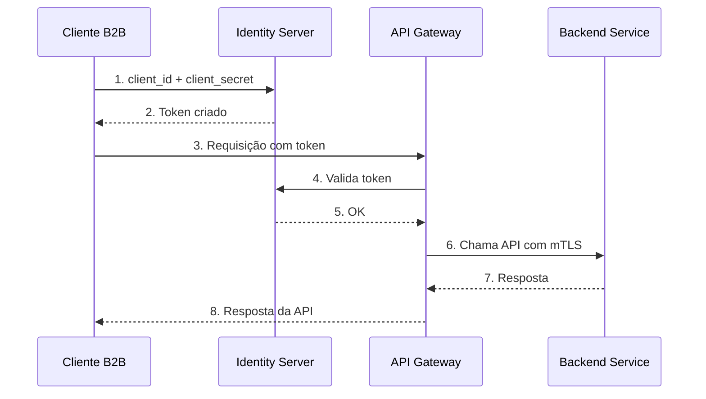

## Capítulo 6 - Tampering e Consumo Irrestrito

### Diagrama 1

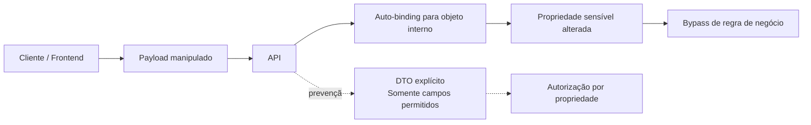

### Diagrama 2

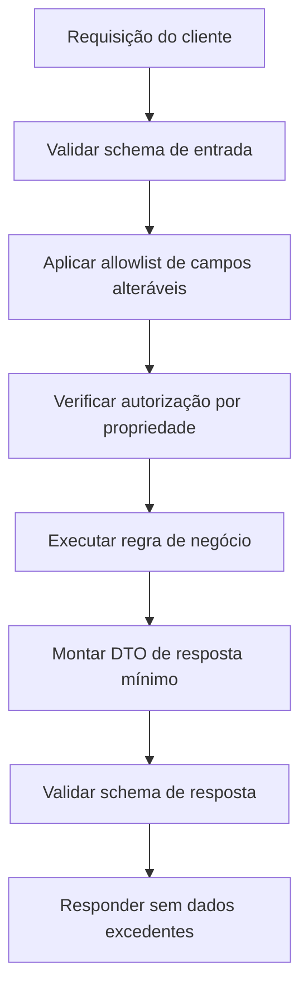

### Diagrama 3

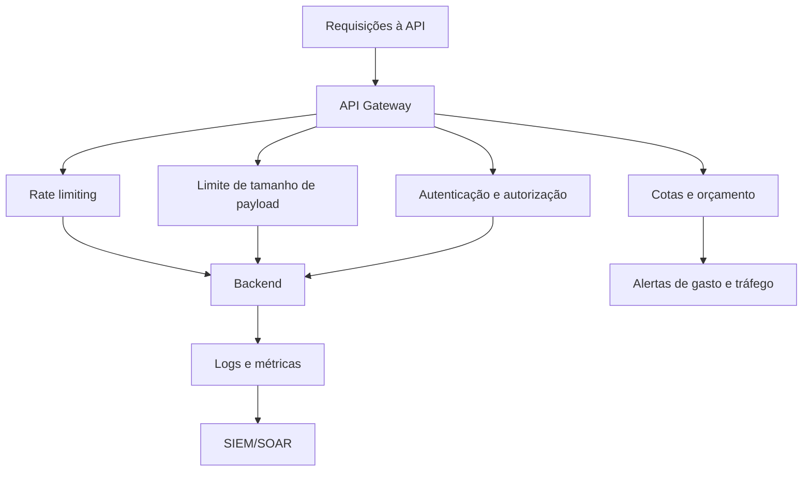

## Capítulo 7 - Governança e Segurança para APIs

### Diagrama 1

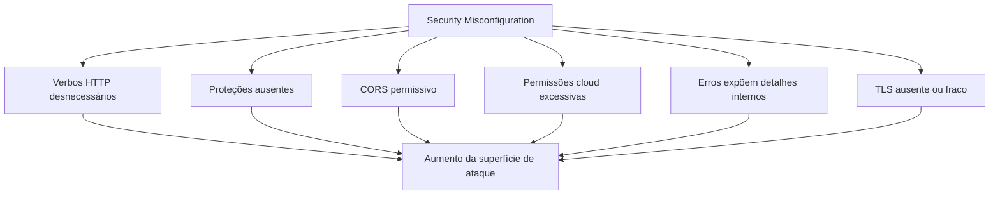

### Diagrama 2

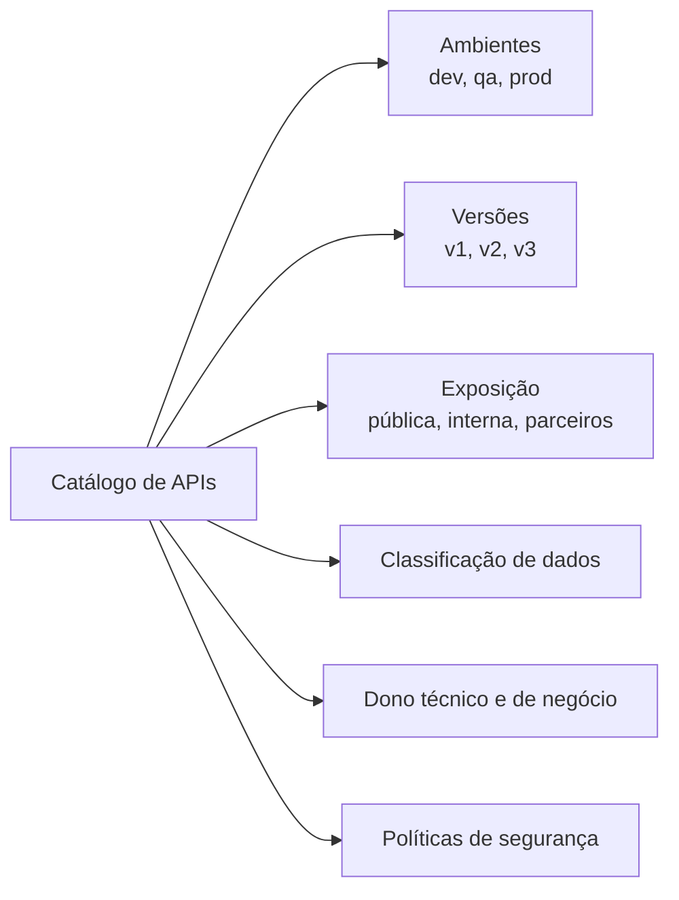

### Diagrama 3

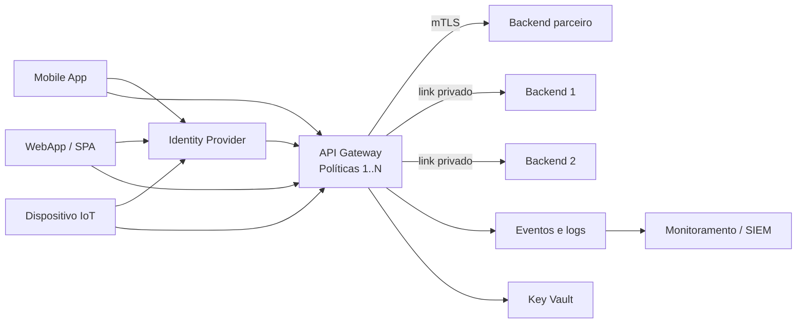

## Capítulo 8 - Desenvolvimento Seguro para Aplicativos Mobile

### Diagrama 1

```mermaid
mindmap
  root((OWASP MASVS))
    STORAGE
      Dados sensíveis em repouso
      Prevenção de vazamentos
    CRYPTO
      Criptografia forte
      Gerenciamento de chaves
    AUTH
      Autenticação
      Autorização
    NETWORK
      TLS
      Pinning
    PLATFORM
      IPC
      WebViews
      UI segura
    CODE
      Plataforma atualizada
      SCA
      Sanitização
    RESILIENCE
      Anti-tamper
      Anti-reverse engineering
    PRIVACY
      Minimização
      Transparência
      Controle do usuário
```

### Diagrama 2

```mermaid
flowchart TB
    Dados["Dados sensíveis"] --> Store{Precisa armazenar?}
    Store -->|Não| NoStore["Não armazenar"]
    Store -->|Sim| Classificar["Classificar sensibilidade"]
    Classificar --> Secure["Armazenamento seguro\nKeystore / Keychain / storage criptografado"]
    Secure --> Leak["Prevenir vazamento\nlogs, backups, analytics, cache"]
    Leak --> Retention["Retenção mínima e descarte seguro"]
```

### Diagrama 3

```mermaid
stateDiagram-v2
    [*] --> Gerada: geração segura
    Gerada --> Armazenada: KeyStore / Keychain / Vault
    Armazenada --> EmUso: uso controlado
    EmUso --> Rotacionada: rotação periódica
    Rotacionada --> EmUso
    EmUso --> Revogada: incidente ou expiração
    Revogada --> Descartada: descarte seguro
    Descartada --> [*]
```

## Capítulo 9 - Autenticação Segura para Aplicativos

### Diagrama 1

```mermaid
flowchart TB
    AUTH["MASVS-AUTH"] --> A1["AUTH-1\nProtocolos seguros de autenticação e autorização"]
    AUTH --> A2["AUTH-2\nAutenticação local segura"]
    AUTH --> A3["AUTH-3\nAutenticação adicional em operações sensíveis"]
```

### Diagrama 2

```mermaid
sequenceDiagram
    participant User as Usuário
    participant App as App Mobile
    participant Local as Biometria/PIN
    participant API as Backend/API
    participant IdP as Identity Provider

    User->>App: Solicita operação sensível
    App->>Local: Exige autenticação local
    Local-->>App: Usuário confirmado
    App->>IdP: Reautenticação ou step-up MFA
    IdP-->>App: Confirmação / token com escopo forte
    App->>API: Envia operação com token válido
    API->>API: Valida autorização e risco
    API-->>App: Operação permitida ou negada
```

### Diagrama 3

```mermaid
flowchart LR
    App["App Mobile"] -->|"token + requisição"| Backend["Backend"]
    App --> Local["Proteções locais\nbiometria, storage seguro, UI segura"]
    Backend --> Server["Proteções servidor\nautorização, sessão, regras, auditoria"]
    Local --> Secure["Segurança composta"]
    Server --> Secure
```

## Capítulo 10 - Protegendo Rede e Plataforma

### Diagrama 1

```mermaid
sequenceDiagram
    participant App as App Mobile
    participant OS as Sistema Operacional
    participant API as API Remota

    App->>API: Inicia conexão TLS
    API-->>App: Envia certificado
    App->>OS: Valida cadeia do certificado
    OS-->>App: Cadeia válida
    App->>App: Verifica pinning da CA/chave esperada
    alt Pinning confere
        App->>API: Envia requisição segura
        API-->>App: Resposta segura
    else Pinning falha
        App-->>App: Bloqueia conexão e registra evento
    end
```

### Diagrama 2

```mermaid
flowchart TB
    Plataforma["MASVS-PLATFORM"] --> IPC["IPC seguro\nExpor apenas o necessário"]
    Plataforma --> WebView["WebViews seguras\nSem pontes perigosas e origens abertas"]
    Plataforma --> UI["UI segura\nSem vazamento por screenshot, multitarefa ou notificação"]
```

## Capítulo 11 - Protegendo Código e Versões do App

### Diagrama 1

```mermaid
flowchart TB
    CODE["MASVS-CODE"] --> C1["CODE-1\nVersão atualizada da plataforma"]
    CODE --> C2["CODE-2\nMecanismo para forçar atualização"]
    CODE --> C3["CODE-3\nComponentes sem vulnerabilidades conhecidas"]
    CODE --> C4["CODE-4\nValidação e sanitização de entradas"]
```

### Diagrama 2

```mermaid
sequenceDiagram
    participant App as App antigo
    participant Config as Serviço de configuração
    participant Store as Loja de aplicativos
    participant User as Usuário

    App->>Config: Consulta versão mínima permitida
    Config-->>App: Versão mínima = 5.2.0
    alt App abaixo da versão mínima
        App-->>User: Bloqueia uso e solicita atualização
        User->>Store: Atualiza aplicativo
    else App atualizado
        App-->>User: Permite uso normal
    end
```

### Diagrama 3

```mermaid
flowchart LR
    Commit["Commit"] --> SAST["SAST"]
    Commit --> SCA["SCA"]
    SAST --> Tests["Testes automatizados"]
    SCA --> Tests
    Tests --> Build["Build assinado"]
    Build --> RASP["Proteções runtime / ofuscação"]
    RASP --> Release["Publicação"]
    Release --> Monitor["Monitoramento de crash, fraude e versão"]
    Monitor --> Force["Atualização forçada se necessário"]
```

## Capítulo 12 - Engenharia Reversa e Resiliência

### Diagrama 1

```mermaid
flowchart TB
    RES["MASVS-RESILIENCE"] --> R1["RESILIENCE-1\nValidação da integridade da plataforma"]
    RES --> R2["RESILIENCE-2\nMecanismos anti-adulteração"]
    RES --> R3["RESILIENCE-3\nAnti-análise estática"]
    RES --> R4["RESILIENCE-4\nAnti-análise dinâmica"]
```

### Diagrama 2

```mermaid
flowchart LR
    Build["Build assinado"] --> RASP["Implantar RASP"]
    RASP --> Runtime["Executar app"]
    Runtime --> Detect["Detectar ameaças\nroot, hook, tamper, debugger"]
    Detect --> Decision{Ameaça?}
    Decision -->|Não| Continue["Continua execução"]
    Decision -->|Sim| Response["Bloqueia, encerra, reduz funcionalidade ou alerta"]
    Response --> SIEM["Evento para análise"]
    SIEM --> Improve["Aprimorar defesas"]
    Improve --> Build
```

### Diagrama 3

```mermaid
flowchart TB
    Obfuscate["Ofuscar código"] --> Rasp["Implantar RASP"]
    Rasp --> Detect["Detectar ameaças"]
    Detect --> Prevent["Prevenir ataques"]
    Prevent --> Learn["Analisar tentativas"]
    Learn --> Obfuscate
```

## Capítulo 13 - Controles sobre Privacidade

### Diagrama 1

```mermaid
flowchart TB
    Privacy["MASVS-PRIVACY"] --> P1["PRIVACY-1\nMinimização de acesso"]
    Privacy --> P2["PRIVACY-2\nPrevenção da identificação"]
    Privacy --> P3["PRIVACY-3\nTransparência sobre coleta e uso"]
    Privacy --> P4["PRIVACY-4\nControle do usuário sobre dados"]
```

### Diagrama 2

```mermaid
flowchart LR
    Real["Identidade real\nCPF, nome, e-mail"] --> Separacao["Separação de contexto"]
    Separacao --> Pseudo["ID pseudônimo"]
    Pseudo --> Analytics["Analytics / métricas"]
    Real -.restrito.-> Backend["Backend protegido"]
```

### Diagrama 3

```mermaid
flowchart TB
    User["Usuário"] --> Preferences["Gerenciar preferências"]
    User --> Consent["Revogar consentimento"]
    User --> Access["Acessar dados"]
    User --> Delete["Solicitar exclusão"]
    Delete --> Legal{Existe base legal de retenção?}
    Legal -->|Sim| Justify["Informar retenção necessária"]
    Legal -->|Não| Remove["Excluir ou anonimizar"]
```
