# Secure Development - Documento Consolidado

Material consolidado para revisão e consulta.


---


# Capítulo 1 - Introdução ao Desenvolvimento Seguro

## Objetivo

Entender por que desenvolvimento seguro não é responsabilidade isolada de uma pessoa ou de uma única equipe. O capítulo apresenta a disciplina, a importância de tratar segurança desde o início do ciclo de desenvolvimento e o conceito de **defesa em profundidade**.

## Ideia central para prova

Desenvolvimento seguro é uma prática compartilhada entre **desenvolvimento, segurança e operações**. Uma aplicação não está segura apenas porque o código está bem escrito, nem apenas porque a infraestrutura está protegida. A segurança depende do conjunto: código, dependências, banco de dados, rede, identidade, monitoração, processos e pessoas.

## Conceitos essenciais

### Desenvolvimento seguro

É o conjunto de práticas que busca reduzir vulnerabilidades durante todo o ciclo de vida do software. O foco não é apenas corrigir falhas depois que o sistema está em produção, mas prevenir brechas desde requisitos, arquitetura, implementação, testes, deploy, operação e monitoramento.

O maior risco é presumir que o código, o pipeline, o ambiente de publicação e os componentes usados estão livres de vulnerabilidades. Sistemas modernos têm muitas dependências, bibliotecas, serviços em nuvem, APIs, integrações e permissões. Por isso, a segurança precisa ser validada continuamente.

### DevSecOps

DevSecOps representa a integração de segurança ao fluxo de desenvolvimento e operação. A segurança deixa de ser uma etapa final e passa a fazer parte do processo diário.

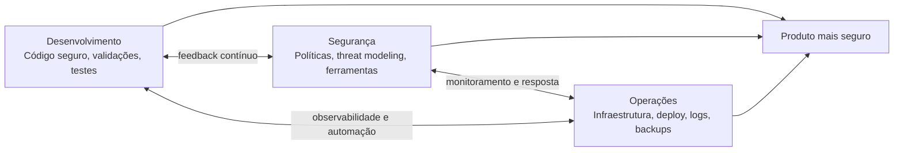

### O problema do esforço isolado

Se o desenvolvedor usa frameworks atualizados, valida entradas e evita falhas conhecidas, mas o banco de dados fica exposto na internet com senha fraca, o sistema continua vulnerável. Da mesma forma, se o banco está isolado, mas o código usa uma versão vulnerável de framework ou expõe segredo no repositório, o risco permanece.

A conclusão é simples: **segurança precisa de colaboração**.

## Defesa em profundidade

Defesa em profundidade é uma estratégia que usa múltiplas camadas de proteção. A ideia é semelhante a sistemas críticos com redundância: se uma barreira falhar, outra camada ainda pode impedir ou reduzir o impacto do ataque.

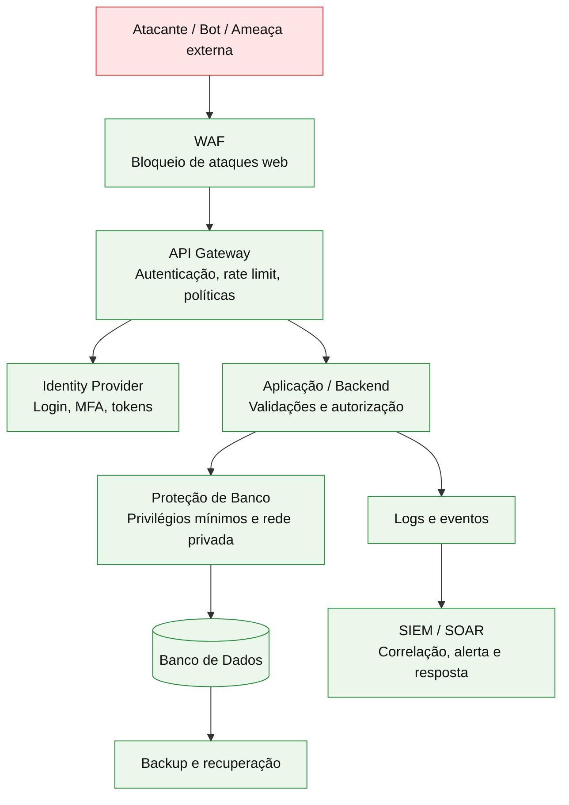

## Camadas comuns de proteção

| Camada | Função |
|---|---|
| Banco de dados | Isolamento de rede, controle de acesso, criptografia, backup. |
| Aplicação/backend | Validação de entrada, autorização, tratamento de erros, logs seguros. |
| API Gateway | Ponto central para autenticação, rate limiting, políticas e roteamento. |
| Identity Provider | Gestão de identidade, login seguro, MFA, emissão e validação de tokens. |
| WAF | Proteção contra ataques comuns em aplicações web. |
| SIEM/SOAR | Detecção, correlação de eventos e automação de resposta a incidentes. |
| Backup | Recuperação em caso de comprometimento, ransomware ou falha operacional. |

## Como aplicar na prática

Em um projeto real, uma boa abordagem é revisar a aplicação sob três visões. Primeiro, o código: dependências, validações, erros, autenticação, autorização e segredos. Segundo, a infraestrutura: rede, firewall, banco, permissões, TLS e exposição pública. Terceiro, a operação: logs, alertas, incidentes, backup, atualização de patches e resposta a anomalias.

## Checklist de revisão

- O código valida entradas vindas de usuário, rede, arquivos e integrações?
- Existem segredos, senhas ou tokens no repositório?
- As dependências estão atualizadas e sem CVEs conhecidas críticas?
- O banco de dados não está exposto publicamente?
- A API exige autenticação e autorização adequadas?
- Existe MFA para contas privilegiadas?
- Logs e eventos são monitorados?
- Há backup e plano de recuperação testado?

## Questões de fixação

1. O que significa DevSecOps?
   - Resposta: colaboração entre desenvolvimento, segurança e operações para incorporar segurança ao ciclo de vida do software.

2. Por que apenas proteger o banco de dados não basta?
   - Resposta: porque vulnerabilidades no código, dependências ou APIs podem expor dados mesmo com o banco isolado.

3. O que é defesa em profundidade?
   - Resposta: uso de múltiplas camadas de proteção para que uma falha isolada não comprometa todo o sistema.

## Erros comuns

- Acreditar que segurança é responsabilidade exclusiva da equipe de segurança.
- Corrigir vulnerabilidades apenas no fim do projeto.
- Não atualizar ferramentas, frameworks e servidores.
- Depender de uma única camada de proteção.


---


# Capítulo 2 - Projeto OWASP

## Objetivo

Conhecer o OWASP como referência global em segurança de aplicações, entender por que seus guias são usados pelo mercado e identificar os principais projetos citados no material.

## Ideia central para prova

O OWASP é uma organização aberta, comunitária e sem fins lucrativos que fornece padrões, guias, ferramentas e materiais gratuitos para melhorar a segurança de software. Em uma resposta de prova, associe OWASP a **boas práticas abertas**, **comunidade global** e **referência de mercado**.

## O que é OWASP

OWASP significa **Open Worldwide Application Security Project**. É uma comunidade global voltada a ajudar organizações a desenvolver, adquirir, testar e manter aplicações confiáveis. Seus recursos são abertos e gratuitos, o que facilita a adoção por times de desenvolvimento, segurança, arquitetura, QA e gestão.

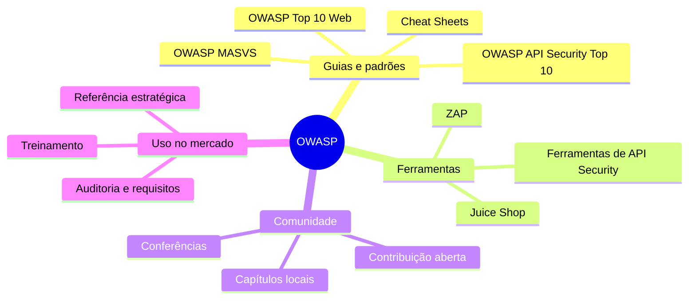

## Por que o OWASP é importante

O OWASP ajuda a transformar segurança em uma linguagem comum. Quando uma equipe fala em BOLA, Broken Authentication, XSS, SQL Injection, Security Misconfiguration ou MASVS, está usando uma taxonomia compreensível por profissionais de diferentes empresas e países.

Essa padronização facilita:

- justificar decisões técnicas para gestores;
- priorizar vulnerabilidades;
- definir requisitos de segurança;
- treinar desenvolvedores;
- criar checklists de auditoria;
- alinhar times de Dev, Sec e Ops.

## Projetos OWASP citados no curso

| Projeto | Finalidade |
|---|---|
| OWASP Top 10 Web | Lista de riscos críticos para aplicações web. |
| OWASP API Security Top 10 | Lista de riscos críticos específicos de APIs. |
| OWASP MASVS | Padrão de verificação de segurança para aplicativos móveis. |
| OWASP Juice Shop | Aplicação vulnerável usada para treinamento, SAST, DAST e prática. |
| OWASP Cheat Sheets | Guias práticos por tema, como autenticação, senhas, logging, sessões etc. |

## OWASP Top 10 Web x OWASP API Security Top 10

É comum confundir os dois. O OWASP Top 10 Web trata riscos gerais de aplicações web. Já o OWASP API Security Top 10 trata riscos próprios de APIs, como autorização no nível de objeto, autenticação quebrada, autorização no nível de propriedade, consumo irrestrito de recursos e inventário inadequado de APIs.

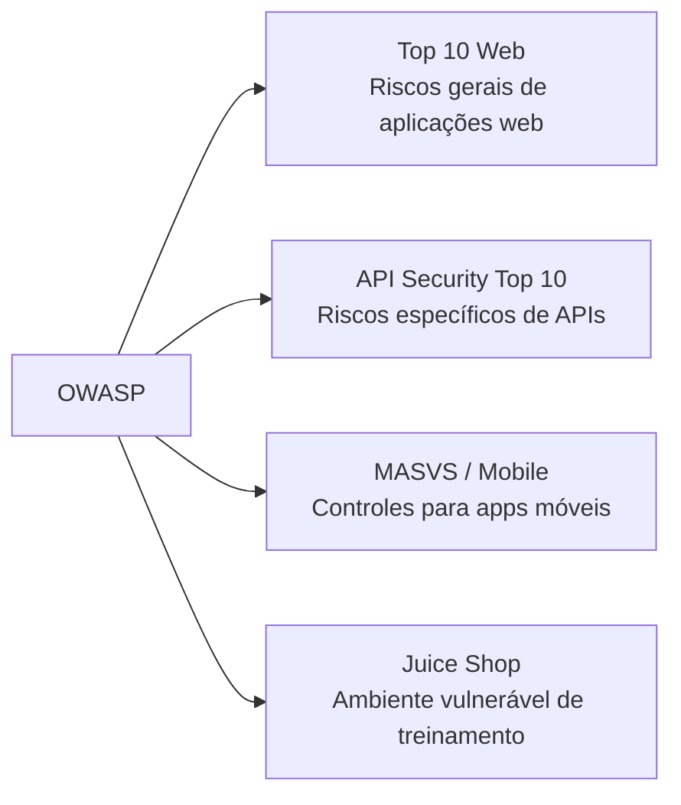

## OWASP Juice Shop

O OWASP Juice Shop é uma aplicação intencionalmente vulnerável. Ela simula uma loja virtual e contém falhas de segurança para treinamento, demonstrações, CTFs e validação de ferramentas de segurança. No contexto do curso, ele é usado como projeto de exemplo para análise estática, análise de dependências e entendimento de vulnerabilidades reais.

## Como aplicar na prática

Use o OWASP como fonte para criar checklists técnicos. Por exemplo, em uma API REST, use o OWASP API Security Top 10 para revisar autorização, autenticação, rate limiting, configurações e inventário. Em um app mobile, use MASVS para revisar armazenamento, criptografia, autenticação, rede, plataforma, código, resiliência e privacidade.

## Checklist de revisão

- Sei explicar o que é OWASP?
- Sei diferenciar OWASP Top 10 Web, API Security Top 10 e MASVS?
- Consigo citar pelo menos três projetos OWASP?
- Entendo por que OWASP é usado como referência estratégica?
- Sei que os recursos OWASP são abertos e mantidos pela comunidade?

## Questões de fixação

1. Qual é o objetivo do OWASP?
   - Resposta: melhorar a segurança de software por meio de recursos abertos e gratuitos.

2. O OWASP é uma ferramenta paga?
   - Resposta: não. É uma comunidade e organização sem fins lucrativos com recursos abertos.

3. Para que serve o OWASP Juice Shop?
   - Resposta: para treinamento e prática em uma aplicação intencionalmente vulnerável.

## Erros comuns

- Tratar OWASP como um produto comercial.
- Usar o Top 10 Web como se fosse equivalente ao Top 10 de APIs.
- Achar que seguir OWASP elimina todos os riscos. OWASP orienta e prioriza, mas não substitui análise de risco, testes e arquitetura segura.


---


# Capítulo 3 - Tornando o Código Fonte Mais Seguro: Repositório, SAST e SCA

## Objetivo

Entender práticas para proteger o código fonte, com foco em repositório seguro, análise estática de código (**SAST**), análise de composição de software (**SCA**) e uso de bases de vulnerabilidades como **CVE** e **CWE**.

## Ideia central para prova

SAST analisa o código fonte estático em busca de vulnerabilidades no código escrito pela equipe. SCA analisa bibliotecas, dependências e componentes de terceiros em busca de vulnerabilidades conhecidas. Os dois são complementares.

## Segurança do repositório

O repositório é um ativo crítico. Ele contém o código fonte, histórico de commits, configurações, pipelines, scripts, chaves acidentalmente versionadas e documentação técnica. Se o repositório vazar, um atacante pode estudar o sistema, encontrar segredos, descobrir endpoints internos e entender regras de negócio.

Boas práticas:

- usar controle de acesso por menor privilégio;
- exigir MFA para contas de desenvolvedores e administradores;
- revisar visibilidade de repositórios privados;
- manter servidores GitLab/GitHub Enterprise/Azure DevOps atualizados;
- evitar segredos versionados;
- proteger branches principais;
- auditar acessos e alterações;
- manter backup.

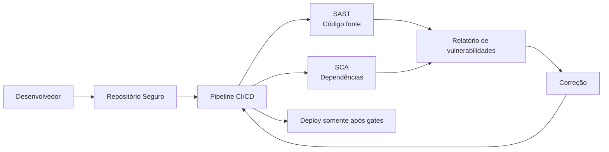

## SAST - Static Application Security Testing

SAST é análise estática de segurança. A ferramenta examina o código sem executar a aplicação. Ela procura padrões perigosos, fluxos de dados suspeitos, uso inseguro de APIs, validações ausentes, injeção de SQL, XSS, secrets hardcoded, algoritmos fracos e outros problemas.

### Onde executar SAST

| Local | Vantagem |
|---|---|
| IDE | Feedback imediato ao desenvolvedor. |
| Pull Request | Impede entrada de vulnerabilidades novas. |
| Pipeline CI/CD | Gera gate de qualidade e segurança antes do deploy. |
| Auditoria periódica | Ajuda a revisar código legado. |

### Exemplos de ferramentas

O material cita Snyk, Checkmarx, SonarQube e VeraCode. A escolha depende de orçamento, linguagem, integração com IDE, qualidade das regras, suporte a pipeline e maturidade da empresa.

## SCA - Software Composition Analysis

SCA verifica bibliotecas e componentes de código aberto usados pela aplicação. Em um projeto Node.js, por exemplo, a ferramenta analisa arquivos como `package.json` e `package-lock.json`. Em Java, pode analisar `pom.xml` ou `build.gradle`.

O objetivo é responder:

- Quais bibliotecas usamos?
- Quais versões estão vulneráveis?
- Existe versão corrigida?
- A vulnerabilidade é crítica, alta, média ou baixa?
- A biblioteca ainda é mantida?

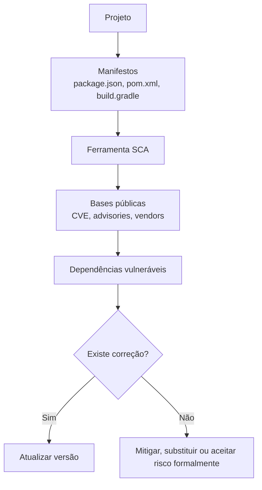

## CVE e CWE

### CVE

CVE significa **Common Vulnerabilities and Exposures**. É uma identificação padronizada para vulnerabilidades conhecidas. Um exemplo de formato é `CVE-2025-1234`.

### CWE

CWE significa **Common Weakness Enumeration**. Diferente da CVE, que identifica uma vulnerabilidade específica, a CWE classifica fraquezas de software. Por exemplo: validação insuficiente, exposição de informação sensível, injeção, falha de autenticação.

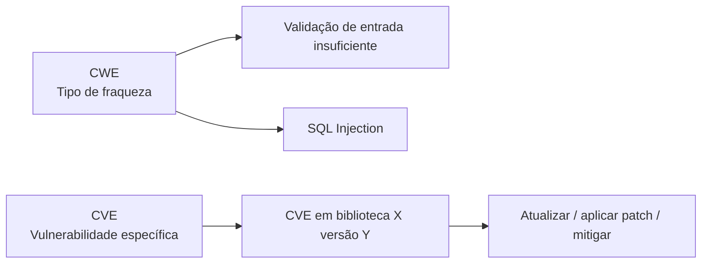

## Severidade, impacto e explorabilidade

Ferramentas de SAST/SCA classificam achados com atributos úteis para priorização:

| Atributo | Exemplo |
|---|---|
| Severidade | Critical, High, Medium, Low. |
| Tipo | SQL Injection, XSS, CSRF, erro de autenticação. |
| Impacto | Confidencialidade, integridade, disponibilidade. |
| Facilidade de exploração | Fácil, moderada, difícil. |
| Localização | Arquivo, linha, dependência e versão. |
| Recomendação | Atualização, validação, sanitização, troca de algoritmo. |

Uma vulnerabilidade crítica e fácil de explorar deve ser priorizada antes de uma falha baixa e difícil de explorar.

## Exemplo de achado SAST

| Campo | Valor exemplo |
|---|---|
| ID | CVE-2025-1234 |
| Severidade | Alta |
| Tipo | SQL Injection |
| Impacto | Confidencialidade |
| Exploração | Fácil |
| Localização | `/src/Login.java`, linha 10 |
| Recomendação | Validar entrada e usar consulta parametrizada |

## Checklist de revisão

- Repositórios privados estão realmente privados?
- Há MFA para acesso ao Git?
- Existem secrets hardcoded no repositório?
- SAST roda na IDE e no pipeline?
- SCA roda no pipeline?
- Dependências críticas são bloqueadas antes do deploy?
- Existe processo para atualizar bibliotecas vulneráveis?
- Achados têm dono, prazo e rastreabilidade?

## Questões de fixação

1. O que SAST analisa?
   - Resposta: o código fonte estático, sem executar a aplicação.

2. O que SCA analisa?
   - Resposta: bibliotecas e componentes de terceiros usados no projeto.

3. Qual a diferença entre CVE e CWE?
   - Resposta: CVE identifica vulnerabilidades específicas; CWE classifica tipos de fraquezas.

4. Por que repositório seguro é importante?
   - Resposta: porque o código fonte revela arquitetura, regras de negócio, segredos acidentais e potenciais vetores de ataque.

## Erros comuns

- Usar SAST uma única vez, apenas antes da entrega.
- Ignorar vulnerabilidades em dependências porque “não estão no nosso código”.
- Aceitar secrets no repositório.
- Corrigir apenas achados críticos sem criar processo contínuo.


---


# Capítulo 4 - Ameaças em APIs e Broken Object Level Authorization (BOLA)

## Objetivo

Entender por que APIs são pontos críticos de exposição, conhecer os principais riscos do OWASP API Security Top 10 2023 e aprofundar o risco **API1:2023 - Broken Object Level Authorization (BOLA)**.

## Ideia central para prova

APIs são portas de entrada para dados e transações. O risco BOLA ocorre quando a API aceita um identificador de objeto vindo da requisição e não verifica se o usuário autenticado tem permissão para acessar aquele objeto.

## APIs como superfície de ataque

Aplicações modernas usam APIs em microserviços, arquitetura orientada a eventos, serverless, MVC/monolitos, aplicações mobile, desktop e IoT. Mesmo quando o backend e o banco estão em rede privada, o frontend normalmente se comunica com APIs expostas à internet ou a redes de parceiros.

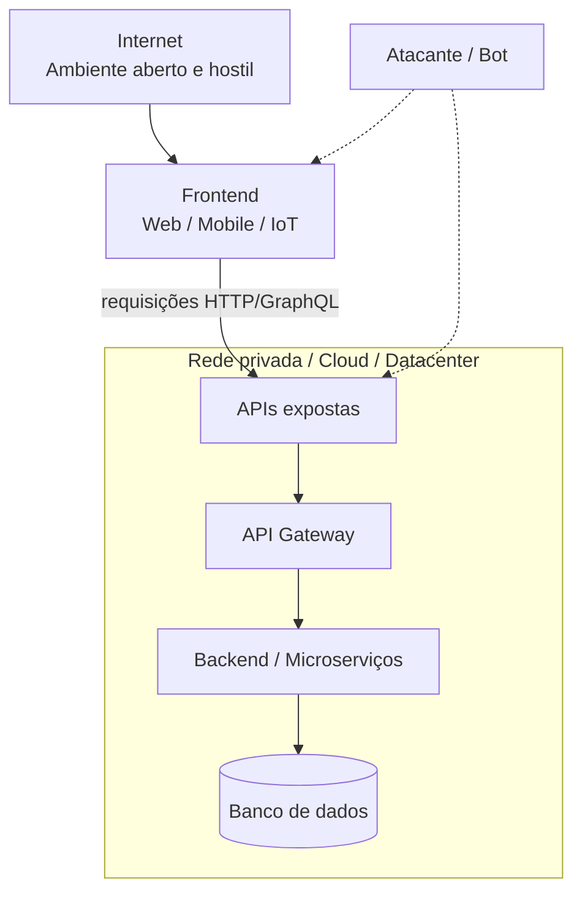

## Por que proteger APIs

| Motivo | Explicação |
|---|---|
| Dados sensíveis | APIs manipulam dados pessoais, financeiros, médicos e corporativos. |
| Integridade | APIs executam transações e alteram estado do sistema. |
| Prevenção de ataques | APIs são alvo de vazamento, roubo de identidade, DoS e manipulação. |
| Conformidade | LGPD, PCI, GDPR e outras normas exigem proteção de dados. |
| Confiança | Falhas em APIs prejudicam reputação e continuidade do negócio. |

## OWASP API Security Top 10 2023

| Ordem | Risco |
|---:|---|
| 1 | Broken Object Level Authorization |
| 2 | Broken Authentication |
| 3 | Broken Object Property Level Authorization |
| 4 | Unrestricted Resource Consumption |
| 5 | Broken Function Level Authorization |
| 6 | Unrestricted Access to Sensitive Business Flows |
| 7 | Server Side Request Forgery (SSRF) |
| 8 | Security Misconfiguration |
| 9 | Improper Inventory Management |
| 10 | Unsafe Consumption of APIs |

## BOLA - Broken Object Level Authorization

BOLA ocorre quando um atacante manipula o identificador de um objeto para acessar recurso de outro usuário. O problema não é o uso de ID em si; o problema é a falta de autorização no backend.

Exemplo conceitual:

```http
GET /api/employee/0035/salary
Authorization: Bearer token-do-jose
```

Se José troca `0035` por `0036` e consegue ver o salário de Maria, existe BOLA.

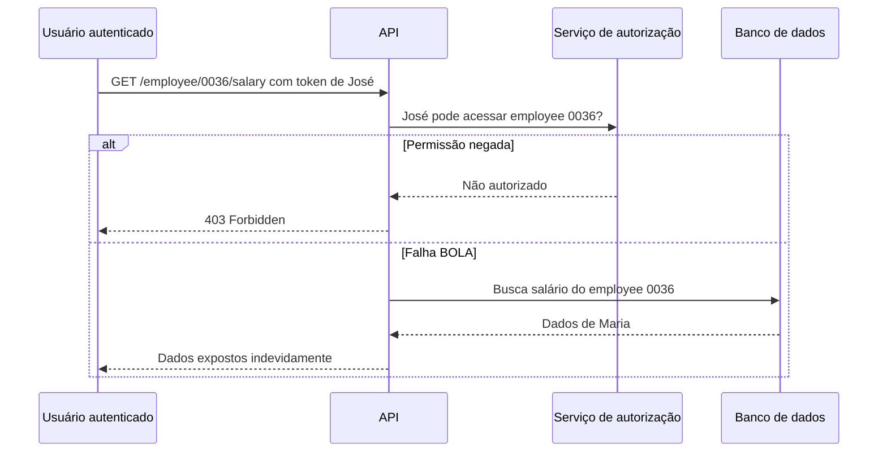

## Possíveis impactos

- acesso a dados restritos;
- vazamento de dados pessoais ou financeiros;
- manipulação indevida de dados;
- perda de controle de conta;
- violação regulatória;
- dano reputacional.

## Como prevenir BOLA

### 1. Autorização baseada em políticas

A API deve verificar autorização em cada função que acessa dados usando identificadores fornecidos pelo usuário. Não basta validar que o token existe; é preciso validar se o usuário tem direito sobre aquele recurso.

### 2. Nunca confiar apenas no ID da URL

O ID da URL deve ser tratado como entrada não confiável. O backend deve comparar o usuário autenticado com o dono do recurso ou com as regras de hierarquia.

### 3. Usar identificadores imprevisíveis

GUIDs/UUIDs reduzem a facilidade de enumeração, mas não substituem autorização. Eles são uma camada adicional, não a defesa principal.

### 4. Testes automatizados de autorização

Crie testes para garantir que um usuário não consiga acessar dados de outro. Esses testes devem rodar no pipeline antes de produção.

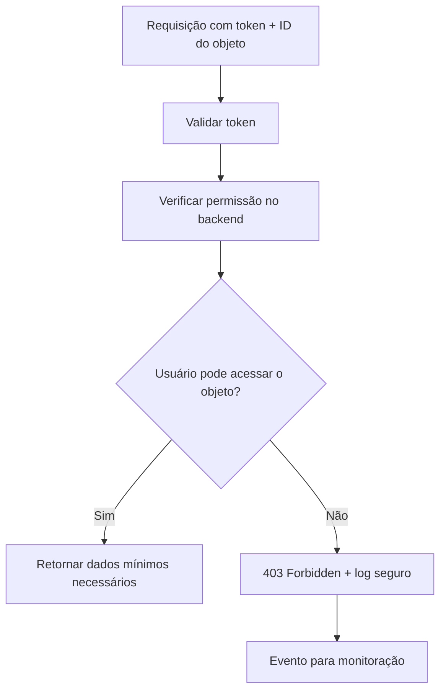

## Checklist de revisão

- Todo endpoint que recebe ID valida autorização sobre o objeto?
- O backend consulta o dono do recurso antes de retornar dados?
- IDs sequenciais são evitados quando possível?
- Existe teste automatizado para acesso cruzado entre usuários?
- Erros de autorização retornam 403 sem expor detalhes internos?
- Há logs de tentativa de acesso indevido?

## Questões de fixação

1. O que é BOLA?
   - Resposta: falha de autorização no nível de objeto que permite acessar dados de outros usuários manipulando identificadores.

2. UUID resolve BOLA sozinho?
   - Resposta: não. Ajuda contra enumeração, mas autorização no backend continua obrigatória.

3. Autenticação é suficiente para evitar BOLA?
   - Resposta: não. O usuário pode estar autenticado e ainda assim não ter permissão sobre aquele objeto.

## Erros comuns

- Validar apenas se o token JWT é válido.
- Presumir que o frontend impedirá acesso indevido.
- Usar IDs imprevisíveis sem verificar autorização.
- Não testar acesso cruzado entre usuários.


---


# Capítulo 5 - Detalhando a Autenticação em APIs

## Objetivo

Compreender o risco **Broken Authentication**, diferenciar autenticação de autorização, entender o papel de Identity Providers, OAuth 2.0, SAML, tokens e fluxos de autenticação em APIs.

## Ideia central para prova

Autenticação responde **quem é o usuário ou cliente**. Autorização responde **o que ele pode acessar**. OAuth 2.0 é primariamente um protocolo de autorização, não de autenticação. Tokens precisam ser validados quanto à assinatura, expiração, emissor e escopo.

## Broken Authentication

Broken Authentication ocorre quando mecanismos de autenticação são implementados incorretamente, permitindo que atacantes comprometam tokens, explorem senhas fracas ou assumam identidades de outros usuários.

Exemplos de falhas:

- ausência de mitigação contra força bruta;
- credential stuffing sem bloqueio ou CAPTCHA;
- tokens JWT sem validação adequada;
- tokens sem assinatura ou com algoritmo inseguro;
- senhas fracas aceitas;
- alteração de e-mail sem reautenticação;
- API keys expostas no frontend;
- ausência de MFA em operações críticas.

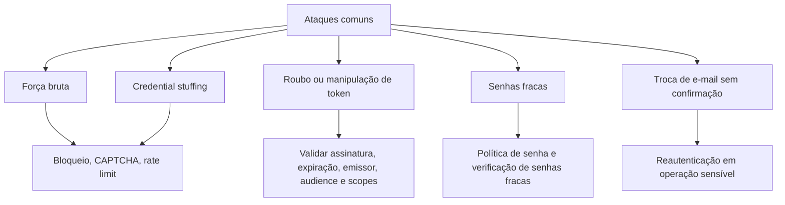

## Autenticação x Autorização

| Conceito | Pergunta que responde | Exemplo |
|---|---|---|
| Autenticação | Quem é você? | Login com usuário/senha, biometria, MFA. |
| Autorização | O que você pode fazer? | Acessar salário, alterar conta, consultar pedido. |

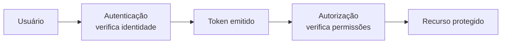

## OAuth 2.0, OpenID Connect e SAML

OAuth 2.0 permite que uma aplicação acesse recursos em nome de um usuário usando tokens, sem receber diretamente a senha do usuário. Para autenticação de usuário sobre OAuth 2.0, normalmente entra o **OpenID Connect**, que adiciona camada de identidade. SAML é um protocolo baseado em XML muito usado em SSO corporativo.

## Identity Providers

Um Identity Provider centraliza autenticação, emissão de tokens, MFA, política de senha, federação e integração com diretórios corporativos. Exemplos citados no material incluem Microsoft Entra ID, AWS Cognito, Google Login, Keycloak, Okta e Auth0.

A recomendação é não reinventar autenticação, geração de tokens ou armazenamento de senhas. Use soluções consolidadas, padrões conhecidos e bibliotecas maduras.

## Fluxo usuário e senha

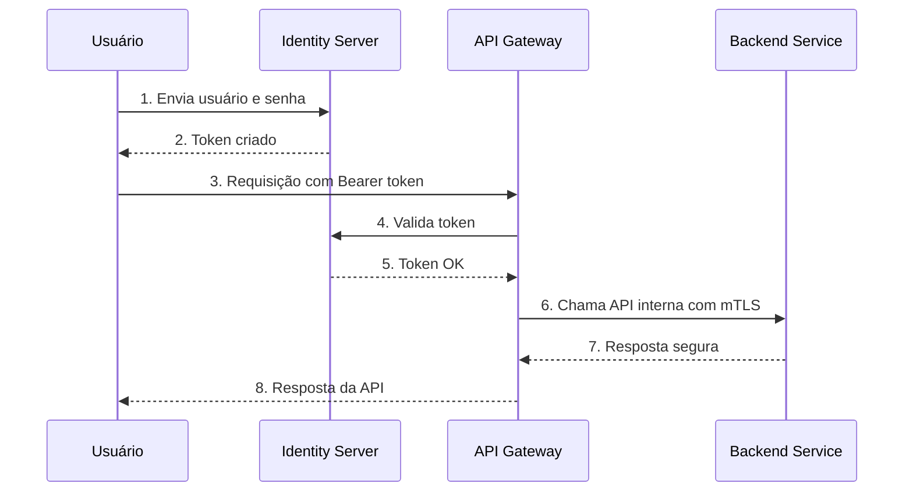

## Fluxo client secret

Usado para comunicação entre sistemas, parceiros ou clientes B2B. Não deve ser confundido com autenticação de usuário final.

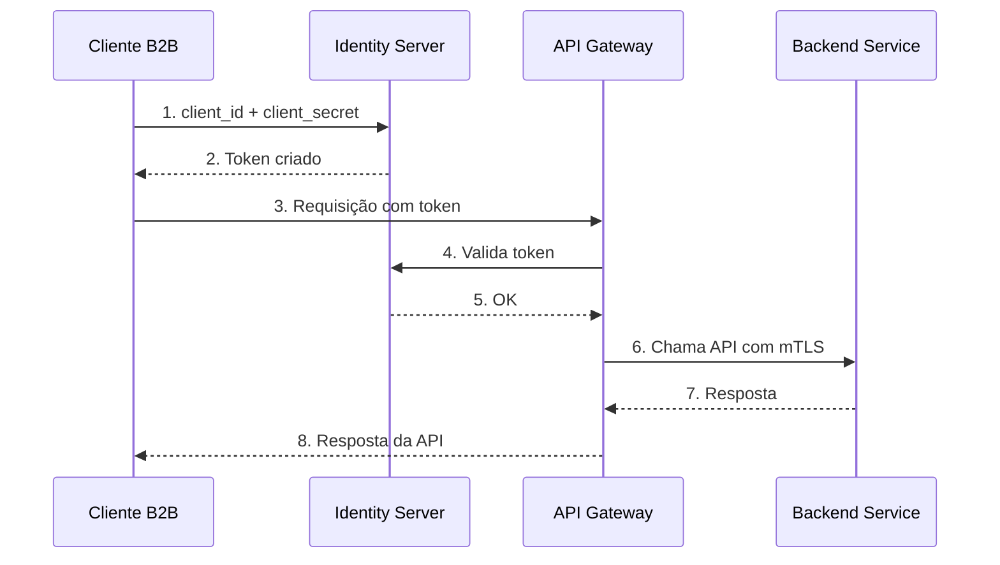

## Boas práticas de prevenção

- Usar Identity Provider consolidado.
- Entender o protocolo adotado, sem confundir autenticação com autorização.
- Validar tokens no backend ou no gateway.
- Exigir reautenticação para operações sensíveis.
- Implementar MFA quando possível.
- Aplicar bloqueio de conta, CAPTCHA e rate limiting contra força bruta.
- Não usar API keys para autenticar usuários finais.
- Não expor secrets no frontend.
- Usar mTLS para integrações críticas entre serviços.

## Checklist de revisão

- Tokens têm assinatura validada?
- Tokens têm expiração curta e refresh controlado?
- A API valida issuer, audience e scopes?
- Operações sensíveis exigem reautenticação?
- Há proteção contra brute force e credential stuffing?
- API keys estão restritas a clientes de API e não a usuários finais?
- Existem logs de falhas de autenticação sem expor dados sensíveis?

## Questões de fixação

1. OAuth 2.0 é autenticação?
   - Resposta: não. OAuth 2.0 é primariamente autorização; autenticação costuma ser feita com OpenID Connect sobre OAuth 2.0.

2. API key deve autenticar usuário mobile/web?
   - Resposta: não. API key é adequada para cliente de API, especialmente cenários B2B, não para usuário final.

3. O que é reautenticação em operação sensível?
   - Resposta: exigir confirmação adicional de identidade antes de ações críticas, como trocar e-mail, telefone 2FA ou realizar transação financeira.

## Erros comuns

- Validar apenas presença do token, sem checar assinatura e expiração.
- Guardar secrets no frontend.
- Permitir alteração de e-mail sem senha atual ou MFA.
- Confundir autenticação com autorização.


---


# Capítulo 6 - Tampering em APIs e Consumo Irrestrito de Recursos

## Objetivo

Estudar o risco **Broken Object Property Level Authorization**, associado a exposição excessiva de dados e mass assignment, e o risco **Unrestricted Resource Consumption**, associado a abuso de recursos computacionais e financeiros.

## Ideia central para prova

Nunca confie nos dados vindos do frontend. O backend deve decidir quais propriedades podem ser lidas ou alteradas. Além disso, APIs precisam limitar consumo para evitar DoS, custos indevidos e abuso de serviços pagos como SMS, e-mail, biometria ou LLMs.

## Tampering

Tampering é a manipulação não autorizada de dados, parâmetros ou payloads. Em APIs, ocorre quando o atacante altera campos enviados na requisição para induzir comportamento indevido.

Exemplo: o frontend envia apenas `description`, mas o atacante adiciona `blocked: false` ao payload para desbloquear conteúdo.

```http
PUT /api/video/update_video
{
  "description": "Um vídeo sobre gatos",
  "blocked": false
}
```

Se a API aceita automaticamente qualquer propriedade enviada pelo cliente, existe risco de **mass assignment**.

## Broken Object Property Level Authorization

Esse risco combina problemas antes tratados separadamente como **Excessive Data Exposure** e **Mass Assignment**. O foco é a falta de autorização no nível das propriedades do objeto.

A API é vulnerável quando:

- retorna propriedades sensíveis que o usuário não deveria ver;
- permite alterar propriedades que o usuário não deveria modificar;
- converte objetos internos completos para JSON sem filtro;
- aceita payloads genéricos e vincula automaticamente campos do cliente ao domínio interno.

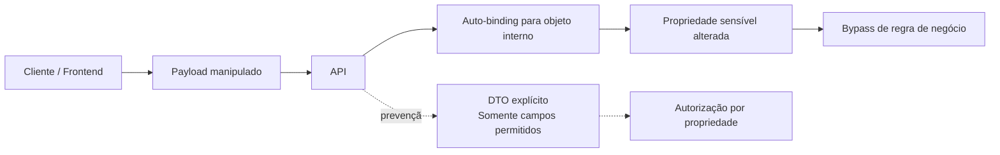

## Prevenção contra manipulação

- Tratar todo dado do frontend como não confiável.
- Usar DTOs específicos para entrada e saída.
- Permitir atualização apenas de propriedades autorizadas.
- Evitar `to_json()` ou serialização completa de objetos de domínio.
- Retornar apenas os campos necessários para a tela ou caso de uso.
- Validar resposta com schema quando aplicável.
- Registrar tentativas de alteração de campos proibidos.

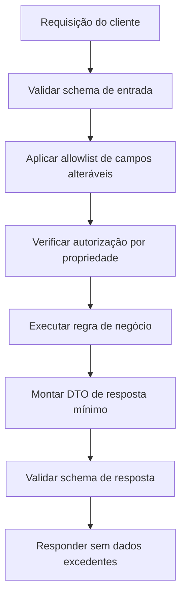

## Consumo irrestrito de recursos

APIs consomem CPU, memória, disco, rede, banco, filas, e também recursos cobrados por terceiros: envio de SMS, e-mail, validação biométrica, chamadas telefônicas, OCR, processamento de imagem, modelos de IA e LLMs.

Um atacante pode abusar de endpoints desprotegidos para gerar custos, indisponibilidade ou dano reputacional.

Exemplos:

- automatizar recuperação de senha para enviar milhares de SMS;
- usar endpoint SMTP para disparar phishing;
- enviar imagens enormes para esgotar memória;
- chamar endpoint de LLM caro de forma massiva;
- agrupar múltiplas operações em uma única chamada GraphQL para burlar limites.

## Prevenção contra consumo irrestrito

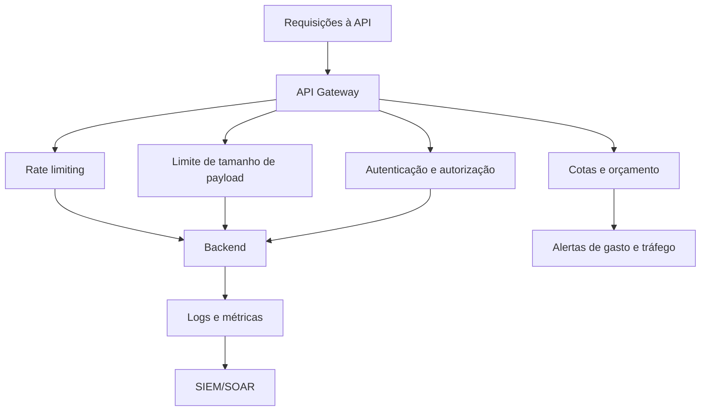

Medidas principais:

- implementar rate limiting por IP, usuário, cliente e endpoint;
- limitar tamanho de payload, uploads e profundidade de GraphQL;
- aplicar autenticação e autorização em recursos caros;
- configurar cotas por cliente ou plano;
- configurar alertas de custo por hora/dia;
- monitorar padrões anômalos;
- retornar erro adequado quando limites forem excedidos;
- diferenciar picos legítimos, como Black Friday, de comportamento malicioso.

## Checklist de revisão

- Endpoints aceitam apenas campos permitidos?
- Respostas retornam apenas dados necessários?
- Existe validação por schema?
- A API bloqueia mass assignment?
- Há rate limiting por usuário, IP e cliente?
- Uploads têm limite de tamanho?
- Endpoints caros têm cotas e alertas de gasto?
- GraphQL tem limites de profundidade e complexidade?

## Questões de fixação

1. Por que não confiar no frontend?
   - Resposta: porque payloads podem ser alterados por atacantes, proxies, scripts ou ferramentas de teste.

2. O que é mass assignment?
   - Resposta: vinculação automática de campos enviados pelo cliente a propriedades internas, permitindo alterar campos não autorizados.

3. Como prevenir consumo irrestrito?
   - Resposta: rate limiting, autenticação, autorização, limite de payload, cotas, alertas e monitoramento.

## Erros comuns

- Retornar objeto completo quando a tela precisa de dois campos.
- Aceitar qualquer propriedade do JSON.
- Rate limit apenas por IP, ignorando usuário e token.
- Não configurar alertas de custos em integrações pagas.


---


# Capítulo 7 - Estratégias de Governança e Segurança para APIs

## Objetivo

Estudar dois riscos de governança do OWASP API Security Top 10 2023: **Security Misconfiguration** e **Improper Inventory Management**, além de soluções gerenciadas e ferramentas de segurança para APIs.

## Ideia central para prova

Governança de APIs exige saber quais APIs existem, onde estão, quem pode acessá-las, quais versões estão ativas, quais políticas estão aplicadas e quais dados trafegam. Configurações inseguras e inventário desatualizado aumentam muito a superfície de ataque.

## Security Misconfiguration

APIs e seus ambientes possuem configurações complexas. Em prazos apertados, algumas configurações podem ser ignoradas, abrindo portas para ataques.

Falhas comuns:

- verbos HTTP desnecessários habilitados;
- endpoints sem autenticação;
- permissões de cloud excessivas;
- CORS aberto demais;
- mensagens de erro expondo stack, versões e detalhes internos;
- TLS ausente ou mal configurado;
- serviços desnecessários ativos;
- logs de debug expostos;
- buckets ou storage públicos por engano.

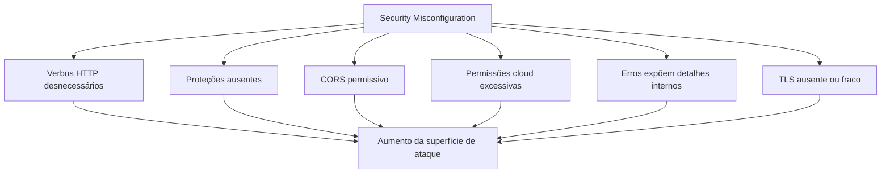

## Princípio “menos é mais”

Quanto menos informação e permissão forem concedidas, mais seguro será o ecossistema. Essa ideia aparece repetidamente no material e deve ser lembrada para prova.

Aplicações práticas:

- retornar apenas dados necessários;
- habilitar apenas métodos necessários;
- restringir permissões de contas e serviços;
- limitar origens CORS;
- ocultar detalhes internos em mensagens de erro;
- simplificar endpoints;
- bloquear ambientes não produtivos para acesso externo.

## Improper Inventory Management

Com o crescimento da empresa, surgem múltiplas APIs, ambientes, versões e integrações. Sem inventário, APIs antigas continuam expostas, rotas de teste vazam dados e versões obsoletas ficam sem proteção.

Perguntas de governança:

- Quais APIs existem?
- Estão em dev, QA, homologação ou produção?
- São públicas, internas ou de parceiros?
- Quais versões estão em execução?
- Quem é o dono técnico e de negócio?
- Quais dados trafegam?
- Há documentação atualizada?
- A API possui política de autenticação e autorização?

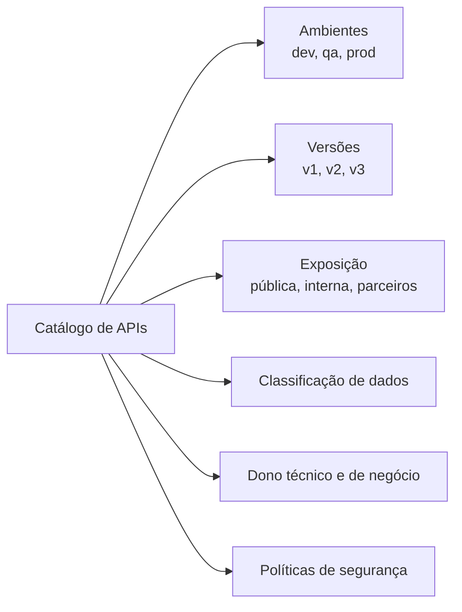

## Arquitetura de governança com soluções gerenciadas

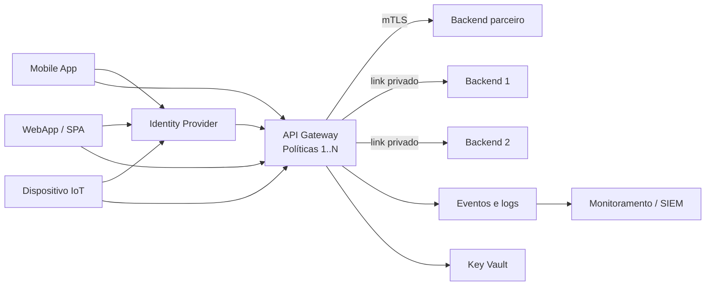

Soluções citadas:

| Solução | Papel |
|---|---|
| API Gateway | Entrada central, políticas, autenticação, rate limiting e roteamento. |
| Identity Provider | Gestão de identidades, MFA, tokens, federação. |
| WAF | Proteção contra ataques web e bots. |
| Endpoint Protection | Proteção de endpoints e workloads. |
| SIEM/SOAR | Monitoramento, correlação de eventos e resposta. |
| Key Vault | Armazenamento seguro de segredos, certificados e chaves. |

## Ferramentas de segurança de APIs

O material menciona ferramentas de segurança de API com foco em runtime e teste dinâmico. Segundo a categorização OWASP, ferramentas podem atuar em:

- **API Security Posture**: inventário, métodos expostos e classificação de dados;
- **API Runtime Security**: proteção durante execução e tratamento de requisições;
- **API Security Testing**: avaliação dinâmica da API em execução.

## Checklist de revisão

- Existe inventário de APIs?
- Cada API tem dono técnico e de negócio?
- Ambientes dev/QA usam dados fictícios ou mascarados?
- Versões antigas têm política de descontinuação?
- Documentação é gerada e protegida?
- CORS está restrito?
- Erros não expõem stack ou versões?
- TLS está configurado corretamente?
- Políticas estão no API Gateway?
- Logs vão para SIEM/SOAR?

## Questões de fixação

1. O que é Security Misconfiguration?
   - Resposta: configuração insegura ou incompleta que expõe dados, detalhes internos ou abre portas para ataques.

2. O que é Improper Inventory Management?
   - Resposta: falha em manter controle sobre APIs, ambientes, versões, documentação, donos e exposição.

3. Por que dados reais não devem ser usados em dev/QA?
   - Resposta: porque ambientes não produtivos costumam ter controles mais fracos e podem expor dados pessoais ou sensíveis.

## Erros comuns

- Deixar documentação pública sem autenticação.
- Manter APIs antigas expostas indefinidamente.
- Usar CORS `*` em endpoints sensíveis.
- Retornar stack trace em erro 500.
- Não ter dono claro para cada API.


---


# Capítulo 8 - Desenvolvimento Seguro para Aplicativos Mobile: MASVS Storage e Crypto

## Objetivo

Introduzir o OWASP MASVS e aprofundar dois grupos de controles: **MASVS-STORAGE** e **MASVS-CRYPTO**.

## Ideia central para prova

O MASVS é um padrão de verificação de segurança para aplicativos móveis. Ele organiza controles em grupos que cobrem armazenamento, criptografia, autenticação, rede, plataforma, código, resiliência e privacidade.

## OWASP MASVS

MASVS significa **Mobile Application Security Verification Standard**. Ele define controles para avaliar e melhorar a segurança de aplicativos móveis em Android, iOS e plataformas híbridas ou multiplataforma.

```mermaid
mindmap
  root((OWASP MASVS))
    STORAGE
      Dados sensíveis em repouso
      Prevenção de vazamentos
    CRYPTO
      Criptografia forte
      Gerenciamento de chaves
    AUTH
      Autenticação
      Autorização
    NETWORK
      TLS
      Pinning
    PLATFORM
      IPC
      WebViews
      UI segura
    CODE
      Plataforma atualizada
      SCA
      Sanitização
    RESILIENCE
      Anti-tamper
      Anti-reverse engineering
    PRIVACY
      Minimização
      Transparência
      Controle do usuário
```

## Aplicabilidade

O MASVS se aplica a:

- apps nativos Android e iOS;
- apps híbridos;
- apps multiplataforma como Flutter, React Native e Xamarin;
- SDKs e bibliotecas;
- apps pré-carregados.

Apps híbridos e multiplataforma podem herdar vulnerabilidades específicas da plataforma e da camada de framework, exigindo atenção adicional.

## Ética e autorização

Ferramentas de instrumentação, engenharia reversa, tampering e análise dinâmica devem ser usadas somente em testes autorizados, pesquisa acadêmica ou ambientes próprios. Usar essas técnicas contra sistemas sem permissão é ilegal e antiético.

## MASVS-STORAGE

### Controle geral

O aplicativo deve armazenar dados sensíveis de forma segura e prevenir vazamentos não intencionais.

Dados sensíveis podem incluir:

- tokens de sessão;
- chaves criptográficas;
- dados pessoais;
- dados financeiros;
- dados médicos;
- documentos;
- cache de respostas da API;
- logs com informações sigilosas.

```mermaid
flowchart TB
    Dados["Dados sensíveis"] --> Store{Precisa armazenar?}
    Store -->|Não| NoStore["Não armazenar"]
    Store -->|Sim| Classificar["Classificar sensibilidade"]
    Classificar --> Secure["Armazenamento seguro\nKeystore / Keychain / storage criptografado"]
    Secure --> Leak["Prevenir vazamento\nlogs, backups, analytics, cache"]
    Leak --> Retention["Retenção mínima e descarte seguro"]
```

### MASVS-STORAGE-1

O app armazena dados sensíveis de forma segura. Isso vale independentemente do local físico, cloud, país ou infraestrutura.

### MASVS-STORAGE-2

O app previne vazamento de dados sensíveis. Vazamentos podem ocorrer por logs, backups automáticos, analytics, cache, screenshots, arquivos temporários e mecanismos da plataforma.

## MASVS-CRYPTO

### Criptografia forte

O app deve usar algoritmos criptográficos atuais e robustos, aplicados conforme boas práticas. Criptografia é importante para dados em trânsito e dados em repouso.

### Gerenciamento de chaves

Criptografia forte não resolve se as chaves são mal gerenciadas. O ciclo de vida das chaves inclui geração, armazenamento, validade, rotação, revogação e descarte.

```mermaid
stateDiagram-v2
    [*] --> Gerada: geração segura
    Gerada --> Armazenada: KeyStore / Keychain / Vault
    Armazenada --> EmUso: uso controlado
    EmUso --> Rotacionada: rotação periódica
    Rotacionada --> EmUso
    EmUso --> Revogada: incidente ou expiração
    Revogada --> Descartada: descarte seguro
    Descartada --> [*]
```

## Exemplo de ataque: roubo de chaves

Um app armazena chaves diretamente no sistema de arquivos do dispositivo. Um atacante com acesso físico, malware ou ambiente comprometido extrai a chave. Com ela, pode descriptografar dados, interceptar comunicação, falsificar transações ou manipular integridade.

## Como prevenir

- Usar Android Keystore, iOS Keychain ou Secure Enclave quando aplicável.
- Evitar chaves em texto claro no sistema de arquivos.
- Não versionar chaves no repositório.
- Rotacionar chaves periodicamente.
- Separar chaves por finalidade.
- Aplicar controle de acesso rigoroso.
- Evitar logs com dados sensíveis.
- Criptografar dados locais quando necessário.

## Checklist de revisão

- O app armazena apenas o necessário?
- Tokens e chaves ficam em storage seguro?
- Logs não contêm dados sensíveis?
- Backups excluem dados sensíveis quando necessário?
- As chaves têm rotação e expiração?
- Há separação entre dados de baixa e alta sensibilidade?
- O app evita cache indevido de respostas sensíveis?

## Questões de fixação

1. O que é MASVS?
   - Resposta: padrão OWASP para verificar e melhorar segurança de aplicativos móveis.

2. Por que armazenamento seguro é importante em mobile?
   - Resposta: porque o dispositivo está sob controle do usuário e pode ser perdido, comprometido ou analisado.

3. Por que gerenciamento de chaves é tão importante quanto criptografia?
   - Resposta: porque chaves mal protegidas permitem quebrar a proteção mesmo com algoritmo forte.

## Erros comuns

- Guardar token em armazenamento comum sem proteção.
- Colocar segredo no app achando que ofuscação basta.
- Enviar dados sensíveis para analytics sem necessidade.
- Usar algoritmo antigo ou configuração criptográfica fraca.


---


# Capítulo 9 - Autenticação Segura para Aplicativos

## Objetivo

Estudar autenticação e autorização em aplicativos móveis segundo **MASVS-AUTH**, incluindo protocolos seguros, autenticação local e proteção de operações sensíveis com autenticação adicional.

## Ideia central para prova

Aplicativos móveis devem usar protocolos seguros de autenticação e autorização, implementar autenticação local corretamente e exigir autenticação adicional para operações sensíveis.

## MASVS-AUTH

O grupo MASVS-AUTH trata autenticação, autorização, autenticação local e proteção de ações críticas.

```mermaid
flowchart TB
    AUTH["MASVS-AUTH"] --> A1["AUTH-1\nProtocolos seguros de autenticação e autorização"]
    AUTH --> A2["AUTH-2\nAutenticação local segura"]
    AUTH --> A3["AUTH-3\nAutenticação adicional em operações sensíveis"]
```

## MASVS-AUTH-1: protocolos seguros

A maioria dos apps que se comunica com backend remoto precisa autenticar o usuário e impor autorização. Mesmo que a decisão final de autorização esteja no backend, o app deve seguir boas práticas: usar tokens corretamente, não expor secrets, proteger sessão e chamar endpoints seguros.

Práticas relevantes:

- usar OAuth 2.0/OpenID Connect quando aplicável;
- não armazenar senha localmente;
- usar refresh token com cuidado;
- validar expiração e renovar sessão de forma segura;
- não colocar API keys ou client secrets no app como se fossem secretos absolutos;
- tratar tokens como dados sensíveis.

## MASVS-AUTH-2: autenticação local segura

Autenticação local é o uso de PIN, biometria, Face ID, Touch ID ou mecanismos equivalentes para desbloquear o app ou proteger dados locais. Precisa seguir as melhores práticas da plataforma.

Atenção: biometria local não substitui autorização no backend. Ela protege o acesso local, mas o servidor ainda deve validar token, sessão e permissão.

## MASVS-AUTH-3: operações sensíveis

Operações sensíveis exigem autenticação adicional. Exemplos:

- PIX, transferência ou pagamento;
- alteração de e-mail;
- alteração de telefone de 2FA;
- cancelamento de contrato;
- visualização de dados médicos;
- alteração de endereço crítico;
- exclusão de conta;
- emissão de documento sigiloso.

```mermaid
sequenceDiagram
    participant User as Usuário
    participant App as App Mobile
    participant Local as Biometria/PIN
    participant API as Backend/API
    participant IdP as Identity Provider

    User->>App: Solicita operação sensível
    App->>Local: Exige autenticação local
    Local-->>App: Usuário confirmado
    App->>IdP: Reautenticação ou step-up MFA
    IdP-->>App: Confirmação / token com escopo forte
    App->>API: Envia operação com token válido
    API->>API: Valida autorização e risco
    API-->>App: Operação permitida ou negada
```

## Dupla custódia: app e backend

A segurança mobile exige dupla proteção. O app protege armazenamento, UI, sessão local e comunicação. O backend valida identidade, autorização, regras de negócio, tokens, escopos e limites. Nenhuma das partes deve confiar cegamente na outra.

```mermaid
flowchart LR
    App["App Mobile"] -->|"token + requisição"| Backend["Backend"]
    App --> Local["Proteções locais\nbiometria, storage seguro, UI segura"]
    Backend --> Server["Proteções servidor\nautorização, sessão, regras, auditoria"]
    Local --> Secure["Segurança composta"]
    Server --> Secure
```

## Papel do Product Owner

O desenvolvedor deve trabalhar com Product Owner e áreas de negócio para identificar quais operações são sensíveis. Segurança não pode depender apenas de julgamento técnico; impacto de negócio e impacto ao usuário também contam.

## Checklist de revisão

- O app usa protocolo seguro para autenticação?
- Tokens são armazenados de forma segura?
- A sessão expira corretamente?
- Biometria/PIN são implementados conforme boas práticas da plataforma?
- Operações sensíveis exigem step-up/reautenticação?
- O backend valida autorização independentemente do app?
- O app não usa secrets fixos como autenticação de usuário?

## Questões de fixação

1. Autenticação local substitui autorização no backend?
   - Resposta: não. Ela protege o dispositivo/local, mas o backend deve validar permissões.

2. O que é step-up authentication?
   - Resposta: autenticação adicional exigida para uma ação de maior risco.

3. Quem deve ajudar a identificar operações sensíveis?
   - Resposta: desenvolvedores, segurança, negócio e Product Owner.

## Erros comuns

- Deixar alteração de e-mail sem reautenticação.
- Tratar biometria como garantia absoluta de identidade no servidor.
- Armazenar tokens em local inseguro.
- Não diferenciar operação comum de operação crítica.


---


# Capítulo 10 - Protegendo Rede e Plataforma em Aplicativos Mobile

## Objetivo

Entender os controles **MASVS-NETWORK** e **MASVS-PLATFORM**, incluindo tráfego seguro, validação de certificados, pinning, IPC seguro, WebViews seguras e proteção de dados sensíveis na interface.

## Ideia central para prova

Todo tráfego sensível deve ser protegido em trânsito. O app deve validar o endpoint remoto, evitar confiança ampla demais em certificados e proteger interações com a plataforma, WebViews, IPC e interface do usuário.

## MASVS-NETWORK

### MASVS-NETWORK-1

O aplicativo protege todo o tráfego de rede conforme melhores práticas. Isso envolve criptografia e autenticação do endpoint remoto, tipicamente com TLS.

### MASVS-NETWORK-2

O aplicativo realiza pinning de identidade para endpoints sob controle do desenvolvedor. Em vez de confiar em todas as CAs raiz do dispositivo, o app confia apenas em CAs ou chaves específicas.

```mermaid
sequenceDiagram
    participant App as App Mobile
    participant OS as Sistema Operacional
    participant API as API Remota

    App->>API: Inicia conexão TLS
    API-->>App: Envia certificado
    App->>OS: Valida cadeia do certificado
    OS-->>App: Cadeia válida
    App->>App: Verifica pinning da CA/chave esperada
    alt Pinning confere
        App->>API: Envia requisição segura
        API-->>App: Resposta segura
    else Pinning falha
        App-->>App: Bloqueia conexão e registra evento
    end
```

## Por que pinning importa

Sem pinning, um dispositivo comprometido ou uma CA adicionada indevidamente poderia permitir interceptação de tráfego. Com pinning, o app reduz a confiança ampla no conjunto de CAs do sistema e passa a confiar apenas em identidades específicas.

Atenção: pinning precisa de estratégia de rotação. Se o certificado expira ou muda sem planejamento, o app pode parar de se comunicar.

## MASVS-PLATFORM

O grupo PLATFORM trata uso seguro de recursos da plataforma móvel.

### IPC seguro

IPC significa comunicação entre processos. O app deve expor dados e funcionalidades a outros apps apenas quando necessário e de forma controlada.

### WebViews seguras

WebViews podem expor pontes JavaScript para código nativo e aumentar a superfície de ataque. Devem ser configuradas com cuidado, desabilitando recursos desnecessários, restringindo origens e evitando exposição de dados sensíveis.

### Interface de usuário segura

Dados sensíveis podem vazar por screenshots automáticas, tela de multitarefa, notificações, gravação de tela ou overlays. Apps financeiros e de saúde costumam bloquear capturas em telas críticas.

```mermaid
flowchart TB
    Plataforma["MASVS-PLATFORM"] --> IPC["IPC seguro\nExpor apenas o necessário"]
    Plataforma --> WebView["WebViews seguras\nSem pontes perigosas e origens abertas"]
    Plataforma --> UI["UI segura\nSem vazamento por screenshot, multitarefa ou notificação"]
```

## Exemplo Android: FLAG_SECURE

A `FLAG_SECURE` impede que o conteúdo da janela seja capturado em screenshots ou exibido em miniaturas de multitarefa.

```java
public class MainActivity extends AppCompatActivity {
    @Override
    protected void onCreate(Bundle savedInstanceState) {
        super.onCreate(savedInstanceState);
        setContentView(R.layout.activity_main);

        getWindow().setFlags(
            WindowManager.LayoutParams.FLAG_SECURE,
            WindowManager.LayoutParams.FLAG_SECURE
        );
    }
}
```

## Checklist de revisão

- Toda comunicação usa TLS?
- Certificados são validados corretamente?
- Há pinning para endpoints críticos?
- Existe plano de rotação de certificados/pins?
- IPC expõe apenas o necessário?
- WebViews estão configuradas de forma segura?
- Telas com dados sensíveis bloqueiam screenshots quando necessário?
- Notificações não exibem dados sensíveis?

## Questões de fixação

1. O que é certificate pinning?
   - Resposta: fixar confiança em certificados, chaves públicas ou CAs específicas para endpoints controlados.

2. TLS é opcional para dados sensíveis?
   - Resposta: não. Dados sensíveis em trânsito devem ser protegidos.

3. Para que serve FLAG_SECURE no Android?
   - Resposta: impedir captura de tela e exposição do conteúdo em miniaturas de multitarefa.

## Erros comuns

- Aceitar qualquer certificado em ambiente de produção.
- Desabilitar validação TLS para “resolver erro de certificado”.
- Usar WebView com JavaScript bridge exposta sem restrição.
- Mostrar OTP ou dados sensíveis em notificação.


---


# Capítulo 11 - Protegendo Código Fonte e Versões do Aplicativo

## Objetivo

Estudar o grupo **MASVS-CODE**, que trata atualização da plataforma, atualização forçada do app, uso de componentes sem vulnerabilidades conhecidas e validação/sanitização de entradas não confiáveis.

## Ideia central para prova

Um app seguro precisa rodar em plataforma atualizada, ter mecanismo para forçar atualização quando houver vulnerabilidade crítica, usar componentes sem CVEs conhecidas e validar toda entrada não confiável.

## MASVS-CODE

```mermaid
flowchart TB
    CODE["MASVS-CODE"] --> C1["CODE-1\nVersão atualizada da plataforma"]
    CODE --> C2["CODE-2\nMecanismo para forçar atualização"]
    CODE --> C3["CODE-3\nComponentes sem vulnerabilidades conhecidas"]
    CODE --> C4["CODE-4\nValidação e sanitização de entradas"]
```

## Plataforma atualizada

Cada versão de Android ou iOS traz patches e recursos de segurança. Suportar versões muito antigas aumenta a exposição a vulnerabilidades conhecidas. Existe um equilíbrio entre alcance de usuários e segurança, mas a decisão deve ser baseada em análise de risco.

Estratégias:

- definir versão mínima suportada;
- bloquear funções críticas em versões inseguras;
- informar usuário sobre necessidade de atualização;
- acompanhar vulnerabilidades da plataforma;
- alinhar decisão com segurança, negócio e produto.

## Atualização forçada

Se uma vulnerabilidade crítica for descoberta em produção, o app precisa ter mecanismo para obrigar atualização antes do uso. Sem isso, usuários podem continuar em versões vulneráveis indefinidamente.

```mermaid
sequenceDiagram
    participant App as App antigo
    participant Config as Serviço de configuração
    participant Store as Loja de aplicativos
    participant User as Usuário

    App->>Config: Consulta versão mínima permitida
    Config-->>App: Versão mínima = 5.2.0
    alt App abaixo da versão mínima
        App-->>User: Bloqueia uso e solicita atualização
        User->>Store: Atualiza aplicativo
    else App atualizado
        App-->>User: Permite uso normal
    end
```

## Componentes sem vulnerabilidades conhecidas

O app deve usar bibliotecas e SDKs sem vulnerabilidades conhecidas. SCA é essencial para detectar CVEs em dependências. Isso vale para libs de rede, analytics, criptografia, publicidade, SDKs de terceiros e frameworks híbridos.

## Entradas não confiáveis

Entradas de UI, rede, IPC e sistema de arquivos devem ser tratadas como não confiáveis. Podem ter sido manipuladas por usuários, malware, apps maliciosos ou tráfego interceptado.

Exemplos de ataques:

- SQL Injection;
- command injection;
- XSS em WebViews;
- path traversal;
- bypass de regra de segurança;
- manipulação de arquivos.

## Exemplo de validação simples

```java
findViewById(R.id.buttonSubmit).setOnClickListener(v -> {
    String input = userInput.getText().toString();

    if (isValidInput(input)) {
        String sanitized = sanitizeInput(input);
        Toast.makeText(this, "Entrada válida: " + sanitized, Toast.LENGTH_SHORT).show();
    } else {
        Toast.makeText(this, "Entrada inválida!", Toast.LENGTH_SHORT).show();
    }
});

private boolean isValidInput(String input) {
    return input.matches("^[a-zA-Z0-9]+$");
}

private String sanitizeInput(String input) {
    return input.trim();
}
```

A validação real deve ser adequada ao contexto. Para SQL, use consultas parametrizadas; para HTML, escape/encode; para arquivos, normalize caminhos e aplique allowlist.

## Pipeline seguro para app mobile

```mermaid
flowchart LR
    Commit["Commit"] --> SAST["SAST"]
    Commit --> SCA["SCA"]
    SAST --> Tests["Testes automatizados"]
    SCA --> Tests
    Tests --> Build["Build assinado"]
    Build --> RASP["Proteções runtime / ofuscação"]
    RASP --> Release["Publicação"]
    Release --> Monitor["Monitoramento de crash, fraude e versão"]
    Monitor --> Force["Atualização forçada se necessário"]
```

## Checklist de revisão

- Há versão mínima suportada da plataforma?
- Existe mecanismo de atualização forçada?
- SCA roda para dependências mobile e SDKs?
- Bibliotecas vulneráveis são bloqueadas no pipeline?
- Entradas de UI, rede, IPC e arquivos são validadas?
- Consultas usam parâmetros em vez de concatenação?
- Secrets não estão hardcoded no app?
- Build é assinado e protegido?

## Questões de fixação

1. Por que versões antigas da plataforma são risco?
   - Resposta: podem conter vulnerabilidades conhecidas sem correção.

2. Por que atualização forçada é importante?
   - Resposta: permite bloquear uso de versões vulneráveis em produção.

3. O que são entradas não confiáveis?
   - Resposta: dados vindos de UI, rede, IPC, arquivos ou qualquer fonte manipulável.

## Erros comuns

- Manter suporte indefinido a versões antigas sem análise de risco.
- Usar SDKs de terceiros sem SCA.
- Validar apenas no frontend.
- Usar regex genérica como única defesa para todos os contextos.


---


# Capítulo 12 - Técnicas contra Engenharia Reversa e Resiliência

## Objetivo

Estudar o grupo **MASVS-RESILIENCE**, que aborda integridade da plataforma, mecanismos anti-adulteração, anti-análise estática, anti-análise dinâmica, RASP e ofuscação.

## Ideia central para prova

Apps móveis rodam em dispositivos controlados pelo usuário. Portanto, atacantes podem tentar descompactar, instrumentar, modificar, depurar ou distribuir versões adulteradas. Resiliência busca dificultar engenharia reversa e detectar adulterações.

## MASVS-RESILIENCE

```mermaid
flowchart TB
    RES["MASVS-RESILIENCE"] --> R1["RESILIENCE-1\nValidação da integridade da plataforma"]
    RES --> R2["RESILIENCE-2\nMecanismos anti-adulteração"]
    RES --> R3["RESILIENCE-3\nAnti-análise estática"]
    RES --> R4["RESILIENCE-4\nAnti-análise dinâmica"]
```

## Integridade da plataforma

O app deve validar se o ambiente de execução é confiável. Dispositivos com jailbreak, root, debuggers, hooks, malware ou alterações no sistema podem desativar proteções e expor dados.

Controles comuns:

- detecção de root/jailbreak;
- detecção de debugger;
- verificação de integridade do SO;
- checagem de ambiente comprometido;
- bloqueio ou redução de funcionalidade em ambiente inseguro.

## Anti-adulteração

Anti-tamper busca garantir que o pacote do app e sua lógica não foram modificados. Um atacante pode tentar alterar o APK/IPA, remover validações, inserir backdoor ou distribuir versão falsa fora das lojas oficiais.

## Anti-análise estática

Análise estática é examinar o pacote sem executá-lo. Em Android, um APK pode ser descompactado e decompilado. Sem proteção, o atacante entende fluxos internos, endpoints, regras e validações.

Técnicas:

- ofuscação de código;
- remoção de símbolos desnecessários;
- redução de strings legíveis;
- proteção contra decompilação;
- separação de segredos para backend/vault.

## Anti-análise dinâmica

Análise dinâmica observa o app em execução, inspecionando memória, chamadas, registradores, tráfego e comportamento. Ferramentas de instrumentação como Frida podem alterar o comportamento em runtime.

Técnicas:

- detecção de hooks/instrumentação;
- anti-debugging;
- verificação de integridade em runtime;
- RASP;
- validação contínua de assinatura/pacote.

## RASP - Runtime Application Self-Protection

RASP é proteção em tempo de execução. Ele detecta e pode bloquear ataques enquanto o app roda. Pode identificar tampering, instrumentação, ambiente inseguro e alterações no pacote.

```mermaid
flowchart LR
    Build["Build assinado"] --> RASP["Implantar RASP"]
    RASP --> Runtime["Executar app"]
    Runtime --> Detect["Detectar ameaças\nroot, hook, tamper, debugger"]
    Detect --> Decision{Ameaça?}
    Decision -->|Não| Continue["Continua execução"]
    Decision -->|Sim| Response["Bloqueia, encerra, reduz funcionalidade ou alerta"]
    Response --> SIEM["Evento para análise"]
    SIEM --> Improve["Aprimorar defesas"]
    Improve --> Build
```

## Ciclo de prevenção contra engenharia reversa

```mermaid
flowchart TB
    Obfuscate["Ofuscar código"] --> Rasp["Implantar RASP"]
    Rasp --> Detect["Detectar ameaças"]
    Detect --> Prevent["Prevenir ataques"]
    Prevent --> Learn["Analisar tentativas"]
    Learn --> Obfuscate
```

## Limitações importantes

Nenhuma técnica impede engenharia reversa para sempre. O objetivo é aumentar custo, tempo e complexidade do ataque, detectar tentativas e reduzir impacto. Segurança mobile é defesa em profundidade, não uma barreira única.

## Checklist de revisão

- O app valida integridade da plataforma?
- Há detecção de root/jailbreak quando aplicável?
- Existe ofuscação de código?
- O app detecta debug/hooking/instrumentação?
- O pacote assinado é validado?
- Há resposta definida para ambiente inseguro?
- Eventos de tampering são monitorados?
- Segredos críticos ficam no backend e não no app?

## Questões de fixação

1. O que é anti-tamper?
   - Resposta: mecanismos que buscam detectar ou impedir modificações não autorizadas no app ou em seus dados.

2. Qual a diferença entre análise estática e dinâmica?
   - Resposta: estática analisa o app sem executá-lo; dinâmica observa ou manipula o app em execução.

3. RASP substitui código seguro?
   - Resposta: não. RASP é camada adicional de defesa.

## Erros comuns

- Acreditar que ofuscação protege segredos hardcoded.
- Confiar apenas na validação da loja de aplicativos.
- Não monitorar eventos de tampering.
- Bloquear app em falsos positivos sem estratégia de suporte.


---


# Capítulo 13 - Controles sobre Privacidade

## Objetivo

Estudar o grupo **MASVS-PRIVACY**, com foco em minimização de acesso a dados, prevenção da identificação do usuário, transparência e controle do usuário sobre seus dados.

## Ideia central para prova

Privacidade não é apenas criptografar dados. É coletar menos, acessar menos, explicar claramente o uso, reduzir rastreamento e dar controle ao usuário, respeitando bases legais e requisitos regulatórios.

## MASVS-PRIVACY

```mermaid
flowchart TB
    Privacy["MASVS-PRIVACY"] --> P1["PRIVACY-1\nMinimização de acesso"]
    Privacy --> P2["PRIVACY-2\nPrevenção da identificação"]
    Privacy --> P3["PRIVACY-3\nTransparência sobre coleta e uso"]
    Privacy --> P4["PRIVACY-4\nControle do usuário sobre dados"]
```

## PRIVACY-1: minimização de acesso

O app deve solicitar apenas dados e permissões necessárias para a funcionalidade. A boa prática é “menos é mais” e “privacidade por padrão”.

Exemplos:

- não pedir localização se a funcionalidade não precisa;
- não acessar contatos sem necessidade clara;
- não coletar identificadores permanentes quando um ID pseudônimo basta;
- não manter dados por mais tempo que o necessário.

## PRIVACY-2: prevenção da identificação

Proteger a identidade do usuário reduz rastreamento. Técnicas incluem:

- anonimização;
- pseudonimização;
- abstração de dados;
- separação entre identificadores técnicos e identidade real;
- envio de dados agregados para analytics.

```mermaid
flowchart LR
    Real["Identidade real\nCPF, nome, e-mail"] --> Separacao["Separação de contexto"]
    Separacao --> Pseudo["ID pseudônimo"]
    Pseudo --> Analytics["Analytics / métricas"]
    Real -.restrito.-> Backend["Backend protegido"]
```

## PRIVACY-3: transparência

Usuários devem saber quais dados são coletados, por que são coletados, como são usados, com quem são compartilhados e por quanto tempo ficam armazenados. Termos de uso e política de privacidade precisam ser claros e coerentes com o comportamento real do app.

## PRIVACY-4: controle do usuário

O usuário deve poder gerenciar seus dados, alterar preferências, revogar consentimento, solicitar exclusão ou modificar informações quando aplicável. Existem exceções legais, como retenção obrigatória, mas devem ser justificadas.

```mermaid
flowchart TB
    User["Usuário"] --> Preferences["Gerenciar preferências"]
    User --> Consent["Revogar consentimento"]
    User --> Access["Acessar dados"]
    User --> Delete["Solicitar exclusão"]
    Delete --> Legal{Existe base legal de retenção?}
    Legal -->|Sim| Justify["Informar retenção necessária"]
    Legal -->|Não| Remove["Excluir ou anonimizar"]
```

## Relação com confiança

Privacidade impacta confiança. Um app que solicita permissões excessivas, não explica o uso de dados ou dificulta exclusão tende a gerar rejeição do usuário e risco regulatório.

## Checklist de revisão

- O app coleta apenas dados necessários?
- Permissões são solicitadas no momento correto e com justificativa?
- Analytics usa dados mínimos ou pseudônimos?
- Política de privacidade reflete o comportamento real do app?
- Usuário consegue alterar preferências?
- Usuário consegue revogar consentimento quando aplicável?
- Dados têm prazo de retenção definido?
- Exclusão/anonimização está implementada?

## Questões de fixação

1. O que significa minimização de dados?
   - Resposta: coletar e acessar apenas dados estritamente necessários para a finalidade.

2. Qual a importância da transparência?
   - Resposta: permite que o usuário saiba como seus dados são usados e aumenta confiança.

3. O usuário sempre pode excluir todos os dados imediatamente?
   - Resposta: depende. Pode haver bases legais de retenção, mas devem ser justificadas.

## Erros comuns

- Pedir todas as permissões na primeira abertura do app.
- Enviar CPF ou e-mail para analytics sem necessidade.
- Ter política de privacidade genérica que não reflete o app.
- Não fornecer mecanismo para controle de dados.
