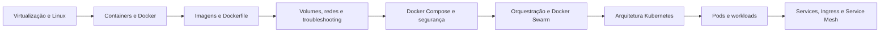

# Container Development & Orchestration

Material de estudo em português, estruturado para consulta no GitHub e revisão para prova, com base nos e-books e slides da disciplina **Container Development & Orchestration**.

> O conteúdo preserva os conceitos cobrados no material da disciplina e acrescenta correções técnicas e atualizações relevantes até 2026. Quando uma atualização diverge da forma apresentada nos slides, ela aparece destacada como **Atualização técnica**.

## Objetivos

Ao concluir este material, você deverá ser capaz de:

- diferenciar virtualização tradicional e containerização;
- explicar imagens, containers, registries e o ciclo de vida Docker;
- criar imagens com Dockerfile;
- trabalhar com volumes, redes e troubleshooting;
- definir aplicações multicontainer com Docker Compose;
- aplicar práticas básicas de segurança em containers;
- compreender orquestração, Docker Swarm e Kubernetes;
- explicar Pods, Deployments, StatefulSets, DaemonSets, Jobs e Services;
- interpretar manifests YAML e comandos essenciais de Docker e Kubernetes.

## Trilha de estudo



## Conteúdo

| Ordem | Documento | Assuntos principais |
|---:|---|---|
| 1 | [Fundamentos de virtualização e containers](docs/01-fundamentos-virtualizacao-containers.md) | Hypervisors, VMs, Linux, namespaces, cgroups e comparação VM x container |
| 2 | [Docker, imagens, registries e Dockerfile](docs/02-docker-imagens-dockerfile.md) | Docker Engine, CLI, imagens, containers, Docker Hub, registries e construção de imagens |
| 3 | [Volumes, redes e troubleshooting](docs/03-volumes-redes-troubleshooting.md) | Persistência, drivers de rede, logs, inspect, exec, stats e restart policies |
| 4 | [Docker Compose e segurança](docs/04-docker-compose-seguranca.md) | Aplicações multicontainer, healthcheck, dependências, limites e hardening |
| 5 | [Orquestração e Docker Swarm](docs/05-orquestracao-docker-swarm.md) | Estado desejado, managers, workers, services, tasks, overlay e balanceamento |
| 6 | [Arquitetura Kubernetes](docs/06-arquitetura-kubernetes.md) | Control Plane, workers, API, scheduler, etcd, kubelet, kube-proxy e controllers |
| 7 | [Pods, workloads e Deployments](docs/07-pods-workloads-deployments.md) | Pods, sidecars, ReplicaSet, Deployment, StatefulSet, DaemonSet, Job e CronJob |
| 8 | [Services, redes e Service Mesh](docs/08-servicos-redes-service-mesh.md) | ClusterIP, NodePort, LoadBalancer, Headless, Ingress, Gateway API e Istio |

## Laboratórios

- [Laboratório 1 — Docker básico](labs/01-docker-basico.md)
- [Laboratório 2 — Docker Compose](labs/02-docker-compose.md)
- [Laboratório 3 — Docker Swarm](labs/03-docker-swarm.md)
- [Laboratório 4 — Kubernetes](labs/04-kubernetes.md)

## Revisão para a prova

- [Resumo geral](revisao/resumo-prova.md)
- [Comandos essenciais](revisao/comandos-essenciais.md)
- [Questões comentadas](revisao/questoes-comentadas.md)
- [Glossário](revisao/glossario.md)
- [Atualizações e correções técnicas de 2026](revisao/atualizacoes-2026.md)

## Padrão didático dos capítulos

Todos os capítulos seguem a mesma organização:

1. objetivos de aprendizagem;
2. visão geral;
3. conceitos fundamentais;
4. diagramas Mermaid;
5. exemplos práticos;
6. boas práticas e armadilhas;
7. atualizações técnicas;
8. resumo para a prova;
9. perguntas de revisão.

## Convenções usadas

### Ponto de prova

Indica uma definição, comparação ou comando que aparece diretamente no material da disciplina e tem maior chance de ser cobrado.

### Atualização técnica

Indica uma correção ou evolução em relação ao material original. Exemplos importantes:

- o Compose atual é executado como `docker compose`, sem hífen;
- a chave superior `version` do arquivo Compose está obsoleta;
- o mapeamento de portas segue a ordem `HOST:CONTAINER`;
- Kubernetes usa a Container Runtime Interface (CRI); Docker Engine exige um adaptador como `cri-dockerd`;
- a API Ingress está congelada e o projeto Kubernetes recomenda Gateway API para novos recursos;
- Istio pode operar no modelo tradicional com sidecars ou no modo ambient.

### Comandos destrutivos

Comandos como `docker system prune`, `docker volume prune`, `kubectl delete` e `docker stack rm` podem apagar recursos. Revise o alvo antes da execução.

## Estrutura do repositório

```text
container-development-orchestration/
├── README.md
├── docs/
├── labs/
├── examples/
│   ├── docker/
│   ├── compose/
│   └── kubernetes/
└── revisao/
```

## Fontes principais

- E-books e slides da disciplina, produzidos pelo professor Daniel Lemeszenski.
- Documentação oficial Docker: <https://docs.docker.com/>
- Compose Specification: <https://docs.docker.com/reference/compose-file/>
- Documentação oficial Kubernetes: <https://kubernetes.io/docs/>
- Documentação oficial Istio: <https://istio.io/latest/docs/>

## Como estudar

Uma sequência eficiente é:

1. ler um capítulo;
2. reproduzir os comandos do laboratório correspondente;
3. explicar o diagrama sem consultar o texto;
4. revisar o resumo da prova;
5. responder às questões comentadas;
6. repetir os comandos essenciais em um ambiente de teste.
