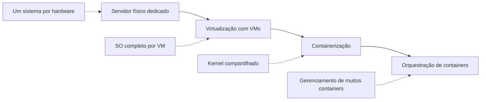
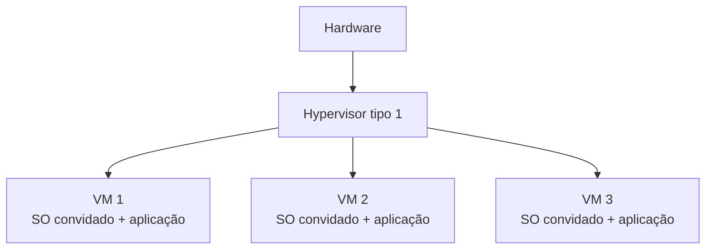
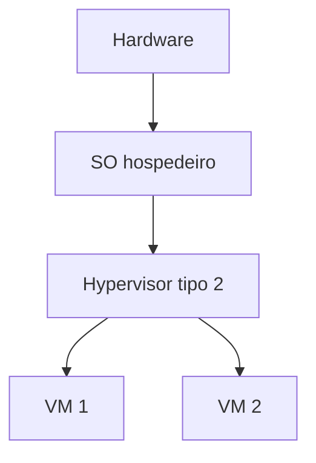
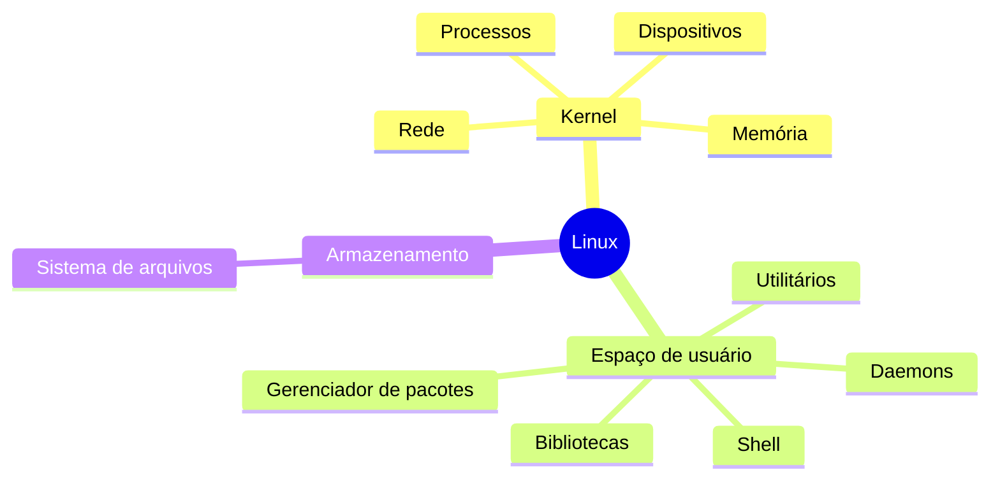
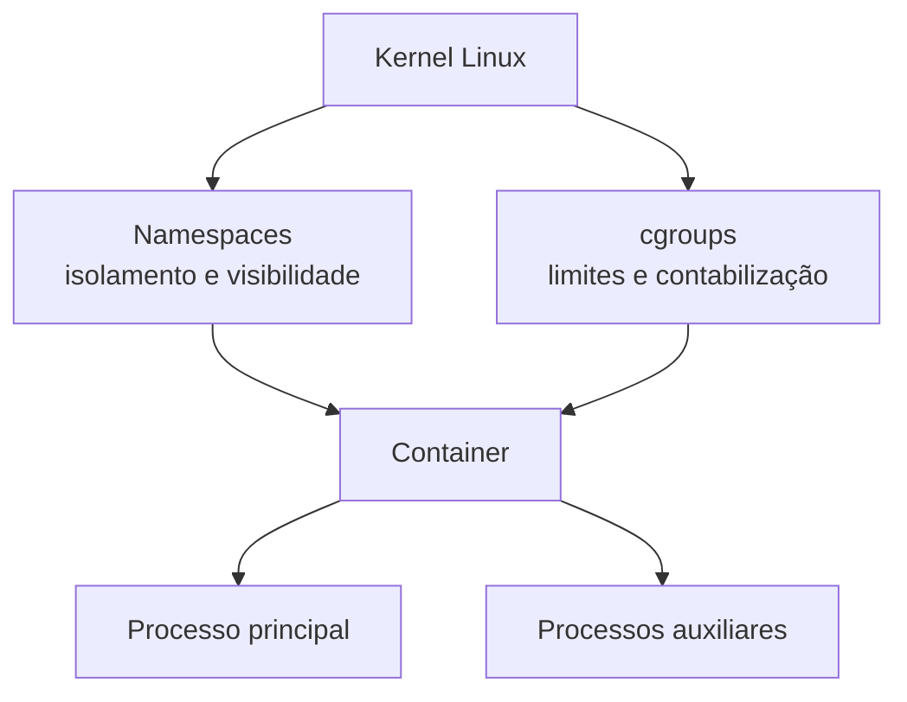
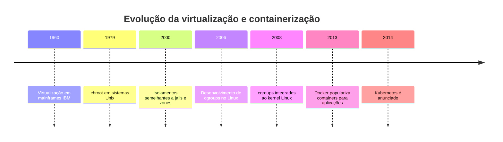
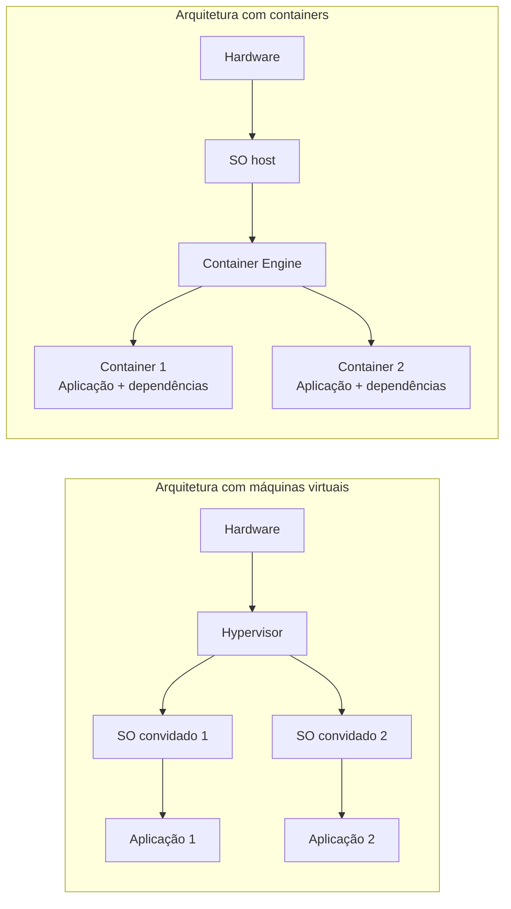
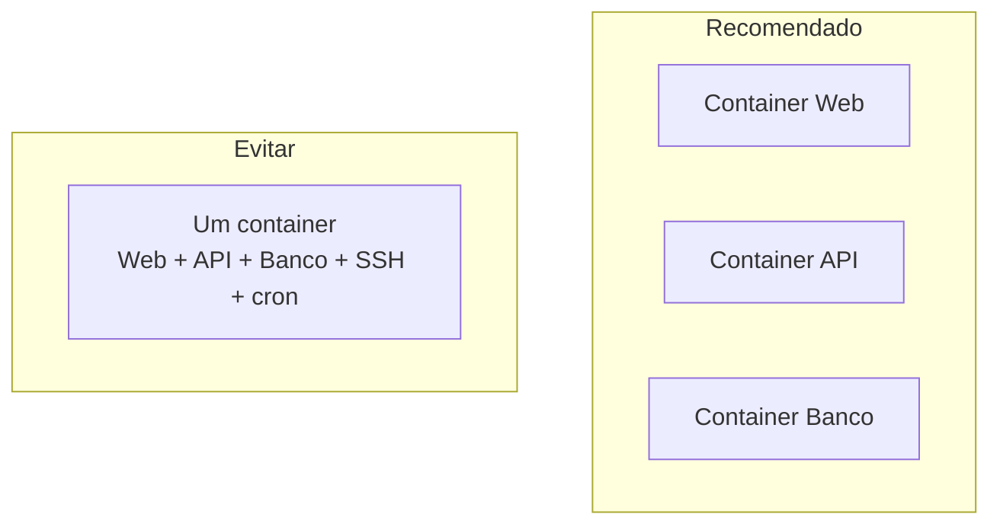

# 1. Fundamentos de virtualização e containers

## Objetivos de aprendizagem

Ao final deste capítulo, você deverá ser capaz de:

- explicar o que é virtualização;
- diferenciar hypervisor tipo 1 e tipo 2;
- comparar servidor físico, máquina virtual e container;
- reconhecer os principais componentes do Linux;
- explicar como namespaces e cgroups sustentam a containerização;
- identificar vantagens, limitações e casos de uso de containers.

## 1. Visão geral

A virtualização permite executar ambientes computacionais isolados sobre uma mesma infraestrutura física. Historicamente, as máquinas virtuais consolidaram aplicações em servidores mais bem aproveitados. Posteriormente, containers tornaram o isolamento mais leve ao compartilhar o kernel do sistema operacional do host.

> **Ponto de prova:** VMs normalmente utilizam um hypervisor e carregam um sistema operacional convidado completo. Containers compartilham o kernel do host e isolam processos, rede, sistema de arquivos e recursos.

## 2. Virtualização

Virtualização é a abstração de recursos computacionais — CPU, memória, armazenamento e rede — para permitir que múltiplos ambientes lógicos utilizem o mesmo hardware.

### 2.1 Servidor físico ou bare metal

No bare metal, o sistema operacional executa diretamente sobre o hardware.

**Vantagens:**

- maior desempenho previsível;
- controle direto do hardware;
- isolamento físico;
- adequado para cargas com requisitos específicos.

**Desvantagens:**

- custo mais alto;
- menor aproveitamento quando a carga fica ociosa;
- expansão e provisionamento mais lentos;
- maior esforço para padronizar ambientes.

### 2.2 Hypervisor

O hypervisor é a camada responsável por criar e administrar máquinas virtuais.

#### Tipo 1 — Bare Metal

Executa diretamente sobre o hardware. É comum em datacenters por oferecer menor sobrecarga e melhor isolamento operacional.

Exemplos: VMware ESXi, Microsoft Hyper-V Server e Xen.

#### Tipo 2 — Hosted

Executa sobre um sistema operacional hospedeiro. É comum em estações de desenvolvimento e laboratórios.

Exemplos: VirtualBox e VMware Workstation.

### 2.3 Comparação entre os tipos de hypervisor

| Critério | Tipo 1 | Tipo 2 |
|---|---|---|
| Execução | Diretamente no hardware | Sobre um SO hospedeiro |
| Desempenho | Geralmente superior | Maior sobrecarga |
| Uso típico | Datacenter e produção | Desenvolvimento e laboratório |
| Administração | Mais especializada | Mais simples para uso local |
| Isolamento | Mais forte | Depende também do host |

### 2.4 Máquinas virtuais em nuvem

Serviços como AWS EC2, Azure Virtual Machines e Google Compute Engine entregam máquinas virtuais sob demanda. Uma única VM pode conter banco de dados, backend e frontend, mas essa concentração aumenta o acoplamento operacional e dificulta escalar componentes separadamente.

## 3. Arquivo ISO

Um arquivo ISO é uma imagem de disco. Ele pode conter a mídia de instalação de um sistema operacional ou uma cópia organizada do conteúdo de um disco.

> **Correção conceitual:** ISO não é, por definição, um snapshot de uma VM em execução. Snapshots de VM são recursos próprios do hypervisor e incluem estado de discos e, opcionalmente, memória. A ISO normalmente é usada como mídia de instalação ou distribuição.

## 4. Componentes fundamentais do Linux

Containers são profundamente associados ao Linux porque dependem de recursos do kernel. Os principais componentes apresentados no material são:

| Componente | Função |
|---|---|
| Kernel | Gerencia CPU, memória, processos, dispositivos e rede |
| Shell | Interpreta comandos e permite interação textual |
| Sistema de arquivos | Organiza arquivos e diretórios hierarquicamente |
| Bibliotecas | Disponibilizam funções reutilizáveis para programas |
| Utilitários | Administram arquivos, processos, rede e sistema |
| Serviços e daemons | Processos em segundo plano |
| Gerenciador de pacotes | Instala, atualiza e remove software |
| Interface gráfica | Oferece interação visual com o sistema |

## 5. O que é um container

Um container é um processo ou conjunto de processos executado de forma isolada, com uma visão própria de recursos do sistema. Ele não contém um kernel completo: utiliza o kernel do host.

O container pode ter:

- sistema de arquivos próprio;
- árvore de processos isolada;
- interfaces e rotas de rede próprias;
- limites de CPU e memória;
- variáveis de ambiente e configuração próprias;
- usuário e permissões específicos.

### 5.1 Namespaces

Namespaces separam a visão que um processo possui dos recursos do sistema.

| Namespace | Isolamento fornecido |
|---|---|
| PID | Processos e identificadores |
| NET | Interfaces, rotas e portas de rede |
| MNT | Pontos de montagem e sistema de arquivos |
| UTS | Hostname e domínio |
| IPC | Recursos de comunicação entre processos |
| USER | Usuários e grupos |
| CGROUP | Visão da hierarquia de cgroups |

### 5.2 cgroups

Control groups, ou cgroups, medem, limitam e priorizam recursos consumidos por grupos de processos.

Exemplos:

- limitar um container a 512 MB de memória;
- permitir apenas parte de uma CPU;
- controlar I/O de bloco;
- contabilizar consumo de recursos.

### 5.3 chroot e evolução histórica

O `chroot`, criado antes dos containers modernos, altera o diretório raiz visível por um processo. Ele contribuiu para a ideia de isolamento de sistema de arquivos, mas não oferece sozinho o isolamento completo de processos, rede, usuários e recursos.

Linha do tempo simplificada:

## 6. VM versus container

| Critério | Máquina virtual | Container |
|---|---|---|
| Kernel | Cada VM possui seu próprio kernel | Compartilha o kernel do host |
| Inicialização | Segundos a minutos | Normalmente segundos ou menos |
| Tamanho | Geralmente GB | Geralmente MB ou centenas de MB |
| Isolamento | Forte, por virtualização de hardware | Isolamento em nível de sistema operacional |
| Portabilidade | Imagens de VM são maiores | Imagens OCI são mais leves |
| Densidade | Menor | Maior |
| SO diferente do host | Pode executar kernels diferentes | Depende da compatibilidade do kernel |

> **Ponto de prova:** a principal diferença é que a VM virtualiza o hardware e inclui um SO convidado; o container virtualiza o espaço de usuário e compartilha o kernel do host.

## 7. Benefícios da containerização

### 7.1 Portabilidade e reprodutibilidade

A imagem empacota a aplicação e suas dependências. Isso reduz diferenças entre desenvolvimento, homologação e produção.

### 7.2 Inicialização rápida

Como não é necessário inicializar um sistema operacional convidado completo, o container costuma iniciar rapidamente.

### 7.3 Eficiência de recursos

Múltiplos containers compartilham o kernel e podem alcançar maior densidade no mesmo host.

### 7.4 Isolamento de impacto

Falhas de um processo ficam mais delimitadas. Esse isolamento não elimina riscos de segurança, mas reduz interferências acidentais.

### 7.5 Automação e DevOps

Imagens e manifests podem ser versionados, testados e distribuídos em pipelines de integração e entrega contínuas.

### 7.6 Elasticidade

Containers podem ser criados e removidos rapidamente para acompanhar mudanças de demanda, principalmente quando administrados por um orquestrador.

## 8. Quando containers podem não ser a melhor escolha

O material destaca casos em que o uso deve ser analisado:

- necessidade de um SO completo ou kernel específico;
- aplicações fortemente acopladas a hardware especial;
- softwares legados com instalação manual complexa;
- aplicações monolíticas sem preparação operacional;
- requisitos de isolamento equivalentes a uma VM ou hardware dedicado;
- aplicações gráficas ou de desktop com dependências específicas.

> Uma aplicação monolítica pode ser containerizada. O problema não é ser monolítica, mas existir forte acoplamento, estado local, inicialização frágil ou dependência de infraestrutura difícil de reproduzir.

## 9. Um serviço por container

A recomendação didática é executar um serviço principal por container. Isso simplifica:

- observabilidade;
- atualização;
- escalabilidade;
- ciclo de vida;
- health checks;
- isolamento de falhas.

Não significa que apenas um processo possa existir. Um processo principal pode criar subprocessos, mas o ciclo de vida do container deve permanecer claro.

## 10. Ferramentas de containerização

| Ferramenta | Papel |
|---|---|
| Docker | Plataforma e conjunto de ferramentas para construir, distribuir e executar containers |
| Podman | Engine compatível com conceitos OCI, com suporte a execução sem daemon e rootless |
| containerd | Runtime de alto nível para ciclo de vida de containers, muito usado por Kubernetes |
| CRI-O | Runtime orientado à integração com Kubernetes via CRI |

## 11. Boas práticas iniciais

- trate containers como descartáveis;
- não armazene dados importantes apenas na camada gravável do container;
- mantenha configuração fora da imagem quando ela variar por ambiente;
- limite recursos;
- use imagens confiáveis e pequenas;
- execute como usuário não privilegiado;
- registre logs em `stdout` e `stderr`;
- mantenha um processo principal previsível;
- não confunda isolamento de container com uma barreira de segurança absoluta.

## 12. Resumo para a prova

- Hypervisor tipo 1 executa sobre o hardware; tipo 2 executa sobre um SO hospedeiro.
- VM possui SO convidado completo; container compartilha o kernel do host.
- Namespaces isolam a visão dos recursos.
- cgroups limitam e contabilizam recursos.
- Containers são menores e iniciam mais rapidamente que VMs.
- Imagens favorecem consistência entre ambientes.
- Um serviço principal por container simplifica gerenciamento e escalabilidade.
- Containers não substituem VMs em todos os cenários.

## 13. Perguntas de revisão

1. Qual é a diferença estrutural mais importante entre uma VM e um container?
2. Qual é a função de um hypervisor?
3. Em que cenário um hypervisor tipo 2 é mais comum?
4. O que namespaces isolam?
5. O que cgroups controlam?
6. Por que containers normalmente iniciam mais rápido?
7. Por que um container não deve ser tratado como uma VM pequena?
8. Quais limitações precisam ser avaliadas antes de containerizar uma aplicação?
